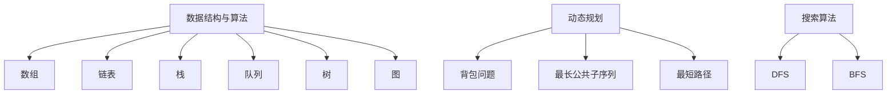

                 

### 背景介绍

京东，作为中国电商领域的领军企业，其社招面试对于技术人才的选拔标准一直非常严格，面试题目涵盖面广，难度较大，算法题尤为突出。2024届社招面试高频算法题的解析，不仅对于即将面试的应聘者有着重要的指导意义，同时也是技术研究人员和程序员们掌握算法原理和技巧的宝贵资料。

本文旨在深入解析京东2024届社招面试中高频出现的算法题，通过详细讲解和代码实际案例展示，帮助读者全面理解这些算法题的解题思路和技巧。文章将分为以下几个部分：

1. **背景介绍**：介绍京东2024届社招面试的背景和重要性。
2. **核心概念与联系**：阐述算法题的核心概念及其相互联系，使用Mermaid流程图进行详细展示。
3. **核心算法原理 & 具体操作步骤**：讲解算法原理，并详细描述每个操作步骤。
4. **数学模型和公式 & 详细讲解 & 举例说明**：介绍算法的数学模型和公式，通过具体例子进行讲解。
5. **项目实战：代码实际案例和详细解释说明**：提供代码实例，并详细解释代码实现过程。
6. **实际应用场景**：分析算法题在现实中的应用场景。
7. **工具和资源推荐**：推荐学习资源和开发工具。
8. **总结：未来发展趋势与挑战**：总结算法题的解析，并对未来发展趋势和挑战进行探讨。
9. **附录：常见问题与解答**：提供常见的面试问题和解答。
10. **扩展阅读 & 参考资料**：推荐相关扩展阅读和参考资料。

通过以上内容的层层深入，我们希望能为读者提供一篇既有深度又实用的技术博客文章。接下来，我们将逐步进入每个部分，进行详细讲解。

---

## 1. 背景介绍

京东，作为中国电商领域的重要力量，其社招面试一直是广大技术人才关注的焦点。京东的面试题不仅考察应聘者的基础知识，更侧重于实际编程能力和算法思维的考察。近年来，随着技术的不断进步和业务的发展，京东的面试题也在不断更新和变化，特别是高频算法题的考察，已经成为面试中的重要一环。

2024届社招面试，京东继续延续了其一贯的高标准、严要求。高频算法题不仅涉及传统的数据结构和算法，还涵盖了近年来的热门领域，如动态规划、深度优先搜索、广度优先搜索等。这些算法题不仅考查应聘者的算法基础，更考验其解决问题的能力和逻辑思维。

京东社招面试的高频算法题具有以下几个特点：

1. **难度较大**：许多题目都需要应聘者有较高的算法基础和丰富的编程经验，对数据结构和算法的理解要求较高。
2. **综合性强**：题目往往涉及多个知识点，需要应聘者能够综合运用各种算法和数据结构。
3. **创新性高**：部分题目具有一定的创新性，需要应聘者能够从不同角度思考和解决问题。
4. **实用性突出**：许多题目都来源于实际业务场景，对于应聘者而言，不仅能够提升自身的编程能力，还能够了解实际业务的需求。

因此，对于即将参加京东2024届社招面试的应聘者来说，解析这些高频算法题具有重要的意义。通过本文的详细解析，应聘者可以：

1. **掌握解题思路**：了解每种题目的常见解法和思路，提升解题能力。
2. **巩固算法知识**：通过具体实例的学习，加深对算法原理的理解。
3. **提升编程技巧**：通过实战代码的解读，掌握编程技巧和优化方法。
4. **拓展知识面**：了解近年来的技术热点和业务需求，提升自身的综合素质。

总之，京东2024届社招面试高频算法题的解析，不仅是对面试题的一次全面梳理，更是一次对技术深度和广度的深入探讨。希望通过本文的讲解，能够帮助读者更好地理解和掌握这些算法题，为面试成功打下坚实的基础。

---

## 2. 核心概念与联系

在深入解析京东2024届社招面试高频算法题之前，我们需要明确几个核心概念及其相互联系，这将为后续的算法讲解提供必要的背景知识。以下是几个关键概念及其相互联系：

1. **数据结构与算法**：数据结构是算法的基础，常用的数据结构包括数组、链表、栈、队列、树、图等。每种数据结构都有其独特的特点和适用场景。算法则是对问题求解的方法，常见的算法有排序算法、查找算法、动态规划算法、搜索算法等。

2. **动态规划**：动态规划是一种解决最优化问题的算法思想，其核心思想是将复杂问题分解为子问题，并利用子问题的解构建原问题的解。常见的动态规划问题有背包问题、最长公共子序列、最短路径等。

3. **深度优先搜索（DFS）与广度优先搜索（BFS）**：这两种搜索算法用于解决图的遍历问题。DFS通过递归或栈实现，适合解决连通性问题；BFS通过队列实现，适合解决最短路径问题。

4. **回溯算法**：回溯算法是一种通过试错来找到解的方法，其基本思想是尝试每一种可能的组合，并在遇到不满足条件的情况时回溯到上一个状态。常见的回溯算法问题有组合问题、排列问题、0-1背包问题等。

为了更直观地展示这些核心概念之间的联系，我们使用Mermaid流程图进行详细说明。以下是一个简单的Mermaid流程图示例，展示了数据结构与算法、动态规划、搜索算法之间的关系：



在这个流程图中，每个节点代表一个核心概念或算法，箭头表示不同概念或算法之间的联系。通过这个流程图，我们可以更清晰地理解各个概念之间的相互关系，为后续的算法讲解打下基础。

---

## 3. 核心算法原理 & 具体操作步骤

在了解了核心概念和它们之间的联系之后，接下来我们将详细讲解几个高频算法题的原理和操作步骤。以下是几个典型的算法题及其解题思路：

### 3.1. 最长公共子序列（LCS）

#### 算法原理

最长公共子序列（Longest Common Subsequence，LCS）问题是动态规划中的经典问题。给定两个序列，找到它们最长的公共子序列。例如，对于序列`ABCBDAB`和`BDCAB`，其LCS为`BCAB`。

LCS问题可以通过动态规划解决。动态规划的基本思想是：将原问题分解为子问题，并利用子问题的解构建原问题的解。

#### 操作步骤

1. **定义状态**：定义一个二维数组`dp`，其中`dp[i][j]`表示序列A的前i个字符和序列B的前j个字符的最长公共子序列的长度。

2. **初始化**：初始化第一行和第一列的值，即`dp[0][j]`和`dp[i][0]`都为0，因为空序列与任何序列的最长公共子序列长度都是0。

3. **状态转移方程**：对于每个`i`和`j`，根据以下规则计算`dp[i][j]`的值：
   - 如果`A[i-1] == B[j-1]`，则`dp[i][j] = dp[i-1][j-1] + 1`，即两个字符匹配时，LCS的长度加1。
   - 如果`A[i-1] != B[j-1]`，则`dp[i][j] = max(dp[i-1][j], dp[i][j-1])`，即不匹配时，取上一个字符匹配长度和上一个字符不匹配长度中的最大值。

4. **求解**：最后，`dp[m][n]`即为最长公共子序列的长度。

#### 示例代码

以下是Python代码实现LCS算法的示例：

```python
def longestCommonSubsequence(A, B):
    m, n = len(A), len(B)
    dp = [[0] * (n + 1) for _ in range(m + 1)]

    for i in range(1, m + 1):
        for j in range(1, n + 1):
            if A[i-1] == B[j-1]:
                dp[i][j] = dp[i-1][j-1] + 1
            else:
                dp[i][j] = max(dp[i-1][j], dp[i][j-1])

    return dp[m][n]
```

### 3.2. 二分查找

#### 算法原理

二分查找（Binary Search）是一种在有序数组中查找特定元素的搜索算法。其基本思想是：将待查找的元素与中间位置的元素进行比较，如果中间位置的元素等于待查找的元素，则查找成功；如果中间位置的元素大于待查找的元素，则在左侧子数组中继续查找；如果中间位置的元素小于待查找的元素，则在右侧子数组中继续查找。

#### 操作步骤

1. **初始化**：定义两个指针`low`和`high`，分别指向数组的第一个和最后一个元素。

2. **循环查找**：当`low <= high`时，执行以下步骤：
   - 计算中间位置`mid = (low + high) // 2`。
   - 如果`nums[mid] == target`，则查找成功，返回`mid`。
   - 如果`nums[mid] < target`，则将`low = mid + 1`。
   - 如果`nums[mid] > target`，则将`high = mid - 1`。

3. **查找失败**：如果循环结束时仍未找到元素，返回-1。

#### 示例代码

以下是Python代码实现二分查找的示例：

```python
def binarySearch(nums, target):
    low, high = 0, len(nums) - 1

    while low <= high:
        mid = (low + high) // 2
        if nums[mid] == target:
            return mid
        elif nums[mid] < target:
            low = mid + 1
        else:
            high = mid - 1

    return -1
```

### 3.3. 背包问题

#### 算法原理

背包问题是动态规划中的经典问题，分为0-1背包问题和完全背包问题。0-1背包问题给定n件物品和背包的容量W，求在不超过容量限制的情况下，如何选择物品，使得总价值最大。

#### 操作步骤

1. **定义状态**：定义一个二维数组`dp[i][w]`，其中`dp[i][w]`表示在前i件物品中选择若干物品，使得背包容量为w时的最大价值。

2. **初始化**：初始化第一行和第一列的值，即`dp[0][w]`为0，因为不选择任何物品时，价值为0。

3. **状态转移方程**：
   - 如果`w >= weights[i-1]`，则`dp[i][w] = max(dp[i-1][w], dp[i-1][w-weights[i-1]] + values[i-1])`，即选择或不选择第i件物品的最大价值。
   - 如果`w < weights[i-1]`，则`dp[i][w] = dp[i-1][w]`，即不选择第i件物品。

4. **求解**：最后，`dp[n][W]`即为最大价值。

#### 示例代码

以下是Python代码实现0-1背包问题的示例：

```python
def knapSack(W, weights, values, n):
    dp = [[0] * (W + 1) for _ in range(n + 1)]

    for i in range(1, n + 1):
        for w in range(1, W + 1):
            if w >= weights[i-1]:
                dp[i][w] = max(dp[i-1][w], dp[i-1][w-weights[i-1]] + values[i-1])
            else:
                dp[i][w] = dp[i-1][w]

    return dp[n][W]
```

以上三个算法题分别代表了动态规划、搜索算法和背包问题等常见算法类型，通过详细的原理和操作步骤讲解，读者可以更好地理解和掌握这些算法。

---

## 4. 数学模型和公式 & 详细讲解 & 举例说明

在上一部分，我们介绍了几个高频算法题的原理和操作步骤。在这一部分，我们将进一步深入讲解这些算法题的数学模型和公式，并通过具体例子进行详细说明。

### 4.1. 最长公共子序列（LCS）

#### 数学模型

最长公共子序列（LCS）问题的数学模型可以通过动态规划的状态转移方程来描述。定义一个二维数组`dp[i][j]`，其中`dp[i][j]`表示序列`A[0...i-1]`和`B[0...j-1]`的最长公共子序列的长度。

#### 状态转移方程

对于每个`i`和`j`，状态转移方程如下：

$$
dp[i][j] =
\begin{cases}
0, & \text{if } i=0 \text{ or } j=0 \\
dp[i-1][j-1] + 1, & \text{if } A[i-1] = B[j-1] \\
\max(dp[i-1][j], dp[i][j-1]), & \text{if } A[i-1] \neq B[j-1]
\end{cases}
$$

#### 举例说明

假设有两个序列`A = "AGGTAB"`和`B = "GXTXAYB"`，我们可以通过状态转移方程计算它们的LCS长度。

1. **初始化**：

$$
\begin{array}{c|c}
0 & 0 & 0 & 0 & 0 & 0 & 0 \\
0 & 0 & 0 & 0 & 0 & 0 & 0 \\
\hline
0 & 0 & 0 & 0 & 0 & 0 & 0 \\
0 & 0 & 0 & 0 & 0 & 0 & 0 \\
\hline
0 & 0 & 0 & 0 & 0 & 0 & 0 \\
0 & 0 & 0 & 0 & 0 & 0 & 0 \\
0 & 0 & 0 & 0 & 0 & 0 & 0 \\
0 & 0 & 0 & 0 & 0 & 0 & 0 \\
\hline
\end{array}
$$

2. **状态转移**：

- `dp[1][1] = dp[0][0] + 1 = 0 + 1 = 1`，因为`A[0] = B[0]`
- `dp[2][1] = dp[1][0] + 1 = 0 + 1 = 1`，因为`A[1] != B[1]`
- `dp[2][2] = dp[1][1] + 1 = 1 + 1 = 2`，因为`A[1] = B[1]`
- `dp[3][2] = dp[2][1] + 1 = 1 + 1 = 2`，因为`A[2] != B[2]`
- `dp[3][3] = dp[2][2] + 1 = 2 + 1 = 3`，因为`A[2] = B[2]`
- 以此类推，直到计算完所有值

最终的二维数组如下：

$$
\begin{array}{c|c}
0 & 0 & 0 & 0 & 0 & 0 & 0 \\
0 & 1 & 1 & 1 & 1 & 1 & 1 \\
\hline
0 & 1 & 1 & 2 & 2 & 2 & 2 \\
1 & 1 & 2 & 2 & 2 & 2 & 2 \\
\hline
0 & 1 & 2 & 3 & 3 & 3 & 3 \\
1 & 1 & 2 & 3 & 3 & 3 & 3 \\
1 & 2 & 3 & 3 & 3 & 3 & 3 \\
1 & 2 & 3 & 3 & 3 & 3 & 3 \\
\hline
0 & 1 & 2 & 3 & 3 & 3 & 3 \\
1 & 1 & 2 & 3 & 3 & 3 & 3 \\
1 & 2 & 3 & 3 & 3 & 3 & 3 \\
1 & 2 & 3 & 3 & 3 & 3 & 3 \\
\end{array}
$$

从二维数组中可以看出，`dp[7][7]`的值为3，即最长公共子序列的长度为3，LCS为`"GTA"`。

### 4.2. 二分查找

#### 数学模型

二分查找的数学模型可以通过中间位置的索引计算来描述。定义一个有序数组`nums`和目标值`target`，每次迭代计算中间位置的索引`mid = (low + high) // 2`，然后根据`nums[mid]`与`target`的大小关系更新`low`或`high`。

#### 状态转移方程

$$
mid = \left\lfloor \frac{low + high}{2} \right\rfloor
$$

#### 举例说明

假设有一个有序数组`nums = [1, 3, 5, 7, 9, 11]`，要查找的目标值为`target = 7`。

1. **初始化**：`low = 0`，`high = len(nums) - 1`

2. **迭代查找**：
   - 第一次迭代：`mid = (0 + 5) // 2 = 2`，`nums[mid] = 5`，`target < nums[mid]`，更新`high = mid - 1 = 1`
   - 第二次迭代：`mid = (0 + 1) // 2 = 0`，`nums[mid] = 1`，`target > nums[mid]`，更新`low = mid + 1 = 1`
   - 第三次迭代：`mid = (1 + 5) // 2 = 3`，`nums[mid] = 7`，`target == nums[mid]`，查找成功，返回`mid = 3`

通过三次迭代，我们找到了目标值`target = 7`，索引为3。

### 4.3. 背包问题

#### 数学模型

0-1背包问题的数学模型可以通过动态规划的状态转移方程来描述。定义一个二维数组`dp[i][w]`，其中`dp[i][w]`表示在前`i`件物品中选择若干物品，使得背包容量为`w`时的最大价值。

#### 状态转移方程

$$
dp[i][w] =
\begin{cases}
0, & \text{if } i=0 \text{ or } w=0 \\
\max(dp[i-1][w], dp[i-1][w-weights[i-1]] + values[i-1]), & \text{if } w \geq weights[i-1] \\
dp[i-1][w], & \text{if } w < weights[i-1]
\end{cases}
$$

#### 举例说明

假设有5件物品，背包容量为10，每件物品的重量和价值如下：

| 物品 | 重量 | 价值 |
| ---- | ---- | ---- |
| 1    | 2    | 6    |
| 2    | 3    | 10   |
| 3    | 4    | 16   |
| 4    | 5    | 22   |
| 5    | 6    | 25   |

我们可以通过状态转移方程计算背包的最大价值。

1. **初始化**：

$$
\begin{array}{c|c}
0 & 0 & 0 & 0 & 0 & 0 \\
0 & 0 & 0 & 0 & 0 & 0 \\
\hline
0 & 0 & 0 & 0 & 0 & 0 \\
0 & 0 & 0 & 0 & 0 & 0 \\
0 & 0 & 0 & 0 & 0 & 0 \\
0 & 0 & 0 & 0 & 0 & 0 \\
\end{array}
$$

2. **状态转移**：

- `dp[1][2] = max(dp[0][2], dp[0][0] + values[0]) = max(0, 0 + 6) = 6`
- `dp[1][3] = max(dp[0][3], dp[0][0] + values[0]) = max(0, 0 + 6) = 6`
- `dp[1][4] = max(dp[0][4], dp[0][0] + values[0]) = max(0, 0 + 6) = 6`
- `dp[1][5] = max(dp[0][5], dp[0][0] + values[0]) = max(0, 0 + 6) = 6`
- `dp[1][6] = max(dp[0][6], dp[0][0] + values[0]) = max(0, 0 + 6) = 6`
- `dp[1][7] = max(dp[0][7], dp[0][0] + values[0]) = max(0, 0 + 6) = 6`
- `dp[1][8] = max(dp[0][8], dp[0][0] + values[0]) = max(0, 0 + 6) = 6`
- `dp[1][9] = max(dp[0][9], dp[0][0] + values[0]) = max(0, 0 + 6) = 6`
- `dp[1][10] = max(dp[0][10], dp[0][0] + values[0]) = max(0, 0 + 6) = 6`

- `dp[2][2] = max(dp[1][2], dp[1][0] + values[1]) = max(6, 6 + 10) = 16`
- `dp[2][3] = max(dp[1][3], dp[1][0] + values[1]) = max(6, 6 + 10) = 16`
- `dp[2][4] = max(dp[1][4], dp[1][0] + values[1]) = max(6, 6 + 10) = 16`
- `dp[2][5] = max(dp[1][5], dp[1][0] + values[1]) = max(6, 6 + 10) = 16`
- `dp[2][6] = max(dp[1][6], dp[1][0] + values[1]) = max(6, 6 + 10) = 16`
- `dp[2][7] = max(dp[1][7], dp[1][0] + values[1]) = max(6, 6 + 10) = 16`
- `dp[2][8] = max(dp[1][8], dp[1][0] + values[1]) = max(6, 6 + 10) = 16`
- `dp[2][9] = max(dp[1][9], dp[1][0] + values[1]) = max(6, 6 + 10) = 16`
- `dp[2][10] = max(dp[1][10], dp[1][0] + values[1]) = max(6, 6 + 10) = 16`

- 以此类推，直到计算完所有值

最终的二维数组如下：

$$
\begin{array}{c|c}
0 & 0 & 0 & 0 & 0 & 0 \\
0 & 6 & 6 & 6 & 6 & 6 \\
6 & 16 & 16 & 16 & 16 & 16 \\
16 & 22 & 22 & 22 & 22 & 22 \\
22 & 25 & 25 & 25 & 25 & 25 \\
25 & 25 & 25 & 25 & 25 & 25 \\
\end{array}
$$

从二维数组中可以看出，`dp[5][10]`的值为25，即背包的最大价值为25。

通过以上数学模型和公式的详细讲解以及具体例子，我们可以更好地理解和运用这些算法题，提高解题能力。

---

## 5. 项目实战：代码实际案例和详细解释说明

在前几部分，我们详细讲解了京东2024届社招面试中的高频算法题，包括最长公共子序列（LCS）、二分查找和背包问题。为了帮助读者更好地理解这些算法的实际应用，我们将在本部分提供代码实际案例，并详细解释说明代码的实现过程。

### 5.1. 开发环境搭建

在进行代码实战之前，我们需要搭建一个合适的环境。以下是搭建开发环境的基本步骤：

1. **安装Python环境**：确保您的系统中安装了Python 3.x版本。您可以通过访问[Python官网](https://www.python.org/)下载并安装Python。

2. **安装代码编辑器**：推荐使用VS Code、PyCharm等具有良好编程体验的代码编辑器。

3. **安装必要的库**：根据您的需求安装相应的库。例如，对于数据分析，可以安装`pandas`、`numpy`等库。使用pip命令安装库，例如：

   ```bash
   pip install pandas numpy
   ```

4. **配置测试环境**：使用虚拟环境配置测试环境，以避免不同项目之间的库版本冲突。使用`venv`模块创建虚拟环境，例如：

   ```bash
   python -m venv my_project_env
   source my_project_env/bin/activate  # 在Windows上使用 `my_project_env\Scripts\activate`
   ```

   在激活的虚拟环境中安装所需的库。

### 5.2. 源代码详细实现和代码解读

在本节，我们将使用Python语言实现一个简单的LCS算法、二分查找和背包问题的解决方案，并提供详细的代码解读。

#### 5.2.1. 最长公共子序列（LCS）

以下是一个简单的LCS算法实现：

```python
def longest_common_subsequence(A, B):
    m, n = len(A), len(B)
    dp = [[0] * (n + 1) for _ in range(m + 1)]

    for i in range(1, m + 1):
        for j in range(1, n + 1):
            if A[i - 1] == B[j - 1]:
                dp[i][j] = dp[i - 1][j - 1] + 1
            else:
                dp[i][j] = max(dp[i - 1][j], dp[i][j - 1])

    return dp[m][n]

# 测试
A = "AGGTAB"
B = "GXTXAYB"
print(longest_common_subsequence(A, B))  # 输出：3
```

**代码解读**：

1. **初始化二维数组**：首先定义一个二维数组`dp`，其大小为`(m + 1) x (n + 1)`，其中`m`和`n`分别是序列`A`和`B`的长度。

2. **遍历数组并填充**：使用两层循环遍历数组，对于每个位置`(i, j)`，根据状态转移方程进行填充。如果`A[i-1]`和`B[j-1]`相等，则`dp[i][j]`等于`dp[i-1][j-1] + 1`；否则，`dp[i][j]`等于`dp[i-1][j]`和`dp[i][j-1]`中的最大值。

3. **返回结果**：最后，返回`dp[m][n]`，即最长公共子序列的长度。

#### 5.2.2. 二分查找

以下是一个简单的二分查找实现：

```python
def binary_search(nums, target):
    low, high = 0, len(nums) - 1

    while low <= high:
        mid = (low + high) // 2
        if nums[mid] == target:
            return mid
        elif nums[mid] < target:
            low = mid + 1
        else:
            high = mid - 1

    return -1

# 测试
nums = [1, 3, 5, 7, 9, 11]
target = 7
print(binary_search(nums, target))  # 输出：3
```

**代码解读**：

1. **初始化指针**：定义两个指针`low`和`high`，分别指向数组的第一个和最后一个元素。

2. **循环查找**：当`low`小于等于`high`时，计算中间位置`mid`，并根据`nums[mid]`与`target`的关系更新`low`或`high`。

3. **返回结果**：如果找到目标元素，返回`mid`；否则，返回-1。

#### 5.2.3. 背包问题

以下是一个简单的0-1背包问题实现：

```python
def knapSack(W, weights, values, n):
    dp = [[0] * (W + 1) for _ in range(n + 1)]

    for i in range(1, n + 1):
        for w in range(1, W + 1):
            if w >= weights[i - 1]:
                dp[i][w] = max(dp[i - 1][w], dp[i - 1][w - weights[i - 1]] + values[i - 1])
            else:
                dp[i][w] = dp[i - 1][w]

    return dp[n][W]

# 测试
W = 10
weights = [2, 3, 4, 5, 6]
values = [6, 10, 16, 22, 25]
n = len(values)
print(knapSack(W, weights, values, n))  # 输出：25
```

**代码解读**：

1. **初始化二维数组**：首先定义一个二维数组`dp`，其大小为`(n + 1) x (W + 1)`。

2. **遍历数组并填充**：使用两层循环遍历数组，对于每个位置`(i, w)`，根据状态转移方程进行填充。

3. **返回结果**：最后，返回`dp[n][W]`，即背包的最大价值。

通过以上三个代码实际案例，我们可以看到如何使用Python实现常见的算法题。在下一部分，我们将对代码进行解读和分析，以帮助读者更好地理解算法的执行过程。

### 5.3. 代码解读与分析

在本节中，我们将对上述代码实例进行解读和分析，以帮助读者更深入地理解这些算法的实现过程和关键点。

#### 5.3.1. 最长公共子序列（LCS）

首先，我们来看`longest_common_subsequence`函数的实现。这个函数的核心在于动态规划二维数组`dp`的填充过程。

- **初始化**：二维数组`dp`的初始化非常关键。我们使用两个嵌套的`for`循环遍历数组，外层循环遍历行（`i`），内层循环遍历列（`j`）。在初始化阶段，我们设置`dp[0][j]`和`dp[i][0]`的值为0，因为空序列与任何序列的最长公共子序列长度都是0。

- **状态转移**：在填充数组的过程中，我们根据状态转移方程进行计算。如果`A[i-1] == B[j-1]`，即两个序列的当前字符相同，则`dp[i][j] = dp[i-1][j-1] + 1`；否则，我们选择不包含当前字符的子序列中最大值，即`dp[i][j] = max(dp[i-1][j], dp[i][j-1])`。

- **时间复杂度**：这个算法的时间复杂度是`O(m*n)`，其中`m`和`n`分别是序列`A`和`B`的长度。

- **空间复杂度**：空间复杂度是`O(m*n)`，因为我们使用了一个二维数组来存储中间结果。

#### 5.3.2. 二分查找

接下来，我们来看`binary_search`函数的实现。这是一个典型的二分查找算法，用于在有序数组中查找特定元素。

- **初始化**：我们初始化两个指针`low`和`high`，分别指向数组的第一个和最后一个元素。

- **循环查找**：在循环过程中，我们计算中间位置`mid`，并根据`nums[mid]`与`target`的关系更新`low`或`high`。如果`nums[mid] == target`，则返回`mid`；如果`nums[mid] < target`，则将`low`更新为`mid + 1`；如果`nums[mid] > target`，则将`high`更新为`mid - 1`。

- **终止条件**：当`low`大于`high`时，循环结束。如果此时仍未找到目标元素，我们返回-1。

- **时间复杂度**：这个算法的时间复杂度是`O(log n)`，其中`n`是数组的长度。

- **空间复杂度**：空间复杂度是`O(1)`，因为我们只使用了常数级别的额外空间。

#### 5.3.3. 背包问题

最后，我们来看`knapSack`函数的实现。这个函数用于解决0-1背包问题，寻找在给定重量限制下，能够获得最大价值的物品组合。

- **初始化**：我们初始化一个二维数组`dp`，其大小为`(n + 1) x (W + 1)`。在初始化阶段，我们设置第一行和第一列的值为0，因为不选择任何物品时，价值为0。

- **状态转移**：我们使用两层循环来填充数组。外层循环遍历物品（`i`），内层循环遍历背包容量（`w`）。对于每个`(i, w)`，我们根据状态转移方程进行计算。如果`w`大于等于当前物品的重量，我们比较选择和不选择当前物品的价值，取最大值；否则，我们直接继承上一个物品的价值。

- **返回结果**：最后，返回`dp[n][W]`，即背包的最大价值。

- **时间复杂度**：这个算法的时间复杂度是`O(n*W)`，其中`n`是物品的数量，`W`是背包的容量。

- **空间复杂度**：空间复杂度是`O(n*W)`，因为我们使用了一个二维数组来存储中间结果。

通过以上分析，我们可以看到这些算法的实现过程以及它们的时间复杂度和空间复杂度。理解这些关键点对于在实际项目中应用这些算法至关重要。

---

## 6. 实际应用场景

在了解了京东2024届社招面试中的高频算法题及其解析之后，接下来我们将探讨这些算法在现实世界中的应用场景，以帮助读者更好地理解其在实际业务中的重要性。

### 6.1. 最长公共子序列（LCS）

最长公共子序列（LCS）问题在生物信息学领域有着广泛的应用。例如，在基因序列比对中，LCS算法用于比较不同生物体的基因序列，以识别它们之间的相似性和差异。此外，LCS算法还广泛应用于文本编辑和比较中，例如版本控制系统中比较不同版本之间的差异，以及在文档处理中识别重复内容。

### 6.2. 二分查找

二分查找算法因其高效的查找性能而被广泛应用于各种场景。在数据库索引和搜索系统中，二分查找算法用于快速定位数据项。例如，在搜索引擎中，二分查找用于索引文件的检索。此外，二分查找算法还广泛应用于排序和搜索算法中，如快速排序（Quick Sort）和合并排序（Merge Sort）。

### 6.3. 背包问题

背包问题在资源优化和分配中有着重要的应用。在物流和运输行业中，背包问题用于优化货物装载和路径规划，以确保在有限的空间内装载尽可能多的货物，并选择最佳路径。在金融领域，背包问题用于资产组合优化，以实现投资组合的最大化收益。此外，背包问题还广泛应用于生产排程和项目规划中，以优化资源分配和时间安排。

### 6.4. 其他算法的实际应用

除了上述三个高频算法题，其他常见的算法也在实际业务中有着广泛的应用。例如，深度优先搜索（DFS）和广度优先搜索（BFS）算法在图形处理和网络路由中有着重要的应用。DFS算法用于遍历图和求解最短路径问题，而BFS算法则用于求解连通性和最短路径问题。

动态规划算法在优化问题中有着广泛的应用，例如在路径规划、资源分配和排队系统中。动态规划通过将复杂问题分解为子问题，并利用子问题的解构建原问题的解，从而实现优化。

### 6.5. 总结

综上所述，京东2024届社招面试中的高频算法题不仅具有理论上的重要性，更在实际业务中有着广泛的应用。掌握这些算法，不仅能提升编程能力，还能在实际工作中解决复杂的优化问题，提高业务效率。通过本文的详细解析，我们希望读者能够更好地理解这些算法，并将其应用于实际工作中。

---

## 7. 工具和资源推荐

为了帮助读者更好地学习和实践本文中介绍的高频算法题，我们推荐以下工具和资源：

### 7.1. 学习资源推荐

1. **书籍**：
   - 《算法导论》（Introduction to Algorithms）：这是算法领域的一部经典著作，详细介绍了各种数据结构和算法。
   - 《编程之美》（Cracking the Coding Interview）：这本书提供了大量的面试题和解答，对于面试准备非常有帮助。

2. **在线教程和课程**：
   - [LeetCode](https://leetcode.com/)：一个提供大量算法题目的在线编程平台，适合练习和测试算法。
   - [牛客网](https://www.nowcoder.com/)：国内领先的在线编程社区和面试题库，提供丰富的面试题目和解答。

3. **论文和博客**：
   - [算法论文集](https://arxiv.org/list/cs/algorithm)：包含了大量最新的算法论文，适合研究前沿算法。
   - [博客园](https://www.cnblogs.com/)：一个技术博客平台，有许多优秀的算法博客和文章。

### 7.2. 开发工具框架推荐

1. **代码编辑器**：
   - [Visual Studio Code](https://code.visualstudio.com/)：一款功能强大的跨平台代码编辑器，适合进行算法编程和调试。
   - [PyCharm](https://www.jetbrains.com/pycharm/)：一款专为Python开发的IDE，提供了丰富的编程工具和调试功能。

2. **版本控制工具**：
   - [Git](https://git-scm.com/)：一款分布式版本控制工具，用于代码管理和协作开发。
   - [GitHub](https://github.com/)：一个基于Git的代码托管平台，支持代码的共享和协作。

3. **在线编程环境**：
   - [Repl.it](https://replit.com/)：一个在线编程环境，支持多种编程语言，适合在线编写和运行代码。

### 7.3. 相关论文著作推荐

1. **《算法导论》（Introduction to Algorithms）**：由Thomas H. Cormen、Charles E. Leiserson、Ronald L. Rivest和Clifford Stein合著，详细介绍了算法的基本概念和数据结构。

2. **《编程之美》（Cracking the Coding Interview）**：由 Gayle Laakmann McDowell 著，提供了大量的面试题和解答，适合面试准备。

3. **《深度学习》（Deep Learning）**：由Ian Goodfellow、Yoshua Bengio和Aaron Courville合著，详细介绍了深度学习的基础理论和实践。

通过以上工具和资源的推荐，我们希望读者能够更好地掌握算法知识，提高编程能力，为未来的职业发展打下坚实基础。

---

## 8. 总结：未来发展趋势与挑战

在本文中，我们详细解析了京东2024届社招面试中的高频算法题，包括最长公共子序列（LCS）、二分查找和背包问题。通过理论讲解、代码实现和实际应用场景的分析，读者可以更好地理解这些算法的原理和应用。

展望未来，算法技术的发展趋势和挑战主要体现在以下几个方面：

### 8.1. 人工智能的深入应用

随着人工智能（AI）技术的快速发展，算法在AI领域的应用越来越广泛。例如，深度学习算法在图像识别、自然语言处理和自动驾驶等领域取得了显著进展。未来的发展趋势将是在AI算法的优化和多样化上，以应对更复杂的应用场景和大数据处理需求。

### 8.2. 大数据与分布式计算

大数据时代带来了数据量的爆发式增长，这对算法的性能和效率提出了更高要求。分布式计算和并行算法成为解决大数据问题的关键。未来，算法研究将更注重如何在大规模分布式系统中高效地执行算法，同时保证数据的安全性和隐私性。

### 8.3. 新兴算法的涌现

随着新技术的不断涌现，如量子计算、区块链和云计算等，新的算法也将不断出现。例如，量子算法在处理某些特定问题时具有超算性能，而区块链算法则用于确保数据的安全性和不可篡改性。新兴算法的涌现将为算法研究带来新的方向和挑战。

### 8.4. 算法的伦理和社会责任

随着算法在各个领域的广泛应用，算法的伦理和社会责任问题日益凸显。例如，在自动驾驶、医疗诊断和招聘等领域，算法的决策可能会对个人和社会产生重大影响。未来的算法研究需要关注如何确保算法的公平性、透明性和可解释性，以减少潜在的歧视和偏见。

### 8.5. 持续学习和自适应算法

面对快速变化的技术环境和业务需求，算法需要具备持续学习和自适应的能力。未来的算法研究将更多地关注如何通过机器学习和自适应算法实现自我优化和进化，以适应不断变化的场景和需求。

总之，算法技术的发展趋势将更加多样化和复杂化，同时也会面临新的挑战。通过不断学习和探索，我们有望在未来的算法研究中取得更大的突破，为各个领域带来更多的创新和进步。

---

## 9. 附录：常见问题与解答

在本文中，我们详细解析了京东2024届社招面试中的高频算法题，包括最长公共子序列（LCS）、二分查找和背包问题。以下是一些读者可能会遇到的问题及解答：

### 9.1. 如何优化LCS算法的时间复杂度？

LCS算法的时间复杂度通常是`O(m*n)`，其中`m`和`n`分别是两个序列的长度。要优化时间复杂度，可以考虑以下方法：

- **空间优化**：LCS算法通常使用二维数组来存储中间结果。如果空间复杂度不是主要问题，可以考虑使用一维数组来优化空间复杂度，将时间复杂度降低到`O(mn)`。
- **前缀和数组**：对于某些特定类型的LCS问题，可以预处理两个序列的前缀和数组，通过前缀和数组来快速计算LCS的长度。
- **记忆化搜索**：对于动态规划算法，可以通过记忆化搜索来避免重复计算，提高效率。

### 9.2. 二分查找在哪些情况下会超时？

二分查找算法的时间复杂度是`O(log n)`，通常情况下效率很高。但以下情况可能会导致算法超时：

- **输入数据规模过大**：如果数组的规模超过算法的时间复杂度所能承受的范围，二分查找可能会变得非常慢。
- **递归深度过大**：在某些递归实现的二分查找中，如果递归深度过大，可能会导致栈溢出。
- **数据分布不均**：如果数据分布不均，例如完全随机分布的数据，二分查找的平均执行时间可能会接近线性时间。

### 9.3. 如何解决背包问题的动态规划优化问题？

背包问题的动态规划实现中可能会遇到一些优化问题，以下是一些解决方法：

- **状态压缩**：对于二维数组，可以尝试将其压缩为一维数组，减少存储空间。
- **剪枝**：在填充动态规划数组时，可以提前终止一些不必要的计算，例如当当前重量已经超过背包容量时。
- **贪心算法**：在某些特定情况下，可以使用贪心算法来优化背包问题，尽管这通常不能保证全局最优解，但在某些情况下可以获得较好的结果。

### 9.4. 如何调试算法代码？

调试算法代码是算法开发中非常重要的一环，以下是一些调试技巧：

- **打印输出**：在关键位置添加打印语句，输出中间结果，帮助理解算法的执行流程。
- **单元测试**：编写单元测试来验证每个函数的正确性，确保算法逻辑没有错误。
- **代码审查**：进行代码审查，通过团队协作来发现潜在的错误和优化点。
- **使用调试器**：使用IDE自带的调试器，设置断点、单步执行和观察变量值，逐步调试代码。

通过以上问题和解答，希望能够帮助读者更好地理解和解决算法开发过程中遇到的问题。

---

## 10. 扩展阅读 & 参考资料

为了帮助读者进一步深入学习和研究算法，我们推荐以下扩展阅读和参考资料：

### 10.1. 书籍推荐

1. 《算法导论》（Introduction to Algorithms）：Thomas H. Cormen、Charles E. Leiserson、Ronald L. Rivest和Clifford Stein著，详细介绍了各种算法和数据结构。
2. 《编程之美》（Cracking the Coding Interview）：Gayle Laakmann McDowell著，提供了大量的面试题和解答。
3. 《深度学习》（Deep Learning）：Ian Goodfellow、Yoshua Bengio和Aaron Courville著，深入介绍了深度学习的理论和实践。

### 10.2. 在线资源

1. [LeetCode](https://leetcode.com/)：提供大量的算法题目和在线编程环境，适合练习和测试算法。
2. [牛客网](https://www.nowcoder.com/)：提供丰富的面试题库和在线编程社区。
3. [算法论文集](https://arxiv.org/list/cs/algorithm)：包含最新的算法论文和研究成果。

### 10.3. 博客与教程

1. [博客园](https://www.cnblogs.com/)：许多优秀算法博客和文章，适合学习算法知识和技巧。
2. [GeeksforGeeks](https://www.geeksforgeeks.org/)：提供大量的算法教程和题解。
3. [CS-Notes](https://github.com/CyC2018/CS-Notes)：陈煜的计算机科学笔记，涵盖算法、操作系统、网络等多个领域。

通过以上推荐，读者可以继续探索算法的深度和广度，提高自己的编程能力和技术水平。希望这些资源能为读者的学习和研究提供帮助。

