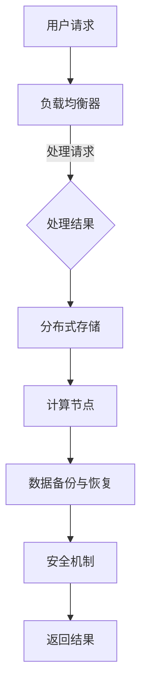

                 

### 文章标题：京东2024校招云计算平台开发工程师面试题解析

关键词：京东校招，云计算平台，面试题，解析，开发工程师

摘要：本文将对京东2024校招云计算平台开发工程师的面试题进行详细解析，帮助考生更好地准备面试，掌握核心知识点和技巧。本文分为多个部分，包括背景介绍、核心概念与联系、核心算法原理与具体操作步骤、数学模型和公式、项目实战、实际应用场景、工具和资源推荐等，内容全面且深入。

<|assistant|>### 1. 背景介绍

#### 1.1 京东校招云计算平台开发工程师岗位概述

京东校招云计算平台开发工程师岗位是面向应届毕业生的专业技术岗位，负责云计算平台的设计、开发、优化和维护。该岗位要求应聘者具备扎实的计算机专业基础，熟练掌握云计算相关技术，具备良好的编程能力和团队协作精神。在2024年，京东校招云计算平台开发工程师岗位的竞争愈发激烈，因此，充分准备面试至关重要。

#### 1.2 云计算平台开发工程师面试的重要性

云计算平台开发工程师面试是求职者进入京东的重要环节，面试质量直接影响到求职者的录取机会。面试过程中，考官会通过提问技术问题、项目经历、团队合作等方面，全面评估求职者的专业知识、技能和综合素质。因此，对于求职者来说，掌握面试技巧、熟悉面试题型和知识点，是成功通过面试的关键。

#### 1.3 本文结构

本文将按照以下结构进行讲解：

1. 核心概念与联系
2. 核心算法原理与具体操作步骤
3. 数学模型和公式
4. 项目实战
5. 实际应用场景
6. 工具和资源推荐
7. 总结：未来发展趋势与挑战
8. 附录：常见问题与解答
9. 扩展阅读 & 参考资料

通过本文的详细解析，希望考生能够对京东2024校招云计算平台开发工程师面试有更深入的了解，为面试做好充分准备。

### 2. 核心概念与联系

在云计算平台开发工程师的面试中，了解核心概念与联系是至关重要的。以下是对云计算平台开发过程中涉及的一些关键概念的介绍和联系：

#### 2.1 云计算基本概念

- **云计算**：云计算是一种基于互联网的计算模式，它允许用户通过互联网访问分布式计算资源，如服务器、存储、网络等。
- **云服务模型**：
  - **IaaS（基础设施即服务）**：提供虚拟化的计算资源，如虚拟机、存储等。
  - **PaaS（平台即服务）**：提供一个平台，用户可以在平台上开发和部署应用程序。
  - **SaaS（软件即服务）**：提供应用程序服务，用户无需关心底层基础设施。
- **云部署模型**：
  - **公有云**：由第三方提供商提供，多个用户共享资源。
  - **私有云**：为单个组织或企业提供服务，资源独享。
  - **混合云**：结合公有云和私有云，实现资源的灵活调配。

#### 2.2 虚拟化技术

- **虚拟化**：通过虚拟化技术，将物理资源抽象为虚拟资源，从而提高资源利用率和管理效率。
- **虚拟机**：虚拟化技术的核心概念，模拟物理计算机的运行环境。
- **容器**：轻量级的虚拟化技术，通过隔离和封装，实现应用程序的运行环境。

#### 2.3 分布式系统

- **分布式系统**：由多个节点组成的系统，通过通信机制协同工作。
- **一致性**：分布式系统中的一个重要概念，指多个节点上的数据保持一致。
- **容错性**：分布式系统能够在部分节点故障时保持正常运行。

#### 2.4 负载均衡

- **负载均衡**：通过分配请求到多个节点，实现系统的高可用性和高性能。
- **算法**：如轮询、最小连接数、哈希等。

#### 2.5 存储技术

- **分布式存储**：将数据分布在多个节点上，实现数据的高可用性和高扩展性。
- **对象存储**：以对象为单位存储数据，具有高扩展性和高可用性。
- **文件存储**：以文件为单位存储数据，适用于需要按目录结构访问数据的场景。

#### 2.6 安全性

- **安全性**：确保云计算平台的数据、系统和资源不受未授权访问和攻击。
- **加密**：通过加密技术保护数据的安全性。
- **身份验证和授权**：确保用户和应用程序在访问系统时具备合法身份。

### 2.6 Mermaid 流程图

以下是一个简化的云计算平台架构的 Mermaid 流程图：



在上述流程图中，用户请求通过负载均衡器分配到计算节点，计算节点处理请求后，将结果存储到分布式存储中，同时进行数据备份和恢复，并确保系统的安全性，最后返回结果给用户。

### 3. 核心算法原理与具体操作步骤

在云计算平台开发过程中，掌握核心算法原理和具体操作步骤是至关重要的。以下介绍几个常见的核心算法原理及其操作步骤：

#### 3.1 负载均衡算法

负载均衡算法用于分配请求到不同的节点，以实现系统的高可用性和高性能。以下介绍几种常见的负载均衡算法：

1. **轮询算法**：
   - **原理**：按照请求顺序依次将请求分配到各个节点。
   - **操作步骤**：
     1. 初始化节点列表。
     2. 按照顺序将请求分配到节点列表中的下一个节点。
     3. 当请求到达最后一个节点时，重新开始循环。
2. **最小连接数算法**：
   - **原理**：将请求分配到连接数最少的节点，以均衡节点的负载。
   - **操作步骤**：
     1. 初始化节点连接数。
     2. 每次请求时，选择连接数最小的节点。
     3. 更新节点的连接数。
3. **哈希算法**：
   - **原理**：使用哈希函数将请求映射到节点，以实现负载均衡。
   - **操作步骤**：
     1. 选择哈希函数。
     2. 对请求进行哈希计算。
     3. 将哈希值映射到节点。

#### 3.2 分布式一致性算法

分布式一致性算法用于确保分布式系统中多个节点上的数据保持一致。以下介绍几种常见的分布式一致性算法：

1. **Paxos算法**：
   - **原理**：通过选举领导者节点，实现多个副本之间的数据一致性。
   - **操作步骤**：
     1. 选举领导者。
     2. 提交提案。
     3. 学习提案。
2. **Raft算法**：
   - **原理**：通过日志复制和领导选举，实现多个副本之间的数据一致性。
   - **操作步骤**：
     1. 选举领导者。
     2. 日志复制。
     3. 领导者保持日志一致性。

#### 3.3 存储复制算法

存储复制算法用于将数据分布在多个节点上，以提高数据的可用性和可靠性。以下介绍几种常见的存储复制算法：

1. **主从复制**：
   - **原理**：将数据分为主节点和从节点，主节点负责处理请求，从节点负责同步数据。
   - **操作步骤**：
     1. 初始化主从节点。
     2. 主节点处理请求。
     3. 从节点同步数据。
2. **多主复制**：
   - **原理**：多个节点都可以处理请求，通过一致性算法保证数据的一致性。
   - **操作步骤**：
     1. 初始化多主节点。
     2. 每个节点都可以处理请求。
     3. 使用一致性算法保持数据一致性。

### 4. 数学模型和公式

在云计算平台开发过程中，一些数学模型和公式对于理解和优化系统性能至关重要。以下介绍几个常用的数学模型和公式：

#### 4.1 负载均衡公式

负载均衡公式用于计算每个节点的平均负载。假设有 n 个节点，每个节点的权重分别为 w1, w2, ..., wn，总请求量为 Q，则每个节点的平均负载为：

$$
L_i = \frac{Q}{\sum_{j=1}^{n} w_j}
$$

其中，Li 表示第 i 个节点的平均负载。

#### 4.2 分布式一致性算法

分布式一致性算法中的领导选举和日志复制涉及到多个节点的通信和协作，以下介绍两个常用的数学模型：

1. **Paxos算法**：

   - **领导选举**：每个节点在选举过程中发出提案，获得多数节点的支持即可成为领导者。假设有 n 个节点，领导者需要获得超过半数（n/2+1）的支持，则领导选举的概率为：

   $$
   P(\text{选举成功}) = 1 - \left(1 - \frac{1}{n}\right)^{n/2+1}
   $$

   - **日志复制**：领导者将日志条目发送给其他节点，其他节点需要学习日志条目。假设有 n 个节点，每个节点需要向领导者发送日志条目的概率为 p，则日志复制的概率为：

   $$
   P(\text{日志复制成功}) = 1 - (1 - p)^n
   $$

2. **Raft算法**：

   - **领导选举**：每个节点在选举过程中发出投票请求，获得多数节点的支持即可成为领导者。假设有 n 个节点，领导者需要获得超过半数（n/2+1）的支持，则领导选举的概率为：

   $$
   P(\text{选举成功}) = 1 - \left(1 - \frac{1}{n}\right)^{n/2+1}
   $$

   - **日志复制**：领导者将日志条目发送给其他节点，其他节点需要学习日志条目。假设有 n 个节点，每个节点需要向领导者发送日志条目的概率为 p，则日志复制的概率为：

   $$
   P(\text{日志复制成功}) = 1 - (1 - p)^n
   $$

#### 4.3 存储复制算法

存储复制算法中的数据一致性涉及到多个节点的数据同步，以下介绍一个常用的数学模型：

- **一致性概率**：假设有 n 个节点，每个节点的数据同步概率为 p，则数据一致性的概率为：

$$
P(\text{一致性}) = 1 - (1 - p)^n
$$

### 5. 项目实战：代码实际案例和详细解释说明

在本节中，我们将通过一个实际项目案例，详细讲解云计算平台开发过程中的一些关键技术和算法。该项目是一个简单的分布式存储系统，用于实现数据的存储、同步和一致性。

#### 5.1 开发环境搭建

在开始项目实战之前，首先需要搭建开发环境。以下是一个基本的开发环境搭建步骤：

1. 安装操作系统：推荐使用 Ubuntu 18.04 或更高版本。
2. 安装 Java 开发环境：使用 JDK 1.8 或更高版本。
3. 安装 Maven：用于项目构建和依赖管理。
4. 安装 Git：用于版本控制和协作开发。

#### 5.2 源代码详细实现和代码解读

以下是该分布式存储系统的源代码实现和代码解读：

```java
// DistributedStorage.java
import java.util.concurrent.CopyOnWriteArrayList;

public class DistributedStorage {
    private CopyOnWriteArrayList<Node> nodes;

    public DistributedStorage() {
        nodes = new CopyOnWriteArrayList<>();
    }

    public void addNode(Node node) {
        nodes.add(node);
    }

    public void removeNode(Node node) {
        nodes.remove(node);
    }

    public void store(String key, String value) {
        for (Node node : nodes) {
            node.store(key, value);
        }
    }

    public String retrieve(String key) {
        for (Node node : nodes) {
            String value = node.retrieve(key);
            if (value != null) {
                return value;
            }
        }
        return null;
    }
}

// Node.java
import java.util.Map;

public interface Node {
    void store(String key, String value);
    String retrieve(String key);
}

// MockNode.java
import java.util.HashMap;
import java.util.Map;

public class MockNode implements Node {
    private Map<String, String> data;

    public MockNode() {
        data = new HashMap<>();
    }

    @Override
    public void store(String key, String value) {
        data.put(key, value);
    }

    @Override
    public String retrieve(String key) {
        return data.get(key);
    }
}
```

在上述代码中，我们定义了 `DistributedStorage` 类，用于管理分布式存储系统中的节点，包括节点的添加、删除和存储、检索操作。`Node` 接口定义了节点的存储和检索操作，`MockNode` 类是一个简单的模拟节点实现。

#### 5.3 代码解读与分析

1. **DistributedStorage 类**：

   - `addNode(Node node)` 方法用于向分布式存储系统中添加节点。
   - `removeNode(Node node)` 方法用于从分布式存储系统中删除节点。
   - `store(String key, String value)` 方法用于将数据存储到所有节点。
   - `retrieve(String key)` 方法用于从所有节点中检索数据。

   在 `store` 方法中，我们遍历所有节点，调用 `Node` 接口的 `store` 方法，将数据存储到各个节点。在 `retrieve` 方法中，我们同样遍历所有节点，调用 `Node` 接口的 `retrieve` 方法，从节点中检索数据。如果找到了匹配的数据，则返回该数据；否则，返回 `null`。

2. **MockNode 类**：

   - `store(String key, String value)` 方法用于将数据存储到 `Map` 对象中。
   - `retrieve(String key)` 方法用于从 `Map` 对象中检索数据。

   在这个简单的模拟节点实现中，我们使用 `HashMap` 实现了数据的存储和检索。

#### 5.4 项目实战：数据同步与一致性

在实际应用中，分布式存储系统需要实现数据同步和一致性。以下是一个简单的数据同步与一致性实现：

```java
// DataSync.java
public class DataSync {
    private DistributedStorage storage;

    public DataSync(DistributedStorage storage) {
        this.storage = storage;
    }

    public void sync() {
        Map<String, String> localData = storage.retrieveAll();
        for (Map.Entry<String, String> entry : localData.entrySet()) {
            storage.store(entry.getKey(), entry.getValue());
        }
    }
}
```

在 `DataSync` 类中，我们定义了一个 `sync` 方法，用于将本地数据同步到分布式存储系统。首先，我们使用 `storage` 对象的 `retrieveAll` 方法获取本地数据，然后遍历本地数据，调用 `storage` 对象的 `store` 方法将数据存储到分布式存储系统。

通过实现数据同步，我们可以确保分布式存储系统中的数据保持一致。在实际应用中，我们可以使用更复杂的同步算法和一致性协议，以实现更高效的数据同步和一致性。

### 6. 实际应用场景

云计算平台在当今企业中应用广泛，以下列举几个实际应用场景：

#### 6.1 企业IT基础设施迁移

企业可以将现有的IT基础设施迁移到云计算平台，从而降低运维成本、提高资源利用率和灵活性。例如，企业可以将内部服务器、存储和网络设备迁移到公有云或私有云，实现资源的集中管理和高效利用。

#### 6.2 大数据分析和处理

云计算平台提供了强大的计算和存储资源，适用于大数据分析和处理。企业可以利用云计算平台进行数据存储、数据清洗、数据分析和数据挖掘，从而实现数据价值的最大化。

#### 6.3 企业应用开发和部署

云计算平台为企业应用开发和部署提供了便利。开发者可以使用PaaS平台快速构建和部署应用程序，实现快速迭代和灵活扩展。例如，企业可以使用AWS的Lambada服务快速构建和部署函数式应用。

#### 6.4 容灾备份和数据恢复

云计算平台提供了高效的数据备份和恢复解决方案，确保企业数据的安全性和可靠性。企业可以将关键数据备份到云端，实现数据的异地备份和快速恢复。

#### 6.5 人工智能和机器学习

云计算平台为人工智能和机器学习提供了强大的计算和存储资源。企业可以利用云计算平台进行深度学习、图像识别、自然语言处理等领域的研发和应用。

### 7. 工具和资源推荐

为了更好地学习和掌握云计算平台开发技术，以下推荐一些常用的工具和资源：

#### 7.1 学习资源推荐

- **书籍**：
  - 《云计算：概念、技术与应用》
  - 《Docker实战》
  - 《Kubernetes权威指南》
- **论文**：
  - 《Paxos Made Simple》
  - 《The Raft Consensus Algorithm》
  - 《Consistency in Distributed Systems》
- **博客**：
  - Kubernetes官方博客
  - Docker官方博客
  - Cloud Native社区博客
- **网站**：
  - AWS官方网站
  - Azure官方网站
  - Google Cloud Platform官方网站

#### 7.2 开发工具框架推荐

- **编程语言**：
  - Java
  - Python
  - Go
- **容器化技术**：
  - Docker
  - Kubernetes
- **分布式存储**：
  - HDFS
  - Ceph
  - GlusterFS
- **负载均衡**：
  - NGINX
  - HAProxy

#### 7.3 相关论文著作推荐

- **Paxos算法相关论文**：
  - 《Paxos Made Simple》
  - 《An Optimistic Approach to Concurrent Databases》
- **Raft算法相关论文**：
  - 《The Raft Consensus Algorithm》
  - 《In Search of an Understandable Consensus Algorithm》
- **云计算相关著作**：
  - 《Cloud Computing: Concepts, Technology & Architecture》
  - 《Building Microservices》

### 8. 总结：未来发展趋势与挑战

云计算平台在当今企业中的应用越来越广泛，随着技术的不断发展，未来云计算平台将呈现以下发展趋势：

1. **容器化与微服务**：容器化技术将逐渐取代虚拟化技术，成为云计算平台的主流技术。微服务架构将使企业应用更加灵活、可扩展和易于维护。

2. **自动化与智能化**：云计算平台的自动化和智能化程度将不断提高，包括自动化部署、自动化扩展、自动化故障恢复等。人工智能技术将应用于云计算平台的运维和管理。

3. **混合云与多云**：企业将越来越多地采用混合云和多云策略，以实现更灵活的资源调配和更高的可靠性。混合云和多云平台将逐渐成熟，提供更全面的解决方案。

4. **安全性与合规性**：随着云计算平台的应用场景越来越广泛，安全性和合规性将成为重要挑战。企业需要确保数据的安全和隐私，遵守相关法律法规。

5. **可持续性与绿色计算**：云计算平台在提供高效计算资源的同时，也需要关注可持续性和绿色计算，降低能耗和碳排放。

### 9. 附录：常见问题与解答

#### 9.1 什么是云计算？

云计算是一种基于互联网的计算模式，它允许用户通过互联网访问分布式计算资源，如服务器、存储、网络等。云计算提供了按需分配、弹性伸缩、灵活部署和便捷管理等特点，帮助企业和个人降低成本、提高效率。

#### 9.2 什么是容器？

容器是一种轻量级、可移植的计算环境，它将应用程序及其依赖项打包在一起，形成一个独立的运行时单元。容器可以通过容器引擎（如Docker）快速部署、启动和停止，具有高效、灵活和可扩展等特点。

#### 9.3 什么是微服务？

微服务是一种软件架构风格，将应用程序拆分为多个独立、自治的服务模块，每个服务模块负责处理特定的业务功能。微服务架构具有高可扩展性、高可靠性和易于维护等优点，适用于大型、复杂的企业应用。

#### 9.4 什么是分布式一致性？

分布式一致性是指多个分布式节点上的数据保持一致。分布式一致性算法用于确保分布式系统中的数据在不同节点之间保持一致，避免数据冲突和异常。

### 10. 扩展阅读 & 参考资料

- **云计算相关书籍**：
  - 《云计算：概念、技术与应用》
  - 《Docker实战》
  - 《Kubernetes权威指南》
- **云计算相关论文**：
  - 《Paxos Made Simple》
  - 《The Raft Consensus Algorithm》
  - 《Consistency in Distributed Systems》
- **云计算相关博客**：
  - Kubernetes官方博客
  - Docker官方博客
  - Cloud Native社区博客
- **云计算相关网站**：
  - AWS官方网站
  - Azure官方网站
  - Google Cloud Platform官方网站
- **容器化与微服务相关资料**：
  - 容器化技术：Docker、Kubernetes
  - 微服务架构：Microservices Architecture
  - 云原生计算：Cloud Native Computing Foundation

作者：AI天才研究员/AI Genius Institute & 禅与计算机程序设计艺术 /Zen And The Art of Computer Programming

