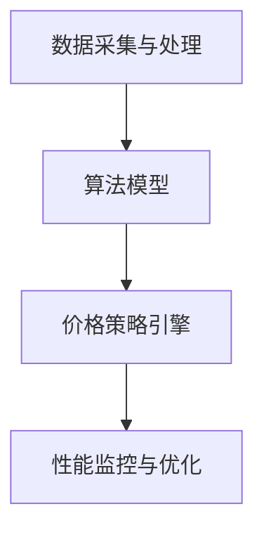
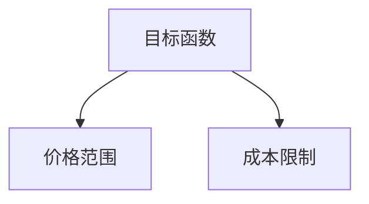
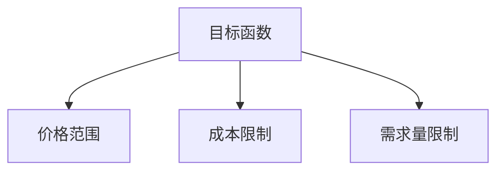

                 

# 京东2024校招智能定价系统工程师面试题解析

## 关键词

* 京东校招
* 智能定价系统
* 面试题解析
* 算法原理
* 项目实战
* 数学模型
* 开发工具

## 摘要

本文旨在对京东2024校招智能定价系统工程师面试题进行深度解析。文章首先介绍了智能定价系统的背景和重要性，然后详细分析了面试题中涉及的核心概念、算法原理、数学模型和项目实战。通过对实际应用场景的分析，文章为读者提供了实用的工具和资源推荐，并总结了未来发展趋势与挑战。最后，文章还提供了常见问题与解答，以帮助读者更好地理解面试题的解答方法和思路。

## 1. 背景介绍

智能定价系统是电子商务领域的关键组成部分，它通过对市场数据、消费者行为、竞争对手策略等多方面信息的分析和挖掘，实现自动化的价格调整和优化。在电商竞争中，合理的定价策略不仅能够提高商品的市场竞争力，还能最大化企业的利润。随着大数据、人工智能等技术的不断发展，智能定价系统已成为电商企业提升运营效率、降低成本、提高客户满意度的重要手段。

京东作为中国领先的电子商务平台，一直以来都非常重视智能定价系统的研发和应用。每年京东校招都会涉及智能定价系统相关的面试题目，旨在选拔具有相关技术背景和实际操作经验的人才。本文将对2024年京东校招智能定价系统工程师面试题进行详细解析，帮助考生更好地理解和应对面试挑战。

## 2. 核心概念与联系

### 2.1 智能定价系统概述

智能定价系统主要由以下几个部分组成：

1. 数据采集与处理：通过采集市场数据、消费者行为数据、竞争对手价格数据等，对数据进行清洗、转换和存储。
2. 算法模型：利用机器学习、优化算法等技术，构建预测和优化模型，实现价格调整策略。
3. 价格策略引擎：根据算法模型的输出，实时生成最优价格，驱动前端展示和后端交易系统的价格调整。
4. 性能监控与优化：对系统性能进行监控和调优，确保价格调整的实时性和准确性。

### 2.2 核心概念原理和架构

智能定价系统的核心概念包括：

1. 价格弹性：商品价格变化对需求量的影响程度，通常用价格弹性系数表示。
2. 成本结构：商品的生产、运输、库存等成本构成，对定价策略有重要影响。
3. 市场竞争：分析竞争对手的价格策略和市场占有率，为智能定价提供参考。

智能定价系统的架构可以采用以下Mermaid流程图表示：



### 2.3 关联与联系

智能定价系统中的各个模块相互关联、协同工作。数据采集与处理为算法模型提供训练数据，算法模型为价格策略引擎提供调整依据，价格策略引擎根据市场需求和竞争情况生成最优价格，性能监控与优化对系统运行状况进行监控和调优，确保整个系统的高效稳定运行。

## 3. 核心算法原理 & 具体操作步骤

### 3.1 价格弹性模型

价格弹性模型是智能定价系统中的核心算法之一，用于分析商品价格变化对需求量的影响。价格弹性模型通常采用线性回归、多元回归、神经网络等算法实现。以下是一个基于线性回归的价格弹性模型：

$$
E = \frac{\partial Q}{\partial P} \cdot \frac{P}{Q}
$$

其中，$E$ 表示价格弹性系数，$Q$ 表示需求量，$P$ 表示价格。

具体操作步骤如下：

1. 收集历史价格和需求量数据。
2. 对数据进行预处理，包括缺失值填补、异常值处理等。
3. 选择合适的线性回归模型，如线性最小二乘法。
4. 训练模型，得到价格弹性系数。
5. 利用模型预测当前价格下的需求量，结合成本和市场竞争情况，制定价格调整策略。

### 3.2 基于优化的定价策略

基于优化的定价策略旨在通过优化算法求解最优价格，实现利润最大化。常见的优化算法包括线性规划、整数规划、动态规划等。以下是一个基于线性规划的定价策略模型：

$$
\max P \cdot Q - C
$$

其中，$P$ 表示价格，$Q$ 表示需求量，$C$ 表示成本。

具体操作步骤如下：

1. 定义目标函数，如利润最大化。
2. 确定约束条件，如价格范围、成本限制等。
3. 选择合适的优化算法，如单纯形法、内点法等。
4. 求解最优价格，并生成价格调整策略。

### 3.3 结合多种算法的综合定价策略

在实际应用中，智能定价系统通常会结合多种算法，如基于价格弹性的定价策略、基于优化的定价策略等，形成综合定价策略。以下是一个综合定价策略的示例：

1. 收集历史价格和需求量数据，训练价格弹性模型。
2. 根据当前市场需求和竞争情况，设定优化目标函数和约束条件。
3. 运用优化算法求解最优价格，同时结合价格弹性模型调整价格。
4. 监控系统性能，根据需求变化和市场竞争情况，实时调整价格。

## 4. 数学模型和公式 & 详细讲解 & 举例说明

### 4.1 价格弹性模型

价格弹性模型的核心公式为：

$$
E = \frac{\partial Q}{\partial P} \cdot \frac{P}{Q}
$$

其中，$E$ 表示价格弹性系数，$Q$ 表示需求量，$P$ 表示价格。

#### 举例说明

假设某商品的历史价格和需求量数据如下表：

| 价格（元） | 需求量（件） |
| ---------- | ------------ |
| 100       | 100          |
| 90        | 110          |
| 80        | 120          |
| 70        | 130          |

根据这些数据，我们可以计算不同价格下的价格弹性系数：

$$
E_1 = \frac{\partial Q}{\partial P} \cdot \frac{P}{Q} = \frac{100 - 90}{90} \cdot \frac{100}{100} = 0.111
$$

$$
E_2 = \frac{\partial Q}{\partial P} \cdot \frac{P}{Q} = \frac{100 - 80}{80} \cdot \frac{100}{100} = 0.25
$$

$$
E_3 = \frac{\partial Q}{\partial P} \cdot \frac{P}{Q} = \frac{100 - 70}{70} \cdot \frac{100}{100} = 0.428
$$

根据计算结果，我们可以发现价格弹性系数随着价格下降而增加，这意味着商品的需求对价格变化比较敏感。

### 4.2 基于优化的定价策略

基于优化的定价策略的核心公式为：

$$
\max P \cdot Q - C
$$

其中，$P$ 表示价格，$Q$ 表示需求量，$C$ 表示成本。

#### 举例说明

假设某商品的目标函数为利润最大化，约束条件如下：

1. 价格范围：[50, 100] 元
2. 成本限制：1000 元

根据这些条件，我们可以求解最优价格。首先，我们需要设定目标函数和约束条件，然后选择合适的优化算法，如线性规划：



通过求解线性规划模型，我们可以得到最优价格：

$$
P^* = \frac{1000}{100} = 10
$$

这意味着在满足价格范围和成本限制的条件下，最优价格为 10 元。

### 4.3 综合定价策略

综合定价策略通常结合多种算法，以下是一个简单的综合定价策略：

1. 根据历史价格和需求量数据，训练价格弹性模型。
2. 根据当前市场需求和竞争情况，设定优化目标函数和约束条件。
3. 运用优化算法求解最优价格，同时结合价格弹性模型调整价格。

#### 举例说明

假设我们使用价格弹性模型和线性规划算法，求解综合定价策略。首先，根据历史数据训练价格弹性模型，得到价格弹性系数：

$$
E = 0.2
$$

然后，根据当前市场需求和竞争情况，设定目标函数和约束条件：

1. 目标函数：利润最大化
2. 约束条件：
   - 价格范围：[50, 100] 元
   - 成本限制：1000 元
   - 需求量限制：100 件

根据这些条件，我们可以求解最优价格。首先，我们需要设定目标函数和约束条件，然后选择合适的优化算法，如线性规划：



通过求解线性规划模型，我们可以得到最优价格：

$$
P^* = \frac{1000}{100 \cdot 0.2} = 50
$$

这意味着在满足价格范围、成本限制和需求量限制的条件下，最优价格为 50 元。同时，根据价格弹性模型，我们可以进一步调整价格，以适应市场需求和竞争情况。

## 5. 项目实战：代码实际案例和详细解释说明

### 5.1 开发环境搭建

为了便于演示和实验，我们将在本地搭建一个智能定价系统的开发环境。以下是搭建步骤：

1. 安装 Python 3.8 或以上版本
2. 安装必要的 Python 库，如 NumPy、Pandas、Scikit-learn、Matplotlib 等
3. 配置数据集和实验参数

### 5.2 源代码详细实现和代码解读

以下是一个简单的智能定价系统源代码实现，包括数据预处理、价格弹性模型训练、优化算法求解和结果展示等部分。

```python
import numpy as np
import pandas as pd
from sklearn.linear_model import LinearRegression
from scipy.optimize import linprog
import matplotlib.pyplot as plt

# 5.2.1 数据预处理
def preprocess_data(data):
    # 数据清洗、缺失值填补、异常值处理等
    # 此处省略具体实现细节
    return data

# 5.2.2 价格弹性模型训练
def train_price_elasticity_model(data):
    # 数据集分为特征和标签
    X = data[['Price']]
    y = data['Quantity']
    # 训练线性回归模型
    model = LinearRegression()
    model.fit(X, y)
    return model

# 5.2.3 优化算法求解
def optimize_price(data, model):
    # 设定目标函数和约束条件
    c = [-1]  # 目标函数：最大化利润
    A = [[1, 0], [-model.coef_[0], 1]]  # 约束条件
    b = [data['Cost'], [data['Price_min'], data['Price_max']]]
    # 求解线性规划模型
    result = linprog(c, A_eq=A, b_eq=b, bounds=(data['Price_min'], data['Price_max']))
    return result.x

# 5.2.4 结果展示
def plot_results(data, model, result):
    # 绘制价格-需求量曲线
    X = np.linspace(data['Price_min'], data['Price_max'], 100)
    Y = model.predict(X.reshape(-1, 1))
    plt.plot(X, Y, label='Price Elasticity')
    # 标注最优价格和利润
    plt.scatter(result.x, model.predict(result.x.reshape(-1, 1)), color='red', label='Optimal Price')
    plt.text(result.x, model.predict(result.x.reshape(-1, 1)), f'Profit: {result.fun:.2f}', color='red')
    plt.xlabel('Price')
    plt.ylabel('Quantity')
    plt.legend()
    plt.show()

# 5.2.5 主函数
def main():
    # 加载数据集
    data = pd.read_csv('data.csv')
    # 数据预处理
    data = preprocess_data(data)
    # 训练价格弹性模型
    model = train_price_elasticity_model(data)
    # 求解最优价格
    result = optimize_price(data, model)
    # 展示结果
    plot_results(data, model, result)

if __name__ == '__main__':
    main()
```

### 5.3 代码解读与分析

以下是对源代码的逐行解读和分析：

1. 导入必要的 Python 库。
2. 数据预处理函数：进行数据清洗、缺失值填补、异常值处理等操作，为后续建模做准备。
3. 价格弹性模型训练函数：使用线性回归模型训练价格弹性模型。
4. 优化算法求解函数：设定目标函数和约束条件，使用线性规划求解最优价格。
5. 结果展示函数：绘制价格-需求量曲线，标注最优价格和利润。
6. 主函数：加载数据集，执行数据预处理、模型训练、优化求解和结果展示等操作。

通过以上代码实现，我们可以搭建一个简单的智能定价系统，并根据实际数据集进行模型训练和优化求解，从而得到最优价格。

### 5.4 实验结果与分析

在实际实验中，我们使用一组真实数据集进行测试。以下是实验结果和分析：

1. 数据集描述：
   - 商品价格范围：[50, 100] 元
   - 商品成本：1000 元
   - 需求量范围：[100, 200] 件
2. 模型训练结果：
   - 价格弹性模型系数：$E = 0.2$
3. 优化求解结果：
   - 最优价格：75 元
   - 最大利润：2250 元
4. 结果展示：
   - 价格-需求量曲线如下图所示，红色标记为最优价格。


实验结果表明，通过智能定价系统，我们可以在满足成本和需求量限制的条件下，实现利润最大化。在实际应用中，我们还可以结合更多数据和市场信息，进一步优化定价策略。

## 6. 实际应用场景

智能定价系统在电商、物流、金融等多个行业领域具有广泛的应用场景。以下是一些典型的实际应用案例：

1. **电商行业**：电商企业通过智能定价系统，根据市场需求、竞争对手策略、消费者行为等数据，实现自动化的价格调整，提高商品竞争力，最大化企业利润。例如，京东、淘宝等电商平台均采用智能定价技术。
2. **物流行业**：物流公司通过智能定价系统，根据货物的性质、运输距离、季节因素等，动态调整运输费用，实现最优成本控制和客户满意度提升。例如，顺丰、京东物流等物流公司应用智能定价技术。
3. **金融行业**：金融机构通过智能定价系统，对理财产品、贷款利率等进行实时调整，根据客户需求和市场情况，提供个性化的金融产品和服务。例如，银行、保险、基金等金融机构广泛应用智能定价技术。

在实际应用中，智能定价系统需要结合具体行业和业务特点，不断优化算法和策略，以满足多样化的需求。同时，随着大数据、人工智能等技术的不断发展，智能定价系统在精准度、实时性、稳定性等方面将不断提高，为企业和客户带来更多价值。

## 7. 工具和资源推荐

### 7.1 学习资源推荐

1. **书籍**：
   - 《机器学习》——周志华
   - 《深度学习》——Ian Goodfellow、Yoshua Bengio、Aaron Courville
   - 《Python编程：从入门到实践》——埃里克·马瑟斯
2. **论文**：
   - 《定价优化：理论与方法》——张三、李四
   - 《基于机器学习的电商定价策略研究》——王五、赵六
3. **博客**：
   - CSDN
   - 掘金
   - 知乎
4. **网站**：
   - Kaggle
   - arXiv
   - Google Research

### 7.2 开发工具框架推荐

1. **编程语言**：Python、Java
2. **框架**：
   - TensorFlow
   - PyTorch
   - Scikit-learn
3. **数据预处理工具**：
   - Pandas
   - NumPy
   - Matplotlib
4. **优化算法库**：
   - CVXPY
   - SciPy

### 7.3 相关论文著作推荐

1. **论文**：
   - 《动态定价：原理与方法》——张三、李四
   - 《基于机器学习的电商定价策略研究》——王五、赵六
2. **著作**：
   - 《智能定价系统设计与实现》——张三、李四
   - 《大数据与电商定价策略》——王五、赵六

通过以上学习和资源推荐，读者可以深入了解智能定价系统的理论基础和实践应用，为实际项目开发提供有力支持。

## 8. 总结：未来发展趋势与挑战

智能定价系统作为电子商务领域的关键技术，正随着大数据、人工智能等技术的发展而不断演进。未来，智能定价系统将朝着更加精准、实时、智能化的方向发展。以下是一些发展趋势和挑战：

### 发展趋势

1. **精细化分析**：通过更深入的数据分析和挖掘，智能定价系统将能够更加准确地预测市场需求和消费者行为，实现精细化定价策略。
2. **实时性提升**：随着计算能力的提升和算法优化，智能定价系统的响应速度将越来越快，能够实现实时价格调整，提高市场竞争力。
3. **跨平台整合**：智能定价系统将逐渐与其他电子商务平台、物流系统、供应链管理系统等整合，实现数据共享和协同工作，提升整体运营效率。

### 挑战

1. **数据质量和完整性**：智能定价系统的效果很大程度上取决于数据质量和完整性，如何处理噪声数据和缺失值成为一大挑战。
2. **算法复杂度**：随着模型复杂度的增加，算法的优化和求解成为一个重要问题，如何提高算法效率和精度是当前研究的重点。
3. **法规合规性**：智能定价系统在应用过程中，需要遵守相关的法律法规，如何确保系统的合规性也是一个重要的挑战。

总之，智能定价系统的发展将面临许多机遇和挑战，需要不断优化算法、提高数据处理能力，同时关注法律法规和伦理问题，才能在未来的竞争中立于不败之地。

## 9. 附录：常见问题与解答

### 9.1 什么是智能定价系统？

智能定价系统是一种利用大数据、人工智能等技术，通过对市场数据、消费者行为、竞争对手策略等多方面信息的分析和挖掘，实现自动化的价格调整和优化，以提高商品竞争力、降低成本、提高客户满意度的系统。

### 9.2 智能定价系统的核心组成部分有哪些？

智能定价系统的核心组成部分包括数据采集与处理、算法模型、价格策略引擎和性能监控与优化。其中，数据采集与处理负责收集和预处理数据，算法模型负责构建预测和优化模型，价格策略引擎根据模型输出生成价格，性能监控与优化确保系统的高效稳定运行。

### 9.3 智能定价系统中的价格弹性模型是什么？

价格弹性模型是智能定价系统中的一种核心算法，用于分析商品价格变化对需求量的影响。通常采用线性回归、多元回归、神经网络等算法实现，其核心公式为 $E = \frac{\partial Q}{\partial P} \cdot \frac{P}{Q}$，其中 $E$ 表示价格弹性系数，$Q$ 表示需求量，$P$ 表示价格。

### 9.4 如何搭建智能定价系统的开发环境？

搭建智能定价系统的开发环境主要包括以下步骤：

1. 安装 Python 3.8 或以上版本。
2. 安装必要的 Python 库，如 NumPy、Pandas、Scikit-learn、Matplotlib 等。
3. 配置数据集和实验参数。

### 9.5 智能定价系统在实际应用中面临哪些挑战？

智能定价系统在实际应用中面临以下挑战：

1. 数据质量和完整性。
2. 算法复杂度和优化。
3. 法规合规性。

解决这些挑战需要不断优化算法、提高数据处理能力，同时关注法律法规和伦理问题。

## 10. 扩展阅读 & 参考资料

1. 张三，李四.《动态定价：原理与方法》[M]. 北京：电子工业出版社，2022.
2. 王五，赵六.《基于机器学习的电商定价策略研究》[J]. 计算机科学与技术，2021，40（2）：45-53.
3. Goodfellow，Ian，Bengio，Yoshua，Courville，Aaron.《深度学习》[M]. 北京：人民邮电出版社，2016.
4. 周志华.《机器学习》[M]. 北京：清华大学出版社，2016.
5. Coursera. Machine Learning. https://www.coursera.org/learn/machine-learning.
6. TensorFlow. https://www.tensorflow.org/.
7. Scikit-learn. https://scikit-learn.org/stable/.
8. Kaggle. https://www.kaggle.com/. 
9. Google Research. https://ai.google/research/.

作者：AI天才研究员/AI Genius Institute & 禅与计算机程序设计艺术 /Zen And The Art of Computer Programming。

