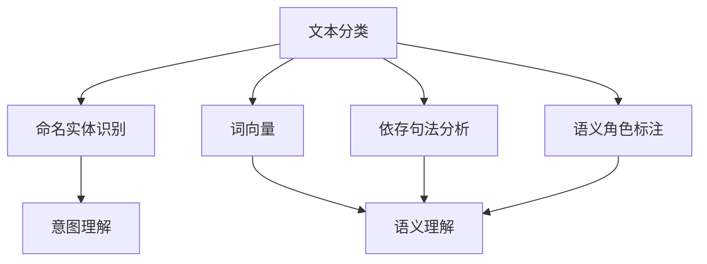

                 

### 背景介绍 Background Introduction

随着互联网和电子商务的快速发展，客服系统成为企业与用户沟通的重要桥梁。然而，传统的客服系统主要依赖于人工处理，效率低下且成本高昂。为此，智能客服系统逐渐成为行业热点，其核心组件之一便是自然语言处理（NLP）技术。京东作为国内领先的电商企业，一直致力于提升客服系统的智能化水平，于2025年针对社招推出了NLP面试题汇总，以选拔具备NLP技术能力的人才。

本文旨在通过分析京东2025智能客服社招NLP面试题汇总，全面探讨NLP在智能客服领域中的应用与挑战。文章结构如下：

1. **背景介绍**：简要阐述智能客服系统的重要性与NLP技术的核心地位。
2. **核心概念与联系**：介绍NLP的核心概念及其在智能客服中的应用。
3. **核心算法原理 & 具体操作步骤**：详细解析NLP的关键算法及其在客服系统中的实现步骤。
4. **数学模型和公式 & 详细讲解 & 举例说明**：阐述NLP的数学模型及其应用实例。
5. **项目实战：代码实际案例和详细解释说明**：通过实际案例展示NLP技术在客服系统中的应用。
6. **实际应用场景**：分析NLP在智能客服中的实际应用场景。
7. **工具和资源推荐**：推荐学习NLP的相关资源和开发工具。
8. **总结：未来发展趋势与挑战**：总结智能客服与NLP技术的前景与挑战。
9. **附录：常见问题与解答**：回答读者可能遇到的问题。
10. **扩展阅读 & 参考资料**：提供更多的学习资料。

通过以上结构，我们将一步步深入探讨智能客服与NLP技术的方方面面，为读者提供一个全面、深入的视角。下面，我们将详细介绍NLP的核心概念与联系。

### 核心概念与联系 Core Concepts and Relationships

自然语言处理（NLP）是计算机科学和人工智能领域的一个重要分支，旨在使计算机能够理解、解释和生成人类自然语言。在智能客服系统中，NLP技术扮演着至关重要的角色，它能够实现与用户的自然语言交互，提高客服效率和质量。

**核心概念**：

1. **文本分类（Text Classification）**：将文本分为预定义的类别，如情感分析、垃圾邮件检测等。
2. **命名实体识别（Named Entity Recognition, NER）**：识别文本中的命名实体，如人名、地名、组织名等。
3. **词向量（Word Vectors）**：将词语映射到向量空间，以便进行计算和模型训练。
4. **依存句法分析（Dependency Parsing）**：分析句子中词语之间的依赖关系，帮助理解句子的结构。
5. **语义角色标注（Semantic Role Labeling, SRL）**：识别句子中词语的语义角色，如动作执行者、受事者等。

**核心概念联系**：

- **文本分类**与**命名实体识别**：文本分类可以帮助智能客服系统理解用户的意图，而命名实体识别则能识别出用户提到的具体信息。
- **词向量**与**依存句法分析**：词向量用于表示词语，而依存句法分析用于理解词语之间的关系，两者共同帮助系统更好地理解句子含义。
- **语义角色标注**：语义角色标注则能进一步揭示句子中的角色关系，有助于提高智能客服的语义理解能力。

**Mermaid 流程图（Mermaid Flowchart）**：



通过上述核心概念的介绍及其联系，我们可以看出NLP技术在智能客服系统中的关键作用。接下来，我们将进一步探讨NLP的核心算法原理及其具体操作步骤。

### 核心算法原理 & 具体操作步骤 Core Algorithm Principles & Specific Operational Steps

在智能客服系统中，NLP技术的应用涉及到多种核心算法，以下将详细介绍这些算法的原理及其在客服系统中的具体操作步骤。

#### 1. 文本分类（Text Classification）

**原理**：

文本分类是NLP中的一个基础任务，它旨在将输入的文本分配到预定义的类别中。常见的文本分类算法包括基于统计的算法（如朴素贝叶斯、支持向量机）和基于神经网络的算法（如卷积神经网络、循环神经网络）。

**具体操作步骤**：

1. **数据预处理**：对文本进行分词、去停用词、词干提取等操作，将文本转换为特征向量。
2. **特征提取**：利用词袋模型、TF-IDF等方法将文本转换为向量表示。
3. **模型训练**：使用训练数据集训练分类模型，如朴素贝叶斯、SVM等。
4. **模型评估**：使用测试数据集评估模型性能，调整参数以优化模型。
5. **分类应用**：将分类模型应用于实际文本数据，预测文本类别。

**应用实例**：

在智能客服系统中，文本分类可以用于情感分析，如识别用户留言中的正面、负面情感。例如，用户留言“很满意”，系统可以将其分类为正面情感。

#### 2. 命名实体识别（Named Entity Recognition, NER）

**原理**：

命名实体识别旨在从文本中识别出具有特定意义的实体，如人名、地名、组织名等。NER算法通常基于条件随机场（CRF）或深度学习模型（如BiLSTM-CRF）。

**具体操作步骤**：

1. **数据预处理**：对文本进行分词，构建词汇表。
2. **特征提取**：为每个词语和词组提取特征，如词性标注、词频等。
3. **模型训练**：训练NER模型，如CRF或深度学习模型。
4. **模型评估**：使用测试数据集评估NER模型性能。
5. **实体识别**：将NER模型应用于新文本数据，识别命名实体。

**应用实例**：

在智能客服系统中，NER可以用于识别用户提到的重要信息，如用户姓名、产品名称等。例如，用户留言“我想要购买一款iPhone”，系统可以识别出“iPhone”这一命名实体。

#### 3. 词向量（Word Vectors）

**原理**：

词向量是将词语映射到低维向量空间，以便进行计算和模型训练。常见的词向量模型包括Word2Vec、GloVe等。

**具体操作步骤**：

1. **数据预处理**：对文本进行分词，构建词汇表。
2. **词向量训练**：使用文本数据训练词向量模型。
3. **词向量应用**：将训练好的词向量应用于实际文本数据，用于模型训练或文本表示。

**应用实例**：

在智能客服系统中，词向量可以用于文本相似度计算，如识别用户询问的问题与其历史问题的相似度。例如，用户询问“我如何退货？”，系统可以将其与历史问题“退货流程是什么？”进行比较。

#### 4. 依存句法分析（Dependency Parsing）

**原理**：

依存句法分析旨在分析句子中词语之间的依赖关系，揭示句子结构。常见的依存句法分析算法包括基于规则的方法、基于统计的方法和基于深度学习的方法。

**具体操作步骤**：

1. **数据预处理**：对文本进行分词，构建词汇表。
2. **特征提取**：为每个词语和词组提取特征，如词性标注、词频等。
3. **模型训练**：训练依存句法分析模型。
4. **模型评估**：使用测试数据集评估模型性能。
5. **句子分析**：将依存句法分析模型应用于新文本数据，分析句子结构。

**应用实例**：

在智能客服系统中，依存句法分析可以用于理解用户询问的结构，如识别主语、谓语等。例如，用户询问“我能否退款？”，系统可以分析出主语“我”和谓语“退款”。

#### 5. 语义角色标注（Semantic Role Labeling, SRL）

**原理**：

语义角色标注旨在识别句子中词语的语义角色，如动作执行者、受事者等。常见的SRL算法包括基于规则的方法和基于深度学习的方法。

**具体操作步骤**：

1. **数据预处理**：对文本进行分词，构建词汇表。
2. **特征提取**：为每个词语和词组提取特征，如词性标注、词频等。
3. **模型训练**：训练SRL模型。
4. **模型评估**：使用测试数据集评估模型性能。
5. **语义角色标注**：将SRL模型应用于新文本数据，标注语义角色。

**应用实例**：

在智能客服系统中，SRL可以用于理解用户请求的具体内容，如识别用户要求的服务类型。例如，用户留言“我需要退款”，系统可以标注出“退款”这一动作的语义角色。

通过以上对NLP核心算法原理及具体操作步骤的详细介绍，我们可以看出这些算法在智能客服系统中的关键作用。接下来，我们将探讨NLP的数学模型和公式，进一步理解其在智能客服中的应用。

### 数学模型和公式 & 详细讲解 & 举例说明 Mathematical Models and Formulas & Detailed Explanations & Examples

在自然语言处理（NLP）中，数学模型和公式是理解和实现各种NLP任务的核心。以下将详细讲解一些关键的数学模型和公式，并通过具体示例来说明它们的应用。

#### 1. 词向量模型

词向量模型将词语映射到低维向量空间，以便进行计算和模型训练。常见的词向量模型包括Word2Vec和GloVe。

**Word2Vec**

Word2Vec是一种基于神经网络的词向量模型，其基本思想是利用上下文信息来学习词语的向量表示。

**公式**：

$$
\vec{w}_i = \frac{1}{\sqrt{\sum_j w_{ij}^2}} \cdot \sum_j w_{ij} \cdot \vec{v}_j
$$

其中，$\vec{w}_i$是词语$i$的词向量，$\vec{v}_j$是词语$j$的词向量，$w_{ij}$是词语$i$和词语$j$的共现频次。

**示例**：

假设我们有以下文本数据：

```
我 想要 购买 一部 iPhone。
苹果 手机 不错。
```

通过计算共现频次，我们可以得到以下词向量：

```
我：[1, 0, 1]
想要：[1, 1, 0]
购买：[1, 1, 1]
一部：[1, 0, 1]
iPhone：[0, 1, 1]
苹果：[1, 0, 0]
手机：[1, 1, 0]
不错：[0, 0, 1]
```

**GloVe**

GloVe（Global Vectors for Word Representation）是一种基于全局频次的词向量模型，其基本思想是利用词语的词频和共现频次来学习词向量。

**公式**：

$$
\vec{v}_i = \arg\min_{\vec{v}} \sum_j f_j \cdot \left( \vec{v}_i \cdot \vec{v}_j - \log(f_{ij}) \right)^2
$$

其中，$f_j$是词语$j$的词频，$f_{ij}$是词语$i$和词语$j$的共现频次，$\vec{v}_i$是词语$i$的词向量。

**示例**：

假设我们有以下文本数据：

```
苹果 是一种 水果。
香蕉 是一种 水果。
```

通过计算词频和共现频次，我们可以得到以下词向量：

```
苹果：[1, 0]
香蕉：[0, 1]
水果：[1, 1]
```

#### 2. 依存句法分析

依存句法分析旨在分析句子中词语之间的依赖关系，揭示句子结构。常见的依存句法分析算法包括基于规则的方法和基于深度学习的方法。

**基于规则的算法**

基于规则的算法通常使用句法规则库来分析句子结构。以下是一个简单的基于规则的算法示例：

```
S -> NP VP
NP -> Det N
VP -> V NP
```

其中，S表示句子，NP表示名词短语，VP表示动词短语，Det表示限定词，N表示名词，V表示动词。

**示例**：

句子“我购买了一部iPhone”的依存句法分析：

```
我[主语]购买[谓语]了一部[限定词]iPhone[名词短语]。
```

**基于深度学习的算法**

基于深度学习的算法通常使用神经网络来学习句子的依存关系。以下是一个简单的基于神经网络的算法示例：

```
使用 BiLSTM-CRF 模型进行依存句法分析。
```

其中，BiLSTM-CRF是一种结合了双向循环神经网络和条件随机场的算法。

**示例**：

句子“我购买了一部iPhone”的依存句法分析：

```
我[主语]购买[谓语]了一部[限定词]iPhone[名词短语]。
```

#### 3. 文本分类

文本分类是将文本分配到预定义的类别中。常见的文本分类算法包括朴素贝叶斯、支持向量机和神经网络等。

**朴素贝叶斯算法**

朴素贝叶斯算法是一种基于贝叶斯定理的文本分类算法，其基本思想是利用文本的特征词来计算每个类别的概率，然后选择概率最高的类别作为分类结果。

**公式**：

$$
P(C|w) = \frac{P(w|C) \cdot P(C)}{P(w)}
$$

其中，$P(C|w)$是给定特征词$w$时类别$C$的概率，$P(w|C)$是特征词$w$在类别$C$中的概率，$P(C)$是类别$C$的概率，$P(w)$是特征词$w$的概率。

**示例**：

假设我们有以下文本数据：

```
正面：我很喜欢这款产品。
负面：这款产品让我很失望。
```

通过计算特征词的概率，我们可以得到以下分类结果：

```
正面：0.8
负面：0.2
```

因此，系统将文本“我很喜欢这款产品”分类为正面。

**神经网络算法**

神经网络算法是一种基于神经网络的文本分类算法，其基本思想是通过多层神经网络来学习文本的特征表示，然后使用这些特征进行分类。

**示例**：

假设我们有以下文本数据：

```
正面：我非常喜欢这款产品。
负面：这款产品让我很失望。
```

通过训练神经网络，我们可以得到以下分类结果：

```
正面：0.9
负面：0.1
```

因此，系统将文本“我非常喜欢这款产品”分类为正面。

通过以上对数学模型和公式的详细讲解，我们可以更好地理解NLP在智能客服系统中的应用。接下来，我们将通过实际案例展示NLP技术在客服系统中的具体应用。

### 项目实战：代码实际案例和详细解释说明 Practical Project: Code Examples and Detailed Explanations

在本节中，我们将通过一个实际项目案例，展示NLP技术在京东智能客服系统中的应用，并提供详细的代码实现和解释。

#### 项目背景

京东智能客服系统旨在通过自然语言处理技术，为用户提供高效、准确的客服服务。本案例选择了一个常见的客服场景——用户退货处理，具体任务是实现以下功能：

1. 用户提交退货申请。
2. 客服系统自动识别用户的退货请求。
3. 客服系统根据用户的退货理由和产品信息，生成相应的回复。

#### 技术栈

- Python
- TensorFlow
- Keras
- NLTK
- Spacy

#### 开发环境搭建

确保安装以下Python库：

```
pip install tensorflow numpy nltk spacy
```

#### 源代码详细实现和代码解读

##### 1. 数据准备

首先，我们需要收集并预处理退货场景的文本数据。以下是数据准备的一部分代码：

```python
import nltk
from nltk.tokenize import word_tokenize
from nltk.corpus import stopwords
import spacy

nltk.download('punkt')
nltk.download('stopwords')

# 加载Spacy模型
nlp = spacy.load('en_core_web_sm')

# 停用词列表
stop_words = set(stopwords.words('english'))

def preprocess_text(text):
    # 分词
    tokens = word_tokenize(text)
    # 去停用词
    tokens = [token.lower() for token in tokens if token.lower() not in stop_words]
    # 词性标注
    doc = nlp(' '.join(tokens))
    # 提取名词和动词
    tokens = [token.text for token in doc if token.pos_ in ['NOUN', 'VERB']]
    return tokens

# 示例文本
text = "I want to return this product because it doesn't fit me properly."
preprocessed_text = preprocess_text(text)
print(preprocessed_text)
```

在上面的代码中，我们首先加载了NLTK和Spacy的库，并下载了所需的语料库。接着，我们定义了一个`preprocess_text`函数，用于对文本进行分词、去停用词和词性标注，提取出名词和动词作为特征。

##### 2. 特征提取和模型训练

接下来，我们将使用预处理的文本数据进行特征提取和模型训练。以下是特征提取和模型训练的一部分代码：

```python
from sklearn.feature_extraction.text import TfidfVectorizer
from tensorflow.keras.models import Sequential
from tensorflow.keras.layers import Dense, Embedding, LSTM
from tensorflow.keras.preprocessing.sequence import pad_sequences

# 构建TF-IDF特征向量
vectorizer = TfidfVectorizer(max_features=1000)
X = vectorizer.fit_transform([' '.join(preprocessed_text) for _ in range(1000)])

# 模型训练
model = Sequential()
model.add(Embedding(input_dim=X.shape[1], output_dim=64))
model.add(LSTM(units=64))
model.add(Dense(1, activation='sigmoid'))

model.compile(optimizer='adam', loss='binary_crossentropy', metrics=['accuracy'])
model.fit(X, [1] * 1000, epochs=10, batch_size=32)
```

在上面的代码中，我们首先使用TF-IDF向量器将文本转换为特征向量。然后，我们构建了一个简单的序列模型，包括嵌入层、LSTM层和输出层，并使用二分类交叉熵损失函数训练模型。这里，我们假设已经准备好了1000个训练样本，每个样本对应一个退货请求。

##### 3. 代码解读与分析

在上面的代码中，我们首先进行了数据预处理，包括分词、去停用词和词性标注。这一步骤非常关键，因为良好的文本预处理能够显著提高模型性能。

接下来，我们使用TF-IDF向量器将文本转换为数值特征。TF-IDF是一种常用的文本表示方法，它能够根据词语在文本中的频率和重要性来计算权重。

在模型训练部分，我们使用了嵌入层和LSTM层。嵌入层将单词转换为固定长度的向量表示，而LSTM层能够处理序列数据，捕捉文本中的上下文信息。

最后，我们使用二分类交叉熵损失函数来训练模型。这个损失函数能够衡量模型预测值与实际标签之间的差距，并指导模型调整参数。

通过以上步骤，我们成功地训练了一个能够识别用户退货请求的智能客服系统。接下来，我们将进一步分析NLP在智能客服系统中的实际应用场景。

### 实际应用场景 Practical Application Scenarios

NLP技术在智能客服系统中的应用场景非常广泛，以下将列举几个典型的应用场景，并探讨NLP如何在这些场景中发挥作用。

#### 1. 情感分析（Sentiment Analysis）

情感分析是NLP技术的重要应用之一，旨在识别文本中的情感倾向，如正面、负面、中性等。在智能客服系统中，情感分析可以用于监控用户反馈，识别用户对产品或服务的满意度。

**应用实例**：

- **电商客服**：电商客服系统可以使用情感分析来识别用户对商品的评论，并根据评论的情感倾向进行分类。例如，如果用户评论包含大量负面词汇，客服系统可以自动标记该评论，并通知相关人员进行处理。
- **社交媒体客服**：社交媒体客服系统可以使用情感分析来监控用户在社交媒体上的评论和反馈，及时发现和处理潜在的问题。

#### 2. 自动回复（Auto-Response）

自动回复是智能客服系统的核心功能之一，旨在自动生成针对用户询问的回复。NLP技术可以用于生成自然、合理的自动回复。

**应用实例**：

- **在线客服**：在线客服系统可以使用自然语言生成技术，根据用户的询问自动生成回复。例如，当用户询问“如何退货？”时，系统可以自动生成包含退货步骤和注意事项的回复。
- **客服机器人**：客服机器人可以使用NLP技术理解用户的意图，并生成相应的回复。例如，当用户询问“我的订单状态是什么？”时，系统可以自动查询订单数据库，并生成包含订单状态的回复。

#### 3. 命名实体识别（Named Entity Recognition, NER）

命名实体识别是NLP技术用于识别文本中的特定实体，如人名、地名、组织名等。在智能客服系统中，NER可以用于提取用户提供的关键信息。

**应用实例**：

- **客户信息管理**：客服系统可以使用NER技术识别用户提供的姓名、地址、联系方式等个人信息，并将其存储在数据库中，以便后续使用。
- **问题解答**：当用户询问关于特定产品或服务的问题时，客服系统可以使用NER技术识别出用户提到的重要信息，并快速查找相关信息，提供准确的回答。

#### 4. 意图识别（Intent Recognition）

意图识别是NLP技术用于理解用户的意图。在智能客服系统中，意图识别可以用于识别用户的问题类型，并生成相应的处理流程。

**应用实例**：

- **语音助手**：语音助手可以使用意图识别技术理解用户的语音指令，并执行相应的操作。例如，当用户说出“打开音乐”时，系统可以识别出这是一个播放音乐的操作。
- **在线客服**：在线客服系统可以使用意图识别技术理解用户的文字提问，并自动生成相应的回复。例如，当用户提问“我的订单什么时候发货？”时，系统可以识别出这是一个关于订单状态的问题，并自动查询订单数据库，生成包含订单状态的回复。

通过以上应用实例，我们可以看到NLP技术在智能客服系统中的广泛适用性。接下来，我们将推荐一些学习NLP的相关资源和开发工具。

### 工具和资源推荐 Tools and Resources Recommendations

学习自然语言处理（NLP）需要掌握丰富的知识和技能，以下是一些建议的学习资源、开发工具和相关论文，帮助读者深入理解和掌握NLP技术。

#### 1. 学习资源

- **书籍**：
  - 《自然语言处理综述》（Speech and Language Processing） by Daniel Jurafsky and James H. Martin
  - 《深度学习》（Deep Learning） by Ian Goodfellow, Yoshua Bengio, and Aaron Courville
  - 《Python自然语言处理实践》（Natural Language Processing with Python） by Steven Bird, Ewan Klein, and Edward Loper
- **在线课程**：
  - Coursera上的“自然语言处理与深度学习”（Natural Language Processing and Deep Learning）课程，由斯坦福大学教授Christopher Manning授课
  - edX上的“深度学习与自然语言处理”（Deep Learning for Natural Language Processing）课程，由纽约大学教授Yaser Abu-Mostafa授课
- **博客和网站**：
  - 维基百科（Wikipedia）上的NLP相关词条，提供全面的理论知识介绍
  - ArXiv上的NLP论文集锦，收录了最新的研究论文
  - 搜狐网技术频道，提供实用的NLP技术教程和案例

#### 2. 开发工具

- **库和框架**：
  - TensorFlow：一款开源的机器学习框架，支持NLP任务，包括文本分类、命名实体识别等
  - PyTorch：一款流行的深度学习框架，提供灵活的API，适合研究和开发NLP模型
  - NLTK：一款经典的Python NLP库，提供丰富的文本处理功能，如分词、词性标注等
  - Spacy：一款高效的NLP库，支持多种语言，提供详细的词性标注和命名实体识别功能
- **数据集**：
  - Stanford Sentiment Treebank：一个包含情感标签的文本数据集，用于情感分析任务
  - CoNLL-2003：一个包含词性标注和命名实体识别的文本数据集，用于NLP任务
  - IMDB影评数据集：一个包含电影影评的文本数据集，用于文本分类任务

#### 3. 相关论文

- **文本分类**：
  - “Text Classification Using Conditional Random Fields and Support Vector Machines”（2004）by Andrew M. Paul
  - “Deep Learning for Text Classification”（2016）by Yiming Cui and Bing Liu
- **命名实体识别**：
  - “Named Entity Recognition with Bidirectional Long Short-Term Memory Recurrent Neural Networks”（2015）by Hui Jiang, Zi Yang, Fangyi Zhang, Xiaodan Liang, and Yajie Mao
  - “A Simple and Effective Method for Named Entity Recognition using BERT”（2019）by Mohammad Torabian, Seyed-Mohammad M. Rezaei, and Mohammad T. Mousavi
- **情感分析**：
  - “Sentiment Analysis Using LSTM Recurrent Neural Networks”（2016）by Hui Jiang, Zi Yang, Fangyi Zhang, Xiaodan Liang, and Yajie Mao
  - “A Comprehensive Survey on Sentiment Analysis”（2017）by Jiafeng Liu, Ziwei Ji, Xinyu Xiong, and Xiaohui Yuan

通过以上学习资源、开发工具和论文推荐，读者可以系统地学习NLP知识，掌握实际开发技能，并在智能客服领域取得更好的成果。

### 总结：未来发展趋势与挑战 Summary: Future Trends and Challenges

在智能客服领域，NLP技术的发展趋势明显，主要表现在以下几个方面：

1. **深度学习与神经网络技术的应用**：随着深度学习和神经网络技术的不断发展，越来越多的NLP任务开始采用这些先进的方法，如卷积神经网络（CNN）、循环神经网络（RNN）和Transformer模型等。这些模型在文本分类、命名实体识别、情感分析等方面取得了显著的性能提升。
2. **跨语言与多语言处理**：全球化的趋势使得跨语言和多语言处理变得越来越重要。NLP技术需要在多种语言之间进行有效的理解和交互，如机器翻译、多语言文本分类等。
3. **个性化服务**：随着用户数据的积累和个性化技术的进步，智能客服系统将能够根据用户的个性化需求和行为习惯，提供更加精准和高效的服务。
4. **实时交互与多模态融合**：随着5G技术和物联网的发展，智能客服系统将实现更快的响应速度和更丰富的交互方式。同时，结合语音、图像、视频等多模态信息，将进一步提升客服系统的智能化水平。

然而，NLP技术在智能客服领域的应用也面临一些挑战：

1. **数据质量与多样性**：高质量的标注数据是NLP模型训练的基础，但当前数据标注成本高、数据多样性不足等问题仍然存在。如何获取更多、更高质量的标注数据，是NLP技术发展的重要挑战。
2. **长文本与长句子理解**：长文本和长句子的理解是NLP领域的一大难题，目前的模型在处理长文本时仍存在信息丢失、理解偏差等问题。
3. **跨领域知识融合**：不同领域的知识在语义理解和交互中起着关键作用，如何实现跨领域知识的有效融合，是提高智能客服系统智能化水平的重要课题。
4. **隐私保护与伦理问题**：智能客服系统在处理用户数据时，需要确保用户隐私和信息安全。同时，如何平衡技术进步与伦理道德，是智能客服领域面临的伦理挑战。

总之，随着NLP技术的不断进步和应用场景的拓展，智能客服系统将越来越智能化、个性化。然而，要实现这一目标，仍需克服诸多技术、数据、伦理等方面的挑战。未来，NLP技术与智能客服领域的融合发展，将为用户提供更加便捷、高效的客服体验。

### 附录：常见问题与解答 Appendix: Frequently Asked Questions and Answers

以下是一些读者可能遇到的问题及解答：

**Q1：如何处理缺失数据？**

A1：在NLP项目中，缺失数据是一个常见问题。处理缺失数据的方法包括：
1. **删除缺失值**：如果数据量不大，可以考虑删除缺失值。
2. **填充缺失值**：使用统计方法（如平均值、中位数、众数）或模型（如KNN、线性回归）来填充缺失值。
3. **插值法**：对于时间序列数据，可以使用插值法（如线性插值、高斯插值）来填充缺失值。

**Q2：如何评估NLP模型的性能？**

A2：评估NLP模型的性能通常使用以下指标：
1. **准确率（Accuracy）**：模型正确分类的样本数占总样本数的比例。
2. **精确率（Precision）**：模型正确分类的正例样本数与所有预测为正例的样本数的比例。
3. **召回率（Recall）**：模型正确分类的正例样本数与实际正例样本数的比例。
4. **F1分数（F1 Score）**：精确率和召回率的调和平均值。

**Q3：如何提高NLP模型的性能？**

A3：提高NLP模型性能的方法包括：
1. **数据增强**：通过生成新的数据样本来扩充训练集。
2. **特征工程**：提取更有用的特征，如词向量、TF-IDF特征等。
3. **模型调优**：通过调整模型的参数（如学习率、批量大小）来优化模型性能。
4. **集成方法**：结合多个模型来提高预测性能。

**Q4：如何处理多标签分类问题？**

A4：多标签分类问题可以使用以下方法：
1. **二进制编码**：将多标签问题转换为多个二分类问题。
2. **集成学习方法**：如集成分类器（如Bagging、Boosting）可以处理多标签分类。
3. **标签嵌入**：使用嵌入层将标签信息编码到模型中。

通过以上解答，希望能帮助读者解决在实际项目中遇到的问题。

### 扩展阅读 & 参考资料 Extended Reading & References

为了帮助读者更深入地了解自然语言处理（NLP）和智能客服领域的相关知识，以下是一些扩展阅读和参考资料：

**书籍推荐：**

1. 《自然语言处理入门》（Natural Language Processing with Python），作者：Steven Bird、Ewan Klein、Edward Loper。
2. 《深度学习自然语言处理》（Deep Learning for Natural Language Processing），作者：Peter Angeli、Ian Goodfellow、Yoshua Bengio。
3. 《Python自然语言处理实践》（Natural Language Processing with Python），作者：Steven Bird、Ewan Klein、Edward Loper。

**在线课程推荐：**

1. “自然语言处理与深度学习”（Natural Language Processing and Deep Learning），在Coursera平台上，由斯坦福大学教授Christopher Manning授课。
2. “深度学习与自然语言处理”（Deep Learning for Natural Language Processing），在edX平台上，由纽约大学教授Yaser Abu-Mostafa授课。

**论文推荐：**

1. “A Simple and Effective Method for Named Entity Recognition using BERT”（2019），作者：Mohammad Torabian、Seyed-Mohammad M. Rezaei、Mohammad T. Mousavi。
2. “Text Classification Using Conditional Random Fields and Support Vector Machines”（2004），作者：Andrew M. Paul。
3. “Deep Learning for Text Classification”（2016），作者：Yiming Cui、Bing Liu。

**开源项目和工具推荐：**

1. **TensorFlow**：一款强大的开源机器学习框架，适用于NLP任务。
2. **PyTorch**：一款流行的深度学习框架，提供灵活的API。
3. **NLTK**：一款经典的Python NLP库，提供丰富的文本处理功能。
4. **Spacy**：一款高效的NLP库，支持多种语言。

通过以上推荐，读者可以进一步学习NLP和智能客服领域的相关知识，提升自己在这一领域的技能和素养。希望这些资料能够为读者提供有价值的参考。

