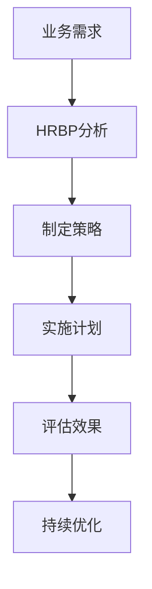

                 

### 1. 背景介绍

在当今快速发展的商业环境中，人力资源管理（HR）正经历着深刻的变革。传统的人力资源管理模式已经无法满足企业日益复杂的人才需求。人力资源业务伙伴（HR Business Partner，简称HRBP）的角色逐渐凸显，成为连接业务部门和人力资源管理的重要桥梁。HRBP不仅负责传统的人力资源管理职能，如招聘、培训、绩效管理等，更是在支持业务部门的人才需求方面发挥着关键作用。

HRBP的核心使命是帮助企业实现业务目标，通过优化人力资源管理策略来提升组织的竞争力。具体来说，HRBP需要深入了解业务部门的需求，与业务领导紧密合作，制定并实施符合业务战略的人才发展计划。在这个过程中，HRBP需要具备战略思维、业务敏锐度和强大的沟通协调能力。

本文将深入探讨HRBP在创业角色中的具体作用，分析其在支持业务部门人才需求方面的策略和实践，并探讨未来发展趋势和面临的挑战。

### 2. 核心概念与联系

#### HRBP的角色定位

人力资源业务伙伴（HR Business Partner）的角色定位是连接人力资源和业务部门的桥梁，其主要职责包括：

- **战略伙伴**：与业务部门领导合作，了解业务需求，制定符合业务战略的人力资源计划。
- **顾问**：提供人力资源咨询服务，帮助业务部门解决人才管理问题。
- **执行者**：实施人力资源管理政策，确保业务部门人才需求得到满足。

#### HRBP的核心能力

要胜任HRBP的角色，需要具备以下核心能力：

- **业务敏锐度**：深入了解业务战略、业务流程和业务需求，能够迅速响应业务变化。
- **沟通协调能力**：能够与不同层级的员工进行有效沟通，协调各部门之间的合作。
- **数据分析和决策能力**：运用数据分析工具，对人力资源数据进行深度挖掘，为决策提供数据支持。
- **变革管理能力**：能够推动组织变革，帮助员工适应新的管理政策和流程。

#### HRBP与业务部门的关系

HRBP与业务部门的关系是一种互动和协作的关系。具体体现在以下几个方面：

- **信息共享**：HRBP需要与业务部门共享关键信息，如市场趋势、竞争对手动态、业务目标等。
- **需求对接**：HRBP需要了解业务部门的人才需求，确保招聘、培训等人力资源活动与业务目标相匹配。
- **目标一致性**：HRBP与业务部门的目标是一致的，即通过人力资源管理提升组织的竞争力。

#### Mermaid 流程图

以下是一个简化的HRBP与业务部门关系的Mermaid流程图：



- **A[业务需求]**：业务部门提出人才需求。
- **B[HRBP分析]**：HRBP对业务需求进行分析。
- **C[制定策略]**：根据分析结果，制定符合业务需求的人力资源管理策略。
- **D[实施计划]**：执行人力资源计划，如招聘、培训等。
- **E[评估效果]**：对实施效果进行评估，反馈给业务部门。
- **F[持续优化]**：根据评估结果，持续优化人力资源管理策略。

### 3. 核心算法原理 & 具体操作步骤

在支持业务部门人才需求的过程中，HRBP需要运用一系列的算法和工具来分析和解决问题。以下是一些核心算法原理和具体操作步骤：

#### 3.1 数据分析算法

HRBP需要运用数据分析算法来挖掘人力资源数据，为决策提供支持。常见的数据分析算法包括：

- **回归分析**：用于预测人才需求，如招聘需求、培训需求等。
- **聚类分析**：用于识别人才群体，如高潜力人才、关键岗位人才等。
- **关联分析**：用于分析不同人力资源指标之间的关联，如招聘成功率与面试轮次的关系。

**具体操作步骤**：

1. **数据收集**：收集相关的人力资源数据，如招聘数据、培训数据、绩效数据等。
2. **数据清洗**：清洗数据，去除重复、错误和不完整的数据。
3. **数据探索**：使用可视化工具，对数据进行分析和探索，发现数据中的规律和异常。
4. **模型建立**：根据数据分析结果，建立相应的预测模型或分类模型。
5. **模型验证**：使用验证集或测试集，验证模型的准确性和可靠性。
6. **模型应用**：将模型应用到实际业务中，如预测招聘需求、识别高潜力人才等。

#### 3.2 招聘算法

招聘算法是HRBP支持业务部门人才需求的重要工具。常见的招聘算法包括：

- **关键词匹配**：根据职位描述和简历内容，自动匹配关键词。
- **机器学习算法**：如决策树、支持向量机等，用于评估候选人的质量和匹配度。
- **神经网络算法**：用于构建复杂的招聘模型，如简历评分、面试评分等。

**具体操作步骤**：

1. **职位发布**：根据业务需求，发布相应的职位。
2. **简历收集**：通过招聘平台、社交媒体等渠道，收集候选人的简历。
3. **简历筛选**：使用关键词匹配和机器学习算法，对简历进行筛选。
4. **面试安排**：根据简历筛选结果，安排面试。
5. **候选人评估**：使用神经网络算法等评估工具，对候选人进行综合评估。
6. **录用决策**：根据评估结果，做出录用决策。

#### 3.3 培训算法

培训算法是HRBP支持业务部门人才需求的重要手段。常见的培训算法包括：

- **需求分析**：使用数据分析算法，识别员工培训需求。
- **课程推荐**：根据员工需求，推荐相应的培训课程。
- **效果评估**：使用评估算法，评估培训效果。

**具体操作步骤**：

1. **需求收集**：收集员工培训需求，如技能提升、职业发展等。
2. **数据分析**：使用数据分析算法，对培训需求进行分析。
3. **课程推荐**：根据数据分析结果，推荐相应的培训课程。
4. **培训实施**：根据课程推荐，实施培训计划。
5. **效果评估**：使用评估算法，评估培训效果，反馈给业务部门。

### 4. 数学模型和公式 & 详细讲解 & 举例说明

在支持业务部门人才需求的过程中，HRBP需要运用一系列的数学模型和公式来分析和解决问题。以下是一些核心数学模型和公式，以及详细讲解和举例说明。

#### 4.1 回归模型

回归模型是一种常用的预测模型，用于预测某个变量（如人才需求）与其他变量（如时间、市场趋势等）之间的关系。常见的回归模型包括线性回归、多元回归等。

**公式**：

$$
y = \beta_0 + \beta_1x_1 + \beta_2x_2 + ... + \beta_nx_n
$$

其中，$y$ 为预测变量，$x_1, x_2, ..., x_n$ 为自变量，$\beta_0, \beta_1, ..., \beta_n$ 为模型参数。

**详细讲解**：

1. **数据收集**：收集历史数据，包括预测变量和自变量。
2. **数据预处理**：对数据进行清洗、归一化等处理。
3. **模型建立**：使用最小二乘法等算法，建立回归模型。
4. **模型验证**：使用验证集或测试集，验证模型的准确性和可靠性。
5. **模型应用**：将模型应用到实际业务中，如预测招聘需求、培训需求等。

**举例说明**：

假设我们想要预测下一个季度的招聘需求。我们收集了过去5年的招聘数据，包括季度和招聘数量。使用线性回归模型，我们可以建立以下回归方程：

$$
招聘数量 = \beta_0 + \beta_1 \times 季度
$$

通过训练数据和模型验证，我们得到：

$$
\beta_0 = 50, \beta_1 = 20
$$

因此，预测下一个季度的招聘数量为：

$$
招聘数量 = 50 + 20 \times 季度
$$

如果下一个季度是第四季度，则预测的招聘数量为：

$$
招聘数量 = 50 + 20 \times 4 = 110
$$

#### 4.2 决策树模型

决策树模型是一种常用的分类模型，用于将数据分为不同的类别。决策树通过一系列的判断节点和叶子节点，对数据进行分类。

**公式**：

$$
分类结果 = 决策树(\text{特征1}, \text{特征2}, ..., \text{特征n})
$$

**详细讲解**：

1. **数据收集**：收集历史数据，包括特征和分类结果。
2. **数据预处理**：对数据进行清洗、归一化等处理。
3. **模型建立**：使用ID3、C4.5等算法，建立决策树模型。
4. **模型验证**：使用验证集或测试集，验证模型的准确性和可靠性。
5. **模型应用**：将模型应用到实际业务中，如简历筛选、面试评分等。

**举例说明**：

假设我们想要根据简历的某些特征（如学历、工作经验等）来预测候选人是否适合某个职位。我们收集了过去1000份简历的数据，包括学历、工作经验和是否适合职位等特征。使用C4.5算法，我们可以建立以下决策树模型：

```
是否适合职位？
  /             \
是               否
/                 \
适合             不适合
```

根据决策树模型，如果候选人的学历是本科及以上，且工作经验超过3年，则预测为适合职位；否则，预测为不适合职位。

### 5. 项目实战：代码实际案例和详细解释说明

#### 5.1 开发环境搭建

在本案例中，我们将使用Python语言和相关的库（如scikit-learn、pandas等）来搭建一个简单的人才需求预测模型。以下是搭建开发环境的基本步骤：

1. **安装Python**：确保已安装Python 3.x版本，可以从Python官网下载。
2. **安装必要的库**：使用pip命令安装所需的库，例如：
   ```shell
   pip install numpy pandas scikit-learn matplotlib
   ```

#### 5.2 源代码详细实现和代码解读

以下是一个简单的人才需求预测模型的实现：

```python
import pandas as pd
from sklearn.model_selection import train_test_split
from sklearn.linear_model import LinearRegression
from sklearn.metrics import mean_squared_error

# 5.2.1 数据加载
data = pd.read_csv('hr_data.csv')
X = data[['季度']]
y = data['招聘数量']

# 5.2.2 数据预处理
X_train, X_test, y_train, y_test = train_test_split(X, y, test_size=0.2, random_state=42)

# 5.2.3 模型建立
model = LinearRegression()
model.fit(X_train, y_train)

# 5.2.4 模型评估
y_pred = model.predict(X_test)
mse = mean_squared_error(y_test, y_pred)
print(f"均方误差（MSE）: {mse}")

# 5.2.5 模型应用
next_quarter = pd.DataFrame([[4]], columns=['季度'])
predicted_demand = model.predict(next_quarter)
print(f"预测的下一季度招聘数量: {predicted_demand[0]}")
```

**代码解读**：

1. **数据加载**：使用pandas库加载CSV格式的数据。
2. **数据预处理**：使用train_test_split函数将数据分为训练集和测试集。
3. **模型建立**：使用LinearRegression类建立线性回归模型，并使用fit方法进行训练。
4. **模型评估**：使用预测集和实际招聘数量计算均方误差（MSE）来评估模型性能。
5. **模型应用**：使用预测模型来预测下一季度的招聘数量。

#### 5.3 代码解读与分析

在上述代码中，我们首先导入了必要的库。接着，使用pandas库加载了CSV格式的数据，并分离了特征（季度）和目标变量（招聘数量）。然后，我们将数据分为训练集和测试集。

接下来，我们使用LinearRegression类建立了线性回归模型，并使用fit方法对其进行了训练。训练完成后，我们使用预测集来评估模型的性能，计算了均方误差（MSE）。

最后，我们使用训练好的模型来预测下一季度的招聘数量。这个模型可以作为一个简单的工具，帮助HRBP预测业务部门的人才需求。

### 6. 实际应用场景

#### 6.1 招聘需求预测

在招聘领域，HRBP可以使用人才需求预测模型来预测未来的招聘需求。通过分析历史招聘数据和市场趋势，HRBP可以提前制定招聘计划，避免因为需求不足或过剩而影响业务的正常运行。

例如，某互联网公司在上一季度共招聘了50名员工，同时市场数据显示，下一个季度该公司的竞争对手也将扩大招聘规模。HRBP可以使用回归模型预测下一个季度的招聘需求，并提前制定招聘计划，确保公司能够及时补充所需的人才。

#### 6.2 培训需求分析

在培训领域，HRBP可以通过分析员工的工作表现和技能需求，预测哪些员工需要参加培训。例如，某公司的销售团队在上一季度的业绩不佳，HRBP可以通过分析数据，预测哪些销售人员需要参加销售技能培训，以提高团队的业绩。

#### 6.3 绩效评估

HRBP还可以使用人才需求预测模型来辅助绩效评估。通过预测员工未来的绩效表现，HRBP可以提前识别出可能存在绩效问题的员工，并采取相应的措施，如提供额外的培训或调整工作职责。

#### 6.4 薪酬管理

在薪酬管理方面，HRBP可以使用人才需求预测模型来预测未来的人才需求，从而为薪酬决策提供依据。例如，如果预测未来某个岗位的人才需求将增加，HRBP可以提前考虑为该岗位的员工提供有竞争力的薪酬，以吸引和留住人才。

### 7. 工具和资源推荐

#### 7.1 学习资源推荐

- **书籍**：
  - 《数据科学入门》：适合初学者，详细介绍了数据分析的基础知识和方法。
  - 《Python数据分析》：适合有一定编程基础的读者，讲解了Python在数据分析中的应用。
- **论文**：
  - 《线性回归模型在人才需求预测中的应用》：探讨了线性回归模型在人才需求预测中的效果。
  - 《基于机器学习的人才需求预测研究》：分析了多种机器学习算法在人才需求预测中的应用。
- **博客**：
  - 《HRBP如何用数据分析提升业务效率》：分享了HRBP如何运用数据分析提升业务效率的实践经验。
  - 《人才需求预测：方法与应用》：详细介绍了人才需求预测的理论和实践方法。
- **网站**：
  - Coursera：提供了丰富的数据科学和机器学习课程，适合系统学习相关知识。
  - edX：提供了多个在线课程，涵盖了数据分析、机器学习等领域的知识。

#### 7.2 开发工具框架推荐

- **数据分析工具**：
  - Pandas：Python的数据分析库，适合处理大数据集。
  - NumPy：Python的科学计算库，支持数组操作。
  - Matplotlib：Python的可视化库，用于生成图表和图形。
- **机器学习框架**：
  - Scikit-learn：Python的机器学习库，提供了多种机器学习算法的实现。
  - TensorFlow：Google开发的深度学习框架，适用于复杂的机器学习任务。
  - PyTorch：Facebook开发的深度学习框架，具有灵活性和高效性。

#### 7.3 相关论文著作推荐

- **《数据挖掘：概念与技术》**：详细介绍了数据挖掘的基本概念、方法和应用。
- **《机器学习实战》**：通过实际案例，讲解了多种机器学习算法的应用。
- **《深度学习》**：全面介绍了深度学习的基础知识和应用。

### 8. 总结：未来发展趋势与挑战

随着大数据和人工智能技术的不断发展，人力资源业务伙伴（HRBP）在支持业务部门人才需求方面将扮演更加重要的角色。未来，HRBP将面临以下发展趋势和挑战：

#### 8.1 发展趋势

- **数据分析与人工智能的深度融合**：HRBP将更多地依赖数据分析与人工智能技术来预测人才需求、优化招聘和培训策略。
- **个性化人力资源管理**：通过大数据分析，HRBP将能够提供更加个性化的人力资源服务，满足不同员工的需求。
- **实时数据监控与决策**：实时数据监控和决策将帮助HRBP更快速地响应业务变化，提升人力资源管理效率。

#### 8.2 挑战

- **数据隐私与安全**：随着数据量的增加，如何保障数据隐私和安全将成为HRBP面临的重要挑战。
- **跨部门协作与沟通**：在大型企业中，跨部门协作与沟通将更加复杂，HRBP需要提升沟通协调能力，以实现业务目标。
- **技能与知识更新**：随着技术的发展，HRBP需要不断学习新的数据分析工具和算法，以适应不断变化的需求。

### 9. 附录：常见问题与解答

#### 9.1 什么是人力资源业务伙伴（HRBP）？

人力资源业务伙伴（HRBP）是一种新兴的人力资源管理模式，主要负责连接人力资源和业务部门，通过提供人力资源管理咨询服务和支持业务部门的人才需求，帮助企业实现业务目标。

#### 9.2 HRBP需要具备哪些核心能力？

HRBP需要具备以下核心能力：业务敏锐度、沟通协调能力、数据分析和决策能力、变革管理能力。

#### 9.3 如何运用数据分析算法预测人才需求？

可以通过以下步骤运用数据分析算法预测人才需求：

1. 收集历史数据，包括招聘数据、培训数据、绩效数据等。
2. 清洗和预处理数据，去除重复、错误和不完整的数据。
3. 使用回归分析、聚类分析、关联分析等算法，建立预测模型。
4. 验证模型的准确性和可靠性。
5. 将模型应用到实际业务中，如预测招聘需求、培训需求等。

### 10. 扩展阅读 & 参考资料

- **《HRBP实战手册》**：详细介绍了HRBP在企业管理中的实际应用案例和操作方法。
- **《大数据与人力资源管理》**：探讨了大数据在人力资源管理中的应用，包括人才需求预测、绩效评估等。
- **《人工智能与人力资源管理》**：分析了人工智能技术在人力资源管理中的应用，如招聘、培训、绩效评估等。
- **相关学术论文和研究报告**：可查阅相关的学术论文和研究报告，了解最新的研究成果和趋势。

---

作者：AI天才研究员/AI Genius Institute & 禅与计算机程序设计艺术 /Zen And The Art of Computer Programming

---

### 文章标题：人力资源业务伙伴的创业角色：支持业务部门人才需求

关键词：(人力资源业务伙伴，HRBP，创业角色，人才需求，数据分析，人工智能，企业竞争力)

摘要：本文探讨了人力资源业务伙伴（HRBP）在创业角色中的具体作用，分析了其在支持业务部门人才需求方面的策略和实践。通过介绍数据分析算法、招聘算法和培训算法，以及实际应用案例，本文展示了HRBP在提升企业竞争力中的重要作用。同时，本文还展望了HRBP未来发展趋势和面临的挑战，为HRBP在企业发展中提供了有益的参考。

