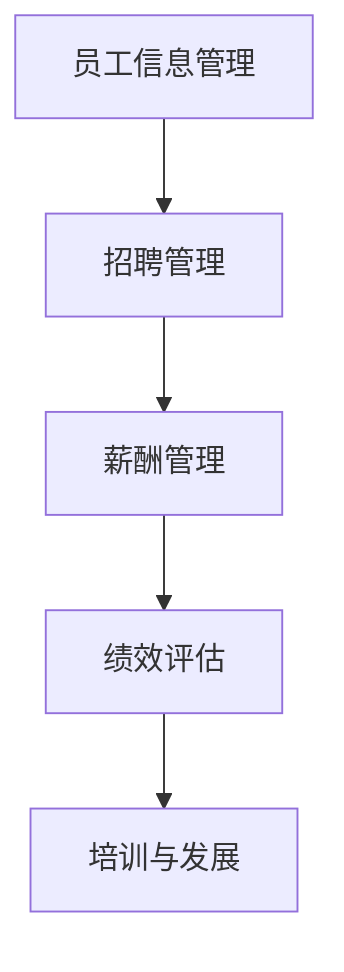

                 

# 人力资源软件开发者的创业机遇：开发创新的HR科技产品

## 概述

在当今快速发展的数字化时代，人力资源（HR）行业面临着巨大的变革和创新需求。随着企业对高效、智能的人力资源管理系统的需求日益增加，开发者们有机会在这个领域展开自己的创业项目。本文将探讨人力资源软件开发者如何抓住这个创业机遇，并开发出创新的HR科技产品。

## 背景介绍

### 人力资源行业的现状

人力资源行业在过去几十年中经历了显著的变化。传统的HR管理方式，如纸质文件和人工操作，已经无法满足现代企业的需求。企业需要更加高效、智能的HR管理系统，以提高员工满意度、降低管理成本并提升整体业务效率。

### 数字化转型的趋势

随着技术的不断进步，数字化转型已经成为企业发展的必然趋势。越来越多的企业开始采用云计算、人工智能、大数据分析等先进技术来优化其人力资源管理流程。这为开发者提供了丰富的创业机遇。

### 开发者面临的挑战

尽管人力资源软件开发领域充满机遇，但开发者也面临着一些挑战。首先，HR系统的复杂性较高，需要深入理解业务流程和用户需求。其次，安全性、合规性和用户体验是开发者需要重点关注的问题。

## 核心概念与联系

### HR科技产品的基本功能

HR科技产品通常包括员工信息管理、招聘管理、薪酬管理、绩效评估、培训与发展等功能。这些功能相互关联，共同构成了一个完整的HR管理系统。

### Mermaid流程图



### 核心概念之间的联系

员工信息管理是HR系统的核心，它为其他功能提供了基础数据。招聘管理负责管理招聘流程，薪酬管理确保员工的薪酬准确无误，绩效评估帮助管理者了解员工的工作表现，培训与发展则有助于提升员工的能力和职业发展。

## 核心算法原理 & 具体操作步骤

### 数据处理算法

HR科技产品需要处理大量的数据，包括员工信息、招聘信息、薪酬信息等。开发者可以使用各种数据处理算法来分析和提取有用的信息。例如，可以使用机器学习算法来预测员工的流失率，或使用数据分析算法来优化招聘流程。

### 具体操作步骤

1. 数据采集：从各种数据源（如数据库、API接口等）收集所需数据。
2. 数据清洗：去除重复、错误或不完整的数据，保证数据质量。
3. 数据分析：使用适当的算法对数据进行处理和分析，提取有用信息。
4. 数据可视化：将分析结果以图表、报表等形式展示，帮助管理者做出决策。

## 数学模型和公式 & 详细讲解 & 举例说明

### 流程优化模型

为了优化HR管理流程，开发者可以使用数学模型来分析和评估不同流程的效率。以下是一个简单的流程优化模型：

$$
\text{效率} = \frac{\text{完成任务所需时间}}{\text{流程总耗时}}
$$

### 举例说明

假设一个企业的招聘流程分为三个阶段：简历筛选、面试安排、录用决策。每个阶段的耗时分别为2天、3天和1天。整个流程的总耗时为6天。

$$
\text{效率} = \frac{2 + 3 + 1}{6} = \frac{6}{6} = 1
$$

这意味着该企业的招聘流程效率为100%，没有时间浪费。

## 项目实战：代码实际案例和详细解释说明

### 开发环境搭建

在开始开发HR科技产品之前，开发者需要搭建一个适合的开发环境。以下是一个简单的Python开发环境搭建步骤：

1. 安装Python：从Python官网下载并安装Python。
2. 安装IDE：选择一个合适的Python IDE（如PyCharm、VSCode等）。
3. 安装依赖库：使用pip命令安装所需的依赖库，如pandas、numpy等。

### 源代码详细实现和代码解读

以下是一个简单的Python代码示例，用于处理员工信息管理功能：

```python
import pandas as pd

# 读取员工信息数据
data = pd.read_csv('employee_data.csv')

# 显示前5条数据
print(data.head())

# 添加新员工信息
new_employee = {'name': '张三', 'age': 30, 'department': '研发部'}
data = data.append(new_employee, ignore_index=True)

# 显示更新后的数据
print(data.head())
```

### 代码解读与分析

1. 导入pandas库：用于数据处理和分析。
2. 读取员工信息数据：从CSV文件中读取员工信息。
3. 显示前5条数据：打印数据的前5行。
4. 添加新员工信息：创建一个包含新员工信息的字典，并使用`append`方法将其添加到数据集中。
5. 显示更新后的数据：打印更新后的数据集。

通过这个简单的示例，我们可以看到Python在处理员工信息管理方面的强大功能。开发者可以根据具体需求，进一步扩展和优化这个功能。

## 实际应用场景

### 招聘管理

招聘管理是HR科技产品中非常重要的一环。通过开发智能招聘系统，企业可以更快速、准确地筛选合适的候选人。例如，可以使用机器学习算法对简历进行自动筛选，提高招聘效率。

### 薪酬管理

薪酬管理是HR科技产品的另一个关键领域。开发者可以开发自动化薪酬管理系统，确保员工薪酬的准确性和及时性。此外，还可以使用数据分析工具来评估薪酬水平和员工满意度。

### 绩效评估

绩效评估是HR科技产品中的另一个重要功能。通过开发智能绩效评估系统，企业可以更客观、公正地评估员工的工作表现。例如，可以使用数据分析工具来计算员工的绩效得分，并生成详细的绩效报告。

### 培训与发展

培训与发展是提升员工能力和职业发展的重要途径。开发者可以开发在线培训平台，提供丰富的培训资源和个性化的学习路径。此外，还可以使用数据分析工具来评估培训效果，为员工提供更有针对性的培训建议。

## 工具和资源推荐

### 学习资源推荐

1. 《人工智能应用实践：HR领域的创新技术》
2. 《HR科技：数字化时代的变革与创新》
3. 《Python数据分析：从入门到精通》

### 开发工具框架推荐

1. Django：一个流行的Python Web框架，适用于快速开发HR管理系统。
2. React：一个流行的JavaScript库，适用于开发HR科技产品的前端界面。
3. TensorFlow：一个强大的机器学习库，适用于开发智能招聘系统等应用。

### 相关论文著作推荐

1. "HR Tech: Transforming the Workplace" by Josh Bersin
2. "The Future of HR: Six Disruptive Trends" by Deloitte
3. "Artificial Intelligence for HR: Transforming People Strategies" by IBM

## 总结：未来发展趋势与挑战

随着数字化转型的深入推进，人力资源软件开发领域将继续保持快速增长。未来，开发者将面临更多的挑战，如数据安全、合规性、用户体验等。同时，技术创新也将成为推动HR科技产品发展的关键因素。开发者需要不断学习新技术，不断创新，以满足企业不断变化的需求。

## 附录：常见问题与解答

### 问题1：如何确保HR科技产品的数据安全？

解答：确保数据安全是开发HR科技产品时的重要考虑因素。开发者可以使用以下方法来保障数据安全：

1. 数据加密：对敏感数据进行加密处理，防止数据泄露。
2. 访问控制：实施严格的访问控制机制，确保只有授权用户可以访问数据。
3. 安全审计：定期进行安全审计，检测潜在的安全漏洞。

### 问题2：如何优化招聘流程？

解答：优化招聘流程可以提高招聘效率，以下是一些优化招聘流程的建议：

1. 自动化简历筛选：使用机器学习算法自动筛选简历，缩短招聘周期。
2. 定制化招聘流程：根据不同职位的特点，设计个性化的招聘流程。
3. 招聘数据分析：使用数据分析工具评估招聘效果，优化招聘策略。

## 扩展阅读 & 参考资料

1. "HR Tech 2022: The Future is Here" by HR Technologist
2. "The Rise of HR Tech: A Deep Dive into the Market" by Deloitte
3. "Developing HR Technology: A Practical Guide for Startups and Enterprises" by HR Tech Institute

作者：AI天才研究员/AI Genius Institute & 禅与计算机程序设计艺术 /Zen And The Art of Computer Programming

（完）<|im_sep|>```markdown
# 人力资源软件开发者的创业机遇：开发创新的HR科技产品

## 概述

在当今快速发展的数字化时代，人力资源（HR）行业面临着巨大的变革和创新需求。随着企业对高效、智能的人力资源管理系统的需求日益增加，开发者们有机会在这个领域展开自己的创业项目。本文将探讨人力资源软件开发者如何抓住这个创业机遇，并开发出创新的HR科技产品。

## 背景介绍

### 人力资源行业的现状

人力资源行业在过去几十年中经历了显著的变化。传统的HR管理方式，如纸质文件和人工操作，已经无法满足现代企业的需求。企业需要更加高效、智能的HR管理系统，以提高员工满意度、降低管理成本并提升整体业务效率。

### 数字化转型的趋势

随着技术的不断进步，数字化转型已经成为企业发展的必然趋势。越来越多的企业开始采用云计算、人工智能、大数据分析等先进技术来优化其人力资源管理流程。这为开发者提供了丰富的创业机遇。

### 开发者面临的挑战

尽管人力资源软件开发领域充满机遇，但开发者也面临着一些挑战。首先，HR系统的复杂性较高，需要深入理解业务流程和用户需求。其次，安全性、合规性和用户体验是开发者需要重点关注的问题。

## 核心概念与联系

### HR科技产品的基本功能

HR科技产品通常包括员工信息管理、招聘管理、薪酬管理、绩效评估、培训与发展等功能。这些功能相互关联，共同构成了一个完整的HR管理系统。

### Mermaid流程图


### 核心概念之间的联系

员工信息管理是HR系统的核心，它为其他功能提供了基础数据。招聘管理负责管理招聘流程，薪酬管理确保员工的薪酬准确无误，绩效评估帮助管理者了解员工的工作表现，培训与发展则有助于提升员工的能力和职业发展。

## 核心算法原理 & 具体操作步骤

### 数据处理算法

HR科技产品需要处理大量的数据，包括员工信息、招聘信息、薪酬信息等。开发者可以使用各种数据处理算法来分析和提取有用的信息。例如，可以使用机器学习算法来预测员工的流失率，或使用数据分析算法来优化招聘流程。

### 具体操作步骤

1. 数据采集：从各种数据源（如数据库、API接口等）收集所需数据。
2. 数据清洗：去除重复、错误或不完整的数据，保证数据质量。
3. 数据分析：使用适当的算法对数据进行处理和分析，提取有用信息。
4. 数据可视化：将分析结果以图表、报表等形式展示，帮助管理者做出决策。

## 数学模型和公式 & 详细讲解 & 举例说明

### 流程优化模型

为了优化HR管理流程，开发者可以使用数学模型来分析和评估不同流程的效率。以下是一个简单的流程优化模型：

$$
\text{效率} = \frac{\text{完成任务所需时间}}{\text{流程总耗时}}
$$

### 举例说明

假设一个企业的招聘流程分为三个阶段：简历筛选、面试安排、录用决策。每个阶段的耗时分别为2天、3天和1天。整个流程的总耗时为6天。

$$
\text{效率} = \frac{2 + 3 + 1}{6} = \frac{6}{6} = 1
$$

这意味着该企业的招聘流程效率为100%，没有时间浪费。

## 项目实战：代码实际案例和详细解释说明

### 开发环境搭建

在开始开发HR科技产品之前，开发者需要搭建一个适合的开发环境。以下是一个简单的Python开发环境搭建步骤：

1. 安装Python：从Python官网下载并安装Python。
2. 安装IDE：选择一个合适的Python IDE（如PyCharm、VSCode等）。
3. 安装依赖库：使用pip命令安装所需的依赖库，如pandas、numpy等。

### 源代码详细实现和代码解读

以下是一个简单的Python代码示例，用于处理员工信息管理功能：

```python
import pandas as pd

# 读取员工信息数据
data = pd.read_csv('employee_data.csv')

# 显示前5条数据
print(data.head())

# 添加新员工信息
new_employee = {'name': '张三', 'age': 30, 'department': '研发部'}
data = data.append(new_employee, ignore_index=True)

# 显示更新后的数据
print(data.head())
```

### 代码解读与分析

1. 导入pandas库：用于数据处理和分析。
2. 读取员工信息数据：从CSV文件中读取员工信息。
3. 显示前5条数据：打印数据的前5行。
4. 添加新员工信息：创建一个包含新员工信息的字典，并使用`append`方法将其添加到数据集中。
5. 显示更新后的数据：打印更新后的数据集。

通过这个简单的示例，我们可以看到Python在处理员工信息管理方面的强大功能。开发者可以根据具体需求，进一步扩展和优化这个功能。

## 实际应用场景

### 招聘管理

招聘管理是HR科技产品中非常重要的一环。通过开发智能招聘系统，企业可以更快速、准确地筛选合适的候选人。例如，可以使用机器学习算法自动筛选简历，提高招聘效率。

### 薪酬管理

薪酬管理是HR科技产品的另一个关键领域。开发者可以开发自动化薪酬管理系统，确保员工薪酬的准确性和及时性。此外，还可以使用数据分析工具来评估薪酬水平和员工满意度。

### 绩效评估

绩效评估是HR科技产品中的另一个重要功能。通过开发智能绩效评估系统，企业可以更客观、公正地评估员工的工作表现。例如，可以使用数据分析工具来计算员工的绩效得分，并生成详细的绩效报告。

### 培训与发展

培训与发展是提升员工能力和职业发展的重要途径。开发者可以开发在线培训平台，提供丰富的培训资源和个性化的学习路径。此外，还可以使用数据分析工具来评估培训效果，为员工提供更有针对性的培训建议。

## 工具和资源推荐

### 学习资源推荐

1. 《人工智能应用实践：HR领域的创新技术》
2. 《HR科技：数字化时代的变革与创新》
3. 《Python数据分析：从入门到精通》

### 开发工具框架推荐

1. Django：一个流行的Python Web框架，适用于快速开发HR管理系统。
2. React：一个流行的JavaScript库，适用于开发HR科技产品的前端界面。
3. TensorFlow：一个强大的机器学习库，适用于开发智能招聘系统等应用。

### 相关论文著作推荐

1. "HR Tech: Transforming the Workplace" by Josh Bersin
2. "The Future of HR: Six Disruptive Trends" by Deloitte
3. "Artificial Intelligence for HR: Transforming People Strategies" by IBM

## 总结：未来发展趋势与挑战

随着数字化转型的深入推进，人力资源软件开发领域将继续保持快速增长。未来，开发者将面临更多的挑战，如数据安全、合规性、用户体验等。同时，技术创新也将成为推动HR科技产品发展的关键因素。开发者需要不断学习新技术，不断创新，以满足企业不断变化的需求。

## 附录：常见问题与解答

### 问题1：如何确保HR科技产品的数据安全？

解答：确保数据安全是开发HR科技产品时的重要考虑因素。开发者可以使用以下方法来保障数据安全：

- 数据加密：对敏感数据进行加密处理，防止数据泄露。
- 访问控制：实施严格的访问控制机制，确保只有授权用户可以访问数据。
- 安全审计：定期进行安全审计，检测潜在的安全漏洞。

### 问题2：如何优化招聘流程？

解答：优化招聘流程可以提高招聘效率，以下是一些优化招聘流程的建议：

- 自动化简历筛选：使用机器学习算法自动筛选简历，缩短招聘周期。
- 定制化招聘流程：根据不同职位的特点，设计个性化的招聘流程。
- 招聘数据分析：使用数据分析工具评估招聘效果，优化招聘策略。

## 扩展阅读 & 参考资料

1. "HR Tech 2022: The Future is Here" by HR Technologist
2. "The Rise of HR Tech: A Deep Dive into the Market" by Deloitte
3. "Developing HR Technology: A Practical Guide for Startups and Enterprises" by HR Tech Institute

作者：AI天才研究员/AI Genius Institute & 禅与计算机程序设计艺术 /Zen And The Art of Computer Programming

（完）
```

