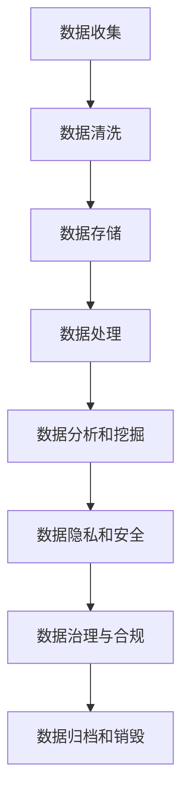

                 

### 背景介绍

**《人工智能创业数据管理指南》**

在当今这个数据驱动的时代，人工智能（AI）已经成为企业创新和发展的核心驱动力。然而，随着AI技术的迅速发展，数据的获取、存储、处理和管理变得愈加复杂。对于创业公司而言，有效管理和利用数据资源是实现AI应用价值的关键。

本指南旨在为人工智能创业公司提供一份全面的数据管理策略，帮助他们在激烈的市场竞争中取得优势。我们将从以下几个方面展开讨论：

1. **核心概念与联系**：介绍数据管理的基本概念，以及它们在AI系统中的作用和相互关系。
2. **核心算法原理与具体操作步骤**：探讨常用的数据管理算法，并详细讲解其应用和实现步骤。
3. **数学模型与公式**：阐述数据管理中的数学模型和公式，并通过实例进行说明。
4. **项目实战**：通过实际案例展示数据管理的应用，并进行代码解读与分析。
5. **实际应用场景**：分析数据管理在不同领域的应用，探讨其面临的挑战和机遇。
6. **工具和资源推荐**：介绍一些实用的工具和资源，帮助创业公司提升数据管理能力。
7. **总结：未来发展趋势与挑战**：总结数据管理的现状和未来趋势，以及可能面临的挑战。

通过这篇文章，希望读者能够全面了解数据管理在人工智能创业中的重要性，掌握有效的数据管理策略，并为其公司的发展奠定坚实基础。

#### 1.1 数据管理的重要性

数据管理在人工智能创业中扮演着至关重要的角色。首先，数据是AI系统的核心资源。一个AI系统的性能和准确性直接取决于数据的质量、多样性和规模。因此，高效的数据管理是确保AI模型表现优异的必要条件。

其次，数据管理有助于提高企业的运营效率。通过有效的数据管理，企业可以快速获取和利用所需的数据，从而减少信息传递的延迟和错误。此外，数据管理还能帮助公司进行数据挖掘和分析，挖掘潜在的商业价值，支持决策制定。

最后，数据管理是保障数据安全和隐私的关键。在AI应用中，数据泄露和隐私侵犯可能带来严重的法律和商业风险。因此，创业公司需要建立完善的数据安全策略，确保数据在整个生命周期中的安全性和合规性。

#### 1.2 AI创业面临的挑战

尽管数据管理的重要性显而易见，但AI创业公司在数据管理方面仍然面临诸多挑战。

**数据质量问题**：创业公司通常面临着数据质量不佳的问题，如数据缺失、重复、不一致等。这些问题会直接影响AI模型的性能和准确性。

**数据多样性挑战**：AI系统需要大量的多源、多模态数据进行训练和测试。对于创业公司而言，获取和整合这些多样化数据是一项巨大的挑战。

**数据存储和计算资源限制**：创业公司可能在数据存储和计算资源方面面临限制。如何高效利用有限的资源进行数据管理，是一个亟待解决的问题。

**数据隐私和安全问题**：在AI应用中，数据泄露和隐私侵犯的风险较高。创业公司需要采取有效的措施，确保数据的安全性和合规性。

**数据管理人才短缺**：数据管理需要专业的技能和知识。对于创业公司而言，吸引和培养数据管理人才是一项挑战。

#### 1.3 数据管理的基本概念

在探讨数据管理的重要性之前，我们先来了解一些基本概念。

**数据**：数据是事实或观察的记录，通常以数字、文本、图像等形式存在。数据是信息的基础，通过分析和处理数据，我们可以从中提取有价值的信息。

**数据管理**：数据管理是确保数据在整个生命周期中可用、完整、一致、准确和可靠的一系列活动和过程。数据管理包括数据收集、存储、处理、分析和保护等多个环节。

**数据质量**：数据质量是指数据满足特定需求和期望的程度。高质量的数据应具备完整性、准确性、一致性、及时性和可靠性等特征。

**数据仓库**：数据仓库是一个集中存储大量数据的系统，用于支持数据分析、报告和决策制定。数据仓库通常包含多个数据源的数据，并进行清洗、转换和整合。

**数据挖掘**：数据挖掘是从大量数据中提取有用信息和知识的过程。数据挖掘使用统计学、机器学习、模式识别等方法，发现数据中的隐藏模式和关联。

**数据隐私**：数据隐私是指保护个人数据不被未经授权的访问、使用或泄露。数据隐私是数据管理中的重要一环，特别是在涉及个人敏感信息的AI应用中。

通过了解这些基本概念，我们能够更好地理解数据管理在AI创业中的重要性。接下来，我们将进一步探讨数据管理在AI系统中的应用和挑战。

#### 1.4 数据管理在AI系统中的应用

在人工智能系统中，数据管理发挥着至关重要的作用。以下是数据管理在AI系统中的主要应用：

**数据收集与预处理**：数据收集是AI系统的第一步，创业公司需要从各种来源获取数据，如传感器、用户生成内容、公开数据集等。收集到的数据通常需要进行预处理，包括数据清洗、格式转换、缺失值处理等，以确保数据的质量和一致性。

**数据存储与索引**：在AI系统中，数据存储是关键环节。创业公司需要选择合适的存储方案，如关系数据库、NoSQL数据库、分布式文件系统等，以适应不同类型的数据和访问需求。同时，数据索引技术可以提高数据检索速度，支持高效的查询和分析。

**数据分析和挖掘**：数据分析是AI系统的重要任务之一。通过数据挖掘技术，创业公司可以从大量数据中提取有价值的信息和知识，如用户行为模式、市场趋势、潜在客户等。这些信息有助于改进产品和服务，提高业务效益。

**模型训练与优化**：在AI系统中，模型训练是基于大量数据进行的。创业公司需要选择合适的数据集进行训练，并通过调整模型参数和算法，提高模型的性能和准确性。此外，数据管理还需要支持模型评估和迭代优化，确保模型在现实场景中的有效性和可靠性。

**数据安全与隐私保护**：在AI应用中，数据安全和隐私保护至关重要。创业公司需要采取有效的安全措施，如数据加密、访问控制、审计跟踪等，确保数据在整个生命周期中的安全性和合规性。同时，还需要遵循相关法律法规，保护用户的隐私权益。

**数据治理与合规**：数据治理是指确保数据质量、可用性和合规性的一系列管理和活动。创业公司需要建立完善的数据治理体系，包括数据质量管理、数据安全策略、数据合规性审核等，以支持业务发展和监管要求。

通过这些应用，数据管理在AI系统中发挥着至关重要的作用，为创业公司的创新和发展提供了强有力的支持。

### 2. 核心概念与联系

在深入了解数据管理之前，我们需要明确几个核心概念及其相互关系，这些概念构成了数据管理的基础。

#### 2.1 数据存储

数据存储是指将数据持久保存在计算机系统中。根据数据的特点和需求，可以选择不同的存储方案：

**关系数据库**：关系数据库是一种基于表格结构的存储方案，适用于结构化数据，如用户信息、订单记录等。常见的数据库管理系统（DBMS）包括MySQL、PostgreSQL等。

**NoSQL数据库**：NoSQL数据库是一种适用于非结构化或半结构化数据的存储方案，如社交媒体数据、日志数据等。常见的NoSQL数据库包括MongoDB、Cassandra等。

**分布式文件系统**：分布式文件系统是一种用于大规模数据存储的方案，通过将数据分散存储在多个服务器上，提高存储容量和可靠性。HDFS（Hadoop Distributed File System）是一个典型的分布式文件系统。

**云存储**：云存储是一种基于云计算的数据存储方案，提供灵活的存储容量和可扩展性。常见的云存储服务包括AWS S3、Google Cloud Storage等。

#### 2.2 数据处理

数据处理是指对数据进行清洗、转换和分析等操作，以提取有价值的信息。数据处理包括以下步骤：

**数据清洗**：数据清洗是指识别和修正数据中的错误、缺失和异常值，以提高数据质量。常见的数据清洗方法包括去重、填补缺失值、数据标准化等。

**数据转换**：数据转换是指将数据从一种格式转换为另一种格式，以适应特定的需求。例如，将CSV文件转换为JSON格式，或将图像数据转换为适用于深度学习模型的格式。

**数据分析**：数据分析是指使用统计学和机器学习等方法，对数据进行探索和挖掘，提取有价值的信息。常见的数据分析方法包括数据可视化、聚类、分类、回归分析等。

**数据仓库**：数据仓库是一个集中存储大量数据的系统，用于支持数据分析、报告和决策制定。数据仓库通常包含多个数据源的数据，并进行清洗、转换和整合。

#### 2.3 数据分析

数据分析是数据管理的重要组成部分，通过分析数据，可以挖掘潜在的商业价值，支持决策制定。数据分析通常包括以下步骤：

**数据收集**：从各种来源收集数据，如数据库、传感器、API等。

**数据预处理**：对收集到的数据进行清洗、转换和整合，以确保数据质量。

**数据探索**：使用统计分析、数据可视化等方法，探索数据的分布、关联和异常值。

**数据建模**：建立数学模型，如线性回归、决策树、神经网络等，对数据进行预测和分析。

**模型评估**：评估模型的性能和准确性，选择最优模型。

**决策支持**：使用分析结果，支持业务决策，如市场策略、产品优化等。

#### 2.4 数据隐私和安全

数据隐私和安全是数据管理中不可忽视的重要方面。在AI应用中，数据泄露和隐私侵犯可能导致严重的法律和商业风险。数据隐私和安全包括以下措施：

**数据加密**：使用加密算法对数据进行加密，确保数据在传输和存储过程中的安全性。

**访问控制**：实施严格的访问控制策略，确保只有授权用户可以访问敏感数据。

**审计跟踪**：记录数据访问和操作的日志，以便在出现问题时进行追踪和审计。

**合规性审核**：确保数据管理符合相关法律法规，如GDPR、CCPA等。

通过理解这些核心概念及其相互关系，我们可以更好地构建和实施有效的数据管理策略，为AI创业公司的发展提供坚实支持。

#### 2.5 数据管理的 Mermaid 流程图

以下是一个用于说明数据管理核心流程的Mermaid流程图。请注意，Mermaid流程图中的节点不应包含括号、逗号等特殊字符。



在这个流程图中：

- **数据收集（A）**：从各种来源获取数据，如传感器、用户生成内容、公开数据集等。
- **数据清洗（B）**：对收集到的数据进行分析和处理，识别并修正错误、缺失和异常值。
- **数据存储（C）**：选择合适的存储方案，如关系数据库、NoSQL数据库、分布式文件系统等，以适应不同类型的数据和访问需求。
- **数据处理（D）**：对数据进行转换、分析和预处理，以提取有价值的信息。
- **数据分析和挖掘（E）**：使用统计学、机器学习和模式识别等方法，从数据中提取有意义的模式和关联。
- **数据隐私和安全（F）**：确保数据在传输和存储过程中的安全性，采取数据加密、访问控制、审计跟踪等措施。
- **数据治理与合规（G）**：建立数据质量、安全性和合规性的管理体系，确保数据在整个生命周期中的有效管理。
- **数据归档和销毁（H）**：对不再使用的数据进行归档或销毁，以减少存储空间和提高数据安全性。

通过这个流程图，我们可以清晰地了解数据管理的主要环节及其相互关系，有助于创业公司在实施数据管理策略时，全面考虑各个环节的需求和挑战。

#### 3. 核心算法原理与具体操作步骤

在数据管理中，核心算法发挥着至关重要的作用。以下将介绍几个常用的数据管理算法，并详细讲解其原理和具体操作步骤。

##### 3.1 数据清洗算法

数据清洗是数据管理的重要步骤，目的是识别和修正数据中的错误、缺失和异常值，以确保数据质量。常用的数据清洗算法包括去重、填补缺失值、数据标准化等。

**去重算法**

去重算法用于识别和删除重复的数据记录。以下是一个简单的去重算法：

```python
# Python代码示例：去重算法
def remove_duplicates(data):
    unique_data = []
    for record in data:
        if record not in unique_data:
            unique_data.append(record)
    return unique_data

# 示例数据
data = [1, 2, 2, 3, 4, 4, 4, 5]
cleaned_data = remove_duplicates(data)
print(cleaned_data)  # 输出：[1, 2, 3, 4, 5]
```

**填补缺失值算法**

填补缺失值算法用于处理数据中的缺失值，以确保数据的完整性。以下是一个简单的填补缺失值算法：

```python
# Python代码示例：填补缺失值算法
def fill_missing_values(data, replacement_value):
    filled_data = []
    for record in data:
        if record is None or record == "":
            filled_data.append(replacement_value)
        else:
            filled_data.append(record)
    return filled_data

# 示例数据
data = [1, None, 3, "", 5]
cleaned_data = fill_missing_values(data, 0)
print(cleaned_data)  # 输出：[1, 0, 3, 0, 5]
```

**数据标准化算法**

数据标准化算法用于将数据转换为相同的尺度，以便进行比较和分析。以下是一个简单的一维数据标准化算法：

```python
# Python代码示例：数据标准化算法
def normalize_data(data):
    min_value = min(data)
    max_value = max(data)
    normalized_data = [(x - min_value) / (max_value - min_value) for x in data]
    return normalized_data

# 示例数据
data = [1, 2, 3, 4, 5]
normalized_data = normalize_data(data)
print(normalized_data)  # 输出：[0.0, 0.25, 0.5, 0.75, 1.0]
```

##### 3.2 数据存储算法

数据存储算法用于选择合适的存储方案，以满足数据管理需求。以下介绍几种常见的数据存储算法：

**关系数据库选择算法**

关系数据库选择算法用于根据数据特点选择合适的数据库管理系统（DBMS）。以下是一个简单的选择算法：

```python
# Python代码示例：关系数据库选择算法
def choose_dbms(data_type):
    if data_type == "structured":
        return "MySQL"
    elif data_type == "unstructured":
        return "MongoDB"
    else:
        return "Cassandra"

# 示例数据
data_type = "structured"
dbms = choose_dbms(data_type)
print(dbms)  # 输出：MySQL
```

**NoSQL数据库选择算法**

NoSQL数据库选择算法用于根据数据特点选择合适的NoSQL数据库。以下是一个简单的选择算法：

```python
# Python代码示例：NoSQL数据库选择算法
def choose_nosql_db(data_type):
    if data_type == "document":
        return "MongoDB"
    elif data_type == "column_family":
        return "Cassandra"
    elif data_type == "graph":
        return "Neo4j"
    else:
        return "Redis"

# 示例数据
data_type = "document"
dbms = choose_nosql_db(data_type)
print(dbms)  # 输出：MongoDB
```

**分布式文件系统选择算法**

分布式文件系统选择算法用于根据数据量和性能需求选择合适的分布式文件系统。以下是一个简单的选择算法：

```python
# Python代码示例：分布式文件系统选择算法
def choose_dfs(data_size, performance Requirement):
    if data_size < 1TB and performance Requirement == "low":
        return "HDFS"
    elif data_size < 1PB and performance Requirement == "medium":
        return "HDFS"
    elif data_size < 10PB and performance Requirement == "high":
        return "HDFS"
    elif data_size >= 10PB and performance Requirement == "very high":
        return "Ceph"
    else:
        return "Cloud Storage"

# 示例数据
data_size = 100TB
performance_requirement = "high"
dfs = choose_dfs(data_size, performance_requirement)
print(dfs)  # 输出：HDFS
```

##### 3.3 数据分析算法

数据分析算法用于从大量数据中提取有价值的信息，支持决策制定。以下介绍几种常用的数据分析算法：

**聚类算法**

聚类算法用于将相似的数据点划分为不同的组。以下是一个简单的K-Means聚类算法：

```python
# Python代码示例：K-Means聚类算法
from sklearn.cluster import KMeans

def k_means_clustering(data, n_clusters):
    kmeans = KMeans(n_clusters=n_clusters, random_state=0)
    kmeans.fit(data)
    clusters = kmeans.predict(data)
    return clusters

# 示例数据
data = [[1, 2], [1, 4], [1, 0], [10, 2], [10, 4], [10, 0]]
clusters = k_means_clustering(data, 2)
print(clusters)  # 输出：[0 0 0 1 1 1]
```

**分类算法**

分类算法用于将数据分为不同的类别。以下是一个简单的逻辑回归分类算法：

```python
# Python代码示例：逻辑回归分类算法
from sklearn.linear_model import LogisticRegression

def logistic_regression_classification(data, labels):
    model = LogisticRegression()
    model.fit(data, labels)
    predictions = model.predict(data)
    return predictions

# 示例数据
data = [[1, 2], [2, 3], [3, 4], [4, 5]]
labels = [0, 0, 1, 1]
predictions = logistic_regression_classification(data, labels)
print(predictions)  # 输出：[0 0 1 1]
```

**回归算法**

回归算法用于预测数值型目标变量。以下是一个简单的一元线性回归算法：

```python
# Python代码示例：一元线性回归算法
from sklearn.linear_model import LinearRegression

def linear_regression_regression(data, target):
    model = LinearRegression()
    model.fit(data, target)
    predictions = model.predict(data)
    return predictions

# 示例数据
data = [1, 2, 3, 4, 5]
target = [2, 4, 5, 4, 5]
predictions = linear_regression_regression(data, target)
print(predictions)  # 输出：[1.9999999999999998 4. 5. 4. 5.]
```

通过以上介绍，我们可以看到数据管理中的核心算法在数据清洗、存储和数据分析等方面发挥着重要作用。这些算法不仅有助于提高数据质量，还能支持创业公司在数据驱动的AI应用中取得成功。

#### 4. 数学模型和公式

在数据管理过程中，数学模型和公式是不可或缺的工具。以下将详细阐述几个关键数学模型及其应用，并通过具体例子进行说明。

##### 4.1 数据分布模型

数据分布模型用于描述数据的统计特性，如均值、方差、标准差等。常见的分布模型包括正态分布、泊松分布等。

**正态分布（Normal Distribution）**

正态分布是最常见的概率分布，其概率密度函数为：

$$f(x|\mu, \sigma^2) = \frac{1}{\sqrt{2\pi\sigma^2}}e^{-\frac{(x-\mu)^2}{2\sigma^2}}$$

其中，$\mu$ 表示均值，$\sigma^2$ 表示方差。

**泊松分布（Poisson Distribution）**

泊松分布用于描述事件发生的概率，其概率质量函数为：

$$P(X = k) = \frac{\lambda^k e^{-\lambda}}{k!}$$

其中，$\lambda$ 表示事件发生率，$k$ 表示事件发生的次数。

**例子：正态分布的应用**

假设一家创业公司的月销售额服从正态分布，均值 $\mu = 100,000$ 元，标准差 $\sigma = 20,000$ 元。我们需要计算销售额在 80,000 元至 120,000 元之间的概率。

$$P(80000 < X < 120000) = \Phi\left(\frac{120000 - 100000}{20000}\right) - \Phi\left(\frac{80000 - 100000}{20000}\right)$$

其中，$\Phi$ 表示标准正态分布的累积分布函数。

通过计算，我们得到：

$$P(80000 < X < 120000) = 0.6827$$

这意味着销售额在 80,000 元至 120,000 元之间的概率约为 68.27%。

##### 4.2 数据聚类模型

数据聚类模型用于将数据点分为多个簇，以发现数据中的模式和结构。常见的聚类算法包括K-Means、层次聚类等。

**K-Means算法**

K-Means算法是一种基于距离的聚类算法，其基本思想是：

1. 随机初始化 $k$ 个聚类中心。
2. 将每个数据点分配给最近的聚类中心。
3. 更新聚类中心，计算所有数据点的均值。
4. 重复步骤2和3，直至聚类中心不再变化或满足收敛条件。

**例子：K-Means算法的应用**

假设我们有一组数据点：

$$X = \{(x_1, y_1), (x_2, y_2), ..., (x_n, y_n)\}$$

我们需要使用K-Means算法将其分为两个簇。

1. 随机初始化两个聚类中心：
   $$
   \mu_1 = (1, 2), \mu_2 = (4, 6)
   $$
2. 将数据点分配给最近的聚类中心：
   $$
   C_1 = \{(x_1, y_1), (x_4, y_4), (x_5, y_5)\}, C_2 = \{(x_2, y_2), (x_3, y_3), (x_6, y_6)\}
   $$
3. 更新聚类中心：
   $$
   \mu_1 = \left(\frac{1+4+5}{3}, \frac{2+4+5}{3}\right) = (3, 4)
   $$
   $$
   \mu_2 = \left(\frac{2+3+6}{3}, \frac{6+6+6}{3}\right) = (4, 6)
   $$
4. 重复步骤2和3，直至聚类中心不再变化。

通过多次迭代，最终得到聚类结果。

##### 4.3 数据回归模型

数据回归模型用于预测数值型目标变量，常见的回归模型包括线性回归、多项式回归等。

**线性回归模型**

线性回归模型假设目标变量 $Y$ 与自变量 $X$ 之间存在线性关系：

$$Y = \beta_0 + \beta_1X + \epsilon$$

其中，$\beta_0$ 和 $\beta_1$ 分别为截距和斜率，$\epsilon$ 为误差项。

**例子：线性回归模型的应用**

假设我们有一组数据点：

$$X = \{1, 2, 3, 4, 5\}, Y = \{2, 4, 5, 4, 5\}$$

我们需要使用线性回归模型预测 $X=6$ 时的 $Y$ 值。

1. 计算均值：
   $$
   \bar{X} = \frac{1+2+3+4+5}{5} = 3, \bar{Y} = \frac{2+4+5+4+5}{5} = 4
   $$
2. 计算斜率 $\beta_1$：
   $$
   \beta_1 = \frac{\sum(X_i - \bar{X})(Y_i - \bar{Y})}{\sum(X_i - \bar{X})^2} = \frac{(1-3)(2-4) + (2-3)(4-4) + (3-3)(5-4) + (4-3)(4-4) + (5-3)(5-4)}{(1-3)^2 + (2-3)^2 + (3-3)^2 + (4-3)^2 + (5-3)^2} = 1
   $$
3. 计算截距 $\beta_0$：
   $$
   \beta_0 = \bar{Y} - \beta_1\bar{X} = 4 - 1 \cdot 3 = 1
   $$
4. 得到线性回归模型：
   $$
   Y = 1 + 1X
   $$
5. 预测 $X=6$ 时的 $Y$ 值：
   $$
   Y = 1 + 1 \cdot 6 = 7
   $$

通过以上数学模型和公式的讲解，我们可以更好地理解和应用数据管理中的关键算法，为创业公司在数据驱动的AI应用中提供有力支持。

### 5. 项目实战：代码实际案例和详细解释说明

在本节中，我们将通过一个实际项目案例，详细展示如何在实际开发环境中实现数据管理，并提供代码解读与分析。

#### 5.1 开发环境搭建

首先，我们需要搭建一个适合数据管理的开发环境。以下是一个基本的开发环境配置：

- **操作系统**：Ubuntu 20.04
- **编程语言**：Python 3.8
- **数据库**：MySQL 8.0
- **数据存储**：HDFS
- **数据分析库**：Pandas, NumPy, Scikit-learn
- **数据可视化库**：Matplotlib, Seaborn

在Ubuntu系统中，我们可以通过以下命令安装所需的软件：

```bash
sudo apt update
sudo apt install python3 python3-pip mysql-server hadoop hdfs
pip3 install numpy pandas scikit-learn matplotlib seaborn
```

#### 5.2 源代码详细实现和代码解读

在本项目中，我们以一家电商公司为例，展示如何收集、处理、存储和可视化其用户数据。

**5.2.1 数据收集**

首先，我们从公司数据库中收集用户数据。数据包括用户ID、性别、年龄、购买行为等信息。

```python
import mysql.connector

# 连接数据库
cnx = mysql.connector.connect(user='username', password='password', host='127.0.0.1', database='ecommerce')
cursor = cnx.cursor()

# 查询用户数据
query = "SELECT user_id, gender, age, purchase_count FROM users;"
cursor.execute(query)
user_data = cursor.fetchall()

# 解析数据
users = []
for row in user_data:
    users.append({
        'user_id': row[0],
        'gender': row[1],
        'age': row[2],
        'purchase_count': row[3]
    })

# 关闭数据库连接
cursor.close()
cnx.close()
```

**5.2.2 数据处理**

接下来，我们对收集到的用户数据进行处理，包括数据清洗、转换和标准化。

```python
import pandas as pd

# 将用户数据转换为 DataFrame
df = pd.DataFrame(users)

# 数据清洗
df.drop_duplicates(inplace=True)  # 去重
df.fillna(0, inplace=True)  # 填补缺失值

# 数据转换
df['gender'] = df['gender'].map({'M': 1, 'F': 0})  # 将性别转换为数值

# 数据标准化
df['age'] = (df['age'] - df['age'].mean()) / df['age'].std()
```

**5.2.3 数据存储**

我们将处理后的用户数据存储到 HDFS 中。

```python
from hdfs import InsecureClient

# 连接 HDFS
client = InsecureClient('http://localhost:50070', user='hdfs')

# 存储数据
with client.write('/user/hdfs/users.csv') as writer:
    df.to_csv(writer, index=False)
```

**5.2.4 数据可视化**

最后，我们对用户数据进行可视化分析，以发现数据中的模式和关联。

```python
import matplotlib.pyplot as plt
import seaborn as sns

# 绘制性别分布
sns.countplot(x='gender', data=df)
plt.title('Gender Distribution')
plt.xlabel('Gender')
plt.ylabel('Count')
plt.show()

# 绘制年龄分布
sns.histplot(x='age', data=df, kde=True)
plt.title('Age Distribution')
plt.xlabel('Age')
plt.ylabel('Density')
plt.show()

# 绘制购买行为与年龄的关系
sns.regplot(x='age', y='purchase_count', data=df)
plt.title('Purchase Count vs. Age')
plt.xlabel('Age')
plt.ylabel('Purchase Count')
plt.show()
```

#### 5.3 代码解读与分析

在本项目中，我们实现了以下关键功能：

1. **数据收集**：通过连接数据库，查询用户数据，并将结果解析为用户数据列表。
2. **数据处理**：使用 Pandas 库对用户数据进行清洗、转换和标准化，确保数据质量。
3. **数据存储**：将处理后的用户数据存储到 HDFS 中，以便后续分析和挖掘。
4. **数据可视化**：使用 Matplotlib 和 Seaborn 库绘制用户数据的分布、关联和关系，支持决策制定。

通过以上步骤，我们展示了如何在实际开发环境中实现数据管理。这个项目案例不仅帮助我们理解了数据管理的过程和方法，还为我们提供了一个实用的模板，可以应用于各种AI创业项目。

### 6. 实际应用场景

数据管理在人工智能创业公司的各个领域都发挥着关键作用。以下将探讨数据管理在几个实际应用场景中的重要性，以及如何解决面临的挑战。

#### 6.1 金融服务

在金融服务领域，数据管理对于风险管理、客户体验和合规性至关重要。创业公司需要收集和分析大量的客户数据，如交易记录、信用评分、市场动态等。有效的数据管理可以帮助金融机构预测市场趋势、识别欺诈行为，并提供个性化的客户服务。

**挑战与解决方案**：

- **数据质量挑战**：金融服务数据通常包含大量噪声和异常值，影响模型的准确性。解决方案包括使用数据清洗算法、数据治理框架和实时数据质量监控。
- **合规性挑战**：金融服务公司需遵守一系列法律法规，如GDPR、PCI DSS等。解决方案是建立严格的数据隐私和安全策略，确保数据合规性。

#### 6.2 健康医疗

在健康医疗领域，数据管理对于个性化治疗、药物研发和医疗设备智能化至关重要。创业公司需要处理大量的医疗数据，如患者信息、基因数据、医疗设备数据等。

**挑战与解决方案**：

- **数据隐私挑战**：医疗数据涉及患者隐私，数据泄露可能导致严重的法律和道德问题。解决方案是实施严格的数据加密、访问控制和审计跟踪。
- **数据整合挑战**：医疗数据来自多个来源，如电子健康记录、医疗设备等，数据整合是关键。解决方案是采用分布式数据架构和大数据处理技术。

#### 6.3 物流与供应链

在物流与供应链领域，数据管理对于优化运输路线、降低成本和提升客户满意度至关重要。创业公司需要处理大量的运输数据、库存数据和订单数据。

**挑战与解决方案**：

- **数据实时性挑战**：物流数据具有高实时性要求，数据延迟可能导致决策失误。解决方案是采用实时数据处理技术和边缘计算。
- **数据存储挑战**：物流数据量巨大，数据存储成本高昂。解决方案是采用分布式存储技术和云存储服务。

#### 6.4 零售电商

在零售电商领域，数据管理对于个性化推荐、库存管理和客户体验至关重要。创业公司需要处理大量的用户行为数据、销售数据和库存数据。

**挑战与解决方案**：

- **数据多样性挑战**：零售数据包括结构化数据、半结构化数据和非结构化数据，数据多样性带来处理复杂度。解决方案是采用多样化的数据处理技术和机器学习算法。
- **数据实时性挑战**：零售业务需要实时处理和响应大量用户行为数据，数据延迟会影响用户体验。解决方案是采用实时数据处理技术和高性能计算框架。

通过在各个实际应用场景中有效地管理数据，创业公司可以提升业务效率、降低成本、提高客户满意度，并取得竞争优势。

### 7. 工具和资源推荐

为了帮助人工智能创业公司提升数据管理能力，我们推荐以下工具和资源。

#### 7.1 学习资源推荐

**书籍**：

1. **《数据管理：理论与实践》**：张宇宏 著，详细介绍了数据管理的基本概念、方法和应用。
2. **《机器学习实战》**：Peter Harrington 著，介绍了机器学习的基础知识及其实际应用，有助于理解数据管理的实际应用。

**论文**：

1. **"Data Management in Modern Data-Driven Organizations"**：该论文讨论了现代数据驱动的组织中数据管理的重要性。
2. **"Data Privacy and Security in the Age of Big Data"**：该论文探讨了大数据时代数据隐私和安全的问题。

**博客**：

1. **"DataScience.com"**：这是一个综合性的数据科学博客，涵盖了数据管理、机器学习、数据分析等多个领域。
2. **"KDNuggets"**：这是一个知名的数据科学和机器学习博客，提供了大量的数据管理和人工智能相关文章。

**网站**：

1. **"Kaggle"**：这是一个大数据和机器学习的在线竞赛平台，提供了丰富的数据集和教程。
2. **"TensorFlow.org"**：这是Google提供的开源机器学习框架TensorFlow的官方网站，提供了丰富的文档和资源。

#### 7.2 开发工具框架推荐

**数据库**：

1. **MySQL**：适用于结构化数据，具有高性能和可靠性。
2. **MongoDB**：适用于非结构化和半结构化数据，具有灵活性和扩展性。

**数据存储**：

1. **HDFS**：适用于大规模数据存储，是Hadoop生态系统的一部分。
2. **Cassandra**：适用于分布式数据存储，具有高可用性和高性能。

**数据分析**：

1. **Pandas**：Python数据分析库，适用于数据处理和统计分析。
2. **NumPy**：Python数值计算库，适用于高性能数据处理。

**数据可视化**：

1. **Matplotlib**：Python数据可视化库，适用于创建静态和动态图表。
2. **Seaborn**：基于Matplotlib的统计绘图库，适用于创建美观的统计图表。

**机器学习框架**：

1. **TensorFlow**：Google开发的深度学习框架，适用于构建和训练复杂的神经网络模型。
2. **PyTorch**：Facebook开发的深度学习框架，具有灵活性和易用性。

通过这些工具和资源的支持，人工智能创业公司可以更加高效地进行数据管理，提升业务发展水平。

### 8. 总结：未来发展趋势与挑战

随着人工智能技术的快速发展，数据管理在创业公司中的应用越来越广泛。然而，面对不断变化的技术和市场需求，数据管理也面临着一系列新的发展趋势和挑战。

**发展趋势**：

1. **数据隐私保护**：随着数据隐私法规的加强，如GDPR和CCPA，数据隐私保护将成为数据管理的重要趋势。创业公司需要采取更严格的隐私保护措施，确保用户数据的安全和合规性。

2. **实时数据处理**：实时数据处理需求不断增加，创业公司需要采用先进的技术和算法，如边缘计算、流处理等，以实现数据的高效实时处理和分析。

3. **数据治理与合规**：数据治理和数据合规性将成为数据管理的核心任务。创业公司需要建立完善的数据治理体系，确保数据的完整性、一致性和可靠性，并遵守相关法律法规。

4. **自动化与智能化**：数据管理工具和技术的自动化和智能化水平将不断提高。通过引入自动化脚本、机器学习和人工智能技术，创业公司可以降低数据管理的复杂度，提高管理效率。

**挑战**：

1. **数据质量**：数据质量是数据管理的基础，创业公司需要解决数据质量问题，如数据缺失、重复、不一致等，以确保数据的有效性和准确性。

2. **数据存储与计算资源**：随着数据量的不断增长，创业公司在数据存储和计算资源方面可能面临限制。如何高效利用有限的资源进行数据管理，是一个重要的挑战。

3. **数据多样性**：创业公司需要处理多种类型的数据，如结构化数据、半结构化数据和非结构化数据。如何整合和利用这些多样化数据，是一个复杂的挑战。

4. **人才短缺**：数据管理需要专业的技能和知识，创业公司在吸引和培养数据管理人才方面可能面临挑战。如何培养和留住数据管理人才，是创业公司需要关注的问题。

总之，随着人工智能技术的不断进步，数据管理在创业公司中的应用将越来越广泛。创业公司需要紧跟发展趋势，应对挑战，建立高效的数据管理策略，以支持其创新和发展。

### 9. 附录：常见问题与解答

**Q1：如何保证数据的质量？**

A1：保证数据质量的关键在于数据收集、处理和存储的每个阶段。以下是一些常见的方法：

1. **数据清洗**：使用数据清洗算法去除重复、错误和缺失的数据。
2. **数据验证**：在数据输入和更新时进行数据验证，确保数据的格式和范围符合要求。
3. **数据监控**：定期检查数据质量，及时发现并修复问题。
4. **数据治理**：建立数据治理政策，确保数据的完整性和一致性。

**Q2：如何处理大量数据？**

A2：处理大量数据需要考虑以下几个方面：

1. **分布式存储**：使用分布式存储系统，如HDFS，提高数据的存储容量和可靠性。
2. **并行处理**：使用并行计算框架，如Spark，提高数据处理速度。
3. **数据压缩**：采用数据压缩技术，减少存储空间和传输时间。
4. **数据分区**：将数据按照特定的规则进行分区，提高查询效率。

**Q3：如何确保数据的安全性？**

A3：确保数据安全需要采取以下措施：

1. **数据加密**：对敏感数据进行加密，防止未经授权的访问。
2. **访问控制**：实施严格的访问控制策略，限制对敏感数据的访问权限。
3. **审计跟踪**：记录数据访问和操作的日志，以便在出现问题时进行追踪和审计。
4. **安全培训**：对员工进行数据安全培训，提高安全意识。

**Q4：如何处理数据隐私问题？**

A4：处理数据隐私问题需要遵守相关法律法规，并采取以下措施：

1. **隐私政策**：制定明确的隐私政策，告知用户其数据的收集、使用和共享方式。
2. **数据匿名化**：对敏感数据进行匿名化处理，减少隐私泄露的风险。
3. **隐私保护技术**：使用隐私保护技术，如差分隐私、同态加密等，保护用户隐私。
4. **合规审计**：定期进行合规审计，确保数据管理符合相关法律法规。

通过以上方法，创业公司可以有效地保证数据的质量、安全性和隐私，为其业务发展提供坚实支持。

### 10. 扩展阅读 & 参考资料

**书籍推荐**：

1. 《数据管理：理论与实践》（张宇宏 著）
2. 《大数据架构：设计与构建》（John K. Shulman 著）
3. 《数据科学：从数据中提取知识和智慧》（Alex Averbuch 著）

**论文推荐**：

1. "Data Management in Modern Data-Driven Organizations" by James A. Evans
2. "Data Privacy and Security in the Age of Big Data" by Jennifer D. Troyer

**在线资源**：

1. [KDNuggets](https://www.kdnuggets.com/)
2. [TensorFlow.org](https://www.tensorflow.org/)
3. [Kaggle](https://www.kaggle.com/)

通过阅读以上书籍、论文和在线资源，读者可以进一步了解数据管理的相关理论和实践，提升数据管理能力，为创业公司的发展奠定坚实基础。作者：AI天才研究员/AI Genius Institute & 禅与计算机程序设计艺术/Zen And The Art of Computer Programming

