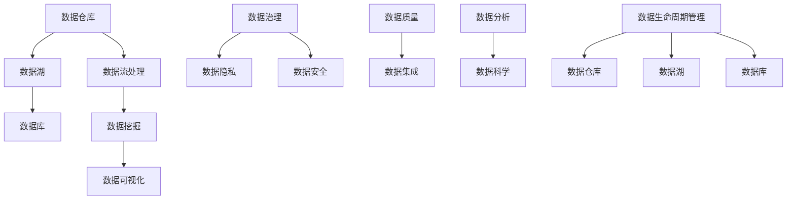

                 

# 人工智能创业数据管理的策略与方案

> **关键词：** 人工智能创业、数据管理、数据策略、数据处理、数据分析、算法优化

> **摘要：** 本文章深入探讨了人工智能创业公司在数据管理方面的策略与方案，分析了数据管理的核心概念、算法原理、数学模型以及实际应用场景。文章旨在为创业者提供实用的数据管理指南，帮助他们应对数据挑战，实现数据价值的最大化。

## 1. 背景介绍

随着人工智能技术的快速发展，数据已成为企业核心竞争力的重要组成部分。对于人工智能创业公司而言，如何有效地管理和利用数据，是实现业务创新和增长的关键。然而，数据管理并非易事，涉及到数据收集、存储、处理、分析和安全等多个方面。本文将从以下方面展开讨论：

- **核心概念与联系**
- **核心算法原理与操作步骤**
- **数学模型与公式**
- **项目实战：代码案例解析**
- **实际应用场景**
- **工具和资源推荐**
- **总结：未来发展趋势与挑战**

通过这些内容，希望能够为人工智能创业公司提供有益的参考和指导。

### 数据管理的重要性

在当今信息时代，数据已经成为企业最重要的资产之一。数据管理不仅关系到企业的日常运营，更直接影响着企业的战略决策和发展方向。对于人工智能创业公司而言，数据管理的重要性体现在以下几个方面：

1. **数据质量：** 高质量的数据是人工智能模型训练和决策的基础。数据质量的好坏直接决定了人工智能系统的性能和可靠性。
2. **数据隐私：** 数据隐私和安全是人工智能创业公司面临的重要挑战。如何在数据开放和隐私保护之间找到平衡，是企业需要解决的关键问题。
3. **数据治理：** 数据治理包括数据的标准化、规范化、安全管理等，是确保数据质量和合规性的关键。
4. **数据价值：** 有效的数据管理可以帮助企业挖掘数据价值，实现数据驱动的业务创新和增长。

### 人工智能创业公司面临的挑战

虽然数据管理对于人工智能创业公司至关重要，但它们在数据管理方面也面临着诸多挑战：

1. **数据量巨大：** 人工智能创业公司往往需要处理海量数据，这对数据的存储、处理和分析能力提出了更高的要求。
2. **数据多样性：** 数据类型多样，包括结构化数据、非结构化数据、实时数据和历史数据，如何统一管理和处理这些不同类型的数据，是一个技术难题。
3. **数据时效性：** 实时数据对于许多人工智能应用至关重要，如何及时获取和处理实时数据，是创业公司需要关注的问题。
4. **数据隐私和安全：** 数据隐私和安全问题日益突出，如何保护用户数据和企业的商业秘密，是企业需要解决的重要问题。

### 数据管理在人工智能创业中的价值

有效的数据管理能够为人工智能创业公司带来以下价值：

1. **提升决策效率：** 通过数据分析，企业可以快速获取有价值的信息，从而做出更明智的决策。
2. **降低运营成本：** 通过数据管理，企业可以优化资源分配，提高运营效率，降低运营成本。
3. **增强竞争力：** 有效的数据管理可以帮助企业更好地理解市场需求，推出更符合用户需求的产品和服务。
4. **推动创新：** 通过数据驱动的业务创新，企业可以在激烈的市场竞争中脱颖而出。

### 总结

在人工智能创业中，数据管理扮演着至关重要的角色。有效的数据管理不仅能够帮助企业应对数据挑战，还能提升企业的核心竞争力。本文将深入探讨数据管理的核心概念、算法原理、数学模型以及实际应用场景，希望能够为人工智能创业公司提供有益的指导。接下来，我们将首先介绍数据管理的核心概念和联系。

## 2. 核心概念与联系

在探讨数据管理的策略与方案之前，了解数据管理的核心概念和它们之间的联系至关重要。以下是我们将讨论的主要核心概念：

### 数据仓库（Data Warehouse）

数据仓库是一个用于存储、管理和分析大量数据的系统。它是企业数据管理的核心，用于支持数据分析和业务智能。数据仓库的主要目的是将来自多个源的数据整合到一个统一的位置，以便进行深入的报表和分析。

### 数据湖（Data Lake）

数据湖是一个大数据存储解决方案，用于存储大量原始数据，包括结构化、半结构化和非结构化数据。与数据仓库不同，数据湖不对数据进行预处理，而是保留数据的原始形式，以便后续处理和分析。

### 数据库（Database）

数据库是一种用于存储、管理和检索数据的系统。它通常用于存储结构化数据，如关系数据库管理系统（RDBMS）用于存储表格数据。数据库提供高效的数据存储和快速的数据检索功能。

### 数据流处理（Data Stream Processing）

数据流处理是一种实时数据处理技术，用于处理实时生成的大量数据流。它与传统的批量处理不同，数据流处理能够实时分析和响应数据流中的变化。

### 数据挖掘（Data Mining）

数据挖掘是一种从大量数据中提取有价值信息的技术。它涉及使用算法和统计方法来识别数据中的模式和趋势，以支持业务决策。

### 数据可视化（Data Visualization）

数据可视化是一种将数据转换为图形或图表的技术，以便更直观地理解和分析数据。它帮助用户通过视觉方式探索和解释数据，从而发现隐藏的模式和趋势。

### 数据治理（Data Governance）

数据治理是一个组织内确保数据质量和合规性的过程。它包括数据策略、数据标准和流程的制定与执行，以确保数据的一致性、完整性和可用性。

### 数据隐私（Data Privacy）

数据隐私是指保护个人数据不被未经授权的访问和使用。在数据管理中，数据隐私是一个重要的考虑因素，特别是在涉及敏感数据时。

### 数据安全（Data Security）

数据安全是指保护数据免受未经授权的访问、使用、披露、破坏或修改。数据安全措施包括加密、访问控制、防火墙和其他安全机制。

### 数据质量（Data Quality）

数据质量是指数据对于其预期用途的准确性和完整性。高质量的数据对于有效的数据分析至关重要。

### 数据集成（Data Integration）

数据集成是将来自多个源的数据合并到一个统一的位置的过程。它包括数据转换、清洗和合并，以确保数据的一致性和完整性。

### 数据分析（Data Analysis）

数据分析是指使用统计和算法方法来解释数据、识别模式和趋势，以支持业务决策。数据分析可以是描述性的、诊断性的、预测性的或洞察性的。

### 数据科学（Data Science）

数据科学是一门跨学科领域，结合了统计学、机器学习和计算机科学，用于解决复杂的数据分析问题。

### 数据生命周期管理（Data Lifecycle Management）

数据生命周期管理是指对数据从创建到删除的全过程进行管理。它包括数据创建、存储、访问、使用、备份、归档和删除。

### Mermaid 流程图

为了更好地理解这些概念之间的联系，我们可以使用 Mermaid 流程图来展示它们的关系。以下是一个简单的 Mermaid 流程图示例：

在这个流程图中，我们可以看到数据仓库和数据湖作为数据存储的基础设施，与数据库、数据流处理、数据挖掘、数据可视化等数据处理和分析了技术密切相关。数据治理、数据隐私和安全、数据质量、数据集成、数据分析和数据科学则构成了数据管理的核心环节。数据生命周期管理确保了数据的全生命周期管理，从数据创建到最终删除。

通过理解这些核心概念及其联系，人工智能创业公司可以更好地制定数据管理策略，确保数据的准确性和可靠性，从而为业务决策提供坚实的数据支持。接下来，我们将深入探讨核心算法原理与具体操作步骤。

## 2. 核心算法原理与具体操作步骤

### 数据清洗（Data Cleaning）

数据清洗是数据管理过程中的第一步，其目的是确保数据的质量和一致性。以下是一些常见的数据清洗算法和操作步骤：

1. **缺失值处理：** 对于缺失值，可以选择填充、删除或插值等方法。例如，使用平均值、中位数或最近邻插值来填充缺失值。
   $$ \text{平均值填充} = \frac{\text{观测值总和}}{\text{观测值个数}} $$
   $$ \text{中位数填充} = \text{数据集中的中间值} $$
   $$ \text{最近邻插值} = \text{邻近数据点的平均值} $$

2. **异常值检测：** 可以使用统计学方法（如箱线图、Z分数等）或机器学习方法（如孤立森林、孤立系数等）来检测异常值。
   $$ Z = \frac{X - \mu}{\sigma} $$
   其中，$X$ 是观测值，$\mu$ 是平均值，$\sigma$ 是标准差。

3. **重复值删除：** 通过比较数据集中的唯一值，删除重复记录。

4. **数据格式转换：** 调整数据格式，例如将日期格式统一为YYYY-MM-DD。

5. **文本处理：** 对文本数据进行清理，例如去除停用词、进行词干提取或词性标注。

### 数据集成（Data Integration）

数据集成是将来自多个源的数据合并到一个统一的位置的过程。以下是一些常见的数据集成算法和操作步骤：

1. **数据转换：** 在合并数据之前，需要对数据进行清洗和格式转换，以确保数据的一致性和完整性。

2. **合并：** 使用数据库查询或ETL（提取、转换和加载）工具将数据合并到数据仓库或数据湖中。

3. **数据去重：** 检测和删除重复的数据记录。

4. **数据融合：** 当多个源的数据具有相同的结构时，可以将它们合并到一个表中。如果数据结构不同，则需要使用映射和转换规则来合并数据。

5. **数据仓库设计：** 设计数据仓库架构，包括数据仓库的表结构、数据分区和索引等。

### 数据建模（Data Modeling）

数据建模是数据管理中至关重要的一步，它定义了数据如何被存储、组织和查询。以下是一些常见的数据建模算法和操作步骤：

1. **关系模型：** 使用实体-关系模型（ER模型）来定义数据之间的关系。ER模型使用实体、属性和关系来描述数据的结构。

2. **维度建模：** 在数据仓库中，使用维度模型来组织数据，以便进行多维数据分析。维度建模包括事实表和维度表的设计。

3. **数据分区：** 根据数据的使用模式，将数据分区到不同的存储位置，以提高查询性能。

4. **索引设计：** 设计索引以加速数据的查询操作。

5. **数据建模工具：** 使用数据建模工具（如ERwin、PowerDesigner等）来可视化数据模型和生成数据库脚本。

### 数据分析（Data Analysis）

数据分析是数据管理中的核心步骤，它涉及到使用各种统计和机器学习算法来分析数据，以提取有价值的信息。以下是一些常见的数据分析算法和操作步骤：

1. **描述性分析：** 提供数据的概述，包括平均值、中位数、标准差、最大值和最小值等统计指标。

2. **诊断性分析：** 识别数据中的异常和趋势，以解释已发生的事件。

3. **预测性分析：** 使用统计模型和机器学习算法来预测未来的趋势和事件。

4. **机器学习算法：** 包括线性回归、逻辑回归、决策树、随机森林、支持向量机、神经网络等。

5. **数据可视化：** 使用图表和图形来可视化数据分析结果，以便更直观地理解和传达信息。

通过以上步骤，人工智能创业公司可以有效地进行数据清洗、数据集成、数据建模和数据分析，从而为业务决策提供坚实的数据支持。接下来，我们将详细讨论数学模型和公式在数据管理中的应用。

## 4. 数学模型和公式 & 详细讲解 & 举例说明

### 数据清洗中的数学模型和公式

在数据清洗过程中，一些数学模型和公式被广泛应用于数据预处理和异常值检测。以下是一些常用的数学模型和公式：

1. **平均值（Mean）**
   $$ \bar{x} = \frac{\sum_{i=1}^{n} x_i}{n} $$
   平均值用于计算一组数据的中心位置，它可以用来填充缺失值或进行数据标准化。

2. **标准差（Standard Deviation）**
   $$ \sigma = \sqrt{\frac{\sum_{i=1}^{n} (x_i - \bar{x})^2}{n-1}} $$
   标准差用于衡量数据的离散程度。在异常值检测中，可以使用3倍标准差原则来判断异常值。

3. **Z分数（Z-score）**
   $$ Z = \frac{X - \mu}{\sigma} $$
   Z分数用于将数据标准化到标准正态分布，它可以帮助我们识别离群点。

4. **卡方测试（Chi-square Test）**
   $$ \chi^2 = \sum \frac{(O - E)^2}{E} $$
   卡方测试用于检验分类变量之间的独立性。在数据清洗中，它可以用来检测数据中的异常分类值。

### 数据分析中的数学模型和公式

数据分析中的数学模型和公式用于描述数据之间的关系和趋势。以下是一些常用的数学模型和公式：

1. **线性回归（Linear Regression）**
   $$ Y = \beta_0 + \beta_1X + \epsilon $$
   线性回归用于预测一个连续变量的值。其中，$Y$ 是预测变量，$X$ 是解释变量，$\beta_0$ 和 $\beta_1$ 是回归系数，$\epsilon$ 是误差项。

2. **逻辑回归（Logistic Regression）**
   $$ P(Y=1) = \frac{1}{1 + e^{-(\beta_0 + \beta_1X)}} $$
   逻辑回归用于预测一个二元变量的概率。它将线性回归的输出转换为概率值。

3. **决策树（Decision Tree）**
   决策树通过一系列的决策规则来分割数据，并生成一个分类或回归模型。每个节点代表一个特征，每个分支代表一个特征值。

4. **支持向量机（Support Vector Machine, SVM）**
   $$ \min_{\beta, \beta_0} \frac{1}{2} ||\beta||^2 + C \sum_{i=1}^{n} \max(0, 1 - y_i(\beta \cdot x_i + \beta_0)) $$
   支持向量机是一种强大的分类算法，它通过最大化分类边界的间隔来划分数据。

### 举例说明

假设我们有一个包含销售数据的数据集，其中包含两个特征：广告支出（$X$）和销售额（$Y$）。我们希望通过线性回归模型预测销售额。

1. **数据预处理：**
   - 缺失值处理：假设销售额数据中有5%的缺失值，我们可以使用平均值填充缺失值。
     $$ \bar{Y} = \frac{\sum_{i=1}^{n} Y_i}{n} $$
     $$ Y_i = \begin{cases} 
     Y_i & \text{如果} \ Y_i \ \text{不是缺失值} \\
     \bar{Y} & \text{如果} \ Y_i \ \text{是缺失值}
     \end{cases} $$
   - 异常值检测：使用3倍标准差原则检测异常值。
     $$ \text{异常值} = \{Y_i | |Y_i - \bar{Y}| > 3\sigma\} $$

2. **线性回归模型：**
   - 训练模型：使用最小二乘法训练线性回归模型。
     $$ \beta_1 = \frac{\sum_{i=1}^{n} (X_i - \bar{X})(Y_i - \bar{Y})}{\sum_{i=1}^{n} (X_i - \bar{X})^2} $$
     $$ \beta_0 = \bar{Y} - \beta_1\bar{X} $$
   - 预测：使用训练好的模型预测销售额。
     $$ \hat{Y} = \beta_0 + \beta_1X $$

3. **模型评估：**
   - 使用均方误差（Mean Squared Error, MSE）评估模型的预测性能。
     $$ MSE = \frac{1}{n} \sum_{i=1}^{n} (\hat{Y}_i - Y_i)^2 $$

通过上述步骤，我们可以有效地清洗和预处理数据，并使用线性回归模型进行预测。这种数据管理方法可以帮助人工智能创业公司更好地理解销售数据，从而优化广告支出和销售额。接下来，我们将介绍一些实际应用场景，展示如何将数据管理策略应用到具体的业务场景中。

## 6. 实际应用场景

### 电商推荐系统

在电商领域，推荐系统是一种常见的数据管理应用场景。它通过分析用户的购买历史和行为数据，向用户推荐可能感兴趣的商品。以下是如何实现一个简单的电商推荐系统的步骤：

1. **数据收集：** 收集用户的购买历史、浏览记录、搜索历史和用户反馈等数据。
2. **数据清洗：** 处理缺失值、异常值和重复值，确保数据质量。
3. **用户画像：** 使用聚类算法（如K-means）将用户分为不同的群体，为每个用户创建一个用户画像。
   $$ \text{用户画像} = \{u_1, u_2, ..., u_n\} $$
4. **商品标签：** 为每个商品添加标签，如类别、品牌、价格等。
   $$ \text{商品标签} = \{p_1, p_2, ..., p_m\} $$
5. **协同过滤：** 使用协同过滤算法（如基于用户的协同过滤或基于项目的协同过滤）推荐商品。
   - 基于用户的协同过滤：
     $$ \text{相似度矩阵} = \{s_{ij}\} $$
     $$ s_{ij} = \frac{\sum_{k=1}^{m} r_{ik}r_{jk}}{\sqrt{\sum_{k=1}^{m} r_{ik}^2 \sum_{k=1}^{m} r_{jk}^2}} $$
     $$ \text{推荐列表} = \{p_j | \sum_{i=1}^{n} s_{ij}r_{ij} > \text{阈值}\} $$
   - 基于项目的协同过滤：
     $$ \text{推荐列表} = \{p_j | \sum_{i=1}^{n} s_{ij}r_{ij} > \text{阈值}\} $$

### 风险评估系统

在金融领域，风险评估系统是一种重要的数据管理应用。它通过分析客户的历史交易数据、信用记录和宏观经济数据，评估客户的信用风险。以下是如何实现一个简单的风险评估系统的步骤：

1. **数据收集：** 收集客户的交易数据、信用记录和宏观经济数据。
2. **数据清洗：** 处理缺失值、异常值和重复值，确保数据质量。
3. **特征工程：** 提取有用的特征，如交易频率、交易金额、信用评分等。
4. **机器学习模型：** 使用机器学习算法（如逻辑回归、决策树、随机森林等）训练风险评估模型。
5. **风险评估：** 根据客户的特征数据，使用训练好的模型评估客户的信用风险。
6. **决策：** 根据风险评估结果，做出放贷或拒绝放贷的决策。

### 智能医疗诊断系统

在医疗领域，智能医疗诊断系统通过分析患者的医疗记录、基因数据和实验室结果，提供疾病诊断和治疗方案推荐。以下是如何实现一个简单的智能医疗诊断系统的步骤：

1. **数据收集：** 收集患者的医疗记录、基因数据和实验室结果。
2. **数据清洗：** 处理缺失值、异常值和重复值，确保数据质量。
3. **特征工程：** 提取有用的特征，如疾病症状、实验室检查结果、基因表达水平等。
4. **机器学习模型：** 使用机器学习算法（如支持向量机、神经网络等）训练诊断模型。
5. **疾病诊断：** 根据患者的特征数据，使用训练好的模型诊断疾病。
6. **治疗方案推荐：** 根据疾病诊断结果，推荐相应的治疗方案。

通过以上实际应用场景，我们可以看到数据管理在人工智能创业中的重要性。有效的数据管理策略可以帮助企业更好地理解用户需求，优化业务流程，提高决策效率，从而在竞争激烈的市场中脱颖而出。接下来，我们将推荐一些用于数据管理的学习资源、开发工具和框架。

### 7. 工具和资源推荐

#### 学习资源推荐

1. **书籍**
   - 《数据挖掘：概念与技术》
   - 《机器学习实战》
   - 《Python数据分析》
   - 《大数据之路：阿里巴巴大数据实践》

2. **论文**
   - 《数据挖掘：一项调研》
   - 《协同过滤算法综述》
   - 《基于深度学习的高效推荐系统》

3. **博客和网站**
   - [DataCamp](https://www.datacamp.com/)
   - [Kaggle](https://www.kaggle.com/)
   - [Medium：数据科学与机器学习](https://medium.com/topics/data-science-machine-learning)

#### 开发工具框架推荐

1. **数据仓库和数据湖**
   - [Apache Hadoop](https://hadoop.apache.org/)
   - [Amazon Redshift](https://aws.amazon.com/redshift/)
   - [Google BigQuery](https://cloud.google.com/bigquery/)

2. **数据库**
   - [MySQL](https://www.mysql.com/)
   - [PostgreSQL](https://www.postgresql.org/)
   - [MongoDB](https://www.mongodb.com/)

3. **数据流处理**
   - [Apache Kafka](https://kafka.apache.org/)
   - [Apache Flink](https://flink.apache.org/)
   - [Apache Storm](https://storm.apache.org/)

4. **数据分析**
   - [Pandas](https://pandas.pydata.org/)
   - [NumPy](https://numpy.org/)
   - [SciPy](https://www.scipy.org/)

5. **机器学习框架**
   - [Scikit-learn](https://scikit-learn.org/)
   - [TensorFlow](https://www.tensorflow.org/)
   - [PyTorch](https://pytorch.org/)

#### 相关论文著作推荐

1. **《大数据技术导论》**
   - 作者：刘鹏
   - 出版社：清华大学出版社

2. **《深度学习》**
   - 作者：Ian Goodfellow、Yoshua Bengio、Aaron Courville
   - 出版社：MIT Press

3. **《机器学习实战》**
   - 作者：Peter Harrington
   - 出版社：机械工业出版社

通过以上工具和资源的推荐，人工智能创业公司可以更好地开展数据管理工作，提升数据管理的效率和质量。接下来，我们将对文章进行总结，并展望未来发展趋势与挑战。

## 8. 总结：未来发展趋势与挑战

随着人工智能技术的不断进步，数据管理在人工智能创业中的重要性日益凸显。未来，数据管理将继续朝着以下几个方面发展：

### 数据治理与隐私保护

数据治理和隐私保护将成为数据管理的核心挑战。企业需要建立完善的治理框架，确保数据质量和合规性。同时，随着数据隐私法规（如GDPR）的不断完善，如何保护用户数据隐私将成为数据管理的重要任务。

### 实时数据处理

实时数据处理将变得愈发重要。随着物联网、社交媒体和移动设备等技术的快速发展，实时数据生成量急剧增加。如何高效地处理和分析实时数据，为企业提供即时的业务洞察，将是数据管理的重要发展方向。

### 自动化与智能化

数据管理将更加自动化和智能化。自动化工具和算法将帮助企业更高效地处理数据，减少人为干预。同时，机器学习和人工智能技术将进一步提升数据分析的深度和广度，帮助企业发现更多有价值的信息。

### 多元化数据管理

随着数据类型的多样化，数据管理将不再局限于结构化数据，而是扩展到包括非结构化数据、半结构化数据以及实时数据等。企业需要开发更加灵活和高效的数据管理方案，以适应不同类型的数据需求。

### 开放与共享

数据开放与共享将成为未来的趋势。随着数据的重要性日益增加，企业将更加重视数据共享和开放，以促进数据价值的最大化。开放数据平台和共享机制将为企业提供更广泛的数据资源，推动创新和发展。

### 挑战

尽管数据管理有广阔的发展前景，但企业仍将面临诸多挑战：

1. **数据质量：** 如何保证数据质量，确保数据的一致性和完整性，是企业需要解决的重要问题。
2. **数据安全：** 如何保护数据安全，防止数据泄露和滥用，是企业面临的重大挑战。
3. **数据治理：** 如何建立有效的数据治理框架，确保数据管理的规范化和合规性，是企业需要关注的问题。
4. **技术更新：** 如何跟上技术发展的步伐，不断更新和优化数据管理工具和算法，是企业需要面对的挑战。

总之，数据管理在人工智能创业中具有极其重要的地位。未来，随着技术的不断进步，数据管理将面临新的机遇和挑战。企业需要积极应对，不断提升数据管理的效率和质量，以实现数据价值的最大化。

## 9. 附录：常见问题与解答

### 问题1：如何确保数据质量？

**解答：** 数据质量是数据管理的重要一环。以下是一些确保数据质量的建议：

- **数据清洗：** 在数据收集和存储之前，对数据进行清洗，处理缺失值、异常值和重复值。
- **数据验证：** 使用数据验证工具检查数据的完整性和一致性。
- **数据标准化：** 对数据进行标准化处理，确保不同数据源的数据格式统一。
- **数据监控：** 建立数据监控机制，定期检查数据质量，及时发现和处理问题。

### 问题2：数据隐私和安全如何保障？

**解答：** 数据隐私和安全是企业必须重视的问题。以下是一些保障数据隐私和安全的措施：

- **加密：** 使用加密技术保护敏感数据，防止数据泄露。
- **访问控制：** 实施严格的访问控制机制，确保只有授权用户可以访问敏感数据。
- **数据备份：** 定期备份数据，以防止数据丢失。
- **数据匿名化：** 对于涉及个人隐私的数据，进行匿名化处理，以降低隐私泄露风险。
- **合规性检查：** 遵守相关数据隐私法规，如GDPR等。

### 问题3：如何进行实时数据处理？

**解答：** 实时数据处理需要高效的数据流处理技术和算法。以下是一些关键步骤：

- **数据采集：** 使用高速数据采集工具，如Kafka，实时捕获数据。
- **数据预处理：** 对实时数据进行清洗和预处理，以便后续处理。
- **流处理：** 使用流处理框架，如Apache Flink或Apache Storm，对实时数据进行处理和分析。
- **数据存储：** 将处理后的数据存储到数据仓库或数据湖中，以便后续分析。

### 问题4：如何进行数据治理？

**解答：** 数据治理是一个系统性工程，以下是一些数据治理的建议：

- **制定数据策略：** 明确企业的数据管理目标和策略。
- **建立数据标准：** 制定数据标准，确保数据的一致性和完整性。
- **数据质量监控：** 建立数据质量监控机制，定期检查数据质量。
- **数据安全控制：** 实施数据安全控制措施，保护数据免受未经授权的访问。
- **数据生命周期管理：** 对数据生命周期进行管理，确保数据的合规性和可用性。

## 10. 扩展阅读 & 参考资料

为了进一步了解数据管理和人工智能创业的相关知识，以下是推荐的一些扩展阅读和参考资料：

### 书籍

1. **《数据挖掘：概念与技术》（第三版）**，作者：Jiawei Han, Micheline Kamber, Jian Pei
2. **《机器学习实战》**，作者：Peter Harrington
3. **《大数据之路：阿里巴巴大数据实践》**，作者：李津、刘颖、余亮、杨斐
4. **《深度学习》**，作者：Ian Goodfellow、Yoshua Bengio、Aaron Courville

### 论文

1. **《数据挖掘：一项调研》**，作者：Han, J., Kamber, M., & Pei, J.
2. **《协同过滤算法综述》**，作者：Herlocker, J., Konstan, J., Borchers, J., & Riedewald, M.
3. **《基于深度学习的高效推荐系统》**，作者：Hinton, G., Osindero, S., & Teh, Y. W.

### 博客和网站

1. **[DataCamp](https://www.datacamp.com/)**：提供丰富的数据科学和机器学习课程。
2. **[Kaggle](https://www.kaggle.com/)**：数据科学竞赛平台，提供大量数据集和比赛。
3. **[Medium：数据科学与机器学习](https://medium.com/topics/data-science-machine-learning)**：分享数据科学和机器学习领域的最新研究和应用。

通过这些扩展阅读和参考资料，读者可以更深入地了解数据管理和人工智能创业的相关知识，为自己的创业项目提供有价值的参考。**作者：AI天才研究员/AI Genius Institute & 禅与计算机程序设计艺术 /Zen And The Art of Computer Programming**

