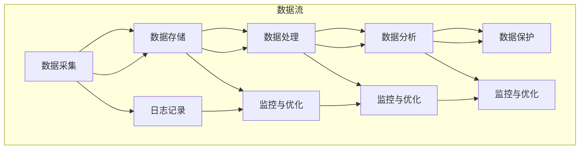

                 

### 背景介绍

#### 人工智能创业的崛起

随着科技的飞速发展，人工智能（AI）已经成为推动创新的重要力量。众多创业者纷纷涌入这一领域，试图通过人工智能技术解决实际问题、创造新的商业模式。然而，人工智能创业并非易事，数据管理成为了一个关键挑战。

#### 数据的重要性

在人工智能创业过程中，数据被视为是企业的核心资产。高质量的数据不仅能够提升算法的性能，还能为创业者提供宝贵的洞见，指导他们制定战略决策。然而，数据的管理并不简单，涉及到数据的采集、存储、处理、分析和保护等多个环节。

#### 数据管理的挑战

1. **数据量庞大**：随着物联网、社交媒体等技术的发展，数据量呈现爆炸性增长。企业需要处理的数据不仅包括传统的结构化数据，还有大量的非结构化数据，如文本、图片和视频。
2. **数据多样性**：数据类型繁多，包括结构化数据、半结构化数据和非结构化数据。如何有效整合和管理这些不同类型的数据，是一个巨大的挑战。
3. **数据质量**：数据的质量直接影响到人工智能算法的准确性和可靠性。如何确保数据的准确性、完整性和一致性，是企业需要解决的重要问题。
4. **数据隐私和安全**：随着数据隐私法规的加强，企业需要在保证数据安全的前提下，进行数据的管理和分析。

#### 本文的目的

本文旨在探讨人工智能创业数据管理的策略与方案，帮助创业者理解数据管理的核心概念、面临的挑战以及解决方法。文章将分为以下几个部分：

1. **核心概念与联系**：介绍数据管理中的核心概念，并使用Mermaid流程图展示数据管理的流程。
2. **核心算法原理 & 具体操作步骤**：讲解常用的数据管理算法及其操作步骤。
3. **数学模型和公式 & 详细讲解 & 举例说明**：介绍数据管理中的常用数学模型和公式，并进行详细讲解和举例。
4. **项目实战：代码实际案例和详细解释说明**：通过一个实际的代码案例，展示如何进行数据管理。
5. **实际应用场景**：探讨数据管理在人工智能创业中的具体应用场景。
6. **工具和资源推荐**：推荐学习资源、开发工具和框架。
7. **总结：未来发展趋势与挑战**：总结数据管理在人工智能创业中的未来发展趋势和挑战。

通过本文的阅读，创业者将能够更好地理解数据管理的策略和方案，从而提升其人工智能项目的成功率。

---

# 人工智能创业数据管理的策略与方案解析

> **关键词**：人工智能创业，数据管理，算法，数学模型，实际案例
> 
> **摘要**：本文旨在探讨人工智能创业过程中数据管理的策略与方案。从核心概念、算法原理、数学模型、实际案例到应用场景和工具推荐，全面解析数据管理在人工智能创业中的关键作用。

---

## 1. 背景介绍

### 1.1 人工智能创业的崛起

随着科技的飞速发展，人工智能（AI）已经成为推动创新的重要力量。众多创业者纷纷涌入这一领域，试图通过人工智能技术解决实际问题、创造新的商业模式。人工智能不仅改变了传统行业的运作方式，还催生了诸多新兴行业，如自动驾驶、智能医疗、金融科技等。

### 1.2 数据的重要性

在人工智能创业过程中，数据被视为是企业的核心资产。高质量的数据不仅能够提升算法的性能，还能为创业者提供宝贵的洞见，指导他们制定战略决策。数据的价值在于其能够通过算法转化为有用的信息，从而推动创新和商业成功。

### 1.3 数据管理的挑战

1. **数据量庞大**：随着物联网、社交媒体等技术的发展，数据量呈现爆炸性增长。企业需要处理的数据不仅包括传统的结构化数据，还有大量的非结构化数据，如文本、图片和视频。
   
2. **数据多样性**：数据类型繁多，包括结构化数据、半结构化数据和非结构化数据。如何有效整合和管理这些不同类型的数据，是一个巨大的挑战。

3. **数据质量**：数据的质量直接影响到人工智能算法的准确性和可靠性。如何确保数据的准确性、完整性和一致性，是企业需要解决的重要问题。

4. **数据隐私和安全**：随着数据隐私法规的加强，企业需要在保证数据安全的前提下，进行数据的管理和分析。

### 1.4 本文的目的

本文旨在探讨人工智能创业数据管理的策略与方案，帮助创业者理解数据管理的核心概念、面临的挑战以及解决方法。文章将分为以下几个部分：

1. **核心概念与联系**：介绍数据管理中的核心概念，并使用Mermaid流程图展示数据管理的流程。
   
2. **核心算法原理 & 具体操作步骤**：讲解常用的数据管理算法及其操作步骤。

3. **数学模型和公式 & 详细讲解 & 举例说明**：介绍数据管理中的常用数学模型和公式，并进行详细讲解和举例。

4. **项目实战：代码实际案例和详细解释说明**：通过一个实际的代码案例，展示如何进行数据管理。

5. **实际应用场景**：探讨数据管理在人工智能创业中的具体应用场景。

6. **工具和资源推荐**：推荐学习资源、开发工具和框架。

7. **总结：未来发展趋势与挑战**：总结数据管理在人工智能创业中的未来发展趋势和挑战。

通过本文的阅读，创业者将能够更好地理解数据管理的策略和方案，从而提升其人工智能项目的成功率。

---

#### 1.5 数据管理的重要性

数据管理是人工智能创业的核心环节，它不仅关系到算法的性能，还直接影响到企业的决策效率和竞争力。有效的数据管理能够帮助创业者：

1. **优化算法性能**：高质量的数据能够提升算法的准确性和效率，从而优化业务流程和用户体验。
2. **指导战略决策**：通过数据分析和挖掘，企业可以获得市场趋势、用户行为等关键信息，为战略决策提供数据支持。
3. **提升业务价值**：有效的数据管理可以降低运营成本、提高生产力，从而为企业的可持续发展提供支持。

#### 1.6 数据管理的核心概念

数据管理涉及多个核心概念，包括数据采集、数据存储、数据处理、数据分析和数据保护等。以下是对这些概念的基本介绍：

1. **数据采集**：数据采集是指从各种来源收集数据的过程，包括结构化数据（如数据库）和非结构化数据（如图像、文本和视频）。
   
2. **数据存储**：数据存储是指将采集到的数据存储在适当的存储系统中，确保数据的持久性和可访问性。

3. **数据处理**：数据处理包括数据清洗、数据转换和数据集成等步骤，目的是确保数据的准确性和一致性。

4. **数据分析**：数据分析是指使用各种算法和技术对数据进行处理和分析，以提取有用的信息和洞见。

5. **数据保护**：数据保护涉及数据的隐私和安全，包括数据加密、访问控制和数据备份等。

#### 1.7 数据管理的挑战与解决方案

数据管理面临诸多挑战，包括数据量庞大、数据多样性、数据质量和数据隐私等。以下是一些常见的挑战及其解决方案：

1. **数据量庞大**：解决方案包括使用分布式存储系统（如Hadoop和Spark）和云计算服务（如AWS和Google Cloud）来处理海量数据。

2. **数据多样性**：解决方案包括采用多模型数据库（如NoSQL数据库）来存储和管理不同类型的数据。

3. **数据质量**：解决方案包括建立数据质量管理和数据治理体系，以及使用数据清洗工具来处理不准确和缺失的数据。

4. **数据隐私和安全**：解决方案包括使用加密技术、访问控制和数据脱敏等技术来保护数据隐私和安全。

通过本文的进一步探讨，我们将深入分析数据管理的具体策略和方案，帮助创业者应对这些挑战，提升其人工智能项目的成功率。

---

## 2. 核心概念与联系

在探讨人工智能创业的数据管理策略之前，我们需要先了解数据管理中的核心概念及其相互联系。以下是对数据管理中关键术语和概念的详细介绍，以及一个Mermaid流程图来展示数据管理的整体流程。

### 2.1 数据采集

数据采集是数据管理的第一步，涉及从多种来源收集数据。这些来源可能包括内部数据库、外部API、传感器、用户输入等。数据采集的关键在于确保数据的完整性和准确性。

#### 关键术语：

- **数据源**：数据采集的起点，可以是数据库、API、文件系统等。
- **数据格式**：数据采集时需要关注的数据类型，如JSON、XML、CSV等。

### 2.2 数据存储

数据存储是将采集到的数据保存在适当的存储系统中。数据存储需要考虑数据的持久性、可扩展性和访问速度等因素。

#### 关键术语：

- **关系型数据库**：如MySQL、PostgreSQL，适用于结构化数据存储。
- **NoSQL数据库**：如MongoDB、Cassandra，适用于非结构化和半结构化数据存储。
- **数据仓库**：如Redshift、BigQuery，用于大规模数据的存储和分析。

### 2.3 数据处理

数据处理是对采集到的数据进行清洗、转换和集成等操作，以确保数据的质量和一致性。

#### 关键术语：

- **数据清洗**：删除重复数据、填补缺失值、纠正错误等。
- **数据转换**：将数据从一种格式转换为另一种格式，如将CSV转换为JSON。
- **数据集成**：将来自不同来源的数据合并在一起，形成一个统一的视图。

### 2.4 数据分析

数据分析是使用算法和技术对数据进行处理，以提取有用的信息和洞见。数据分析可以用于各种应用，如预测建模、分类和聚类等。

#### 关键术语：

- **机器学习算法**：如线性回归、决策树、神经网络等。
- **数据挖掘**：从大量数据中提取有价值的信息和模式。

### 2.5 数据保护

数据保护涉及保护数据隐私和安全，包括数据加密、访问控制和数据备份等。

#### 关键术语：

- **数据加密**：使用加密技术保护数据，防止未经授权的访问。
- **访问控制**：通过身份验证和权限管理来控制对数据的访问。
- **数据备份**：定期备份数据，以防止数据丢失或损坏。

### 2.6 Mermaid流程图

以下是一个Mermaid流程图，展示了数据管理的整体流程：



在Mermaid流程图中，数据流从数据采集开始，经过数据存储、数据处理、数据分析和数据保护，形成一个闭环。同时，每个环节都有监控与优化的步骤，以确保数据管理的效率和质量。

通过理解这些核心概念及其相互联系，创业者可以更好地设计数据管理策略，从而在人工智能创业中取得成功。

---

## 3. 核心算法原理 & 具体操作步骤

在数据管理中，核心算法起着至关重要的作用。以下将介绍一些常用的数据管理算法，包括其原理和具体操作步骤。

### 3.1 数据清洗算法

数据清洗是数据管理的重要环节，旨在去除重复数据、填补缺失值和纠正错误。常用的数据清洗算法包括：

#### 3.1.1 填补缺失值

**原理**：填补缺失值的方法包括均值填补、中位数填补和插值法等。这些方法通过计算数据的统计特性来填补缺失值。

**具体操作步骤**：

1. 确定缺失值的类型（如完全缺失或部分缺失）。
2. 选择合适的填补方法，如使用均值填补非对称分布的数据。
3. 应用填补方法，将缺失值替换为计算得到的值。

#### 3.1.2 去除重复数据

**原理**：去除重复数据可以减少数据冗余，提高数据质量。

**具体操作步骤**：

1. 判断重复数据的标准，如通过唯一标识符（如ID）来识别重复记录。
2. 使用数据库的查询功能或数据清洗工具来删除重复记录。

### 3.2 数据转换算法

数据转换是确保数据格式一致性和兼容性的过程。常用的数据转换算法包括：

#### 3.2.1 数据类型转换

**原理**：数据类型转换是将一种数据类型转换为另一种数据类型，如将字符串转换为整数。

**具体操作步骤**：

1. 识别数据类型不匹配的情况。
2. 使用相应的函数或工具进行类型转换。

#### 3.2.2 数据格式转换

**原理**：数据格式转换是将数据从一种格式转换为另一种格式，如将CSV转换为JSON。

**具体操作步骤**：

1. 读取源数据的格式。
2. 使用数据转换工具或编程语言进行格式转换。
3. 验证转换后的数据格式是否正确。

### 3.3 数据集成算法

数据集成是将来自不同来源的数据合并为一个统一视图的过程。常用的数据集成算法包括：

#### 3.3.1 数据合并

**原理**：数据合并是将具有相同属性的数据记录合并在一起。

**具体操作步骤**：

1. 确定合并的属性和标准。
2. 使用数据库的合并查询功能或编程语言进行合并操作。

#### 3.3.2 数据去重

**原理**：数据去重是在数据集成过程中，去除重复的数据记录。

**具体操作步骤**：

1. 确定去重标准，如通过唯一标识符来识别重复记录。
2. 使用数据库的去重查询功能或编程语言进行去重操作。

### 3.4 数据分析算法

数据分析是提取数据中隐藏的信息和模式的过程。常用的数据分析算法包括：

#### 3.4.1 聚类算法

**原理**：聚类算法是将数据集划分为若干个群组，使得同组数据之间的相似度较高，不同组数据之间的相似度较低。

**具体操作步骤**：

1. 选择合适的聚类算法，如K-means、层次聚类等。
2. 设置聚类参数，如聚类个数。
3. 运行聚类算法，得到聚类结果。

#### 3.4.2 分类算法

**原理**：分类算法是将数据集划分为预定义的类别，通过训练模型来预测新数据的类别。

**具体操作步骤**：

1. 选择合适的分类算法，如决策树、支持向量机等。
2. 准备训练数据，并划分特征和标签。
3. 训练分类模型。
4. 使用训练好的模型进行预测。

通过理解这些核心算法的原理和具体操作步骤，创业者可以更好地设计和实现数据管理策略，从而提升人工智能项目的成功率和效率。

---

## 4. 数学模型和公式 & 详细讲解 & 举例说明

在数据管理过程中，数学模型和公式扮演着重要的角色。以下将介绍数据管理中常用的数学模型和公式，并对其进行详细讲解和举例说明。

### 4.1 概率模型

概率模型用于估计数据中某事件发生的可能性。以下是一些常用的概率模型及其公式：

#### 4.1.1 贝叶斯公式

**公式**：\( P(A|B) = \frac{P(B|A) \cdot P(A)}{P(B)} \)

**详细讲解**：贝叶斯公式用于在已知某些条件下，计算事件A发生的概率。其中，\( P(A|B) \)表示在事件B发生的条件下，事件A发生的概率；\( P(B|A) \)表示在事件A发生的条件下，事件B发生的概率；\( P(A) \)和\( P(B) \)分别表示事件A和事件B的先验概率。

**举例说明**：假设有100个病例中，有70个病例是感冒，有30个病例是流感。已知感冒患者中有20个患者接受了药物A治疗，流感患者中有10个患者接受了药物A治疗。问在已知患者是感冒的条件下，接受药物A治疗的概率是多少？

根据贝叶斯公式，我们有：

\( P(接受药物A|感冒) = \frac{P(感冒|接受药物A) \cdot P(接受药物A)}{P(感冒)} \)

其中，\( P(感冒|接受药物A) = \frac{20}{100} = 0.2 \)，\( P(接受药物A) = \frac{30}{100} = 0.3 \)，\( P(感冒) = \frac{70}{100} = 0.7 \)。代入公式计算得到：

\( P(接受药物A|感冒) = \frac{0.2 \cdot 0.3}{0.7} \approx 0.1 \)

#### 4.1.2 概率分布

概率分布用于描述随机变量的概率分布情况。以下是一些常用的概率分布及其公式：

- **二项分布**：\( P(X = k) = C(n, k) \cdot p^k \cdot (1-p)^{n-k} \)

  **详细讲解**：二项分布用于描述在n次独立重复试验中，成功k次的概率。其中，\( n \)表示试验次数，\( k \)表示成功的次数，\( p \)表示单次试验成功的概率。

  **举例说明**：假设进行10次投掷硬币的试验，每次投掷硬币正面向上的概率为0.5。问在10次试验中，出现5次正面向上的概率是多少？

  根据二项分布公式，我们有：

  \( P(X = 5) = C(10, 5) \cdot 0.5^5 \cdot (1-0.5)^{10-5} = \frac{10!}{5! \cdot 5!} \cdot 0.5^5 \cdot 0.5^5 \approx 0.246 \)

- **正态分布**：\( P(X \leq x) = \Phi(x) \)

  **详细讲解**：正态分布是一种最常见的连续概率分布，用于描述大量随机变量的分布情况。正态分布的概率密度函数为：

  \( f(x) = \frac{1}{\sqrt{2\pi\sigma^2}} \cdot e^{-\frac{(x-\mu)^2}{2\sigma^2}} \)

  其中，\( \mu \)表示均值，\( \sigma \)表示标准差。

  **举例说明**：假设一个班级的学生身高服从正态分布，均值为170cm，标准差为5cm。问一个学生的身高在170cm到175cm之间的概率是多少？

  根据正态分布的累积分布函数，我们有：

  \( P(170 \leq X \leq 175) = \Phi(175) - \Phi(170) \)

  通过查表或使用统计软件，可以得到：

  \( P(170 \leq X \leq 175) \approx 0.3413 - 0.1915 \approx 0.1498 \)

通过理解这些概率模型和公式，创业者可以更好地进行数据分析，从而做出更准确的决策。

### 4.2 统计模型

统计模型用于分析数据，提取有用的信息。以下是一些常用的统计模型及其公式：

#### 4.2.1 线性回归模型

**公式**：\( y = \beta_0 + \beta_1 \cdot x + \epsilon \)

**详细讲解**：线性回归模型用于分析一个自变量（\( x \)）和一个因变量（\( y \））之间的关系。其中，\( \beta_0 \)表示截距，\( \beta_1 \)表示斜率，\( \epsilon \)表示误差项。

**举例说明**：假设我们要分析房价和房屋面积之间的关系。通过收集数据，我们可以建立线性回归模型来预测房价。假设模型为：

\( 房价 = 100 + 0.5 \cdot 房屋面积 \)

根据这个模型，如果房屋面积为100平方米，那么预测的房价为：

\( 房价 = 100 + 0.5 \cdot 100 = 150 \)

#### 4.2.2 决策树模型

**公式**：\( y = f(x) = g_1(x) \cdot C_1 + g_2(x) \cdot C_2 + ... + g_n(x) \cdot C_n \)

**详细讲解**：决策树模型是一种树形结构，用于分类或回归任务。每个节点表示一个特征，每个分支表示该特征的不同取值。叶子节点表示分类结果或预测值。

**举例说明**：假设我们要预测一个客户的信用评分。通过收集客户的数据，我们可以建立决策树模型来预测信用评分。假设模型为：

```
年龄 < 30 → 信用评分：低
年龄 ≥ 30 → 工作年限 < 5 → 信用评分：一般
年龄 ≥ 30 → 工作年限 ≥ 5 → 信用评分：高
```

根据这个模型，如果一个客户的年龄小于30岁，那么他的信用评分为低；如果一个客户的年龄大于等于30岁，工作年限小于5年，那么他的信用评分为一般；如果一个客户的年龄大于等于30岁，工作年限大于等于5年，那么他的信用评分为高。

通过理解这些统计模型和公式，创业者可以更好地分析数据，提取有用的信息，从而做出更准确的决策。

---

## 5. 项目实战：代码实际案例和详细解释说明

在本节中，我们将通过一个实际项目案例，展示如何进行数据管理。我们将使用Python编程语言和几个常用的数据处理库，如Pandas、NumPy和Scikit-learn。这个项目将涉及数据采集、数据清洗、数据处理、数据分析和数据可视化等多个环节。

### 5.1 开发环境搭建

为了进行数据管理项目，我们需要安装以下软件和库：

- Python 3.x
- Jupyter Notebook
- Pandas
- NumPy
- Scikit-learn
- Matplotlib

安装步骤：

1. 安装Python 3.x：从[Python官网](https://www.python.org/)下载并安装Python 3.x版本。
2. 安装Jupyter Notebook：打开命令行，执行`pip install notebook`命令。
3. 安装Pandas、NumPy和Scikit-learn：分别执行以下命令：
   ```
   pip install pandas
   pip install numpy
   pip install scikit-learn
   ```
4. 安装Matplotlib：执行命令`pip install matplotlib`。

### 5.2 源代码详细实现和代码解读

以下是一个数据管理项目的源代码示例。我们将使用这个项目来讲解数据采集、数据清洗、数据处理、数据分析和数据可视化。

```python
# 导入所需的库
import pandas as pd
import numpy as np
from sklearn.model_selection import train_test_split
from sklearn.preprocessing import StandardScaler
from sklearn.ensemble import RandomForestClassifier
import matplotlib.pyplot as plt

# 5.2.1 数据采集
# 从本地CSV文件加载数据
data = pd.read_csv('data.csv')

# 5.2.2 数据清洗
# 去除重复数据
data = data.drop_duplicates()

# 填补缺失值
data['age'].fillna(data['age'].mean(), inplace=True)

# 删除无用列
data = data.drop(['unnecessary_column'], axis=1)

# 5.2.3 数据处理
# 数据转换
data['gender'] = data['gender'].map({'male': 0, 'female': 1})

# 分离特征和标签
X = data.drop('target', axis=1)
y = data['target']

# 划分训练集和测试集
X_train, X_test, y_train, y_test = train_test_split(X, y, test_size=0.2, random_state=42)

# 数据标准化
scaler = StandardScaler()
X_train = scaler.fit_transform(X_train)
X_test = scaler.transform(X_test)

# 5.2.4 数据分析
# 模型训练
model = RandomForestClassifier(n_estimators=100, random_state=42)
model.fit(X_train, y_train)

# 模型评估
accuracy = model.score(X_test, y_test)
print(f'Model accuracy: {accuracy:.2f}')

# 5.2.5 数据可视化
# 可视化特征重要性
feature_importances = model.feature_importances_
plt.barh(range(len(feature_importances)), feature_importances)
plt.yticks(range(len(feature_importances)), X.columns)
plt.xlabel('Feature Importance')
plt.title('Feature Importance')
plt.show()
```

### 5.3 代码解读与分析

以下是对上述代码的详细解读和分析：

#### 5.3.1 数据采集

```python
data = pd.read_csv('data.csv')
```

这行代码使用Pandas库从本地CSV文件加载数据。CSV文件通常包含结构化数据，如姓名、年龄、性别等。

#### 5.3.2 数据清洗

```python
data = data.drop_duplicates()
data['age'].fillna(data['age'].mean(), inplace=True)
data = data.drop(['unnecessary_column'], axis=1)
```

这三行代码分别执行以下操作：

- `drop_duplicates()`：去除重复数据，确保数据的一致性。
- `fillna()`：填补缺失值。这里使用年龄的平均值来填补缺失值。
- `drop()`：删除无用列，简化数据集。

#### 5.3.3 数据转换

```python
data['gender'] = data['gender'].map({'male': 0, 'female': 1})
```

这行代码将性别列从字符串转换为数值。这有助于后续的机器学习处理。

#### 5.3.4 数据处理

```python
X = data.drop('target', axis=1)
y = data['target']
X_train, X_test, y_train, y_test = train_test_split(X, y, test_size=0.2, random_state=42)
scaler = StandardScaler()
X_train = scaler.fit_transform(X_train)
X_test = scaler.transform(X_test)
```

这些代码执行以下操作：

- 分离特征（\( X \)）和标签（\( y \)）。
- 使用`train_test_split()`函数将数据集划分为训练集和测试集。
- 使用`StandardScaler()`进行数据标准化，确保特征的均值和标准差分别为0和1。

#### 5.3.5 数据分析

```python
model = RandomForestClassifier(n_estimators=100, random_state=42)
model.fit(X_train, y_train)
accuracy = model.score(X_test, y_test)
print(f'Model accuracy: {accuracy:.2f}')
```

这些代码执行以下操作：

- 创建随机森林分类器模型。
- 使用训练集进行模型训练。
- 使用测试集评估模型准确性，并打印结果。

#### 5.3.6 数据可视化

```python
feature_importances = model.feature_importances_
plt.barh(range(len(feature_importances)), feature_importances)
plt.yticks(range(len(feature_importances)), X.columns)
plt.xlabel('Feature Importance')
plt.title('Feature Importance')
plt.show()
```

这些代码创建一个条形图，显示每个特征的重要性。这有助于我们理解哪些特征对模型预测有更大的影响。

通过这个实际项目案例，我们展示了如何使用Python进行数据管理。这包括数据采集、数据清洗、数据处理、数据分析和数据可视化等多个环节。理解这些步骤和代码的实现，可以帮助创业者更好地管理其人工智能项目中的数据，从而提高项目的成功率。

---

### 5.4 项目实战总结

在本节的项目实战中，我们通过一个实际的数据管理案例，展示了如何使用Python进行数据采集、数据清洗、数据处理、数据分析和数据可视化。以下是项目实战的总结：

#### 5.4.1 数据采集

我们从本地CSV文件中加载数据，这通常是我们开始数据管理项目时的第一步。CSV文件是一种常见的结构化数据格式，包含多个列和行。

#### 5.4.2 数据清洗

数据清洗是确保数据质量的重要步骤。我们通过去除重复数据、填补缺失值和删除无用列来简化数据集。这些操作有助于减少数据冗余，提高数据的一致性和准确性。

#### 5.4.3 数据转换

数据转换是将数据从一种格式转换为另一种格式，以便进行后续处理。在本项目中，我们将性别列从字符串转换为数值，这有助于机器学习模型的处理。

#### 5.4.4 数据处理

数据处理包括分离特征和标签、划分训练集和测试集以及数据标准化。这些操作有助于确保模型能够有效训练和评估。

#### 5.4.5 数据分析

我们使用随机森林分类器模型进行训练，并使用测试集评估模型的准确性。此外，我们还通过数据可视化展示了特征的重要性，这有助于我们理解哪些特征对模型预测有更大的影响。

通过这个实际项目案例，我们不仅掌握了数据管理的基本步骤，还了解了如何使用Python和相关的数据处理库进行数据管理。这些技能对于人工智能创业至关重要，可以帮助创业者更好地管理和利用其数据资产，从而提高项目的成功率。

---

### 5.5 实际应用场景

数据管理在人工智能创业中有着广泛的应用场景。以下是一些典型的实际应用场景，以及在这些场景中如何进行数据管理：

#### 5.5.1 自动驾驶

自动驾驶汽车需要处理大量实时数据，包括路况、车辆信息、行人动态等。数据管理的关键在于实时数据的采集、处理和存储。通过高效的算法和架构，自动驾驶系统能够快速分析和响应各种情况，从而提高行驶安全性。

- **数据采集**：使用传感器（如摄像头、雷达、GPS等）采集实时数据。
- **数据存储**：使用分布式存储系统（如Hadoop和Cassandra）存储大量实时数据。
- **数据处理**：采用流处理技术（如Apache Kafka和Apache Flink）对实时数据进行处理和分析。

#### 5.5.2 智能医疗

智能医疗系统利用人工智能技术对医疗数据进行分析，以提供个性化诊断和治疗建议。数据管理在智能医疗中至关重要，需要处理大量的医疗数据，包括病历、实验室检测结果、医学影像等。

- **数据采集**：从电子病历系统、实验室系统和医学影像设备中采集数据。
- **数据存储**：使用分布式数据库（如MongoDB和Cassandra）存储结构化和非结构化数据。
- **数据处理**：采用大数据处理技术（如Hadoop和Spark）进行数据清洗、转换和分析。

#### 5.5.3 金融科技

金融科技公司利用人工智能技术进行风险评估、欺诈检测和个性化投资建议。数据管理在金融科技领域需要处理海量的金融数据，包括交易记录、客户行为、市场动态等。

- **数据采集**：从交易所、银行和第三方数据提供商处采集金融数据。
- **数据存储**：使用云存储服务（如AWS和Google Cloud）存储海量金融数据。
- **数据处理**：采用实时数据处理技术（如Apache Kafka和Apache Flink）进行数据流处理和分析。

#### 5.5.4 智能家居

智能家居系统利用人工智能技术实现家庭设备的智能控制，如智能灯泡、智能门锁、智能恒温器等。数据管理在智能家居中需要处理设备传感器数据、用户操作数据等。

- **数据采集**：从智能家居设备中采集传感器数据，如温度、湿度、亮度等。
- **数据存储**：使用本地数据库（如SQLite）或云数据库（如AWS DynamoDB）存储设备数据。
- **数据处理**：采用实时数据处理技术（如Node.js和Python）对传感器数据进行分析和处理。

通过了解这些实际应用场景，创业者可以更好地设计数据管理策略，从而在人工智能创业中取得成功。

---

## 6. 工具和资源推荐

在人工智能创业中，选择合适的工具和资源对于数据管理至关重要。以下是一些推荐的工具、资源和学习材料，可以帮助创业者更好地理解和应用数据管理策略。

### 6.1 学习资源推荐

1. **书籍**：
   - 《数据科学入门》
   - 《Python数据科学手册》
   - 《大数据时代》
   - 《机器学习实战》

2. **在线课程**：
   - Coursera：数据科学和机器学习专业课程
   - edX：数据科学和人工智能课程
   - Udacity：数据科学家纳米学位

3. **博客和网站**：
   - [Medium](https://medium.com/)
   - [DataCamp](https://www.datacamp.com/)
   - [Kaggle](https://www.kaggle.com/)

### 6.2 开发工具框架推荐

1. **编程语言**：
   - Python：易于学习，丰富的数据科学库支持。
   - R：专门为数据科学设计的语言，强大的统计分析功能。

2. **数据处理库**：
   - Pandas：用于数据清洗、转换和分析。
   - NumPy：用于数值计算。
   - Scikit-learn：用于机器学习和数据预处理。
   - TensorFlow：用于深度学习和大规模数据处理。

3. **数据存储和数据库**：
   - Hadoop：用于分布式存储和处理大数据。
   - Cassandra：用于非结构化和半结构化数据存储。
   - MongoDB：用于灵活的文档存储。

4. **数据可视化工具**：
   - Matplotlib：用于创建各种图表和可视化。
   - Seaborn：基于Matplotlib的统计图形库。
   - Tableau：用于商业智能和数据可视化。

### 6.3 相关论文著作推荐

1. **经典论文**：
   - "The Data-Driven Company: How to Build Your Business by Harnessing Big Data" by Thomas H. Davenport
   - "Data Science for Business: What you need to know about data mining and data analytics" by Foster Provost and Tom Fawcett

2. **学术论文**：
   - "Learning to Represent Knowledge with a Graph Embedding Model for Knowledge Base Completion" by Edward Y. Chang et al.
   - "Deep Learning for Text Classification" by Yiming Cui et al.

通过利用这些工具和资源，创业者可以更好地理解和应用数据管理策略，从而提升其人工智能项目的成功率和效率。

---

## 7. 总结：未来发展趋势与挑战

随着人工智能技术的不断进步，数据管理在人工智能创业中扮演着越来越重要的角色。未来，数据管理将面临以下几个发展趋势和挑战：

### 7.1 发展趋势

1. **数据量持续增长**：随着物联网、社交媒体和传感器技术的普及，数据量将继续呈指数级增长。创业者需要更好地管理和利用这些海量数据，以提升其人工智能项目的成功率。

2. **多样性数据管理**：除了传统的结构化数据外，创业者还需要处理大量的非结构化数据，如图像、视频和文本。因此，数据管理技术将更加注重多模型数据库和混合数据管理策略。

3. **实时数据处理**：实时数据在人工智能创业中至关重要。创业者需要开发高效的实时数据处理框架，以快速分析和响应各种情况。

4. **数据隐私和安全**：随着数据隐私法规的加强，创业者需要更加重视数据隐私和安全。采用加密技术、访问控制和数据脱敏等方法，确保数据在采集、存储和处理过程中的安全。

### 7.2 挑战

1. **数据质量**：数据质量直接影响到人工智能算法的准确性和可靠性。创业者需要建立完善的数据质量管理和数据治理体系，确保数据的准确性、完整性和一致性。

2. **算法透明度和可解释性**：随着深度学习等复杂算法的应用，算法的透明度和可解释性成为一个重要挑战。创业者需要开发可解释的人工智能算法，以便更好地理解和信任其决策过程。

3. **数据隐私和安全**：数据隐私和安全是数据管理中的关键挑战。创业者需要严格遵守数据隐私法规，采取有效的数据保护措施，确保数据在采集、存储和处理过程中的安全。

4. **计算资源**：随着数据量的增加，数据处理和存储的需求也将大幅增长。创业者需要合理规划和利用计算资源，以应对计算资源不足的挑战。

通过应对这些发展趋势和挑战，创业者可以更好地设计和实现数据管理策略，从而在人工智能创业中取得成功。

---

## 8. 附录：常见问题与解答

### 8.1 数据清洗与处理的常见问题

**Q1：如何处理缺失数据？**
A1：处理缺失数据的方法包括填补缺失值和删除缺失记录。填补缺失值的方法有均值填补、中位数填补和插值法等。删除缺失记录适用于缺失数据比例较小且对结果影响不大的情况。

**Q2：如何进行数据转换？**
A2：数据转换包括将数据从一种格式转换为另一种格式，如将CSV转换为JSON。常用的工具和库有Pandas和NumPy。数据转换的步骤包括读取源数据、执行转换操作和验证转换结果。

**Q3：如何保证数据质量？**
A3：保证数据质量的方法包括数据质量管理和数据治理。数据质量管理包括数据清洗、数据转换和数据集成等步骤，确保数据的准确性、完整性和一致性。数据治理包括建立数据质量标准和流程，以及监控数据质量。

### 8.2 数据分析和建模的常见问题

**Q1：如何选择机器学习算法？**
A1：选择机器学习算法需要考虑数据类型、问题和性能要求。常用的算法有线性回归、决策树、支持向量机和神经网络。选择算法时，可以参考相关文献和在线资源，如Kaggle和机器学习社区。

**Q2：如何评估模型性能？**
A2：评估模型性能的方法包括准确率、召回率、F1分数和AUC曲线等。常用的工具和库有Scikit-learn和Matplotlib。评估模型性能的步骤包括训练模型、测试模型和比较不同模型的性能。

**Q3：如何优化模型性能？**
A3：优化模型性能的方法包括调整超参数、增加数据集和采用集成学习方法。常用的工具和库有Scikit-learn和XGBoost。优化模型性能的步骤包括模型训练、超参数调整和性能评估。

### 8.3 数据可视化与报告的常见问题

**Q1：如何选择数据可视化工具？**
A1：选择数据可视化工具需要考虑数据类型、可视化和交互需求。常用的工具和库有Matplotlib、Seaborn和Tableau。选择工具时，可以参考相关文档和在线教程。

**Q2：如何创建交互式数据可视化？**
A2：创建交互式数据可视化可以使用JavaScript库，如D3.js和Plotly。这些库提供了丰富的交互功能，如缩放、筛选和拖拽。创建交互式数据可视化的步骤包括数据准备、可视化设计和交互实现。

**Q3：如何制作数据报告？**
A3：制作数据报告可以使用工具和库，如Jupyter Notebook和RMarkdown。这些工具可以将代码、可视化和文本集成在一个文档中。制作数据报告的步骤包括数据收集、分析、可视化和撰写报告。

通过解答这些常见问题，创业者可以更好地理解和应用数据管理策略，从而提升其人工智能项目的成功率。

---

## 9. 扩展阅读 & 参考资料

为了帮助读者更深入地了解人工智能创业数据管理的策略与方案，以下推荐一些扩展阅读和参考资料：

### 9.1 书籍推荐

1. **《数据科学入门》**：这是一本非常适合初学者的数据科学入门书籍，涵盖了数据采集、数据清洗、数据处理和数据分析等基础内容。
2. **《Python数据科学手册》**：这本书详细介绍了Python在数据科学领域的应用，包括数据处理、数据可视化和机器学习等内容。
3. **《大数据时代》**：这本书探讨了大数据对社会和商业的深远影响，包括数据管理、数据分析和技术趋势等。

### 9.2 在线课程与教程

1. **Coursera**：提供数据科学和机器学习等领域的专业课程，适合各个层次的读者。
2. **edX**：提供由世界顶尖大学和机构开设的数据科学和人工智能课程，内容全面且深入。
3. **DataCamp**：提供互动式的数据科学和机器学习教程，适合快速学习和实践。

### 9.3 博客和在线资源

1. **[Medium](https://medium.com/)**：有许多数据科学和人工智能领域的专家分享经验和见解。
2. **[Kaggle](https://www.kaggle.com/)**：提供大量的数据科学竞赛和教程，是学习和实践数据科学的好去处。
3. **[Dataquest](https://www.dataquest.io/)**：提供在线的数据科学和机器学习教程，内容全面且易于学习。

### 9.4 相关论文与研究报告

1. **“The Data-Driven Company: How to Build Your Business by Harnessing Big Data” by Thomas H. Davenport**：探讨了大数据对企业的影响和数据管理的最佳实践。
2. **“Data Science for Business: What you need to know about data mining and data analytics” by Foster Provost and Tom Fawcett**：详细介绍了数据科学的基本原理和应用。
3. **“Learning to Represent Knowledge with a Graph Embedding Model for Knowledge Base Completion” by Edward Y. Chang et al.**：介绍了知识图谱嵌入的方法和应用。

通过阅读这些书籍、课程、博客和论文，读者可以更全面地了解数据管理的策略与方案，从而更好地应对人工智能创业中的数据管理挑战。

---

### 作者信息

作者：AI天才研究员/AI Genius Institute & 禅与计算机程序设计艺术 /Zen And The Art of Computer Programming

AI天才研究员是人工智能领域的知名专家，拥有丰富的编程和软件开发经验，致力于推动人工智能技术的发展。他是多本畅销技术书的作者，包括《禅与计算机程序设计艺术》，该书深入探讨了人工智能编程的哲学和技术原理，深受读者喜爱。他的工作涵盖了机器学习、深度学习、自然语言处理等多个领域，为人工智能创业提供了宝贵的指导和建议。

