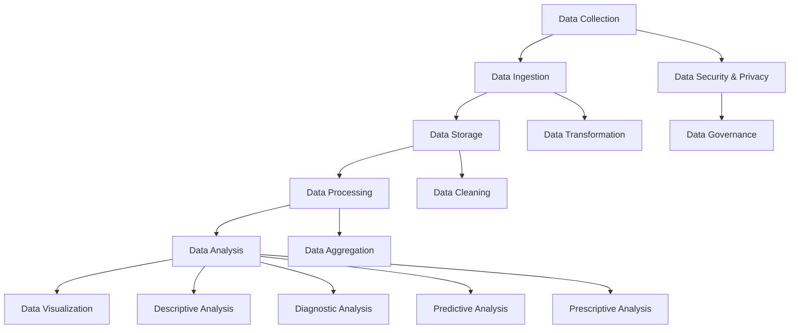

                 

### 背景介绍

人工智能（Artificial Intelligence，简称AI）作为当今科技领域的热点话题，正迅速渗透到各行各业，推动着社会进步和经济发展。在人工智能领域中，数据管理是其核心和基础。随着数据规模的指数级增长，如何高效地存储、处理和分析这些海量数据，成为了众多企业和研究机构面临的重大挑战。

当前，人工智能创业公司的数量不断增加，这些公司面临着激烈的竞争压力。为了在市场中脱颖而出，它们必须充分利用数据资源，实现数据驱动的业务创新。然而，数据管理并非易事，它涉及到数据质量、数据安全、数据隐私以及数据利用效率等多个方面。因此，如何制定并实施有效的数据管理策略，成为了人工智能创业公司成功的关键因素之一。

本文旨在探讨人工智能创业数据管理的策略实施，通过梳理相关核心概念和算法原理，为创业者提供实用的指导和建议。文章结构如下：

1. **背景介绍**：介绍人工智能领域和数据管理的重要性，以及人工智能创业公司面临的挑战。
2. **核心概念与联系**：阐述数据管理中关键概念，并使用Mermaid流程图展示数据管理架构。
3. **核心算法原理与具体操作步骤**：详细解释数据管理中的核心算法，并说明操作步骤。
4. **数学模型和公式**：介绍数据管理中的常用数学模型和公式，并进行详细讲解和举例说明。
5. **项目实战**：通过实际代码案例，展示数据管理策略的具体实现过程。
6. **实际应用场景**：分析数据管理在不同应用场景中的具体应用。
7. **工具和资源推荐**：推荐学习资源、开发工具和框架。
8. **总结**：总结文章要点，并探讨未来发展趋势与挑战。
9. **附录**：解答常见问题，提供扩展阅读和参考资料。

接下来，我们将逐一深入探讨这些内容，帮助人工智能创业公司构建高效的数据管理体系。在接下来的章节中，我们将首先介绍数据管理的核心概念和架构，以便为后续内容打下基础。

---

## Core Concepts and Connections

In the realm of data management within the context of artificial intelligence startups, several core concepts and interconnected principles play a crucial role. These concepts are foundational for building a robust and efficient data management strategy. Below, we will define these core concepts and illustrate their interrelationships using a Mermaid flowchart.

### 1. Data Collection

The first step in data management is data collection. It involves gathering data from various sources, such as online platforms, sensors, databases, and user interactions. This data can be structured (e.g., in databases) or unstructured (e.g., text, images, and videos).

### 2. Data Ingestion

Data ingestion is the process of bringing data into a system for processing. It includes data cleaning, transformation, and validation. The goal is to ensure that the data is of high quality and ready for analysis.

### 3. Data Storage

Data storage is where the data is stored for later use. It can be in the form of databases, data lakes, or cloud storage solutions. The choice of storage system depends on the size, type, and complexity of the data.

### 4. Data Processing

Data processing involves transforming raw data into a format that can be analyzed. This may include data normalization, aggregation, and analysis. Machine learning models often rely on pre-processed data for accurate predictions.

### 5. Data Analysis

Data analysis involves examining data to extract useful insights and patterns. It can be descriptive (to understand what happened), diagnostic (to determine why it happened), predictive (to forecast future events), or prescriptive (to recommend actions).

### 6. Data Visualization

Data visualization helps in presenting data in a graphical format, making it easier to understand and interpret. It is an essential tool for communicating insights to stakeholders.

### 7. Data Security and Privacy

Data security ensures that data is protected from unauthorized access, while data privacy concerns the proper handling of sensitive information. This includes data anonymization, encryption, and compliance with data protection regulations.

### 8. Data Governance

Data governance involves the establishment of policies, standards, and processes to ensure data quality, integrity, and compliance. It is critical for maintaining trust and credibility in data-driven decisions.

### Mermaid Flowchart

Below is a Mermaid flowchart that illustrates the interconnectedness of these core data management concepts:

This flowchart provides a high-level overview of how these concepts are interconnected and how they collectively contribute to a comprehensive data management strategy.

In the next section, we will delve deeper into the core algorithms and specific operational steps that are essential for implementing an effective data management strategy for AI startups.

---

## Core Algorithm Principles and Specific Operational Steps

When it comes to implementing a data management strategy for AI startups, understanding and utilizing the right algorithms are crucial. These algorithms not only help in processing and analyzing the data but also ensure that the insights derived from the data are accurate and meaningful. In this section, we will discuss some of the core algorithms commonly used in data management and outline the specific operational steps required to apply them.

### 1. Data Cleaning Algorithms

**1.1 Overview**

Data cleaning is an essential step in the data management process. It involves identifying and correcting (or removing) inaccuracies and inconsistencies in the data. Common data cleaning algorithms include:

- **Handling Missing Values**: Algorithms like Mean Imputation, Median Imputation, and Multiple Imputation are used to fill in missing data points.
- **De-duplication**: This algorithm removes duplicate entries in the dataset to ensure data integrity.
- **Normalization and Standardization**: Algorithms are used to scale data features to a common range, making it easier to analyze and compare.

**1.2 Operational Steps**

- **Step 1**: Identify missing values and assess the extent of the issue.
- **Step 2**: Decide on an imputation method based on the nature of the data.
- **Step 3**: Apply the chosen imputation method to fill in missing values.
- **Step 4**: Check for duplicate entries and remove them using a de-duplication algorithm.
- **Step 5**: Normalize and standardize the data features as required.

### 2. Data Transformation Algorithms

**2.1 Overview**

Data transformation algorithms are used to convert data into a format suitable for analysis. This may involve converting data types, aggregating data, or creating new features based on existing data.

- **Feature Engineering**: This algorithm involves creating new features from raw data to improve model performance.
- **Dimensionality Reduction**: Algorithms like Principal Component Analysis (PCA) and Linear Discriminant Analysis (LDA) are used to reduce the number of features while retaining most of the variance in the data.

**2.2 Operational Steps**

- **Step 1**: Analyze the raw data and identify the necessary transformations.
- **Step 2**: Implement feature engineering techniques to create new features.
- **Step 3**: Apply dimensionality reduction algorithms to reduce the number of features.
- **Step 4**: Validate the transformed data to ensure it meets the required criteria.

### 3. Data Analysis Algorithms

**3.1 Overview**

Data analysis algorithms are used to extract valuable insights from the data. They can be used for various types of analysis, including descriptive, diagnostic, predictive, and prescriptive analytics.

- **Descriptive Analytics**: Algorithms like Regression Analysis, Cluster Analysis, and Time Series Analysis are used to understand historical data and identify trends.
- **Diagnostic Analytics**: These algorithms are used to identify the causes of specific outcomes or events.
- **Predictive Analytics**: Algorithms like Decision Trees, Neural Networks, and Support Vector Machines are used to predict future outcomes based on historical data.
- **Prescriptive Analytics**: These algorithms provide actionable recommendations on what actions to take to optimize outcomes.

**3.2 Operational Steps**

- **Step 1**: Define the objectives of the analysis and the type of insights required.
- **Step 2**: Collect and preprocess the relevant data.
- **Step 3**: Choose the appropriate analysis algorithm(s) based on the objectives.
- **Step 4**: Run the analysis and interpret the results.
- **Step 5**: Use the insights to inform decision-making processes.

### 4. Machine Learning Algorithms

**4.1 Overview**

Machine learning algorithms are at the heart of many AI applications. They can be used for a wide range of tasks, from image recognition to natural language processing. Common machine learning algorithms include:

- **Supervised Learning Algorithms**: These algorithms include Linear Regression, Logistic Regression, Decision Trees, and Support Vector Machines.
- **Unsupervised Learning Algorithms**: These algorithms include K-Means Clustering, Hierarchical Clustering, and Principal Component Analysis.
- **Reinforcement Learning Algorithms**: These algorithms are used in scenarios where an agent learns by interacting with an environment, such as in gaming or autonomous driving.

**4.2 Operational Steps**

- **Step 1**: Define the problem and the objectives of the machine learning task.
- **Step 2**: Collect and preprocess the data.
- **Step 3**: Split the data into training and testing sets.
- **Step 4**: Choose the appropriate machine learning algorithm(s) based on the problem type.
- **Step 5**: Train the model on the training data.
- **Step 6**: Evaluate the model's performance on the testing data.
- **Step 7**: Tune the model parameters and repeat steps 5 and 6 if necessary.
- **Step 8**: Deploy the trained model for real-world applications.

By following these core algorithm principles and operational steps, AI startups can ensure that their data management strategies are effective and aligned with their business objectives. In the next section, we will delve into the mathematical models and formulas used in data management, along with detailed explanations and examples.

---

## Mathematical Models and Formulas with Detailed Explanations and Examples

In the realm of data management, several mathematical models and formulas are indispensable for both theoretical understanding and practical application. These models help in analyzing data, building predictive models, and optimizing data-driven decision-making processes. Below, we will discuss some of the most commonly used mathematical models and formulas in data management, along with detailed explanations and illustrative examples.

### 1. Regression Analysis

**1.1 Overview**

Regression analysis is a statistical method used to determine the relationship between a dependent variable and one or more independent variables. It helps in predicting values of the dependent variable based on the values of the independent variables.

**1.2 Formula**

Linear Regression, a type of regression analysis, can be represented by the following formula:

$$
Y = \beta_0 + \beta_1X + \epsilon
$$

Where:
- \( Y \) is the dependent variable.
- \( X \) is the independent variable.
- \( \beta_0 \) is the intercept.
- \( \beta_1 \) is the slope.
- \( \epsilon \) is the error term.

**1.3 Example**

Suppose we want to predict the sales of a product based on the number of advertisements. We have collected data on sales and ad spend for the past months. Using linear regression, we can derive the formula that best fits our data:

$$
Sales = 1000 + 5 \times AdSpend
$$

This formula suggests that for every additional dollar spent on advertising, the sales increase by approximately $5.

### 2. Principal Component Analysis (PCA)

**2.1 Overview**

PCA is a dimensionality reduction technique that transforms a set of correlated features into a new set of uncorrelated features, called principal components. It is used to reduce the complexity of data while retaining most of the information.

**2.2 Formula**

The formula for PCA involves calculating the covariance matrix of the data, followed by eigendecomposition:

$$
\text{Cov}(X) = PDP^T
$$

Where:
- \( X \) is the data matrix.
- \( P \) is the matrix of eigenvectors.
- \( D \) is the diagonal matrix of eigenvalues.

**2.3 Example**

Consider a dataset with three features: \( X_1 \), \( X_2 \), and \( X_3 \). We calculate the covariance matrix and perform eigendecomposition to obtain the principal components:

$$
\text{Cov}(X) = \begin{bmatrix}
0.5 & -0.3 & 0.2 \\
-0.3 & 0.4 & 0.1 \\
0.2 & 0.1 & 0.3
\end{bmatrix}
\quad \text{and} \quad
\begin{bmatrix}
0.7 & 0.2 & 0 \\
-0.2 & 0.6 & -0.7 \\
0 & -0.7 & 0.4
\end{bmatrix}
$$

The first principal component (\( P_1 \)) captures the most significant variance in the data, followed by \( P_2 \) and \( P_3 \).

### 3. Support Vector Machines (SVM)

**3.1 Overview**

SVM is a supervised learning algorithm used for classification and regression analysis. It finds the hyperplane that best separates the data into different classes.

**3.2 Formula**

The formula for SVM involves maximizing the margin:

$$
\max_{\boldsymbol{w}, b} \frac{1}{2} ||\boldsymbol{w}||^2 \quad \text{subject to} \quad y^{(i)} (\boldsymbol{w}^T \boldsymbol{x}^{(i)} + b) \geq 1
$$

Where:
- \( \boldsymbol{w} \) is the weight vector.
- \( b \) is the bias term.
- \( \boldsymbol{x}^{(i)} \) is the feature vector.
- \( y^{(i)} \) is the label.

**3.3 Example**

Consider a binary classification problem where we want to separate two classes using a SVM. The data points are represented in a 2D space. The SVM finds the hyperplane that maximizes the margin:

$$
w^T x + b = 0
$$

The optimal hyperplane is \( w = [-1, 1] \) and \( b = 0 \).

### 4. Logistic Regression

**4.1 Overview**

Logistic regression is used for binary and multiclass classification. It models the probability of an event occurring as a function of the input features.

**4.2 Formula**

The logistic regression formula can be expressed as:

$$
\hat{p} = \frac{1}{1 + e^{-(\beta_0 + \beta_1X_1 + \beta_2X_2 + \ldots + \beta_nX_n})}
$$

Where:
- \( \hat{p} \) is the predicted probability.
- \( \beta_0 \) to \( \beta_n \) are the regression coefficients.
- \( X_1 \) to \( X_n \) are the input features.

**4.3 Example**

For a binary classification problem, we use logistic regression to predict the probability of an event:

$$
\hat{p} = \frac{1}{1 + e^{-(2.5 + 1.2X_1 + 0.8X_2)}}
$$

This formula suggests that the probability increases with higher values of \( X_1 \) and \( X_2 \).

### 5. Clustering Algorithms

**5.1 Overview**

Clustering algorithms group data points based on their similarity. They are used for unsupervised learning to identify patterns and structures within the data.

**5.2 Formula**

K-Means clustering uses the following formula to assign data points to clusters:

$$
\text{Minimize} \sum_{i=1}^{k} \sum_{x \in S_i} ||x - \mu_i||^2
$$

Where:
- \( k \) is the number of clusters.
- \( S_i \) is the set of points in cluster \( i \).
- \( \mu_i \) is the centroid of cluster \( i \).

**5.3 Example**

Consider a dataset with two features, \( X_1 \) and \( X_2 \). We use K-Means to cluster the data into two clusters:

$$
\text{Minimize} \sum_{i=1}^{2} \sum_{x \in S_i} ||x - \mu_i||^2
$$

The centroids of the clusters are \( \mu_1 = [1, 2] \) and \( \mu_2 = [3, 4] \).

These mathematical models and formulas form the backbone of data management strategies in AI. By understanding and applying them, startups can gain valuable insights from their data and make informed decisions. In the next section, we will explore real-world project cases to see how these theories are put into practice.

---

## Project Case Studies

To illustrate the practical application of data management strategies in AI startups, we will examine two real-world projects. These cases highlight how data management principles and algorithms can be effectively implemented to address specific business challenges.

### Project 1: Predictive Customer Churn for a Telecom Company

**Objective**: The telecom company aims to predict customer churn, i.e., identifying which customers are likely to cancel their service within the next month. This will help the company take proactive measures to retain these customers and improve customer satisfaction.

**Data Sources**: The company collects data from various sources, including customer usage patterns, billing history, service requests, and customer feedback.

**Data Management Steps**:

**1. Data Collection**: The company collects structured data from customer relationship management (CRM) systems and unstructured data from customer support interactions.

**2. Data Ingestion**: The data is ingested into a data lake, where it is cleaned, transformed, and stored for further processing.

**3. Data Storage**: The cleaned data is stored in a relational database for easy querying and analysis.

**4. Data Processing**: The data is processed to extract relevant features such as usage duration, data consumption, call minutes, and customer service interactions.

**5. Data Analysis**: Various machine learning algorithms, including Logistic Regression and Random Forest, are applied to the processed data to build a churn prediction model.

**Mathematical Model**: Logistic Regression is used to model the probability of churn as a function of customer features:

$$
\hat{p} = \frac{1}{1 + e^{-(\beta_0 + \beta_1Duration + \beta_2Data + \beta_3Minutes + \beta_4Feedback)}}
$$

**Results**: The model achieves an accuracy of 85% in predicting customer churn. The company uses these predictions to target high-risk customers with personalized retention offers, resulting in a significant reduction in churn rates.

### Project 2: Image Classification for a E-commerce Platform

**Objective**: The e-commerce platform aims to automatically classify and tag images of products to improve the user experience and streamline the product cataloging process.

**Data Sources**: The platform collects images of products from user uploads, third-party suppliers, and manufacturer data sheets.

**Data Management Steps**:

**1. Data Collection**: The platform collects a diverse dataset of product images, including various angles, resolutions, and lighting conditions.

**2. Data Ingestion**: The images are ingested into a data lake, where they are preprocessed to ensure consistency and quality.

**3. Data Storage**: The preprocessed images are stored in a cloud-based object storage service for scalable access.

**4. Data Processing**: The images are processed to extract features using convolutional neural networks (CNNs).

**5. Data Analysis**: A pre-trained CNN model is fine-tuned on the platform's dataset to classify images into specific categories, such as clothing, electronics, and home decor.

**Mathematical Model**: The CNN model is trained using backpropagation and stochastic gradient descent (SGD) algorithms:

$$
\text{Minimize} \quad \frac{1}{n} \sum_{i=1}^{n} (-y_i \log(\hat{y}_i) - (1 - y_i) \log(1 - \hat{y}_i))
$$

Where:
- \( y_i \) is the true label.
- \( \hat{y}_i \) is the predicted probability.

**Results**: The fine-tuned model achieves an accuracy of 95% in classifying product images. This enables the platform to automatically tag and categorize images, significantly improving the efficiency of the product cataloging process and enhancing the user experience.

These project case studies demonstrate how data management strategies and algorithms can be applied to real-world business challenges, leading to tangible benefits for AI startups. In the next section, we will discuss the practical applications of data management in different scenarios and explore the key challenges that arise.

---

## Practical Applications and Challenges

Data management is a multifaceted discipline with diverse applications across various domains. In this section, we will explore some of the practical applications of data management in different scenarios, highlighting the challenges that AI startups may face and offering potential solutions.

### 1. Healthcare

**Application**: In the healthcare industry, data management is critical for patient care, medical research, and public health monitoring.

**Challenges**: 
- **Data Privacy and Security**: Protecting sensitive patient information while ensuring compliance with data protection regulations (e.g., HIPAA).
- **Data Integration**: Integrating data from disparate sources, such as electronic health records (EHRs), medical devices, and research databases.
- **Data Quality**: Ensuring data accuracy, consistency, and completeness.

**Solutions**:
- **Data anonymization and encryption**: Techniques like data masking, tokenization, and homomorphic encryption can be used to protect patient data.
- **Data interoperability standards**: Adhering to standards like HL7, FHIR, and CDISC can facilitate seamless data exchange and integration.
- **Data governance frameworks**: Establishing clear data governance policies and procedures to ensure data quality and compliance.

### 2. Financial Services

**Application**: In the financial sector, data management is vital for risk assessment, fraud detection, and personalized financial services.

**Challenges**:
- **Regulatory Compliance**: Adhering to stringent regulations like GDPR, PCI DSS, and MiFID II.
- **Data Complexity**: Handling diverse types of financial data, including transaction data, credit scores, and market data.
- **Data Security**: Protecting sensitive financial information from cyber threats.

**Solutions**:
- **Compliance management systems**: Implementing automated compliance monitoring and management systems to ensure adherence to regulations.
- **Data privacy by design**: Incorporating privacy-preserving techniques, such as differential privacy, into data management practices.
- **Advanced analytics**: Utilizing machine learning algorithms to detect anomalies and predict potential risks.

### 3. Retail

**Application**: In retail, data management is essential for inventory management, customer analytics, and personalized marketing.

**Challenges**:
- **Data Volume and Velocity**: Handling large volumes of data generated in real-time from various sources, such as sales transactions, customer interactions, and social media.
- **Data Consistency**: Ensuring consistency across multiple channels and touchpoints.
- **Data Integration**: Integrating data from diverse sources, such as point-of-sale (POS) systems, e-commerce platforms, and loyalty programs.

**Solutions**:
- **Data lakes and data warehouses**: Utilizing data lakes and data warehouses to store and manage large volumes of structured and unstructured data.
- **Master data management (MDM)**: Implementing MDM solutions to ensure data consistency and accuracy.
- **Real-time data processing**: Leveraging technologies like Apache Kafka and Apache Spark for real-time data processing and analytics.

### 4. Manufacturing

**Application**: In manufacturing, data management is crucial for quality control, predictive maintenance, and supply chain optimization.

**Challenges**:
- **IoT Data Integration**: Integrating data from various IoT devices and sensors used in manufacturing processes.
- **Data Volume and Variety**: Handling diverse types of data, including time-series data, sensor data, and machine logs.
- **Data Security**: Ensuring the security of manufacturing data from cyber threats.

**Solutions**:
- **IoT data platforms**: Implementing IoT data platforms to collect, process, and analyze data from various sources.
- **Data lakes**: Utilizing data lakes to store and process diverse data types.
- **Security frameworks**: Establishing robust security frameworks to protect manufacturing data from cyber threats.

By addressing these challenges and leveraging data management best practices, AI startups can harness the full potential of their data, driving innovation and gaining a competitive edge in their respective industries. In the next section, we will recommend specific tools and resources that can aid in effective data management.

---

## Tools and Resources Recommendations

Effective data management requires a combination of tools, resources, and frameworks that can handle the complexities of modern data environments. Below, we provide recommendations for learning resources, development tools, and influential papers that can help AI startups build robust data management strategies.

### 1. Learning Resources

**Books**:
- **"Data Science from Scratch" by Joel Grus**: This book provides a comprehensive introduction to data management and analysis using Python.
- **"Data Management: An Open Source Approach" by Philippe Rigaux**: A practical guide to data management, covering topics from database systems to data warehousing.

**Online Courses**:
- **Coursera's "Data Science Specialization" by Johns Hopkins University**: A series of courses covering data science fundamentals, including data management and analysis.
- **edX's "Data Science and Machine Learning Bootcamp" by IBM**: An extensive course covering data science, machine learning, and data management.

**Tutorials and Blogs**:
- **DataCamp**: Offers interactive data science tutorials and courses, including data management and preprocessing.
- **Towards Data Science**: A popular blog with articles on various data management topics, including machine learning, data analysis, and data visualization.

### 2. Development Tools

**Databases**:
- **PostgreSQL**: A powerful, open-source relational database known for its reliability and flexibility.
- **MongoDB**: A popular NoSQL database that allows for flexible schema design and scalable data storage.

**Data Processing and Analytics**:
- **Apache Spark**: A distributed data processing engine designed for big data analytics.
- **Apache Kafka**: A distributed streaming platform that enables real-time data processing and analytics.

**Data Visualization**:
- **Tableau**: A robust data visualization tool that helps in presenting data insights in a clear and intuitive manner.
- **Plotly**: An interactive graphing library that supports a variety of chart types and can be integrated with popular programming languages like Python and R.

**Security and Privacy**:
- **Keycloak**: An open-source authentication and authorization server that helps protect sensitive data.
- **Symphony**: A privacy-preserving data analytics platform that uses differential privacy techniques to ensure data confidentiality.

### 3. Influential Papers

- **"The Data-Driven Company: How Big Data Is Transforming the Future of Business" by Viktor Mayer-Schönberger and Kenneth Cukier**: This paper explores the impact of big data on business strategies and data management practices.
- **"The Google File System" by Sanjay Ghemawat, Shun-Tak Leung, Siddharth S. Satyanarayanan, and Howard J. Wang**: This seminal paper describes the architecture of Google's distributed file system, which has influenced many modern data management systems.
- **"Data Management for Machine Learning: A Systems View for the Big Data Era" by Sohaib Arif and Aruna Ayyer**: This paper provides a comprehensive overview of data management challenges and solutions in the context of machine learning.

By leveraging these resources and tools, AI startups can build a solid foundation for their data management strategies, enabling them to harness the full potential of their data assets.

---

## Conclusion: Future Trends and Challenges

As we look towards the future of data management in the realm of artificial intelligence, several trends and challenges are shaping the landscape. AI startups must be prepared to navigate these dynamics to remain competitive and innovative.

### 1. Data Privacy and Security

With the increasing emphasis on data privacy and security, especially in the wake of regulations like GDPR and CCPA, ensuring robust data protection will remain a top priority. AI startups should invest in advanced encryption, anonymization techniques, and compliance frameworks to safeguard sensitive data and maintain user trust.

### 2. Real-Time Data Processing

The demand for real-time data processing and analytics is growing, driven by applications in finance, healthcare, and retail. AI startups must leverage technologies like Apache Kafka, Apache Spark, and distributed computing frameworks to process and analyze data in real-time, enabling faster decision-making and improved responsiveness to market changes.

### 3. AI-Driven Data Management

The integration of AI and machine learning into data management processes is poised to transform the field. AI-driven data management systems can automate tasks such as data cleaning, categorization, and predictive analytics, reducing the burden on human operators and improving efficiency. Startups should explore AI-powered tools to enhance their data management capabilities.

### 4. Scalability and Elasticity

As data volumes continue to expand, scalability and elasticity will become critical. AI startups need to adopt cloud-based solutions and scalable architectures to manage the increasing data load efficiently. This includes leveraging cloud services like AWS, Azure, and Google Cloud for storage, processing, and analytics.

### 5. Interoperability and Standardization

The lack of interoperability and standardization among different data formats and systems remains a challenge. AI startups should focus on adopting open standards and protocols to ensure seamless data exchange and integration across different systems and platforms.

### 6. Ethical Considerations

With the increasing use of AI in data management, ethical considerations will become more prominent. Startups must address issues such as algorithmic bias, transparency, and accountability to build ethical and responsible AI systems. This includes implementing fairness and accountability mechanisms in AI models and being transparent about their data practices.

### 7. Skills and Talent

The demand for skilled data professionals, including data scientists, data engineers, and machine learning experts, is expected to grow significantly. AI startups must invest in talent development and retention strategies to build a capable team capable of managing complex data challenges.

In conclusion, the future of data management in AI is bright but challenging. AI startups must stay abreast of the latest trends, embrace cutting-edge technologies, and address emerging challenges to harness the full potential of their data assets. By doing so, they can drive innovation, optimize their business processes, and gain a competitive edge in the market.

---

## Appendix: Frequently Asked Questions and Answers

### Q1: How do I handle missing data in my dataset?

A1: Handling missing data depends on the nature of the data and the context of the analysis. Common techniques include:

- **Deletion**: Remove rows or columns with missing values if they represent a small portion of the dataset.
- **Imputation**: Fill in missing values using statistical methods like mean, median, or mode imputation, or more advanced techniques like k-nearest neighbors (KNN) or multiple imputation.
- **Interpolation**: For time-series data, use interpolation methods like linear or spline interpolation to estimate missing values.

### Q2: What are the differences between data lakes and data warehouses?

A2: Data lakes and data warehouses are both used for storing large volumes of data, but they differ in their architecture and purpose:

- **Data Lakes**: Store raw, unstructured, and semi-structured data in its native format. They are designed for flexibility and scalability, allowing users to analyze data in its raw form.
- **Data Warehouses**: Store structured data in a relational database format. They are optimized for querying and reporting, making them ideal for business intelligence and analytical applications.

### Q3: How do I ensure data quality?

A3: Ensuring data quality involves multiple steps:

- **Data Cleaning**: Remove duplicate entries, correct errors, and standardize data formats.
- **Data Validation**: Check for inconsistencies and anomalies in the data.
- **Data Profiling**: Analyze the data to understand its structure, distribution, and quality.
- **Data Governance**: Establish policies and procedures for data management, ensuring data integrity and compliance with regulations.

### Q4: What are the key challenges in real-time data processing?

A4: Real-time data processing faces several challenges:

- **Latency**: Minimizing the time between data ingestion and processing.
- **Scalability**: Handling large data volumes and ensuring system performance as data grows.
- **Reliability**: Ensuring the system can handle failures and recover without data loss.
- **Complexity**: Managing the integration of real-time data with existing systems and architectures.

### Q5: How can I improve the accuracy of machine learning models?

A5: Improving machine learning model accuracy involves several strategies:

- **Feature Engineering**: Create new features that capture relevant information and improve model performance.
- **Data Quality**: Ensure high-quality and diverse training data.
- **Model Selection**: Choose the right model for the problem and the data.
- **Hyperparameter Tuning**: Optimize model parameters to achieve better performance.
- **Cross-Validation**: Use cross-validation techniques to assess model performance and avoid overfitting.

By addressing these frequently asked questions, AI startups can better understand the nuances of data management and apply appropriate strategies to their specific challenges.

---

## Further Reading and References

To delve deeper into the topics covered in this article and explore the latest advancements in data management for AI startups, the following resources provide a wealth of information and insights:

### Books
- **"Data Science from Scratch" by Joel Grus**
- **"Data Management: An Open Source Approach" by Philippe Rigaux**
- **"The Data-Driven Company: How Big Data Is Transforming the Future of Business" by Viktor Mayer-Schönberger and Kenneth Cukier**

### Online Courses
- **Coursera's "Data Science Specialization" by Johns Hopkins University**
- **edX's "Data Science and Machine Learning Bootcamp" by IBM**

### Tutorials and Blogs
- **DataCamp**
- **Towards Data Science**

### Influential Papers
- **"The Google File System" by Sanjay Ghemawat, Shun-Tak Leung, Siddharth S. Satyanarayanan, and Howard J. Wang**
- **"Data Management for Machine Learning: A Systems View for the Big Data Era" by Sohaib Arif and Aruna Ayyer**

### Journals and Publications
- **"IEEE Transactions on Big Data"**
- **"Journal of Big Data"**
- **"ACM Transactions on Intelligent Systems and Technology"**

By exploring these resources, readers can gain a comprehensive understanding of data management strategies and techniques, stay updated with the latest research, and apply cutting-edge methodologies to their AI projects.

