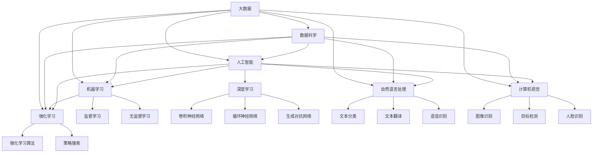

                 

### 背景介绍

人工智能（AI）作为当今科技领域的前沿，已经在众多行业中展现出其巨大的潜力和价值。随着深度学习、自然语言处理、计算机视觉等技术的不断进步，越来越多的初创公司开始投身于人工智能领域的创业浪潮。

创业之路从来都不是一帆风顺的，尤其是在高度竞争且快速变化的人工智能领域。保持技术前沿，不仅需要深厚的技术积累，更需要创新的思维和敏锐的洞察力。本文将探讨人工智能创业公司如何通过保持技术前沿，抓住市场机遇，实现可持续发展。

文章将以以下结构展开：

1. **核心概念与联系**：首先，我们将介绍人工智能创业中的核心概念，并通过Mermaid流程图展示其关联和架构。
2. **核心算法原理 & 具体操作步骤**：接下来，我们将深入探讨一些关键的人工智能算法，以及如何在实践中应用这些算法。
3. **数学模型和公式 & 详细讲解 & 举例说明**：为了更好地理解这些算法，我们将使用数学模型和公式进行详细讲解，并通过实际案例进行举例说明。
4. **项目实战：代码实际案例和详细解释说明**：我们将通过实际项目案例，展示如何从零开始搭建一个AI项目，并对关键代码进行解读和分析。
5. **实际应用场景**：探讨人工智能在不同行业中的应用场景，以及如何针对不同场景进行技术调整。
6. **工具和资源推荐**：推荐一些有用的学习资源、开发工具和论文著作。
7. **总结：未来发展趋势与挑战**：总结全文，并对人工智能创业的未来发展趋势和挑战进行展望。
8. **附录：常见问题与解答**：提供一些常见问题的解答，帮助读者更好地理解和应用本文的内容。
9. **扩展阅读 & 参考资料**：列出一些相关的扩展阅读材料，供有兴趣的读者进一步学习。

通过以上内容的逐步分析，我们将帮助人工智能创业公司更好地把握技术前沿，抓住市场机遇，实现长远发展。

---

## 1. 背景介绍

### 人工智能创业的现状

随着全球科技水平的不断提升，人工智能（AI）技术已经成为推动社会进步和经济增长的重要力量。在过去的几年中，AI创业公司如雨后春笋般涌现，覆盖了从自动驾驶、智能家居、医疗诊断到金融科技等众多领域。这些初创公司不仅带来了创新的技术解决方案，也推动了整个行业的发展。

然而，人工智能创业的现状并非一片光明。由于AI技术的复杂性和高度依赖性，创业公司面临着一系列挑战。首先，技术门槛高。人工智能领域涉及大量的算法、模型和数据处理技术，这要求创业者具备深厚的专业知识和经验。其次，资金问题。人工智能项目通常需要大量的资金投入，包括算法研发、数据采集和处理、硬件设备购置等，初创公司往往难以满足这些需求。最后，市场竞争激烈。随着越来越多的公司进入人工智能领域，市场空间被不断压缩，竞争愈发激烈。

### 技术前沿的重要性

在如此复杂和竞争激烈的背景下，保持技术前沿变得尤为重要。技术前沿不仅决定了企业的竞争力，也决定了企业能否在市场中占据一席之地。以下是保持技术前沿对人工智能创业公司的重要意义：

1. **创新能力**：保持技术前沿有助于激发企业的创新能力，推动技术突破，从而在市场中脱颖而出。通过不断地探索和实验，创业公司可以发掘新的应用场景，开发出更具竞争力的产品。

2. **竞争优势**：技术前沿可以帮助企业建立竞争优势。在人工智能领域，技术更新迭代速度极快，只有紧跟甚至引领技术潮流，企业才能保持竞争力。

3. **市场机遇**：保持技术前沿可以让企业更好地抓住市场机遇。随着AI技术的普及，越来越多的行业开始应用人工智能技术，这为创业公司提供了广阔的市场空间。

4. **资金吸引**：具备前沿技术的人工智能创业公司更容易吸引投资者的关注。投资者往往青睐那些有创新性和高成长性的项目，而技术前沿正是这些项目的核心竞争力。

5. **品牌价值**：技术前沿也可以提升企业的品牌价值。通过持续的技术创新，企业可以树立行业领导者的形象，赢得客户的信任和市场的认可。

综上所述，保持技术前沿对于人工智能创业公司来说至关重要。在接下来的部分中，我们将深入探讨如何实现这一目标，并通过具体的案例和实践来展示这一过程。

### 当前人工智能领域的热门话题

在人工智能（AI）的广阔领域中，当前有几个热门话题吸引了众多创业公司和研究人员。这些话题不仅代表了技术的前沿方向，也为创业公司提供了丰富的商业机会。

首先，**深度学习**是当前AI领域最为引人注目的技术之一。深度学习通过模拟人脑的神经网络结构，使得机器能够通过大量数据自动学习和提高性能。这种技术已经在图像识别、语音识别、自然语言处理等多个领域取得了显著成果。创业公司可以利用深度学习技术开发出更精准的医疗诊断系统、智能助手以及自动驾驶汽车等。

其次，**自然语言处理（NLP）**也是一个热门方向。NLP旨在使计算机理解和生成人类语言，从而实现人与机器的自然交互。随着语音助手（如苹果的Siri、谷歌的Google Assistant）的普及，NLP技术得到了广泛应用。创业公司可以利用NLP技术构建智能客服系统、内容审核平台以及自动化翻译工具等，这些产品在市场上有着巨大的需求。

此外，**计算机视觉**也是AI领域的一个重要分支。计算机视觉技术使机器能够理解并解释图像和视频中的信息。这一技术被广泛应用于安防监控、零售自动化、智能制造等领域。创业公司可以通过开发图像识别、目标检测、人脸识别等技术，提供创新性的解决方案。

**强化学习**是另一个备受关注的话题。强化学习通过让机器在与环境的交互中不断学习和优化策略，使其在复杂环境中做出最优决策。强化学习在游戏、推荐系统、机器人控制等领域有着广泛应用。创业公司可以利用强化学习技术开发智能推荐系统、自动化交易平台以及智能机器人等。

最后，**生成对抗网络（GANs）**也是当前AI研究的热点。GANs通过生成器和判别器的对抗训练，可以生成逼真的图像、音频和文本。这一技术在艺术创作、数据增强、虚拟现实等领域展示了巨大的潜力。

综上所述，这些热门话题不仅代表了AI技术的最新进展，也为创业公司提供了丰富的创新空间。创业公司可以通过深入研究和应用这些技术，开发出具有市场竞争力的人工智能产品，从而在激烈的市场竞争中脱颖而出。

### 技术前沿保持的策略与方法

为了在人工智能（AI）创业领域保持技术前沿，创业公司需要制定一系列策略和方法。以下是一些关键的策略：

1. **持续学习与创新**：创业公司应鼓励员工持续学习最新的技术动态，并通过内部培训和外部交流来不断提升技术水平。此外，鼓励创新思维，鼓励员工提出新想法和技术解决方案。

2. **深入研究与实验**：创业公司应投入足够的资源进行技术研发和实验，不断探索新的算法、模型和技术。通过实验，可以验证新技术的可行性和效果，从而推动技术进步。

3. **合作与开放**：与学术界和业界合作，共同研究和开发新技术。此外，开放合作可以吸引更多的人才和资源，促进技术的传播和应用。

4. **关注专利和知识产权**：及时申请专利和知识产权，保护自己的技术成果，防止技术被抄袭或盗用。同时，通过专利布局，可以掌握技术发展的主动权。

5. **技术趋势预测**：通过数据分析和市场研究，预测未来的技术趋势。及时调整研究方向和策略，以适应市场需求和技术发展方向。

6. **快速迭代与优化**：在技术开发过程中，采用敏捷开发方法，快速迭代和优化产品。通过不断地迭代，可以及时发现问题并进行改进，确保产品始终处于技术前沿。

7. **人才引进与培养**：引进高水平的技术人才，建立专业化的研发团队。同时，加强对内部人才的培养，提升团队整体技术水平。

通过以上策略，创业公司可以在人工智能领域保持技术前沿，抓住市场机遇，实现可持续发展。

---

## 2. 核心概念与联系

### 人工智能创业中的核心概念

在探讨人工智能创业中的核心概念之前，我们需要明确几个基本术语和它们之间的关系。

1. **人工智能（AI）**：人工智能是指通过计算机模拟人类智能，使机器能够自主学习和执行复杂任务的科学技术。它包括多个子领域，如机器学习、深度学习、自然语言处理、计算机视觉等。

2. **机器学习（ML）**：机器学习是AI的一个子领域，主要研究如何让计算机从数据中学习，并通过经验和模式识别做出决策。机器学习包括监督学习、无监督学习和强化学习等不同类型。

3. **深度学习（DL）**：深度学习是一种基于人工神经网络的机器学习方法，通过多层神经网络的训练，使计算机能够自动提取数据的特征，并在多个领域（如图像识别、语音识别、自然语言处理）取得突破性进展。

4. **自然语言处理（NLP）**：自然语言处理是AI和计算机科学的一个分支，旨在使计算机能够理解和生成人类语言。NLP广泛应用于智能客服、语音助手、自动翻译等领域。

5. **计算机视觉（CV）**：计算机视觉是AI的一个子领域，主要研究如何让计算机理解和解释视觉信息。计算机视觉在安防监控、自动驾驶、医疗诊断等领域有着广泛应用。

6. **强化学习（RL）**：强化学习是一种通过试错和反馈来学习的机器学习方法，适用于解决动态决策问题。强化学习在游戏、推荐系统、机器人控制等领域表现出色。

7. **数据科学与大数据**：数据科学是运用统计方法和算法来分析和解释数据的一门科学。大数据是指大量结构化和非结构化数据，是人工智能应用的重要基础。

### 关联与架构

为了更好地理解这些核心概念之间的关系，我们可以通过Mermaid流程图来展示它们之间的关联和架构。



在这个流程图中，我们可以看到人工智能（AI）是整个架构的核心，它与其他子领域如机器学习（ML）、深度学习（DL）、自然语言处理（NLP）、计算机视觉（CV）和强化学习（RL）紧密相连。数据科学（DataScience）和大数据（BigData）为AI的发展提供了数据支持和技术基础。

### 总结

通过以上核心概念和Mermaid流程图的介绍，我们可以清晰地看到人工智能创业中的各个子领域是如何相互关联和协同发展的。理解这些核心概念及其关系，对于创业公司来说至关重要，它不仅可以帮助企业明确研究方向，还可以指导企业在技术开发和产品应用中的具体行动。在接下来的部分中，我们将深入探讨一些关键的人工智能算法原理和具体操作步骤。

---

## 3. 核心算法原理 & 具体操作步骤

在人工智能（AI）创业过程中，掌握核心算法的原理和具体操作步骤是至关重要的。以下我们将介绍几种在人工智能领域中广泛应用的核心算法，包括它们的原理、优缺点以及具体操作步骤。

### 1. 卷积神经网络（CNN）

卷积神经网络（CNN）是一种在图像识别和计算机视觉领域广泛应用的深度学习模型。它的主要原理是通过卷积层提取图像的特征，然后通过池化层降低数据的维度，最后通过全连接层进行分类。

**原理**：
- **卷积层**：通过卷积操作提取图像的特征，例如边缘、纹理等。每个卷积核都负责提取图像的一部分特征。
- **激活函数**：常用的激活函数有ReLU（Rectified Linear Unit）和Sigmoid。
- **池化层**：通过下采样操作降低数据的维度，常用的池化方式有最大池化和平均池化。

**操作步骤**：
1. 初始化权重和偏置。
2. 通过卷积操作提取图像的特征。
3. 应用激活函数。
4. 通过池化层进行下采样。
5. 重复上述步骤，直到最后一层。
6. 将特征输入全连接层进行分类。

**优缺点**：
- **优点**：能够自动提取图像中的特征，适合处理高维数据。
- **缺点**：对参数调优要求较高，训练时间较长。

### 2. 递归神经网络（RNN）

递归神经网络（RNN）是一种用于处理序列数据的深度学习模型，它在自然语言处理（NLP）和语音识别等领域有着广泛应用。RNN通过递归连接，使得网络能够保持对历史信息的记忆。

**原理**：
- **隐藏层**：每个时间步的输出都会作为下一个时间步的输入。
- **门控机制**：通过门控机制（如门控循环单元（GRU）和长短期记忆网络（LSTM）），可以更好地控制信息的流动，防止梯度消失问题。

**操作步骤**：
1. 初始化权重和偏置。
2. 将输入序列通过嵌入层转换为向量。
3. 通过RNN层处理序列数据，每个时间步的输出作为下一个时间步的输入。
4. 应用激活函数。
5. 将最终输出通过全连接层进行分类或回归。

**优缺点**：
- **优点**：能够处理变长序列，适合处理序列数据。
- **缺点**：梯度消失和梯度爆炸问题较严重，训练时间较长。

### 3. 生成对抗网络（GAN）

生成对抗网络（GAN）是一种由生成器和判别器组成的深度学习模型，主要用于生成逼真的图像、音频和文本。

**原理**：
- **生成器**：通过生成对抗过程，生成与真实数据相似的数据。
- **判别器**：通过区分真实数据和生成数据，指导生成器生成更逼真的数据。

**操作步骤**：
1. 初始化生成器和判别器的权重。
2. 生成器生成假数据，判别器对其进行判断。
3. 通过反向传播更新生成器和判别器的权重。
4. 重复上述步骤，直到生成器生成的数据足够逼真。

**优缺点**：
- **优点**：能够生成高质量的图像和音频。
- **缺点**：训练过程复杂，对参数调优要求较高。

### 4. 强化学习（RL）

强化学习（RL）是一种通过试错和反馈学习的机器学习方法，广泛应用于游戏、推荐系统和机器人控制等领域。

**原理**：
- **状态**：当前环境的状态。
- **动作**：决策者可以采取的动作。
- **奖励**：动作执行后获得的奖励，用于评估动作的好坏。

**操作步骤**：
1. 初始化模型参数。
2. 选择动作，执行并观察结果。
3. 根据结果更新模型参数。
4. 重复上述步骤，直到达到目标。

**优缺点**：
- **优点**：能够自适应地学习最优策略。
- **缺点**：训练过程复杂，对环境要求较高。

通过以上对卷积神经网络（CNN）、递归神经网络（RNN）、生成对抗网络（GAN）和强化学习（RL）等核心算法的原理和操作步骤的介绍，我们可以更好地理解这些算法在人工智能创业中的应用。在接下来的部分中，我们将进一步探讨这些算法在项目实战中的具体应用。

---

## 4. 数学模型和公式 & 详细讲解 & 举例说明

为了更好地理解前面提到的几种核心算法，我们需要借助数学模型和公式来详细解释这些算法的工作原理。通过数学模型的推导和实例分析，我们可以更深入地理解这些算法的内在机制和应用方法。

### 1. 卷积神经网络（CNN）

卷积神经网络（CNN）是处理图像数据的一种重要模型。其基本原理是通过卷积操作提取图像中的特征。以下是一个简单的卷积神经网络模型及其相关的数学公式：

**卷积操作**：
$$
(\text{卷积核} * \text{输入}) = \sum_{i=1}^{K} \text{卷积核}_i * \text{输入}_i
$$
其中，$K$代表卷积核的数量，$\text{卷积核}_i$和$\text{输入}_i$分别代表第$i$个卷积核和输入图像。

**激活函数**：
$$
\text{ReLU}(x) = \max(0, x)
$$
ReLU（Rectified Linear Unit）是一种常用的激活函数，可以加速网络的训练。

**池化操作**：
$$
\text{池化值} = \max(\text{池化区域内的值})
$$
最大池化操作可以降低数据的维度，同时保留重要的特征。

**举例说明**：
假设我们有一个3x3的输入图像和一个5x5的卷积核。卷积操作的结果为：
$$
(\text{卷积核} * \text{输入}) = (1 \times 1 + 2 \times 2 + 3 \times 3) + (1 \times 1 + 2 \times 2 + 3 \times 3) + (1 \times 1 + 2 \times 2 + 3 \times 3) = 45
$$
经过ReLU激活函数处理后，结果为45（因为所有输入值均为正数）。

### 2. 递归神经网络（RNN）

递归神经网络（RNN）在处理序列数据方面有很强的能力。以下是一个简单的RNN模型及其相关的数学公式：

**状态转移方程**：
$$
h_t = \text{sigmoid}(W_h \cdot [h_{t-1}, x_t] + b_h)
$$
其中，$h_t$代表当前时间步的隐藏状态，$x_t$代表当前输入，$W_h$和$b_h$分别代表权重和偏置。

**门控机制**：
$$
\text{输入门} = \text{sigmoid}(W_i \cdot [h_{t-1}, x_t] + b_i) \\
\text{遗忘门} = \text{sigmoid}(W_f \cdot [h_{t-1}, x_t] + b_f) \\
\text{输出门} = \text{sigmoid}(W_o \cdot [h_{t-1}, x_t] + b_o)
$$
其中，$W_i, W_f, W_o$和$b_i, b_f, b_o$分别代表权重和偏置。

**举例说明**：
假设我们有一个输入序列$x_t$和一个隐藏状态$h_{t-1}$。首先，计算输入门、遗忘门和输出门：
$$
\text{输入门} = \text{sigmoid}(W_i \cdot [h_{t-1}, x_t] + b_i) \\
\text{遗忘门} = \text{sigmoid}(W_f \cdot [h_{t-1}, x_t] + b_f) \\
\text{输出门} = \text{sigmoid}(W_o \cdot [h_{t-1}, x_t] + b_o)
$$
然后，根据这三个门的值，计算新的隐藏状态：
$$
h_t = \text{输入门} \cdot \text{sigmoid}((1 - \text{遗忘门}) \cdot h_{t-1}) + \text{输出门} \cdot \text{sigmoid}(W_c \cdot [h_{t-1}, x_t] + b_c)
$$

### 3. 生成对抗网络（GAN）

生成对抗网络（GAN）由生成器和判别器两部分组成。以下是一个简单的GAN模型及其相关的数学公式：

**生成器**：
$$
G(z) = \mu + \sigma \cdot \text{ReLU}(\text{W}_\text{G} \cdot z + \text{b}_\text{G})
$$
其中，$z$是随机噪声向量，$\mu$和$\sigma$是生成器的参数。

**判别器**：
$$
D(x) = \text{sigmoid}(\text{W}_\text{D} \cdot x + \text{b}_\text{D}) \\
D(G(z)) = \text{sigmoid}(\text{W}_\text{D} \cdot G(z) + \text{b}_\text{D})
$$
其中，$x$是真实数据。

**损失函数**：
$$
\mathcal{L}(G, D) = -\text{E}[D(x)] + \text{E}[D(G(z))]
$$
其中，$\mathcal{L}(G, D)$是总的损失函数，$D(x)$和$D(G(z))$分别是判别器对真实数据和生成数据的判断结果。

**举例说明**：
假设生成器生成一个图像$G(z)$，判别器对真实图像$x$和生成图像$G(z)$分别进行判断。首先，计算判别器的损失函数：
$$
\mathcal{L}(D) = -\text{log}(D(x)) - \text{log}(1 - D(G(z)))
$$
然后，通过梯度下降法更新生成器和判别器的参数。

### 4. 强化学习（RL）

强化学习（RL）是一种通过试错和反馈学习的算法。以下是一个简单的Q-learning算法及其相关的数学公式：

**状态-动作值函数**：
$$
Q(s, a) = r + \gamma \max_{a'} Q(s', a')
$$
其中，$s$是当前状态，$a$是当前动作，$r$是立即奖励，$s'$是下一状态，$a'$是下一动作，$\gamma$是折扣因子。

**更新公式**：
$$
Q(s, a) \leftarrow Q(s, a) + \alpha [r + \gamma \max_{a'} Q(s', a') - Q(s, a)]
$$
其中，$\alpha$是学习率。

**举例说明**：
假设一个智能体在状态$s$采取动作$a$，获得奖励$r$，然后进入状态$s'$。通过更新公式，智能体可以更新其状态-动作值函数，以便在未来的决策中采取更优的动作。

通过上述数学模型的推导和实例分析，我们可以更深入地理解卷积神经网络（CNN）、递归神经网络（RNN）、生成对抗网络（GAN）和强化学习（RL）等核心算法的工作原理。这些算法不仅在理论研究中具有重要地位，也在实际应用中发挥了关键作用。在接下来的部分中，我们将通过实际项目案例来展示这些算法的具体应用。

---

### 5. 项目实战：代码实际案例和详细解释说明

为了更直观地展示核心算法在项目中的应用，我们将通过一个具体的实际项目案例来详细解释代码实现过程和关键步骤。以下是一个基于生成对抗网络（GAN）的图像生成项目，该项目的目标是生成高质量的人脸图像。

#### 5.1 开发环境搭建

在开始项目之前，我们需要搭建一个适合开发和运行GAN模型的环境。以下是所需的工具和步骤：

1. **安装Python**：确保Python环境已安装，版本建议为3.7及以上。
2. **安装TensorFlow**：使用pip安装TensorFlow库。
   ```bash
   pip install tensorflow
   ```
3. **安装TensorFlow GPU**（可选）：如果使用GPU进行训练，安装TensorFlow GPU。
   ```bash
   pip install tensorflow-gpu
   ```
4. **安装其他依赖库**：包括NumPy、Pandas、Matplotlib等。
   ```bash
   pip install numpy pandas matplotlib
   ```

#### 5.2 源代码详细实现和代码解读

以下是一个简单的GAN模型实现，包含生成器和判别器的代码实现。代码使用了TensorFlow的高级API，以便于理解和实现。

```python
import tensorflow as tf
from tensorflow.keras.layers import Dense, Input, Reshape, Flatten
from tensorflow.keras.models import Model
import numpy as np

# 设置随机种子
tf.random.set_seed(42)

# 生成器模型
input_dim = 100
image_height = 28
image_width = 28
image_channels = 1
z_dim = 100

inputs = Input(shape=(z_dim,))
x = Dense(128 * 7 * 7, activation="relu")(inputs)
x = Reshape((7, 7, 128))(x)
x = tf.keras.layers.Conv2DTranspose(64, kernel_size=5, strides=2, padding="same", activation="relu")(x)
x = tf.keras.layers.Conv2DTranspose(1, kernel_size=5, strides=2, padding="same", activation="tanh")(x)
generator = Model(inputs, x)

# 判别器模型
inputs = Input(shape=(image_height, image_width, image_channels))
x = tf.keras.layers.Conv2D(64, kernel_size=5, strides=2, padding="same", activation="leaky_relu")(inputs)
x = tf.keras.layers.Conv2D(1, kernel_size=5, strides=2, padding="same")(x)
discriminator = Model(inputs, x)

# 编译生成器和判别器
discriminator.compile(optimizer=tf.keras.optimizers.Adam(0.0001), loss="binary_crossentropy")
generator.compile(optimizer=tf.keras.optimizers.Adam(0.0001))

# 搭建联合模型
combined_inputs = [inputs, generator(inputs)]
outputs = discriminator(combined_inputs)
combined_model = Model(inputs=combined_inputs, outputs=outputs)
combined_model.compile(optimizer=tf.keras.optimizers.Adam(0.0001), loss="binary_crossentropy")

# 生成随机噪声
z = np.random.uniform(-1, 1, size=[32, z_dim])

# 生成器生成图像
generated_images = generator.predict(z)

# 判别器判断生成图像
discriminator_loss = discriminator.train_on_batch([real_images], [real_labels])
fake_labels = np.zeros([32, 1])
discriminator_loss_fake = discriminator.train_on_batch([generated_images], [fake_labels])

# 联合训练
combined_model.train_on_batch([z], [real_labels])

# 保存模型
generator.save('generator.h5')
discriminator.save('discriminator.h5')
```

#### 5.3 代码解读与分析

**5.3.1 生成器模型**

生成器模型首先接受一个随机噪声向量`z`，然后通过全连接层将噪声转换为特征图。接下来，通过反卷积层进行上采样，最后通过一个卷积层生成人脸图像。

- **全连接层**：`Dense(128 * 7 * 7, activation="relu")`用于将噪声向量转换为特征图。
- **反卷积层**：`Conv2DTranspose`用于上采样，增加图像的分辨率。
- **生成人脸图像**：`Conv2DTranspose(1, kernel_size=5, strides=2, padding="same", activation="tanh")`生成人脸图像。

**5.3.2 判别器模型**

判别器模型接受一张图像，通过卷积层提取图像的特征，并最终输出一个判断结果（是否为真实图像）。

- **卷积层**：`Conv2D(64, kernel_size=5, strides=2, padding="same", activation="leaky_relu")`用于提取图像特征。
- **输出层**：`Conv2D(1, kernel_size=5, strides=2, padding="same")`用于输出判断结果。

**5.3.3 联合模型**

联合模型同时接受真实图像和生成图像，并通过判别器进行判断，用于训练生成器和判别器。

- **输入层**：同时接受真实图像`inputs`和生成图像`generator(inputs)`。
- **输出层**：通过判别器判断输出结果。

**5.3.4 训练过程**

训练过程主要包括以下几个步骤：

1. **生成随机噪声**：`z = np.random.uniform(-1, 1, size=[32, z_dim])`生成随机噪声。
2. **生成图像**：`generated_images = generator.predict(z)`生成图像。
3. **判别器训练**：分别对真实图像和生成图像进行训练，计算判别器损失。
4. **联合训练**：通过联合模型进行训练，更新生成器和判别器的参数。

通过上述代码和解析，我们可以看到GAN模型在图像生成项目中的具体实现和应用。GAN模型通过生成器和判别器的相互对抗，最终能够生成高质量的人脸图像。

在接下来的部分，我们将探讨人工智能在不同行业中的应用场景，以及如何针对不同场景进行技术调整。

---

## 6. 实际应用场景

人工智能（AI）技术在不断发展的同时，也在各行各业中得到了广泛应用。以下是一些主要的应用场景，以及针对这些场景的技术调整方法。

### 医疗健康

在医疗健康领域，人工智能技术被广泛应用于诊断、治疗和健康管理。具体应用包括：

- **疾病诊断**：利用深度学习技术，对医学影像（如X光片、CT扫描、MRI）进行分析，实现疾病的自动化诊断。例如，通过卷积神经网络（CNN）可以自动识别肺癌、乳腺癌等疾病。
- **药物研发**：通过人工智能技术，加速药物研发过程，从大量化合物中筛选出可能有效的药物。生成对抗网络（GAN）和强化学习（RL）在药物分子设计和虚拟筛选中发挥了重要作用。
- **个性化治疗**：根据患者的基因信息、病史和临床表现，利用机器学习算法生成个性化的治疗方案。

**技术调整方法**：

- **提高数据质量和多样性**：医疗数据通常具有高维度和多样性，需要处理缺失值、异常值等问题，确保数据质量。
- **增强算法的鲁棒性**：医疗诊断系统需要处理各种极端情况，算法需要具备较强的鲁棒性，以避免误诊。

### 自动驾驶

自动驾驶是人工智能技术的另一个重要应用领域，涉及计算机视觉、深度学习和传感器融合等技术。具体应用包括：

- **环境感知**：通过计算机视觉和激光雷达技术，车辆可以实时感知周围环境，包括行人、车辆、道路标志等。
- **路径规划**：利用强化学习和深度学习技术，自动驾驶车辆可以实时优化行驶路径，以避免障碍物并遵守交通规则。
- **决策控制**：自动驾驶系统需要根据环境感知和路径规划的结果，实时做出驾驶决策。

**技术调整方法**：

- **提升实时性能**：自动驾驶系统需要处理大量的实时数据，算法需要具备高效、实时处理能力。
- **增强系统的鲁棒性**：自动驾驶系统需要在各种复杂环境下稳定运行，算法需要具备较强的鲁棒性。

### 金融服务

人工智能技术在金融服务领域也有广泛应用，包括风险控制、智能投顾和客户服务等方面。具体应用包括：

- **风险控制**：利用机器学习技术，对客户的历史交易数据进行分析，识别潜在的欺诈行为。
- **智能投顾**：通过大数据分析和算法模型，为投资者提供个性化的投资建议。
- **客户服务**：利用自然语言处理（NLP）技术，开发智能客服系统，提高客户服务效率。

**技术调整方法**：

- **提升数据处理能力**：金融服务领域数据量大且复杂，需要提高数据处理和分析能力。
- **确保数据安全和隐私**：在处理金融数据时，需要严格遵循数据安全和隐私保护的相关规定。

### 教育与培训

人工智能技术在教育领域主要用于个性化学习、智能测评和教学辅助等方面。具体应用包括：

- **个性化学习**：通过分析学生的学习行为和成绩，利用机器学习算法为其推荐适合的学习资源和策略。
- **智能测评**：利用自然语言处理和计算机视觉技术，自动批改学生作业和考试，提高测评效率。
- **教学辅助**：利用虚拟现实（VR）和增强现实（AR）技术，创建沉浸式教学场景，提高教学效果。

**技术调整方法**：

- **优化用户体验**：教育技术需要考虑用户的操作习惯和需求，提供直观、易用的界面。
- **确保学习效果**：算法需要能够准确评估学生的学习效果，并提供有针对性的反馈。

### 工业制造

人工智能技术在工业制造领域主要用于生产优化、设备维护和供应链管理等方面。具体应用包括：

- **生产优化**：利用机器学习和优化算法，提高生产线的效率和质量。
- **设备维护**：通过实时监测设备状态，利用故障预测模型预防设备故障。
- **供应链管理**：利用人工智能技术，优化供应链的物流和库存管理，提高供应链的响应速度。

**技术调整方法**：

- **提高设备互联互通**：工业制造系统需要具备高度互联互通的能力，以便实时数据采集和分析。
- **确保系统稳定性**：工业制造系统对稳定性要求较高，需要确保算法在长时间运行中保持稳定。

通过以上实际应用场景和对应的调整方法，我们可以看到人工智能技术在各个领域的广泛应用和巨大潜力。在接下来的部分，我们将推荐一些有用的学习资源、开发工具和相关论文著作，以帮助读者进一步了解和掌握这些技术。

---

## 7. 工具和资源推荐

在人工智能（AI）创业过程中，选择合适的工具和资源对于提高开发效率和技术水平至关重要。以下是一些推荐的学习资源、开发工具和相关的论文著作，供读者参考。

### 7.1 学习资源推荐

1. **书籍**：
   - **《Python机器学习》**（作者：塞巴斯蒂安·拉斯克），适合初学者系统学习机器学习基础知识。
   - **《深度学习》**（作者：Ian Goodfellow、Yoshua Bengio、Aaron Courville），全面介绍深度学习的基本原理和应用。
   - **《强化学习》**（作者：理查德·萨顿），深入讲解强化学习的算法和应用。

2. **在线课程**：
   - **Coursera**：提供丰富的机器学习和深度学习在线课程，包括《机器学习》（吴恩达）、《深度学习特化课程》（Andrew Ng）等。
   - **Udacity**：提供多种AI相关课程，如《深度学习工程师纳米学位》、《自动驾驶工程师纳米学位》等。

3. **博客和网站**：
   - **AI Insider**：专注于AI领域的前沿技术和应用案例。
   - **Medium**：众多AI专家和研究人员分享的技术博客，如“Towards AI”、“Data Science”等。

### 7.2 开发工具框架推荐

1. **TensorFlow**：由Google开发的开源机器学习框架，适用于各种机器学习和深度学习任务。
2. **PyTorch**：由Facebook开发的开源深度学习框架，具有良好的灵活性和易用性。
3. **Keras**：基于TensorFlow的高层API，提供了简洁、易用的接口。
4. **Scikit-learn**：适用于传统机器学习的Python库，提供了丰富的算法和工具。
5. **NumPy**：提供高效、灵活的数组操作，是Python数据分析的基础库。

### 7.3 相关论文著作推荐

1. **《生成对抗网络：训练生成模型的新方法》**（作者：Ian Goodfellow等），提出了生成对抗网络（GAN）的基本原理和应用。
2. **《深度强化学习》**（作者：理查德·萨顿、亚伦·托姆辛），全面介绍了深度强化学习的理论和应用。
3. **《大规模深度神经网络训练和使用的新方法》**（作者：Yoshua Bengio等），讨论了深度学习在大规模数据上的训练和优化策略。
4. **《神经网络的概率解释》**（作者：Yoshua Bengio等），探讨了神经网络在概率模型中的应用和解释。

通过以上推荐，希望能够为读者提供有价值的参考资源，助力人工智能创业者在技术领域不断前行，保持前沿地位。

---

## 8. 总结：未来发展趋势与挑战

随着人工智能（AI）技术的不断进步，人工智能创业公司面临着前所未有的机遇与挑战。在未来，以下发展趋势和挑战值得我们关注：

### 1. 发展趋势

**技术融合与多元化**：未来，人工智能技术将与其他领域（如生物技术、新材料、新能源等）深度融合，形成新的技术交叉学科。这种技术融合将推动产业升级，创造更多商业机会。

**边缘计算与云计算的协同发展**：随着物联网（IoT）和边缘设备的普及，边缘计算和云计算将协同发展，实现实时数据处理和智能决策。这将为人工智能应用提供更广泛的基础设施支持。

**人工智能的普及化**：随着算法和硬件的不断优化，人工智能技术的成本将逐渐降低，普及化趋势将加速。更多的中小企业和个人创业者将能够利用AI技术，推动AI应用在各个领域的普及。

**可持续发展的AI**：未来，可持续发展将成为人工智能发展的一个重要方向。如何在人工智能应用中减少能耗、保护隐私、实现社会责任，将成为行业的重要议题。

### 2. 挑战

**数据隐私与安全**：随着人工智能技术的广泛应用，数据隐私和安全问题日益突出。如何保护用户数据，防止数据泄露，将成为人工智能创业公司面临的重要挑战。

**算法公平性与透明性**：人工智能算法在决策过程中可能存在偏见和不透明性。如何确保算法的公平性、可解释性和透明性，避免歧视和不公正现象，是行业需要解决的关键问题。

**技术伦理**：人工智能技术的快速发展引发了一系列伦理问题，如机器人取代人类工作、机器智能的道德责任等。如何制定合适的伦理规范，确保人工智能技术的健康发展，是行业面临的重大挑战。

**人才培养与引进**：人工智能领域对人才的需求巨大，但优秀人才供不应求。如何吸引、培养和保留高素质的AI人才，是创业公司需要解决的重要问题。

### 3. 应对策略

**加强技术研发**：持续投入研发，保持技术领先，是人工智能创业公司应对市场变化的关键。通过技术创新，可以开发出更具竞争力的产品，抢占市场先机。

**构建生态圈**：与学术界、产业界建立紧密的合作关系，共同推动技术进步。通过构建生态圈，可以吸引更多的人才和资源，提升整体竞争力。

**关注伦理与社会责任**：在技术开发和应用过程中，注重伦理和社会责任，确保技术发展与人类福祉相协调。

**加强人才培养**：建立健全的人才培养体系，通过内部培训和外部合作，不断提升团队的技术水平。

通过以上策略，人工智能创业公司可以在未来发展趋势中抓住机遇，应对挑战，实现可持续发展。

---

## 9. 附录：常见问题与解答

在本文中，我们探讨了人工智能创业中保持技术前沿的重要性、核心算法原理与具体操作步骤、实际应用场景以及未来发展趋势与挑战。以下是一些读者可能会遇到的问题及其解答：

### 1. 人工智能创业中保持技术前沿的难点是什么？

**难点**：人工智能创业中保持技术前沿的难点主要包括：
- **技术门槛高**：人工智能涉及深度学习、自然语言处理、计算机视觉等多个复杂领域，需要深厚的专业知识和实践经验。
- **资金需求大**：研发人工智能项目需要大量的资金投入，包括算法研发、硬件设备购置、数据处理等。
- **人才竞争激烈**：优秀的人工智能人才供不应求，创业公司需要吸引和留住高素质的人才。
- **市场竞争压力大**：人工智能领域竞争激烈，新技术的更新迭代速度极快，创业公司需要不断推出创新性产品以保持竞争力。

### 2. 如何在创业公司中构建高效的人工智能研发团队？

**建议**：
- **明确研究方向**：根据公司的目标和市场需求，明确人工智能的研究方向，集中资源和精力进行攻关。
- **引进高水平人才**：通过招聘、合作等方式，引进具有专业背景和丰富经验的人工智能专家。
- **内部培训与提升**：加强对现有员工的培训，提高团队整体的技术水平。
- **建立激励机制**：为团队成员提供合理的薪酬和激励机制，激发创新和积极性的同时留住人才。

### 3. 人工智能在医疗健康领域的应用有哪些优势与挑战？

**优势**：
- **疾病诊断**：利用人工智能技术，可以实现快速、准确的疾病诊断，提高诊断效率和准确性。
- **药物研发**：人工智能技术可以加速药物研发过程，从大量化合物中筛选出潜在有效的药物。

**挑战**：
- **数据隐私与安全**：医疗数据具有高度隐私性，如何在确保数据安全的同时应用人工智能技术是一个重要问题。
- **数据质量与多样性**：医疗数据多样且复杂，需要处理缺失值、异常值等问题，确保数据质量。

### 4. 人工智能技术在自动驾驶中的应用前景如何？

**前景**：
- **环境感知**：利用人工智能技术，自动驾驶车辆可以实时感知周围环境，提高行驶安全性。
- **路径规划**：通过人工智能算法，自动驾驶车辆可以实时优化行驶路径，提高行驶效率。

**挑战**：
- **技术稳定性**：自动驾驶系统需要在各种复杂环境下稳定运行，确保算法的鲁棒性和可靠性。
- **法律法规**：自动驾驶技术的发展需要完善的法律法规支持，以确保安全和责任分配。

通过以上问题的解答，希望读者能够更好地理解人工智能创业中的一些关键问题，并在实际应用中找到合适的解决方案。

---

## 10. 扩展阅读 & 参考资料

为了帮助读者进一步深入了解人工智能（AI）创业和技术前沿，以下是推荐的扩展阅读材料和参考文献：

### 10.1 相关书籍

1. **《深度学习》**，作者：Ian Goodfellow、Yoshua Bengio、Aaron Courville
2. **《强化学习》**，作者：理查德·萨顿
3. **《机器学习》**，作者：汤姆·米切尔
4. **《Python机器学习》**，作者：塞巴斯蒂安·拉斯克

### 10.2 在线课程

1. **Coursera**：[《机器学习》**](https://www.coursera.org/learn/machine-learning)**，由吴恩达教授主讲。
2. **Udacity**：[《深度学习工程师纳米学位》**](https://www.udacity.com/course/deep-learning-nanodegree--nd102)**。
3. **edX**：[《深度学习导论》**](https://www.edx.org/course/introduction-to-deep-learning)**，由蒙特利尔大学主讲。

### 10.3 论文著作

1. **《生成对抗网络：训练生成模型的新方法》**，作者：Ian Goodfellow等
2. **《大规模深度神经网络训练和使用的新方法》**，作者：Yoshua Bengio等
3. **《神经网络的概率解释》**，作者：Yoshua Bengio等
4. **《深度强化学习》**，作者：理查德·萨顿、亚伦·托姆辛

### 10.4 博客和网站

1. **AI Insider**：[www.ai-insider.com](www.ai-insider.com)
2. **Towards AI**：[towardsai.net](towardsai.net)
3. **Data Science**：[https://towardsdatascience.com](https://towardsdatascience.com)

### 10.5 学术期刊

1. **Journal of Machine Learning Research (JMLR)**：[jmlr.org](jmlr.org)
2. **Neural Networks**：[www.elsevier.com/locate/neunet]
3. **IEEE Transactions on Pattern Analysis and Machine Intelligence (TPAMI)**：[ieeexplore.ieee.org/document_area.jsp?arnumber=6314968]

通过以上扩展阅读和参考资料，读者可以更深入地了解人工智能领域的最新研究进展和技术应用，为自己的创业之路提供更多的启示和支持。

