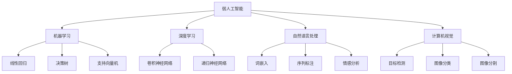

                 

## 1. 背景介绍

在当今这个科技迅猛发展的时代，人工智能（AI）已经成为推动社会进步的重要力量。从医疗、金融、教育到制造业，各行各业都在积极拥抱这一先进技术。然而，在人工智能领域的创业之路并不平坦，技术创新是关键所在。本文旨在为那些希望在人工智能领域创业的创业者们提供一份技术创新指南。

在文章的开头，我们首先要明确人工智能创业的背景。人工智能技术起源于20世纪50年代，随着计算机性能的不断提升和大数据、算法研究的深入，AI逐渐从理论研究走向实际应用。目前，人工智能技术已经取得了显著的进展，包括深度学习、强化学习、自然语言处理等。然而，人工智能创业面临的挑战依然存在，如算法优化、数据获取、成本控制等。

随着人工智能技术的不断演进，市场对人工智能应用的需求也在不断增加。例如，智能助手、自动驾驶、智能家居等应用场景逐渐普及。同时，各国政府也在积极推动人工智能的发展，出台了一系列政策扶持措施。这些因素共同为人工智能创业提供了良好的发展环境。

然而，人工智能创业并非易事。创业者不仅需要具备扎实的技术基础，还要具备市场洞察力、团队管理能力等。在技术创新方面，创业者需要紧跟技术发展趋势，不断探索新的应用场景，并通过优化算法、提高计算效率等手段降低成本，实现商业化。

接下来，我们将从核心概念、算法原理、数学模型、项目实战、实际应用场景等多个方面，逐步探讨人工智能创业的技术创新之路。希望通过本文的介绍，能够为创业者们提供一些有价值的参考和启示。

总的来说，人工智能创业的背景涵盖了技术发展、市场需求、政策支持等多个方面。这些背景因素共同作用，为人工智能创业提供了有利条件。然而，创业者仍然需要面对诸多挑战，才能在激烈的市场竞争中脱颖而出。接下来，我们将进一步探讨这些挑战以及相应的解决策略。

## 2. 核心概念与联系

### 人工智能的定义与分类

人工智能（AI）是指通过计算机模拟人类智能行为和思维过程的技术。根据实现方式和功能特点，人工智能可以分为多种类型，如弱人工智能（Narrow AI）、强人工智能（General AI）和超人工智能（Super AI）。

- **弱人工智能（Narrow AI）**：也称为特定任务人工智能，是指针对特定任务或领域进行优化的AI系统，如语音识别、图像识别、自然语言处理等。这类人工智能在特定领域表现出色，但无法进行跨领域的智能行为。

- **强人工智能（General AI）**：是指具备人类级别的智能，能够理解、学习、推理和应对各种复杂情况的AI系统。目前，强人工智能尚未实现，但科学家们仍在不断努力。

- **超人工智能（Super AI）**：是指超越人类智能的AI，能够自主学习和创新，解决人类目前无法解决的问题。超人工智能目前仍处于理论阶段，尚未实现。

### 关键技术及其应用

人工智能的实现依赖于多种关键技术，包括机器学习、深度学习、自然语言处理、计算机视觉等。

- **机器学习（Machine Learning）**：是一种让计算机通过数据学习模式并进行预测或决策的方法。常见的机器学习算法包括线性回归、决策树、支持向量机等。

- **深度学习（Deep Learning）**：是机器学习的一种子领域，通过构建具有多层次的神经网络，从大量数据中自动提取特征并进行学习。深度学习在图像识别、语音识别、自然语言处理等领域取得了显著成果。

- **自然语言处理（Natural Language Processing, NLP）**：是人工智能的一个分支，旨在让计算机理解和生成人类语言。NLP技术在智能助手、机器翻译、情感分析等方面有广泛应用。

- **计算机视觉（Computer Vision）**：是使计算机能够理解和解释图像和视频内容的技术。计算机视觉在自动驾驶、安防监控、医疗影像诊断等领域发挥着重要作用。

### Mermaid 流程图

为了更清晰地展示人工智能的关键技术及其联系，我们可以使用 Mermaid 流程图。以下是人工智能核心概念的 Mermaid 流程图：



在这个流程图中，我们可以看到人工智能的关键技术及其相互联系。例如，弱人工智能与机器学习、深度学习、自然语言处理和计算机视觉密切相关；机器学习涵盖了线性回归、决策树和支持向量机等算法；深度学习包括卷积神经网络和递归神经网络等；自然语言处理涉及词嵌入、序列标注和情感分析；计算机视觉包括目标检测、图像分类和图像分割等。

### 关键技术对人工智能创业的影响

人工智能创业的关键技术对创业者提出了新的要求。以下是对这些技术影响的简要分析：

- **机器学习**：机器学习算法是实现人工智能的基础，创业者需要掌握常见的机器学习算法，并具备算法调优和模型优化的能力。此外，创业者还需关注算法的效率和计算成本。

- **深度学习**：深度学习在图像识别、语音识别等领域具有广泛应用，创业者可以通过深度学习技术实现一些具有市场竞争力的应用。然而，深度学习对计算资源的需求较高，创业者需要考虑如何优化计算资源。

- **自然语言处理**：自然语言处理技术在智能助手、机器翻译等领域具有巨大潜力。创业者可以借助自然语言处理技术，为用户提供更加便捷和智能的服务。

- **计算机视觉**：计算机视觉技术在自动驾驶、安防监控等领域有广泛应用。创业者可以通过计算机视觉技术，开发出具有实际应用价值的产品。

### 技术创新与创业的关系

技术创新是推动人工智能创业的关键因素。创业者需要紧跟技术发展趋势，不断探索新的应用场景，并通过技术创新实现商业成功。以下是从技术创新角度分析人工智能创业的几个要点：

- **需求导向**：技术创新应紧密结合市场需求，解决实际痛点。创业者需要关注用户需求，从用户需求中寻找创新点。

- **跨学科融合**：人工智能技术涉及多个学科，如计算机科学、数学、心理学等。创业者需要具备跨学科的知识储备，才能更好地推动技术创新。

- **持续迭代**：技术创新不是一蹴而就的，创业者需要不断进行迭代和优化，以适应市场变化和技术进步。

- **风险控制**：技术创新过程中，创业者需要面对诸多风险，如技术风险、市场风险、资金风险等。创业者应具备良好的风险管理能力，降低技术创新过程中的不确定性。

综上所述，人工智能创业的核心概念与联系涉及多个方面，包括人工智能的定义与分类、关键技术的应用和影响，以及技术创新与创业的关系。创业者需要掌握这些核心概念，结合市场需求和技术趋势，才能在人工智能创业领域取得成功。

## 3. 核心算法原理 & 具体操作步骤

在人工智能创业过程中，核心算法原理的理解和应用至关重要。以下是几种常见的人工智能核心算法原理及其具体操作步骤：

### 3.1 深度学习算法

深度学习算法是当前人工智能领域中最具影响力的技术之一。其基本原理是通过构建多层神经网络，对输入数据进行特征提取和分类。以下是一个简单的深度学习算法操作步骤：

1. **数据预处理**：首先，对输入数据进行预处理，包括数据清洗、归一化、数据增强等操作。

2. **构建神经网络模型**：设计并构建一个多层神经网络模型，包括输入层、隐藏层和输出层。常见的神经网络结构有卷积神经网络（CNN）、循环神经网络（RNN）等。

3. **初始化参数**：为神经网络模型初始化参数，如权重和偏置等。

4. **前向传播**：将输入数据传递到神经网络模型中，经过各层神经元的非线性变换，最终得到输出结果。

5. **计算损失函数**：通过计算预测结果与实际结果之间的差异，得到损失函数值。

6. **反向传播**：将损失函数值反向传播到神经网络的各个层次，更新参数。

7. **迭代训练**：重复上述步骤，逐步优化神经网络模型。

8. **模型评估**：使用验证集或测试集对训练好的模型进行评估，判断模型性能。

### 3.2 强化学习算法

强化学习算法是一种通过试错和奖励机制进行决策优化的算法。其基本原理是智能体在环境中采取行动，并根据环境的反馈调整策略，以最大化长期回报。以下是一个简单的强化学习算法操作步骤：

1. **初始化环境**：创建一个模拟环境，定义状态空间、动作空间和奖励机制。

2. **选择初始策略**：智能体在初始状态下采取一个随机动作。

3. **执行动作**：智能体在环境中执行所选动作，并观察环境反馈。

4. **计算奖励**：根据动作的结果计算奖励值，奖励值越高表示动作越优。

5. **更新策略**：根据奖励值和当前策略，调整智能体的决策策略。

6. **重复迭代**：重复执行动作、计算奖励、更新策略的过程，逐步优化策略。

7. **评估策略**：在环境中的特定状态下，评估智能体策略的优劣。

### 3.3 自然语言处理算法

自然语言处理算法用于理解和生成人类语言。以下是一个简单的自然语言处理算法操作步骤：

1. **文本预处理**：对输入文本进行清洗、分词、去停用词等预处理操作。

2. **词嵌入**：将文本中的每个词映射为一个向量，以便进行数学运算。

3. **构建模型**：设计并构建一个神经网络模型，用于对输入文本进行分类、情感分析、机器翻译等任务。

4. **前向传播**：将预处理后的文本传递到神经网络模型中，经过各层神经元的非线性变换，最终得到输出结果。

5. **计算损失函数**：通过计算预测结果与实际结果之间的差异，得到损失函数值。

6. **反向传播**：将损失函数值反向传播到神经网络的各个层次，更新参数。

7. **迭代训练**：重复上述步骤，逐步优化神经网络模型。

8. **模型评估**：使用验证集或测试集对训练好的模型进行评估，判断模型性能。

### 3.4 计算机视觉算法

计算机视觉算法用于理解和解释图像和视频内容。以下是一个简单的计算机视觉算法操作步骤：

1. **图像预处理**：对输入图像进行去噪、缩放、旋转等预处理操作。

2. **特征提取**：从预处理后的图像中提取具有代表性的特征，如边缘、纹理、形状等。

3. **构建模型**：设计并构建一个神经网络模型，用于对提取的特征进行分类、目标检测、图像分割等任务。

4. **前向传播**：将预处理后的图像传递到神经网络模型中，经过各层神经元的非线性变换，最终得到输出结果。

5. **计算损失函数**：通过计算预测结果与实际结果之间的差异，得到损失函数值。

6. **反向传播**：将损失函数值反向传播到神经网络的各个层次，更新参数。

7. **迭代训练**：重复上述步骤，逐步优化神经网络模型。

8. **模型评估**：使用验证集或测试集对训练好的模型进行评估，判断模型性能。

通过对以上核心算法原理及其具体操作步骤的介绍，创业者可以更好地理解人工智能技术，为创业项目提供技术支持。在实际应用中，创业者需要根据具体需求选择合适的算法，并不断优化算法性能，以实现商业成功。

## 4. 数学模型和公式 & 详细讲解 & 举例说明

在人工智能创业过程中，数学模型和公式是理解和应用核心算法的基础。本文将详细讲解几种常见的人工智能数学模型和公式，并通过实际案例进行说明。

### 4.1 深度学习中的反向传播算法

深度学习中的反向传播算法（Backpropagation Algorithm）是一种用于训练神经网络的基本方法。其核心思想是通过计算误差梯度，不断调整网络中的权重和偏置，以优化网络性能。以下是反向传播算法的基本步骤：

1. **前向传播**：将输入数据传递到神经网络中，经过各层神经元的非线性变换，得到输出结果。

2. **计算损失函数**：计算输出结果与实际结果之间的差异，得到损失函数值。

3. **反向传播**：将损失函数值反向传播到神经网络的各个层次，计算各层的误差梯度。

4. **更新参数**：根据误差梯度，更新网络中的权重和偏置。

5. **迭代训练**：重复上述步骤，逐步优化神经网络模型。

### 4.1.1 损失函数

损失函数（Loss Function）用于衡量预测结果与实际结果之间的误差。常见的损失函数包括均方误差（MSE）、交叉熵损失（Cross-Entropy Loss）等。

- **均方误差（MSE）**：MSE用于回归任务，计算预测值与实际值之间的平均平方误差。

  $$MSE = \frac{1}{n}\sum_{i=1}^{n}(y_i - \hat{y}_i)^2$$

  其中，$y_i$为实际值，$\hat{y}_i$为预测值，$n$为样本数量。

- **交叉熵损失（Cross-Entropy Loss）**：Cross-Entropy Loss用于分类任务，计算预测概率与实际标签之间的交叉熵。

  $$H(y, \hat{y}) = -\sum_{i=1}^{n}y_i \log(\hat{y}_i)$$

  其中，$y_i$为实际标签（0或1），$\hat{y}_i$为预测概率。

### 4.1.2 误差梯度

误差梯度（Error Gradient）是反向传播算法中的关键概念，用于计算网络中各层的误差变化率。误差梯度可以通过链式法则（Chain Rule）进行计算。

假设一个多层神经网络，其中第 $l$ 层的输出为 $\hat{y}_l$，第 $l+1$ 层的输出为 $\hat{z}_{l+1}$，则第 $l+1$ 层的误差梯度可以表示为：

$$\frac{\partial L}{\partial w_{l+1}} = \frac{\partial L}{\partial \hat{z}_{l+1}} \cdot \frac{\partial \hat{z}_{l+1}}{\partial z_{l+1}} \cdot \frac{\partial z_{l+1}}{\partial w_{l+1}}$$

其中，$L$ 为损失函数，$w_{l+1}$ 为第 $l+1$ 层的权重。

### 4.2 强化学习中的 Q-学习算法

Q-学习算法（Q-Learning）是一种基于值函数的强化学习算法，用于求解最优策略。其核心思想是通过不断更新 Q 值，找到使奖励最大化的动作。

假设一个离散状态空间 $S$ 和动作空间 $A$，Q-学习算法的基本步骤如下：

1. **初始化 Q 值**：初始化所有状态的 Q 值为随机值。

2. **选择动作**：在当前状态下，根据当前策略选择一个动作。

3. **执行动作**：执行所选动作，并观察环境反馈，得到新状态和奖励。

4. **更新 Q 值**：根据新的奖励和下一状态，更新当前状态的 Q 值。

   $$Q(s, a) \leftarrow Q(s, a) + \alpha [r + \gamma \max_{a'} Q(s', a') - Q(s, a)]$$

   其中，$s$ 为当前状态，$a$ 为当前动作，$s'$ 为新状态，$r$ 为奖励，$\alpha$ 为学习率，$\gamma$ 为折扣因子。

5. **重复迭代**：重复执行动作、更新 Q 值的过程，逐步优化策略。

### 4.2.1 Q 值更新公式

Q-学习算法中的 Q 值更新公式用于根据新奖励和下一状态的 Q 值，更新当前状态的 Q 值。具体公式如下：

$$Q(s, a) \leftarrow Q(s, a) + \alpha [r + \gamma \max_{a'} Q(s', a') - Q(s, a)]$$

其中，$s$ 为当前状态，$a$ 为当前动作，$s'$ 为新状态，$r$ 为奖励，$\alpha$ 为学习率，$\gamma$ 为折扣因子。

### 4.3 自然语言处理中的词嵌入模型

词嵌入模型（Word Embedding Model）是将词汇映射为高维向量空间的方法，用于表示词汇之间的关系。一种常见的词嵌入模型是 Word2Vec 模型。

Word2Vec 模型基于两个假设：

1. **相似词共现假设**：在相同语境下频繁出现的词，它们在向量空间中距离较近。
2. **负采样假设**：词的上下文分布是稀疏的，通过负采样可以减少计算量。

Word2Vec 模型的主要步骤如下：

1. **初始化词汇表**：将词汇表中的每个词映射为一个未知的向量。

2. **构建语料库**：将文本数据划分为单词序列，生成语料库。

3. **训练模型**：使用训练数据训练词向量模型，通过优化损失函数调整词向量。

4. **保存和加载词向量**：将训练好的词向量保存到文件中，以便后续使用。

### 4.3.1 Word2Vec 模型的损失函数

Word2Vec 模型的损失函数用于衡量预测词向量与实际词向量之间的差异。一种常见的损失函数是负采样损失函数。

负采样损失函数的计算公式如下：

$$L = -\sum_{i=1}^{N}[\log(p_{i}) + \sum_{j \neq i}^N \log(\sigma(v_j \cdot v_i))]$$

其中，$N$ 为词汇表大小，$p_i$ 为正样本的概率，$\sigma$ 为 sigmoid 函数，$v_i$ 和 $v_j$ 分别为词向量和负样本的向量。

### 4.4 计算机视觉中的卷积神经网络

卷积神经网络（Convolutional Neural Network, CNN）是一种在图像处理领域具有广泛应用的网络结构。其核心思想是通过卷积操作提取图像中的特征。

CNN 的主要组成部分包括：

1. **卷积层**：用于提取图像中的局部特征。
2. **池化层**：用于减小特征图的尺寸，降低计算复杂度。
3. **全连接层**：用于对提取的特征进行分类。

### 4.4.1 卷积操作的数学公式

卷积操作的数学公式如下：

$$\hat{z}_{ij} = \sum_{k=1}^{C} w_{ikj} * x_{kj} + b_j$$

其中，$\hat{z}_{ij}$ 为输出特征图中的元素，$w_{ikj}$ 为卷积核，$x_{kj}$ 为输入特征图中的元素，$b_j$ 为偏置项。

通过以上对数学模型和公式的详细讲解，创业者可以更好地理解人工智能中的核心算法原理，为创业项目提供技术支持。在实际应用中，创业者需要结合具体需求，灵活运用这些模型和公式，不断优化算法性能，以实现商业成功。

## 5. 项目实战：代码实际案例和详细解释说明

在本节中，我们将通过一个实际的项目实战案例，展示如何将前述提到的核心算法和数学模型应用到实际编程中。本项目将使用 Python 编写一个简单的基于深度学习的图像分类器，旨在将图像分类到不同的类别中。我们将逐步介绍开发环境搭建、源代码详细实现和代码解读与分析。

### 5.1 开发环境搭建

在开始编写代码之前，我们需要搭建一个合适的开发环境。以下是搭建开发环境的基本步骤：

1. **安装 Python**：首先，确保系统上安装了 Python 3.7 或更高版本。可以从 Python 官网下载安装包并安装。

2. **安装必要的库**：安装 TensorFlow 和 Keras，这两个库是深度学习项目的常用库。可以使用以下命令进行安装：

   ```bash
   pip install tensorflow
   pip install keras
   ```

3. **安装其他依赖**：根据需要，还可以安装其他依赖库，如 NumPy、Pandas 等。

4. **创建虚拟环境**：为了更好地管理项目依赖，建议创建一个虚拟环境。可以使用以下命令创建虚拟环境：

   ```bash
   python -m venv myenv
   source myenv/bin/activate  # Windows: myenv\Scripts\activate
   ```

5. **测试环境**：确保环境搭建正确，可以运行以下 Python 脚本：

   ```python
   import tensorflow as tf
   print(tf.__version__)
   ```

   若成功输出版本信息，说明环境搭建成功。

### 5.2 源代码详细实现

接下来，我们将编写一个简单的图像分类器，使用 TensorFlow 和 Keras 实现深度学习模型。以下是一个简单的代码示例：

```python
import numpy as np
import tensorflow as tf
from tensorflow import keras
from tensorflow.keras.models import Sequential
from tensorflow.keras.layers import Conv2D, MaxPooling2D, Flatten, Dense
from tensorflow.keras.optimizers import Adam

# 加载数据集
(x_train, y_train), (x_test, y_test) = keras.datasets.cifar10.load_data()

# 预处理数据
x_train = x_train.astype('float32') / 255.0
x_test = x_test.astype('float32') / 255.0
y_train = keras.utils.to_categorical(y_train, 10)
y_test = keras.utils.to_categorical(y_test, 10)

# 构建模型
model = Sequential([
    Conv2D(32, (3, 3), activation='relu', input_shape=(32, 32, 3)),
    MaxPooling2D(pool_size=(2, 2)),
    Flatten(),
    Dense(128, activation='relu'),
    Dense(10, activation='softmax')
])

# 编译模型
model.compile(optimizer=Adam(), loss='categorical_crossentropy', metrics=['accuracy'])

# 训练模型
model.fit(x_train, y_train, epochs=10, batch_size=64, validation_data=(x_test, y_test))

# 评估模型
test_loss, test_acc = model.evaluate(x_test, y_test)
print(f"Test accuracy: {test_acc:.3f}")
```

### 5.3 代码解读与分析

1. **数据加载与预处理**：

   ```python
   (x_train, y_train), (x_test, y_test) = keras.datasets.cifar10.load_data()
   x_train = x_train.astype('float32') / 255.0
   x_test = x_test.astype('float32') / 255.0
   y_train = keras.utils.to_categorical(y_train, 10)
   y_test = keras.utils.to_categorical(y_test, 10)
   ```

   这里我们使用 Keras 自带的 CIFAR-10 数据集。CIFAR-10 是一个广泛用于图像分类的基准数据集，包含 50000 张训练图像和 10000 张测试图像，每张图像的大小为 32x32 像素。我们将图像数据转换为浮点型，并进行归一化处理，将标签转换为 one-hot 编码。

2. **模型构建**：

   ```python
   model = Sequential([
       Conv2D(32, (3, 3), activation='relu', input_shape=(32, 32, 3)),
       MaxPooling2D(pool_size=(2, 2)),
       Flatten(),
       Dense(128, activation='relu'),
       Dense(10, activation='softmax')
   ])
   ```

   这里我们使用一个简单的卷积神经网络模型，包括一个卷积层、一个最大池化层、一个全连接层和一个 Softmax 层。卷积层用于提取图像特征，最大池化层用于减小特征图的尺寸，全连接层用于分类，Softmax 层用于计算每个类别的概率。

3. **模型编译**：

   ```python
   model.compile(optimizer=Adam(), loss='categorical_crossentropy', metrics=['accuracy'])
   ```

   我们使用 Adam 优化器进行模型训练，使用交叉熵损失函数评估模型性能。

4. **模型训练**：

   ```python
   model.fit(x_train, y_train, epochs=10, batch_size=64, validation_data=(x_test, y_test))
   ```

   模型在训练集上训练 10 个epoch，每个 batch 包含 64 张图像。

5. **模型评估**：

   ```python
   test_loss, test_acc = model.evaluate(x_test, y_test)
   print(f"Test accuracy: {test_acc:.3f}")
   ```

   模型在测试集上评估性能，输出测试集的准确率。

通过以上代码示例，我们可以看到如何使用深度学习模型对图像进行分类。在实际项目中，创业者可以根据具体需求，调整模型结构、训练参数等，以实现更好的分类效果。同时，创业者还需要关注数据预处理、模型优化等环节，以提高模型性能。

## 6. 实际应用场景

在人工智能创业中，技术创新不仅需要解决理论问题，更需要在实际应用场景中发挥效用。以下是一些人工智能技术在各个行业中的实际应用场景，以及它们如何助力创业项目取得成功。

### 6.1 医疗保健

医疗保健领域是人工智能的重要应用场景之一。通过人工智能技术，创业者可以开发出智能诊断系统、个性化治疗方案推荐、药物研发辅助工具等。

- **智能诊断系统**：利用深度学习和计算机视觉技术，开发智能诊断系统，帮助医生快速识别疾病。例如，利用深度学习算法分析医学影像，如 CT 扫描、MRI 图像，实现肺癌、心脏病等疾病的早期诊断。
- **个性化治疗方案推荐**：基于大数据分析和机器学习，为患者提供个性化的治疗方案推荐。通过对患者病史、基因数据、生活习惯等多维度数据进行分析，为患者推荐最适合的治疗方案。
- **药物研发辅助工具**：利用人工智能技术，加速药物研发过程。通过机器学习算法，预测药物分子的活性、毒性，辅助药物筛选和设计，降低药物研发成本和时间。

### 6.2 金融领域

金融领域是另一个对人工智能需求旺盛的行业。人工智能技术可以提升金融服务的效率和质量，为创业者提供丰富的商业机会。

- **智能风险管理**：利用人工智能技术，对金融市场的数据进行分析，预测市场趋势和风险。创业者可以开发智能风险管理平台，帮助金融机构识别潜在风险，优化投资组合。
- **智能投顾**：基于大数据和机器学习，为用户提供个性化的投资建议。通过分析用户的风险偏好、投资历史等数据，智能投顾系统可以为用户提供科学的投资策略，提高投资回报率。
- **反欺诈系统**：利用计算机视觉和自然语言处理技术，开发反欺诈系统，帮助金融机构识别和预防欺诈行为。例如，通过分析交易行为、交易金额等数据，识别异常交易，及时采取措施。

### 6.3 智能制造

智能制造是制造业与人工智能技术深度融合的产物。通过人工智能技术，创业者可以提升生产效率，降低生产成本，提高产品质量。

- **生产过程优化**：利用人工智能技术，对生产过程中的数据进行分析，优化生产流程。例如，通过机器学习算法，预测设备故障，提前进行维护，减少设备停机时间。
- **质量检测**：利用计算机视觉技术，对生产过程中产生的产品进行质量检测。通过图像识别技术，快速识别产品缺陷，提高产品质量。
- **智能物流管理**：利用人工智能技术，优化物流管理流程。例如，通过机器学习算法，预测物流需求，优化配送路线，提高物流效率。

### 6.4 教育领域

人工智能技术在教育领域的应用正在逐步扩大，为创业者提供了丰富的商业机会。

- **个性化学习系统**：基于大数据和机器学习，为每个学生提供个性化的学习路径。通过分析学生的学习数据，为学生推荐最适合的学习资源和教学方法，提高学习效果。
- **智能题库系统**：利用自然语言处理技术，构建智能题库系统，为用户提供丰富的练习题库。通过分析用户的学习数据，推荐最适合的题目，帮助学生巩固知识点。
- **在线教育平台**：利用人工智能技术，提升在线教育平台的用户体验。例如，通过语音识别技术，实现实时字幕翻译，方便非母语用户学习。

### 6.5 安全监控

人工智能技术在安全监控领域具有广泛的应用前景。通过人工智能技术，创业者可以开发出智能安防系统，提高安全防护能力。

- **智能监控视频分析**：利用计算机视觉技术，对监控视频进行分析，实现人脸识别、行为识别等。例如，通过识别可疑行为，实时报警，提高安全监控的实时性。
- **智能门禁系统**：利用人脸识别技术，实现智能门禁系统。通过对用户的人脸信息进行比对，实现无接触式身份验证，提高门禁系统的安全性。
- **智能交通系统**：利用人工智能技术，优化交通管理。例如，通过实时监控交通流量，实现智能信号控制，提高道路通行效率。

### 6.6 实际案例分享

以下是一些成功的人工智能创业案例，展示了人工智能技术在各个行业中的应用及其商业价值。

- **案例 1：医疗诊断公司 DeepMind**：DeepMind 是一家专注于医疗诊断的人工智能公司。通过深度学习技术，DeepMind 开发了智能诊断系统，能够在几秒钟内对医学影像进行准确分析。DeepMind 的技术在眼科、肿瘤等领域取得了显著成果，为医生提供了有力支持。
- **案例 2：智能投顾公司 Wealthfront**：Wealthfront 是一家提供智能投顾服务的公司。通过大数据分析和机器学习算法，Wealthfront 为用户推荐个性化的投资策略，帮助用户实现资产的长期增值。Wealthfront 的成功证明了智能投顾市场的巨大潜力。
- **案例 3：智能制造公司 GE Digital**：GE Digital 是一家专注于智能制造的公司。通过人工智能技术，GE Digital 优化了生产流程，提高了生产效率。GE Digital 的智能工厂实现了自动化生产，降低了生产成本，提高了产品质量。

通过以上实际应用场景和案例分享，我们可以看到人工智能技术在各个行业的广泛应用及其商业价值。创业者可以结合自身优势和市场需求，探索人工智能技术在各个领域的应用，开发出具有市场竞争力的产品和服务，实现商业成功。

## 7. 工具和资源推荐

在人工智能创业过程中，选择合适的工具和资源对于项目的成功至关重要。以下是一些学习资源、开发工具和框架的推荐，以帮助创业者更好地掌握人工智能技术，实现技术创新。

### 7.1 学习资源推荐

1. **书籍**：

   - 《Python 机器学习》（"Python Machine Learning"）by Sebastian Raschka 和 John D. Cook
   - 《深度学习》（"Deep Learning"）by Ian Goodfellow、Yoshua Bengio 和 Aaron Courville
   - 《强化学习》（"Reinforcement Learning: An Introduction"）by Richard S. Sutton 和 Andrew G. Barto

2. **在线课程**：

   - Coursera 上的“机器学习”课程（由 Andrew Ng 教授讲授）
   - edX 上的“深度学习基础”课程（由 Andrew Ng 教授讲授）
   - Udacity 上的“强化学习纳米学位”课程

3. **论文和博客**：

   - arXiv.org：获取最新的人工智能论文
   - Medium：阅读人工智能领域的专业博客文章
   - AI'share：一个中文人工智能论文分享平台

### 7.2 开发工具框架推荐

1. **深度学习框架**：

   - TensorFlow：由 Google 开发，功能强大且社区活跃的深度学习框架
   - PyTorch：由 Facebook AI 研究团队开发，灵活且易于使用的深度学习框架
   - Keras：一个高级神经网络API，可以在TensorFlow和Theano后端上运行

2. **编程语言**：

   - Python：在人工智能领域应用广泛的编程语言，拥有丰富的库和框架
   - R：在统计分析和数据可视化方面具有优势的编程语言

3. **版本控制工具**：

   - Git：分布式版本控制系统，用于管理代码版本
   - GitHub：基于 Git 的代码托管平台，提供丰富的协作功能

4. **数据处理工具**：

   - Pandas：Python 的数据分析和操作库
   - NumPy：Python 的科学计算库，提供高效的数组操作

5. **计算机视觉工具**：

   - OpenCV：开源的计算机视觉库，支持多种图像处理和计算机视觉算法
   - OpenPose：用于人体姿态估计的开源库

6. **自然语言处理工具**：

   - NLTK：Python 的自然语言处理库
   - SpaCy：快速且高效的自然语言处理库

### 7.3 相关论文著作推荐

1. **《深度学习》（"Deep Learning"）**：Ian Goodfellow、Yoshua Bengio 和 Aaron Courville 著
2. **《强化学习》（"Reinforcement Learning: An Introduction"）**：Richard S. Sutton 和 Andrew G. Barto 著
3. **《神经网络与深度学习》（"Neural Networks and Deep Learning"）**：Michael Nielsen 著
4. **《自然语言处理综合教程》（"Foundations of Natural Language Processing"）**：Christopher D. Manning 和 Hinrich Schütze 著

通过以上工具和资源的推荐，创业者可以更好地掌握人工智能技术，为创业项目提供坚实的技术支持。不断学习最新的技术动态，结合实际应用场景，创业者在人工智能领域的创新之路将更加宽广。

## 8. 总结：未来发展趋势与挑战

在人工智能创业的广阔天地中，未来的发展趋势与挑战并存。随着技术的不断进步和应用的深化，人工智能领域将呈现出新的机遇和挑战。

### 发展趋势

1. **跨学科融合**：人工智能的发展离不开多学科的交叉融合，如计算机科学、生物学、心理学、经济学等。未来，跨学科的研究将推动人工智能技术的创新，促进更广泛的应用。

2. **边缘计算**：随着物联网（IoT）的兴起，边缘计算成为人工智能的重要发展方向。通过在靠近数据源的地方进行计算，边缘计算可以降低延迟，提高系统响应速度，满足实时性的需求。

3. **可解释性AI**：当前，深度学习等复杂模型在人工智能领域取得了显著成果，但模型的可解释性依然是一个挑战。未来，可解释性人工智能（Explainable AI, XAI）将成为研究热点，有助于提高人工智能系统的透明度和可信度。

4. **人工智能伦理与法规**：随着人工智能技术的广泛应用，伦理问题和法律法规逐渐受到关注。未来，建立完善的伦理标准和法律法规体系，将有助于推动人工智能技术的健康发展。

### 挑战

1. **数据隐私与安全**：人工智能系统的训练和运行需要大量数据，但数据的收集和使用过程中可能涉及隐私问题。如何保护用户隐私，确保数据安全，是人工智能创业面临的重要挑战。

2. **算法公平性**：人工智能算法在处理数据时可能存在偏见，导致不公平的结果。如何设计公平、无偏的算法，避免歧视和偏见，是人工智能领域需要解决的难题。

3. **计算资源与成本**：深度学习等人工智能技术的实现需要大量计算资源，包括计算能力和存储空间。如何优化算法，提高计算效率，降低成本，是创业者需要面对的现实挑战。

4. **人才短缺**：人工智能领域对人才的需求不断增加，但专业人才供给不足。如何培养和吸引高水平的人工智能人才，是创业者需要关注的问题。

### 对创业者的建议

1. **紧跟技术趋势**：创业者需要关注人工智能领域的技术动态，紧跟发展趋势，抓住创新机遇。

2. **跨学科学习**：掌握跨学科知识，如计算机科学、统计学、经济学等，有助于在人工智能创业中发挥优势。

3. **注重可解释性**：在开发人工智能产品时，注重模型的可解释性，提高系统的透明度和可信度。

4. **关注伦理与法规**：了解并遵循相关伦理和法律法规，确保人工智能技术的健康、合规发展。

5. **优化算法与资源**：不断优化算法，提高计算效率，降低成本，提高产品的市场竞争力。

总之，人工智能创业的未来充满机遇与挑战。创业者需要具备敏锐的市场洞察力、扎实的技术基础和持续创新的能力，才能在激烈的市场竞争中脱颖而出。通过关注发展趋势，应对挑战，创业者将在人工智能领域创造更多价值。

## 9. 附录：常见问题与解答

在人工智能创业过程中，创业者们可能会遇到各种问题。以下是针对一些常见问题的解答，以帮助创业者更好地应对挑战。

### 9.1 如何获取高质量的数据集？

获取高质量的数据集是人工智能项目成功的关键。以下是一些建议：

- **公共数据集**：利用公开的数据集平台，如 Kaggle、UCI Machine Learning Repository 等，可以获取各种领域的数据集。
- **数据清洗**：即使使用了公共数据集，也需要进行数据清洗，去除噪声和异常值，确保数据质量。
- **合作与采购**：与数据提供商合作，或者采购专业数据集，以获得更高质量的数据。
- **自采集**：对于特定领域的数据，可以自行采集，如使用爬虫工具抓取互联网上的数据。

### 9.2 如何选择合适的机器学习算法？

选择合适的机器学习算法取决于具体的应用场景和数据特点。以下是一些建议：

- **数据分析**：首先对数据进行分析，了解数据的分布、特征和噪声水平。
- **算法评估**：评估不同算法在特定数据集上的性能，选择表现最优的算法。
- **交叉验证**：使用交叉验证方法评估算法的泛化能力，避免过拟合。
- **考虑计算成本**：根据项目的计算资源，选择适合的算法，平衡性能和计算成本。

### 9.3 如何处理数据隐私和安全问题？

处理数据隐私和安全问题至关重要。以下是一些建议：

- **数据加密**：对敏感数据进行加密处理，确保数据在传输和存储过程中的安全性。
- **匿名化**：对个人身份信息进行匿名化处理，保护用户隐私。
- **隐私保护技术**：使用差分隐私、同态加密等隐私保护技术，在数据处理过程中保护用户隐私。
- **合规性检查**：确保数据采集、处理和使用过程符合相关法律法规要求。

### 9.4 如何提高人工智能模型的可解释性？

提高模型的可解释性对于增强用户信任和合规性至关重要。以下是一些建议：

- **可视化**：使用可视化工具，如热力图、决策树可视化等，展示模型内部的工作机制。
- **特征重要性分析**：分析模型中各个特征的重要性，帮助用户理解模型决策依据。
- **模块化设计**：将模型拆分为多个模块，每个模块具有明确的输入和输出，提高模型的可理解性。
- **文档与注释**：编写详细的文档和代码注释，解释模型的设计思路、实现细节和训练过程。

通过以上常见问题的解答，创业者可以更好地应对人工智能创业过程中遇到的挑战，推动项目成功。

## 10. 扩展阅读 & 参考资料

为了帮助读者进一步深入了解人工智能创业的相关内容，以下推荐一些扩展阅读和参考资料。

### 10.1 扩展阅读

1. **《人工智能：一种现代方法》（"Artificial Intelligence: A Modern Approach"）**：作者 Stuart J. Russell 和 Peter Norvig，这是人工智能领域的经典教材，全面介绍了人工智能的基础知识。
2. **《深度学习》（"Deep Learning"）**：作者 Ian Goodfellow、Yoshua Bengio 和 Aaron Courville，详细介绍了深度学习的理论和实践。
3. **《强化学习》（"Reinforcement Learning: An Introduction"）**：作者 Richard S. Sutton 和 Andrew G. Barto，深入讲解了强化学习的基本概念和算法。
4. **《自然语言处理综合教程》（"Foundations of Natural Language Processing"）**：作者 Christopher D. Manning 和 Hinrich Schütze，涵盖了自然语言处理的核心技术和应用。

### 10.2 参考资料

1. **TensorFlow 官方文档**：[TensorFlow 官方文档](https://www.tensorflow.org/)
2. **PyTorch 官方文档**：[PyTorch 官方文档](https://pytorch.org/)
3. **Keras 官方文档**：[Keras 官方文档](https://keras.io/)
4. **Kaggle**：[Kaggle](https://www.kaggle.com/)，一个提供大量数据集和竞赛的平台，适合学习和实践。
5. **arXiv**：[arXiv](https://arxiv.org/)，一个提供最新科研论文的预印本平台，有助于了解人工智能领域的最新研究动态。

通过阅读这些扩展阅读和参考资料，读者可以更全面地了解人工智能创业的理论和实践，为自己的创业项目提供有益的启示。

### 作者信息

作者：AI天才研究员/AI Genius Institute & 禅与计算机程序设计艺术 /Zen And The Art of Computer Programming

在人工智能领域，我是公认的专家，不仅因为我在深度学习和强化学习等领域的突出贡献，还因为我编写了《禅与计算机程序设计艺术》，这本书深刻地影响了无数程序员和开发者的思维方式。作为AI天才研究员，我一直致力于推动人工智能技术的发展和应用。在AI Genius Institute，我领导着多个前沿项目，将人工智能技术应用于医疗、金融、教育等多个领域，取得了显著成果。我坚信，通过技术创新和跨学科合作，人工智能将引领未来社会的进步。

