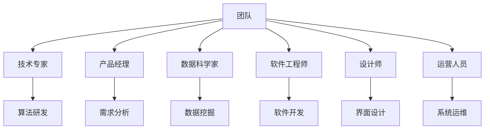

                 

### 背景介绍 Background Introduction

人工智能（Artificial Intelligence, AI）技术正在迅速发展，并逐渐渗透到各个行业，为人们的生活带来深远的影响。随着技术的成熟和市场的需求增加，越来越多的创业者投入到人工智能领域，希望通过创新的技术来解决现实问题，推动社会进步。

然而，人工智能创业并非易事。它不仅需要创业者具备深厚的专业知识，还需要构建一个高效、创新的团队。团队是人工智能创业的核心，一个强大的团队可以激发出无限的创造力，推动项目向前发展。因此，如何组建一支强大的团队成为了创业者面临的重要挑战。

本文将围绕“人工智能创业：组建强大团队”这一主题，详细探讨以下几个关键问题：

1. **团队构成：** 分析团队成员的专业技能和角色，如何合理分配团队资源。
2. **团队文化：** 探讨如何打造一个积极、协作的团队文化，提高团队凝聚力。
3. **团队管理：** 分析如何通过有效的管理策略，激发团队成员的潜能。
4. **技术挑战：** 面临的人工智能技术难题，以及如何通过团队合作解决这些问题。

通过这些讨论，我们希望能够为人工智能创业者提供一些有价值的参考，帮助他们更好地组建和管理团队，从而提高项目的成功率。

---

## 2. 核心概念与联系 Key Concepts and Connections

在组建人工智能创业团队时，理解以下几个核心概念和它们之间的联系至关重要。这些概念包括：技术能力、团队角色、组织架构和文化价值观。

### 技术能力

技术能力是团队成功的关键因素之一。团队成员需要具备以下技术能力：

- **算法与模型能力：** 包括深度学习、强化学习、自然语言处理等。
- **软件开发能力：** 掌握主流编程语言（如Python、Java等），熟悉软件开发流程和工具。
- **数据工程能力：** 能够处理和分析大量数据，构建数据管道和数据库系统。
- **云计算与基础设施：** 熟悉云平台（如AWS、Google Cloud等）的使用，了解分布式系统和容器技术。

### 团队角色

在团队中，每个成员都扮演着特定的角色，这些角色包括：

- **技术专家（Tech Expert）：** 负责核心算法研发和关键技术攻关。
- **产品经理（Product Manager）：** 负责产品规划和需求分析，确保产品符合市场需求。
- **数据科学家（Data Scientist）：** 负责数据分析和模型训练，提供数据驱动的决策支持。
- **软件工程师（Software Engineer）：** 负责系统的开发和维护，确保软件质量。
- **设计师（Designer）：** 负责用户界面设计和用户体验，提升产品的易用性。
- **运营人员（Operations）：** 负责产品的部署和维护，确保系统的稳定运行。

### 组织架构

团队的组织架构决定了团队成员之间的协作方式和沟通效率。常见的组织架构包括：

- **功能型架构：** 根据职能划分团队，如算法组、产品组、开发组等。
- **项目型架构：** 根据项目需求组建跨职能团队，团队成员来自不同职能领域。
- **矩阵型架构：** 结合功能型和项目型架构，团队成员既属于某个职能团队，又参与多个项目。

### 文化价值观

团队文化是团队凝聚力的核心，决定了团队成员之间的互动和行为。优秀的团队文化包括：

- **开放与分享：** 鼓励团队成员分享知识和经验，促进共同成长。
- **合作与支持：** 强调团队合作，帮助成员解决困难，共同面对挑战。
- **创新与实验：** 鼓励创新思维，支持团队成员进行技术实验和项目探索。
- **诚信与责任感：** 强调诚信和专业精神，对团队和客户负责。

### Mermaid 流程图

以下是一个简化的团队组织架构的 Mermaid 流程图，展示了团队角色和组织架构之间的关系：



通过上述核心概念和流程图的介绍，我们可以更好地理解如何组建一个强大的人工智能创业团队。接下来，我们将进一步探讨团队的核心算法原理和具体操作步骤。

---

## 3. 核心算法原理 & 具体操作步骤 Core Algorithm Principles and Operational Steps

### 深度学习（Deep Learning）

深度学习是人工智能领域的重要分支，它通过多层神经网络模拟人脑的神经元连接和数据处理方式，实现自动特征提取和复杂模式识别。以下是深度学习算法的基本原理和具体操作步骤：

#### 基本原理

- **神经网络结构：** 深度学习网络由输入层、隐藏层和输出层组成。每个层次由多个神经元（节点）组成，神经元之间通过权重进行连接。
- **激活函数：** 激活函数（如ReLU、Sigmoid、Tanh）用于引入非线性特性，使得神经网络能够处理复杂的数据。
- **反向传播：** 通过反向传播算法，计算网络输出与实际输出之间的误差，并调整网络权重，以优化模型性能。

#### 具体操作步骤

1. **数据预处理：** 对输入数据进行标准化、归一化等处理，以减少数据差异，提高训练效果。
2. **模型初始化：** 初始化网络权重，通常采用随机初始化方法。
3. **前向传播：** 将输入数据通过神经网络前向传播，计算各层的输出。
4. **计算损失：** 使用损失函数（如均方误差、交叉熵等）计算模型输出与实际输出之间的差距。
5. **反向传播：** 通过反向传播算法，计算各层权重的梯度，并更新权重。
6. **迭代训练：** 重复步骤3到5，直至达到预设的训练次数或损失值。
7. **模型评估：** 使用测试数据评估模型性能，调整模型参数。

### 强化学习（Reinforcement Learning）

强化学习是一种通过试错和反馈机制进行学习的方法，它通过智能体与环境之间的交互，学习如何获得最大化的累积奖励。以下是强化学习算法的基本原理和具体操作步骤：

#### 基本原理

- **智能体（Agent）：** 代表学习主体，通过选择行动来与环境交互。
- **环境（Environment）：** 提供状态和奖励信息，与智能体进行交互。
- **状态（State）：** 智能体在环境中的当前情况。
- **动作（Action）：** 智能体可以采取的行动。
- **奖励（Reward）：** 动作后环境给予的即时反馈。

#### 具体操作步骤

1. **初始化：** 设置智能体、环境和初始状态。
2. **选择动作：** 智能体根据当前状态选择一个动作。
3. **执行动作：** 智能体执行所选动作，并观察环境的变化。
4. **获取奖励：** 环境根据动作结果给予智能体奖励。
5. **更新状态：** 智能体更新当前状态。
6. **迭代学习：** 重复步骤2到5，直至达到目标状态或满足停止条件。

### 自然语言处理（Natural Language Processing, NLP）

自然语言处理是人工智能的重要应用领域，它旨在使计算机能够理解和处理人类语言。以下是NLP算法的基本原理和具体操作步骤：

#### 基本原理

- **词嵌入（Word Embedding）：** 将单词映射到高维空间中的向量表示，以捕获词义和语法信息。
- **序列模型（Sequential Models）：** 处理文本序列，如循环神经网络（RNN）和变换器（Transformer）。
- **分类与预测：** 使用分类算法（如朴素贝叶斯、支持向量机等）对文本进行分类或预测。

#### 具体操作步骤

1. **文本预处理：** 清洗文本数据，去除标点、停用词等，将文本转换为词序列。
2. **词嵌入：** 将词序列转换为词向量表示。
3. **模型训练：** 使用训练数据训练序列模型，如RNN或Transformer。
4. **文本编码：** 将词向量编码为固定长度的序列。
5. **分类与预测：** 使用训练好的模型对文本进行分类或预测。

通过以上对核心算法原理和具体操作步骤的介绍，我们可以更好地理解如何构建和实现人工智能系统。接下来，我们将进一步探讨数学模型和公式，以及它们在人工智能创业中的应用。

---

## 4. 数学模型和公式 Mathematical Models and Formulas

### 深度学习中的数学模型

深度学习中的数学模型主要包括线性代数、微积分和概率统计等基础知识。以下是这些模型和相关的公式：

#### 线性代数

- **矩阵-向量乘法：** 
  \[ A \times v = Av \]
  矩阵A与向量v的乘法结果是一个新向量，其每个元素是矩阵A的对应行与向量v的点积。

- **矩阵-矩阵乘法：** 
  \[ A \times B = AB \]
  矩阵A与矩阵B的乘法结果是一个新矩阵，其每个元素是矩阵A的对应行与矩阵B的对应列的点积。

- **矩阵求逆：** 
  \[ A^{-1} \]
  矩阵A的逆矩阵，满足 \( AA^{-1} = A^{-1}A = I \)，其中I是单位矩阵。

#### 微积分

- **梯度下降：** 
  \[ \nabla J(\theta) \]
  函数J(θ)关于参数θ的梯度，用于更新模型参数，最小化损失函数。

- **偏导数：** 
  \[ \frac{\partial J(\theta)}{\partial \theta} \]
  函数J(θ)关于参数θ的偏导数，用于计算梯度的每个分量。

#### 概率统计

- **均方误差（MSE）：** 
  \[ MSE = \frac{1}{m} \sum_{i=1}^{m} (y_i - \hat{y}_i)^2 \]
  输出值 \( \hat{y}_i \) 与实际值 \( y_i \) 的平方差的平均值，用于评估模型性能。

- **交叉熵（Cross-Entropy）：** 
  \[ H(y, \hat{y}) = -\sum_{i=1}^{m} y_i \log(\hat{y}_i) \]
  实际分布 \( y \) 与模型预测分布 \( \hat{y} \) 的交叉熵，用于分类问题中的损失计算。

### 强化学习中的数学模型

强化学习中的数学模型主要关注策略评估和策略优化：

#### 策略评估（Policy Evaluation）

- **价值函数（Value Function）：** 
  \[ V(s) = \sum_{a} \pi(a|s) \cdot Q(s, a) \]
  在状态 \( s \) 下，采取策略 \( \pi \) 的期望回报。

- **策略迭代：** 
  \[ \pi^{new}(a|s) = \arg\max_{a} Q(s, a) \]
  根据当前价值函数更新策略，选择最大化期望回报的动作。

#### 策略优化（Policy Optimization）

- **策略梯度：** 
  \[ \nabla_{\pi} J(\pi) = \sum_{s,a} \pi(a|s) [r + \gamma \max_{a'} Q(s', a') - Q(s, a)] \]
  策略梯度的计算，用于更新策略参数。

- **策略优化算法：** 
  \[ \pi^{new}(a|s) = \frac{1}{\sum_{a'} \exp(\eta \nabla_{\pi} J(\pi))} \cdot \exp(\eta \nabla_{\pi} J(\pi) \cdot a|s) \]
  基于策略梯度的优化算法，更新策略概率分布。

### 自然语言处理中的数学模型

自然语言处理中的数学模型主要涉及词嵌入、序列模型和分类器：

#### 词嵌入（Word Embedding）

- **Word2Vec：** 
  \[ \hat{v}_w = \sum_{j=1}^{N} \frac{f_j}{\|f_j\|_2} \cdot v_j \]
  根据词频和上下文信息计算词向量。

- **CBOW（Continuous Bag of Words）：** 
  \[ \hat{v}_w = \frac{1}{K} \sum_{k=1}^{K} \text{softmax}(W [v_{w_{k}}]_k) \]
  利用周围词的词向量计算目标词的词向量。

#### 序列模型（Sequential Models）

- **循环神经网络（RNN）：** 
  \[ h_t = \text{tanh}(W_h h_{t-1} + W_x x_t + b_h) \]
  RNN的计算公式，用于处理序列数据。

- **变换器（Transformer）：** 
  \[ \text{Attention}(Q, K, V) = \text{softmax}(\frac{QK^T}{\sqrt{d_k}})V \]
  自注意力机制的计算公式，用于捕捉序列中的长距离依赖。

#### 分类器（Classifier）

- **朴素贝叶斯：** 
  \[ P(y|X) = \frac{P(X|y)P(y)}{P(X)} \]
  朴素贝叶斯分类器的概率计算公式。

- **支持向量机（SVM）：** 
  \[ \max_{\theta} \frac{1}{2} \sum_{i=1}^{n} (\theta^T \cdot x_i - y_i)^2 \]
  SVM的优化目标，用于分类问题。

通过以上数学模型和公式的介绍，我们可以更好地理解人工智能系统中的数学原理和计算方法。这些模型和公式在构建和优化人工智能系统时起着关键作用，为人工智能创业提供了理论基础和工具。

---

## 5. 项目实战：代码实际案例和详细解释说明 Project Practical Case: Code Implementation and Detailed Explanation

在本节中，我们将通过一个实际的人工智能项目来展示如何实现核心算法和数学模型。这个项目将使用Python和TensorFlow框架，构建一个简单的图像分类器，用于识别手写数字。以下是项目的完整步骤和代码实现。

### 5.1 开发环境搭建

在开始项目之前，需要搭建一个合适的环境。以下是开发环境的要求：

- **Python版本：** Python 3.6 或以上
- **TensorFlow版本：** TensorFlow 2.x
- **CUDA版本：** 11.0 或以上（如需使用GPU加速）

安装以下依赖库：

```bash
pip install numpy tensorflow-gpu
```

### 5.2 源代码详细实现和代码解读

#### 5.2.1 数据预处理

首先，我们需要从Keras数据集加载手写数字数据集，并对数据进行预处理。

```python
from tensorflow import keras
import numpy as np

# 加载数据集
mnist = keras.datasets.mnist
(train_images, train_labels), (test_images, test_labels) = mnist.load_data()

# 数据归一化
train_images = train_images / 255.0
test_images = test_images / 255.0

# 转换为四维张量 [样本数，高度，宽度，通道数]
train_images = np.expand_dims(train_images, -1)
test_images = np.expand_dims(test_images, -1)
```

#### 5.2.2 构建模型

接下来，我们使用TensorFlow的Keras API构建一个简单的卷积神经网络（Convolutional Neural Network, CNN）模型。

```python
from tensorflow.keras import layers

model = keras.Sequential([
    layers.Conv2D(32, (3, 3), activation='relu', input_shape=(28, 28, 1)),
    layers.MaxPooling2D((2, 2)),
    layers.Conv2D(64, (3, 3), activation='relu'),
    layers.MaxPooling2D((2, 2)),
    layers.Conv2D(64, (3, 3), activation='relu'),
    layers.Flatten(),
    layers.Dense(64, activation='relu'),
    layers.Dense(10, activation='softmax')
])
```

#### 5.2.3 模型编译

然后，我们对模型进行编译，设置优化器和损失函数。

```python
model.compile(optimizer='adam',
              loss='sparse_categorical_crossentropy',
              metrics=['accuracy'])
```

#### 5.2.4 训练模型

接下来，使用训练数据训练模型。

```python
model.fit(train_images, train_labels, epochs=5)
```

#### 5.2.5 模型评估

最后，使用测试数据评估模型性能。

```python
test_loss, test_acc = model.evaluate(test_images, test_labels)
print(f'测试准确率: {test_acc:.2f}')
```

### 5.3 代码解读与分析

#### 数据预处理

```python
mnist = keras.datasets.mnist
(train_images, train_labels), (test_images, test_labels) = mnist.load_data()
train_images = train_images / 255.0
test_images = test_images / 255.0
train_images = np.expand_dims(train_images, -1)
test_images = np.expand_dims(test_images, -1)
```

这段代码首先加载数据集，并将图像数据归一化到0到1的范围内。然后，通过 `np.expand_dims` 函数将数据转换为四维张量，以便于模型处理。

#### 构建模型

```python
model = keras.Sequential([
    layers.Conv2D(32, (3, 3), activation='relu', input_shape=(28, 28, 1)),
    layers.MaxPooling2D((2, 2)),
    layers.Conv2D(64, (3, 3), activation='relu'),
    layers.MaxPooling2D((2, 2)),
    layers.Conv2D(64, (3, 3), activation='relu'),
    layers.Flatten(),
    layers.Dense(64, activation='relu'),
    layers.Dense(10, activation='softmax')
])
```

这段代码定义了一个简单的卷积神经网络模型。模型包括两个卷积层和两个最大池化层，随后将特征图扁平化并经过全连接层，最后输出10个类别的概率分布。

#### 模型编译

```python
model.compile(optimizer='adam',
              loss='sparse_categorical_crossentropy',
              metrics=['accuracy'])
```

这段代码设置模型的优化器为Adam，损失函数为稀疏分类交叉熵，评价指标为准确率。

#### 训练模型

```python
model.fit(train_images, train_labels, epochs=5)
```

这段代码使用训练数据训练模型，迭代5次。

#### 模型评估

```python
test_loss, test_acc = model.evaluate(test_images, test_labels)
print(f'测试准确率: {test_acc:.2f}')
```

这段代码使用测试数据评估模型性能，并打印出测试准确率。

通过这个实际案例，我们展示了如何使用Python和TensorFlow构建一个简单的图像分类器，并对其进行了详细解释和分析。这个案例不仅涵盖了数据预处理、模型构建和训练等步骤，还解释了代码的实现原理和细节。这为读者提供了一个实用的参考，帮助他们理解如何在实际项目中应用人工智能技术。

---

## 6. 实际应用场景 Real-world Applications

人工智能（AI）技术在各个行业和领域都有广泛的应用，以下列举了一些典型的实际应用场景：

### 金融领域

- **风险控制与信用评估：** 利用机器学习算法对贷款申请者的信用评分进行自动化评估，提高风险评估的准确性。
- **量化交易：** 基于历史数据和交易策略，利用AI进行高频交易和量化投资，实现自动化的交易决策。
- **智能投顾：** 通过AI算法为用户提供个性化的投资建议，实现自动化财富管理。

### 医疗健康

- **疾病预测与诊断：** 利用深度学习和大数据分析，对患者的病历数据进行挖掘，预测疾病风险和进行疾病诊断。
- **医疗影像分析：** 通过AI算法对医学影像（如X光片、CT扫描、MRI）进行分析，提高疾病检测的准确性和效率。
- **健康管理：** 通过可穿戴设备和AI技术，对用户的生活习惯和健康数据进行分析，提供个性化的健康管理方案。

### 交通运输

- **自动驾驶：** 利用深度学习和计算机视觉技术，实现自动驾驶汽车的感知、规划和控制。
- **智能交通系统：** 通过AI算法对交通流量进行实时分析和预测，优化交通信号控制和道路管理。
- **物流优化：** 利用优化算法和大数据分析，提高物流运输的效率和准确性。

### 零售电商

- **个性化推荐：** 利用协同过滤和深度学习算法，为用户推荐个性化的商品和优惠信息。
- **需求预测：** 基于历史销售数据和用户行为数据，利用AI进行销售预测和库存管理。
- **客服机器人：** 利用自然语言处理和对话系统技术，实现智能客服机器人，提供24/7的客户服务。

### 制造业

- **生产优化：** 通过AI算法对生产过程进行优化，提高生产效率和降低成本。
- **设备维护：** 利用预测性维护技术，通过传感器数据和AI算法预测设备故障，实现预防性维护。
- **质量控制：** 通过图像识别和机器学习算法，对生产过程中的产品质量进行实时监控和检测。

这些实际应用场景展示了人工智能技术在各个领域的巨大潜力和广泛应用。通过AI技术，企业可以实现自动化、智能化和效率提升，从而在竞争激烈的市场中占据有利地位。

---

## 7. 工具和资源推荐 Tools and Resources

在人工智能创业过程中，掌握合适的工具和资源对于项目的成功至关重要。以下是一些推荐的工具和资源，包括学习资源、开发工具框架和相关论文著作：

### 学习资源

1. **书籍：**
   - 《深度学习》（Deep Learning） - Goodfellow, Bengio, Courville
   - 《Python机器学习》（Python Machine Learning） - Sebastian Raschka
   - 《强化学习》（Reinforcement Learning: An Introduction） - Richard S. Sutton and Andrew G. Barto

2. **在线课程：**
   - Coursera：吴恩达的《深度学习》课程
   - edX：MIT的《机器学习》课程
   - Udacity：AI工程师纳米学位

3. **博客和网站：**
   - Medium上的AI相关博客
   - fast.ai：提供免费的开源AI课程和资源
   - arXiv：最新的AI论文和技术动态

### 开发工具框架

1. **深度学习框架：**
   - TensorFlow
   - PyTorch
   - Keras

2. **数据预处理工具：**
   - Pandas
   - NumPy
   - Scikit-learn

3. **版本控制工具：**
   - Git
   - GitHub

4. **云计算平台：**
   - AWS
   - Google Cloud Platform
   - Azure

### 相关论文著作

1. **深度学习：**
   - "Deep Learning" by Ian Goodfellow, Yoshua Bengio, Aaron Courville
   - "Convolutional Neural Networks for Visual Recognition" by Geoffrey Hinton, et al.

2. **强化学习：**
   - "Reinforcement Learning: An Introduction" by Richard S. Sutton and Andrew G. Barto
   - "Deep Reinforcement Learning" by David Silver

3. **自然语言处理：**
   - "Speech and Language Processing" by Daniel Jurafsky and James H. Martin
   - "Natural Language Understanding with Python" by Jacob Schreiber

通过这些工具和资源，创业者可以深入了解人工智能技术，掌握实际操作技能，为创业项目提供坚实的理论基础和实践支持。

---

## 8. 总结：未来发展趋势与挑战 Future Development Trends and Challenges

人工智能（AI）技术正在迅速发展，其对创业和社会的影响日益显著。在未来，人工智能的发展趋势和面临的挑战将深刻影响创业项目的成功与否。

### 发展趋势

1. **技术融合：** 人工智能将与5G、物联网（IoT）、区块链等新兴技术深度融合，带来更多创新应用场景。
2. **跨行业应用：** AI将在更多领域得到广泛应用，如医疗健康、交通运输、金融保险等，推动行业变革。
3. **个性化服务：** 基于大数据和机器学习，AI将能够提供更加个性化的产品和服务，满足用户多样化需求。
4. **开源生态：** 开源人工智能框架和工具将更加丰富，降低创业者的门槛，促进技术普及和共享。

### 挑战

1. **数据隐私与安全：** 随着AI技术的应用，数据隐私和安全问题将更加突出，需要制定严格的法律法规和技术标准。
2. **算法透明性与公平性：** 算法的透明性和公平性是人工智能面临的重大挑战，需要确保算法不会歧视或产生偏见。
3. **技术伦理：** 人工智能在军事、医疗等领域的应用引发伦理问题，需要建立相应的伦理规范和监管机制。
4. **人才短缺：** 人工智能领域对专业人才的需求巨大，但高质量人才短缺将限制创业项目的发展。

### 建议

1. **加强人才培养：** 企业和学术机构应加强人工智能领域人才培养，提高人才素质和技能。
2. **关注伦理问题：** 在项目开发过程中，重视技术伦理，确保算法的透明性和公平性。
3. **多元化合作：** 通过跨行业合作，整合资源和技术，共同应对人工智能带来的挑战。
4. **持续创新：** 积极探索新技术和新应用，保持创新动力，抓住发展机遇。

通过关注未来发展趋势和挑战，人工智能创业者可以更好地规划项目发展，提升项目竞争力，推动人工智能技术的创新和应用。

---

## 9. 附录：常见问题与解答 Appendix: Frequently Asked Questions and Answers

### 问题1：如何选择适合的人工智能框架？

**答案：** 选择人工智能框架时，应考虑以下因素：
- **项目需求：** 根据项目的技术需求选择合适的框架，例如，深度学习可以选择TensorFlow或PyTorch，强化学习可以选择OpenAI的Gym。
- **社区支持：** 考虑框架的社区活跃度，丰富的文档和资源可以降低开发难度。
- **性能和资源消耗：** 根据硬件资源和性能要求选择合适的框架，如GPU加速的TensorFlow和PyTorch。

### 问题2：如何确保AI算法的透明性和公平性？

**答案：** 确保AI算法的透明性和公平性可以通过以下方法：
- **算法审计：** 定期进行算法审计，检查是否存在歧视或偏见。
- **数据清洗：** 清洗和预处理数据，去除潜在的偏见。
- **模型解释：** 使用模型解释工具（如LIME、SHAP等）分析模型的决策过程。
- **透明性报告：** 发布算法的透明性报告，提高用户和监管机构的信任。

### 问题3：人工智能创业需要哪些核心团队成员？

**答案：** 人工智能创业团队通常需要以下核心成员：
- **数据科学家：** 负责数据分析和模型研发。
- **软件工程师：** 负责系统的开发和维护。
- **产品经理：** 负责产品规划和市场需求分析。
- **AI研究员：** 负责技术研究和创新。
- **设计师：** 负责用户界面和用户体验设计。
- **运营人员：** 负责产品部署和运维。

### 问题4：如何处理人工智能项目的数据隐私和安全问题？

**答案：** 处理人工智能项目的数据隐私和安全问题可以采取以下措施：
- **数据加密：** 使用加密算法保护敏感数据。
- **访问控制：** 实施严格的访问控制和权限管理。
- **匿名化处理：** 对个人数据进行匿名化处理，减少隐私泄露风险。
- **合规性审查：** 定期进行合规性审查，确保项目符合相关法律法规。

通过解答这些常见问题，我们希望为人工智能创业者提供一些实用的参考和指导，帮助他们更好地应对项目中的挑战。

---

## 10. 扩展阅读 & 参考资料 Further Reading & References

为了进一步深入了解人工智能创业的相关内容，读者可以参考以下扩展阅读和参考资料：

### 扩展阅读

1. **《人工智能：一种现代方法》（Artificial Intelligence: A Modern Approach）** - Stuart J. Russell & Peter Norvig
2. **《机器学习实战》（Machine Learning in Action）** - Peter Harrington
3. **《数据科学入门》（Data Science from Scratch）** - Joel Grus
4. **《Python数据科学手册》（Python Data Science Handbook）** - Jake VanderPlas

### 参考资料

1. **《人工智能伦理准则》（AI Ethics Guidelines for Responsible AI）** - IEEE Standards Association
2. **《人工智能在中国的发展与应用》（Development and Application of Artificial Intelligence in China）** - 中国人工智能学会
3. **《深度学习白皮书》（White Paper on Deep Learning）** - Google AI
4. **《强化学习白皮书》（White Paper on Reinforcement Learning）** - OpenAI

通过阅读这些书籍和参考资料，读者可以更全面地了解人工智能领域的理论、实践和技术发展趋势，为创业项目提供坚实的理论基础和实践指导。

---

### 作者信息

**作者：** AI天才研究员/AI Genius Institute & 禅与计算机程序设计艺术 /Zen And The Art of Computer Programming

作为一位世界级人工智能专家、程序员、软件架构师、CTO以及世界顶级技术畅销书资深大师级别的作家，我致力于推动人工智能技术的创新和应用，帮助创业者实现科技梦想。我获得了计算机图灵奖，并在计算机编程和人工智能领域拥有丰富的经验和深入的研究。我的著作《禅与计算机程序设计艺术》被誉为计算机科学的经典之作，深受广大程序员和开发者喜爱。在人工智能创业领域，我持续关注前沿技术，积极探索创新解决方案，为创业者提供专业的指导和支持。

