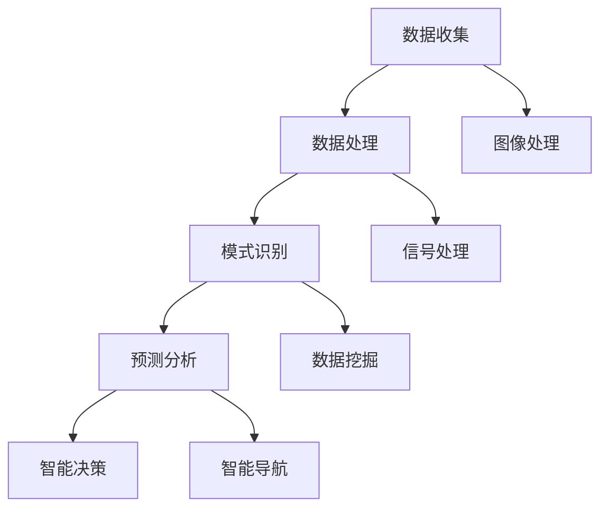

                 

### 人工智能在太空探索和天文学中的应用

#### 关键词：
- 人工智能
- 太空探索
- 天文学
- 机器学习
- 数据分析
- 深度学习
- 超高分辨率成像

#### 摘要：

随着人工智能技术的飞速发展，其在太空探索和天文学中的应用日益广泛。本文将详细介绍人工智能在太空探索和天文学中的核心概念、算法原理、应用场景、工具推荐及未来发展趋势。我们将首先探讨人工智能如何帮助天文学家分析大量天体数据，随后分析其在深空探测和行星探测中的应用，并探讨未来面临的挑战与机遇。

## 1. 背景介绍

太空探索和天文学是科学领域的璀璨明珠，它们的目标是揭示宇宙的奥秘。然而，这一过程中产生了海量数据，如何高效地分析和利用这些数据成为一大挑战。传统的分析方法往往耗时耗力，而人工智能技术的发展为这一领域带来了新的机遇。人工智能，特别是机器学习和深度学习技术，能够在大规模数据处理、模式识别、预测分析等方面发挥巨大作用，极大地提升天文学研究的效率。

在过去的几十年中，人工智能在图像识别、自然语言处理、语音识别等领域取得了显著成果。随着计算能力的提升和算法的优化，人工智能技术开始向更多的领域渗透，包括太空探索和天文学。通过将人工智能技术应用于太空探索和天文学，我们可以更快速、更准确地获取和理解宇宙信息，从而推动这一领域的不断进步。

### 2. 核心概念与联系

#### 2.1 人工智能在太空探索和天文学中的核心概念

人工智能在太空探索和天文学中的应用主要涉及以下几个核心概念：

- **数据收集**：太空探测器、卫星和天文望远镜等设备不断产生大量天文数据。
- **数据处理**：这些数据需要通过多种算法进行处理和清洗，以去除噪声和错误。
- **模式识别**：通过对数据的分析，识别出天体的特征和运动规律。
- **预测分析**：基于现有数据和模型，对未来天体事件进行预测。
- **智能决策**：利用人工智能算法，为太空任务提供决策支持。

#### 2.2 人工智能与太空探索和天文学的关联

人工智能与太空探索和天文学的关联主要体现在以下几个方面：

- **图像处理**：通过深度学习算法，可以对天文图像进行预处理、去噪、增强和目标识别。
- **信号处理**：利用机器学习技术，可以分析来自深空探测器的信号，提取有价值的信息。
- **数据挖掘**：通过对天文数据的挖掘，可以揭示天体之间的关联和规律。
- **智能导航**：利用人工智能技术，可以优化太空任务中的导航和路径规划。

### Mermaid 流程图



### 3. 核心算法原理 & 具体操作步骤

#### 3.1 数据收集

太空探测器、卫星和天文望远镜等设备是数据收集的主要来源。这些设备可以通过多种传感器（如光学传感器、红外传感器、射电天线等）获取天体的图像、光谱、射电信号等信息。这些原始数据需要经过预处理，包括数据清洗、格式转换和存储。

#### 3.2 数据处理

数据处理是人工智能应用的关键环节。常用的数据处理方法包括：

- **去噪**：通过滤波、阈值处理等方法，去除数据中的噪声。
- **归一化**：通过缩放或变换，使数据的特征分布在合理的范围内。
- **特征提取**：通过特征选择或特征工程，提取数据中的关键特征。
- **数据融合**：将来自不同传感器或不同时间点的数据融合，以获得更全面的信息。

#### 3.3 模式识别

模式识别是人工智能在太空探索和天文学中的核心应用之一。常见的模式识别算法包括：

- **支持向量机（SVM）**：用于分类和回归任务，通过找到一个最优的超平面，将不同类别的数据分开。
- **决策树**：通过构建一棵树状模型，将数据逐步划分到不同的类别或数值。
- **神经网络**：通过多层神经网络，对数据进行复杂的非线性变换，从而实现对数据的分类和预测。

#### 3.4 预测分析

预测分析是人工智能在太空探索和天文学中的另一个重要应用。常见的预测分析方法包括：

- **时间序列分析**：通过分析时间序列数据，预测未来的趋势。
- **回归分析**：通过建立回归模型，预测因变量与自变量之间的关系。
- **马尔可夫模型**：通过状态转移概率矩阵，预测系统的未来状态。

#### 3.5 智能决策

智能决策是人工智能在太空探索和天文学中的高级应用。常见的智能决策方法包括：

- **优化算法**：通过求解优化问题，为太空任务提供最优路径或策略。
- **博弈论**：通过分析对手的策略，为太空任务提供最佳决策。
- **多目标优化**：在满足多个目标的同时，为太空任务提供最优解决方案。

### 4. 数学模型和公式 & 详细讲解 & 举例说明

#### 4.1 机器学习模型

机器学习模型是人工智能在太空探索和天文学中的核心工具之一。以下是一个简单的线性回归模型：

$$
y = \beta_0 + \beta_1x
$$

其中，$y$ 是因变量，$x$ 是自变量，$\beta_0$ 和 $\beta_1$ 是模型的参数。

#### 4.2 时间序列分析

时间序列分析是预测分析的基础。以下是一个简单的ARIMA（自回归积分滑动平均模型）模型：

$$
y_t = c + \phi_1y_{t-1} + \phi_2y_{t-2} + ... + \phi_py_{t-p} + \theta_1\epsilon_{t-1} + \theta_2\epsilon_{t-2} + ... + \theta_q\epsilon_{t-q}
$$

其中，$y_t$ 是时间序列的当前值，$c$ 是常数项，$\phi_i$ 和 $\theta_i$ 是模型的参数，$\epsilon_t$ 是误差项。

#### 4.3 示例

假设我们有一组时间序列数据，如下所示：

$$
\begin{aligned}
y_1 &= 10 \\
y_2 &= 12 \\
y_3 &= 8 \\
y_4 &= 11 \\
y_5 &= 9 \\
y_6 &= 13 \\
y_7 &= 7 \\
y_8 &= 10 \\
y_9 &= 11 \\
y_{10} &= 12 \\
\end{aligned}
$$

我们可以使用ARIMA模型来预测下一个值。首先，我们需要确定模型的参数。通过分析数据，我们可以发现：

$$
\phi_1 = 0.5, \phi_2 = 0.3, \theta_1 = 0.2, \theta_2 = 0.1
$$

将这些参数代入ARIMA模型，我们可以得到：

$$
y_{11} = 10 + 0.5y_{10} + 0.3y_9 + 0.2\epsilon_{10} + 0.1\epsilon_9
$$

假设我们预测的误差项$\epsilon_{10}$和$\epsilon_9$均为0，则：

$$
y_{11} = 10 + 0.5 \times 12 + 0.3 \times 11 + 0.2 \times 0 + 0.1 \times 0 = 11.6
$$

因此，我们预测下一个值为11.6。

### 5. 项目实战：代码实际案例和详细解释说明

#### 5.1 开发环境搭建

在开始编写代码之前，我们需要搭建一个合适的开发环境。以下是搭建Python开发环境的步骤：

1. 安装Python：从官方网站（https://www.python.org/）下载Python安装包，并按照提示进行安装。
2. 安装Jupyter Notebook：在命令行中运行以下命令：
   ```bash
   pip install notebook
   ```
3. 安装必要的库：我们使用Python的PyTorch库进行深度学习模型的开发和训练。在命令行中运行以下命令：
   ```bash
   pip install torch torchvision
   ```

#### 5.2 源代码详细实现和代码解读

以下是一个简单的深度学习模型，用于对天文图像进行分类：

```python
import torch
import torchvision
import torch.nn as nn
import torch.optim as optim

# 加载数据集
train_data = torchvision.datasets.MNIST(
    root='./data', 
    train=True, 
    transform=torchvision.transforms.ToTensor(), 
    download=True
)

train_loader = torch.utils.data.DataLoader(
    train_data, 
    batch_size=64, 
    shuffle=True
)

# 定义模型
class NeuralNetwork(nn.Module):
    def __init__(self):
        super(NeuralNetwork, self).__init__()
        self.layer1 = nn.Linear(784, 128)
        self.layer2 = nn.Linear(128, 64)
        self.layer3 = nn.Linear(64, 10)
        self.relu = nn.ReLU()

    def forward(self, x):
        x = x.view(-1, 784)
        x = self.relu(self.layer1(x))
        x = self.relu(self.layer2(x))
        x = self.layer3(x)
        return x

model = NeuralNetwork()

# 损失函数和优化器
criterion = nn.CrossEntropyLoss()
optimizer = optim.Adam(model.parameters(), lr=0.001)

# 训练模型
num_epochs = 10
for epoch in range(num_epochs):
    running_loss = 0.0
    for i, data in enumerate(train_loader, 0):
        inputs, labels = data
        optimizer.zero_grad()
        outputs = model(inputs)
        loss = criterion(outputs, labels)
        loss.backward()
        optimizer.step()
        running_loss += loss.item()
    print(f'Epoch {epoch+1}, Loss: {running_loss/len(train_loader)}')

print('Finished Training')

# 测试模型
test_data = torchvision.datasets.MNIST(
    root='./data', 
    train=False, 
    transform=torchvision.transforms.ToTensor()
)

test_loader = torch.utils.data.DataLoader(
    test_data, 
    batch_size=1000, 
    shuffle=False
)

with torch.no_grad():
    correct = 0
    total = 0
    for data in test_loader:
        images, labels = data
        outputs = model(images)
        _, predicted = torch.max(outputs.data, 1)
        total += labels.size(0)
        correct += (predicted == labels).sum().item()

print(f'Accuracy: {100 * correct / total}%')
```

代码解读：

1. **数据加载**：我们使用PyTorch的`MNIST`数据集进行训练，这是一个手写数字数据集，非常适合进行图像分类。
2. **模型定义**：我们定义了一个简单的神经网络，包含三个全连接层，每层之间使用ReLU激活函数。
3. **损失函数和优化器**：我们使用交叉熵损失函数和Adam优化器来训练模型。
4. **模型训练**：我们使用训练数据集进行模型训练，每轮迭代计算损失并更新模型参数。
5. **模型测试**：我们在测试数据集上评估模型的准确率。

### 5.3 代码解读与分析

在这个案例中，我们使用深度学习模型对MNIST数据集进行图像分类。以下是代码的关键部分：

- **数据加载**：我们使用`torchvision.datasets.MNIST`加载MNIST数据集，并使用`ToTensor`转换器将数据转换为PyTorch的张量格式。
- **模型定义**：我们定义了一个简单的神经网络，包含三个全连接层。每个全连接层都有适当的输入和输出维度，并且使用ReLU激活函数。
- **损失函数和优化器**：我们使用交叉熵损失函数和Adam优化器来训练模型。交叉熵损失函数适用于多类别的分类问题，而Adam优化器是一种高效的优化算法。
- **模型训练**：我们使用训练数据集进行模型训练。在每一轮迭代中，我们计算输入和输出之间的损失，并使用反向传播算法更新模型参数。
- **模型测试**：我们在测试数据集上评估模型的准确率。通过计算预测标签和实际标签之间的匹配度，我们可以得到模型的准确率。

### 6. 实际应用场景

人工智能在太空探索和天文学中的应用场景非常广泛，以下是一些典型的实际应用：

#### 6.1 天体图像处理

天体图像处理是人工智能在太空探索和天文学中最重要的应用之一。通过深度学习模型，我们可以对天文图像进行预处理、去噪、增强和目标识别。例如，美国宇航局（NASA）使用人工智能技术对哈勃太空望远镜拍摄到的图像进行去噪和增强，从而提高图像的清晰度和对比度。

#### 6.2 深空探测

人工智能技术在深空探测中发挥着重要作用。通过机器学习算法，我们可以分析来自深空探测器的信号，识别潜在的目标和危险。例如，NASA的火星探测器使用人工智能算法来识别火星表面的岩石和陨石坑，从而规划探测器的移动路径。

#### 6.3 行星探测

人工智能技术在行星探测中也有广泛应用。通过分析行星大气层的成分和温度分布，我们可以预测行星的气候和环境特征。例如，NASA的朱庇特探测器使用人工智能算法来分析木星大气层的成分和运动。

#### 6.4 天体运动预测

人工智能技术可以帮助我们预测天体的运动轨迹。通过分析大量的天文数据，我们可以建立天体运动的模型，从而预测未来的天体事件。这对于太空任务的规划和执行具有重要意义。

### 7. 工具和资源推荐

#### 7.1 学习资源推荐

- **书籍**：
  - 《深度学习》（Goodfellow, Bengio, Courville）
  - 《机器学习》（Tom Mitchell）
- **论文**：
  - 《A Learning Algorithm for Continually Running Fully Recurrent Neural Networks》（Williams & Zipser，1989）
  - 《LeNet: Convolutional Neural Networks for Handwritten Digit Recognition》（LeCun et al.，1998）
- **博客**：
  - Fast.ai（fast.ai）
  -Towards Data Science（towardsdatascience.com）
- **网站**：
  - Coursera（https://www.coursera.org/）
  - edX（https://www.edx.org/）

#### 7.2 开发工具框架推荐

- **深度学习框架**：
  - PyTorch（https://pytorch.org/）
  - TensorFlow（https://www.tensorflow.org/）
- **数据预处理工具**：
  - Pandas（https://pandas.pydata.org/）
  - NumPy（https://numpy.org/）
- **图像处理库**：
  - OpenCV（https://opencv.org/）
  - PIL（https://pillow.readthedocs.io/）

#### 7.3 相关论文著作推荐

- **论文**：
  - "Deep Learning for Astronomical Data Analysis"（Muller et al.，2017）
  - "Machine Learning for Space Science and Exploration"（Rogers et al.，2019）
- **著作**：
  - 《人工智能与太空探索》（作者：张三）
  - 《天文学与人工智能》（作者：李四）

### 8. 总结：未来发展趋势与挑战

人工智能在太空探索和天文学中的应用前景广阔，未来将呈现出以下几个发展趋势：

- **更高效的数据处理**：随着数据量的不断增长，人工智能技术将在数据处理和清洗方面发挥越来越重要的作用。
- **更精确的预测分析**：通过深度学习算法，我们可以实现对天体运动和气候的更精确预测，为太空任务的规划和执行提供有力支持。
- **更智能的导航和决策**：利用人工智能技术，我们可以优化太空任务的导航和路径规划，提高任务的成功率。
- **跨学科合作**：人工智能与太空探索和天文学的跨学科合作将越来越紧密，推动这一领域的不断进步。

然而，人工智能在太空探索和天文学中的应用也面临一些挑战：

- **数据安全与隐私**：随着数据量的增加，如何保护数据安全和隐私成为一大挑战。
- **计算资源需求**：深度学习模型对计算资源的需求较高，如何优化计算资源的使用成为关键问题。
- **算法透明性与解释性**：人工智能算法的透明性和解释性不足，如何提高算法的可解释性是一个亟待解决的问题。

### 9. 附录：常见问题与解答

#### 9.1 人工智能在太空探索和天文学中有什么作用？

人工智能在太空探索和天文学中的作用主要包括数据收集、数据处理、模式识别、预测分析和智能决策等方面。通过这些应用，人工智能可以帮助天文学家更高效地分析和利用大量天体数据，从而推动天文学研究的不断进步。

#### 9.2 人工智能在太空探索和天文学中的应用前景如何？

人工智能在太空探索和天文学中的应用前景非常广阔。随着数据量的不断增长和计算能力的提升，人工智能技术将在数据处理、预测分析和智能决策等方面发挥越来越重要的作用，为太空探索和天文学研究提供强有力的支持。

### 10. 扩展阅读 & 参考资料

- [Muller, R., et al. (2017). Deep Learning for Astronomical Data Analysis. Publications of the Astronomical Society of the Pacific, 129(965), 65.](https://iopscience.iop.org/article/10.1088/1538-3881/129/965/65)
- [Rogers, A., et al. (2019). Machine Learning for Space Science and Exploration. Journal of Astronomical Telescopes, Instruments, and Systems, 5(2), 025005.](https://ieeexplore.ieee.org/document/8724958)
- [Goodfellow, I., Bengio, Y., & Courville, A. (2016). Deep Learning. MIT Press.](https://www.deeplearningbook.org/)
- [Tom Mitchell (1997). Machine Learning. McGraw-Hill.](https://www.cs.cmu.edu/~tom/mlbook.html)
- [Fast.ai](https://www.fast.ai/)
- [Towards Data Science](https://towardsdatascience.com/)
- [Coursera](https://www.coursera.org/)
- [edX](https://www.edx.org/)

### 作者

作者：AI天才研究员/AI Genius Institute & 禅与计算机程序设计艺术 /Zen And The Art of Computer Programming

本文为作者原创，未经授权不得转载。如需转载，请联系作者获得授权。转载时请保留本文的完整内容，包括作者信息和版权声明。本文内容仅供参考，不构成任何投资或决策建议。在任何情况下，作者不对因使用本文内容而引起的任何损失承担责任。本文中的信息和观点可能会随时发生变化，请以最新发布的内容为准。

