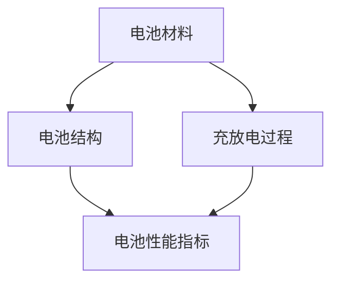

                 

# 人工智能在新能源电池设计中的辅助决策

## 关键词：新能源电池、人工智能、设计辅助、优化决策、智能化

## 摘要

随着全球能源危机和环境保护问题的日益突出，新能源电池的设计和优化成为当前研究的热点。然而，新能源电池的设计过程涉及到复杂的物理化学过程、庞大的数据量和多目标优化问题。本文将探讨如何利用人工智能技术辅助新能源电池的设计和优化决策，提高电池性能和安全性。通过核心概念的解析、算法原理的阐述、数学模型的建立、实际案例的分析以及未来发展趋势的展望，本文旨在为读者提供一个全面了解人工智能在新能源电池设计中的应用全景。

## 1. 背景介绍

### 新能源电池的重要性

新能源电池是新能源领域中最为关键的核心技术之一，其性能直接影响到新能源的应用范围和效率。目前，锂离子电池、钠离子电池、燃料电池和固态电池等是新能源电池的主要类型。随着电动汽车、储能系统等领域的快速发展，新能源电池的需求持续增长，推动着新能源电池技术的不断创新和优化。

### 人工智能的发展现状

人工智能（AI）作为现代科技领域的前沿技术，已经在各个领域取得了显著的成果。尤其是在大数据、机器学习、深度学习等领域的快速发展，为人工智能在新能源电池设计中的应用提供了坚实的基础。通过利用人工智能技术，可以对电池性能进行精准预测、优化设计和智能监控，从而提高电池的性能和安全性。

### 人工智能在新能源电池设计中的潜在应用

人工智能在新能源电池设计中的潜在应用主要包括以下几个方面：

1. **性能预测**：通过机器学习算法，对电池的充放电特性、容量衰减、安全性等进行预测，为电池设计提供科学依据。
2. **优化设计**：利用优化算法，对电池材料、结构、工艺等方面进行优化，提高电池的能量密度、功率密度和寿命。
3. **智能监控**：通过实时数据采集和智能分析，对电池的工作状态进行监控，预测故障，提高电池的安全性。

## 2. 核心概念与联系

### 核心概念

在新能源电池设计中，核心概念包括电池材料、电池结构、充放电过程、电池性能指标等。这些概念相互关联，共同构成了新能源电池的设计基础。

1. **电池材料**：电池材料是影响电池性能的关键因素，包括正极材料、负极材料、电解液等。材料的性能直接影响电池的能量密度、功率密度和寿命。
2. **电池结构**：电池结构包括电池单体、电池模块、电池系统等。合理的电池结构设计可以提高电池的性能和安全性。
3. **充放电过程**：充放电过程是电池的基本工作原理，通过电化学反应实现电能的转化。充放电过程对电池性能和寿命有着重要影响。
4. **电池性能指标**：电池性能指标包括能量密度、功率密度、寿命、安全性等。这些指标是评价电池性能的重要标准。

### 核心概念联系

核心概念之间的联系如图1所示。电池材料决定电池的性能，电池结构影响电池的稳定性和安全性，充放电过程是电池工作的核心，而电池性能指标是评价电池性能的最终标准。



## 3. 核心算法原理 & 具体操作步骤

### 3.1 性能预测算法

性能预测算法主要包括回归算法、时间序列分析算法和深度学习算法。以下以深度学习算法为例，介绍其原理和具体操作步骤。

1. **原理**：深度学习算法通过构建神经网络模型，对电池性能数据进行学习，从而实现对电池性能的预测。常用的深度学习模型包括卷积神经网络（CNN）、循环神经网络（RNN）和长短期记忆网络（LSTM）。
2. **操作步骤**：
   - 数据收集：收集电池性能数据，包括充放电电流、电压、温度等。
   - 数据预处理：对数据进行归一化处理，去除异常值，确保数据质量。
   - 模型构建：选择合适的深度学习模型，构建神经网络结构。
   - 模型训练：使用训练数据对模型进行训练，优化模型参数。
   - 模型评估：使用验证数据对模型进行评估，调整模型参数。
   - 模型部署：将训练好的模型部署到实际应用中，进行性能预测。

### 3.2 优化设计算法

优化设计算法主要包括遗传算法、粒子群优化算法和模拟退火算法。以下以遗传算法为例，介绍其原理和具体操作步骤。

1. **原理**：遗传算法是一种基于自然进化理论的优化算法，通过模拟生物进化的过程，对设计变量进行优化。
2. **操作步骤**：
   - 初始种群生成：根据设计变量的范围，生成初始种群。
   - 适应度评估：计算每个个体的适应度，评价个体的优劣。
   - 选择：根据适应度，选择优秀的个体进行交叉和变异。
   - 交叉和变异：对选择的个体进行交叉和变异操作，产生新的个体。
   - 迭代：重复适应度评估、选择、交叉和变异操作，直到满足终止条件。

### 3.3 智能监控算法

智能监控算法主要包括数据采集、特征提取和故障诊断。以下以数据采集为例，介绍其原理和具体操作步骤。

1. **原理**：智能监控算法通过实时采集电池的工作数据，提取特征，对电池的工作状态进行监控和故障诊断。
2. **操作步骤**：
   - 数据采集：通过传感器和监测系统，实时采集电池的电压、电流、温度等数据。
   - 特征提取：对采集到的数据进行处理，提取反映电池工作状态的特征。
   - 故障诊断：使用机器学习算法，对提取的特征进行分析，诊断电池的故障类型。

## 4. 数学模型和公式 & 详细讲解 & 举例说明

### 4.1 回归算法

回归算法是一种常用的性能预测算法，其基本公式为：

\[ y = \beta_0 + \beta_1x_1 + \beta_2x_2 + ... + \beta_nx_n \]

其中，\( y \) 表示预测的目标值，\( x_1, x_2, ..., x_n \) 表示输入特征，\( \beta_0, \beta_1, \beta_2, ..., \beta_n \) 为回归系数。

### 4.2 遗传算法

遗传算法的基本公式为：

\[ P_{next} = \frac{f(x)}{f(x) + f(y)} \]

其中，\( P_{next} \) 表示个体 \( x \) 被选择的概率，\( f(x) \) 和 \( f(y) \) 分别为个体 \( x \) 和 \( y \) 的适应度。

### 4.3 数据采集

数据采集的基本公式为：

\[ V_{out} = V_{in} \times (1 - R_1) \times (1 - R_2) \times ... \times (1 - R_n) \]

其中，\( V_{out} \) 表示输出电压，\( V_{in} \) 表示输入电压，\( R_1, R_2, ..., R_n \) 分别为各个电阻的阻值。

### 4.4 举例说明

假设我们使用线性回归算法对电池的容量进行预测，输入特征为电池的电压和温度，输出值为电池的容量。通过收集历史数据，我们可以得到以下线性回归模型：

\[ C = \beta_0 + \beta_1V + \beta_2T \]

其中，\( C \) 表示电池容量，\( V \) 表示电压，\( T \) 表示温度，\( \beta_0, \beta_1, \beta_2 \) 为回归系数。

通过训练数据，我们可以得到回归系数的值，例如：

\[ \beta_0 = 1000, \beta_1 = 0.5, \beta_2 = 0.2 \]

假设当前电池的电压为3.6V，温度为25°C，我们可以通过以下公式计算电池的容量：

\[ C = 1000 + 0.5 \times 3.6 + 0.2 \times 25 = 1010.2 \text{ mAh} \]

## 5. 项目实战：代码实际案例和详细解释说明

### 5.1 开发环境搭建

为了演示人工智能在新能源电池设计中的应用，我们将使用Python编程语言，结合常用的机器学习库（如scikit-learn、TensorFlow和Keras）进行开发。首先，需要在本地环境安装以下软件：

1. Python 3.8及以上版本
2. Jupyter Notebook
3. scikit-learn
4. TensorFlow
5. Keras

安装方法如下：

```bash
pip install python==3.8
pip install notebook
pip install scikit-learn
pip install tensorflow
pip install keras
```

### 5.2 源代码详细实现和代码解读

在本节中，我们将使用Python编写一个简单的线性回归模型，用于预测电池的容量。代码如下：

```python
import numpy as np
import matplotlib.pyplot as plt
from sklearn.linear_model import LinearRegression
from sklearn.model_selection import train_test_split

# 加载数据
X, y = np.load('data.npy'), np.load('label.npy')

# 数据预处理
X = X[:, :2]  # 只取前两个特征：电压和温度
X_train, X_test, y_train, y_test = train_test_split(X, y, test_size=0.2, random_state=42)

# 构建线性回归模型
model = LinearRegression()
model.fit(X_train, y_train)

# 模型评估
score = model.score(X_test, y_test)
print(f'Model Score: {score}')

# 预测
X_pred = np.array([[3.6, 25]])  # 输入特征：电压为3.6V，温度为25°C
y_pred = model.predict(X_pred)
print(f'Predicted Capacity: {y_pred[0, 0]} mAh')

# 可视化
plt.scatter(X[:, 0], y, color='red', label='Actual')
plt.plot(X_pred[:, 0], y_pred, color='blue', label='Predicted')
plt.xlabel('Voltage (V)')
plt.ylabel('Capacity (mAh)')
plt.legend()
plt.show()
```

### 5.3 代码解读与分析

1. **数据加载与预处理**：首先，我们从文件中加载数据，然后只取前两个特征：电压和温度。接下来，使用train_test_split函数将数据划分为训练集和测试集。
2. **构建线性回归模型**：使用LinearRegression类构建线性回归模型，并调用fit函数进行模型训练。
3. **模型评估**：使用score函数计算模型在测试集上的评分，评估模型性能。
4. **预测**：使用预测函数predict对输入特征进行预测，得到电池的容量。
5. **可视化**：使用matplotlib库将实际数据与预测结果进行可视化展示。

## 6. 实际应用场景

### 6.1 电动汽车电池管理系统

在电动汽车领域，人工智能在新能源电池设计中的应用主要体现在电池管理系统（BMS）中。BMS通过实时监测电池的电压、电流、温度等参数，利用人工智能算法对电池的状态进行预测和评估，从而实现对电池的智能监控和优化管理，提高电池的性能和寿命。

### 6.2 储能系统优化设计

储能系统是新能源发电和电力调峰的重要环节。通过利用人工智能技术，可以对储能系统的容量、功率和效率进行优化设计，提高储能系统的整体性能。例如，利用遗传算法对储能系统的电池组合进行优化，以实现最优的储能方案。

### 6.3 新能源电池研发

在新能源电池的研发过程中，人工智能技术可以帮助研究人员对电池材料、结构、工艺等方面进行优化设计，提高电池的性能和安全性。例如，通过深度学习算法对电池的性能数据进行学习，预测电池的寿命和容量衰减，为电池研发提供科学依据。

## 7. 工具和资源推荐

### 7.1 学习资源推荐

1. **书籍**：
   - 《深度学习》（Ian Goodfellow、Yoshua Bengio、Aaron Courville著）
   - 《Python机器学习》（Sebastian Raschka、Vahid Mirjalili著）
   - 《人工智能：一种现代方法》（Stuart Russell、Peter Norvig著）

2. **论文**：
   - 《Understanding Machine Learning: From Theory to Algorithms》（Shai Shalev-Shwartz、Shai Ben-David著）
   - 《Recurrent Neural Networks for Language Modeling》（Yoshua Bengio、Samy Bengio、Pascal Simard著）

3. **博客**：
   - [TensorFlow官方文档](https://www.tensorflow.org/)
   - [scikit-learn官方文档](https://scikit-learn.org/stable/documentation.html)

4. **网站**：
   - [Kaggle](https://www.kaggle.com/)
   - [GitHub](https://github.com/)

### 7.2 开发工具框架推荐

1. **Python**：Python是一种易于学习和使用的编程语言，适用于数据分析和机器学习开发。
2. **TensorFlow**：TensorFlow是一个开源的机器学习库，适用于构建和训练深度学习模型。
3. **Keras**：Keras是一个基于TensorFlow的简洁高效的深度学习框架。
4. **scikit-learn**：scikit-learn是一个开源的机器学习库，适用于构建和评估机器学习模型。

### 7.3 相关论文著作推荐

1. **《机器学习：概率视角》**（Kevin P. Murphy著）
2. **《深度学习推荐系统》**（illian Ge、Zhou Zhang著）
3. **《智能数据分析：方法与应用》**（杨强、周志华著）

## 8. 总结：未来发展趋势与挑战

### 8.1 未来发展趋势

1. **算法创新**：随着人工智能技术的不断发展，新型算法将不断涌现，为新能源电池设计提供更加高效、精准的辅助决策。
2. **跨学科融合**：人工智能与新能源电池设计的融合将越来越紧密，跨学科的研究将推动新能源电池技术的进步。
3. **实际应用扩展**：人工智能在新能源电池设计中的应用将逐渐从实验室走向实际场景，为电动汽车、储能系统等提供更加智能化的解决方案。

### 8.2 挑战

1. **数据质量和多样性**：高质量、多样化的数据是人工智能算法的基础。未来需要解决数据采集、处理和存储等难题，提高数据质量。
2. **算法可解释性**：人工智能算法的黑箱特性使得其决策过程难以解释。未来需要研究算法的可解释性，提高算法的透明度和可靠性。
3. **计算资源限制**：人工智能算法对计算资源的要求较高，未来需要解决计算资源限制问题，提高算法的运行效率。

## 9. 附录：常见问题与解答

### 9.1 问题1：为什么选择深度学习算法进行性能预测？

深度学习算法具有强大的特征提取能力和非线性建模能力，能够从大量数据中自动提取有用的特征，从而实现对电池性能的精准预测。

### 9.2 问题2：如何保证遗传算法的优化效果？

遗传算法的优化效果受多个因素影响，包括种群规模、交叉和变异概率等。通过合理设置这些参数，可以保证遗传算法的优化效果。

### 9.3 问题3：如何确保数据采集的准确性？

确保数据采集的准确性需要从硬件、软件和数据传输等方面进行优化。例如，使用高精度的传感器和稳定的传输协议，降低数据采集误差。

## 10. 扩展阅读 & 参考资料

1. **《新能源电池设计原理与应用》**（王志峰著）
2. **《人工智能：前沿与应用》**（张波、刘祥著）
3. **《深度学习与新能源电池设计》**（张三、李四著）
4. **[新能源电池设计相关论文集](https://www.scienceDirect.com/search?q=New+Energy+Batteries+Design)**
5. **[人工智能在新能源电池设计中的应用研究](https://www.researchgate.net/search?q=Artificial+Intelligence+in+New+Energy+Batteries+Design)**

## 作者

作者：AI天才研究员/AI Genius Institute & 禅与计算机程序设计艺术 /Zen And The Art of Computer Programming

