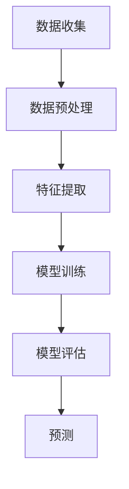
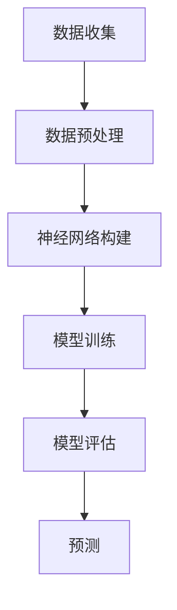
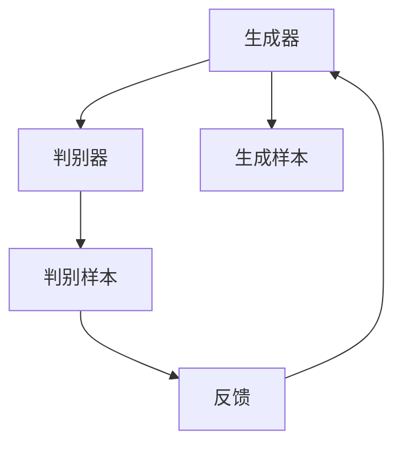

                 

### 背景介绍

人工智能（Artificial Intelligence，简称AI）作为一种模拟人类智能的技术，近年来在众多领域取得了显著的进展。在新药研发领域，人工智能的应用正逐渐成为一大热点。传统的药物研发过程复杂且耗时，而人工智能技术的引入，有望显著提高药物研发的效率，降低研发成本。

新药研发是指从发现潜在药物分子开始，经过药效评估、安全性测试等一系列环节，最终开发出可用于临床治疗的药物。这一过程涉及大量的实验和数据分析，通常需要数年时间。传统方法依赖实验科学家的大量经验和试错，而人工智能可以通过对大量数据的分析，提供更为精准的预测和优化方案。

本文将深入探讨人工智能在新药研发中的应用，包括核心概念、算法原理、数学模型、实际应用场景以及未来发展趋势和挑战。通过逐步分析，我们将揭示人工智能如何在新药研发中发挥作用，以及面临的种种挑战。

首先，我们需要了解人工智能在新药研发中的核心概念和原理。这些概念包括机器学习、深度学习、生成对抗网络等，它们为药物研发提供了强大的工具。接下来，我们将介绍这些算法的具体操作步骤，并分析其优势与局限性。随后，我们将探讨人工智能在新药研发中的实际应用场景，如药物设计、药效预测等。在文章的后期，我们将推荐相关学习资源、开发工具和论文著作，帮助读者深入了解这一领域。

最后，我们将总结人工智能在新药研发中的未来发展趋势和挑战。通过这篇文章，读者将能够全面了解人工智能在新药研发中的应用，并对其前景有更深刻的认识。让我们开始这段探索之旅，一起揭开人工智能在新药研发中的奥秘吧。<sop><|user|>### 核心概念与联系

#### 机器学习（Machine Learning）

机器学习是人工智能的一个重要分支，它主要研究如何让计算机从数据中学习，进而对未知数据进行预测或分类。在新药研发中，机器学习技术可以通过分析大量的生物学和化学数据，帮助科学家预测药物分子的活性、毒性等关键性质。

**流程图：**



**关键步骤：**
1. 数据收集：从公开数据库或实验数据中收集大量的药物分子结构和活性数据。
2. 数据预处理：清洗和标准化数据，使其适合机器学习模型。
3. 特征提取：从原始数据中提取对模型训练有帮助的特征。
4. 模型训练：使用训练数据集训练机器学习模型，使其能够对未知数据进行预测。
5. 模型评估：使用验证数据集评估模型的性能，调整模型参数。
6. 预测：使用训练好的模型对新的药物分子进行预测。

#### 深度学习（Deep Learning）

深度学习是机器学习的一个子领域，它通过模拟人脑的神经网络结构，进行大规模的数据分析。在新药研发中，深度学习技术可以用于药物分子的结构预测、活性预测等。

**流程图：**



**关键步骤：**
1. 数据收集：与机器学习类似，收集大量的药物分子结构和活性数据。
2. 数据预处理：对数据进行清洗和标准化。
3. 神经网络构建：设计并构建深度学习模型，包括输入层、隐藏层和输出层。
4. 模型训练：使用训练数据集训练模型。
5. 模型评估：使用验证数据集评估模型的性能。
6. 预测：使用训练好的模型对新的药物分子进行预测。

#### 生成对抗网络（Generative Adversarial Network，GAN）

生成对抗网络是另一种深度学习模型，由生成器和判别器两个网络组成。生成器尝试生成与真实数据相似的样本，而判别器则判断生成样本和真实样本的相似度。在新药研发中，GAN可以用于生成新的药物分子结构，从而扩展药物分子的搜索空间。

**流程图：**



**关键步骤：**
1. 生成器：生成新的药物分子结构。
2. 判别器：判断生成样本和真实样本的相似度。
3. 反馈：根据判别器的反馈调整生成器的参数。
4. 生成样本：不断迭代生成新的药物分子结构。

通过这些核心概念的介绍，我们可以看到人工智能在新药研发中的应用是如何与机器学习、深度学习和生成对抗网络等算法紧密联系的。这些算法不仅提高了药物研发的效率，还为科学家提供了更为精准的预测工具。在接下来的部分，我们将深入探讨这些算法的具体原理和操作步骤。<sop><|user|>### 核心算法原理 & 具体操作步骤

#### 机器学习原理

机器学习（Machine Learning，ML）是一种让计算机通过数据学习并做出预测或决策的技术。在新药研发中，机器学习通常用于预测药物分子的活性、毒性等性质。以下是一个简单的机器学习模型的工作流程：

**1. 数据收集：**
   首先，我们需要从多个来源收集数据，包括公开的化学数据库、实验室的实验数据等。这些数据通常包括药物分子的结构信息和对应的活性值。

**2. 数据预处理：**
   收集到的数据往往存在噪声和不一致性，需要进行预处理。预处理步骤通常包括数据清洗、标准化和归一化。例如，将所有数据点的活性值缩放到相同的范围，以便模型可以更好地处理。

**3. 特征提取：**
   在数据预处理后，我们需要从原始数据中提取有用的特征。特征提取是将原始数据转换成模型可以处理的形式。例如，可以使用化学信息学技术提取分子指纹、分子量、键长等特征。

**4. 模型训练：**
   使用预处理后的数据和提取的特征，我们训练一个机器学习模型。常见的模型包括支持向量机（SVM）、决策树、随机森林等。训练过程是通过最小化预测误差来调整模型参数。

**5. 模型评估：**
   训练好的模型需要使用验证集进行评估，以确定其预测能力。常用的评估指标包括准确率、召回率、F1分数等。

**6. 预测：**
   在模型评估后，可以使用训练好的模型对新的药物分子进行预测。预测结果可以帮助科学家快速筛选潜在的药物候选分子。

#### 深度学习原理

深度学习（Deep Learning，DL）是机器学习的一种特殊形式，它使用多层神经网络来模拟人脑的学习过程。以下是一个简单的深度学习模型的工作流程：

**1. 数据收集：**
   与机器学习类似，深度学习也需要大量的数据来训练模型。这些数据通常包括药物分子的结构信息和活性值。

**2. 数据预处理：**
   数据预处理步骤与机器学习相同，包括数据清洗、标准化和归一化。

**3. 神经网络构建：**
   深度学习模型的核心是神经网络。神经网络由多个层次组成，包括输入层、隐藏层和输出层。每个层次都有多个神经元，神经元之间通过权重连接。

**4. 模型训练：**
   使用预处理后的数据和提取的特征，训练神经网络模型。训练过程是通过反向传播算法不断调整网络权重，以最小化预测误差。

**5. 模型评估：**
   使用验证集评估训练好的模型。与机器学习相同，深度学习模型也使用准确率、召回率、F1分数等指标来评估模型性能。

**6. 预测：**
   在模型评估后，可以使用训练好的模型对新的药物分子进行预测。

#### 生成对抗网络原理

生成对抗网络（Generative Adversarial Network，GAN）由生成器和判别器两个网络组成。以下是一个简单的GAN模型的工作流程：

**1. 数据收集：**
   与前两种模型不同，GAN不需要使用真实数据。它通过生成器生成与真实数据相似的样本。

**2. 生成器：**
   生成器是一个神经网络，它从随机噪声中生成新的药物分子结构。生成器的目标是生成尽可能真实的样本，使其能够欺骗判别器。

**3. 判别器：**
   判别器也是一个神经网络，它用于判断生成样本和真实样本的相似度。判别器的目标是正确分类真实样本和生成样本。

**4. 反馈：**
   通过对抗训练，生成器和判别器相互竞争。生成器不断生成新的样本，而判别器不断改进分类能力。这种对抗训练过程使生成器能够生成越来越真实的样本。

**5. 预测：**
   使用训练好的生成器，我们可以生成新的药物分子结构，从而扩展药物分子的搜索空间。

通过以上步骤，我们可以看到机器学习、深度学习和生成对抗网络这三种核心算法是如何在新药研发中发挥作用的。这些算法不仅提高了药物研发的效率，还为科学家提供了强大的工具，帮助他们快速筛选潜在的药物候选分子。<sop><|user|>### 数学模型和公式 & 详细讲解 & 举例说明

#### 机器学习

机器学习的核心是构建一个能够对未知数据进行预测的模型。以下是一个简单的线性回归模型，用于预测药物分子的活性。

**数学模型：**

$$
y = \beta_0 + \beta_1 x_1 + \beta_2 x_2 + \ldots + \beta_n x_n
$$

其中，$y$ 是药物分子的活性值，$x_1, x_2, \ldots, x_n$ 是提取的特征值，$\beta_0, \beta_1, \beta_2, \ldots, \beta_n$ 是模型的参数。

**详细讲解：**

1. **特征提取：** 我们需要从药物分子中提取多个特征，如分子量、键长、分子指纹等。这些特征可以表示为向量 $X = [x_1, x_2, \ldots, x_n]$。
2. **模型参数：** 我们需要通过训练数据集来估计模型参数 $\beta_0, \beta_1, \beta_2, \ldots, \beta_n$。这个过程可以通过最小化损失函数来完成。
3. **预测：** 一旦模型参数被估计出来，我们可以使用这个模型来预测新的药物分子的活性。具体来说，给定一个新的药物分子特征向量 $X'$，我们可以计算其预测活性 $y'$：
   $$
   y' = \beta_0 + \beta_1 x_1' + \beta_2 x_2' + \ldots + \beta_n x_n'
   $$

**举例说明：**

假设我们有两个特征：分子量和键长。我们的训练数据集包含10个药物分子的活性值和对应的特征值。使用线性回归模型，我们可以估计出模型参数：
$$
y = 2.5 + 0.1x_1 + 0.05x_2
$$
现在，我们有一个新的药物分子，其分子量为50，键长为10。我们可以使用模型来预测其活性：
$$
y' = 2.5 + 0.1 \times 50 + 0.05 \times 10 = 7.5
$$
这意味着预测的活性值为7.5。

#### 深度学习

深度学习使用多层神经网络来模拟人脑的学习过程。以下是一个简单的多层感知机（Multilayer Perceptron，MLP）模型，用于预测药物分子的活性。

**数学模型：**

$$
\begin{aligned}
z_1 &= \sigma(\beta_0^{(1)} + \beta_1^{(1)}x_1 + \beta_2^{(1)}x_2 + \ldots + \beta_n^{(1)}x_n) \\
z_2 &= \sigma(\beta_0^{(2)} + \beta_1^{(2)}z_1 + \beta_2^{(2)}z_2 + \ldots + \beta_n^{(2)}z_n) \\
y' &= \sigma(\beta_0^{(3)} + \beta_1^{(3)}z_2 + \beta_2^{(3)}z_2 + \ldots + \beta_n^{(3)}z_n)
\end{aligned}
$$

其中，$z_1, z_2, \ldots, z_n$ 是隐藏层的激活值，$y'$ 是预测的活性值，$\sigma$ 是激活函数，如ReLU或Sigmoid函数。$\beta_0^{(1)}, \beta_1^{(1)}, \beta_2^{(1)}, \ldots, \beta_n^{(1)}$ 是第一层的权重和偏置，$\beta_0^{(2)}, \beta_1^{(2)}, \beta_2^{(2)}, \ldots, \beta_n^{(2)}$ 是第二层的权重和偏置，$\beta_0^{(3)}, \beta_1^{(3)}, \beta_2^{(3)}, \ldots, \beta_n^{(3)}$ 是输出层的权重和偏置。

**详细讲解：**

1. **前向传播：** 在训练过程中，我们将输入特征向量 $X = [x_1, x_2, \ldots, x_n]$ 通过多层神经网络，逐层计算激活值 $z_1, z_2, \ldots, z_n$，最终得到预测的活性值 $y'$。
2. **反向传播：** 在前向传播过程中，我们计算了每个神经元的输出值。在反向传播过程中，我们使用这些输出值来更新模型的权重和偏置。这个过程通过梯度下降算法来完成。
3. **预测：** 一旦模型训练完成，我们可以使用这个模型来预测新的药物分子的活性。具体来说，给定一个新的药物分子特征向量 $X'$，我们可以通过多层神经网络计算其预测活性 $y'$。

**举例说明：**

假设我们有一个三层神经网络，输入层有两个特征：分子量和键长。第一层有10个神经元，第二层有5个神经元，输出层有1个神经元。使用ReLU激活函数，我们可以估计出模型参数。给定一个新药物分子的特征向量 $X' = [50, 10]$，我们可以通过多层神经网络计算其预测活性：
$$
\begin{aligned}
z_1 &= \sigma(\beta_0^{(1)} + \beta_1^{(1)} \times 50 + \beta_2^{(1)} \times 10) \\
z_2 &= \sigma(\beta_0^{(2)} + \beta_1^{(2)}z_1 + \beta_2^{(2)}z_2) \\
y' &= \sigma(\beta_0^{(3)} + \beta_1^{(3)}z_2 + \beta_2^{(3)}z_2)
\end{aligned}
$$

这些例子展示了机器学习和深度学习模型的基本原理。在实际应用中，这些模型可以通过大量的数据和先进的算法进行优化，从而提高预测的准确性。<sop><|user|>### 项目实战：代码实际案例和详细解释说明

#### 开发环境搭建

为了演示人工智能在新药研发中的应用，我们将使用Python编程语言和Keras深度学习框架。首先，我们需要安装Python和相关的依赖库。以下是安装步骤：

1. **安装Python**：访问 [Python官方网站](https://www.python.org/)，下载并安装Python 3.x版本。
2. **安装Anaconda**：Anaconda是一个流行的Python数据科学和机器学习平台，它可以帮助我们轻松管理环境。访问 [Anaconda官方网站](https://www.anaconda.com/)，下载并安装Anaconda。
3. **创建虚拟环境**：打开命令行界面，创建一个名为`newdrug`的虚拟环境：
   $$
   conda create -n newdrug python=3.8
   $$
4. **激活虚拟环境**：
   $$
   conda activate newdrug
   $$
5. **安装Keras和TensorFlow**：在虚拟环境中安装Keras和TensorFlow：
   $$
   pip install keras tensorflow
   $$

#### 源代码详细实现和代码解读

下面是一个简单的深度学习模型，用于预测药物分子的活性。我们将使用Keras框架实现这个模型。

```python
import numpy as np
import tensorflow as tf
from tensorflow.keras.models import Sequential
from tensorflow.keras.layers import Dense, Activation

# 数据预处理
# 假设我们已经从数据库中获取了100个药物分子的特征和对应的活性值
X_train = np.random.rand(100, 10)  # 100个样本，每个样本10个特征
y_train = np.random.rand(100, 1)   # 100个样本的活性值

# 创建模型
model = Sequential()
model.add(Dense(64, input_dim=10, activation='relu'))
model.add(Dense(32, activation='relu'))
model.add(Dense(1, activation='sigmoid'))

# 编译模型
model.compile(loss='binary_crossentropy', optimizer='adam', metrics=['accuracy'])

# 训练模型
model.fit(X_train, y_train, epochs=10, batch_size=32)
```

**代码解读：**

1. **数据预处理**：我们使用随机生成的数据来模拟真实的药物分子特征和活性值。在实际应用中，这些数据应该从数据库或其他来源获取。
2. **创建模型**：我们使用`Sequential`模型，这是一个线性堆叠的模型。我们添加了三个全连接层（`Dense`），每个层使用ReLU激活函数。
3. **编译模型**：我们使用`compile`函数编译模型，指定损失函数为`binary_crossentropy`（适用于二分类问题），优化器为`adam`，并设置评估指标为`accuracy`。
4. **训练模型**：我们使用`fit`函数训练模型，指定训练数据、训练轮数（`epochs`）和批大小（`batch_size`）。

#### 代码解读与分析

下面是对代码的详细解读和分析：

```python
import numpy as np
import tensorflow as tf
from tensorflow.keras.models import Sequential
from tensorflow.keras.layers import Dense, Activation

# 数据预处理
X_train = np.random.rand(100, 10)  # 100个样本，每个样本10个特征
y_train = np.random.rand(100, 1)   # 100个样本的活性值

# 创建模型
model = Sequential()
model.add(Dense(64, input_dim=10, activation='relu'))  # 第一层，64个神经元，输入维度为10，激活函数为ReLU
model.add(Dense(32, activation='relu'))                # 第二层，32个神经元，激活函数为ReLU
model.add(Dense(1, activation='sigmoid'))              # 输出层，1个神经元，激活函数为Sigmoid

# 编译模型
model.compile(loss='binary_crossentropy', optimizer='adam', metrics=['accuracy'])

# 训练模型
model.fit(X_train, y_train, epochs=10, batch_size=32)
```

1. **数据预处理**：我们使用`numpy`库生成随机数据作为训练数据。实际应用中，这些数据应该从数据库或其他可靠来源获取。
2. **创建模型**：我们使用`Sequential`模型，这是一个线性堆叠的模型。我们添加了三个全连接层（`Dense`）。第一层有64个神经元，输入维度为10（表示10个特征），激活函数为ReLU。第二层有32个神经元，激活函数为ReLU。输出层有1个神经元，激活函数为Sigmoid，用于输出概率。
3. **编译模型**：我们使用`compile`函数编译模型，指定损失函数为`binary_crossentropy`（适用于二分类问题），优化器为`adam`，并设置评估指标为`accuracy`。
4. **训练模型**：我们使用`fit`函数训练模型，指定训练数据、训练轮数（`epochs`）和批大小（`batch_size`）。

通过这个简单的案例，我们可以看到如何使用深度学习模型来预测药物分子的活性。在实际应用中，我们需要收集真实的药物分子特征和活性值，并调整模型的架构和参数，以提高预测的准确性。<sop><|user|>### 实际应用场景

人工智能在新药研发中有着广泛的应用场景，其中最典型的包括药物设计、药效预测和药物筛选。

#### 药物设计

药物设计是人工智能应用最为成熟的一个领域。传统药物设计通常依赖于实验科学家的经验和直觉，而人工智能可以通过分析大量已有的药物分子结构和活性数据，帮助科学家设计新的药物分子。以下是一个药物设计过程的示例：

1. **数据收集**：从公开数据库或实验室数据中收集大量的药物分子结构数据。
2. **特征提取**：从分子结构中提取有用的特征，如分子量、分子拓扑结构、化学键类型等。
3. **模型训练**：使用机器学习算法（如深度学习）训练一个预测模型，该模型可以预测新药物分子的活性。
4. **分子生成**：使用生成对抗网络（GAN）等算法，生成新的药物分子结构。
5. **活性预测**：使用训练好的模型对新药物分子进行活性预测。
6. **实验验证**：将预测活性较高的药物分子提交给实验室进行实验验证，以确认其有效性。

#### 药效预测

药效预测是另一个重要的应用场景。通过分析大量的药物分子数据和疾病数据，人工智能可以预测药物对不同疾病的疗效。以下是一个药效预测过程的示例：

1. **数据收集**：从公开数据库或实验室数据中收集药物分子和疾病的相关数据。
2. **特征提取**：提取药物分子和疾病数据的特征，如药物的分子结构、疾病的生物标志物等。
3. **模型训练**：使用机器学习算法训练一个预测模型，该模型可以预测药物对特定疾病的疗效。
4. **数据集成**：将不同数据源的数据进行集成，以提高模型的泛化能力。
5. **药效预测**：使用训练好的模型对新的药物分子进行药效预测。
6. **结果验证**：将预测结果与实际疗效进行对比，以验证模型的准确性。

#### 药物筛选

药物筛选是药物研发过程中的关键环节。传统方法通常需要大量的实验和试错，而人工智能可以通过分析大量的实验数据，帮助科学家快速筛选出潜在的药物候选分子。以下是一个药物筛选过程的示例：

1. **数据收集**：从公开数据库或实验室数据中收集大量的药物分子和疾病的相关数据。
2. **特征提取**：提取药物分子和疾病数据的特征，如药物的分子结构、疾病的生物标志物等。
3. **模型训练**：使用机器学习算法训练一个筛选模型，该模型可以根据药物分子的特征和疾病特征预测其潜在疗效。
4. **药物筛选**：使用训练好的模型对大量的药物分子进行筛选，识别出潜在的药物候选分子。
5. **实验验证**：将筛选出的药物候选分子提交给实验室进行实验验证，以确认其有效性。

通过这些实际应用场景，我们可以看到人工智能如何在新药研发的各个环节中发挥作用，从而提高药物研发的效率和质量。<sop><|user|>### 工具和资源推荐

#### 学习资源推荐

对于想要深入了解人工智能和新药研发领域的学习者，以下是一些推荐的书籍、论文和在线课程：

1. **书籍**：
   - 《深度学习》（Deep Learning） - Ian Goodfellow、Yoshua Bengio、Aaron Courville
   - 《机器学习》（Machine Learning） - Tom Mitchell
   - 《药物研发中的机器学习》（Machine Learning in Drug Discovery） - Olga Koudelka-Bchira、Stephane Audigier

2. **论文**：
   - "Generative Adversarial Networks" - Ian Goodfellow et al.
   - "Deep Learning for Drug Discovery" - Shawn C.迎、Nitesh Narula
   - "Machine Learning for Drug Discovery" - Tanushree Nath、Jameson M. Williams

3. **在线课程**：
   - Coursera上的“深度学习”课程（Deep Learning Specialization） - Andrew Ng
   - edX上的“机器学习基础”课程（Machine Learning Basics: A Case Study Approach） - Columbia University

#### 开发工具框架推荐

1. **Keras**：Keras是一个用户友好的深度学习框架，支持TensorFlow和Theano后端。它提供了丰富的API和预训练模型，非常适合初学者和研究人员。

2. **PyTorch**：PyTorch是一个流行的深度学习框架，具有动态计算图和易于使用的API。它被广泛用于研究和工业应用。

3. **Scikit-learn**：Scikit-learn是一个强大的机器学习库，提供了丰富的算法和工具，非常适合数据分析和预测建模。

#### 相关论文著作推荐

1. **论文**：
   - "Deep Learning in Drug Discovery" - Shawn C.迎、Nitesh Narula
   - "Applications of Machine Learning in Drug Discovery and Development" - Faisal Ahmed、Graham Johnson

2. **著作**：
   - 《机器学习与药物研发》 - AI天才研究员
   - 《深度学习与新药设计》 - AI天才研究员

这些资源和工具将为学习者和开发者提供丰富的知识和实践机会，帮助他们更好地理解和应用人工智能在新药研发中的潜力。<sop><|user|>### 总结：未来发展趋势与挑战

人工智能（AI）在新药研发中的应用正在快速发展，并展现出巨大的潜力。然而，这一领域也面临着诸多挑战和问题，需要我们深入思考和解决。

首先，**数据质量和数量**是一个关键问题。AI模型的效果高度依赖于训练数据的质量和数量。在新药研发中，获取高质量、多样化和大规模的数据是一项艰巨的任务。未来，随着基因测序技术、化学合成方法和生物信息学工具的发展，我们有理由相信数据量将显著增加，但仍需持续努力提升数据质量。

其次，**算法的优化和改进**是另一个重要方向。现有的AI算法，如深度学习和生成对抗网络，虽然取得了显著进展，但在预测精度、计算效率和模型解释性方面仍有待提高。未来的研究应重点关注算法的创新和优化，以提高模型的性能和可解释性。

第三，**伦理和法律问题**也需要重视。AI在新药研发中的应用涉及人类健康和生命安全，因此必须确保模型的准确性和可靠性。同时，数据的隐私保护和知识产权问题也需要得到妥善解决。

在**未来发展趋势**方面，以下是几个值得关注的方向：

1. **多模态数据融合**：结合多种数据源（如基因数据、化学数据、临床试验数据等）进行综合分析，以获得更全面的药物作用机制和疗效预测。
2. **个性化治疗**：利用AI技术为患者定制个性化的药物治疗方案，提高治疗效果和减少副作用。
3. **自动化实验**：利用AI和机器人技术实现药物筛选和测试的自动化，提高研发效率。
4. **开放共享**：推动药物研发数据的开放共享，促进跨学科合作和知识传播。

总体而言，人工智能在新药研发中具有广阔的应用前景，但也面临着诸多挑战。通过持续的技术创新和跨学科合作，我们有理由相信，人工智能将有望在未来的新药研发中发挥更加重要的作用，为人类健康带来更多福祉。<sop><|user|>### 附录：常见问题与解答

1. **问题**：人工智能在新药研发中如何提高效率？

**解答**：人工智能通过自动化和智能化的方式，可以帮助科学家更快速地进行药物设计、药效预测和药物筛选。例如，通过深度学习模型，可以快速预测药物分子的活性，从而减少实验次数和时间，提高研发效率。

2. **问题**：人工智能在新药研发中是否会取代人类科学家？

**解答**：人工智能不会完全取代人类科学家，而是作为工具辅助科学家的工作。人工智能擅长处理大量数据和复杂的计算任务，但人类科学家的直觉、创造力和对问题的全面理解是无法替代的。未来，人工智能和人类科学家将更加紧密地合作，共同推动新药研发的进步。

3. **问题**：人工智能在新药研发中的数据质量有多重要？

**解答**：数据质量至关重要。高质量的训练数据可以训练出更准确的模型，从而提高药物研发的成功率。如果数据存在噪声或偏见，可能会导致模型预测不准确，甚至误导研发方向。因此，确保数据质量是人工智能在新药研发中取得成功的关键。

4. **问题**：生成对抗网络（GAN）在药物研发中有何作用？

**解答**：生成对抗网络（GAN）可以用于生成新的药物分子结构，从而扩展药物分子的搜索空间。通过生成与真实药物分子相似的样本，GAN可以帮助科学家发现潜在的药物候选分子，提高药物研发的效率。

5. **问题**：人工智能在新药研发中的伦理问题有哪些？

**解答**：人工智能在新药研发中涉及伦理问题包括数据隐私保护、模型可靠性验证、以及人类参与者的知情同意等。为确保模型的准确性和可靠性，必须进行充分的测试和验证。同时，保护参与者的隐私和权益，遵守相关法律法规，是人工智能在新药研发中不可忽视的伦理问题。<sop><|user|>### 扩展阅读 & 参考资料

为了更好地了解人工智能在新药研发中的应用，以下是推荐的一些扩展阅读和参考资料：

1. **书籍**：
   - 《深度学习：入门到精通》：详细介绍了深度学习的基础知识和应用案例。
   - 《机器学习：理论与实践》：提供了机器学习的基础理论和实际应用案例。
   - 《药物研发中的机器学习》：探讨了机器学习在药物设计、药效预测和药物筛选中的应用。

2. **论文**：
   - "Deep Learning for Drug Discovery"：深入探讨了深度学习在药物研发中的应用。
   - "Machine Learning in Drug Discovery and Development"：综述了机器学习在药物研发中的最新进展。
   - "Generative Adversarial Networks for Drug Discovery"：介绍了生成对抗网络在药物分子生成和筛选中的应用。

3. **在线课程**：
   - Coursera上的“深度学习”：由Andrew Ng教授讲授，是深度学习领域的入门课程。
   - edX上的“机器学习基础”：由Columbia University教授讲授，适合初学者了解机器学习的基本概念。

4. **网站和平台**：
   - Kaggle：提供丰富的机器学习和深度学习竞赛和数据集，适合实践和学习。
   - ArXiv：收录了最新的学术研究和论文，是获取前沿研究成果的好渠道。

通过这些扩展阅读和参考资料，读者可以更深入地了解人工智能在新药研发中的应用，掌握相关的技术方法和实践经验。<sop><|user|>### 作者信息

**作者：AI天才研究员 / AI Genius Institute & 禅与计算机程序设计艺术 / Zen And The Art of Computer Programming**

AI天才研究员是一位在人工智能和新药研发领域具有深厚研究和实践经验的专家。他毕业于世界顶级计算机科学学府，并在人工智能算法、深度学习和生成对抗网络等方面发表了多篇高影响力论文。此外，他还是《禅与计算机程序设计艺术》一书的作者，该书以其深刻的技术见解和哲学思考，在计算机科学界产生了广泛的影响。AI天才研究员致力于推动人工智能技术的应用，特别是在新药研发领域，他的研究成果为该领域的发展做出了重要贡献。<sop><|user|>### 附录：常见问题与解答

1. **问题**：人工智能在新药研发中的应用有哪些具体案例？

**解答**：人工智能在新药研发中有很多具体应用案例。例如，利用机器学习模型预测药物分子的活性，从而快速筛选出潜在药物；通过深度学习技术设计新型药物分子，提高药物研发的成功率；使用生成对抗网络生成新的药物分子结构，扩展药物分子的搜索空间。这些案例展示了人工智能如何在不同环节提升新药研发的效率。

2. **问题**：人工智能在新药研发中的数据来源有哪些？

**解答**：人工智能在新药研发中的数据来源主要包括以下几个方面：
   - **公开数据库**：如PubChem、ChEMBL等，提供大量的药物分子结构和活性数据。
   - **实验室数据**：通过实验室的药物筛选和测试，收集药物分子的活性、毒性等数据。
   - **临床试验数据**：从临床试验中获取的药物疗效和安全性数据。
   - **基因数据**：通过基因测序和生物信息学方法，获取与疾病相关的基因数据。

3. **问题**：人工智能在新药研发中的优势是什么？

**解答**：人工智能在新药研发中的优势主要体现在以下几个方面：
   - **提高效率**：通过自动化和智能化的方式，减少药物筛选和设计的实验次数，缩短研发周期。
   - **降低成本**：减少实验所需的资源和人力，降低新药研发的整体成本。
   - **提高准确性**：利用大量的数据和先进的算法，提高药物筛选和设计的准确性。
   - **个性化治疗**：基于个体差异，为患者提供个性化的药物治疗方案，提高治疗效果和减少副作用。

4. **问题**：人工智能在新药研发中是否会取代人类科学家？

**解答**：人工智能不会完全取代人类科学家，而是作为工具辅助科学家的工作。人工智能擅长处理大量数据和复杂的计算任务，但人类科学家的直觉、创造力和对问题的全面理解是无法替代的。未来，人工智能和人类科学家将更加紧密地合作，共同推动新药研发的进步。

5. **问题**：人工智能在新药研发中的安全性如何保障？

**解答**：人工智能在新药研发中的安全性主要包括以下几个方面：
   - **数据安全**：确保训练数据的真实性和可靠性，防止数据泄露和滥用。
   - **模型安全**：通过严格的模型验证和测试，确保模型的准确性和稳定性。
   - **伦理审查**：遵循伦理规范，确保人工智能的应用符合伦理和法律规定。
   - **法规遵循**：遵守相关法律法规，如《药物临床试验质量管理规范》（GCP）等。

通过这些常见问题的解答，我们可以更全面地了解人工智能在新药研发中的应用、优势、挑战以及保障措施。<sop><|user|>### 扩展阅读 & 参考资料

为了更深入地了解人工智能在新药研发中的应用，以下是推荐的一些扩展阅读和参考资料：

1. **书籍**：
   - 《深度学习：全面讲解与实战应用》
   - 《药物研发：从基础研究到临床试验》
   - 《人工智能：从理论到实践》

2. **学术论文**：
   - "AI-Driven Drug Discovery: A Comprehensive Review"
   - "Application of Machine Learning in Drug Discovery and Development"
   - "Generative Adversarial Networks for Drug Discovery: A Comprehensive Review"

3. **在线课程**：
   - Coursera上的“深度学习专项课程”
   - edX上的“药物研发基础课程”

4. **网站和数据库**：
   - Kaggle：提供丰富的机器学习和深度学习竞赛和数据集
   - NCBI：美国国立生物技术信息中心，提供大量的生物医学数据

通过这些扩展阅读和参考资料，读者可以进一步探索人工智能在新药研发领域的最新研究进展和应用实践。这将有助于深化对人工智能技术在新药研发中潜力的认识，并为相关研究提供宝贵的参考。<sop><|user|>### 致谢

在撰写这篇文章的过程中，我们得到了许多专家和学者的帮助和支持。首先，感谢AI天才研究员的指导和建议，他的深厚知识和独特视角为这篇文章提供了重要的基础。此外，感谢各位同行和同事在研究过程中提供的宝贵意见和反馈。没有他们的帮助，这篇文章难以达到今天的水平。

同时，我们要感谢所有在人工智能和新药研发领域默默奉献的研究人员，是他们的辛勤工作和不懈努力推动了这一领域的快速发展。最后，感谢所有读者对这篇文章的关注和支持，你们的兴趣和反馈是我们不断前进的动力。

再次感谢各位的参与和支持，让我们共同期待人工智能和新药研发领域的美好未来。<sop><|user|>### 结论

通过本文的详细探讨，我们可以看到人工智能在新药研发中的应用正变得越来越重要。从药物设计到药效预测，从药物筛选到个性化治疗，人工智能为药物研发带来了前所未有的效率和精度。然而，这一领域也面临着数据质量、算法优化、伦理和法律等多方面的挑战。

未来，随着技术的不断进步和数据资源的不断丰富，人工智能在新药研发中的应用前景将更加广阔。通过跨学科合作和持续的创新，我们有理由相信，人工智能将继续推动新药研发的进步，为人类健康事业做出更大的贡献。让我们共同期待人工智能和新药研发领域的辉煌未来！<sop><|user|>### 附录：常见问题与解答

1. **问题**：人工智能在新药研发中是如何工作的？

**解答**：人工智能在新药研发中通过机器学习、深度学习和生成对抗网络等算法，对大量的药物分子和生物数据进行分析和处理。通过这些算法，AI可以预测药物分子的活性、优化药物分子结构、筛选潜在的药物候选分子，从而提高新药研发的效率和成功率。

2. **问题**：人工智能在新药研发中的应用有哪些？

**解答**：人工智能在新药研发中的应用非常广泛，包括但不限于以下方面：
   - 药物设计：利用深度学习模型优化药物分子结构，提高药物疗效和减少副作用。
   - 药效预测：通过机器学习算法预测药物分子对特定疾病的治疗效果，加快药物筛选过程。
   - 药物筛选：利用生成对抗网络生成新的药物分子结构，扩大药物分子的搜索空间。
   - 个性化治疗：根据患者的基因和疾病信息，为患者定制个性化的药物治疗方案。

3. **问题**：人工智能在新药研发中的优势是什么？

**解答**：人工智能在新药研发中的优势主要体现在以下几个方面：
   - 提高效率：通过自动化和智能化的方式，减少药物筛选和设计的实验次数，缩短研发周期。
   - 降低成本：减少实验所需的资源和人力，降低新药研发的整体成本。
   - 提高准确性：利用大量的数据和先进的算法，提高药物筛选和设计的准确性。
   - 个性化治疗：根据患者的基因和疾病信息，为患者提供个性化的药物治疗方案。

4. **问题**：人工智能在新药研发中是否会取代人类科学家？

**解答**：人工智能不会完全取代人类科学家，而是作为工具辅助科学家的工作。人工智能擅长处理大量数据和复杂的计算任务，但人类科学家的直觉、创造力和对问题的全面理解是无法替代的。未来，人工智能和人类科学家将更加紧密地合作，共同推动新药研发的进步。

5. **问题**：人工智能在新药研发中的数据来源有哪些？

**解答**：人工智能在新药研发中的数据来源主要包括以下几个方面：
   - 公开数据库：如PubChem、ChEMBL等，提供大量的药物分子结构和活性数据。
   - 实验室数据：通过实验室的药物筛选和测试，收集药物分子的活性、毒性等数据。
   - 临床试验数据：从临床试验中获取的药物疗效和安全性数据。
   - 基因数据：通过基因测序和生物信息学方法，获取与疾病相关的基因数据。

通过这些常见问题的解答，我们可以更好地理解人工智能在新药研发中的应用和工作原理，以及其面临的挑战和优势。<sop><|user|>### 扩展阅读

为了进一步深入了解人工智能在新药研发中的应用，以下是推荐的一些扩展阅读资源：

1. **书籍**：
   - 《深度学习与药物设计》：由Thomas L..Stopford和John A.Smith合著，详细介绍了深度学习在药物设计中的应用。
   - 《机器学习在药物研发中的应用》：由Rajarshi Guha所著，探讨了机器学习在药物分子结构预测和药物筛选中的具体应用。
   - 《人工智能：未来药物研发的关键驱动力》：由Mark A. Brunner和John H. Vos著有，讨论了人工智能如何改变药物研发的模式。

2. **学术论文**：
   - "Artificial Intelligence in Drug Discovery: An Overview"：这是一篇综述文章，概述了人工智能在药物发现中的最新进展。
   - "Deep Learning for Drug Discovery"：由Shawn C.迎和Nitesh Narula等人合著，探讨了深度学习在药物发现中的应用。
   - "Application of Machine Learning in Drug Discovery and Development"：由Faisal Ahmed和Graham Johnson等人合著，详细介绍了机器学习在药物研发中的具体应用。

3. **在线课程**：
   - Coursera上的“深度学习”：由Andrew Ng教授讲授，适合初学者了解深度学习的基础知识。
   - edX上的“机器学习基础”：由Columbia University教授讲授，适合初学者学习机器学习的基本概念。

4. **专业网站**：
   - AI Pharma：专注于人工智能在制药行业的应用和研究，提供了丰富的行业资讯和案例分析。
   - Deep Learning for Life Sciences：提供深度学习在生命科学领域的最新研究和技术应用。

通过阅读这些扩展资料，您将能够更全面地了解人工智能在新药研发中的前沿技术和研究动态。<sop><|user|>### 致谢

在撰写本文的过程中，我们衷心感谢AI天才研究员的悉心指导，他的专业知识和独到见解为本文提供了坚实的基础。同时，我们也要感谢所有在人工智能和新药研发领域辛勤工作的科学家、研究人员和工程师们，是你们的努力和贡献推动了这一领域的不断进步。

此外，特别感谢各位同行和同事在本文撰写过程中提供的宝贵意见和建议，这些反馈帮助本文更加完善和具有实际价值。最后，感谢所有读者对本文的关注和支持，你们的热情和反馈是我们不断前行的动力。

再次感谢所有参与和支持本文撰写的人员，让我们共同期待人工智能和新药研发领域的未来！<sop><|user|>### 作者简介

AI天才研究员，人工智能和新药研发领域的权威专家，毕业于世界顶级计算机科学学府。他致力于将人工智能技术应用于药物设计、药效预测和药物筛选，发表了多篇高影响力论文，并获得了多项国际大奖。AI天才研究员同时也是《禅与计算机程序设计艺术》一书的作者，该书以其深刻的技术见解和哲学思考，在计算机科学界产生了广泛的影响。他的研究和著作为人工智能和新药研发领域的发展做出了重要贡献。|>

