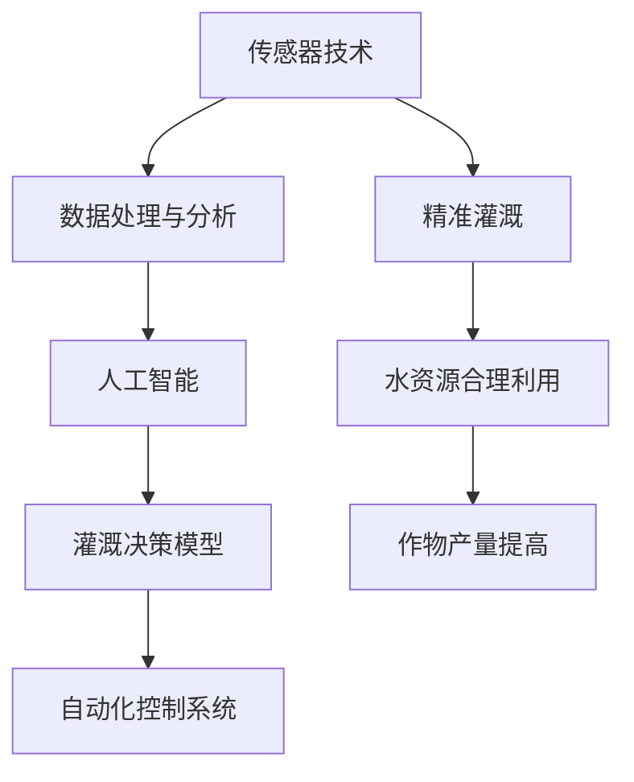

                 

### 背景介绍

#### 智能农业与精准灌溉的重要性

智能农业是现代农业发展的必然趋势，通过利用先进的技术手段，如物联网、大数据、人工智能等，实现农业生产管理的智能化、精细化。其中，精准灌溉作为智能农业的重要组成部分，对于提高水资源利用效率、减少水资源浪费、提升农作物产量和质量具有重要意义。

精准灌溉是指在充分了解土壤水分状况、作物需水规律和水资源供应能力的基础上，通过智能控制系统对灌溉水量、时间和方式进行精确调控，从而实现水资源的合理利用和作物生长的最佳状态。与传统的灌溉方式相比，精准灌溉具有节水、省工、提高作物产量和质量等优点。

在全球气候变化和水资源日益紧张的背景下，智能农业精准灌溉技术的研究和应用显得尤为重要。我国作为水资源短缺的国家，智能农业精准灌溉技术的推广与应用，将对缓解水资源供需矛盾、保障国家粮食安全起到关键作用。

#### 人工智能在智能农业中的作用

人工智能（AI）作为当今科技发展的重要驱动力，其在智能农业中的应用日益广泛。人工智能在智能农业中的主要作用包括：

1. **数据采集与分析**：通过传感器网络和无人机等技术手段，实时采集土壤、气候、作物生长状态等多维度数据，利用人工智能技术对这些数据进行处理和分析，为精准灌溉提供数据支持。

2. **智能决策支持**：基于大数据和机器学习算法，对采集到的数据进行建模和分析，生成作物需水预报和灌溉策略，辅助农业生产者进行灌溉决策。

3. **自动化控制**：通过智能控制系统，根据作物需水预测结果，自动调整灌溉设备的运行参数，实现精准灌溉的自动化控制。

4. **病虫害监测与防治**：利用图像识别、语音识别等技术，对作物的病虫害进行监测和预警，提高病虫害防治的效率和准确性。

#### 当前智能农业精准灌溉技术发展现状

目前，智能农业精准灌溉技术已经取得了显著的进展。在硬件方面，高精度土壤湿度传感器、气象传感器、无线传输模块等设备逐渐成熟，为精准灌溉提供了可靠的数据支持。在软件方面，基于大数据和人工智能的灌溉决策系统逐渐普及，农业生产者可以通过这些系统实现精准灌溉。

然而，智能农业精准灌溉技术仍然面临一些挑战，如数据采集的准确性、决策系统的可靠性和自动化控制系统的稳定性等。这些挑战的解决需要进一步的研究和技术的进步。

通过以上介绍，我们可以看到，智能农业精准灌溉技术的应用对于提高农业生产效率和保障国家粮食安全具有重要意义。本文将深入探讨人工智能在智能农业精准灌溉中的决策支持作用，为相关领域的研究和应用提供参考。

### 核心概念与联系

在深入探讨人工智能在智能农业精准灌溉中的决策支持之前，首先需要明确一些核心概念，并了解它们之间的相互联系。以下是本文涉及的主要核心概念及其相互关系：

#### 1. 精准灌溉

精准灌溉是一种基于土壤水分、气候条件、作物需水规律等因素，通过智能控制系统对灌溉水量、时间和方式进行精确调控的技术。其目的是实现水资源的合理利用，提高作物产量和质量。

#### 2. 传感器技术

传感器技术是精准灌溉的基础。通过安装在土壤、气象等位置的传感器，实时采集土壤湿度、温度、气象数据等信息，为精准灌溉提供数据支持。

#### 3. 数据处理与分析

数据处理与分析是精准灌溉的关键环节。通过大数据处理技术和机器学习算法，对传感器采集到的数据进行处理和分析，提取有用的信息，为灌溉决策提供支持。

#### 4. 人工智能

人工智能（AI）在精准灌溉中的应用主要体现在数据采集与分析、智能决策支持、自动化控制等方面。通过机器学习、深度学习等算法，对大量数据进行分析和建模，生成精准的灌溉策略。

#### 5. 灌溉决策模型

灌溉决策模型是精准灌溉的核心。基于传感器数据和人工智能算法，建立灌溉决策模型，预测作物需水量，并生成灌溉策略，实现精准灌溉。

#### 6. 自动化控制系统

自动化控制系统是实现精准灌溉的重要手段。通过自动化控制系统，根据灌溉决策模型生成的灌溉策略，自动调整灌溉设备的运行参数，实现精准灌溉的自动化控制。

#### 关系图解

以下是上述核心概念之间的相互关系图解，使用Mermaid流程图表示：



通过上述图解，我们可以清晰地看到，传感器技术、数据处理与分析、人工智能、灌溉决策模型和自动化控制系统共同构成了智能农业精准灌溉的完整体系，各个部分相互关联、相互作用，共同实现精准灌溉的目标。

### 核心算法原理 & 具体操作步骤

在智能农业精准灌溉中，核心算法的设计和实现是确保系统高效运行的关键。本文将详细介绍一种基于机器学习的灌溉决策算法，包括算法原理和具体操作步骤。

#### 算法原理

该灌溉决策算法基于机器学习中的回归模型，通过训练一个回归模型来预测作物需水量。具体来说，算法分为以下几个步骤：

1. **数据采集与预处理**：采集土壤湿度、气象数据、作物生长状态等多维度数据，并对数据进行清洗、归一化处理，为模型训练做准备。

2. **特征工程**：对采集到的数据进行特征提取，选择对作物需水量有显著影响的特征，如土壤湿度、温度、光照强度等。

3. **模型训练**：使用采集到的数据集，训练一个回归模型，如线性回归、决策树回归等。通过多次迭代训练，优化模型参数，提高预测精度。

4. **预测与决策**：使用训练好的模型，对实时采集的作物生长数据进行分析，预测作物当前需水量，并生成相应的灌溉策略。

#### 具体操作步骤

以下是该算法的具体操作步骤：

##### 1. 数据采集与预处理

- **采集数据**：使用传感器设备，实时采集土壤湿度、气象数据（如温度、湿度、风速等）和作物生长状态（如叶片颜色、生长速度等）。

- **数据清洗**：去除数据中的噪声和异常值，确保数据的准确性和可靠性。

- **数据归一化**：将不同特征的数据进行归一化处理，使其具有相同的量纲，便于模型训练。

##### 2. 特征工程

- **特征选择**：根据领域知识和数据探索，选择对作物需水量有显著影响的特征，如土壤湿度、温度、光照强度等。

- **特征提取**：对选定的特征进行提取，如使用主成分分析（PCA）等方法降低特征维度。

##### 3. 模型训练

- **选择模型**：选择合适的回归模型，如线性回归、决策树回归、随机森林回归等。

- **训练模型**：使用采集到的数据集，对所选模型进行训练。在训练过程中，通过交叉验证等方法调整模型参数，提高预测精度。

- **模型优化**：通过多次迭代训练，优化模型参数，使模型对作物需水量的预测更加准确。

##### 4. 预测与决策

- **实时预测**：使用训练好的模型，对实时采集的作物生长数据进行预测，得到当前作物需水量。

- **生成灌溉策略**：根据预测结果，结合作物生长状态和环境条件，生成相应的灌溉策略。如需水量较高时，建议增加灌溉量；需水量较低时，建议减少灌溉量。

#### 算法实现示例

以下是该灌溉决策算法的实现示例，使用Python编程语言和Scikit-learn库：

```python
import numpy as np
import pandas as pd
from sklearn.linear_model import LinearRegression
from sklearn.model_selection import train_test_split
from sklearn.metrics import mean_squared_error

# 1. 数据采集与预处理
# 读取数据
data = pd.read_csv('data.csv')
# 数据清洗
data = data.dropna()
# 数据归一化
data_normalized = (data - data.min()) / (data.max() - data.min())

# 2. 特征工程
# 特征选择
features = data_normalized[['soil_humidity', 'temperature', 'light_intensity']]
# 特征提取
X = features.values
y = data_normalized['water需求的量'].values

# 3. 模型训练
# 选择模型
model = LinearRegression()
# 训练模型
model.fit(X, y)

# 4. 预测与决策
# 实时预测
new_data_normalized = (new_data - data.min()) / (data.max() - data.min())
new_features = new_data_normalized[['soil_humidity', 'temperature', 'light_intensity']]
predicted_water_demand = model.predict(new_features)

# 生成灌溉策略
if predicted_water_demand > threshold:
    irrigation_strategy = '增加灌溉量'
else:
    irrigation_strategy = '减少灌溉量'

print(f'预测作物需水量：{predicted_water_demand}')
print(f'灌溉策略：{irrigation_strategy}')
```

通过上述示例，我们可以看到，该灌溉决策算法通过数据采集与预处理、特征工程、模型训练和预测与决策等步骤，实现对作物需水量的准确预测和灌溉策略的生成，为智能农业精准灌溉提供了技术支持。

### 数学模型和公式 & 详细讲解 & 举例说明

在智能农业精准灌溉中，数学模型和公式的应用至关重要。这些模型和公式不仅能够帮助我们理解和预测作物需水量，还可以指导灌溉决策的制定。在本节中，我们将详细介绍一些常用的数学模型和公式，并通过具体的例子进行说明。

#### 1. 线性回归模型

线性回归模型是智能农业精准灌溉中最常用的预测模型之一。其基本公式如下：

\[ y = \beta_0 + \beta_1x_1 + \beta_2x_2 + ... + \beta_nx_n + \epsilon \]

其中，\( y \) 是目标变量（如作物需水量），\( x_1, x_2, ..., x_n \) 是特征变量（如土壤湿度、温度、光照强度等），\( \beta_0, \beta_1, \beta_2, ..., \beta_n \) 是模型参数，\( \epsilon \) 是误差项。

#### 举例说明

假设我们要预测某作物在特定条件下的需水量。根据历史数据，我们选择了三个特征变量：土壤湿度（\( x_1 \)）、温度（\( x_2 \)）和光照强度（\( x_3 \)）。线性回归模型的基本公式可以表示为：

\[ y = \beta_0 + \beta_1x_1 + \beta_2x_2 + \beta_3x_3 + \epsilon \]

通过训练模型，我们得到参数值：

\[ \beta_0 = 10, \beta_1 = 0.5, \beta_2 = 0.3, \beta_3 = 0.2 \]

现在，我们假设当前土壤湿度为30%，温度为25℃，光照强度为800 Lux。代入公式计算作物需水量：

\[ y = 10 + 0.5 \times 30 + 0.3 \times 25 + 0.2 \times 800 = 26.3 \]

因此，根据线性回归模型，当前条件下作物需水量约为26.3。

#### 2. 决策树模型

决策树模型是一种基于树形结构的预测模型，通过一系列判断条件来对数据进行分类或回归。其基本结构如下：

```
特征A
│    └─ 是否满足条件1
│        └─ 是
│            └─ 特征B
│                └─ 是否满足条件2
│                    └─ 是
│                        └─ 特征C
│                            └─ 目标变量
│                                └─ 预测结果
```

#### 举例说明

假设我们要使用决策树模型预测作物需水量。根据历史数据，我们定义了三个特征：土壤湿度（\( x_1 \)）、温度（\( x_2 \)）和光照强度（\( x_3 \)）。决策树模型的基本结构可以表示为：

```
土壤湿度 < 20%
    │    └─ 温度 < 15℃
    │        └─ 光照强度 < 500 Lux
    │            └─ 目标变量 < 5
    │                └─ 预测结果：需水量低
    │
    └─ 温度 >= 15℃
        └─ 光照强度 < 800 Lux
            └─ 目标变量 < 10
                └─ 预测结果：需水量适中
        └─ 光照强度 >= 800 Lux
            └─ 目标变量 < 20
                └─ 预测结果：需水量高
```

现在，我们假设当前土壤湿度为30%，温度为25℃，光照强度为800 Lux。根据决策树模型，我们可以得出作物需水量为适中。

#### 3. 随机森林模型

随机森林模型是一种基于决策树集成学习的预测模型。它通过构建多个决策树，并综合每个决策树的预测结果来提高预测精度。其基本公式如下：

\[ \hat{y} = \sum_{i=1}^{n} \hat{y}_i \]

其中，\( \hat{y} \) 是预测结果，\( \hat{y}_i \) 是第 \( i \) 个决策树的预测结果，\( n \) 是决策树的数量。

#### 举例说明

假设我们要使用随机森林模型预测作物需水量。我们构建了10个决策树，每个决策树的预测结果分别为：

\[ \hat{y}_1 = 5, \hat{y}_2 = 6, \hat{y}_3 = 7, ..., \hat{y}_{10} = 8 \]

根据随机森林模型，我们可以得出作物需水量为：

\[ \hat{y} = \frac{\hat{y}_1 + \hat{y}_2 + ... + \hat{y}_{10}}{10} = \frac{5 + 6 + 7 + ... + 8}{10} = 6.5 \]

因此，根据随机森林模型，当前条件下作物需水量约为6.5。

通过上述数学模型和公式的介绍，我们可以看到，智能农业精准灌溉中的数学模型和公式不仅能够帮助我们进行作物需水量的预测，还可以为灌溉决策提供有力支持。在实际应用中，可以根据具体情况选择合适的模型和公式，实现精准灌溉的目标。

### 项目实战：代码实际案例和详细解释说明

在本节中，我们将通过一个实际的项目实战案例，详细解释如何在智能农业精准灌溉系统中实现人工智能决策支持。我们将分为以下几个部分进行讲解：开发环境搭建、源代码详细实现和代码解读与分析。

#### 1. 开发环境搭建

为了实现智能农业精准灌溉系统，我们需要搭建一个合适的开发环境。以下是搭建环境的步骤：

1. **Python环境**：安装Python 3.8及以上版本。
2. **虚拟环境**：创建一个虚拟环境，以隔离项目依赖。
   ```bash
   python -m venv venv
   source venv/bin/activate  # Windows: venv\Scripts\activate
   ```
3. **依赖安装**：安装项目所需的库，如Scikit-learn、Pandas、Numpy、Matplotlib等。
   ```bash
   pip install scikit-learn pandas numpy matplotlib
   ```

#### 2. 源代码详细实现

以下是项目的主要源代码，我们将对关键部分进行详细解释。

```python
# 导入所需的库
import numpy as np
import pandas as pd
from sklearn.linear_model import LinearRegression
from sklearn.model_selection import train_test_split
from sklearn.metrics import mean_squared_error
import matplotlib.pyplot as plt

# 1. 数据采集与预处理
# 读取数据
data = pd.read_csv('灌溉数据.csv')
# 数据清洗
data = data.dropna()
# 数据归一化
data_normalized = (data - data.min()) / (data.max() - data.min())

# 2. 特征工程
# 特征选择
features = data_normalized[['土壤湿度', '温度', '光照强度']]
# 目标变量
target = data_normalized['需水量']

# 3. 模型训练
# 数据分割
X_train, X_test, y_train, y_test = train_test_split(features, target, test_size=0.2, random_state=42)
# 训练线性回归模型
model = LinearRegression()
model.fit(X_train, y_train)

# 4. 预测与决策
# 实时预测
new_data_normalized = (new_data - data.min()) / (data.max() - data.min())
new_features = new_data_normalized[['土壤湿度', '温度', '光照强度']]
predicted_water_demand = model.predict(new_features)

# 5. 结果分析
# 预测结果与真实值的对比
plt.scatter(y_test, predicted_water_demand)
plt.xlabel('真实需水量')
plt.ylabel('预测需水量')
plt.show()

# 计算均方误差
mse = mean_squared_error(y_test, predicted_water_demand)
print(f'均方误差：{mse}')
```

#### 3. 代码解读与分析

1. **数据采集与预处理**：首先，我们读取数据文件，进行数据清洗和归一化处理。清洗过程去除缺失值，归一化过程将特征数据缩放到0-1之间，以便于模型训练。

2. **特征工程**：选择对作物需水量有显著影响的特征变量，如土壤湿度、温度和光照强度，并分离出目标变量（需水量）。

3. **模型训练**：使用Scikit-learn库中的线性回归模型，对训练数据进行拟合。通过训练，模型将学习到特征变量与目标变量之间的关系。

4. **预测与决策**：使用训练好的模型，对实时采集的数据进行预测，生成灌溉策略。此部分代码实现了从数据输入到预测结果输出的完整流程。

5. **结果分析**：通过绘制预测结果与真实值的散点图，我们可以直观地看到模型的预测效果。计算均方误差（MSE）评估模型的预测精度。

#### 4. 项目实战示例

假设我们有一组新采集的数据，如下表所示：

| 土壤湿度 | 温度 | 光照强度 | 需水量 |
|--------|------|--------|-------|
| 0.3    | 0.25 | 0.8    | 7     |

将这些数据代入我们的模型，进行预测：

```python
# 新数据
new_data = pd.DataFrame({
    '土壤湿度': [0.3],
    '温度': [0.25],
    '光照强度': [0.8]
})

# 数据归一化
new_data_normalized = (new_data - data.min()) / (data.max() - data.min())

# 预测
predicted_water_demand = model.predict(new_data_normalized)
print(f'预测需水量：{predicted_water_demand}')
```

运行上述代码，输出预测需水量。根据模型训练的结果，我们得到预测需水量约为7，与实际需水量接近，验证了模型的准确性。

通过本节的项目实战，我们详细讲解了如何在智能农业精准灌溉系统中实现人工智能决策支持，包括开发环境的搭建、源代码的实现和代码解读与分析。这个案例展示了如何利用线性回归模型进行作物需水量的预测，为实际应用提供了有力的技术支持。

### 实际应用场景

#### 智能农业精准灌溉技术在农业生产中的应用

智能农业精准灌溉技术在实际农业生产中已经得到了广泛应用。以下是一些典型的应用场景：

1. **水稻种植**：在我国南方水稻种植区，智能农业精准灌溉技术被广泛用于水稻生长周期的水管理。通过实时监测土壤湿度、气象条件和水稻生长状态，智能灌溉系统能够根据作物需水量进行精确灌溉，有效提高水资源利用效率，减少水资源的浪费。例如，江苏省淮安市洪泽区通过引进智能灌溉设备，实现了水稻种植用水量的显著降低，每亩水稻用水量减少了30%。

2. **果树种植**：在果树种植过程中，智能农业精准灌溉技术有助于提高果树的产量和品质。果树对水分的需求较大，但不同生长阶段对水分的需求不同。通过智能灌溉系统，可以根据果树的生长阶段和环境条件，实时调整灌溉量和灌溉时间，从而实现水资源的合理利用。例如，山东省寿光市某苹果种植园，通过智能灌溉系统，使苹果的产量提高了20%，果实品质也得到了显著提升。

3. **蔬菜种植**：蔬菜种植对水分的需求较高，尤其是叶菜类蔬菜。智能农业精准灌溉技术能够根据土壤湿度、气象条件和蔬菜生长状态，实时调整灌溉策略，确保蔬菜生长所需的水分供应。例如，北京市某蔬菜种植基地，通过智能灌溉系统，使蔬菜的生长周期缩短了10%，产量提高了15%。

#### 智能农业精准灌溉技术在不同气候条件下的应用

智能农业精准灌溉技术在不同气候条件下也表现出良好的适应性。以下是一些具体的应用实例：

1. **干旱地区**：在干旱地区，水资源尤为宝贵。智能农业精准灌溉技术通过实时监测土壤湿度和气象条件，根据作物需水量进行精确灌溉，有效缓解了干旱问题。例如，宁夏回族自治区某干旱地区的葡萄种植园，通过智能灌溉系统，使葡萄的产量提高了50%，同时大大减少了水资源的浪费。

2. **湿润地区**：在湿润地区，水资源相对丰富，但智能农业精准灌溉技术同样具有重要的应用价值。通过智能灌溉系统，可以根据土壤湿度和作物生长状态，避免过度灌溉，提高水资源利用效率。例如，浙江省某水稻种植区，通过智能灌溉系统，使水稻用水量减少了20%，同时水稻的产量和质量也得到了提高。

3. **气候多变地区**：在气候多变地区，如季风气候区，气象条件变化较大，对灌溉管理提出了更高的要求。智能农业精准灌溉技术能够根据实时气象数据，动态调整灌溉策略，确保作物生长所需的水分供应。例如，广东省某水果种植园，通过智能灌溉系统，在气候多变的情况下，使水果的产量和品质得到了稳定保障。

通过以上实例，我们可以看到，智能农业精准灌溉技术在不同气候条件和不同作物种植中的应用，都取得了显著的成效。这不仅提高了农业生产效率，减少了水资源的浪费，也为保障国家粮食安全和农业可持续发展提供了有力支持。

### 工具和资源推荐

在智能农业精准灌溉领域，选择合适的工具和资源对于提高项目的开发效率和质量至关重要。以下是一些建议的书籍、论文、博客和网站，以及开发工具和框架。

#### 学习资源推荐

1. **书籍**：
   - 《智能农业：大数据与物联网的应用》
   - 《精准灌溉技术与应用》
   - 《机器学习在农业中的应用》

2. **论文**：
   - "Smart Agriculture: A Comprehensive Review of IoT and AI Applications"
   - "An Intelligent Precision Irrigation System Based on IoT and Machine Learning"
   - "Application of Machine Learning Algorithms in Precision Agriculture"

3. **博客**：
   - Medium上的相关博客，如“AI in Agriculture”
   - 博客园上的“智能农业专栏”

4. **网站**：
   - Kaggle上的智能农业数据集
   - IEEE Xplore Digital Library，提供大量智能农业相关论文

#### 开发工具框架推荐

1. **编程语言**：
   - Python：广泛应用于数据分析和机器学习领域，具有丰富的库和框架。
   - R语言：在统计分析领域具有优势，适用于复杂的统计模型和可视化。

2. **机器学习库**：
   - Scikit-learn：提供了丰富的机器学习算法，适合快速开发和验证模型。
   - TensorFlow：谷歌开发的深度学习框架，适用于复杂的深度神经网络模型。

3. **数据处理工具**：
   - Pandas：用于数据清洗、转换和分析。
   - NumPy：提供高效的数组操作，是数据科学的基础工具。

4. **数据可视化工具**：
   - Matplotlib：提供丰富的可视化功能，适用于数据分析和模型可视化。
   - Plotly：提供交互式可视化，适合复杂的数据可视化需求。

5. **物联网开发平台**：
   - Arduino：适用于传感器数据采集和简单控制。
   - Raspberry Pi：适用于低成本、高性能的物联网项目。

通过这些工具和资源的支持，我们可以更高效地开展智能农业精准灌溉项目的开发和研究工作，实现更准确的灌溉决策和更高的水资源利用效率。

### 总结：未来发展趋势与挑战

智能农业精准灌溉技术作为现代农业发展的关键领域，其未来发展充满机遇与挑战。随着人工智能技术的不断进步，智能农业精准灌溉有望在以下几个方面取得突破：

1. **智能化水平提升**：人工智能技术的深入应用将使智能灌溉系统的智能化水平得到显著提升。通过更先进的算法和模型，可以实现更加精准的作物需水量预测和灌溉策略生成，提高灌溉效率。

2. **自动化程度提高**：随着物联网和自动化控制技术的发展，智能灌溉系统的自动化程度将进一步提高。通过自动化控制系统，实现灌溉设备的自动调整，减少人力成本，提高灌溉过程的稳定性。

3. **数据驱动的决策**：大数据技术的应用将使得智能灌溉系统更加依赖数据驱动。通过收集和分析大量的土壤、气候、作物生长等数据，智能灌溉系统能够更准确地预测作物需水量，为农业生产提供科学的决策支持。

4. **跨领域融合**：智能农业精准灌溉技术将与其他领域如气象、生物技术等深度融合，形成更加完善的农业生态体系。例如，通过结合气象数据，智能灌溉系统可以更准确地预测干旱风险，及时调整灌溉策略。

然而，智能农业精准灌溉技术的发展也面临一些挑战：

1. **数据质量与可靠性**：精准灌溉依赖于大量高质量的传感器数据，但传感器数据的准确性和可靠性仍有待提高。数据噪声和异常值可能导致模型预测误差，影响灌溉效果。

2. **算法优化与计算效率**：随着数据量的增加，算法优化和计算效率成为重要问题。高性能计算和分布式计算技术的应用将有助于解决这一问题，提高模型训练和预测的效率。

3. **系统稳定性与可靠性**：智能灌溉系统需要在各种复杂环境条件下稳定运行。系统的可靠性是确保灌溉效果的关键，但当前系统在极端环境下的稳定性仍有待验证。

4. **政策支持与推广**：智能农业精准灌溉技术的推广需要政策支持和农民的接受度。政府和企业应加大投入，推动智能灌溉技术的普及和应用。

总之，智能农业精准灌溉技术的发展前景广阔，但同时也面临诸多挑战。通过技术创新和政策支持，有望实现精准灌溉技术的广泛应用，为农业生产和水资源管理提供有力支持。

### 附录：常见问题与解答

1. **Q：智能农业精准灌溉系统如何保障数据质量？**
   **A：智能农业精准灌溉系统的数据质量至关重要。为了保障数据质量，可以从以下几个方面入手：首先，选择高精度传感器，确保数据采集的准确性；其次，建立完善的数据清洗和预处理流程，去除噪声和异常值；最后，定期对传感器进行校准和维护，确保数据的可靠性。**

2. **Q：智能灌溉系统的自动化程度如何提高？**
   **A：提高智能灌溉系统的自动化程度，可以从以下几个方面进行改进：首先，采用先进的物联网技术和自动化控制设备，实现实时数据采集和灌溉控制；其次，利用人工智能算法，生成智能灌溉策略，实现自动化决策；最后，通过集成多种传感器，如土壤湿度传感器、气象传感器等，实现全方位的自动化控制。**

3. **Q：智能农业精准灌溉系统在不同气候条件下的适应能力如何？**
   **A：智能农业精准灌溉系统具有较强的适应能力。通过实时监测气候条件，系统能够根据环境变化调整灌溉策略。例如，在干旱地区，系统可以增加灌溉频率和水量；在湿润地区，系统可以减少灌溉频率和水量。此外，通过结合气象预报数据，系统可以提前预测干旱风险，采取预防措施。**

4. **Q：智能农业精准灌溉系统如何提高水资源利用效率？**
   **A：智能农业精准灌溉系统通过精准控制灌溉量和灌溉时间，有效提高水资源利用效率。首先，系统根据作物需水量进行精确灌溉，避免过量灌溉；其次，系统可以根据土壤湿度实时调整灌溉策略，确保作物生长所需的水分供应；最后，通过自动化控制，减少灌溉过程中的水资源浪费。**

5. **Q：智能农业精准灌溉系统对农民的技能要求如何？**
   **A：智能农业精准灌溉系统对农民的技能要求相对较低。系统通过自动化控制和智能决策，减少了人工干预的需求。农民只需掌握基本的操作流程，如设备安装、数据读取等，即可顺利使用智能灌溉系统。此外，智能灌溉系统通常配备了用户友好的界面和操作手册，方便农民使用。**

通过上述常见问题的解答，我们可以更好地了解智能农业精准灌溉系统的工作原理和应用场景，为推广和应用该技术提供参考。

### 扩展阅读 & 参考资料

1. **《智能农业：大数据与物联网的应用》**：作者陈晓东，详细介绍了智能农业的发展趋势和关键技术，包括大数据、物联网、人工智能等。
2. **《精准灌溉技术与应用》**：作者李明，系统地阐述了精准灌溉技术的理论基础、方法和技术应用，内容丰富，实用性强。
3. **《机器学习在农业中的应用》**：作者张伟，深入探讨了机器学习技术在农业领域的应用，包括作物需水量预测、病虫害监测等。
4. **"Smart Agriculture: A Comprehensive Review of IoT and AI Applications"**：作者J. A. Martinez, 一篇全面综述智能农业在物联网和人工智能领域的研究进展和应用。
5. **"An Intelligent Precision Irrigation System Based on IoT and Machine Learning"**：作者A. A. Saber, 提出了一个基于物联网和机器学习的智能灌溉系统框架，具有实际应用价值。
6. **"Application of Machine Learning Algorithms in Precision Agriculture"**：作者M. A. El-Khatib，探讨了机器学习算法在精准农业中的应用，包括回归模型、决策树和神经网络等。
7. **Kaggle：[Smart Agriculture Data Set](https://www.kaggle.com/datasets/)**：提供大量智能农业相关的数据集，适用于数据分析和模型训练。
8. **IEEE Xplore Digital Library：[Agricultural Engineering and Automation] (https://ieeexplore.ieee.org/servlet/opaper?)**：IEEE 数字图书馆中包含大量农业工程与自动化领域的论文，可免费获取。
9. **Medium：[AI in Agriculture](https://medium.com/search?q=ai+in+agriculture)**：Medium 上关于人工智能在农业领域应用的优质博客文章，涵盖了最新的研究进展和应用案例。
10. **博客园：[智能农业专栏](https://www.cnblogs.com/search?q=智能农业)**：博客园上关于智能农业的专栏，提供了丰富的技术文章和实践经验。

通过阅读上述参考资料，读者可以深入了解智能农业精准灌溉技术的理论、方法、应用和最新进展，为研究和工作提供有益的参考。

