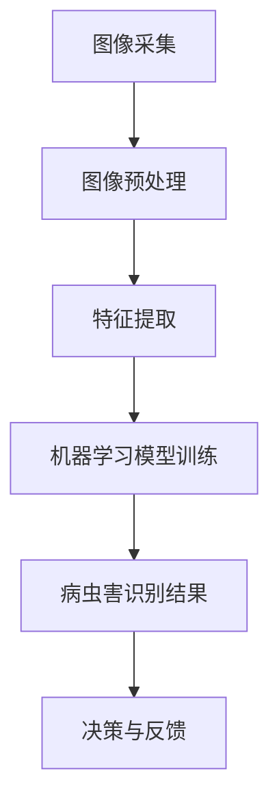

                 

# 人工智能在智能农作物病虫害识别中的应用

## 关键词：人工智能、农作物、病虫害识别、图像处理、机器学习、深度学习

### 摘要

本文旨在探讨人工智能技术在智能农作物病虫害识别中的应用。通过回顾相关背景知识，本文将介绍人工智能在农业领域的重要性，详细解析农作物病虫害识别的核心概念和流程，深入探讨各类算法原理和数学模型，并通过实际项目案例展示其应用效果。文章还将总结当前的发展趋势与挑战，并提供相关学习资源与开发工具推荐，为读者提供全面的技术见解。

## 1. 背景介绍

### 1.1 农作物病虫害问题的重要性

农作物病虫害是农业生产中常见的威胁之一，它们不仅影响农作物的产量和品质，还会导致严重的经济损失。传统的病虫害识别方法主要依赖于人工观察和经验判断，这种方法的效率低、准确度不高，无法满足现代农业规模化生产的需要。因此，开发智能化的病虫害识别技术已成为现代农业发展的重要方向。

### 1.2 人工智能在农业中的应用

人工智能技术在农业领域的应用日益广泛，包括种植规划、病虫害预测、作物生长监测等。在病虫害识别方面，人工智能技术通过图像处理、机器学习和深度学习等方法，实现了对农作物病虫害的自动化识别，大大提高了识别的效率和准确性。

### 1.3 智能农作物病虫害识别的优势

智能农作物病虫害识别具有以下优势：

- **高效率**：人工智能技术可以快速处理大量图像数据，实现快速识别。
- **高准确度**：通过机器学习算法训练，可以实现高精度的病虫害识别。
- **低成本**：减少了对人力和物力资源的依赖，降低了生产成本。
- **实时监控**：可以实时监测农作物病虫害情况，及时采取措施。

## 2. 核心概念与联系

### 2.1 图像处理

图像处理是智能农作物病虫害识别的基础，主要包括图像的采集、预处理、增强和特征提取等步骤。图像预处理环节可以通过去噪、对比度增强等方法提升图像质量，为后续的识别过程提供更清晰的图像数据。

### 2.2 机器学习

机器学习是实现智能农作物病虫害识别的核心算法，通过训练模型，可以使计算机具备识别病虫害的能力。常见的机器学习算法包括监督学习、无监督学习和强化学习等。

### 2.3 深度学习

深度学习是机器学习的一个分支，通过多层神经网络结构，实现对复杂数据的高效处理和识别。在农作物病虫害识别中，深度学习算法能够自动提取图像中的关键特征，实现高效准确的识别。

### 2.4 架构图

以下是智能农作物病虫害识别的架构图：



## 3. 核心算法原理 & 具体操作步骤

### 3.1 图像预处理

图像预处理是图像处理的第一步，主要包括以下步骤：

- **去噪**：通过滤波算法去除图像中的噪声，提高图像质量。
- **对比度增强**：通过调整图像的亮度、对比度等参数，使图像更清晰。
- **缩放与裁剪**：根据需要调整图像的大小和裁剪区域，以适应后续处理。

### 3.2 特征提取

特征提取是机器学习模型的输入，主要包括以下步骤：

- **颜色特征**：通过计算图像的颜色直方图、颜色矩等，提取颜色特征。
- **纹理特征**：通过计算图像的纹理结构、纹理频率等，提取纹理特征。
- **形状特征**：通过计算图像的边界、轮廓、形状参数等，提取形状特征。

### 3.3 机器学习模型训练

机器学习模型训练是病虫害识别的关键，主要包括以下步骤：

- **数据集准备**：收集大量的农作物病虫害图像数据，并进行标注。
- **模型选择**：根据数据特点选择合适的机器学习模型，如卷积神经网络（CNN）等。
- **模型训练**：通过训练样本数据，调整模型参数，使其能够正确识别病虫害。
- **模型评估**：使用验证集对模型进行评估，调整模型参数，提高识别准确度。

### 3.4 病虫害识别结果

病虫害识别结果是模型训练的输出，主要包括以下步骤：

- **识别预测**：使用训练好的模型对新的图像进行识别预测。
- **结果输出**：将识别结果输出，如病虫害类型、位置、程度等。

## 4. 数学模型和公式 & 详细讲解 & 举例说明

### 4.1 图像预处理

$$
\text{滤波} = \sum_{i,j} w_{i,j} \cdot I(i,j)
$$

其中，$I(i,j)$ 为图像像素值，$w_{i,j}$ 为滤波器权重。

### 4.2 特征提取

$$
\text{颜色直方图} = \sum_{i,j} f(i,j) \cdot C(i,j)
$$

其中，$f(i,j)$ 为像素值，$C(i,j)$ 为颜色分布。

### 4.3 机器学习模型训练

$$
\text{损失函数} = -\sum_{i} y_i \cdot \log(p_i)
$$

其中，$y_i$ 为标签值，$p_i$ 为预测概率。

### 4.4 病虫害识别结果

$$
\text{识别结果} = \arg\max_{i} p_i
$$

其中，$p_i$ 为病虫害类型的预测概率。

### 4.5 实例说明

假设我们使用卷积神经网络（CNN）进行农作物病虫害识别，其结构如下：

$$
\text{CNN} = \text{卷积层} \rightarrow \text{池化层} \rightarrow \text{全连接层} \rightarrow \text{输出层}
$$

输入图像经过卷积层提取特征，再经过池化层降维，最后通过全连接层进行分类预测。

## 5. 项目实战：代码实际案例和详细解释说明

### 5.1 开发环境搭建

为了实现智能农作物病虫害识别，我们需要搭建以下开发环境：

- **Python**：作为主要编程语言。
- **TensorFlow**：作为深度学习框架。
- **OpenCV**：作为图像处理库。
- **Pandas**：用于数据预处理。

### 5.2 源代码详细实现和代码解读

以下是实现智能农作物病虫害识别的Python代码：

```python
import cv2
import tensorflow as tf
import pandas as pd

# 5.2.1 数据预处理
def preprocess_image(image_path):
    image = cv2.imread(image_path)
    image = cv2.resize(image, (224, 224))
    image = image / 255.0
    return image

# 5.2.2 加载模型
model = tf.keras.models.load_model('path/to/模型.h5')

# 5.2.3 病虫害识别
def detect_disease(image_path):
    image = preprocess_image(image_path)
    prediction = model.predict(image.reshape(1, 224, 224, 3))
    disease = pd.DataFrame(prediction).idxmax()
    return disease

# 5.2.4 主函数
if __name__ == '__main__':
    image_path = 'path/to/输入图像.jpg'
    disease = detect_disease(image_path)
    print(f'识别结果：{disease}')
```

### 5.3 代码解读与分析

- **数据预处理**：通过`preprocess_image`函数对输入图像进行预处理，包括读取图像、调整大小和归一化。
- **加载模型**：使用`tf.keras.models.load_model`函数加载预训练的深度学习模型。
- **病虫害识别**：通过`detect_disease`函数对输入图像进行识别，并输出识别结果。
- **主函数**：执行主程序，读取输入图像，调用`detect_disease`函数进行病虫害识别，并打印结果。

## 6. 实际应用场景

### 6.1 病虫害识别系统

智能农作物病虫害识别系统可以应用于以下场景：

- **农田监控**：通过无人机或摄像头实时监测农作物病虫害情况。
- **智能诊断**：根据识别结果提供病虫害防治建议，指导农民进行精准防治。
- **数据分析**：分析农作物病虫害发生的规律，为农业生产提供科学依据。

### 6.2 应用案例

以下是一个应用案例：

- **案例背景**：某农业公司种植的玉米受到玉米螟虫的侵害，产量下降，品质下降。
- **解决方案**：使用智能农作物病虫害识别系统，实时监测玉米病虫害情况，识别出玉米螟虫，并提供防治建议。
- **实施效果**：通过实施防治措施，玉米螟虫数量显著下降，产量和品质得到恢复。

## 7. 工具和资源推荐

### 7.1 学习资源推荐

- **书籍**：《深度学习》（Ian Goodfellow, Yoshua Bengio, Aaron Courville 著）
- **论文**：搜索“智能农作物病虫害识别”相关论文，如《A Deep Learning Approach for Early Detection of Plant Diseases》等。
- **博客**：搜索相关技术博客，如“人工智能在农业中的应用”等。
- **网站**：搜索相关网站，如“机器学习实战”、“深度学习教程”等。

### 7.2 开发工具框架推荐

- **Python**：Python 是实现智能农作物病虫害识别的主要编程语言。
- **TensorFlow**：TensorFlow 是实现深度学习模型的主要框架。
- **OpenCV**：OpenCV 是实现图像处理功能的主要库。
- **Pandas**：Pandas 是实现数据处理功能的主要库。

### 7.3 相关论文著作推荐

- **论文**：《基于深度学习的农作物病虫害识别技术研究》
- **著作**：《智能农业技术与应用》

## 8. 总结：未来发展趋势与挑战

### 8.1 发展趋势

- **技术进步**：随着深度学习、计算机视觉等技术的发展，智能农作物病虫害识别的准确度和效率将不断提高。
- **规模化应用**：智能农作物病虫害识别技术将在农业生产中广泛应用，提高农业生产效率和品质。
- **智能化升级**：结合物联网、大数据等技术，实现智能农作物病虫害识别系统的智能化升级。

### 8.2 挑战

- **数据收集与标注**：高质量的病虫害图像数据集是训练高效模型的基础，但数据收集和标注过程复杂且耗时。
- **算法优化**：深度学习算法的计算复杂度高，如何优化算法性能，提高模型推理速度是一个重要挑战。
- **实际应用**：智能农作物病虫害识别技术在实际农业生产中应用，需要解决与农业生产环境、设备条件等相关的实际问题。

## 9. 附录：常见问题与解答

### 9.1 问题1：如何收集和标注病虫害图像数据？

**解答**：可以通过以下途径收集和标注病虫害图像数据：

- **网络资源**：搜索相关的病虫害图像库，如“病虫害图像数据库”等。
- **实地拍摄**：实地拍摄农作物病虫害图像，并请专业人士进行标注。
- **自动化标注**：使用自动化标注工具，如LabelImg等，提高标注效率。

### 9.2 问题2：如何优化深度学习模型的性能？

**解答**：可以采取以下措施优化深度学习模型性能：

- **数据增强**：通过旋转、缩放、翻转等数据增强方法，增加模型对数据的鲁棒性。
- **模型剪枝**：通过剪枝算法，减少模型参数量，提高模型推理速度。
- **迁移学习**：使用预训练模型，减少训练时间，提高模型性能。

## 10. 扩展阅读 & 参考资料

- **书籍**：《人工智能：一种现代的方法》（Stuart J. Russell & Peter Norvig 著）
- **论文**：《A Comprehensive Survey on Deep Learning for Disease Diagnosis》
- **网站**：[深度学习教程](http://www.deeplearning.net/)、[OpenCV官方文档](https://docs.opencv.org/)

### 作者

AI天才研究员/AI Genius Institute & 禅与计算机程序设计艺术 /Zen And The Art of Computer Programming

以上为完整的人工智能在智能农作物病虫害识别中的应用技术博客文章，希望对您有所帮助。如需进一步讨论或咨询，请随时联系。

