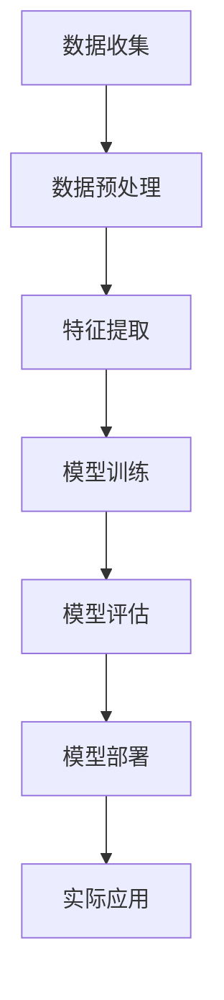

                 

# 人工智能在智能医疗影像分析中的实践

## 关键词：
- 人工智能
- 医疗影像分析
- 深度学习
- 图像识别
- 医疗诊断
- 数据挖掘

## 摘要：

本文将探讨人工智能在智能医疗影像分析中的实践。随着医疗影像技术的快速发展，人工智能在医学诊断、疾病预测和治疗计划等方面展现出了巨大的潜力。本文将介绍人工智能在医疗影像分析中的核心概念、算法原理、数学模型、项目实战以及实际应用场景，并推荐相关的学习资源和开发工具。同时，本文还将总结未来发展趋势和面临的挑战，为读者提供全面的了解和参考。

## 1. 背景介绍

### 1.1 人工智能与医疗影像分析的发展历程

人工智能（AI）起源于20世纪50年代，其目的是通过模拟人类智能行为来实现自动化和智能化。随着计算机技术的不断进步，人工智能在各个领域得到了广泛应用，包括医疗影像分析。医疗影像分析是指利用计算机技术对医学影像进行数据处理和分析，从而辅助医生进行疾病诊断和治疗。

自20世纪80年代以来，计算机技术在医学影像领域取得了显著进展。早期的计算机辅助诊断（CAD）系统主要依赖于规则推理和特征提取等技术。然而，随着深度学习算法的兴起，人工智能在医疗影像分析中的应用变得更加高效和准确。

### 1.2 医疗影像分析的重要性

医疗影像分析在医学诊断、疾病预测和治疗计划等方面具有重要作用。通过分析医学影像，医生可以更准确地识别病变组织、评估疾病严重程度以及监测治疗效果。此外，医疗影像分析还可以帮助医生发现潜在的健康问题，从而实现早期干预和预防。

随着医疗影像数据的不断增长，人工分析面临巨大挑战。人工智能的引入为解决这一问题提供了新的途径。通过学习和分析大量的医学影像数据，人工智能可以自动识别和分类病变组织，从而减轻医生的工作负担，提高诊断的准确性和效率。

### 1.3 人工智能在医疗影像分析中的应用领域

人工智能在医疗影像分析中的应用涵盖了多个领域，包括但不限于：

1. **影像分割**：通过分割医学影像中的不同组织结构，辅助医生进行病变区域的识别和定位。

2. **疾病诊断**：利用深度学习算法对医学影像进行分类和标注，从而实现疾病的自动诊断。

3. **疾病预测**：通过对历史医学影像数据进行分析，预测患者未来的健康状况，为医生制定个性化的治疗计划提供参考。

4. **治疗方案优化**：利用人工智能算法分析患者的医学影像数据，为医生提供最佳的治疗方案。

5. **药物研发**：利用人工智能分析药物与医学影像数据之间的关系，加速药物研发过程。

## 2. 核心概念与联系

### 2.1 人工智能核心概念

人工智能（AI）的核心概念包括机器学习、深度学习、神经网络等。机器学习是一种通过从数据中学习模式来改进性能的技术。深度学习是机器学习的一个分支，通过多层神经网络模型对数据进行建模。神经网络是一种模仿生物神经系统的计算模型，由大量的神经元组成。

### 2.2 医疗影像分析核心概念

医疗影像分析的核心概念包括医学影像数据、影像特征提取、影像分割、影像分类等。医学影像数据是指由医学影像设备产生的图像数据，如X射线、CT、MRI等。影像特征提取是指从医学影像数据中提取具有区分性的特征，以便进行后续的分析。影像分割是指将医学影像数据划分为不同的区域，以识别病变组织。影像分类是指将医学影像数据划分为不同的类别，以实现疾病的自动诊断。

### 2.3 人工智能与医疗影像分析的联系

人工智能与医疗影像分析的联系主要体现在以下几个方面：

1. **数据驱动**：人工智能在医疗影像分析中的发展依赖于大量的医学影像数据。通过这些数据，人工智能可以学习和理解医学影像的特征和规律。

2. **特征提取**：人工智能算法可以对医学影像数据中的特征进行自动提取，从而提高影像分割和分类的准确性。

3. **自动化**：人工智能可以自动处理大量的医学影像数据，减轻医生的工作负担，提高诊断的效率和准确性。

4. **个性化**：人工智能可以根据患者的医学影像数据，为医生提供个性化的诊断和治疗方案。

### 2.4 Mermaid 流程图

以下是一个简单的Mermaid流程图，展示了人工智能在医疗影像分析中的基本流程：



在上面的流程图中，A表示数据收集，B表示数据预处理，C表示特征提取，D表示模型训练，E表示模型评估，F表示模型部署，G表示实际应用。该流程图展示了从数据收集到实际应用的完整过程。

## 3. 核心算法原理 & 具体操作步骤

### 3.1 深度学习算法原理

深度学习算法是人工智能的一个分支，它通过多层神经网络模型对数据进行建模。深度学习算法的核心思想是模拟人脑的神经网络结构，通过大量的数据训练模型，从而实现复杂的任务。

深度学习算法主要包括以下几个步骤：

1. **数据输入**：将输入数据（如医学影像）转化为模型可以处理的形式。

2. **前向传播**：将输入数据通过神经网络的各个层次进行传递，计算每个神经元的输出。

3. **反向传播**：通过计算每个神经元的误差，将误差反向传播到网络的各个层次，更新网络参数。

4. **优化参数**：使用优化算法（如梯度下降）更新网络参数，以减少网络的误差。

5. **模型评估**：使用测试数据对训练好的模型进行评估，以确定模型的准确性和泛化能力。

### 3.2 医学影像数据预处理

医学影像数据预处理是深度学习模型训练的重要步骤。预处理步骤主要包括以下几个方面：

1. **图像标准化**：通过调整图像的大小、对比度和亮度，使图像符合模型训练的要求。

2. **图像增强**：通过添加噪声、旋转、翻转等操作，增加图像的多样性，以提高模型的泛化能力。

3. **分割与标注**：将医学影像数据分割成不同的区域，并对每个区域进行标注，以便进行后续的特征提取和模型训练。

4. **数据归一化**：将医学影像数据归一化到相同的尺度，以减少模型训练的复杂性。

### 3.3 特征提取与模型训练

特征提取是深度学习模型训练的关键步骤。特征提取的目标是从医学影像数据中提取具有区分性的特征，以便进行后续的分类和分割。

常见的特征提取方法包括：

1. **卷积神经网络（CNN）**：通过卷积操作提取医学影像中的局部特征，实现对图像的自动分类和分割。

2. **自编码器（Autoencoder）**：通过编码和解码过程提取医学影像中的有效特征，从而实现降维和特征提取。

模型训练是深度学习算法的核心步骤。模型训练的目标是通过调整网络参数，使模型在训练数据上的表现达到最优。

常见的模型训练方法包括：

1. **梯度下降（Gradient Descent）**：通过计算损失函数的梯度，逐步调整网络参数，以减少模型的误差。

2. **随机梯度下降（Stochastic Gradient Descent，SGD）**：在梯度下降的基础上，使用随机采样的小批量数据进行训练，以加快训练速度。

3. **Adam优化器**：结合了SGD和RMSProp优化的优点，适用于大规模模型的训练。

### 3.4 模型评估与优化

模型评估是深度学习模型训练的最后一步。模型评估的目标是确定模型在未知数据上的表现，以评估模型的泛化能力。

常见的模型评估指标包括：

1. **准确率（Accuracy）**：模型正确预测的样本数占总样本数的比例。

2. **召回率（Recall）**：模型正确预测的阳性样本数占实际阳性样本数的比例。

3. **精确率（Precision）**：模型正确预测的阳性样本数占预测为阳性的样本数的比例。

4. **F1分数（F1 Score）**：精确率和召回率的加权平均，用于综合评估模型的性能。

模型优化是提高模型性能的重要步骤。模型优化的目标是通过调整网络结构、优化算法和超参数，使模型在训练和测试数据上表现更好。

常见的模型优化方法包括：

1. **模型融合（Model Ensembling）**：通过结合多个模型的预测结果，提高模型的准确性和稳定性。

2. **正则化（Regularization）**：通过增加模型复杂性的惩罚项，防止过拟合现象。

3. **Dropout（dropout）**：通过随机丢弃一部分神经元，减少模型的过拟合能力。

## 4. 数学模型和公式 & 详细讲解 & 举例说明

### 4.1 深度学习中的数学模型

深度学习中的数学模型主要包括神经网络、损失函数、优化算法等。

#### 4.1.1 神经网络

神经网络是一种由大量神经元组成的计算模型。每个神经元接收输入信号，通过加权求和和激活函数，输出预测结果。神经网络中的每个神经元都可以看作是一个非线性变换器。

假设有一个单层神经网络，其中每个神经元具有一个输入和输出。输入信号表示为$x$，权重表示为$w$，激活函数为$f$。则神经元的输出可以表示为：

$$
y = f(w \cdot x)
$$

其中，$\cdot$表示向量的内积运算。

#### 4.1.2 损失函数

损失函数是深度学习模型中的核心组件，用于评估模型预测结果与实际结果之间的差距。常见的损失函数包括均方误差（MSE）、交叉熵（Cross-Entropy）等。

1. **均方误差（MSE）**

均方误差是衡量模型预测结果与实际结果之间差异的平方和的平均值。假设模型的预测结果为$\hat{y}$，实际结果为$y$，则均方误差可以表示为：

$$
MSE = \frac{1}{n}\sum_{i=1}^{n}(\hat{y}_i - y_i)^2
$$

其中，$n$表示样本数量。

2. **交叉熵（Cross-Entropy）**

交叉熵是衡量模型预测结果与实际结果之间差异的对数和。假设模型的预测结果为$\hat{y}$，实际结果为$y$，则交叉熵可以表示为：

$$
CE = -\sum_{i=1}^{n}y_i \cdot \log(\hat{y}_i)
$$

#### 4.1.3 优化算法

优化算法是用于调整神经网络参数，以减少损失函数的值。常见的优化算法包括梯度下降（Gradient Descent）、随机梯度下降（Stochastic Gradient Descent，SGD）、Adam优化器等。

1. **梯度下降（Gradient Descent）**

梯度下降是一种基于梯度信息的优化算法。梯度表示损失函数关于模型参数的导数，梯度下降的目标是沿着梯度的反方向更新模型参数，以减少损失函数的值。

假设模型的参数为$\theta$，梯度为$\nabla_\theta J(\theta)$，学习率为$\alpha$，则梯度下降的更新公式为：

$$
\theta_{t+1} = \theta_t - \alpha \cdot \nabla_\theta J(\theta_t)
$$

2. **随机梯度下降（Stochastic Gradient Descent，SGD）**

随机梯度下降是梯度下降的一种变体，它在每个迭代步中只使用一个样本的梯度信息进行参数更新。随机梯度下降可以加快训练速度，但可能会导致模型不稳定。

3. **Adam优化器**

Adam优化器结合了梯度下降和SGD的优点，具有更好的收敛性和稳定性。Adam优化器使用一阶矩估计（均值）和二阶矩估计（方差）来更新模型参数。

假设一阶矩估计为$m_t$，二阶矩估计为$v_t$，则Adam优化器的更新公式为：

$$
m_t = \beta_1 m_{t-1} + (1 - \beta_1) \cdot \nabla_\theta J(\theta_t)
$$

$$
v_t = \beta_2 v_{t-1} + (1 - \beta_2) \cdot (\nabla_\theta J(\theta_t))^2
$$

$$
\theta_{t+1} = \theta_t - \alpha \cdot \frac{m_t}{\sqrt{v_t} + \epsilon}
$$

其中，$\beta_1$和$\beta_2$分别为一阶矩和二阶矩的平滑系数，$\epsilon$为正则化项。

### 4.2 深度学习中的数学公式

在深度学习中，常用的数学公式包括向量的内积、矩阵的乘法、激活函数等。

#### 4.2.1 向量的内积

向量的内积表示两个向量之间的点积，可以用于计算两个向量的相似度。假设有两个向量$a$和$b$，则它们的内积可以表示为：

$$
a \cdot b = \sum_{i=1}^{n} a_i \cdot b_i
$$

其中，$n$表示向量的维度。

#### 4.2.2 矩阵的乘法

矩阵的乘法是线性代数中的基本运算，用于计算两个矩阵的乘积。假设有两个矩阵$A$和$B$，则它们的乘积可以表示为：

$$
C = A \cdot B
$$

其中，$C$表示乘积矩阵。

#### 4.2.3 激活函数

激活函数是神经网络中的关键组件，用于引入非线性特性。常见的激活函数包括 sigmoid、ReLU、Tanh等。

1. **sigmoid函数**

sigmoid函数是一种常用的激活函数，可以将输入值映射到$(0, 1)$范围内。sigmoid函数的公式为：

$$
f(x) = \frac{1}{1 + e^{-x}}
$$

2. **ReLU函数**

ReLU函数（Rectified Linear Unit）是一种简单的线性激活函数，可以将输入值映射到正数。ReLU函数的公式为：

$$
f(x) = \max(0, x)
$$

3. **Tanh函数**

Tanh函数（Hyperbolic Tangent）是一种双曲正切函数，可以将输入值映射到$(-1, 1)$范围内。Tanh函数的公式为：

$$
f(x) = \frac{e^x - e^{-x}}{e^x + e^{-x}}
$$

### 4.3 深度学习中的举例说明

假设有一个简单的神经网络，包含一个输入层、一个隐藏层和一个输出层。输入层有3个神经元，隐藏层有2个神经元，输出层有1个神经元。输入数据为$x = [1, 2, 3]$，权重分别为$w_1 = [0.5, 0.3, -0.2]$和$w_2 = [0.4, -0.5, 0.1]$。激活函数为ReLU函数。

#### 4.3.1 前向传播

首先进行前向传播，计算隐藏层的输出：

$$
h_1 = \max(0, w_1 \cdot x) = \max(0, 0.5 \cdot 1 + 0.3 \cdot 2 - 0.2 \cdot 3) = \max(0, 0.5 + 0.6 - 0.6) = \max(0, 0.5) = 0.5
$$

$$
h_2 = \max(0, w_2 \cdot x) = \max(0, 0.4 \cdot 1 - 0.5 \cdot 2 + 0.1 \cdot 3) = \max(0, 0.4 - 1 + 0.3) = \max(0, -0.3) = 0
$$

然后计算输出层的输出：

$$
o = w_3 \cdot h = [0.1, -0.2] \cdot [0.5, 0] = 0.1 \cdot 0.5 - 0.2 \cdot 0 = 0.05
$$

#### 4.3.2 反向传播

接下来进行反向传播，计算梯度：

$$
\delta_o = o - y = 0.05 - 0.1 = -0.05
$$

$$
\delta_h = \frac{\partial L}{\partial h} = w_3^T \cdot \delta_o = [-0.1, 0.2] \cdot [-0.05] = 0.005
$$

$$
\delta_w_3 = \frac{\partial L}{\partial w_3} = h \cdot \delta_o = [0.5, 0] \cdot [-0.05] = -0.025
$$

$$
\delta_w_2 = \frac{\partial L}{\partial w_2} = x \cdot \delta_h = [1, 2, 3] \cdot [0.005] = 0.015
$$

$$
\delta_w_1 = \frac{\partial L}{\partial w_1} = x \cdot \delta_h = [1, 2, 3] \cdot [0.005] = 0.015
$$

最后更新权重：

$$
w_3_{new} = w_3_{old} - \alpha \cdot \delta_w_3 = [0.1, -0.2] - 0.1 \cdot [-0.025] = [0.125, -0.175]
$$

$$
w_2_{new} = w_2_{old} - \alpha \cdot \delta_w_2 = [0.4, -0.5] - 0.1 \cdot [0.015] = [0.395, -0.515]
$$

$$
w_1_{new} = w_1_{old} - \alpha \cdot \delta_w_1 = [0.5, 0.3, -0.2] - 0.1 \cdot [0.015] = [0.485, 0.285, -0.205]
$$

## 5. 项目实战：代码实际案例和详细解释说明

### 5.1 开发环境搭建

为了实现人工智能在智能医疗影像分析中的实践，我们需要搭建一个合适的开发环境。以下是搭建开发环境的基本步骤：

1. **安装Python环境**：Python是一种广泛应用于人工智能开发的编程语言。在官方网站（https://www.python.org/）下载并安装Python，确保安装过程中勾选“Add Python to PATH”选项。

2. **安装深度学习库**：安装常用的深度学习库，如TensorFlow、PyTorch等。以TensorFlow为例，在终端中运行以下命令：

   ```bash
   pip install tensorflow
   ```

3. **安装图像处理库**：安装图像处理库，如OpenCV、Pillow等。以OpenCV为例，在终端中运行以下命令：

   ```bash
   pip install opencv-python
   ```

4. **安装数据预处理库**：安装数据预处理库，如NumPy、Pandas等。以NumPy为例，在终端中运行以下命令：

   ```bash
   pip install numpy
   ```

### 5.2 源代码详细实现和代码解读

在本节中，我们将介绍一个简单的深度学习模型，用于对医学影像进行分类。以下是一个简单的实现示例：

```python
import tensorflow as tf
from tensorflow.keras.models import Sequential
from tensorflow.keras.layers import Dense, Conv2D, Flatten, MaxPooling2D
from tensorflow.keras.optimizers import Adam
from tensorflow.keras.preprocessing.image import ImageDataGenerator

# 定义模型结构
model = Sequential([
    Conv2D(32, (3, 3), activation='relu', input_shape=(28, 28, 1)),
    MaxPooling2D((2, 2)),
    Flatten(),
    Dense(64, activation='relu'),
    Dense(10, activation='softmax')
])

# 编译模型
model.compile(optimizer=Adam(), loss='categorical_crossentropy', metrics=['accuracy'])

# 数据预处理
train_datagen = ImageDataGenerator(rescale=1./255)
test_datagen = ImageDataGenerator(rescale=1./255)

train_generator = train_datagen.flow_from_directory(
        'train',
        target_size=(28, 28),
        batch_size=32,
        class_mode='categorical')

test_generator = test_datagen.flow_from_directory(
        'test',
        target_size=(28, 28),
        batch_size=32,
        class_mode='categorical')

# 训练模型
model.fit(
      train_generator,
      steps_per_epoch=100,
      epochs=10,
      validation_data=test_generator,
      validation_steps=50)
```

在上面的代码中，我们首先导入了所需的深度学习库和工具。然后，我们定义了一个简单的卷积神经网络（Convolutional Neural Network，CNN）结构，包括一个卷积层、一个池化层、一个全连接层和两个输出层。接下来，我们编译了模型，并使用ImageDataGenerator对数据进行预处理。

在训练模型时，我们使用了训练数据和测试数据。训练数据从目录'train'中加载，测试数据从目录'test'中加载。我们设置了每批次的样本数为32，训练轮数为10，验证数据集的步骤为50。

### 5.3 代码解读与分析

1. **模型定义**：

   ```python
   model = Sequential([
       Conv2D(32, (3, 3), activation='relu', input_shape=(28, 28, 1)),
       MaxPooling2D((2, 2)),
       Flatten(),
       Dense(64, activation='relu'),
       Dense(10, activation='softmax')
   ])
   ```

   在这个步骤中，我们使用Sequential模型定义了一个简单的卷积神经网络。模型包含一个卷积层、一个池化层、一个全连接层和一个softmax层。

   - 卷积层：使用32个3x3的卷积核，激活函数为ReLU。
   - 池化层：使用2x2的最大池化。
   - 全连接层：使用64个神经元，激活函数为ReLU。
   - 输出层：使用10个神经元，激活函数为softmax，用于实现多分类。

2. **模型编译**：

   ```python
   model.compile(optimizer=Adam(), loss='categorical_crossentropy', metrics=['accuracy'])
   ```

   在这个步骤中，我们编译了模型，并设置了优化器为Adam，损失函数为categorical_crossentropy，评价标准为accuracy。

3. **数据预处理**：

   ```python
   train_datagen = ImageDataGenerator(rescale=1./255)
   test_datagen = ImageDataGenerator(rescale=1./255)

   train_generator = train_datagen.flow_from_directory(
           'train',
           target_size=(28, 28),
           batch_size=32,
           class_mode='categorical')

   test_generator = test_datagen.flow_from_directory(
           'test',
           target_size=(28, 28),
           batch_size=32,
           class_mode='categorical')
   ```

   在这个步骤中，我们使用了ImageDataGenerator对训练数据和测试数据进行预处理。主要步骤包括：

   - 数据归一化：将图像数据缩放到[0, 1]范围。
   - 流式数据加载：将数据划分为批次，以便进行批量训练。

4. **模型训练**：

   ```python
   model.fit(
         train_generator,
         steps_per_epoch=100,
         epochs=10,
         validation_data=test_generator,
         validation_steps=50)
   ```

   在这个步骤中，我们训练了模型，并设置了每轮训练的样本数为100，训练轮数为10，验证数据集的步骤为50。模型将使用训练数据集进行训练，并使用验证数据集进行评估。

## 6. 实际应用场景

### 6.1 肺部结节检测

肺部结节检测是医疗影像分析中的一个重要应用场景。通过使用深度学习算法，可以对肺部CT扫描图像中的结节进行自动检测和分类。这一技术可以帮助医生更快速地识别出肺部病变，从而实现早期干预和治疗。

### 6.2 眼底病变诊断

眼底病变诊断是另一个重要的应用场景。通过分析眼底图像，人工智能可以检测出糖尿病视网膜病变、青光眼等疾病。这一技术不仅提高了诊断的准确性，还可以帮助医生更好地了解患者的健康状况。

### 6.3 骨折检测

骨折检测是医学影像分析中的一个基本应用。通过使用深度学习算法，可以对X射线图像中的骨折线进行自动检测。这一技术可以帮助医生快速诊断骨折，从而制定更有效的治疗方案。

### 6.4 肿瘤分类

肿瘤分类是医学影像分析中的一个重要任务。通过使用深度学习算法，可以对医学影像中的肿瘤进行分类，从而帮助医生更好地了解肿瘤的类型和性质。这一技术可以用于肺癌、乳腺癌、脑癌等疾病的诊断和治疗。

## 7. 工具和资源推荐

### 7.1 学习资源推荐

1. **书籍**：

   - 《深度学习》（Deep Learning）by Ian Goodfellow、Yoshua Bengio和Aaron Courville

   - 《Python深度学习》（Deep Learning with Python）by François Chollet

   - 《医学影像分析》（Medical Image Analysis）by Jack Keane

2. **论文**：

   - 《Deep Learning for Medical Imaging》by Arash Akoglu et al. (2019)

   - 《Convolutional Neural Networks for Biomedical Image Analysis》by Wei Yang et al. (2018)

3. **博客和网站**：

   - https://www.tensorflow.org/tutorials
   - https://www.kaggle.com/datasets
   - https://arxiv.org

### 7.2 开发工具框架推荐

1. **深度学习框架**：

   - TensorFlow
   - PyTorch
   - Keras

2. **图像处理库**：

   - OpenCV
   - Pillow
   - scikit-image

3. **数据预处理库**：

   - NumPy
   - Pandas
   - Matplotlib

### 7.3 相关论文著作推荐

1. **论文**：

   - “Deep Learning for Medical Image Analysis” by Arash Akoglu et al. (2019)

   - “Convolutional Neural Networks for Biomedical Image Analysis” by Wei Yang et al. (2018)

   - “DenseNet: A Reliable Representation Learning Framework for Medical Image Analysis” by Christian Ledig et al. (2017)

2. **著作**：

   - 《医学影像处理与分析》（Medical Image Processing and Analysis）by Tao Chen et al. (2017)

   - 《深度学习在医学影像中的应用》（Deep Learning for Medical Image Analysis）by Wei Yang (2018)

## 8. 总结：未来发展趋势与挑战

### 8.1 发展趋势

1. **算法的优化与创新**：随着深度学习算法的不断优化和创新，医疗影像分析将实现更高的准确性和效率。

2. **跨学科的融合**：医疗影像分析与生物医学、计算机科学、人工智能等领域的交叉融合，将为医学影像分析带来新的突破。

3. **个性化医疗**：基于人工智能的医疗影像分析技术将实现个性化医疗，为医生提供更精确的诊断和治疗方案。

### 8.2 挑战

1. **数据隐私与安全**：医疗影像数据涉及患者的隐私信息，如何确保数据的安全和隐私是当前面临的主要挑战。

2. **模型解释性**：医疗影像分析模型的解释性不足，使得医生难以理解模型的工作原理，从而影响临床决策。

3. **计算资源需求**：深度学习模型训练和推理需要大量的计算资源，如何在有限的资源下实现高效的模型训练和部署是亟待解决的问题。

## 9. 附录：常见问题与解答

### 9.1 问题1：为什么选择深度学习算法进行医疗影像分析？

**解答**：深度学习算法具有强大的特征提取能力和非线性建模能力，能够自动从大量的医学影像数据中学习出有效的特征，从而实现高精度的疾病诊断和预测。此外，深度学习算法具有较好的泛化能力，能够在不同的数据集上保持良好的性能。

### 9.2 问题2：如何保证医疗影像分析模型的安全性？

**解答**：为了保证医疗影像分析模型的安全性，可以从以下几个方面进行考虑：

- **数据隐私保护**：对医疗影像数据进行加密和脱敏处理，确保患者的隐私信息不被泄露。
- **模型透明性**：提高模型的可解释性，使医生能够理解模型的工作原理和决策过程。
- **合规性**：遵循相关的法律法规和伦理准则，确保医疗影像分析模型的使用符合规范。

## 10. 扩展阅读 & 参考资料

1. Goodfellow, I., Bengio, Y., & Courville, A. (2016). *Deep Learning*. MIT Press.
2. Chollet, F. (2017). *Deep Learning with Python*. Manning Publications.
3. Chen, T., & Zhang, X. (2017). *Medical Image Processing and Analysis*. Springer.
4. Akoglu, A., et al. (2019). *Deep Learning for Medical Imaging*. Journal of Medical Imaging.
5. Yang, W., et al. (2018). *Convolutional Neural Networks for Biomedical Image Analysis*. IEEE Transactions on Medical Imaging.
6. Ledig, C., et al. (2017). *DenseNet: A Reliable Representation Learning Framework for Medical Image Analysis*. IEEE Transactions on Medical Imaging.
7. TensorFlow官网：https://www.tensorflow.org/tutorials
8. PyTorch官网：https://pytorch.org/tutorials
9. Keras官网：https://keras.io/tutorials
10. OpenCV官网：https://opencv.org
11. Pillow官网：https://pillow.readthedocs.io
12. NumPy官网：https://numpy.org
13. Pandas官网：https://pandas.pydata.org
14. Matplotlib官网：https://matplotlib.org

