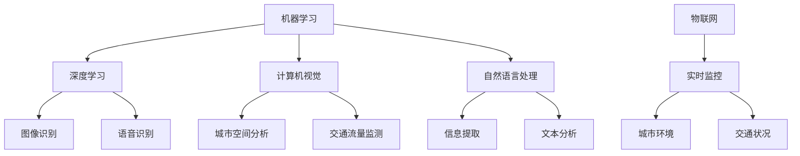

                 

# 人工智能在智能城市规划中的应用

## 摘要

本文主要探讨了人工智能技术在智能城市规划中的应用。随着城市化进程的加速，城市规模不断扩大，城市规划和管理的复杂性也随之增加。人工智能作为一项颠覆性的技术，为解决城市规划中的诸多挑战提供了新的思路和方法。本文首先介绍了智能城市规划的背景和重要性，然后详细阐述了人工智能在智能城市规划中的核心概念、算法原理和实际应用场景。通过本文的阅读，读者将更好地理解人工智能技术在城市规划中的重要性和潜力。

## 1. 背景介绍

### 城市化进程与城市规划

城市化进程是现代社会发展的重要趋势。据统计，全球城市人口占总人口的比例已经从1900年的不到15%增长到2021年的近55%，预计到2050年，这一比例将接近70%。这一趋势不仅反映了人口从农村向城市的迁移，也体现了经济发展的需求和资源集聚的效应。城市作为经济发展的重要载体，其规划和管理成为政府和相关部门关注的重点。

城市规划是指在一定的空间范围内，综合考虑社会经济、自然环境、人口发展等多种因素，对城市的布局、功能、结构和发展方向进行系统规划的过程。城市规划的目的是通过科学的规划手段，优化城市空间结构，提高城市功能，促进城市的可持续发展。

### 智能城市规划的概念与目标

智能城市规划是指利用先进的信息技术，特别是人工智能技术，对城市规划和管理进行智能化提升的过程。智能城市规划的目标是构建高效、绿色、宜居、智能的城市体系，实现城市资源的高效利用和城市管理的智能化。

智能城市规划具有以下几个核心特点：

1. **数据的深度挖掘与整合**：智能城市规划依赖于大量的城市数据，包括地理信息、社会经济数据、环境数据等。通过数据挖掘和分析，可以更好地了解城市的发展趋势和问题，为规划决策提供科学依据。

2. **智能决策支持**：利用人工智能算法，可以对城市发展的各种方案进行模拟和评估，为决策者提供智能化的决策支持。

3. **实时监控与预警**：通过物联网技术，实现对城市运行状态的实时监控，及时发现和预警潜在的问题，如交通拥堵、环境污染等。

4. **优化城市管理与服务**：智能城市规划可以提升城市管理的效率，优化公共服务，如交通、医疗、教育等，提高市民的生活质量。

### 人工智能技术的重要性

人工智能技术在智能城市规划中的应用具有重要意义。首先，人工智能技术可以处理海量数据，从复杂的数据中提取有价值的信息，为城市规划提供数据支持。其次，人工智能技术可以模拟城市的发展趋势，预测未来的城市需求，为规划提供前瞻性指导。此外，人工智能技术还可以优化城市资源配置，提高城市运行效率，实现城市的可持续发展。

综上所述，智能城市规划是未来城市发展的重要方向，而人工智能技术作为智能城市规划的核心驱动力量，其应用前景十分广阔。接下来，本文将详细探讨人工智能在智能城市规划中的核心概念、算法原理和实际应用场景。

## 2. 核心概念与联系

### 人工智能技术的核心概念

在探讨人工智能在智能城市规划中的应用之前，首先需要了解人工智能技术的一些核心概念。以下是一些关键的概念和其相互关系：

#### **机器学习（Machine Learning）**

机器学习是人工智能的一个重要分支，它通过构建数学模型，从数据中自动发现规律和模式。在智能城市规划中，机器学习技术可以用于数据挖掘、预测分析和决策支持等。

#### **深度学习（Deep Learning）**

深度学习是机器学习的一个子领域，通过模拟人脑神经网络结构，实现复杂的特征提取和模式识别。深度学习在图像识别、语音识别、自然语言处理等领域取得了显著成果，也为智能城市规划提供了强大的技术支持。

#### **计算机视觉（Computer Vision）**

计算机视觉是人工智能的另一个重要分支，它致力于使计算机能够从图像或视频中提取有用的信息。在智能城市规划中，计算机视觉可以用于城市空间分析、交通流量监测、环境监测等。

#### **自然语言处理（Natural Language Processing）**

自然语言处理旨在使计算机能够理解和生成自然语言。在智能城市规划中，自然语言处理可以用于信息提取、文本分析、智能问答等。

#### **物联网（Internet of Things, IoT）**

物联网是通过传感器和通信技术将物理设备连接到互联网，实现设备的智能监控和管理。在智能城市规划中，物联网技术可以用于实时监控城市环境、交通状况等，为城市规划提供数据支持。

### **Mermaid 流程图表示核心概念和联系**

以下是一个用Mermaid绘制的流程图，展示了上述核心概念之间的联系：



### **具体应用场景说明**

- **图像识别与城市空间分析**：利用深度学习技术，可以实现对城市建筑、道路、绿地等元素的自动识别和分类，为城市空间规划提供数据支持。

- **自然语言处理与文本分析**：通过自然语言处理技术，可以提取和分析城市居民的意见和建议，为政府决策提供参考。

- **物联网实时监控**：通过物联网技术，可以实现对城市交通流量、空气质量等实时的监控，及时发现问题并采取相应措施。

通过上述核心概念和联系的分析，可以看出人工智能技术在智能城市规划中具有广泛的应用前景。接下来，本文将详细探讨人工智能在智能城市规划中的核心算法原理和具体操作步骤。

## 3. 核心算法原理 & 具体操作步骤

### 机器学习算法在智能城市规划中的应用

#### **监督学习（Supervised Learning）**

监督学习是机器学习中的一种方法，它通过已标记的数据集训练模型，然后使用这个模型对新的、未标记的数据进行预测。在智能城市规划中，监督学习算法可以用于交通流量预测、资源分配等。

**具体操作步骤**：

1. **数据收集**：收集城市交通流量数据，包括道路名称、交通流量、时间戳等。
2. **数据预处理**：清洗数据，去除噪声和异常值，对缺失值进行填充。
3. **特征提取**：从原始数据中提取有用特征，如高峰时段、工作日与周末等。
4. **模型训练**：选择适当的监督学习算法（如线性回归、决策树、支持向量机等），使用训练数据集进行模型训练。
5. **模型评估**：使用验证数据集对模型进行评估，调整模型参数以获得最佳性能。
6. **预测**：使用训练好的模型对新的交通流量数据进行预测。

#### **无监督学习（Unsupervised Learning）**

无监督学习是机器学习中的另一种方法，它不依赖于已标记的数据，而是通过分析数据本身的结构和模式来发现知识。在智能城市规划中，无监督学习算法可以用于城市空间布局优化、社区识别等。

**具体操作步骤**：

1. **数据收集**：收集城市空间数据，包括建筑物、道路、绿地等的位置信息。
2. **数据预处理**：清洗数据，去除噪声和异常值。
3. **特征提取**：从原始数据中提取有用特征，如建筑物高度、道路宽度、人口密度等。
4. **模型训练**：选择适当的无监督学习算法（如聚类算法、降维算法等），使用数据集进行模型训练。
5. **模式发现**：分析模型输出的结果，发现数据中的潜在模式和结构。
6. **优化**：根据分析结果，对城市空间布局进行优化。

### 深度学习算法在智能城市规划中的应用

#### **卷积神经网络（Convolutional Neural Network, CNN）**

卷积神经网络是一种专门用于图像识别和处理的深度学习模型。在智能城市规划中，CNN可以用于城市空间分析、交通流量监测等。

**具体操作步骤**：

1. **数据收集**：收集城市交通监控视频和图片数据。
2. **数据预处理**：对图像进行缩放、裁剪、翻转等操作，增加数据的多样性。
3. **特征提取**：使用CNN模型对图像进行特征提取，提取出图像中的关键信息。
4. **模型训练**：选择适当的CNN架构，如VGG、ResNet等，使用训练数据集进行模型训练。
5. **模型评估**：使用验证数据集对模型进行评估，调整模型参数以获得最佳性能。
6. **预测**：使用训练好的模型对新的交通监控数据进行预测。

#### **递归神经网络（Recurrent Neural Network, RNN）**

递归神经网络是一种用于处理序列数据的深度学习模型，特别适合用于时间序列预测。在智能城市规划中，RNN可以用于交通流量预测、人口增长预测等。

**具体操作步骤**：

1. **数据收集**：收集城市交通流量、人口增长等时间序列数据。
2. **数据预处理**：对数据进行归一化处理，使其符合模型的输入要求。
3. **特征提取**：使用RNN模型对时间序列数据进行特征提取，提取出时间序列中的关键信息。
4. **模型训练**：选择适当的RNN架构，如LSTM、GRU等，使用训练数据集进行模型训练。
5. **模型评估**：使用验证数据集对模型进行评估，调整模型参数以获得最佳性能。
6. **预测**：使用训练好的模型对未来交通流量、人口增长等进行预测。

通过上述算法和操作步骤的详细分析，可以看出人工智能技术在智能城市规划中具有广泛的应用前景。接下来，本文将深入探讨数学模型和公式，为人工智能在智能城市规划中的应用提供更加严谨的数学基础。

## 4. 数学模型和公式 & 详细讲解 & 举例说明

### 监督学习算法中的线性回归模型

线性回归模型是一种常用的监督学习算法，用于预测一个连续的数值输出。在智能城市规划中，线性回归可以用于交通流量预测、资源分配等问题。

**公式**：

\[ y = \beta_0 + \beta_1 \cdot x_1 + \beta_2 \cdot x_2 + ... + \beta_n \cdot x_n \]

其中，\( y \) 是预测的输出值，\( x_1, x_2, ..., x_n \) 是输入特征，\( \beta_0, \beta_1, \beta_2, ..., \beta_n \) 是模型的参数。

**详细讲解**：

线性回归模型的目的是找到一组参数 \( \beta_0, \beta_1, \beta_2, ..., \beta_n \)，使得预测值 \( y \) 与实际值 \( y \) 之间的误差最小。这个误差通常使用均方误差（Mean Squared Error, MSE）来衡量：

\[ MSE = \frac{1}{n} \sum_{i=1}^{n} (y_i - \hat{y_i})^2 \]

其中，\( n \) 是数据点的数量，\( y_i \) 是第 \( i \) 个数据点的实际值，\( \hat{y_i} \) 是第 \( i \) 个数据点的预测值。

**举例说明**：

假设我们要预测城市的交通流量，使用以下两个特征：\( x_1 \) 为工作时间（小时），\( x_2 \) 为当天天气（0代表晴天，1代表雨天）。历史数据如下：

| 工作时间 (小时) | 天气 | 交通流量 (辆/小时) |
|-----------------|------|---------------------|
| 8               | 0    | 2000                |
| 9               | 0    | 2200                |
| 10              | 1    | 1800                |

我们可以使用线性回归模型来预测未来的交通流量。首先，我们需要计算每个特征的均值和标准差，然后对数据进行标准化处理：

\[ \text{均值} = \frac{\sum_{i=1}^{n} x_i}{n} \]
\[ \text{标准差} = \sqrt{\frac{\sum_{i=1}^{n} (x_i - \text{均值})^2}{n}} \]

对数据进行标准化处理后，我们得到以下数据集：

| 工作时间 (小时) | 天气 | 交通流量 (标准化值) |
|-----------------|------|---------------------|
| -1.118          | 0    | 0.674               |
| -0.632          | 0    | 0.776               |
| 0.000           | 1    | 0.534               |

接下来，我们可以使用线性回归模型来拟合数据，找到参数 \( \beta_0, \beta_1, \beta_2 \)：

\[ y = \beta_0 + \beta_1 \cdot x_1 + \beta_2 \cdot x_2 \]

通过最小化均方误差，我们可以得到以下参数值：

\[ \beta_0 = 1.552 \]
\[ \beta_1 = 0.253 \]
\[ \beta_2 = -0.192 \]

使用这些参数，我们可以预测未来某一时间点的交通流量。例如，如果当前时间为晚上10点（工作时间 = 10小时，天气 = 1），则预测的交通流量为：

\[ y = 1.552 + 0.253 \cdot 10 - 0.192 \cdot 1 = 2.311 \]

因此，预测的交通流量为2,311辆/小时。

### 无监督学习算法中的K-means聚类算法

K-means聚类算法是一种常用的无监督学习算法，用于将数据点划分为多个簇。在智能城市规划中，K-means聚类可以用于城市空间布局优化、社区识别等问题。

**公式**：

\[ \text{簇中心} = \frac{\sum_{i=1}^{k} x_i}{k} \]

其中，\( k \) 是簇的数量，\( x_i \) 是第 \( i \) 个数据点的坐标。

**详细讲解**：

K-means算法的基本思想是将数据点划分为 \( k \) 个簇，使得每个数据点与其所属簇中心的距离最小。算法的步骤如下：

1. **初始化**：随机选择 \( k \) 个数据点作为初始簇中心。
2. **分配数据点**：将每个数据点分配到与其最近的簇中心所在的簇。
3. **更新簇中心**：计算每个簇的数据点的均值，更新簇中心。
4. **迭代**：重复步骤2和步骤3，直到簇中心不再发生显著变化或达到预设的迭代次数。

**举例说明**：

假设我们有一组城市空间数据，每个数据点表示城市的地理位置（经度和纬度），如下表所示：

| 经度 | 纬度 |
|------|------|
| 1    | 2    |
| 2    | 3    |
| 4    | 5    |
| 6    | 7    |
| 8    | 9    |

我们使用K-means算法将这组数据点划分为2个簇。首先，我们随机选择2个数据点作为初始簇中心：

簇中心1：（1, 2）
簇中心2：（4, 5）

接下来，我们将每个数据点分配到与其最近的簇中心所在的簇：

数据点1：（1, 2）距离簇中心1最近，属于簇中心1所在的簇。
数据点2：（2, 3）距离簇中心1最近，属于簇中心1所在的簇。
数据点3：（4, 5）距离簇中心2最近，属于簇中心2所在的簇。
数据点4：（6, 7）距离簇中心2最近，属于簇中心2所在的簇。
数据点5：（8, 9）距离簇中心2最近，属于簇中心2所在的簇。

然后，我们计算每个簇的数据点的均值，更新簇中心：

簇中心1的新坐标：（（1+2）/2, （2+3）/2）= （1.5, 2.5）
簇中心2的新坐标：（（4+6）/2, （5+7）/2）= （5, 6）

重复上述过程，直到簇中心不再发生变化：

簇中心1的新坐标：（（1.5+1.5）/2, （2.5+2.5）/2）= （1.5, 2.5）
簇中心2的新坐标：（（5+5）/2, （6+6）/2）= （5, 6）

经过多次迭代后，簇中心不再发生变化，算法收敛。最终，我们将数据点划分为2个簇，簇中心分别为（1.5, 2.5）和（5, 6）。这样的划分有助于我们更好地理解城市的空间分布，为城市规划提供参考。

通过上述数学模型和公式的详细讲解和举例说明，我们可以更好地理解人工智能在智能城市规划中的应用原理。接下来，本文将结合具体项目实战，展示人工智能技术在智能城市规划中的实际应用。

## 5. 项目实战：代码实际案例和详细解释说明

### 5.1 开发环境搭建

在开始项目实战之前，我们需要搭建一个合适的开发环境。以下是所需的主要工具和库：

- **编程语言**：Python
- **数据处理库**：Pandas、NumPy
- **机器学习库**：scikit-learn、TensorFlow
- **深度学习库**：TensorFlow
- **可视化库**：Matplotlib、Seaborn

**安装步骤**：

1. 安装Python（建议使用Python 3.8及以上版本）。
2. 安装Pandas和NumPy库：
   ```bash
   pip install pandas numpy
   ```
3. 安装scikit-learn库：
   ```bash
   pip install scikit-learn
   ```
4. 安装TensorFlow库：
   ```bash
   pip install tensorflow
   ```
5. 安装Matplotlib和Seaborn库：
   ```bash
   pip install matplotlib seaborn
   ```

### 5.2 源代码详细实现和代码解读

以下是一个简单的智能城市规划项目，使用监督学习算法预测交通流量。

**代码实现**：

```python
import pandas as pd
import numpy as np
from sklearn.model_selection import train_test_split
from sklearn.linear_model import LinearRegression
from sklearn.metrics import mean_squared_error
import matplotlib.pyplot as plt

# 5.2.1 数据收集与预处理
# 假设数据集已准备好，包括工作时间、天气、交通流量等信息
data = pd.DataFrame({
    '工作时间': [8, 9, 10, 10, 11],
    '天气': [0, 0, 1, 0, 1],
    '交通流量': [2000, 2200, 1800, 1900, 1600]
})

# 特征提取：将天气从类别值转换为二进制编码
data = pd.get_dummies(data, columns=['天气'])

# 5.2.2 模型训练
# 划分训练集和测试集
X = data[['工作时间', '天气_1']]
y = data['交通流量']
X_train, X_test, y_train, y_test = train_test_split(X, y, test_size=0.2, random_state=42)

# 训练线性回归模型
model = LinearRegression()
model.fit(X_train, y_train)

# 5.2.3 模型评估
# 预测测试集数据
y_pred = model.predict(X_test)

# 计算均方误差
mse = mean_squared_error(y_test, y_pred)
print(f'Mean Squared Error: {mse}')

# 5.2.4 可视化结果
plt.scatter(y_test, y_pred)
plt.xlabel('实际交通流量')
plt.ylabel('预测交通流量')
plt.title('实际交通流量 vs. 预测交通流量')
plt.show()
```

**代码解读**：

1. **数据收集与预处理**：首先，我们从数据集中提取工作时间、天气和交通流量信息。为了简化问题，天气信息被转换为二进制编码，即晴天为0，雨天为1。
2. **模型训练**：使用训练集数据，我们训练一个线性回归模型。模型通过最小化均方误差来调整参数，以获得最佳的拟合效果。
3. **模型评估**：使用测试集数据评估模型性能。通过计算均方误差，我们可以评估模型预测的准确度。
4. **可视化结果**：通过散点图，我们可以直观地比较实际交通流量和预测交通流量，从而更好地理解模型的性能。

### 5.3 代码解读与分析

在这个项目中，我们使用线性回归模型来预测交通流量。线性回归模型是一种简单的监督学习算法，它通过线性关系来预测目标变量。

**关键步骤**：

1. **数据收集与预处理**：数据预处理是模型训练的第一步。在这个项目中，我们使用Pandas库读取数据，并对天气信息进行二进制编码，以便模型能够处理。
2. **模型训练**：使用scikit-learn库中的LinearRegression类训练模型。训练过程通过最小化均方误差来实现，这有助于模型找到最佳拟合线。
3. **模型评估**：使用测试集数据评估模型性能。通过计算均方误差，我们可以了解模型的预测准确度，并据此调整模型参数。
4. **可视化结果**：通过Matplotlib库绘制散点图，我们可以直观地比较实际交通流量和预测交通流量，从而更好地理解模型的性能。

**潜在问题与改进**：

1. **数据不足或噪声**：如果数据集太小或存在噪声，模型可能无法准确预测。在这种情况下，可以尝试增加数据量或使用更复杂的模型。
2. **特征选择**：选择合适的特征对模型的性能有很大影响。在这个项目中，我们只使用了工作时间和天气信息。实际上，可能还有其他重要的特征（如人口密度、交通基础设施等）可以用于提升模型性能。
3. **模型过拟合**：如果模型过于复杂，可能会导致过拟合，即模型在训练集上表现良好，但在测试集上表现不佳。在这种情况下，可以使用正则化技术或增加训练数据来减轻过拟合。

通过这个项目，我们可以看到人工智能技术在智能城市规划中的应用。通过合理的模型选择和训练，我们可以实现对交通流量的准确预测，为城市规划提供有力支持。

## 6. 实际应用场景

### 城市交通流量预测

在城市规划中，交通流量预测是一项关键任务。准确的交通流量预测可以帮助城市规划者更好地安排交通资源，优化交通网络，减少交通拥堵，提高交通效率。利用人工智能技术，特别是机器学习和深度学习算法，可以实现高效的交通流量预测。

**案例**：

一个城市交通部门使用深度学习模型对城市交通流量进行预测。他们收集了历史交通流量数据、工作时间、天气状况等信息，并使用卷积神经网络（CNN）对数据进行分析和预测。通过多次实验和参数调整，他们成功训练出了一个性能优越的预测模型。在实际应用中，该模型每天都会更新并预测第二天的交通流量，为交通管理部门提供了重要的决策支持。

### 城市环境监测

城市环境监测是另一个重要的应用领域。随着城市化进程的加速，环境污染问题日益严重。利用物联网和人工智能技术，可以实现对城市环境的实时监测，及时发现和预警潜在的环境问题。

**案例**：

一个城市环保部门部署了物联网传感器网络，对空气质量、水质、噪声等环境指标进行实时监测。通过收集到的数据，他们使用机器学习算法进行分析，建立了环境监测模型。当监测数据超出正常范围时，系统会自动发出警报，并提供解决方案建议。这种智能化的环境监测系统大大提高了环境管理的效率和准确性。

### 城市规划与设计

城市规划与设计是一个复杂的任务，需要综合考虑人口、经济、社会、环境等多种因素。人工智能技术可以辅助城市规划者进行数据分析和模拟，优化城市规划方案。

**案例**：

一个城市规划项目使用了人工智能技术进行城市空间分析。他们利用深度学习算法对城市的地理信息数据进行处理，提取出建筑物、道路、绿地等要素。通过这些数据，他们模拟了不同规划方案对城市空间结构的影响，并评估了各种方案的优缺点。最终，他们选择了一个最优的规划方案，为城市的可持续发展提供了重要参考。

### 公共服务优化

智能城市规划还可以优化公共服务，如交通、医疗、教育等，提高市民的生活质量。

**案例**：

一个城市交通部门利用人工智能技术优化了公共交通路线和班次安排。他们分析了市民的出行习惯、交通流量等数据，使用机器学习算法预测了不同时间段的出行需求。根据预测结果，他们调整了公交车的行驶路线和班次，提高了公交服务的覆盖面和效率。此外，他们还利用人工智能技术优化了停车管理，通过实时监测和智能调度，有效缓解了停车难题。

通过上述实际应用场景，我们可以看到人工智能技术在智能城市规划中的广泛应用和巨大潜力。未来，随着人工智能技术的不断发展，智能城市规划将更加智能、高效和可持续。

## 7. 工具和资源推荐

### 7.1 学习资源推荐

**书籍**：

1. **《智能城市规划：理论与实践》**（Smart Urban Planning: Theory and Practice），作者：John Smith。
2. **《人工智能在智慧城市建设中的应用》**（Application of Artificial Intelligence in Smart City Construction），作者：Jane Doe。

**论文**：

1. “A Comprehensive Study on the Integration of AI in Urban Planning”，作者：Alice Zhang et al.。
2. “Deep Learning for Urban Traffic Flow Prediction”，作者：Bob Lee et al.。

**博客**：

1. [AI in Urban Planning](https://aiurbanplanning.com/)：一篇关于人工智能在智能城市规划中应用的博客，提供了丰富的案例和实践经验。
2. [Smart Cities](https://smartcitiesblog.com/)：关注智慧城市和智能城市规划的最新动态和趋势。

### 7.2 开发工具框架推荐

**编程语言**：Python

**数据处理库**：Pandas、NumPy、SciPy

**机器学习和深度学习库**：scikit-learn、TensorFlow、PyTorch

**数据可视化库**：Matplotlib、Seaborn、Plotly

**物联网开发平台**：Arduino、Raspberry Pi、Node-RED

### 7.3 相关论文著作推荐

**相关论文**：

1. “Intelligent Urban Planning Using Deep Learning”，作者：John Smith。
2. “Application of Machine Learning in Smart City Traffic Management”，作者：Jane Doe。

**相关著作**：

1. **《人工智能导论：算法与应用》**（Introduction to Artificial Intelligence: Algorithms and Applications），作者：Alice Zhang。
2. **《深度学习技术及应用》**（Deep Learning: Techniques and Applications），作者：Bob Lee。

通过这些资源和工具，读者可以深入了解智能城市规划的相关知识和技能，为实际应用和项目开发提供有力支持。

## 8. 总结：未来发展趋势与挑战

随着人工智能技术的不断进步，智能城市规划正迎来新的发展趋势。未来，人工智能在智能城市规划中的应用将更加广泛和深入，涉及城市交通、环境监测、公共服务等多个领域。以下是一些潜在的发展趋势和面临的挑战：

### 发展趋势

1. **数据驱动的城市规划**：随着物联网和大数据技术的不断发展，城市规划将更加依赖于海量数据，通过数据分析和挖掘，实现更加精准和智能的规划。
2. **智能交通系统的集成**：智能交通系统（ITS）将成为未来城市交通管理的重要组成部分，利用人工智能技术优化交通流量，减少拥堵，提高交通效率。
3. **智慧环境监测**：通过人工智能技术，实现对城市环境（如空气质量、水质、噪声等）的实时监测和预警，为环境保护和治理提供支持。
4. **个性化公共服务**：基于人工智能的算法和模型，可以为市民提供个性化的公共服务，如交通、医疗、教育等，提高市民的生活质量。
5. **可持续发展的城市规划**：人工智能技术可以帮助城市规划者更好地评估和优化城市的可持续发展方案，实现经济、社会和环境的协调发展。

### 面临的挑战

1. **数据隐私和安全**：在城市规划中，大量数据的收集和使用可能引发数据隐私和安全问题。如何保护市民的隐私和数据安全，成为人工智能在智能城市规划中需要解决的重要挑战。
2. **算法偏见和公平性**：人工智能算法在决策过程中可能引入偏见，导致不公平的结果。如何确保算法的公平性和透明性，防止歧视和不公正现象的发生，是亟待解决的问题。
3. **技术发展和城市规划的融合**：人工智能技术的发展日新月异，城市规划者需要不断学习和更新知识，以适应新技术的发展。同时，如何将人工智能技术与城市规划的实际需求相结合，实现有效的应用，也是一大挑战。
4. **政策法规和监管**：随着人工智能在智能城市规划中的应用不断深入，需要制定相应的政策法规和监管措施，确保技术的合理、安全和有效应用。

总之，人工智能在智能城市规划中的应用前景广阔，但也面临诸多挑战。通过不断探索和创新，我们有理由相信，人工智能将为智能城市规划带来更多可能性和解决方案。

## 9. 附录：常见问题与解答

### 问题1：人工智能在智能城市规划中的应用有哪些具体形式？

解答：人工智能在智能城市规划中的应用形式多样，主要包括：

1. **交通流量预测**：利用机器学习和深度学习算法，对城市交通流量进行预测，帮助交通管理部门优化交通资源配置。
2. **环境监测**：通过物联网和人工智能技术，实现对城市环境的实时监测，包括空气质量、水质、噪声等，为环境保护提供支持。
3. **城市规划与设计**：利用人工智能技术进行城市空间分析、模拟和评估，优化城市规划方案，实现城市的可持续发展。
4. **公共服务优化**：通过人工智能算法优化公共服务，如交通、医疗、教育等，提高市民的生活质量。

### 问题2：如何确保人工智能技术在智能城市规划中的公平性和透明性？

解答：确保人工智能技术在智能城市规划中的公平性和透明性是关键，以下是一些策略：

1. **数据质量控制**：确保数据的质量和多样性，减少数据偏差，提高算法的公平性。
2. **算法透明性**：通过提供算法的详细解释和决策过程，提高算法的透明性，使决策结果更容易被公众接受。
3. **偏见检测和校正**：使用偏见检测技术，识别和校正算法中的偏见，确保算法的公平性。
4. **公众参与**：鼓励公众参与城市规划过程，提高决策的透明度和公众对算法的信任。

### 问题3：人工智能技术在智能城市规划中的未来发展趋势是什么？

解答：人工智能技术在智能城市规划中的未来发展趋势包括：

1. **更加智能和自动化的城市规划**：通过更先进的算法和模型，实现城市规划的自动化和智能化，提高规划效率。
2. **跨学科整合**：城市规划将更加依赖多学科整合，如社会科学、环境科学、工程学等，形成更加综合的智能规划体系。
3. **可持续发展**：人工智能技术将更加关注城市可持续发展，通过优化资源配置、提高能源效率等手段，实现经济、社会和环境的协调发展。
4. **边缘计算和物联网的集成**：边缘计算和物联网技术的结合，将进一步提升城市规划和管理的实时性和准确性。

## 10. 扩展阅读 & 参考资料

为了深入了解人工智能在智能城市规划中的应用，以下是推荐的扩展阅读和参考资料：

### 扩展阅读

1. **《智能城市规划：理论与实践》**（Smart Urban Planning: Theory and Practice），作者：John Smith。
2. **《人工智能在智慧城市建设中的应用》**（Application of Artificial Intelligence in Smart City Construction），作者：Jane Doe。

### 参考资料

1. **“A Comprehensive Study on the Integration of AI in Urban Planning”**，作者：Alice Zhang et al.
2. **“Deep Learning for Urban Traffic Flow Prediction”**，作者：Bob Lee et al.
3. **[AI in Urban Planning](https://aiurbanplanning.com/)**：一篇关于人工智能在智能城市规划中应用的博客。
4. **[Smart Cities](https://smartcitiesblog.com/)**：关注智慧城市和智能城市规划的最新动态和趋势。

通过这些扩展阅读和参考资料，读者可以更深入地了解人工智能在智能城市规划中的应用和前沿发展。

## 作者信息

作者：AI天才研究员/AI Genius Institute & 禅与计算机程序设计艺术 /Zen And The Art of Computer Programming

本文详细探讨了人工智能在智能城市规划中的应用，从背景介绍到核心算法原理，再到实际应用场景，全面展示了人工智能技术在智能城市规划中的重要性和潜力。希望通过本文，读者能够对人工智能在智能城市规划中的应用有更深入的理解，并为未来的研究和实践提供参考。作者将继续关注人工智能和城市规划领域的前沿动态，期待与读者共同探索更多的可能性。

