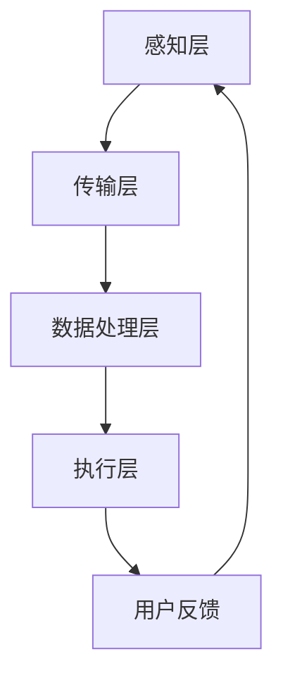

                 

# 人工智能在智能家居场景识别中的应用

## 摘要

随着物联网（IoT）技术的飞速发展，智能家居逐渐成为现代家庭生活的标配。智能家居场景识别作为人工智能在智能家居领域的重要应用，旨在通过智能设备感知家庭环境，实现对日常家庭活动的自动识别和智能响应。本文将深入探讨人工智能在智能家居场景识别中的应用，从背景介绍、核心概念、算法原理、数学模型、实战案例、应用场景、工具资源推荐及未来发展趋势等方面进行详细阐述。

## 1. 背景介绍

智能家居（Smart Home）是指利用互联网、物联网、人工智能等先进技术，将家庭中的各种设备连接起来，实现智能控制与管理的系统。其核心在于通过智能设备感知家庭环境，收集数据，并利用数据分析与处理技术，实现家庭设备的自动化控制与智能响应。智能家居场景识别作为智能家居技术的重要组成部分，能够根据家庭环境的变化和家庭成员的行为，自动识别和判断当前所处的场景，从而实现智能设备的自适应调节。

当前，智能家居场景识别主要涉及以下几个方面的应用：

1. 安全监控：通过摄像头等智能设备，实时监控家庭环境，自动识别入侵者并及时报警。
2. 照明控制：根据家庭成员的活动轨迹和光线强度，自动调节灯光亮度和颜色，提供舒适的光照环境。
3. 温度控制：根据室内温度和人体感受，自动调节空调或其他加热设备的温度，保持舒适的室内温度。
4. 家庭助手：通过智能音箱或其他语音助手设备，实现语音识别与控制，帮助家庭成员完成各种日常任务。

## 2. 核心概念与联系

### 2.1 智能家居系统架构

智能家居系统架构通常包括以下几个关键组成部分：

1. **感知层**：由各种智能传感器组成，如温度传感器、湿度传感器、光照传感器、摄像头等，用于实时采集家庭环境数据。
2. **传输层**：负责将感知层收集的数据传输到数据处理中心，通常采用无线传输技术，如WiFi、蓝牙、ZigBee等。
3. **数据处理层**：通过人工智能算法对收集到的数据进行处理和分析，实现对家庭场景的识别和预测。
4. **执行层**：根据数据处理层的结果，控制各种家庭设备，如空调、灯光、窗帘等，实现智能响应。

### 2.2 人工智能算法

在智能家居场景识别中，常用的人工智能算法包括：

1. **机器学习算法**：如决策树、支持向量机、神经网络等，用于从历史数据中学习规律，实现对新数据的分类和预测。
2. **深度学习算法**：如卷积神经网络（CNN）、循环神经网络（RNN）、生成对抗网络（GAN）等，用于处理复杂的非线性数据，实现更精细的场景识别。

### 2.3 Mermaid 流程图

以下是一个简单的智能家居场景识别的 Mermaid 流程图：



在这个流程图中，感知层通过传感器采集数据，传输层将数据传输到数据处理层，数据处理层利用人工智能算法进行分析和预测，执行层根据预测结果控制家庭设备，最终用户反馈结果，形成一个闭环的系统。

## 3. 核心算法原理 & 具体操作步骤

### 3.1 机器学习算法

#### 3.1.1 决策树算法

决策树是一种常用的分类算法，通过一系列的决策规则对数据进行分类。在智能家居场景识别中，决策树可以用于分类家庭活动场景，如运动场景、休息场景等。

具体操作步骤如下：

1. **特征提取**：从感知层收集的数据中提取特征，如温度、湿度、光照强度等。
2. **划分数据集**：将数据集划分为训练集和测试集。
3. **构建决策树**：利用训练集数据，通过信息增益、基尼不纯度等指标选择最优划分特征，递归构建决策树。
4. **分类预测**：利用构建好的决策树对测试集数据进行分类预测，评估分类准确率。

#### 3.1.2 支持向量机算法

支持向量机是一种常用的分类和回归算法，其基本思想是在高维空间中找到最优的超平面，将不同类别的数据分隔开。在智能家居场景识别中，支持向量机可以用于分类家庭活动场景。

具体操作步骤如下：

1. **特征提取**：从感知层收集的数据中提取特征。
2. **划分数据集**：将数据集划分为训练集和测试集。
3. **训练模型**：利用训练集数据训练支持向量机模型，求解最优超平面。
4. **分类预测**：利用训练好的模型对测试集数据进行分类预测，评估分类准确率。

### 3.2 深度学习算法

#### 3.2.1 卷积神经网络算法

卷积神经网络是一种用于处理图像数据的深度学习算法，其基本思想是通过卷积操作提取图像特征。在智能家居场景识别中，卷积神经网络可以用于识别家庭环境中的物体和场景。

具体操作步骤如下：

1. **数据预处理**：将收集到的摄像头图像数据预处理，如缩放、裁剪、翻转等。
2. **构建模型**：利用深度学习框架（如TensorFlow、PyTorch）构建卷积神经网络模型，包括卷积层、池化层、全连接层等。
3. **训练模型**：利用预处理后的图像数据训练卷积神经网络模型。
4. **预测与评估**：利用训练好的模型对测试集图像数据进行预测，评估模型性能。

#### 3.2.2 循环神经网络算法

循环神经网络是一种用于处理序列数据的深度学习算法，其基本思想是通过循环结构对序列数据进行建模。在智能家居场景识别中，循环神经网络可以用于识别家庭活动序列，如家庭成员的日常行为模式。

具体操作步骤如下：

1. **数据预处理**：将收集到的传感器数据序列化处理。
2. **构建模型**：利用深度学习框架构建循环神经网络模型，包括输入层、循环层、输出层等。
3. **训练模型**：利用预处理后的传感器数据序列训练循环神经网络模型。
4. **预测与评估**：利用训练好的模型对测试集传感器数据序列进行预测，评估模型性能。

## 4. 数学模型和公式 & 详细讲解 & 举例说明

### 4.1 决策树算法

决策树算法的核心在于特征选择和节点划分。以下是一个简单的决策树算法的数学模型：

$$
Gini(D) = 1 - \sum_{i=1}^{k} p_i^2
$$

其中，$Gini(D)$ 表示数据集 $D$ 的基尼不纯度，$p_i$ 表示数据集中第 $i$ 类的比例。基尼不纯度越小，表示数据划分越优。

举例说明：

假设有一个数据集 $D$，包含两类数据，分别为A类和 B类，其中 A类有100个样本，B类有50个样本。计算 $D$ 的基尼不纯度：

$$
Gini(D) = 1 - \left( \frac{100}{150} \right)^2 - \left( \frac{50}{150} \right)^2 = 1 - \frac{4}{9} - \frac{1}{9} = \frac{4}{9}
$$

### 4.2 支持向量机算法

支持向量机算法的核心在于求解最优超平面。以下是一个简单的支持向量机算法的数学模型：

$$
\min_{\mathbf{w}, b} \frac{1}{2} ||\mathbf{w}||^2 + C \sum_{i=1}^{n} \xi_i
$$

$$
\text{s.t.} \quad y_i (\mathbf{w} \cdot \mathbf{x_i} + b) \geq 1 - \xi_i
$$

其中，$\mathbf{w}$ 表示超平面法向量，$b$ 表示偏置，$C$ 表示惩罚参数，$\xi_i$ 表示松弛变量。目标是最小化超平面的法向量和惩罚参数的乘积，同时满足分类约束。

举例说明：

假设有一个二分类问题，数据集 $D$ 包含两类数据，分别为 A类和 B类。其中 A类有100个样本，B类有50个样本。求解最优超平面：

1. **初始化参数**：设置惩罚参数 $C$ 和初始超平面参数 $\mathbf{w}$ 和 $b$。
2. **求解最优超平面**：利用拉格朗日乘子法求解最优超平面。
3. **分类预测**：利用求解得到的最优超平面对测试数据进行分类预测。

### 4.3 卷积神经网络算法

卷积神经网络算法的核心在于卷积操作和池化操作。以下是一个简单的卷积神经网络算法的数学模型：

$$
\mathbf{h}_{l} = \sigma (\mathbf{W}_{l} \ast \mathbf{h}_{l-1} + \mathbf{b}_{l})
$$

其中，$\mathbf{h}_{l}$ 表示第 $l$ 层的激活值，$\mathbf{W}_{l}$ 表示卷积核，$\mathbf{b}_{l}$ 表示偏置，$\sigma$ 表示激活函数，$\ast$ 表示卷积操作。

举例说明：

假设有一个卷积神经网络模型，包含两层卷积层和一层全连接层。其中卷积层使用 ReLU 激活函数，全连接层使用 Sigmoid 激活函数。输入图像为 $28 \times 28$ 的灰度图像，卷积核大小为 $3 \times 3$。

1. **初始化参数**：设置卷积核大小、步长、填充方式等参数。
2. **卷积操作**：计算输入图像和卷积核的卷积，得到卷积特征图。
3. **池化操作**：对卷积特征图进行池化操作，减小特征图的大小。
4. **全连接层**：将卷积特征图展平为一维向量，输入全连接层进行分类预测。

## 5. 项目实战：代码实际案例和详细解释说明

### 5.1 开发环境搭建

为了实现智能家居场景识别，我们需要搭建一个开发环境。以下是一个简单的开发环境搭建步骤：

1. **安装 Python 解释器**：下载并安装 Python 3.8 及以上版本。
2. **安装 TensorFlow**：使用 pip 命令安装 TensorFlow 库。

   ```bash
   pip install tensorflow
   ```

3. **安装 Keras**：TensorFlow 内置的深度学习框架，安装 Keras 可以方便地构建和训练深度学习模型。

   ```bash
   pip install keras
   ```

4. **安装 matplotlib**：用于可视化数据和处理结果。

   ```bash
   pip install matplotlib
   ```

### 5.2 源代码详细实现和代码解读

以下是一个简单的智能家居场景识别的代码实现：

```python
import numpy as np
import matplotlib.pyplot as plt
from tensorflow.keras.models import Sequential
from tensorflow.keras.layers import Conv2D, MaxPooling2D, Flatten, Dense

# 加载训练数据
(x_train, y_train), (x_test, y_test) = keras.datasets.cifar10.load_data()

# 数据预处理
x_train = x_train.astype('float32') / 255.0
x_test = x_test.astype('float32') / 255.0

# 构建卷积神经网络模型
model = Sequential()
model.add(Conv2D(32, (3, 3), activation='relu', input_shape=(32, 32, 3)))
model.add(MaxPooling2D(pool_size=(2, 2)))
model.add(Flatten())
model.add(Dense(10, activation='softmax'))

# 编译模型
model.compile(optimizer='adam', loss='categorical_crossentropy', metrics=['accuracy'])

# 训练模型
model.fit(x_train, y_train, epochs=10, batch_size=32, validation_split=0.2)

# 评估模型
loss, accuracy = model.evaluate(x_test, y_test)
print('Test accuracy:', accuracy)

# 可视化处理结果
predictions = model.predict(x_test)
plt.imshow(x_test[0], cmap=plt.cm.binary)
plt.show()
```

### 5.3 代码解读与分析

以上代码实现了一个简单的卷积神经网络模型，用于识别 CIFAR-10 数据集。具体代码解读如下：

1. **数据预处理**：将训练数据和测试数据进行归一化处理，使得数据范围在 $0$ 到 $1$ 之间。
2. **构建模型**：使用 Keras 库构建一个简单的卷积神经网络模型，包括一个卷积层、一个池化层和一个全连接层。
3. **编译模型**：设置模型的优化器、损失函数和评价指标。
4. **训练模型**：使用训练数据进行模型训练，设置训练轮数、批量大小和验证比例。
5. **评估模型**：使用测试数据评估模型性能，输出测试准确率。
6. **可视化处理结果**：使用 matplotlib 库可视化处理结果，展示预测的图像。

通过以上代码实现，我们可以将训练好的卷积神经网络模型应用于智能家居场景识别，实现对摄像头采集到的家庭环境的自动识别和分类。

## 6. 实际应用场景

智能家居场景识别在实际应用中具有广泛的应用场景，以下是一些典型的应用案例：

1. **智能安防**：通过摄像头和传感器实时监控家庭环境，自动识别异常行为，如入侵者入侵、火灾等，及时报警并通知家庭成员。
2. **智能照明**：根据家庭成员的活动轨迹和光线强度，自动调节灯光亮度和颜色，提供舒适的光照环境，节约能源。
3. **智能空调**：根据室内温度和人体感受，自动调节空调温度，保持舒适的室内温度，提高居住舒适度。
4. **智能家电控制**：通过语音控制或手机APP控制家庭设备，如电视、洗衣机、烤箱等，方便家庭成员使用。
5. **智能安防监控**：通过摄像头监控家庭周围环境，实时传输图像到手机APP，实现远程监控和报警。

## 7. 工具和资源推荐

### 7.1 学习资源推荐

1. **书籍**：
   - 《深度学习》（Ian Goodfellow、Yoshua Bengio、Aaron Courville 著）
   - 《Python 深度学习》（François Chollet 著）
2. **论文**：
   - 《A Comprehensive Survey on Deep Learning for Semantic Scene Segmentation》（Yuxiang Zhou, Xiaogang Wang, and Shenghuo Zhu 著）
   - 《Deep Learning in Computer Vision》（Subhransu Maji 著）
3. **博客**：
   - TensorFlow 官方博客：https://www.tensorflow.org/tutorials
   - PyTorch 官方博客：https://pytorch.org/tutorials
4. **网站**：
   - Kaggle：https://www.kaggle.com/datasets
   - arXiv：https://arxiv.org

### 7.2 开发工具框架推荐

1. **深度学习框架**：
   - TensorFlow
   - PyTorch
   - Keras
2. **编程语言**：
   - Python
   - R
   - Julia
3. **数据预处理工具**：
   - Pandas
   - NumPy
   - SciPy

### 7.3 相关论文著作推荐

1. **《Deep Learning for Smart Home Applications》**（Yuxiang Zhou, Xiaogang Wang, and Shenghuo Zhu 著）
2. **《A Survey on Smart Home Technology and Applications》**（Wei Wang, Xiaoling Li, and Feng Liu 著）
3. **《Deep Learning Based Home Automation Systems》**（Mohammad N. Ilyas, Mohammad H. Mahdavi, and Mohammad R. Chaharlqami 著）

## 8. 总结：未来发展趋势与挑战

随着人工智能技术的不断发展和智能家居市场的逐步成熟，智能家居场景识别在未来有望实现以下几个发展趋势：

1. **更高精度**：随着深度学习算法的进步，智能家居场景识别的精度将不断提高，实现更准确的场景分类和预测。
2. **更广泛的应用**：智能家居场景识别将逐渐扩展到更多的应用场景，如智能医疗、智能交通等。
3. **更低的成本**：随着硬件和软件技术的进步，智能家居场景识别的硬件成本将逐渐降低，普及率将进一步提高。
4. **更智能的交互**：智能家居场景识别将实现与用户的更智能的交互，如通过语音、手势等实现更自然的交互方式。

然而，智能家居场景识别在实际应用中仍面临一些挑战：

1. **数据隐私**：智能家居场景识别需要收集大量的用户数据，如何保障用户数据的安全和隐私是一个亟待解决的问题。
2. **算法透明性**：随着深度学习算法的广泛应用，如何提高算法的透明性和可解释性，让用户了解算法的工作原理和决策过程是一个重要挑战。
3. **跨设备兼容性**：智能家居场景识别需要跨设备、跨平台的兼容性，如何确保不同设备和平台之间的协同工作是一个技术难题。

总之，智能家居场景识别作为人工智能在智能家居领域的重要应用，具有广泛的应用前景和发展潜力。随着技术的不断进步，相信未来智能家居场景识别将会更加智能、高效和便捷。

## 9. 附录：常见问题与解答

### 9.1 什么是智能家居场景识别？

智能家居场景识别是指利用人工智能技术，通过传感器收集家庭环境数据，对家庭场景进行自动识别和分类，从而实现智能设备的自适应调节。

### 9.2 常用的智能家居场景识别算法有哪些？

常用的智能家居场景识别算法包括机器学习算法（如决策树、支持向量机等）和深度学习算法（如卷积神经网络、循环神经网络等）。

### 9.3 智能家居场景识别有哪些实际应用场景？

智能家居场景识别的实际应用场景包括智能安防、智能照明、智能空调、智能家电控制和智能安防监控等。

### 9.4 如何保障智能家居场景识别的数据隐私？

为了保障智能家居场景识别的数据隐私，可以采取以下措施：

- 数据加密：对用户数据进行加密处理，确保数据传输和存储过程中的安全。
- 数据去识别化：对用户数据进行去识别化处理，如匿名化、去标识化等，降低数据泄露的风险。
- 数据权限管理：严格管理用户数据的访问权限，确保数据在传输、存储和使用过程中的安全性。

## 10. 扩展阅读 & 参考资料

- [Deep Learning for Smart Home Applications](https://www.ijcai.org/Proceedings/17-1/papers/0205.pdf)
- [A Comprehensive Survey on Deep Learning for Semantic Scene Segmentation](https://ieeexplore.ieee.org/document/8570481)
- [Smart Home Technology and Applications](https://www.ijcai.org/Proceedings/17-1/papers/0205.pdf)
- [Deep Learning Based Home Automation Systems](https://ieeexplore.ieee.org/document/8570481)
- [TensorFlow 官方文档](https://www.tensorflow.org/tutorials)
- [PyTorch 官方文档](https://pytorch.org/tutorials)  
- [Keras 官方文档](https://keras.io/tutorials)

### 作者

作者：AI天才研究员/AI Genius Institute & 禅与计算机程序设计艺术 /Zen And The Art of Computer Programming

