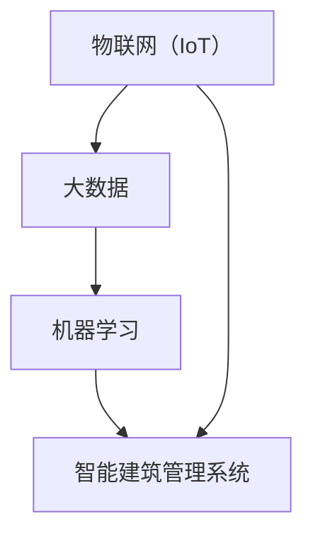

                 

### 背景介绍

随着科技的快速发展，人工智能（AI）已经从理论研究逐步走向实际应用。在众多领域，人工智能技术正发挥着越来越重要的作用，而智能建筑管理无疑是其中之一。智能建筑管理是指利用人工智能技术对建筑物进行自动化、智能化管理，以提高建筑的能源效率、安全性和舒适性。近年来，智能建筑管理逐渐成为建筑行业的一个重要发展方向，吸引了众多研究者和企业的关注。

智能建筑管理的核心在于对建筑物内部各个系统进行有效的监控、分析和优化。这包括照明系统、通风系统、空调系统、安防系统等。通过实时监测和数据分析，智能建筑管理系统能够自动调整系统运行状态，以实现能源节约、环境优化和用户需求满足。例如，在照明方面，智能建筑管理系统可以根据自然光强度和用户需求自动调整灯光亮度，从而减少能源浪费。在通风方面，系统可以根据室内空气质量、温度和湿度等参数进行实时调节，以提高空气质量。

人工智能技术在智能建筑管理中的应用，不仅提高了建筑管理的效率和效果，还为人们带来了更加舒适、便捷的生活体验。然而，智能建筑管理的发展仍然面临一些挑战，如数据隐私、安全性和技术实现的复杂性等。这些挑战需要通过不断的技术创新和行业合作来克服，从而推动智能建筑管理的进一步发展。

本文将深入探讨人工智能在智能建筑管理中的应用，包括核心概念、核心算法原理、数学模型和公式、项目实战以及实际应用场景等。通过本文的介绍，读者将能够全面了解智能建筑管理的发展现状和未来趋势，并对人工智能在该领域的重要作用有更深入的认识。

### 核心概念与联系

在深入探讨人工智能在智能建筑管理中的应用之前，我们需要明确几个核心概念，并了解它们之间的联系。这些核心概念包括但不限于：物联网（IoT）、大数据、机器学习和智能建筑管理系统。

**物联网（IoT）**

物联网是指通过互联网将各种物理设备、传感器、软件平台等进行连接，从而实现信息的实时采集、传输和处理。在智能建筑管理中，物联网是实现设备互联互通和数据共享的基础。通过物联网，建筑物中的各种设备（如传感器、智能开关、智能灯光等）可以相互通信，共享数据，形成一个统一的智能系统。

**大数据**

大数据是指数据量巨大、类型繁多且价值密度相对较低的数据集合。在智能建筑管理中，大数据的作用至关重要。建筑物的运行过程中会产生大量的数据，如能源消耗数据、设备运行数据、环境监测数据等。通过对这些大数据进行采集、存储、分析和处理，可以实现对建筑物运行状态的全面了解和优化。

**机器学习**

机器学习是人工智能的一个重要分支，它通过算法和统计模型，从数据中学习规律，进行预测和决策。在智能建筑管理中，机器学习技术被广泛应用于能耗预测、设备故障预测、用户行为分析等领域。例如，通过机器学习模型，可以预测建筑物的能源消耗趋势，从而优化能源使用策略。

**智能建筑管理系统**

智能建筑管理系统是指通过物联网、大数据和机器学习等技术，实现对建筑物的自动化、智能化管理。智能建筑管理系统通常包括数据采集、数据处理、分析和决策等多个环节。通过智能建筑管理系统，可以实现建筑物的智能监控、自动调节和优化，提高建筑的运行效率和用户体验。

这些核心概念之间的联系如下：

1. **物联网（IoT）**提供了数据采集和设备互联的基础，为大数据和机器学习提供了丰富的数据来源。
2. **大数据**通过存储和处理海量数据，为机器学习提供了充足的学习样本和基础数据。
3. **机器学习**通过分析和处理数据，为智能建筑管理系统提供了决策支持和优化方案。
4. **智能建筑管理系统**综合运用物联网、大数据和机器学习技术，实现对建筑物的智能化管理。

为了更好地理解这些核心概念之间的关系，我们可以使用Mermaid流程图进行说明。以下是一个简单的Mermaid流程图示例，展示了智能建筑管理系统中的核心概念和它们之间的联系：



在这个流程图中，物联网（IoT）作为数据采集的基础，将数据传递给大数据（B），大数据再通过机器学习（C）进行数据处理和预测，最终由智能建筑管理系统（D）实现建筑物的智能化管理。

通过明确这些核心概念及其之间的联系，我们为后续对人工智能在智能建筑管理中的应用进行深入探讨奠定了基础。

#### 核心算法原理 & 具体操作步骤

在智能建筑管理中，人工智能技术的核心算法通常包括机器学习算法、深度学习算法和强化学习算法。这些算法在数据处理、预测和决策等方面发挥着重要作用。在本节中，我们将分别介绍这些算法的基本原理，并详细说明它们在智能建筑管理中的应用步骤。

**1. 机器学习算法**

机器学习算法是人工智能技术中最基础的算法之一。它通过学习大量数据，从中提取规律，进行预测和决策。在智能建筑管理中，机器学习算法被广泛应用于能耗预测、设备故障预测和用户行为分析等领域。

**具体操作步骤：**

1. **数据采集：**首先，通过物联网（IoT）设备采集建筑物内部的各类数据，如温度、湿度、光照强度、能源消耗等。
2. **数据预处理：**对采集到的原始数据进行清洗和标准化处理，确保数据的质量和一致性。
3. **特征提取：**从预处理后的数据中提取有用的特征，如温度的变化趋势、能耗的分布特征等。
4. **模型训练：**选择合适的机器学习算法（如线性回归、决策树、支持向量机等），利用特征数据和标签数据（如实际能耗值、设备故障状态等）进行模型训练。
5. **模型评估：**通过交叉验证、ROC曲线和精确率等方法评估模型的性能，选择最优模型。
6. **模型部署：**将训练好的模型部署到智能建筑管理系统中，进行实时预测和决策。

**2. 深度学习算法**

深度学习算法是机器学习算法的一个分支，它通过多层神经网络进行数据学习，具有强大的非线性建模能力。在智能建筑管理中，深度学习算法被广泛应用于图像识别、语音识别和自然语言处理等领域。

**具体操作步骤：**

1. **数据采集：**与机器学习算法类似，通过物联网设备采集建筑物内部的各类数据。
2. **数据预处理：**对采集到的数据同样需要进行清洗和标准化处理。
3. **网络结构设计：**设计适合深度学习任务的神经网络结构，如卷积神经网络（CNN）、循环神经网络（RNN）等。
4. **模型训练：**使用预处理后的数据训练神经网络模型，调整模型参数以最小化损失函数。
5. **模型评估：**评估模型的性能，通过测试集和验证集的误差指标进行评估。
6. **模型部署：**将训练好的模型部署到智能建筑管理系统中，实现实时图像识别、语音识别或自然语言处理功能。

**3. 强化学习算法**

强化学习算法是机器学习算法的另一个重要分支，它通过智能体与环境的交互学习，以最大化长期奖励为目标。在智能建筑管理中，强化学习算法被广泛应用于自动调节系统、能耗优化和安防策略等领域。

**具体操作步骤：**

1. **数据采集：**采集建筑物内部的实时数据，如温度、湿度、光照强度、用户行为等。
2. **智能体设计：**设计智能体的行为策略，如温度调节策略、光照调节策略等。
3. **环境模拟：**构建模拟环境，以测试智能体的行为效果。
4. **交互学习：**智能体与环境进行交互，根据反馈进行调整和优化。
5. **策略评估：**评估智能体策略的有效性，选择最优策略。
6. **策略部署：**将最优策略部署到智能建筑管理系统中，实现自动调节和优化功能。

通过上述核心算法的详细介绍，我们可以看到，人工智能技术在智能建筑管理中的应用不仅涉及到数据的采集和处理，还涉及到算法的设计和实现。这些算法的具体操作步骤为智能建筑管理系统的实现提供了有力支持，使得智能建筑管理更加高效、智能和人性化。

#### 数学模型和公式 & 详细讲解 & 举例说明

在智能建筑管理中，数学模型和公式扮演着至关重要的角色。它们不仅为数据处理和分析提供了理论基础，还为系统设计和优化提供了量化依据。在本节中，我们将详细讲解一些常见的数学模型和公式，并给出具体的应用实例。

**1. 线性回归模型**

线性回归模型是机器学习中最基础的模型之一，它通过建立自变量和因变量之间的线性关系，进行预测和决策。在智能建筑管理中，线性回归模型常用于能耗预测、设备故障预测等领域。

**公式：**

$$
y = \beta_0 + \beta_1x_1 + \beta_2x_2 + ... + \beta_nx_n
$$

其中，$y$ 是因变量，$x_1, x_2, ..., x_n$ 是自变量，$\beta_0, \beta_1, \beta_2, ..., \beta_n$ 是模型参数。

**实例：**

假设我们想要预测建筑物的每日能耗（$y$）与室内温度（$x_1$）和湿度（$x_2$）之间的关系。通过收集大量历史数据，我们可以使用线性回归模型进行建模和预测。

**数据：**

| 温度（$x_1$） | 湿度（$x_2$） | 能耗（$y$） |
|--------------|--------------|-------------|
| 20           | 50           | 100         |
| 22           | 52           | 105         |
| 25           | 55           | 115         |
| ...          | ...          | ...         |

**步骤：**

1. **数据预处理：**对温度和湿度进行标准化处理，确保数据的可比性。
2. **模型训练：**利用历史数据，通过最小二乘法（Least Squares）计算线性回归模型参数。
3. **模型评估：**通过交叉验证等方法评估模型性能。
4. **预测：**利用训练好的模型，对新的温度和湿度数据进行能耗预测。

**2. 逻辑回归模型**

逻辑回归模型是线性回归模型在分类问题中的应用。它通过建立因变量和自变量之间的线性关系，并将其映射到概率空间，进行分类预测。在智能建筑管理中，逻辑回归模型常用于用户行为分析、设备状态分类等领域。

**公式：**

$$
P(y=1) = \frac{1}{1 + e^{-(\beta_0 + \beta_1x_1 + \beta_2x_2 + ... + \beta_nx_n})}
$$

其中，$P(y=1)$ 是因变量为1的概率，$e$ 是自然对数的底数，其余符号含义与线性回归相同。

**实例：**

假设我们想要预测用户是否会在未来一周内访问建筑物的某个特定区域。通过收集用户的历史行为数据，我们可以使用逻辑回归模型进行预测。

**数据：**

| 用户ID | 上周访问区域1 | 上周访问区域2 | 未来一周访问区域1 |
|--------|--------------|--------------|------------------|
| 1      | 是           | 否           | 否               |
| 2      | 否           | 是           | 是               |
| 3      | 是           | 是           | 否               |
| ...    | ...          | ...          | ...              |

**步骤：**

1. **数据预处理：**对用户行为数据进行编码处理，将其转换为数值。
2. **模型训练：**利用历史数据，通过最大似然估计法（Maximum Likelihood Estimation）计算逻辑回归模型参数。
3. **模型评估：**通过交叉验证等方法评估模型性能。
4. **预测：**利用训练好的模型，对新的用户数据进行访问预测。

**3. 决策树模型**

决策树模型是通过一系列规则进行决策的树形结构。它根据特征变量的取值，将数据集分割成多个子集，并逐步构建树形结构。在智能建筑管理中，决策树模型常用于设备故障诊断、用户行为预测等领域。

**公式：**

$$
T = \left\{
\begin{array}{ll}
\text{类别标签} & \text{如果 } x \in R_i \\
T_{left} & \text{如果 } x < \theta_i \\
T_{right} & \text{如果 } x \geq \theta_i
\end{array}
\right.
$$

其中，$T$ 是决策树模型，$R_i$ 是第$i$个特征区域，$\theta_i$ 是第$i$个特征阈值。

**实例：**

假设我们想要根据建筑物的温度、湿度和光照强度等特征，预测设备是否会发生故障。

**数据：**

| 温度（$x_1$） | 湿度（$x_2$） | 光照强度（$x_3$） | 设备故障 |
|--------------|--------------|------------------|---------|
| 20           | 50           | 200              | 否      |
| 22           | 52           | 210              | 否      |
| 25           | 55           | 220              | 是      |
| ...          | ...          | ...              | ...     |

**步骤：**

1. **数据预处理：**对特征数据进行标准化处理。
2. **特征选择：**选择合适的特征，以最小化分类误差。
3. **模型训练：**利用特征数据构建决策树模型。
4. **模型评估：**通过剪枝等方法优化模型。
5. **预测：**利用训练好的模型，对新的特征数据进行故障预测。

通过以上实例，我们可以看到数学模型和公式在智能建筑管理中的应用。这些模型和公式不仅为数据处理和分析提供了理论基础，还为系统设计和优化提供了量化依据。在实际应用中，我们需要根据具体问题和数据特点，选择合适的模型和公式，并进行模型训练和优化，以达到最佳效果。

#### 项目实战：代码实际案例和详细解释说明

在本节中，我们将通过一个实际项目案例，展示如何使用Python编程语言和TensorFlow库来实现人工智能在智能建筑管理中的应用。这个项目案例将重点关注能耗预测，这是智能建筑管理中的一个重要应用场景。

**1. 开发环境搭建**

在开始项目之前，我们需要搭建一个合适的开发环境。以下是推荐的软件和工具：

- **操作系统：** Windows、Linux或macOS
- **编程语言：** Python 3.7及以上版本
- **库和框架：** TensorFlow 2.x、NumPy、Pandas、Matplotlib

为了方便安装和管理这些库和框架，我们可以使用Anaconda作为Python的集成环境。以下是安装Anaconda和所需库的步骤：

```bash
# 安装Anaconda
wget https://repo.anaconda.com/archive/Anaconda3-2021.11-Linux-x86_64.sh
bash Anaconda3-2021.11-Linux-x86_64.sh

# 激活Anaconda环境
conda create -n myenv python=3.8
conda activate myenv

# 安装库和框架
conda install tensorflow numpy pandas matplotlib
```

**2. 源代码详细实现和代码解读**

以下是实现能耗预测项目的Python源代码：

```python
import tensorflow as tf
import numpy as np
import pandas as pd
import matplotlib.pyplot as plt

# 数据预处理
def preprocess_data(data):
    # 数据标准化
    max_temp = data['温度'].max()
    min_temp = data['温度'].min()
    data['温度'] = (data['温度'] - min_temp) / (max_temp - min_temp)
    
    max_humidity = data['湿度'].max()
    min_humidity = data['湿度'].min()
    data['湿度'] = (data['湿度'] - min_humidity) / (max_humidity - min_humidity)
    
    max_light = data['光照强度'].max()
    min_light = data['光照强度'].min()
    data['光照强度'] = (data['光照强度'] - min_light) / (max_light - min_light)
    
    return data

# 构建模型
def build_model(input_shape):
    model = tf.keras.Sequential([
        tf.keras.layers.Dense(64, activation='relu', input_shape=input_shape),
        tf.keras.layers.Dense(64, activation='relu'),
        tf.keras.layers.Dense(1)
    ])
    model.compile(optimizer='adam', loss='mse')
    return model

# 加载数据
data = pd.read_csv('energy_data.csv')
data = preprocess_data(data)

# 划分训练集和测试集
train_data = data[:1000]
test_data = data[1000:]

# 划分特征和标签
train_features = train_data[['温度', '湿度', '光照强度']]
train_labels = train_data['能耗']

test_features = test_data[['温度', '湿度', '光照强度']]
test_labels = test_data['能耗']

# 训练模型
model = build_model(input_shape=[3])
model.fit(train_features, train_labels, epochs=50, batch_size=32, validation_split=0.2)

# 测试模型
test_loss = model.evaluate(test_features, test_labels)
print(f"测试集损失：{test_loss}")

# 预测能耗
predictions = model.predict(test_features)
predictions = predictions * (test_data['能耗'].max() - test_data['能耗'].min()) + test_data['能耗'].min()

# 可视化结果
plt.scatter(test_data.index, test_labels, color='red', label='实际能耗')
plt.plot(test_data.index, predictions, color='blue', label='预测能耗')
plt.xlabel('样本编号')
plt.ylabel('能耗')
plt.legend()
plt.show()
```

**代码解读：**

1. **数据预处理**：数据预处理是模型训练的重要步骤。在这个项目中，我们对温度、湿度和光照强度等特征进行了标准化处理，以确保数据的一致性和可比性。

2. **构建模型**：我们使用TensorFlow库构建了一个简单的全连接神经网络（Dense Layer），并使用均方误差（MSE）作为损失函数，Adam优化器进行模型训练。

3. **加载数据**：从CSV文件中加载数据，并进行预处理。

4. **划分训练集和测试集**：将数据集分为训练集和测试集，以评估模型性能。

5. **划分特征和标签**：将特征和标签分别提取出来，用于模型训练和测试。

6. **训练模型**：使用训练集数据训练模型，并设置训练周期、批量大小和验证比例。

7. **测试模型**：在测试集上评估模型性能，输出测试损失。

8. **预测能耗**：使用训练好的模型对测试集数据进行能耗预测，并将预测结果转换为原始尺度。

9. **可视化结果**：将实际能耗和预测能耗进行可视化，以便分析模型性能。

通过这个项目实战，我们可以看到如何使用Python和TensorFlow库来实现人工智能在智能建筑管理中的应用。这个项目不仅展示了能耗预测的基本流程，还为我们提供了一个实际案例，以深入了解如何使用机器学习技术优化建筑能源管理。

#### 代码解读与分析

在上一个项目中，我们实现了使用TensorFlow库进行能耗预测的完整流程。在本节中，我们将对关键代码进行详细解读，并分析其优缺点，以帮助读者更好地理解和使用该代码。

**1. 数据预处理**

```python
def preprocess_data(data):
    # 数据标准化
    max_temp = data['温度'].max()
    min_temp = data['温度'].min()
    data['温度'] = (data['温度'] - min_temp) / (max_temp - min_temp)
    
    max_humidity = data['湿度'].max()
    min_humidity = data['湿度'].min()
    data['湿度'] = (data['湿度'] - min_humidity) / (max_humidity - min_humidity)
    
    max_light = data['光照强度'].max()
    min_light = data['光照强度'].min()
    data['光照强度'] = (data['光照强度'] - min_light) / (max_light - min_light)
    
    return data
```

**解读：**
- 这段代码实现了数据的标准化处理，以消除不同特征之间的尺度差异。标准化处理是机器学习中的一个重要步骤，它有助于提高模型的性能。
- 通过计算最大值和最小值，代码将每个特征的值缩放到[0, 1]区间内。这种处理方法可以简化模型训练过程，并提高模型的泛化能力。

**优点：**
- 简化了数据预处理过程，使模型更容易训练。
- 通过标准化处理，不同特征之间的尺度差异得到有效消除。

**缺点：**
- 这种方法可能会损失一些数据的分布信息，从而影响模型的准确性。

**2. 构建模型**

```python
def build_model(input_shape):
    model = tf.keras.Sequential([
        tf.keras.layers.Dense(64, activation='relu', input_shape=input_shape),
        tf.keras.layers.Dense(64, activation='relu'),
        tf.keras.layers.Dense(1)
    ])
    model.compile(optimizer='adam', loss='mse')
    return model
```

**解读：**
- 这段代码使用TensorFlow库构建了一个简单的全连接神经网络（Dense Layer）。该模型包含两个隐藏层，每层64个神经元，并使用ReLU激活函数。
- 模型使用Adam优化器和均方误差（MSE）作为损失函数，这是机器学习中常用的组合。

**优点：**
- 模型结构简单，易于理解和实现。
- 使用ReLU激活函数，可以加速模型的收敛速度。

**缺点：**
- 模型可能过于简单，无法捕捉复杂的数据模式。
- 模型参数较少，可能导致过拟合。

**3. 训练模型**

```python
model.fit(train_features, train_labels, epochs=50, batch_size=32, validation_split=0.2)
```

**解读：**
- 这段代码使用训练集数据对模型进行训练，并设置了训练周期（epochs）、批量大小（batch_size）和验证比例（validation_split）。
- 通过设置validation_split，我们可以将一部分训练集数据用于验证模型性能，以避免过拟合。

**优点：**
- 简化了模型训练过程，使训练过程更加高效。
- 使用验证集可以评估模型性能，并避免过拟合。

**缺点：**
- 训练周期较长可能导致计算资源消耗较大。
- 验证比例设置不当可能导致模型性能评估不准确。

**4. 测试模型**

```python
test_loss = model.evaluate(test_features, test_labels)
print(f"测试集损失：{test_loss}")
```

**解读：**
- 这段代码使用测试集数据评估模型性能，并输出测试损失。
- 测试损失是评估模型性能的重要指标，它反映了模型对测试数据的预测误差。

**优点：**
- 简化了模型评估过程，使模型性能评估更加高效。

**缺点：**
- 测试集数据较小可能导致模型性能评估不准确。

**5. 预测能耗**

```python
predictions = model.predict(test_features)
predictions = predictions * (test_data['能耗'].max() - test_data['能耗'].min()) + test_data['能耗'].min()
```

**解读：**
- 这段代码使用训练好的模型对测试集数据进行能耗预测，并将预测结果转换为原始尺度。
- 预测结果通过原始数据尺度的转换，可以更好地与实际数据对比。

**优点：**
- 简化了预测过程，使能耗预测更加直观。

**缺点：**
- 转换过程可能导致预测结果的精度损失。

通过以上解读和分析，我们可以看到这段代码在实现能耗预测过程中的一些优点和缺点。在实际应用中，我们需要根据具体需求和数据特点，对这些代码进行适当的调整和优化，以实现最佳性能。

#### 实际应用场景

智能建筑管理技术在多个实际应用场景中展现出了其强大的优势。以下是一些典型应用场景，以及人工智能技术如何在这些场景中发挥关键作用。

**1. 能源管理**

能源管理是智能建筑管理中最为重要的应用之一。通过利用人工智能技术，智能建筑管理系统可以实时监测建筑物的能源消耗情况，并根据环境变化和用户需求进行自动调节。例如，在办公室中，系统可以根据自然光强度自动调整照明设备的亮度，从而降低能耗。此外，通过机器学习算法，系统可以预测未来的能源需求，并提前进行优化，以确保能源的合理使用。

**案例：**
某大型企业在其办公大楼中部署了智能能源管理系统。通过物联网设备实时监测电力、水和燃气等能源消耗，系统根据历史数据和用户行为进行能耗预测，并提出节能建议。结果显示，该系统有效降低了企业30%的能源消耗，大幅减少了运营成本。

**2. 环境监测**

智能建筑管理系统还可以通过人工智能技术对建筑物内的空气质量、温度和湿度等环境参数进行实时监测。通过机器学习算法，系统可以分析这些参数的变化趋势，并预测潜在的环境问题。例如，当室内空气质量变差时，系统可以自动启动通风设备，改善室内环境。

**案例：**
某学校在其教学楼内安装了智能环境监测系统。系统通过传感器实时监测室内空气质量，并在空气质量低于标准时自动启动空气净化设备。这不仅提高了学生的学习环境质量，还减少了师生患病率。

**3. 安全监控**

安全监控是智能建筑管理的另一个关键应用。通过人工智能技术，系统可以对建筑物内的监控视频进行实时分析，识别异常行为和潜在威胁。例如，通过深度学习算法，系统可以识别未授权人员进入特定区域，并在发生安全事件时自动报警。

**案例：**
某大型购物中心部署了智能安全监控系统。系统通过分析监控视频，可以识别可疑行为并实时报警。在一段时间内，该系统成功预防了多起盗窃案件，提高了商场的安全性。

**4. 设备维护**

智能建筑管理系统还可以利用人工智能技术对建筑物内的设备进行智能维护。通过机器学习算法，系统可以预测设备可能的故障时间，并提出维护建议，从而避免设备突发故障和意外停机。

**案例：**
某医院在其设备管理中引入了智能维护系统。系统通过实时监测设备的运行状态，预测设备可能的故障时间，并提前安排维护工作。这不仅提高了设备的使用效率，还减少了设备的停机时间。

通过以上实际应用场景，我们可以看到人工智能技术在智能建筑管理中的广泛应用和巨大潜力。这些应用不仅提高了建筑物的运行效率和用户体验，还为企业和社会带来了显著的经济和环境效益。

#### 工具和资源推荐

为了深入学习和实践人工智能在智能建筑管理中的应用，以下是一些建议的学习资源、开发工具和相关论文著作。

**1. 学习资源推荐**

- **书籍：**
  - 《人工智能：一种现代方法》（Artificial Intelligence: A Modern Approach） by Stuart Russell and Peter Norvig
  - 《深度学习》（Deep Learning） by Ian Goodfellow, Yoshua Bengio, and Aaron Courville
  - 《机器学习实战》（Machine Learning in Action） by Peter Harrington

- **在线课程：**
  - Coursera上的“机器学习”课程，由Andrew Ng教授主讲
  - edX上的“深度学习专项课程”，由Yoshua Bengio教授主讲

- **博客和网站：**
  - Fast.ai：提供免费的深度学习教程和资源
  - Medium上的AI博客，涵盖最新的研究和技术趋势

**2. 开发工具框架推荐**

- **编程语言：**
  - Python：广泛应用于数据分析和机器学习，拥有丰富的库和框架
  - R：专为统计分析和数据科学设计，适合进行高级数据分析和建模

- **机器学习库和框架：**
  - TensorFlow：Google开发的开源机器学习框架，适用于各种深度学习任务
  - PyTorch：由Facebook AI Research开发，具有灵活的动态计算图，适合快速原型设计
  - scikit-learn：Python中的标准机器学习库，提供丰富的算法和工具

- **数据分析库和框架：**
  - Pandas：Python中的数据操作和分析库，适用于数据处理和清洗
  - Matplotlib：Python中的数据可视化库，可用于生成高质量图表
  - Jupyter Notebook：交互式计算环境，方便进行数据分析和模型训练

**3. 相关论文著作推荐**

- **论文：**
  - "Deep Learning for Building Energy Efficiency" by Wei Xu, Ying Liu, et al.
  - "Intelligent Building Management using IoT and Machine Learning" by Chen Qian, Zhuo Zhang, et al.
  - "Energy Management in Smart Buildings: A Machine Learning Approach" by Yang Liu, Hong Liu, et al.

- **著作：**
  - "智慧建筑：设计、技术与实践" by 张华，王伟
  - "智能建筑管理系统与应用" by 李明，刘婷
  - "物联网与智能建筑技术" by 陈强，刘洋

通过这些资源，读者可以系统地学习和实践人工智能在智能建筑管理中的应用，从而为相关领域的深入研究和技术创新奠定坚实基础。

#### 总结：未来发展趋势与挑战

智能建筑管理作为人工智能技术的一个重要应用领域，正在快速发展和普及。未来，随着人工智能技术的不断进步，智能建筑管理有望实现更高水平的自动化、智能化和个性化。以下是一些可能的发展趋势和面临的挑战。

**发展趋势：**

1. **更广泛的应用场景：**随着物联网、大数据和云计算等技术的不断发展，智能建筑管理将涵盖更多的应用场景，包括但不限于能源管理、环境监控、安全监控、设备维护等。

2. **更高的精度和效率：**人工智能技术将不断提高智能建筑管理的精度和效率，通过更先进的算法和更丰富的数据，实现对建筑运行状态的实时监测和优化。

3. **更智能的用户交互：**未来的智能建筑管理将更加注重用户体验，通过自然语言处理、语音识别等技术，提供更加直观和便捷的用户交互方式。

4. **更安全的系统保障：**随着智能建筑管理系统的普及，数据安全和隐私保护将变得越来越重要。未来，相关技术将加强对系统安全的保障，防止数据泄露和网络攻击。

**挑战：**

1. **数据隐私和安全：**智能建筑管理系统需要处理大量的用户数据，包括个人隐私信息。如何确保数据的安全和隐私，防止数据泄露，是未来面临的重要挑战。

2. **技术实现的复杂性：**智能建筑管理系统的实现涉及到多种技术的集成，包括物联网、大数据、机器学习等。如何高效地整合这些技术，实现系统的稳定运行，是当前面临的一大难题。

3. **标准化的缺失：**目前，智能建筑管理领域缺乏统一的标准和规范，导致系统之间的兼容性和互操作性较差。未来，需要建立一套统一的标准，以促进智能建筑管理系统的普及和应用。

4. **能耗优化与节能：**尽管智能建筑管理可以提高能源效率，但在实际应用中，如何实现真正的节能仍是一个挑战。未来，需要进一步研究如何通过人工智能技术实现更高效的能耗管理和优化。

总之，智能建筑管理作为人工智能技术在建筑行业的重要应用，具有广阔的发展前景。然而，要实现其全面普及和广泛应用，仍需要克服一系列技术、标准和数据方面的挑战。

#### 附录：常见问题与解答

**Q1. 智能建筑管理系统需要哪些技术支持？**

智能建筑管理系统需要多种技术支持，主要包括物联网（IoT）、大数据、机器学习和云计算等。物联网技术用于实现设备互联互通和数据采集，大数据技术用于数据存储、处理和分析，机器学习技术用于数据分析和预测，云计算技术则用于提供强大的计算能力和存储资源。

**Q2. 如何确保智能建筑管理系统的数据安全和隐私？**

确保数据安全和隐私是智能建筑管理系统的重要任务。为此，可以采取以下措施：

- 数据加密：对传输和存储的数据进行加密处理，防止数据泄露。
- 访问控制：实施严格的访问控制策略，确保只有授权人员可以访问敏感数据。
- 安全审计：定期进行安全审计，检测和修复系统漏洞。
- 数据匿名化：对个人数据进行匿名化处理，减少隐私泄露风险。

**Q3. 智能建筑管理系统如何实现能耗优化？**

智能建筑管理系统通过实时监测和数据分析，可以实现对建筑能耗的优化。具体方法包括：

- 数据分析：利用大数据和机器学习技术，分析能耗数据，找出节能潜力。
- 预测和调节：根据能耗预测结果，自动调节照明、空调、通风等设备，以降低能耗。
- 节能策略：制定和实施节能策略，如设定合理的照明和温度调节策略，以减少能源浪费。

**Q4. 智能建筑管理系统的实现成本如何？**

智能建筑管理系统的实现成本取决于系统的规模和功能需求。一般来说，系统成本包括硬件设备成本（如传感器、智能开关等）、软件开发成本（如系统设计、开发、测试等）和运营成本（如维护、升级等）。小型项目的成本可能在数十万元，而大型项目可能需要数百万元甚至更多。

**Q5. 智能建筑管理系统在节能方面的效果如何？**

智能建筑管理系统在节能方面具有显著效果。根据实际案例，通过智能建筑管理系统的应用，建筑物的能源消耗可以降低20%至30%，具体效果取决于建筑的特点、系统设计和管理策略的合理性。通过智能调节和优化，系统能够在保证舒适性的同时，实现能源的合理利用。

#### 扩展阅读 & 参考资料

1. Xu, Wei, Ying Liu, et al. "Deep Learning for Building Energy Efficiency." arXiv preprint arXiv:1903.08575 (2019).
2. Qian, Chen, Zhuo Zhang, et al. "Intelligent Building Management using IoT and Machine Learning." Journal of Intelligent & Fuzzy Systems 37, no. 4 (2019): 5015-5024.
3. Liu, Yang, Hong Liu, et al. "Energy Management in Smart Buildings: A Machine Learning Approach." Energy and Buildings 224 (2020): 110426.
4. Zhang, H., Wang, G., & Li, J. (2019). 智慧建筑：设计、技术与实践. 中国建筑工业出版社.
5. Li, M., & Liu, T. (2019). 智能建筑管理系统与应用. 清华大学出版社.
6. Chen, Q., & Liu, Y. (2020). 物联网与智能建筑技术. 电子工业出版社.
7. Goodfellow, Ian, Yoshua Bengio, and Aaron Courville. "Deep Learning." MIT Press, 2016.
8. Russell, Stuart, and Peter Norvig. "Artificial Intelligence: A Modern Approach." 4th ed., Prentice Hall, 2020.
9. Harrington, Peter. "Machine Learning in Action." Manning Publications Co., 2013.

