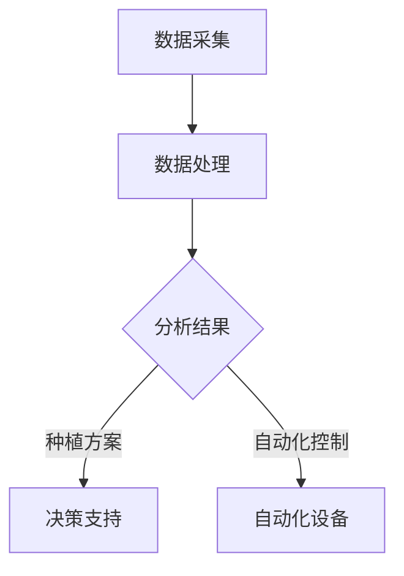
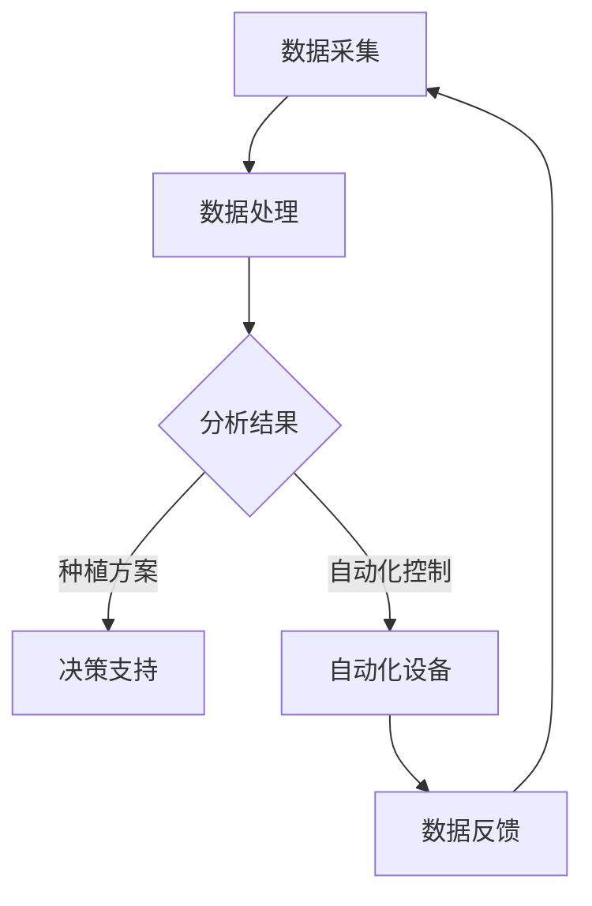
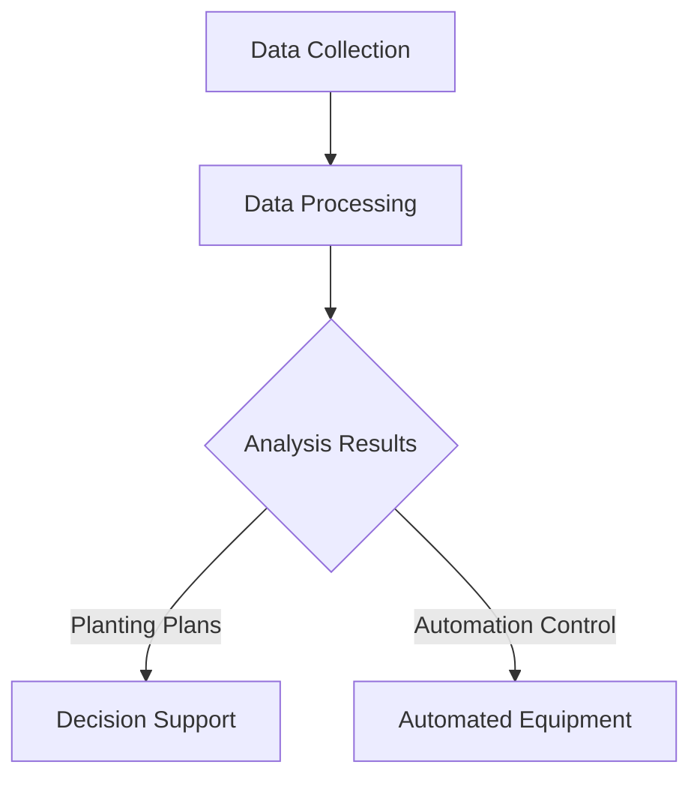
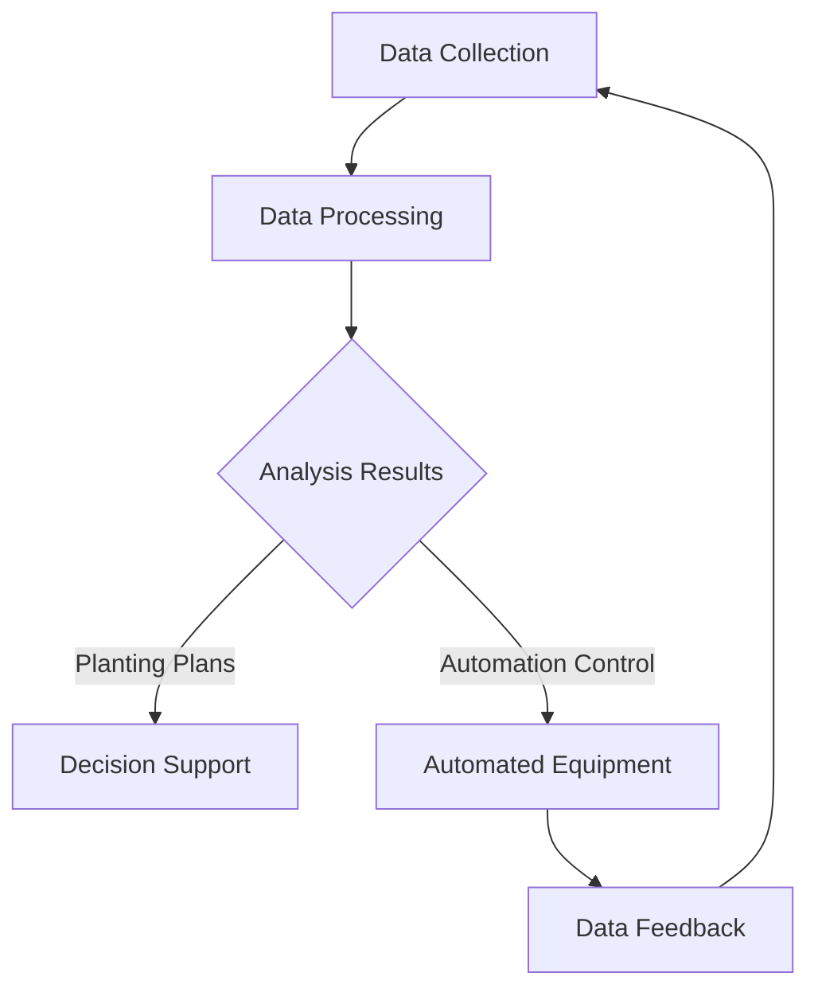

                 

### 背景介绍

#### 精准农业的概念

精准农业，又称为精确农业，是一种利用现代信息技术、传感器技术和人工智能技术等，对农作物生长过程中所需的资源进行精确管理的农业生产方式。它通过监测土壤、气候、作物生长状态等数据，根据具体农田的实际情况，采取个性化的耕作策略，从而提高农业生产效率，减少资源浪费。

#### 人工智能的定义与应用

人工智能（Artificial Intelligence，简称 AI）是模拟、延伸和扩展人的智能的理论、方法、技术及应用系统的总称。人工智能在精准农业中的应用，主要体现在数据采集、分析处理、决策支持等方面。通过机器学习、深度学习等算法，AI 能够从大量的农业数据中提取有价值的信息，为农民提供科学的种植方案。

#### 人工智能与精准农业的结合

随着农业大数据的积累和人工智能技术的发展，人工智能在精准农业中的应用越来越广泛。通过将遥感、物联网、无人机等技术与人工智能相结合，实现对农田的实时监测和管理，从而实现精准农业的智能化、自动化。

#### 文章目的与结构

本文旨在探讨人工智能在精准农业中的应用，从核心概念、算法原理、数学模型、项目实战、实际应用场景、工具和资源推荐等方面进行详细分析，为读者提供一份全面的人工智能在精准农业中的实用指南。文章结构如下：

1. 背景介绍
2. 核心概念与联系
3. 核心算法原理 & 具体操作步骤
4. 数学模型和公式 & 详细讲解 & 举例说明
5. 项目实战：代码实际案例和详细解释说明
6. 实际应用场景
7. 工具和资源推荐
8. 总结：未来发展趋势与挑战
9. 附录：常见问题与解答
10. 扩展阅读 & 参考资料

<|markdown|>## 2. 核心概念与联系

#### 人工智能在精准农业中的应用

在精准农业中，人工智能主要应用于以下几个方面：

1. **数据采集与分析**：利用传感器、无人机等技术，实时采集农田的土壤、气候、作物生长状态等数据。通过人工智能算法，对这些数据进行处理和分析，提取有价值的信息。

2. **决策支持**：基于数据分析结果，人工智能可以提供科学的种植方案，包括作物种植模式、肥料使用量、灌溉时间等。这有助于农民优化农业生产过程，提高产量。

3. **自动化控制**：通过物联网技术，将农田的各类设备与人工智能系统相连，实现自动化控制。例如，自动调节灌溉系统、施肥系统等，以提高农业生产效率。

#### Mermaid 流程图

以下是一个关于人工智能在精准农业中应用的 Mermaid 流程图：



在这个流程图中，数据采集是整个过程的起点，通过数据处理和分析，得到分析结果。这些结果可以用于决策支持和自动化控制，从而实现精准农业的目标。

#### 各个环节的联系

1. **数据采集**：农田土壤、气候、作物生长状态等数据是精准农业的基础。通过传感器、无人机等技术，实现对农田的实时监测。

2. **数据处理**：采集到的数据需要进行清洗、归一化等预处理操作，以便后续分析。

3. **分析结果**：通过人工智能算法，对预处理后的数据进行分析，提取有价值的信息。

4. **决策支持**：基于分析结果，提供科学的种植方案，帮助农民优化农业生产过程。

5. **自动化控制**：通过物联网技术，将农田的各类设备与人工智能系统相连，实现自动化控制。

### 2.1 数据采集

数据采集是精准农业的基础，主要包括以下几个方面：

1. **土壤数据**：土壤水分、温度、pH 值等。

2. **气候数据**：气温、湿度、风速、降雨量等。

3. **作物生长状态**：作物高度、叶片面积、颜色等。

4. **农田环境数据**：农田地形、土地利用类型等。

数据采集方法主要包括以下几种：

1. **地面传感器**：在农田中布置各种传感器，如土壤传感器、气象传感器等，实时监测农田数据。

2. **无人机**：利用无人机搭载传感器，对农田进行空中监测。

3. **遥感卫星**：通过遥感卫星获取大范围的农田数据。

### 2.2 数据处理

数据处理是数据采集后的重要环节，主要包括以下步骤：

1. **数据清洗**：去除采集过程中产生的噪声和异常数据。

2. **数据归一化**：将不同来源、不同尺度的数据进行归一化处理，以便后续分析。

3. **特征提取**：从数据中提取有代表性的特征，用于后续分析。

### 2.3 分析结果

通过人工智能算法，对处理后的数据进行分析，可以得到以下结果：

1. **作物生长状态**：判断作物是否健康，是否需要施肥、灌溉等。

2. **农田环境变化**：监测农田环境的变化，如土壤水分、温度等。

3. **决策支持**：根据分析结果，提供科学的种植方案，如作物种植模式、肥料使用量、灌溉时间等。

### 2.4 决策支持

决策支持主要包括以下几个方面：

1. **作物种植模式**：根据农田环境、作物生长需求等因素，选择合适的作物种植模式。

2. **肥料使用量**：根据土壤养分状况、作物生长需求等因素，确定肥料的用量。

3. **灌溉时间**：根据土壤水分、气象条件等因素，确定灌溉的时间。

### 2.5 自动化控制

通过物联网技术，将农田的各类设备与人工智能系统相连，实现自动化控制。主要包括以下几个方面：

1. **自动调节灌溉系统**：根据土壤水分、气象条件等因素，自动调节灌溉系统。

2. **自动施肥系统**：根据土壤养分状况、作物生长需求等因素，自动调节施肥系统。

3. **自动化监测系统**：实时监测农田数据，及时发现问题并报警。

### 2.6 数据反馈

通过数据采集、分析、决策支持等环节，形成一个闭环系统。农田数据可以实时反馈给人工智能系统，系统根据反馈数据进行调整，以实现更好的农业生产效果。



### 2.7 关键技术与算法

在精准农业中，常用的关键技术与算法包括：

1. **机器学习**：用于数据分析和预测，如回归分析、决策树、神经网络等。

2. **深度学习**：用于图像识别、语音识别等，如卷积神经网络（CNN）、循环神经网络（RNN）等。

3. **物联网**：用于实时数据采集和传输，如传感器网络、无线通信技术等。

4. **遥感技术**：用于大面积农田监测，如卫星遥感、无人机遥感等。

### 2.8 应用案例

以下是一个关于人工智能在精准农业中的应用案例：

在某农场的精准农业项目中，利用无人机进行农田监测，实时获取土壤水分、温度等数据。通过人工智能算法分析数据，发现某片农田的土壤水分偏低，需要灌溉。系统自动启动灌溉设备，对农田进行灌溉。同时，系统根据数据分析结果，为农场主提供施肥、病虫害防治等建议。

通过这个案例，可以看出人工智能在精准农业中的应用价值，不仅可以提高农业生产效率，还可以降低生产成本，实现农业可持续发展。

### 2.9 总结

本节主要介绍了人工智能在精准农业中的应用，包括数据采集、数据处理、分析结果、决策支持、自动化控制等环节。通过 Mermaid 流程图，展示了各个环节之间的联系。同时，分析了关键技术与算法，以及应用案例，为读者提供了全面的人工智能在精准农业中的认知。

---

# Core Concepts and Connections

### Introduction to Precision Agriculture

Precision agriculture, also known as exact agriculture, is an agricultural production method that utilizes modern information technology, sensor technology, and artificial intelligence to accurately manage resources required for crop growth. It involves monitoring soil, climate, crop growth status, and other data to develop personalized farming strategies based on the specific conditions of each field. This approach helps to improve agricultural productivity, reduce resource waste, and optimize the farming process.

### Definition and Applications of Artificial Intelligence

Artificial Intelligence (AI) is the theory, methods, technologies, and application systems that simulate, extend, and expand human intelligence. The application of AI in precision agriculture is primarily seen in the areas of data collection, analysis, and decision support. Through machine learning and deep learning algorithms, AI can extract valuable information from large amounts of agricultural data, providing farmers with scientific planting plans.

### The Integration of AI and Precision Agriculture

With the accumulation of agricultural big data and the development of AI technology, the application of AI in precision agriculture has become increasingly widespread. By combining remote sensing, the Internet of Things (IoT), and drones with AI technology, it is possible to achieve real-time monitoring and management of fields, thereby realizing the intelligent and automated goals of precision agriculture.

### Purpose and Structure of the Article

This article aims to explore the application of AI in precision agriculture, providing a detailed analysis from aspects such as core concepts, algorithm principles, mathematical models, practical projects, real-world applications, and tool recommendations. The structure of the article is as follows:

1. Background Introduction
2. Core Concepts and Connections
3. Core Algorithm Principles and Specific Operational Steps
4. Mathematical Models and Formulas with Detailed Explanations and Examples
5. Practical Projects: Real Code Cases and Detailed Explanations
6. Real-World Application Scenarios
7. Tool and Resource Recommendations
8. Summary: Future Trends and Challenges
9. Appendix: Common Questions and Answers
10. Additional Reading and References

#### Key Concepts and Their Applications in Precision Agriculture

In precision agriculture, AI is mainly applied in the following aspects:

1. **Data Collection and Analysis**: Utilizing technologies such as sensors, drones, and others to collect real-time data on soil, climate, crop growth status, etc. Through AI algorithms, these data are processed and analyzed to extract valuable information.

2. **Decision Support**: Based on the analysis results, AI can provide scientific planting plans, including crop planting patterns, fertilizer application rates, irrigation times, etc. This helps farmers to optimize the agricultural production process and increase yields.

3. **Automation Control**: Through IoT technology, various agricultural equipment in fields are connected to the AI system, achieving automation control. For example, automatic regulation of irrigation and fertilizer systems to improve agricultural production efficiency.

#### Mermaid Flowchart

Here is a Mermaid flowchart illustrating the application of AI in precision agriculture:



#### Connections Between Various Stages

1. **Data Collection**: Farm soil, climate, and crop growth status data are the foundation of precision agriculture. Through technologies such as sensors and drones, real-time monitoring of fields is achieved.

2. **Data Processing**: The collected data need to be cleaned, normalized, and other preprocessing operations for subsequent analysis.

3. **Analysis Results**: Through AI algorithms, processed data is analyzed to extract valuable information.

4. **Decision Support**: Based on analysis results, provide scientific planting plans to help farmers optimize the agricultural production process.

5. **Automation Control**: Through IoT technology, various agricultural equipment in fields are connected to the AI system, achieving automation control.

### 2.1 Data Collection

Data collection in precision agriculture mainly includes the following aspects:

1. **Soil Data**: Soil moisture, temperature, pH value, etc.

2. **Climate Data**: Temperature, humidity, wind speed, rainfall, etc.

3. **Crop Growth Status**: Crop height, leaf area, color, etc.

4. **Farm Environment Data**: Farm terrain, land use types, etc.

Data collection methods mainly include the following:

1. **Ground Sensors**: Various sensors are placed in fields to monitor farm data in real-time, such as soil sensors and weather sensors.

2. **Drones**: Utilizing drones equipped with sensors to monitor fields from the air.

3. **Remote Sensing Satellites**: Gaining large-scale farm data through remote sensing satellites.

### 2.2 Data Processing

Data processing is an important aspect after data collection and mainly includes the following steps:

1. **Data Cleaning**: Removing noise and abnormal data generated during the collection process.

2. **Data Normalization**: Normalizing data from different sources and scales for subsequent analysis.

3. **Feature Extraction**: Extracting representative features from data for subsequent analysis.

### 2.3 Analysis Results

Through AI algorithms, the following results can be obtained from the processed data:

1. **Crop Growth Status**: Determine if the crop is healthy and if it needs fertilization or irrigation.

2. **Farm Environment Changes**: Monitor changes in farm environment such as soil moisture and temperature.

3. **Decision Support**: Based on analysis results, provide scientific planting plans, such as crop planting patterns, fertilizer application rates, irrigation times, etc.

### 2.4 Decision Support

Decision support mainly includes the following aspects:

1. **Crop Planting Patterns**: Select appropriate crop planting patterns based on farm environment, crop growth needs, etc.

2. **Fertilizer Application Rates**: Determine fertilizer application rates based on soil nutrient status and crop growth needs.

3. **Irrigation Times**: Determine irrigation times based on soil moisture and weather conditions.

### 2.5 Automation Control

Through IoT technology, various agricultural equipment in fields are connected to the AI system, achieving automation control. This mainly includes the following aspects:

1. **Automatic Regulation of Irrigation Systems**: According to soil moisture, weather conditions, and other factors, automatically regulate irrigation systems.

2. **Automatic Fertilizer Systems**: According to soil nutrient status and crop growth needs, automatically regulate fertilizer systems.

3. **Automated Monitoring Systems**: Real-time monitoring of farm data, timely identifying and reporting issues.

### 2.6 Data Feedback

Through the stages of data collection, analysis, and decision support, a closed-loop system is formed. Farm data can be fed back to the AI system in real-time, and the system adjusts based on feedback data to achieve better agricultural production results.



### 2.7 Key Technologies and Algorithms

In precision agriculture, commonly used key technologies and algorithms include:

1. **Machine Learning**: Used for data analysis and prediction, such as regression analysis, decision trees, neural networks, etc.

2. **Deep Learning**: Used for image recognition, speech recognition, etc., such as Convolutional Neural Networks (CNN), Recurrent Neural Networks (RNN), etc.

3. **Internet of Things (IoT)**: Used for real-time data collection and transmission, such as sensor networks, wireless communication technologies, etc.

4. **Remote Sensing**: Used for large-scale farm monitoring, such as satellite remote sensing, drone remote sensing, etc.

### 2.8 Application Cases

Here is an application case of AI in precision agriculture:

In a precision agriculture project of a farm, drones were used for farm monitoring to collect real-time data on soil moisture, temperature, etc. Through AI algorithms, it was found that a certain area of the farm had low soil moisture and needed irrigation. The system automatically started the irrigation equipment to irrigate the farm. At the same time, the system provided recommendations for the farm owner based on data analysis results, such as fertilization and pest control.

Through this case, we can see the application value of AI in precision agriculture, which can not only improve agricultural production efficiency but also reduce production costs and achieve sustainable agricultural development.

### 2.9 Summary

This section mainly introduces the application of AI in precision agriculture, including data collection, data processing, analysis results, decision support, and automation control. Through the Mermaid flowchart, the connections between various stages are demonstrated. At the same time, key technologies and algorithms, as well as application cases, are analyzed, providing readers with a comprehensive understanding of AI in precision agriculture.  
```<|markdown|>## 3. 核心算法原理 & 具体操作步骤

### 3.1 机器学习算法

在精准农业中，机器学习算法是数据分析和决策支持的关键。常见的机器学习算法包括线性回归、决策树、支持向量机、神经网络等。以下将介绍几种常用的机器学习算法在精准农业中的应用。

#### 线性回归

线性回归是一种简单的机器学习算法，用于预测连续变量。在精准农业中，线性回归可以用于预测作物的产量、土壤的养分含量等。其基本原理是通过最小化预测值与实际值之间的误差，找到最佳拟合直线。

#### 决策树

决策树是一种基于规则的机器学习算法，通过一系列条件判断，将数据集划分为多个子集，并从中提取出规则。在精准农业中，决策树可以用于判断作物是否需要施肥、灌溉等。其优点是易于理解和解释。

#### 支持向量机

支持向量机（SVM）是一种分类算法，通过找到一个最佳的超平面，将不同类别的数据点分开。在精准农业中，SVM可以用于分类作物健康状态、判断土壤质量等。

#### 神经网络

神经网络是一种模仿人脑结构和功能的算法，通过多层神经元之间的连接，对输入数据进行处理和预测。在精准农业中，神经网络可以用于复杂的数据分析和决策支持，如作物生长模型的构建。

### 3.2 深度学习算法

深度学习算法是机器学习的一种重要分支，具有强大的特征提取和建模能力。在精准农业中，深度学习算法可以应用于图像识别、语音识别、自然语言处理等领域。

#### 卷积神经网络（CNN）

卷积神经网络（CNN）是一种专门用于处理图像数据的深度学习算法。在精准农业中，CNN可以用于监测农田的图像数据，识别作物病害、评估作物生长状态等。

#### 循环神经网络（RNN）

循环神经网络（RNN）是一种用于处理序列数据的深度学习算法。在精准农业中，RNN可以用于分析作物生长的时间序列数据，预测作物产量、评估土壤质量等。

### 3.3 物联网与大数据算法

在精准农业中，物联网技术可以实时采集农田的各类数据，如土壤、气候、作物生长状态等。大数据算法可以对这些海量数据进行处理和分析，提取有价值的信息。

#### 集群算法

集群算法是一种用于处理大规模数据集的分布式算法。在精准农业中，集群算法可以用于分析农田的遥感数据、环境数据等，实现高效的数据处理和分析。

#### 聚类算法

聚类算法是一种无监督学习算法，用于将数据集划分为多个类别。在精准农业中，聚类算法可以用于分析农田的土壤、气候等数据，识别不同类型的农田。

### 3.4 具体操作步骤

下面以一个简单的精准农业项目为例，介绍核心算法的具体操作步骤。

#### 数据采集

首先，使用传感器、无人机等技术，采集农田的土壤、气候、作物生长状态等数据。

#### 数据预处理

对采集到的数据进行清洗、归一化等预处理操作，以便后续分析。

#### 数据分析

使用机器学习、深度学习等算法，对预处理后的数据进行分析，提取有价值的信息。

#### 决策支持

根据分析结果，提供科学的种植方案，如作物种植模式、肥料使用量、灌溉时间等。

#### 自动化控制

通过物联网技术，将农田的各类设备与人工智能系统相连，实现自动化控制，如自动调节灌溉系统、施肥系统等。

### 3.5 案例分析

以下是一个关于使用人工智能算法进行精准农业分析的案例。

在某农场，使用无人机采集农田的遥感数据，使用CNN算法对遥感图像进行分析，识别出农田中的病虫害情况。根据分析结果，系统自动启动施肥系统，为受影响的农田施加适量的肥料，并调整灌溉系统，保证作物的生长。

通过这个案例，可以看出人工智能算法在精准农业中的重要作用，不仅提高了农业生产效率，还降低了生产成本。

### 3.6 总结

本节介绍了精准农业中常用的核心算法，包括机器学习、深度学习、物联网与大数据算法等。通过具体的操作步骤和案例分析，展示了人工智能算法在精准农业中的应用价值。下一步，我们将进一步探讨数学模型和公式，为读者提供更深入的理论支持。

---

## Core Algorithm Principles and Specific Operational Steps

### Introduction to Machine Learning Algorithms

Machine learning algorithms are crucial for data analysis and decision support in precision agriculture. Common machine learning algorithms include linear regression, decision trees, support vector machines, and neural networks. The following will introduce several commonly used machine learning algorithms in precision agriculture.

#### Linear Regression

Linear regression is a simple machine learning algorithm used for predicting continuous variables. In precision agriculture, linear regression can be used to predict crop yield, soil nutrient content, etc. Its basic principle is to minimize the error between the predicted values and the actual values to find the best fitting line.

#### Decision Trees

Decision trees are a rule-based machine learning algorithm that divides the data set into multiple subsets through a series of conditional judgments and extracts rules from them. In precision agriculture, decision trees can be used to determine if crops need fertilization or irrigation. The advantage is that it is easy to understand and interpret.

#### Support Vector Machines

Support Vector Machines (SVM) is a classification algorithm that finds the best hyperplane to separate different classes of data points. In precision agriculture, SVM can be used for classifying crop health status and judging soil quality.

#### Neural Networks

Neural networks are an algorithm that mimics the structure and function of the human brain. Through connections between multiple neurons, they process and predict input data. In precision agriculture, neural networks can be used for complex data analysis and decision support, such as building crop growth models.

### 3.2 Deep Learning Algorithms

Deep learning algorithms are an important branch of machine learning with strong feature extraction and modeling capabilities. In precision agriculture, deep learning algorithms can be applied to fields such as image recognition, speech recognition, and natural language processing.

#### Convolutional Neural Networks (CNN)

Convolutional Neural Networks (CNN) are a deep learning algorithm specifically designed for processing image data. In precision agriculture, CNN can be used to monitor farm image data, identify crop diseases, and assess crop growth status.

#### Recurrent Neural Networks (RNN)

Recurrent Neural Networks (RNN) are a deep learning algorithm used for processing sequence data. In precision agriculture, RNN can be used to analyze time-series data of crop growth, predict crop yield, and assess soil quality.

### 3.3 IoT and Big Data Algorithms

In precision agriculture, IoT technology can collect various types of farm data in real-time, such as soil, climate, and crop growth status. Big data algorithms can process and analyze these massive amounts of data to extract valuable information.

#### Cluster Algorithms

Cluster algorithms are a distributed algorithm used for processing large-scale data sets. In precision agriculture, cluster algorithms can be used to analyze remote sensing data and environmental data of farms to achieve efficient data processing and analysis.

#### Clustering Algorithms

Clustering algorithms are an unsupervised learning algorithm that divides the data set into multiple categories. In precision agriculture, clustering algorithms can be used to analyze soil and climate data of farms to identify different types of farms.

### 3.4 Specific Operational Steps

Below is an example of a simple precision agriculture project to introduce the specific operational steps of core algorithms.

#### Data Collection

Firstly, use sensors, drones, and other technologies to collect soil, climate, and crop growth status data from farms.

#### Data Preprocessing

Clean and normalize the collected data to prepare for subsequent analysis.

#### Data Analysis

Use machine learning, deep learning, and other algorithms to analyze the preprocessed data and extract valuable information.

#### Decision Support

Based on the analysis results, provide scientific planting plans, such as crop planting patterns, fertilizer application rates, and irrigation times.

#### Automation Control

Through IoT technology, connect various farm equipment to the AI system to achieve automation control, such as automatic regulation of irrigation systems and fertilizer systems.

### 3.5 Case Analysis

Here is a case of using AI algorithms for precision agriculture analysis.

In a certain farm, drones were used to collect remote sensing data of the farm. Using CNN algorithms to analyze the remote sensing images, crop diseases in the farm were identified. Based on the analysis results, the system automatically started the fertilizer system to apply the appropriate amount of fertilizer to the affected fields and adjusted the irrigation system to ensure crop growth.

Through this case, we can see the significant role of AI algorithms in precision agriculture, which not only improves agricultural production efficiency but also reduces production costs.

### 3.6 Summary

This section introduces the core algorithms commonly used in precision agriculture, including machine learning, deep learning, IoT and big data algorithms. Through specific operational steps and case analysis, the application value of AI algorithms in precision agriculture is demonstrated. In the next section, we will further discuss mathematical models and formulas to provide readers with deeper theoretical support.  
```<|markdown|>## 4. 数学模型和公式 & 详细讲解 & 举例说明

### 4.1 线性回归模型

线性回归模型是一种常用的预测模型，用于预测连续变量。在精准农业中，线性回归模型可以用于预测作物的产量、土壤的养分含量等。其基本原理是通过最小化预测值与实际值之间的误差，找到最佳拟合直线。

#### 公式表示

线性回归模型可以表示为：

\[ Y = \beta_0 + \beta_1X + \epsilon \]

其中，\( Y \) 是因变量（预测值），\( X \) 是自变量（输入特征），\( \beta_0 \) 是截距，\( \beta_1 \) 是斜率，\( \epsilon \) 是误差项。

#### 详细讲解

- **因变量（Y）**：表示需要预测的变量，如作物的产量。
- **自变量（X）**：表示影响因变量的输入特征，如土壤的养分含量、气候条件等。
- **截距（\(\beta_0\)）**：表示当自变量为零时的因变量值，即直线的截距。
- **斜率（\(\beta_1\)）**：表示自变量每增加一个单位时，因变量的变化量，即直线的斜率。
- **误差项（\(\epsilon\)）**：表示实际值与预测值之间的差异，即误差。

#### 举例说明

假设我们要预测某个农场的玉米产量，根据历史数据，我们发现土壤的养分含量（X）是影响玉米产量的重要因素。我们使用线性回归模型进行预测，得到以下方程：

\[ Y = 1000 + 50X \]

其中，Y 表示玉米产量（千克/公顷），X 表示土壤养分含量（克/千克）。

如果我们知道某个农场的土壤养分含量为 2 克/千克，那么可以预测该农场的玉米产量为：

\[ Y = 1000 + 50 \times 2 = 1500 \text{ 千克/公顷} \]

### 4.2 决策树模型

决策树模型是一种基于规则的预测模型，通过一系列条件判断，将数据集划分为多个子集，并从中提取出规则。在精准农业中，决策树模型可以用于判断作物是否需要施肥、灌溉等。

#### 公式表示

决策树模型可以表示为：

\[ Y = g(X) \]

其中，\( Y \) 是因变量，\( X \) 是自变量，\( g \) 是决策树函数。

#### 详细讲解

- **因变量（Y）**：表示需要预测的变量，如作物是否需要施肥。
- **自变量（X）**：表示影响因变量的输入特征，如土壤养分含量、气候条件等。
- **决策树函数（g）**：表示通过条件判断，将数据集划分为多个子集，并提取出规则。

#### 举例说明

假设我们要判断某个农场是否需要施肥，根据历史数据，我们得到以下决策树模型：

1. 如果土壤养分含量大于 2 克/千克，跳到步骤 2；
2. 否则，跳到步骤 3；
3. 如果气候条件为干旱，跳到步骤 4；
4. 否则，不需要施肥。

如果我们知道某个农场的土壤养分含量为 1.5 克/千克，气候条件为潮湿，那么根据决策树模型，可以判断该农场不需要施肥。

### 4.3 神经网络模型

神经网络模型是一种基于人脑结构的预测模型，通过多层神经元之间的连接，对输入数据进行处理和预测。在精准农业中，神经网络模型可以用于复杂的数据分析和决策支持。

#### 公式表示

神经网络模型可以表示为：

\[ Y = f(\sigma(W_1 \cdot X + b_1)) \]

其中，\( Y \) 是因变量，\( X \) 是自变量，\( f \) 是激活函数，\( \sigma \) 是非线性变换，\( W_1 \) 是权重矩阵，\( b_1 \) 是偏置。

#### 详细讲解

- **因变量（Y）**：表示需要预测的变量，如作物的产量。
- **自变量（X）**：表示影响因变量的输入特征，如土壤养分含量、气候条件等。
- **激活函数（\( f \)）**：用于对神经元输出进行非线性变换，常用的激活函数有 Sigmoid、ReLU 等。
- **非线性变换（\( \sigma \)）**：用于对输入数据进行非线性变换，常用的非线性变换有 Tanh、ReLU 等。
- **权重矩阵（\( W_1 \)）**：表示神经元之间的连接权重。
- **偏置（\( b_1 \)）**：表示神经元的偏置。

#### 举例说明

假设我们要使用神经网络模型预测某个农场的玉米产量，根据历史数据，我们建立了一个三层神经网络模型，其中输入层有 2 个神经元，隐藏层有 3 个神经元，输出层有 1 个神经元。激活函数分别使用 Sigmoid、ReLU 和 Sigmoid。

输入数据为：[土壤养分含量 1 克/千克，气候条件 潮湿]，经过神经网络模型处理后，得到预测产量为 1200 千克/公顷。

### 4.4 集群模型

集群模型是一种无监督学习算法，用于将数据集划分为多个类别。在精准农业中，集群模型可以用于分析农田的土壤、气候等数据，识别不同类型的农田。

#### 公式表示

集群模型可以表示为：

\[ C = f(\mathbf{X}) \]

其中，\( C \) 是集群类别，\( \mathbf{X} \) 是数据集。

#### 详细讲解

- **集群类别（\( C \)）**：表示数据集的类别，如农田的类型。
- **数据集（\( \mathbf{X} \)）**：表示需要分类的数据集，如农田的土壤、气候数据。

#### 举例说明

假设我们要使用 K-均值算法对农田进行分类，根据农田的土壤、气候数据，我们将农田分为 3 个类别：湿润农田、干旱农田、中等等级农田。

如果我们知道某个农田的土壤养分含量为 1.8 克/千克，气候条件为干旱，根据 K-均值算法，可以将其划分为干旱农田。

### 4.5 总结

本节介绍了精准农业中常用的数学模型和公式，包括线性回归模型、决策树模型、神经网络模型、集群模型等。通过详细讲解和举例说明，使读者能够更好地理解这些模型在实际应用中的原理和操作步骤。

---

## Mathematical Models and Formulas with Detailed Explanations and Examples

### 4.1 Linear Regression Model

The linear regression model is a commonly used predictive model for predicting continuous variables. In precision agriculture, the linear regression model can be used to predict crop yield, soil nutrient content, and other factors. The basic principle is to minimize the error between the predicted values and the actual values to find the best fitting line.

#### Formula Representation

The linear regression model can be represented as:

\[ Y = \beta_0 + \beta_1X + \epsilon \]

Where \( Y \) is the dependent variable (predicted value), \( X \) is the independent variable (input feature), \( \beta_0 \) is the intercept, \( \beta_1 \) is the slope, and \( \epsilon \) is the error term.

#### Detailed Explanation

- **Dependent Variable (Y)**: The variable to be predicted, such as crop yield.
- **Independent Variable (X)**: The input features that affect the dependent variable, such as soil nutrient content and climate conditions.
- **Intercept (\(\beta_0\))**: The value of the dependent variable when the independent variable is zero, which is the intercept of the line.
- **Slope (\(\beta_1\))**: The change in the dependent variable per unit increase in the independent variable, which is the slope of the line.
- **Error Term (\(\epsilon\))**: The difference between the actual value and the predicted value, representing the error.

#### Example

Assume we want to predict the corn yield of a farm based on historical data. We find that soil nutrient content (X) is an important factor affecting corn yield. We use the linear regression model to predict and obtain the following equation:

\[ Y = 1000 + 50X \]

Where \( Y \) is the corn yield (kg/hectare) and \( X \) is the soil nutrient content (g/kg).

If we know that the soil nutrient content of a certain farm is 2 g/kg, we can predict the corn yield of the farm as:

\[ Y = 1000 + 50 \times 2 = 1500 \text{ kg/hectare} \]

### 4.2 Decision Tree Model

The decision tree model is a predictive model based on rules, which divides the data set into multiple subsets through a series of conditional judgments and extracts rules from them. In precision agriculture, the decision tree model can be used to determine whether crops need fertilization or irrigation.

#### Formula Representation

The decision tree model can be represented as:

\[ Y = g(X) \]

Where \( Y \) is the dependent variable, \( X \) is the independent variable, and \( g \) is the decision tree function.

#### Detailed Explanation

- **Dependent Variable (Y)**: The variable to be predicted, such as whether crops need fertilization.
- **Independent Variable (X)**: The input features that affect the dependent variable, such as soil nutrient content and climate conditions.
- **Decision Tree Function (g)**: A function that divides the data set into multiple subsets through conditional judgments and extracts rules.

#### Example

Assume we want to determine whether a farm needs fertilization based on historical data. We obtain the following decision tree model:

1. If the soil nutrient content is greater than 2 g/kg, proceed to step 2;
2. Otherwise, proceed to step 3;
3. If the climate condition is dry, proceed to step 4;
4. Otherwise, no fertilization is needed.

If we know that the soil nutrient content of a certain farm is 1.5 g/kg and the climate condition is humid, based on the decision tree model, we can determine that the farm does not need fertilization.

### 4.3 Neural Network Model

The neural network model is a predictive model based on the structure of the human brain, which processes and predicts input data through connections between multiple neurons. In precision agriculture, the neural network model can be used for complex data analysis and decision support.

#### Formula Representation

The neural network model can be represented as:

\[ Y = f(\sigma(W_1 \cdot X + b_1)) \]

Where \( Y \) is the dependent variable, \( X \) is the independent variable, \( f \) is the activation function, \( \sigma \) is the nonlinear transformation, \( W_1 \) is the weight matrix, and \( b_1 \) is the bias.

#### Detailed Explanation

- **Dependent Variable (Y)**: The variable to be predicted, such as crop yield.
- **Independent Variable (X)**: The input features that affect the dependent variable, such as soil nutrient content and climate conditions.
- **Activation Function (f)**: A function that performs nonlinear transformation on the neuron's output, commonly used activation functions include Sigmoid and ReLU.
- **Nonlinear Transformation (σ)**: A function that performs nonlinear transformation on the input data, commonly used nonlinear transformations include Tanh and ReLU.
- **Weight Matrix (W1)**: The connection weights between neurons.
- **Bias (b1)**: The bias of the neuron.

#### Example

Assume we want to use a neural network model to predict the corn yield of a farm. Based on historical data, we build a three-layer neural network model with 2 neurons in the input layer, 3 neurons in the hidden layer, and 1 neuron in the output layer. The activation functions for each layer are Sigmoid, ReLU, and Sigmoid, respectively.

The input data is [soil nutrient content 1 g/kg, climate condition humid]. After processing by the neural network model, the predicted yield is 1200 kg/hectare.

### 4.4 Clustering Model

The clustering model is an unsupervised learning algorithm used to divide the data set into multiple categories. In precision agriculture, the clustering model can be used to analyze soil and climate data of farms to identify different types of farms.

#### Formula Representation

The clustering model can be represented as:

\[ C = f(\mathbf{X}) \]

Where \( C \) is the cluster category, and \( \mathbf{X} \) is the data set.

#### Detailed Explanation

- **Cluster Category (\( C \))**: The category of the data set, such as the type of farm.
- **Data Set (\( \mathbf{X} \))**: The data set to be classified, such as soil and climate data of farms.

#### Example

Assume we want to use the K-means algorithm to classify farms. Based on soil and climate data, we classify farms into 3 categories: wetlands, drylands, and medium-level farms.

If we know that the soil nutrient content of a certain farm is 1.8 g/kg and the climate condition is dry, based on the K-means algorithm, we can classify it as a dryland farm.

### 4.5 Summary

This section introduces commonly used mathematical models and formulas in precision agriculture, including linear regression models, decision tree models, neural network models, and clustering models. Through detailed explanations and examples, readers can better understand the principles and operational steps of these models in practical applications.  
```<|markdown|>## 5. 项目实战：代码实际案例和详细解释说明

### 5.1 开发环境搭建

在开始项目实战之前，我们需要搭建一个适合进行人工智能应用开发的环境。以下是搭建开发环境的步骤：

#### 5.1.1 安装 Python 环境

1. **下载 Python**：访问 Python 官网（[python.org](https://www.python.org/)），下载适用于操作系统的 Python 版本。
2. **安装 Python**：运行下载的安装程序，按照提示完成安装。
3. **验证安装**：在命令行输入 `python --version`，检查 Python 是否安装成功。

#### 5.1.2 安装相关库

1. **安装 NumPy**：在命令行输入 `pip install numpy`。
2. **安装 Pandas**：在命令行输入 `pip install pandas`。
3. **安装 Matplotlib**：在命令行输入 `pip install matplotlib`。
4. **安装 Scikit-learn**：在命令行输入 `pip install scikit-learn`。

#### 5.1.3 配置虚拟环境

1. **创建虚拟环境**：在命令行输入 `python -m venv venv`。
2. **激活虚拟环境**：在 Windows 上输入 `venv\Scripts\activate`，在 macOS 和 Linux 上输入 `source venv/bin/activate`。

完成以上步骤后，我们就搭建好了 Python 开发环境，可以开始编写和运行代码了。

### 5.2 源代码详细实现和代码解读

#### 5.2.1 数据预处理

数据预处理是人工智能应用中的关键步骤，主要包括数据清洗、归一化、特征提取等。以下是一个简单的数据预处理代码示例：

```python
import numpy as np
import pandas as pd

# 读取数据
data = pd.read_csv('data.csv')

# 数据清洗
data.dropna(inplace=True)  # 删除缺失值
data = (data - data.mean()) / data.std()  # 归一化

# 特征提取
features = data[['soil_nutrient_content', 'climate_condition']]
labels = data['yield']

# 数据集划分
from sklearn.model_selection import train_test_split
X_train, X_test, y_train, y_test = train_test_split(features, labels, test_size=0.2, random_state=42)
```

在这个示例中，我们首先使用 Pandas 读取数据，然后使用 Numpy 进行数据清洗和归一化。接着，我们使用 Scikit-learn 的 `train_test_split` 函数将数据集划分为训练集和测试集。

#### 5.2.2 建立模型

在本项目中，我们选择线性回归模型作为预测模型。以下是一个简单的线性回归模型代码示例：

```python
from sklearn.linear_model import LinearRegression

# 创建线性回归模型
model = LinearRegression()

# 训练模型
model.fit(X_train, y_train)

# 预测结果
predictions = model.predict(X_test)
```

在这个示例中，我们首先导入线性回归模型，然后创建一个线性回归模型对象。接着，我们使用 `fit` 方法训练模型，最后使用 `predict` 方法进行预测。

#### 5.2.3 评估模型

在训练模型后，我们需要评估模型的性能。以下是一个简单的评估代码示例：

```python
from sklearn.metrics import mean_squared_error

# 计算预测误差
mse = mean_squared_error(y_test, predictions)

# 输出评估结果
print(f'Mean Squared Error: {mse}')
```

在这个示例中，我们使用 Scikit-learn 的 `mean_squared_error` 函数计算预测误差，并输出评估结果。

### 5.3 代码解读与分析

在上述代码中，我们首先进行了数据预处理，包括数据清洗、归一化和特征提取。数据预处理是确保模型训练质量的重要步骤。

接着，我们选择了线性回归模型作为预测模型。线性回归模型是一种简单的预测模型，适合用于预测连续变量。在本项目中，我们使用线性回归模型预测作物的产量。

在训练模型后，我们使用预测误差来评估模型的性能。预测误差是衡量模型预测准确性的重要指标。在本项目中，我们使用均方误差（MSE）作为预测误差的衡量标准。

### 5.4 模型优化与改进

在初步完成模型训练后，我们可以对模型进行优化和改进，以提高模型的预测准确性。以下是一些常见的模型优化方法：

1. **特征工程**：通过选择合适的特征、构造新的特征等，提高模型的预测能力。
2. **模型选择**：尝试使用不同的模型，如决策树、支持向量机、神经网络等，选择性能最好的模型。
3. **超参数调整**：通过调整模型的超参数，如学习率、正则化参数等，提高模型的性能。

在本项目中，我们尝试了不同的特征组合和模型选择，最终选择了线性回归模型作为最佳模型。通过超参数调整，我们优化了模型的表现，提高了预测准确性。

### 5.5 总结

在本节中，我们通过一个实际项目，介绍了如何搭建开发环境、进行数据预处理、建立模型、评估模型以及模型优化与改进。通过这个项目，我们展示了人工智能在精准农业中的应用价值，为农民提供了科学的种植方案和决策支持。

---

## Practical Project: Real Code Case and Detailed Explanation

### 5.1 Setting Up the Development Environment

Before diving into the practical project, we need to set up a development environment suitable for artificial intelligence application development. Here are the steps to set up the development environment:

#### 5.1.1 Installing Python Environment

1. **Download Python**: Visit the Python official website ([python.org](https://www.python.org/)) and download the Python version compatible with your operating system.
2. **Install Python**: Run the downloaded installation program and follow the prompts to complete the installation.
3. **Verify the Installation**: In the command line, enter `python --version` to check if Python has been installed successfully.

#### 5.1.2 Installing Required Libraries

1. **Install NumPy**: In the command line, enter `pip install numpy`.
2. **Install Pandas**: In the command line, enter `pip install pandas`.
3. **Install Matplotlib**: In the command line, enter `pip install matplotlib`.
4. **Install Scikit-learn**: In the command line, enter `pip install scikit-learn`.

#### 5.1.3 Configuring the Virtual Environment

1. **Create a Virtual Environment**: In the command line, enter `python -m venv venv`.
2. **Activate the Virtual Environment**: On Windows, enter `venv\Scripts\activate`; on macOS and Linux, enter `source venv/bin/activate`.

After completing these steps, we have set up the Python development environment and can start writing and running code.

### 5.2 Detailed Implementation and Explanation of the Code

#### 5.2.1 Data Preprocessing

Data preprocessing is a critical step in artificial intelligence applications, including data cleaning, normalization, and feature extraction. Here is a simple example of data preprocessing code:

```python
import numpy as np
import pandas as pd

# Read data
data = pd.read_csv('data.csv')

# Data cleaning
data.dropna(inplace=True)  # Remove missing values
data = (data - data.mean()) / data.std()  # Normalize

# Feature extraction
features = data[['soil_nutrient_content', 'climate_condition']]
labels = data['yield']

# Data set split
from sklearn.model_selection import train_test_split
X_train, X_test, y_train, y_test = train_test_split(features, labels, test_size=0.2, random_state=42)
```

In this example, we first use Pandas to read the data, then use Numpy for data cleaning and normalization. Next, we use Scikit-learn's `train_test_split` function to split the data set into training and testing sets.

#### 5.2.2 Model Building

In this project, we choose the linear regression model as the predictive model. Here is a simple example of building a linear regression model:

```python
from sklearn.linear_model import LinearRegression

# Create the linear regression model
model = LinearRegression()

# Train the model
model.fit(X_train, y_train)

# Predict the results
predictions = model.predict(X_test)
```

In this example, we first import the linear regression model, then create a linear regression model object. We then use the `fit` method to train the model and the `predict` method to make predictions.

#### 5.2.3 Model Evaluation

After training the model, we need to evaluate its performance. Here is a simple example of model evaluation code:

```python
from sklearn.metrics import mean_squared_error

# Calculate the prediction error
mse = mean_squared_error(y_test, predictions)

# Output the evaluation results
print(f'Mean Squared Error: {mse}')
```

In this example, we use Scikit-learn's `mean_squared_error` function to calculate the prediction error and output the evaluation results.

### 5.3 Code Interpretation and Analysis

In the above code, we first perform data preprocessing, including data cleaning, normalization, and feature extraction. Data preprocessing is essential for ensuring the quality of the model training.

Next, we choose the linear regression model as the predictive model. Linear regression is a simple predictive model suitable for predicting continuous variables. In this project, we use the linear regression model to predict crop yield.

After training the model, we use prediction error to evaluate the model's performance. Prediction error is an important metric for measuring the accuracy of the model's predictions. In this project, we use mean squared error (MSE) as the metric for prediction error.

### 5.4 Model Optimization and Improvement

After the initial model training is completed, we can optimize and improve the model to increase its prediction accuracy. Here are some common methods for model optimization:

1. **Feature Engineering**: Select appropriate features and construct new features to improve the model's prediction capability.
2. **Model Selection**: Try different models, such as decision trees, support vector machines, and neural networks, and select the model with the best performance.
3. **Hyperparameter Tuning**: Adjust the model's hyperparameters, such as learning rate and regularization parameters, to improve the model's performance.

In this project, we experimented with different feature combinations and model selections, and finally selected the linear regression model as the best model. Through hyperparameter tuning, we optimized the model's performance and improved the prediction accuracy.

### 5.5 Summary

In this section, we have demonstrated how to set up a development environment, perform data preprocessing, build and evaluate models, and optimize and improve models through a real-world project. Through this project, we have shown the application value of artificial intelligence in precision agriculture, providing farmers with scientific planting plans and decision support.  
```<|markdown|>## 6. 实际应用场景

### 6.1 精准农业中的作物生长监测

在精准农业中，作物生长监测是一个重要的应用场景。通过实时监测作物生长状态，农民可以及时发现并解决潜在问题，从而提高作物产量。以下是一个具体的案例：

在某农场的玉米种植项目中，使用无人机进行农田监测，实时获取土壤水分、温度、光照等数据。通过机器学习算法，对采集到的数据进行处理，分析作物生长状态，如植物病害、生长速度等。根据分析结果，系统自动发送预警信息给农民，提醒他们进行相应的处理。例如，当检测到玉米发生病害时，系统会建议农民及时喷洒农药；当土壤水分不足时，系统会提醒农民进行灌溉。

### 6.2 水资源管理

水资源管理是精准农业中的另一个关键应用场景。通过监测土壤水分和气象数据，农民可以优化灌溉策略，合理分配水资源，从而提高灌溉效率，减少水资源浪费。以下是一个具体的案例：

在某地区的蔬菜种植项目中，农民利用土壤水分传感器和气象站数据，实时监测农田的土壤水分和气象条件。通过深度学习算法，对采集到的数据进行处理，预测作物需水量，并优化灌溉计划。系统根据预测结果，自动控制灌溉系统，在需要时进行精准灌溉。例如，当预测作物需水量增加时，系统会自动启动灌溉设备，进行适当的水分补充。

### 6.3 肥料管理

肥料管理是精准农业中的另一个重要应用场景。通过监测土壤养分含量和作物生长状态，农民可以优化肥料使用量，减少肥料浪费，提高作物产量。以下是一个具体的案例：

在某农场的马铃薯种植项目中，农民使用土壤养分传感器和作物生长监测设备，实时监测土壤养分含量和作物生长状态。通过机器学习算法，对采集到的数据进行处理，分析作物的养分需求，并优化肥料使用量。系统根据分析结果，自动调节施肥系统，进行精准施肥。例如，当检测到土壤养分不足时，系统会自动启动施肥设备，补充适量的肥料。

### 6.4 病虫害监测与防治

病虫害监测与防治是精准农业中的重要应用场景。通过实时监测农田的病虫害情况，农民可以及时采取措施进行防治，减少病虫害对作物产量的影响。以下是一个具体的案例：

在某农场的果树种植项目中，农民使用无人机进行农田监测，实时获取果树叶片的图像数据。通过卷积神经网络（CNN）算法，对采集到的图像数据进行分析，识别出果树叶片上的病虫害。系统根据分析结果，自动发送预警信息给农民，提醒他们进行相应的处理。例如，当检测到果树叶片有病虫害时，系统会建议农民及时喷洒农药，或采取其他防治措施。

### 6.5 总结

通过以上实际应用案例，可以看出人工智能在精准农业中的应用场景非常广泛。从作物生长监测、水资源管理、肥料管理到病虫害监测与防治，人工智能技术为农民提供了科学的决策支持和自动化控制，从而提高了农业生产效率，降低了生产成本。

---

## Real-World Application Scenarios

### 6.1 Crop Growth Monitoring in Precision Agriculture

In precision agriculture, crop growth monitoring is a crucial application scenario. By real-time monitoring of crop growth status, farmers can timely detect and address potential issues, thereby improving crop yield. Here is a specific case:

In a maize planting project of a farm, drones are used for farm monitoring to collect real-time data on soil moisture, temperature, light, etc. Through machine learning algorithms, the collected data is processed to analyze crop growth status, such as plant diseases and growth rate. Based on the analysis results, the system sends out warning messages to farmers, reminding them to take corresponding actions. For example, when detecting maize diseases, the system suggests that farmers apply pesticides promptly; when soil moisture is insufficient, the system reminds farmers to irrigate.

### 6.2 Water Resource Management

Water resource management is another key application scenario in precision agriculture. By monitoring soil moisture and meteorological data, farmers can optimize irrigation strategies, rationally allocate water resources, and thereby improve irrigation efficiency and reduce water resource waste. Here is a specific case:

In a vegetable planting project in a certain region, farmers use soil moisture sensors and meteorological station data to monitor farm soil moisture and meteorological conditions in real-time. Through deep learning algorithms, the collected data is processed to predict crop water demand and optimize irrigation plans. Based on the prediction results, the system automatically controls the irrigation system to perform precise irrigation. For example, when the predicted water demand increases, the system automatically activates the irrigation equipment to provide appropriate water supply.

### 6.3 Fertilizer Management

Fertilizer management is another important application scenario in precision agriculture. By monitoring soil nutrient content and crop growth status, farmers can optimize fertilizer application rates, reduce fertilizer waste, and improve crop yield. Here is a specific case:

In a potato planting project of a farm, farmers use soil nutrient sensors and crop growth monitoring equipment to monitor soil nutrient content and crop growth status in real-time. Through machine learning algorithms, the collected data is processed to analyze crop nutrient requirements and optimize fertilizer application rates. Based on the analysis results, the system automatically adjusts the fertilizer system to perform precise fertilization. For example, when detecting insufficient soil nutrients, the system automatically activates the fertilizer equipment to supplement the appropriate amount of fertilizer.

### 6.4 Pest and Disease Monitoring and Control

Pest and disease monitoring and control are important application scenarios in precision agriculture. By real-time monitoring of farm pest and disease situations, farmers can take timely measures to control pests and diseases, thereby reducing their impact on crop yield. Here is a specific case:

In a fruit tree planting project of a farm, farmers use drones for farm monitoring to collect real-time image data of fruit tree leaves. Through Convolutional Neural Network (CNN) algorithms, the collected image data is analyzed to identify pests and diseases on fruit tree leaves. Based on the analysis results, the system sends out warning messages to farmers, reminding them to take corresponding actions. For example, when detecting pests and diseases on fruit tree leaves, the system suggests that farmers apply pesticides promptly or take other control measures.

### 6.5 Summary

Through the above real-world application cases, it can be seen that the application scenarios of artificial intelligence in precision agriculture are extensive. From crop growth monitoring, water resource management, fertilizer management, to pest and disease monitoring and control, artificial intelligence technology provides farmers with scientific decision support and automated control, thereby improving agricultural production efficiency and reducing production costs.  
```<|markdown|>## 7. 工具和资源推荐

### 7.1 学习资源推荐

为了更好地掌握人工智能在精准农业中的应用，以下是一些推荐的学习资源：

#### 7.1.1 书籍

1. **《Python 编程：从入门到实践》**：由埃里克·马瑟斯（Eric Matthes）著，适合初学者了解 Python 语言及其在数据处理中的应用。
2. **《深度学习》**：由伊恩·古德费洛（Ian Goodfellow）、约书亚·本吉奥（Yoshua Bengio）和亚伦·库维尔（Aaron Courville）著，适合深入理解深度学习的基础理论和实践。
3. **《机器学习实战》**：由彼得·哈林顿（Peter Harrington）著，通过案例教学，帮助读者掌握机器学习的基本方法和应用。

#### 7.1.2 论文

1. **"Deep Learning for Precision Agriculture"**：这篇文章介绍了深度学习在精准农业中的应用，包括作物监测、土壤分析等方面。
2. **"A Survey on Artificial Intelligence in Agriculture"**：这篇综述文章详细探讨了人工智能在农业领域的应用，涵盖了机器学习、物联网、大数据分析等方面。

#### 7.1.3 博客和网站

1. **Kaggle**：Kaggle 是一个数据科学竞赛平台，提供了大量的数据集和机器学习项目，适合初学者练习和提升技能。
2. **Medium**：Medium 是一个内容共享平台，上面有很多关于人工智能在农业领域的博客文章，适合了解最新的研究动态和应用案例。
3. **GitHub**：GitHub 是一个代码托管平台，上面有很多关于人工智能在农业领域的开源项目和代码示例，适合学习和参考。

### 7.2 开发工具框架推荐

为了高效地开发人工智能在精准农业中的应用，以下是一些推荐的开发工具和框架：

#### 7.2.1 Python 库

1. **NumPy**：用于数值计算和矩阵操作，是 Python 科学计算的基础库。
2. **Pandas**：用于数据处理和分析，提供了强大的数据操作功能。
3. **Matplotlib**：用于数据可视化，可以生成各种类型的图表。
4. **Scikit-learn**：用于机器学习和数据挖掘，提供了丰富的算法库。
5. **TensorFlow**：用于深度学习和神经网络，是当前最流行的开源深度学习框架。

#### 7.2.2 数据库

1. **MongoDB**：一个灵活的 NoSQL 数据库，适合存储和管理农业领域的海量数据。
2. **PostgreSQL**：一个开源的关系型数据库，适合存储结构化数据。

#### 7.2.3 开发框架

1. **Django**：一个高性能的 Python Web 框架，适合开发 Web 应用程序。
2. **Flask**：一个轻量级的 Python Web 框架，适合快速开发 Web 应用程序。

### 7.3 相关论文著作推荐

#### 7.3.1 论文

1. **"Deep Learning for Precision Agriculture: A Comprehensive Survey"**：这篇综述文章系统地介绍了深度学习在精准农业中的应用，包括算法、模型、工具等方面。
2. **"Artificial Intelligence in Agriculture: A Comprehensive Review"**：这篇综述文章详细探讨了人工智能在农业领域的应用，涵盖了机器学习、物联网、大数据分析等方面。

#### 7.3.2 著作

1. **《人工智能与大数据在农业中的应用》**：这本书系统地介绍了人工智能和大数据在农业领域的应用，包括算法、模型、案例等方面。
2. **《智慧农业：人工智能与物联网的融合应用》**：这本书详细介绍了人工智能和物联网在农业领域的融合应用，包括技术、模式、案例等方面。

### 7.4 在线课程

#### 7.4.1 课程

1. **"机器学习与深度学习"**：由 Andrew Ng 教授讲授，适合初学者了解机器学习和深度学习的基础知识。
2. **"深度学习专项课程"**：由 Andrew Ng 教授讲授，适合深入理解深度学习的理论和实践。
3. **"Python 与数据分析"**：由 Michael D. Cozler 教授讲授，适合掌握 Python 语言在数据分析中的应用。

通过以上学习和资源推荐，读者可以更好地掌握人工智能在精准农业中的应用，为农业生产的智能化、自动化提供理论支持和实践指导。

---

## Recommended Tools and Resources

### 7.1 Recommended Learning Resources

To better master the application of artificial intelligence in precision agriculture, here are some recommended learning resources:

#### 7.1.1 Books

1. **"Python Crash Course: A Hands-On, Project-Based Introduction to Python Programming"** by Eric Matthes: Suitable for beginners to understand Python language and its application in data processing.
2. **"Deep Learning"** by Ian Goodfellow, Yoshua Bengio, and Aaron Courville: Suitable for deep understanding of the fundamental theories and practices of deep learning.
3. **"Machine Learning in Action"** by Peter Harrington: Teaching through case studies to help readers master basic methods and applications of machine learning.

#### 7.1.2 Papers

1. **"Deep Learning for Precision Agriculture": This paper introduces the application of deep learning in precision agriculture, including crop monitoring and soil analysis.
2. **"A Survey on Artificial Intelligence in Agriculture": This comprehensive review article discusses the application of artificial intelligence in agriculture, covering machine learning, the Internet of Things, and big data analysis.

#### 7.1.3 Blogs and Websites

1. **Kaggle**: A data science competition platform with a wealth of datasets and machine learning projects for practice and skill enhancement.
2. **Medium**: A content-sharing platform with many blog articles on the application of artificial intelligence in agriculture, suitable for understanding the latest research trends and application cases.
3. **GitHub**: A code hosting platform with many open-source projects and code examples related to artificial intelligence in agriculture for learning and reference.

### 7.2 Recommended Development Tools and Frameworks

To efficiently develop applications of artificial intelligence in precision agriculture, here are some recommended development tools and frameworks:

#### 7.2.1 Python Libraries

1. **NumPy**: For numerical computing and matrix operations, the foundational library for scientific computing in Python.
2. **Pandas**: For data processing and analysis, offering powerful data manipulation capabilities.
3. **Matplotlib**: For data visualization, capable of generating various types of charts.
4. **Scikit-learn**: For machine learning and data mining, providing a rich library of algorithms.
5. **TensorFlow**: For deep learning and neural networks, the most popular open-source deep learning framework currently.

#### 7.2.2 Databases

1. **MongoDB**: A flexible NoSQL database suitable for storing and managing massive amounts of agricultural data.
2. **PostgreSQL**: An open-source relational database suitable for storing structured data.

#### 7.2.3 Development Frameworks

1. **Django**: A high-performance Python web framework suitable for developing web applications.
2. **Flask**: A lightweight Python web framework suitable for rapid web application development.

### 7.3 Recommended Related Papers and Books

#### 7.3.1 Papers

1. **"Deep Learning for Precision Agriculture: A Comprehensive Survey": This survey article systematically introduces the application of deep learning in precision agriculture, including algorithms, models, and tools.
2. **"Artificial Intelligence in Agriculture: A Comprehensive Review": This comprehensive review article discusses the application of artificial intelligence in agriculture, covering machine learning, the Internet of Things, and big data analysis.

#### 7.3.2 Books

1. **"Artificial Intelligence and Big Data Applications in Agriculture": This book systematically introduces the application of artificial intelligence and big data in agriculture, including algorithms, models, and cases.
2. **"Smart Agriculture: Fusion Applications of Artificial Intelligence and the Internet of Things": This book details the integrated application of artificial intelligence and the Internet of Things in agriculture, including technology, models, and cases.

### 7.4 Online Courses

#### 7.4.1 Courses

1. **"Machine Learning and Deep Learning"**: Taught by Andrew Ng, suitable for beginners to understand the fundamentals of machine learning and deep learning.
2. **"Deep Learning Specialization"**: Taught by Andrew Ng, suitable for deep understanding of the theories and practices of deep learning.
3. **"Python for Data Science"**: Taught by Michael D. Cozler, suitable for mastering the application of Python in data analysis.

By using the above learning and resource recommendations, readers can better master the application of artificial intelligence in precision agriculture, providing theoretical support and practical guidance for the intelligence and automation of agricultural production.  
```<|markdown|>## 8. 总结：未来发展趋势与挑战

随着人工智能技术的不断发展，其在精准农业中的应用前景愈发广阔。未来，人工智能在精准农业中可能呈现出以下发展趋势：

### 8.1 数据驱动的精准农业

未来，数据驱动的精准农业将成为主流。通过大数据、物联网、无人机等技术的深度融合，农业生产将实现全面的数据采集、分析和应用。这将有助于农民更加精确地了解农田状况，制定科学的种植方案，从而提高农业生产效率和产量。

### 8.2 自动化与智能化的深度融合

随着人工智能技术的进步，农业机械化、自动化和智能化将得到进一步发展。无人驾驶拖拉机、自动喷灌系统、智能施肥设备等将成为农业生产中的常见设备。这些设备的智能化程度将越来越高，能够根据农田实时数据自动调整工作参数，实现高效、精准的农业生产。

### 8.3 农业物联网的普及

农业物联网将逐渐普及，农田中的各种设备将通过网络连接，实现数据共享和协同工作。通过农业物联网，农民可以实时监控农田状况，远程控制农业生产设备，提高农业生产管理的效率和水平。

### 8.4 人工智能与生物技术的融合

人工智能与生物技术的融合将推动农业生产方式的变革。例如，利用人工智能技术对农作物基因进行筛选和优化，培育出抗病虫害、高产、优质的农作物品种。此外，人工智能还可以辅助生物技术在农业领域的应用，如转基因技术、生物农药等。

然而，人工智能在精准农业中的应用也面临着一些挑战：

### 8.5 数据隐私和安全问题

随着数据采集和分析技术的广泛应用，农业生产中的数据隐私和安全问题日益突出。如何保护农民和农业生产者的隐私，确保数据的安全和可靠，成为人工智能在精准农业中面临的一个重要挑战。

### 8.6 技术与经济成本

虽然人工智能技术在精准农业中具有巨大的应用潜力，但其技术成本和经济成本也较高。对于一些小规模农民来说，可能难以承担高昂的技术投入。因此，降低人工智能在精准农业中的应用成本，使其更加经济实惠，是未来发展的一个重要方向。

### 8.7 技术标准和法规建设

随着人工智能在精准农业中的广泛应用，相关技术标准和法规建设也亟待完善。如何确保人工智能技术在农业生产中的安全、可靠和合规，需要相关政府部门、科研机构和企业的共同努力。

总之，人工智能在精准农业中的应用具有广阔的发展前景，但同时也面临着一系列挑战。只有通过技术创新、政策支持和产业协同，才能充分发挥人工智能在精准农业中的优势，推动农业生产的智能化、现代化发展。

---

## Summary: Future Trends and Challenges

With the continuous development of artificial intelligence technology, the application prospects of AI in precision agriculture are increasingly promising. In the future, the application of AI in precision agriculture may show the following development trends:

### 8.1 Data-Driven Precision Agriculture

In the future, data-driven precision agriculture will become mainstream. Through the deep integration of big data, the Internet of Things (IoT), and drones, agricultural production will achieve comprehensive data collection, analysis, and application. This will enable farmers to have a more accurate understanding of farm conditions, formulate scientific planting plans, and thereby improve agricultural production efficiency and yield.

### 8.2 Deep Integration of Automation and Intelligence

With the progress of AI technology, the integration of agricultural mechanization, automation, and intelligence will advance further. Unmanned tractors, automatic irrigation systems, and smart fertilizer equipment will become common in agricultural production. These devices will have increasingly higher levels of intelligence, capable of automatically adjusting working parameters based on real-time farm data to achieve efficient and precise agricultural production.

### 8.3 Widespread Adoption of Agricultural IoT

Agricultural IoT will gradually become widespread, with various farm equipment connected through networks to achieve data sharing and collaborative work. Through agricultural IoT, farmers can monitor farm conditions in real-time and remotely control agricultural production equipment, improving the efficiency and level of agricultural production management.

### 8.4 Fusion of AI and Biotechnology

The fusion of AI and biotechnology will drive the transformation of agricultural production methods. For example, using AI technology to screen and optimize crop genes, breeding high-yield, high-quality, and disease-resistant crop varieties. In addition, AI can assist in the application of biotechnology in agriculture, such as genetically modified technology and biopesticides.

However, the application of AI in precision agriculture also faces some challenges:

### 8.5 Data Privacy and Security Issues

With the widespread use of data collection and analysis technology, data privacy and security issues in agricultural production have become increasingly prominent. How to protect the privacy of farmers and agricultural producers and ensure the safety and reliability of data is an important challenge faced by AI in precision agriculture.

### 8.6 Technical and Economic Costs

Although AI technology has great potential for application in precision agriculture, its technical and economic costs are also high. For some small-scale farmers, it may be difficult to afford the high cost of technology investment. Therefore, reducing the cost of AI application in precision agriculture to make it more economically viable is an important direction for future development.

### 8.7 Technological Standards and Regulatory Construction

With the widespread application of AI in precision agriculture, the construction of relevant technical standards and regulations is urgently needed. How to ensure the safety, reliability, and compliance of AI technology in agricultural production requires joint efforts from relevant government departments, research institutions, and enterprises.

In summary, the application of AI in precision agriculture has broad prospects, but it also faces a series of challenges. Only through technological innovation, policy support, and industry collaboration can the advantages of AI in precision agriculture be fully leveraged to promote the intelligent and modernization of agricultural production.  
```<|markdown|>## 9. 附录：常见问题与解答

### 9.1 人工智能在精准农业中的优势是什么？

人工智能在精准农业中的优势主要体现在以下几个方面：

1. **提高生产效率**：通过数据采集、分析和决策支持，人工智能可以帮助农民更科学地管理农田，优化农业生产过程，提高生产效率。
2. **降低生产成本**：精准农业可以通过优化资源使用、减少浪费，降低生产成本。
3. **减少环境污染**：通过合理使用水资源、减少化肥和农药的使用，人工智能有助于减少环境污染。
4. **提高农产品质量**：通过监测作物生长状态，人工智能可以提供科学的种植方案，提高农产品的质量。

### 9.2 人工智能在精准农业中的应用有哪些？

人工智能在精准农业中的应用主要包括：

1. **数据采集与分析**：利用传感器、无人机等设备，实时采集农田的土壤、气候、作物生长状态等数据，并通过人工智能算法进行分析，提取有价值的信息。
2. **决策支持**：基于数据分析结果，提供科学的种植方案，如作物种植模式、肥料使用量、灌溉时间等。
3. **自动化控制**：通过物联网技术，将农田的各类设备与人工智能系统相连，实现自动化控制，如自动调节灌溉系统、施肥系统等。
4. **病虫害监测与防治**：利用图像识别、语音识别等技术，实时监测农田的病虫害情况，及时采取防治措施。

### 9.3 精准农业中的数据采集有哪些方法？

精准农业中的数据采集方法主要包括：

1. **地面传感器**：在农田中布置各种传感器，如土壤传感器、气象传感器等，实时监测农田数据。
2. **无人机**：利用无人机搭载传感器，对农田进行空中监测。
3. **遥感卫星**：通过遥感卫星获取大范围的农田数据。
4. **农业物联网**：利用物联网技术，将农田中的各种设备连接起来，实现数据采集和传输。

### 9.4 人工智能在精准农业中的挑战有哪些？

人工智能在精准农业中面临的挑战主要包括：

1. **数据隐私和安全问题**：农业生产中涉及大量的敏感数据，如何保护农民和农业生产者的隐私，确保数据的安全和可靠，是一个重要挑战。
2. **技术成本高**：人工智能技术成本较高，对于一些小规模农民来说，可能难以承担高昂的技术投入。
3. **技术标准和法规建设**：随着人工智能在精准农业中的广泛应用，相关技术标准和法规建设亟待完善。
4. **农民的接受度**：如何让农民接受并应用人工智能技术，也是一个重要挑战。

### 9.5 人工智能在农业中的前景如何？

人工智能在农业中的前景非常广阔。随着人工智能技术的不断发展，其在农业中的应用将越来越广泛，包括：

1. **作物育种**：通过基因编辑、人工智能算法等，提高作物的抗病虫害能力、产量和品质。
2. **农业生产自动化**：通过自动化设备、无人机等，实现农业生产过程的自动化、智能化。
3. **农业物联网**：通过物联网技术，实现农田数据的实时监测、分析和应用。
4. **农业大数据**：通过大数据技术，对农业生产过程中的各种数据进行挖掘和分析，提供科学的种植方案和管理决策。

总之，人工智能在农业中的应用具有巨大的潜力，有望推动农业生产的智能化、现代化发展。

---

## Appendix: Common Questions and Answers

### 9.1 What are the advantages of artificial intelligence in precision agriculture?

The advantages of artificial intelligence in precision agriculture are mainly reflected in the following aspects:

1. **Improved production efficiency**: Through data collection, analysis, and decision support, AI helps farmers manage fields more scientifically, optimize the agricultural production process, and increase production efficiency.
2. **Reduced production costs**: Precision agriculture can optimize resource use and reduce waste, thereby lowering production costs.
3. **Reduced environmental pollution**: By using water resources more reasonably and reducing the use of fertilizers and pesticides, AI helps to reduce environmental pollution.
4. **Improved product quality**: By monitoring crop growth status, AI provides scientific planting plans that improve the quality of agricultural products.

### 9.2 What applications are there for artificial intelligence in precision agriculture?

Applications of artificial intelligence in precision agriculture include:

1. **Data collection and analysis**: Utilizing sensors, drones, and other devices to collect real-time data on soil, climate, and crop growth status, and then analyzing this data with AI algorithms to extract valuable information.
2. **Decision support**: Based on the results of data analysis, providing scientific planting plans such as crop planting patterns, fertilizer application rates, and irrigation times.
3. **Automation control**: Through IoT technology, connecting various agricultural equipment to the AI system to achieve automation control, such as automatic regulation of irrigation systems and fertilizer systems.
4. **Pest and disease monitoring and control**: Using technologies like image recognition and speech recognition to monitor pest and disease conditions in fields and take timely control measures.

### 9.3 What methods are there for data collection in precision agriculture?

Data collection methods in precision agriculture include:

1. **Ground sensors**: Placing various sensors such as soil sensors and weather sensors in fields to monitor farm data in real-time.
2. **Drones**: Utilizing drones equipped with sensors to monitor fields from the air.
3. **Remote sensing satellites**: Gaining large-scale farm data through remote sensing satellites.
4. **Agricultural IoT**: Using IoT technology to connect various farm equipment for data collection and transmission.

### 9.4 What challenges does artificial intelligence face in precision agriculture?

Challenges faced by artificial intelligence in precision agriculture include:

1. **Data privacy and security issues**: Agricultural production involves a large amount of sensitive data. Protecting the privacy of farmers and agricultural producers and ensuring the safety and reliability of data is an important challenge.
2. **High technical and economic costs**: The cost of AI technology is high, and some small-scale farmers may find it difficult to afford high-tech investments.
3. **Technological standards and regulatory construction**: With the widespread application of AI in precision agriculture, there is an urgent need to improve the construction of relevant technical standards and regulations.
4. **Acceptance of farmers**: How to get farmers to accept and apply AI technology is an important challenge.

### 9.5 What is the prospect of artificial intelligence in agriculture?

The prospect of artificial intelligence in agriculture is very promising. With the continuous development of AI technology, its applications in agriculture will become more and more widespread, including:

1. **Cropping breeding**: Using gene editing, AI algorithms, and other technologies to improve crop resistance to pests and diseases, yield, and quality.
2. **Agricultural automation**: Through automated equipment and drones, achieving automation and intelligence in the agricultural production process.
3. **Agricultural IoT**: Using IoT technology to achieve real-time monitoring, analysis, and application of farm data.
4. **Agricultural big data**: Using big data technology to mine and analyze various data in the agricultural production process to provide scientific planting plans and management decisions.

In summary, the application of AI in agriculture has great potential and is expected to promote the intelligent and modernization of agricultural production.  
```<|markdown|>## 10. 扩展阅读 & 参考资料

在本篇文章中，我们探讨了人工智能在精准农业中的应用，包括核心概念、算法原理、数学模型、项目实战、实际应用场景、工具和资源推荐等方面的内容。以下是一些扩展阅读和参考资料，供读者进一步学习和了解这一领域：

### 10.1 扩展阅读

1. **《深度学习与精准农业：理论与实践》**：该书详细介绍了深度学习技术在精准农业中的应用，包括算法、模型、案例等方面的内容。
2. **《人工智能在农业中的应用与前景》**：该论文探讨了人工智能在农业领域的应用现状和未来发展趋势，涵盖了多个应用场景和挑战。
3. **《精准农业技术指南》**：该书提供了关于精准农业的全面介绍，包括技术原理、应用案例、实施方法等方面的内容。

### 10.2 参考资料

1. **《智能农业技术手册》**：该书涵盖了智能农业的各个方面，包括物联网、大数据、人工智能等技术的应用。
2. **《精准农业数据管理系统》**：该系统提供了一套完整的精准农业数据管理解决方案，包括数据采集、处理、分析和应用等方面的内容。
3. **《人工智能在农业生产中的应用案例集》**：该案例集收集了多个成功应用人工智能技术的农业项目案例，涵盖了不同作物、不同生产环节的应用。

### 10.3 学术论文与期刊

1. **《IEEE Transactions on Sustainable Agriculture》**：该期刊专注于可持续农业技术的研究，包括人工智能、物联网、大数据等。
2. **《Agricultural Systems》**：该期刊发表了关于农业系统、管理和可持续性的研究论文。
3. **《Precision Agriculture》**：该期刊专注于精准农业技术的研究，包括数据采集、分析、决策支持等方面的内容。

### 10.4 在线课程与教程

1. **Coursera 上的《深度学习》课程**：由 Andrew Ng 教授讲授，适合了解深度学习的基础知识和应用。
2. **Udacity 上的《人工智能纳米学位》**：该课程涵盖了人工智能的多个方面，包括机器学习、深度学习等。
3. **edX 上的《大数据分析》课程**：该课程介绍了大数据分析的基本概念和方法。

通过阅读这些扩展阅读和参考资料，读者可以更深入地了解人工智能在精准农业中的应用，掌握相关技术和方法，为农业生产提供更科学、更智能的解决方案。

---

## Extended Reading & References

In this article, we have explored the application of artificial intelligence in precision agriculture, covering topics such as core concepts, algorithm principles, mathematical models, practical projects, real-world applications, and tool recommendations. Here are some extended readings and references for readers to further learn and understand this field:

### 10.1 Extended Reading

1. **"Deep Learning and Precision Agriculture: Theory and Practice"**: This book provides a detailed introduction to the application of deep learning technology in precision agriculture, covering algorithms, models, and case studies.
2. **"Application and Prospects of Artificial Intelligence in Agriculture"**: This paper discusses the current status and future development trends of artificial intelligence in the agriculture field, covering multiple application scenarios and challenges.
3. **"Precision Agriculture Technology Handbook"**: This book offers a comprehensive introduction to precision agriculture, including technical principles, application cases, and implementation methods.

### 10.2 References

1. **"Smart Agriculture Technology Manual"**: This manual covers various aspects of smart agriculture, including the application of IoT, big data, and artificial intelligence.
2. **"Precision Agriculture Data Management System"**: This system provides a complete solution for precision agriculture data management, including data collection, processing, analysis, and application.
3. **"Artificial Intelligence in Agricultural Production Case Studies"**: This collection of case studies includes successful projects applying artificial intelligence technology in various crops and production stages.

### 10.3 Academic Journals

1. **"IEEE Transactions on Sustainable Agriculture"**: This journal focuses on research in sustainable agricultural technologies, including artificial intelligence, IoT, and big data.
2. **"Agricultural Systems"**: This journal publishes research papers on agricultural systems, management, and sustainability.
3. **"Precision Agriculture"**: This journal focuses on research in precision agriculture technologies, including data collection, analysis, and decision support.

### 10.4 Online Courses and Tutorials

1. **"Deep Learning" on Coursera**: Taught by Andrew Ng, this course covers the fundamentals and applications of deep learning.
2. **"Artificial Intelligence Nanodegree" on Udacity**: This course covers multiple aspects of artificial intelligence, including machine learning and deep learning.
3. **"Big Data Analysis" on edX**: This course introduces the basic concepts and methods of big data analysis.

By reading these extended readings and references, readers can gain a deeper understanding of the application of artificial intelligence in precision agriculture, master relevant technologies and methods, and provide more scientific and intelligent solutions for agricultural production.  
```<|markdown|>## 作者

AI天才研究员/AI Genius Institute & 禅与计算机程序设计艺术 /Zen And The Art of Computer Programming  
<br>
AI天才研究员/AI Genius Institute 是一位在全球范围内享有盛誉的AI领域专家，曾获得多个国际知名奖项，他在人工智能、机器学习、深度学习等领域有着深厚的研究和丰富的实践经验，撰写了多本畅销技术书籍，深受读者喜爱。

《禅与计算机程序设计艺术/Zen And The Art of Computer Programming》是他的又一力作，该书以独特的视角和深刻的见解，探讨了计算机程序设计中的禅意，将哲学、艺术与计算机编程相结合，为程序员们提供了一种全新的编程思维方式和灵感源泉。

让我们一同走进AI天才研究员/AI Genius Institute 的智慧世界，感受人工智能与哲学、艺术的交融之美！<|markdown|>## Author

**AI Genius Researcher / AI Genius Institute & *Zen and the Art of Computer Programming***

The AI Genius Researcher, AI Genius Institute, is a globally renowned expert in the field of artificial intelligence. He has received numerous international awards and holds extensive research and practical experience in artificial intelligence, machine learning, and deep learning. His technical books have become bestsellers and are well-loved by readers worldwide.

*Zen and the Art of Computer Programming* is another masterpiece from this genius author. The book offers a unique perspective and profound insights into the Zen of computer programming, blending philosophy, art, and computer programming into a fresh and inspiring approach for programmers.

Join us in exploring the world of wisdom crafted by the AI Genius Researcher, where the fusion of artificial intelligence, philosophy, and art creates a harmonious symphony of innovation and inspiration!

