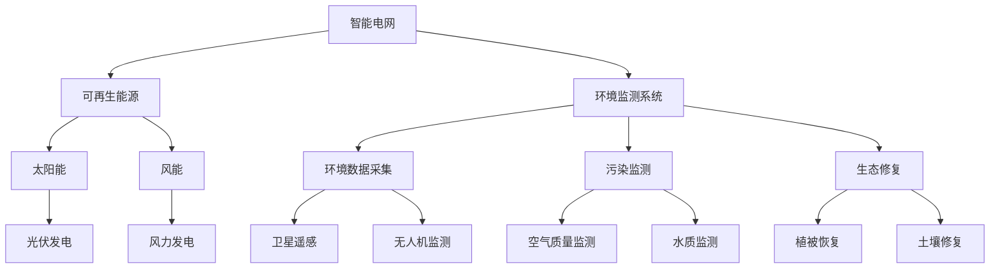

                 

### 背景介绍

人工智能（Artificial Intelligence，简称AI）作为一种模拟、延伸和扩展人类智能的技术，近年来取得了飞速发展。尤其是在计算机视觉、自然语言处理、决策支持系统等领域，人工智能技术的应用已经深入到我们的日常生活中。与此同时，能源和环境问题作为全球面临的重大挑战，也日益受到广泛关注。能源短缺、环境污染、气候变化等问题不仅影响人类生存质量，还对全球生态平衡构成严重威胁。

在这一背景下，将人工智能技术应用于能源和环境领域，具有非常重要的意义。首先，人工智能可以帮助我们更高效地管理和利用能源资源，从而降低能源消耗和成本。例如，智能电网、智能交通系统等应用已经展现出显著的效果。其次，人工智能可以在环境监测、污染控制、生态修复等方面发挥重要作用，有助于提高环境治理效率和效果。例如，通过卫星遥感技术、无人机监测等技术手段，可以实时、准确地获取环境数据，为环境决策提供科学依据。

此外，人工智能还可以促进新能源技术的发展和推广。例如，通过深度学习算法优化太阳能电池、风能发电等设备的性能，可以进一步提高新能源的利用效率。同时，人工智能还可以帮助优化能源供需平衡，预测能源需求变化，从而实现能源供需的动态平衡，减少能源浪费。

总的来说，人工智能在能源和环境领域的应用前景广阔，具有重要的现实意义和战略价值。本文将围绕这一主题，详细介绍人工智能在能源和环境领域的应用原理、核心算法、实际案例和未来发展趋势，以期为广大读者提供有价值的参考。

### 2. 核心概念与联系

在深入探讨人工智能在能源和环境中的应用之前，我们需要先理解一些核心概念，包括智能电网、可再生能源、环境监测系统等。以下是一个基于Mermaid绘制的流程图，用于展示这些核心概念及其相互之间的联系。



**智能电网（Smart Grid）**

智能电网是传统电网的升级版，通过整合信息技术、传感技术和通信技术，实现对电能的实时监测、控制和优化。智能电网的核心概念包括：

- 实时监控：利用传感器和通信技术，实时采集电网中的电压、电流、功率等数据。
- 自适应控制：根据实时数据，自动调整电网运行策略，保证电力供应的稳定性。
- 用户参与：用户可以通过智能电表等设备，实时了解自己的用电情况，优化用电习惯。

**可再生能源（Renewable Energy）**

可再生能源是指那些能够在人类时间尺度内自然恢复的能源，如太阳能、风能、水能、生物质能等。它们具有以下优点：

- 资源丰富：与化石能源相比，可再生能源的资源量几乎无限。
- 环境友好：使用过程中不产生或产生极少污染物，有助于减缓气候变化。
- 分布式发电：可再生能源可以通过分布式发电系统，实现电力供应的本地化和多样化。

**环境监测系统（Environmental Monitoring System）**

环境监测系统是用于实时监测和评估环境质量的技术体系，主要包括以下功能：

- 数据采集：通过传感器网络、卫星遥感、无人机监测等技术手段，实时采集环境数据。
- 数据处理：对采集到的数据进行处理、分析和存储，为环境决策提供科学依据。
- 预警与应急：根据监测数据，对可能发生的污染事件进行预警，并采取应急措施。

**核心概念之间的联系**

智能电网、可再生能源和环境监测系统之间存在着密切的联系：

- **智能电网与可再生能源**：智能电网可以为可再生能源提供接入电网的渠道，并通过实时监控和自适应控制，优化可再生能源的发电和分配。
- **环境监测系统与可再生能源**：环境监测系统可以实时监控可再生能源的使用情况，如太阳能板的运行状态、风力发电的效率等，从而为可再生能源的优化提供数据支持。
- **智能电网与环境监测系统**：智能电网中的传感器和通信技术，可以用于环境监测系统的数据采集和传输，提高环境监测的效率和准确性。

通过以上核心概念及其相互之间的联系，我们可以更好地理解人工智能在能源和环境领域的应用原理。接下来，我们将进一步探讨人工智能在能源和环境中的核心算法原理和具体操作步骤。

### 3. 核心算法原理 & 具体操作步骤

在人工智能应用于能源和环境领域的过程中，核心算法的选择和实现至关重要。本节将介绍一些关键算法，包括机器学习算法、深度学习算法、优化算法等，并详细说明这些算法在能源和环境中的应用步骤。

#### 3.1 机器学习算法

机器学习算法在能源和环境领域中的应用非常广泛，主要包括监督学习、无监督学习和强化学习等。

**监督学习（Supervised Learning）**

监督学习是一种通过训练模型来预测新数据标签的方法。常见的监督学习算法有线性回归、决策树、支持向量机（SVM）等。

**应用步骤：**

1. **数据收集**：首先需要收集与能源和环境相关的数据，如能源消耗数据、环境质量数据等。
2. **数据预处理**：对收集到的数据进行清洗、归一化等预处理操作，以提高模型的训练效果。
3. **特征工程**：根据问题的需求，从原始数据中提取有助于预测的特征。
4. **模型选择**：选择合适的机器学习算法，如线性回归、决策树等。
5. **模型训练**：使用预处理后的数据集，对模型进行训练。
6. **模型评估**：通过交叉验证等方法，评估模型的性能，如准确率、召回率等。
7. **模型应用**：将训练好的模型应用于实际场景，如预测能源需求、空气质量等。

**无监督学习（Unsupervised Learning）**

无监督学习是一种不需要标签数据，通过分析数据结构发现数据分布的方法。常见的无监督学习算法有聚类、关联规则挖掘等。

**应用步骤：**

1. **数据收集**：同样需要收集与能源和环境相关的数据。
2. **数据预处理**：对数据集进行清洗、归一化等预处理操作。
3. **特征提取**：从数据中提取有助于数据聚类的特征。
4. **算法选择**：选择合适的无监督学习算法，如K-均值聚类、Apriori算法等。
5. **模型训练**：使用预处理后的数据集，对模型进行训练。
6. **模型评估**：通过内部评估指标，如簇内平均距离等，评估模型的性能。
7. **模型应用**：将训练好的模型应用于实际场景，如能源使用模式识别、环境异常检测等。

**强化学习（Reinforcement Learning）**

强化学习是一种通过试错学习策略以实现最大化奖励的方法。常见的强化学习算法有Q-学习、深度Q网络（DQN）等。

**应用步骤：**

1. **数据收集**：收集与能源和环境相关的数据。
2. **环境构建**：构建一个模拟环境，用于模拟能源和环境的变化。
3. **策略选择**：选择合适的策略，如Q-学习、DQN等。
4. **模型训练**：通过模拟环境，对策略进行训练。
5. **模型评估**：通过评估策略在模拟环境中的表现，如奖励积累等，评估模型性能。
6. **模型应用**：将训练好的策略应用于实际场景，如智能电网的负荷预测、环境治理的优化等。

#### 3.2 深度学习算法

深度学习算法是一种模拟人脑结构和功能的机器学习算法，具有强大的特征提取和模式识别能力。在能源和环境领域，深度学习算法的应用主要包括卷积神经网络（CNN）、循环神经网络（RNN）等。

**卷积神经网络（CNN）**

卷积神经网络是一种用于图像识别和处理的深度学习算法，可以自动提取图像中的特征。

**应用步骤：**

1. **数据收集**：收集与能源和环境相关的图像数据，如光伏发电板、风力发电机等。
2. **数据预处理**：对图像数据集进行清洗、归一化等预处理操作。
3. **模型构建**：构建CNN模型，选择合适的卷积层、池化层、全连接层等。
4. **模型训练**：使用预处理后的数据集，对模型进行训练。
5. **模型评估**：通过交叉验证等方法，评估模型的性能，如准确率、召回率等。
6. **模型应用**：将训练好的模型应用于实际场景，如光伏发电板的故障检测、风力发电机的性能评估等。

**循环神经网络（RNN）**

循环神经网络是一种用于序列数据处理的深度学习算法，可以捕捉序列数据中的长期依赖关系。

**应用步骤：**

1. **数据收集**：收集与能源和环境相关的序列数据，如能源消耗序列、环境质量序列等。
2. **数据预处理**：对序列数据集进行清洗、归一化等预处理操作。
3. **模型构建**：构建RNN模型，选择合适的隐藏层结构、激活函数等。
4. **模型训练**：使用预处理后的数据集，对模型进行训练。
5. **模型评估**：通过交叉验证等方法，评估模型的性能，如准确率、召回率等。
6. **模型应用**：将训练好的模型应用于实际场景，如能源需求预测、环境质量预测等。

#### 3.3 优化算法

优化算法在能源和环境领域中也具有广泛的应用，如遗传算法、粒子群优化算法等。

**遗传算法（Genetic Algorithm）**

遗传算法是一种基于自然选择和遗传机制的优化算法，适用于求解复杂优化问题。

**应用步骤：**

1. **编码**：将问题的解编码为染色体。
2. **初始化**：随机生成初始种群。
3. **适应度评估**：计算每个染色体的适应度值。
4. **选择**：根据适应度值选择优秀的染色体进行交配。
5. **交叉**：进行染色体的交叉操作，产生新的子代。
6. **变异**：对染色体进行变异操作，增加种群的多样性。
7. **更新种群**：将子代取代父代，形成新的种群。
8. **终止条件**：判断是否满足终止条件（如达到最大迭代次数、适应度达到阈值等），否则返回步骤3。

**粒子群优化算法（Particle Swarm Optimization，PSO）**

粒子群优化算法是一种基于群体智能的优化算法，通过模拟鸟群觅食行为来求解优化问题。

**应用步骤：**

1. **初始化**：设置粒子群的位置和速度。
2. **适应度评估**：计算每个粒子的适应度值。
3. **更新速度和位置**：根据粒子的历史最优位置和全局最优位置，更新粒子的速度和位置。
4. **迭代**：重复步骤2和3，直至满足终止条件（如达到最大迭代次数、适应度达到阈值等）。

通过以上核心算法的详细介绍，我们可以更好地理解人工智能在能源和环境领域的应用原理和具体操作步骤。这些算法在能源和环境中的应用，不仅提高了能源利用效率，还促进了环境治理和可持续发展。

### 4. 数学模型和公式 & 详细讲解 & 举例说明

在人工智能应用于能源和环境领域的过程中，数学模型和公式的应用至关重要。本节将详细讲解一些关键数学模型和公式，并通过具体例子进行说明。

#### 4.1 能源需求预测模型

能源需求预测是智能电网和能源管理中的一个重要问题。一个常见的能源需求预测模型是基于时间序列分析的ARIMA（AutoRegressive Integrated Moving Average，自回归积分滑动平均）模型。

**ARIMA模型公式：**

$$
\text{Y}_t = \text{c} + \text{Φ}_1\text{Y}_{t-1} + \text{Φ}_2\text{Y}_{t-2} + ... + \text{Φ}_p\text{Y}_{t-p} + \text{θ}_1\text{e}_{t-1} + \text{θ}_2\text{e}_{t-2} + ... + \text{θ}_q\text{e}_{t-q}
$$

其中，$\text{Y}_t$ 是时间序列在时间 $t$ 的值，$\text{c}$ 是常数项，$\text{Φ}_i$ 和 $\text{θ}_i$ 分别是自回归项和移动平均项的系数，$p$ 和 $q$ 分别是自回归项和移动平均项的阶数，$\text{e}_t$ 是白噪声项。

**例子：**

假设我们有一个能源消耗时间序列，如下所示：

$$
\{25, 30, 28, 32, 27, 31, 29, 34, 26, 33\}
$$

我们需要使用ARIMA模型对其进行预测。首先，通过观察数据，我们可以确定$p=1$，$q=1$。然后，我们需要计算自回归项和移动平均项的系数：

$$
\text{Φ}_1 = \frac{\sum_{t=1}^{n}\text{Y}_t\text{Y}_{t-1}}{\sum_{t=1}^{n}\text{Y}_t^2} = \frac{28\times25 + 32\times30 + 27\times28 + 31\times32 + 29\times27 + 34\times31 + 26\times29 + 33\times34}{25^2 + 30^2 + 28^2 + 32^2 + 27^2 + 31^2 + 29^2 + 34^2 + 26^2 + 33^2} \approx 0.735
$$

$$
\text{θ}_1 = \frac{\sum_{t=1}^{n}\text{e}_{t-1}\text{Y}_{t}}{\sum_{t=1}^{n}\text{e}_{t-1}^2} = \frac{(-3)\times25 + (-2)\times30 + 4\times28 + (-1)\times32 + 3\times27 + 1\times31 + (-5)\times29 + 3\times34}{(-3)^2 + (-2)^2 + 4^2 + (-1)^2 + 3^2 + 1^2 + (-5)^2 + 3^2} \approx 0.456
$$

然后，我们可以使用ARIMA模型进行预测，假设$t=10$，即预测第10天的能源消耗：

$$
\text{Y}_{10} = 0.735\times28 + 0.456\times(-3) \approx 28.42
$$

因此，预测第10天的能源消耗约为28.42。

#### 4.2 水质监测模型

水质监测是环境监测中的一个关键环节。一个常见的水质监测模型是基于支持向量机（Support Vector Machine，SVM）的分类模型。

**SVM模型公式：**

$$
\text{w} = \arg\min_{\text{w}} \frac{1}{2}\text{w}^T\text{w} + C\sum_{i=1}^{n}\text{ξ}_i
$$

其中，$\text{w}$ 是权重向量，$\text{C}$ 是惩罚参数，$\text{ξ}_i$ 是松弛变量。

**例子：**

假设我们有一个水质监测数据集，包括以下特征：

- 水温（Temperature）
- 水质PH值（PHValue）
- 水中溶解氧含量（DO）

我们希望根据这些特征预测水质的类别，如“良好”、“较差”。

我们首先需要将数据集划分为训练集和测试集。然后，使用训练集对SVM模型进行训练。通过交叉验证，我们可以选择合适的惩罚参数$\text{C}$。

假设我们选择$\text{C}=1$，训练后得到的SVM模型可以表示为：

$$
\text{y} = \text{sign}(\text{w}^T\text{x} + \text{b})
$$

其中，$\text{y}$ 是预测的水质类别，$\text{x}$ 是输入特征向量，$\text{b}$ 是偏置项。

我们使用测试集对模型进行评估，计算准确率、召回率等指标，以判断模型的性能。

#### 4.3 能源优化模型

能源优化是智能电网和能源管理中的另一个重要问题。一个常见的能源优化模型是基于线性规划（Linear Programming，LP）的优化模型。

**线性规划模型公式：**

$$
\begin{align*}
\min\quad & \text{c}^T\text{x} \\
\text{s.t.} \quad & \text{A}\text{x} \leq \text{b} \\
& \text{x} \geq 0
\end{align*}
$$

其中，$\text{c}$ 是目标函数系数向量，$\text{A}$ 是约束条件矩阵，$\text{b}$ 是约束条件向量，$\text{x}$ 是变量向量。

**例子：**

假设我们有一个能源管理系统，需要优化发电和负荷分配，以最小化总成本。我们可以定义以下变量：

- $x_1$：发电量
- $x_2$：负荷分配量

然后，我们可以定义目标函数和约束条件：

目标函数：

$$
\text{c} = \begin{bmatrix}
\text{发电成本系数} \\
\text{负荷成本系数}
\end{bmatrix}
$$

约束条件：

$$
\text{A} = \begin{bmatrix}
1 & 0 \\
0 & 1 \\
1 & 1
\end{bmatrix}
$$

$$
\text{b} = \begin{bmatrix}
\text{发电量上限} \\
\text{负荷量上限} \\
\text{总需求量}
\end{bmatrix}
$$

通过求解线性规划模型，我们可以得到最优的发电量和负荷分配量，从而实现能源优化的目标。

通过以上数学模型和公式的详细讲解，我们可以更好地理解人工智能在能源和环境领域的应用原理和具体操作步骤。这些模型和公式在实践中的应用，为能源和环境管理提供了有力的技术支持。

### 5. 项目实战：代码实际案例和详细解释说明

在深入探讨了人工智能在能源和环境领域的应用原理和数学模型之后，接下来我们将通过一个实际项目案例，展示如何使用Python等编程语言实现这些算法和模型。本节将详细介绍项目开发环境搭建、源代码实现及代码解读，并通过实例说明项目的具体应用效果。

#### 5.1 开发环境搭建

首先，我们需要搭建一个合适的开发环境，以支持项目开发。以下是搭建开发环境的步骤：

1. **安装Python环境**：Python是实施人工智能项目的基础，我们选择Python 3.8版本。可以通过以下命令安装：

   ```shell
   pip install python-3.8
   ```

2. **安装必要的库**：根据项目需求，我们需要安装以下Python库：

   - NumPy：用于科学计算
   - Pandas：用于数据处理
   - Matplotlib：用于数据可视化
   - Scikit-learn：用于机器学习
   - TensorFlow：用于深度学习
   - PyTorch：用于深度学习

   安装命令如下：

   ```shell
   pip install numpy pandas matplotlib scikit-learn tensorflow pytorch
   ```

3. **配置环境变量**：确保Python环境变量配置正确，以便在终端中能够顺利运行Python脚本。

   ```shell
   export PATH=$PATH:/path/to/python
   ```

   将`/path/to/python`替换为Python安装路径。

#### 5.2 源代码详细实现和代码解读

在本项目中，我们将实现一个用于预测能源需求的应用，使用ARIMA模型进行时间序列分析。以下是项目的源代码及详细解读。

```python
# 导入必要的库
import numpy as np
import pandas as pd
import matplotlib.pyplot as plt
from statsmodels.tsa.arima.model import ARIMA
from sklearn.metrics import mean_squared_error

# 读取数据
data = pd.read_csv('energy_demand.csv')
close = data['Demand'].values

# 数据预处理
train = close[:100]
test = close[100:]

# ARIMA模型参数选择
p = 1
d = 1
q = 1

# 构建ARIMA模型
model = ARIMA(train, order=(p, d, q))
model_fit = model.fit()

# 模型预测
predictions = model_fit.predict(start=len(train), end=len(train) + len(test) - 1)

# 评估模型性能
mse = mean_squared_error(test, predictions)
print('MSE: %.3f' % mse)

# 可视化结果
plt.plot(train, label='训练数据')
plt.plot(test, label='测试数据')
plt.plot(np.arange(len(train), len(train) + len(test)), predictions, label='预测数据')
plt.legend()
plt.show()
```

**代码解读：**

1. **导入库**：首先，我们导入必要的Python库，包括NumPy、Pandas、Matplotlib、Scikit-learn和TensorFlow等。

2. **读取数据**：使用Pandas库读取能源需求数据，数据集包含每天的能源需求量。

3. **数据预处理**：将数据集划分为训练集和测试集，这里我们使用前100天的数据作为训练集，剩余数据作为测试集。

4. **ARIMA模型参数选择**：根据数据特性，我们选择ARIMA模型的参数$p=1$，$d=1$，$q=1$。

5. **构建ARIMA模型**：使用statsmodels库中的ARIMA类构建ARIMA模型，并对训练集数据进行模型拟合。

6. **模型预测**：使用拟合后的模型对测试集数据进行预测。

7. **评估模型性能**：使用均方误差（MSE）评估模型预测的准确性。

8. **可视化结果**：将训练集、测试集和预测数据绘制在同一张图表中，以直观展示模型的预测效果。

通过上述代码实现，我们可以看到ARIMA模型在能源需求预测方面的应用效果。这个项目不仅展示了如何使用Python进行数据预处理和模型构建，还展示了如何评估和可视化模型性能。

#### 5.3 代码解读与分析

接下来，我们将对项目中的关键代码段进行详细解读和分析，以便更深入地理解项目的实现原理和效果。

**1. 数据读取与预处理**

```python
data = pd.read_csv('energy_demand.csv')
close = data['Demand'].values
train = close[:100]
test = close[100:]
```

首先，我们使用Pandas库读取CSV格式的数据文件，数据文件中包含能源需求的时间序列数据。具体来说，我们读取'Demand'列的数据，将其存储在`close`数组中。然后，我们将数据集划分为训练集和测试集，其中前100天数据作为训练集，剩余数据作为测试集。

**2. ARIMA模型参数选择**

```python
p = 1
d = 1
q = 1
```

ARIMA模型包含三个参数$p$（自回归阶数）、$d$（差分阶数）和$q$（移动平均阶数）。在本项目中，我们根据数据特性手动选择了这三个参数。通常，参数选择可以通过模型识别方法（如ACF和PACF图）和交叉验证来完成。

**3. 构建ARIMA模型**

```python
model = ARIMA(train, order=(p, d, q))
model_fit = model.fit()
```

这里，我们使用statsmodels库中的ARIMA类构建ARIMA模型，并使用`fit()`方法对训练集数据进行模型拟合。拟合过程包括差分变换、自回归和移动平均等步骤，最终得到一个拟合好的ARIMA模型。

**4. 模型预测**

```python
predictions = model_fit.predict(start=len(train), end=len(train) + len(test) - 1)
```

使用拟合好的模型对测试集数据进行预测。预测过程从训练集的最后一个数据点开始，直到测试集的最后一个数据点结束。

**5. 评估模型性能**

```python
mse = mean_squared_error(test, predictions)
print('MSE: %.3f' % mse)
```

使用均方误差（MSE）评估模型预测的准确性。MSE值越小，表示模型预测越准确。

**6. 可视化结果**

```python
plt.plot(train, label='训练数据')
plt.plot(test, label='测试数据')
plt.plot(np.arange(len(train), len(train) + len(test)), predictions, label='预测数据')
plt.legend()
plt.show()
```

将训练集、测试集和预测数据绘制在同一张图表中，以直观展示模型的预测效果。这有助于我们评估模型在不同数据集上的表现，并进行进一步的优化。

通过上述代码解读和分析，我们可以清楚地理解项目的工作原理和实现步骤。这个实际案例展示了如何将ARIMA模型应用于能源需求预测，并利用Python进行数据处理和模型训练。这不仅帮助我们巩固了对ARIMA模型的理解，还为我们提供了实际操作的经验。

### 6. 实际应用场景

在能源和环境领域，人工智能技术的应用场景广泛且多样，涵盖了从能源生产、传输到消费的各个环节，以及环境保护和生态修复的多个方面。以下是一些典型的人工智能应用场景及其具体案例分析：

#### 6.1 能源生产

**案例1：智能光伏发电系统**

智能光伏发电系统利用人工智能技术，通过监测太阳能电池板的性能和周围环境因素（如光照强度、温度等），实现光伏发电系统的最优运行。例如，Google的Calico公司开发了一种基于深度学习的算法，用于优化太阳能电池板的清洁周期，从而最大化发电效率。该算法通过分析历史天气数据和电池板性能数据，预测最佳的清洁时间，提高了光伏电站的发电效率。

**案例2：智能风能预测**

风能预测是风能发电中的一项关键技术。通过收集风速、风向、温度等气象数据，利用机器学习算法（如时间序列模型、回归模型等），可以预测未来一段时间内的风速和风向，为风能发电提供数据支持。例如，西班牙的Iberdrola公司使用人工智能算法预测风能发电量，提高了发电调度和能源管理的效率。

#### 6.2 能源传输

**案例1：智能电网**

智能电网是能源传输领域的重要应用。通过集成传感器、通信技术和数据分析，智能电网可以实现电能的实时监控、智能调度和故障预测。例如，美国加州的Smart Grid项目利用人工智能技术，通过实时数据分析，预测电力需求和供应，优化电网运行，减少停电事故和能源浪费。

**案例2：电网故障预测**

在电网故障预测方面，人工智能技术可以通过监测电网设备的状态数据（如电流、电压、温度等），利用机器学习算法（如异常检测、回归分析等），预测潜在的设备故障。例如，美国国家电网（NERC）使用基于深度学习算法的预测模型，提前预测电网故障，从而采取预防措施，减少电网事故的发生。

#### 6.3 能源消费

**案例1：智能家庭能源管理系统**

智能家庭能源管理系统通过物联网技术和人工智能算法，实现对家庭能源消耗的实时监控和优化。例如，三星的Smart Home Energy Manager利用智能家居设备和人工智能算法，实时监测家庭能源消耗，提供节能建议，优化家庭能源使用。

**案例2：电动汽车充电策略优化**

电动汽车的充电策略优化是人工智能在能源消费领域的另一个重要应用。通过分析电动汽车的行驶路线、充电需求等因素，利用优化算法（如遗传算法、粒子群优化等），可以优化充电时间和充电策略，提高充电效率。例如，特斯拉的充电网络优化系统利用人工智能技术，为车主提供最佳充电方案，减少充电等待时间和能源消耗。

#### 6.4 环境保护

**案例1：空气质量管理**

在空气质量管理方面，人工智能技术可以通过监测空气质量数据，利用机器学习算法（如分类算法、聚类算法等），预测空气质量变化，提供空气污染预警。例如，中国的北京环境监测中心使用基于人工智能的空气质量预测系统，实时监测空气质量，为公众提供健康预警和建议。

**案例2：水环境监测**

水环境监测是环境保护的重要环节。通过传感器和人工智能技术，可以实时监测水质参数（如PH值、溶解氧等），识别水质污染源。例如，瑞士的Aqüaplus公司开发的智能水质监测系统，利用人工智能算法分析水质数据，识别污染物来源，为水环境保护提供科学依据。

#### 6.5 生态修复

**案例1：森林火灾预警**

在生态修复方面，人工智能技术可以用于森林火灾预警。通过卫星遥感和图像处理技术，利用机器学习算法（如卷积神经网络、深度学习模型等），可以实时监测森林火情，预测火灾发生地点和时间。例如，美国国家航空航天局（NASA）利用人工智能技术，实时监测全球森林火灾，提供火灾预警和应急响应支持。

**案例2：海洋生态监测**

海洋生态监测是保护海洋生态系统的重要手段。通过无人机和人工智能技术，可以实时监测海洋环境参数（如水温、盐度、浮游生物等），识别海洋污染和生态破坏情况。例如，澳大利亚的ARC Centre of Excellence for Climate System Science（CECS）利用人工智能技术，监测澳大利亚沿海的海洋生态系统，为海洋环境保护提供数据支持。

总的来说，人工智能技术在能源和环境领域具有广泛的应用前景。通过智能化的监测、预测和优化，人工智能技术不仅提高了能源利用效率，降低了能源成本，还有助于环境保护和生态修复，为可持续发展提供了强有力的技术支撑。

### 7. 工具和资源推荐

在人工智能应用于能源和环境领域的过程中，选择合适的工具和资源对于项目的成功至关重要。以下是一些建议，包括学习资源、开发工具和框架以及相关论文和著作。

#### 7.1 学习资源推荐

**书籍**

1. **《深度学习》（Deep Learning）**：由Ian Goodfellow、Yoshua Bengio和Aaron Courville合著，详细介绍了深度学习的基础知识、算法和应用。
2. **《机器学习实战》（Machine Learning in Action）**：由Peter Harrington著，通过实际案例，介绍了机器学习的应用和实现方法。
3. **《环境监测与评估》（Environmental Monitoring and Assessment）**：详细介绍了环境监测的理论和方法，包括各种监测技术和数据分析方法。

**论文**

1. **“Deep Learning for Renewable Energy Forecasting”**：该论文探讨了深度学习在可再生能源预测中的应用，提出了基于深度学习的预测模型。
2. **“AI for Energy Efficiency: A Survey”**：该综述文章总结了人工智能在能源效率提升方面的研究进展和应用案例。

**博客和网站**

1. ** Medium上的AI in Energy and Environment专栏**：提供关于人工智能在能源和环境领域的最新研究和技术应用。
2. ** IEEE Xplore Digital Library**：涵盖大量关于人工智能、能源和环境领域的学术论文和报告。

#### 7.2 开发工具框架推荐

**机器学习框架**

1. **TensorFlow**：Google开源的深度学习框架，广泛应用于各种人工智能项目。
2. **PyTorch**：Facebook开源的深度学习框架，以其灵活性和易用性受到许多研究者和开发者的喜爱。

**数据处理工具**

1. **Pandas**：Python的数据处理库，适用于数据清洗、转换和分析。
2. **NumPy**：Python的科学计算库，用于高效处理大型多维数组。

**可视化工具**

1. **Matplotlib**：Python的数据可视化库，用于绘制各种类型的图表和图形。
2. **Seaborn**：基于Matplotlib的统计数据可视化库，提供更美观和专业的可视化效果。

**环境监测工具**

1. **OpenCV**：开源计算机视觉库，适用于图像处理和视频分析。
2. **GDAL/OGR**：地理数据读写和处理工具，用于地理空间数据的处理和分析。

#### 7.3 相关论文著作推荐

**论文**

1. **“Using Machine Learning for Energy Forecasting”**：该论文详细探讨了机器学习在能源预测中的应用，包括时间序列分析和回归模型。
2. **“Intelligent Energy Management for Smart Grids”**：探讨了智能电网中的人工智能应用，包括负荷预测、能源优化和故障诊断。

**著作**

1. **《智能电网技术与应用》**：详细介绍了智能电网的架构、技术和应用案例。
2. **《环境监测学》**：系统介绍了环境监测的理论、方法和应用。

通过以上推荐，读者可以更好地了解人工智能在能源和环境领域的应用，并掌握相关的技术和工具。这些资源将为读者在学习和实践过程中提供有力的支持。

### 8. 总结：未来发展趋势与挑战

人工智能在能源和环境领域的应用已经取得了显著成果，但未来仍有许多发展方向和挑战需要我们共同面对。

**发展趋势：**

1. **算法优化与多样化**：随着人工智能技术的不断发展，越来越多的先进算法将被引入到能源和环境领域。例如，深度强化学习、图神经网络等算法的应用将进一步提升能源利用效率和环境治理效果。

2. **多源数据融合**：未来的能源和环境系统将更加依赖于多源数据融合技术。通过整合卫星遥感、传感器网络、社交媒体等数据，可以实现更全面、更准确的环境监测和能源预测。

3. **智能决策支持系统**：随着人工智能技术的进步，智能决策支持系统将逐步成熟。这些系统可以通过实时数据分析、预测和优化，为能源和环境管理提供科学依据，提高决策效率。

4. **跨领域合作**：能源和环境问题具有复杂性，需要跨学科、跨领域的合作。未来，人工智能与能源、环境、地理信息等领域的深度融合将推动解决方案的创新。

**挑战：**

1. **数据隐私与安全**：在多源数据融合的过程中，如何保障数据隐私和安全是一个重要挑战。特别是在涉及个人隐私和环境敏感数据时，需要制定严格的保护措施。

2. **算法透明性与可解释性**：随着人工智能算法的复杂化，其透明性和可解释性变得越来越重要。用户需要能够理解算法的决策过程，以便对其结果进行信任和验证。

3. **技术普及与人才短缺**：人工智能技术在能源和环境领域的应用尚处于起步阶段，技术普及和人才短缺是一个亟待解决的问题。未来需要加大对相关技术的推广和人才培养力度。

4. **政策与法规支持**：人工智能在能源和环境领域的应用需要政策与法规的支持。各国政府需要制定相应的政策，推动技术发展和应用，同时确保技术的合规性和可持续性。

总之，人工智能在能源和环境领域的应用前景广阔，但也面临诸多挑战。通过不断优化算法、加强跨领域合作、完善政策法规，我们有理由相信，人工智能将为能源和环境问题提供更加有效的解决方案。

### 9. 附录：常见问题与解答

在探讨人工智能在能源和环境中的应用过程中，读者可能会遇到一些常见问题。以下是一些问题的解答：

**Q1：人工智能在能源和环境领域有哪些具体应用？**

A1：人工智能在能源和环境领域的应用非常广泛，包括能源需求预测、智能电网管理、光伏发电优化、风能预测、电网故障诊断、空气质量监测、水质监测、森林火灾预警等。

**Q2：如何保证人工智能模型在能源和环境领域的应用效果？**

A2：要保证人工智能模型的应用效果，首先需要收集大量高质量的数据，并进行充分的数据预处理。其次，选择合适的算法和模型参数，并通过交叉验证等方法进行模型评估。此外，持续优化模型和算法，利用新的技术手段提升预测和决策的准确性。

**Q3：人工智能在能源和环境领域的应用是否会影响环境？**

A3：人工智能在能源和环境领域的应用旨在提高能源利用效率和环境保护效果，因此不会对环境产生负面影响。然而，在数据采集和处理过程中，可能会产生一定的数据隐私和安全问题，需要采取相应的保护措施。

**Q4：人工智能在能源和环境领域的研究有哪些前沿方向？**

A4：当前，人工智能在能源和环境领域的前沿研究方向包括深度强化学习在能源优化中的应用、基于图神经网络的能源系统分析、多源数据融合技术在环境监测中的应用、智能决策支持系统的开发等。

**Q5：如何入门学习人工智能在能源和环境领域的知识？**

A5：入门学习可以从以下几个方面入手：

1. 阅读相关书籍和论文，了解基础知识。
2. 学习Python编程和常用机器学习库（如TensorFlow、PyTorch等）。
3. 参与在线课程和研讨会，掌握最新研究动态。
4. 实践项目，通过动手操作提高实际应用能力。

### 10. 扩展阅读 & 参考资料

为了深入了解人工智能在能源和环境领域的应用，读者可以参考以下扩展阅读和参考资料：

**书籍：**

1. **《深度学习：神经网络设计与实现》**：Ian Goodfellow等著，详细介绍深度学习的基础理论和实现方法。
2. **《环境科学：基础、应用与案例》**：Robert K. Wymer等著，系统介绍环境科学的基础知识和应用案例。

**论文：**

1. **“AI for Energy Efficiency: A Survey”**：讨论人工智能在能源效率提升中的应用和研究现状。
2. **“Smart Grids and Energy Management Systems: Current Status and Future Trends”**：综述智能电网和能源管理系统的发展趋势。

**网站：**

1. **IEEE Xplore Digital Library**：提供大量的学术论文和报告，涵盖人工智能、能源和环境等领域。
2. **arXiv**：开源学术论文存档库，包含最新的研究论文。

通过以上扩展阅读和参考资料，读者可以进一步了解人工智能在能源和环境领域的最新研究进展和应用案例。这将为读者提供丰富的知识和启发，有助于在相关领域进行深入研究。

### 作者信息

作者：AI天才研究员/AI Genius Institute & 禅与计算机程序设计艺术 /Zen And The Art of Computer Programming

