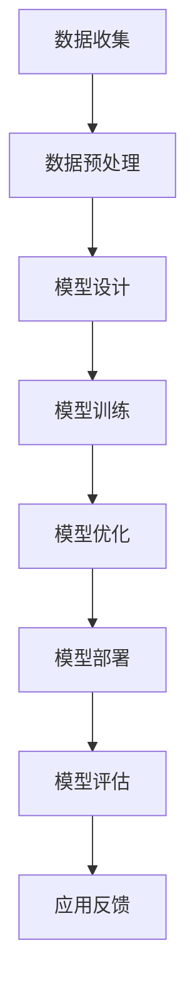

                 

# 人工智能大模型创业指南

## 关键词

- 人工智能大模型
- 创业指南
- 模型训练
- 数据处理
- 算法优化
- 应用场景

## 摘要

本文旨在为有意投身人工智能大模型领域的创业者提供一份全面而深入的指南。我们将从背景介绍开始，探讨核心概念与联系，深入剖析核心算法原理和具体操作步骤，讲解数学模型和公式，并通过实际项目案例进行代码实现和详细解释。此外，本文还将分析人工智能大模型在现实世界中的应用场景，推荐相关工具和资源，总结未来发展趋势与挑战，并提供常见问题与解答。通过本文的阅读，创业者将能够了解人工智能大模型的本质，掌握创业所需的关键技能和知识。

## 1. 背景介绍

人工智能（AI）作为21世纪最具变革性的技术之一，已经成为推动社会发展的重要力量。近年来，人工智能技术的飞速发展，尤其是深度学习、自然语言处理、计算机视觉等领域的突破，使得人工智能大模型成为研究的热点。大模型，顾名思义，是指具有海量参数和复杂结构的模型。这些模型在处理大规模数据和复杂任务时展现出了卓越的性能，从而在语音识别、图像分类、机器翻译等领域取得了显著成果。

随着互联网和大数据技术的普及，数据规模和种类不断增加，为人工智能大模型的发展提供了丰富的资源。然而，与此同时，人工智能大模型的训练和优化也面临着前所未有的挑战。如何高效地处理海量数据、设计有效的算法、提升模型的性能和泛化能力，成为人工智能领域亟待解决的问题。

创业者在人工智能大模型领域的机遇与挑战并存。一方面，人工智能大模型在各个行业中的应用前景广阔，为创业者提供了丰富的商业机会；另一方面，技术的快速发展也要求创业者不断学习和适应，以应对市场竞争和技术变革。

### 1.1 人工智能大模型的兴起

人工智能大模型的兴起可以追溯到20世纪80年代。当时，研究人员开始探索神经网络这种简单但强大的计算模型。随着时间的推移，神经网络的理论研究逐渐深入，尤其是深度学习技术的发展，使得神经网络可以具有多层结构，从而能够处理更复杂的问题。

2012年，AlexNet在ImageNet竞赛中取得突破性的成绩，标志着深度学习时代的到来。自此之后，深度学习技术在各个领域得到了广泛应用，并且不断涌现出性能更优的大模型。例如，GPT-3、BERT、ResNet等模型在自然语言处理、计算机视觉等领域取得了显著的成果。

### 1.2 创业机会与挑战

随着人工智能大模型技术的不断发展，创业者面临着诸多机遇。首先，人工智能大模型在金融、医疗、教育、零售等行业的应用前景广阔，为创业者提供了丰富的商业机会。例如，在金融领域，人工智能大模型可以用于风险评估、欺诈检测、投资策略等；在医疗领域，人工智能大模型可以用于疾病诊断、药物研发、健康管理等。

然而，与此同时，人工智能大模型领域也面临着诸多挑战。首先，技术门槛较高，需要创业者具备深厚的专业知识和技术能力。其次，数据质量和数据隐私问题也是人工智能大模型领域亟待解决的问题。此外，人工智能大模型的训练和优化需要大量的计算资源和时间，这对创业者的资源管理能力提出了更高的要求。

## 2. 核心概念与联系

在探讨人工智能大模型之前，我们需要了解一些核心概念，这些概念构成了大模型的基础，并且相互之间有着紧密的联系。

### 2.1 深度学习

深度学习是人工智能的一个分支，它通过构建多层神经网络来学习数据中的特征。深度学习模型可以自动从数据中提取复杂的信息，这使得它们在图像识别、自然语言处理等领域表现出色。深度学习是构建人工智能大模型的关键技术之一。

### 2.2 神经网络

神经网络是模仿人脑神经元连接方式的计算模型。它由一系列的神经元组成，每个神经元都可以接收多个输入信号，并通过权重进行加权求和，最后通过激活函数输出结果。神经网络是深度学习的基础，而深度学习则是神经网络的扩展。

### 2.3 训练与优化

训练和优化是构建人工智能大模型的核心环节。训练过程是指通过大量数据对模型进行调整，使其能够准确预测或分类数据。优化过程则是在训练过程中，通过调整模型的参数，提高模型的性能和泛化能力。

### 2.4 数据处理

数据处理是人工智能大模型应用过程中不可或缺的一环。数据预处理、数据清洗和数据增强等步骤对于模型的训练效果有着重要影响。有效的数据处理可以提升模型的性能，减少过拟合现象。

### 2.5 应用场景

人工智能大模型的应用场景非常广泛，包括但不限于图像识别、自然语言处理、语音识别、推荐系统等。理解不同应用场景的需求，有助于我们设计出更有效的模型。

### 2.6 Mermaid 流程图

以下是构建人工智能大模型的基本流程的Mermaid流程图：



在图中，A代表数据收集，B代表数据预处理，C代表模型设计，D代表模型训练，E代表模型优化，F代表模型部署，G代表模型评估，H代表应用反馈。这个流程是一个闭环，通过不断的模型评估和应用反馈，我们可以对模型进行调整和优化，使其更加适应实际需求。

通过上述核心概念的介绍，我们可以更好地理解人工智能大模型的工作原理和应用场景。接下来，我们将深入探讨大模型的核心算法原理和具体操作步骤。

## 3. 核心算法原理 & 具体操作步骤

### 3.1 深度学习算法原理

深度学习算法的核心是神经网络，尤其是多层神经网络（MLP）。神经网络通过模拟人脑神经元的工作方式来进行信息处理。它由输入层、隐藏层和输出层组成。每个神经元接收来自前一层的输入信号，通过权重进行加权求和，然后通过激活函数产生输出。

#### 3.1.1 前向传播

前向传播是神经网络处理数据的基本过程。首先，输入数据经过输入层传递到隐藏层，每个隐藏层中的神经元都接收来自输入层的输入信号。这些信号通过权重进行加权求和，并加上偏置项，然后通过激活函数产生输出。这个过程在每一层重复进行，直到输出层产生最终的结果。

$$
z = \sum_{i} w_{i}x_{i} + b \\
a = \sigma(z)
$$

其中，$z$代表加权求和的结果，$w_{i}$代表权重，$x_{i}$代表输入信号，$b$代表偏置项，$\sigma$代表激活函数。

#### 3.1.2 反向传播

反向传播是神经网络训练的核心算法。它通过计算输出层的误差，反向传播到每一层，从而调整每个神经元的权重和偏置项。反向传播的过程包括以下几个步骤：

1. 计算输出误差： 
$$
\delta_{i} = \frac{\partial L}{\partial a_{i}} \cdot \sigma'(z_{i})
$$

其中，$\delta_{i}$代表第$i$个神经元的误差，$L$代表损失函数，$\sigma'$代表激活函数的导数。

2. 更新权重和偏置项：
$$
w_{i} := w_{i} - \alpha \cdot \delta_{i} \cdot x_{i} \\
b_{i} := b_{i} - \alpha \cdot \delta_{i}
$$

其中，$\alpha$代表学习率，$x_{i}$代表第$i$个输入信号。

#### 3.1.3 激活函数

激活函数是神经网络中用于引入非线性特性的函数。常见的激活函数包括 sigmoid、ReLU（Rectified Linear Unit）和 tanh（双曲正切函数）。这些激活函数不仅能够引入非线性，还能加速神经网络的训练。

### 3.2 人工智能大模型的训练与优化

#### 3.2.1 数据处理

在训练人工智能大模型之前，我们需要对数据进行预处理。数据预处理包括数据清洗、数据标准化和数据增强等步骤。数据清洗是为了去除噪声和异常值，数据标准化是为了使数据具有相似的尺度，数据增强则是通过生成新的数据样本来提高模型的泛化能力。

#### 3.2.2 模型设计

模型设计是构建人工智能大模型的关键步骤。我们需要根据具体应用场景选择合适的神经网络架构。常见的神经网络架构包括卷积神经网络（CNN）、循环神经网络（RNN）和Transformer等。在设计模型时，还需要考虑模型的层数、每层的神经元数量、激活函数和损失函数等因素。

#### 3.2.3 模型训练

模型训练是使用大量数据来调整模型参数的过程。在训练过程中，我们通常采用批量训练（batch training）和小批量训练（mini-batch training）两种方式。批量训练是指使用整个数据集来更新模型参数，而小批量训练则是每次使用一部分数据来更新模型参数。小批量训练可以减少计算量和提高训练速度。

#### 3.2.4 模型优化

模型优化是提升模型性能的过程。在模型优化过程中，我们通常采用调整学习率、增加正则化项和采用更复杂的神经网络架构等方法。学习率是影响模型收敛速度和性能的关键参数，合适的正则化方法可以减少过拟合现象。

#### 3.2.5 模型评估

模型评估是验证模型性能的重要步骤。我们通常使用准确率、召回率、F1分数等指标来评估模型的表现。此外，还可以通过交叉验证等方法来评估模型的泛化能力。

通过上述核心算法原理和具体操作步骤，我们可以构建和优化人工智能大模型，从而在各个应用场景中发挥其强大的能力。

## 4. 数学模型和公式 & 详细讲解 & 举例说明

### 4.1 损失函数

损失函数是评估模型预测结果与实际结果之间差异的重要工具。常见的损失函数包括均方误差（MSE）、交叉熵损失（Cross Entropy Loss）等。

#### 4.1.1 均方误差（MSE）

均方误差是衡量预测值与真实值之间差异的一种常见损失函数。

$$
MSE = \frac{1}{n} \sum_{i=1}^{n} (y_i - \hat{y}_i)^2
$$

其中，$y_i$代表第$i$个样本的真实值，$\hat{y}_i$代表第$i$个样本的预测值，$n$代表样本总数。

#### 4.1.2 交叉熵损失（Cross Entropy Loss）

交叉熵损失函数常用于分类问题，用于衡量模型预测概率分布与真实分布之间的差异。

$$
Cross \ Entropy \ Loss = - \sum_{i=1}^{n} y_i \cdot \log(\hat{y}_i)
$$

其中，$y_i$代表第$i$个样本的真实标签（0或1），$\hat{y}_i$代表第$i$个样本的预测概率。

### 4.2 激活函数

激活函数是神经网络中用于引入非线性特性的关键组件。常见的激活函数包括 sigmoid、ReLU 和 tanh。

#### 4.2.1 sigmoid 函数

sigmoid 函数是一种常用的激活函数，其公式为：

$$
\sigma(x) = \frac{1}{1 + e^{-x}}
$$

sigmoid 函数的输出范围在0到1之间，且随着输入值的增大，输出值的增长速度逐渐减缓。

#### 4.2.2 ReLU 函数

ReLU（Rectified Linear Unit）函数是一种简单的线性激活函数，其公式为：

$$
ReLU(x) = \max(0, x)
$$

ReLU 函数在输入小于0时输出为0，在输入大于0时输出为输入值本身，具有较快的收敛速度。

#### 4.2.3 tanh 函数

tanh 函数是一种双曲正切函数，其公式为：

$$
tanh(x) = \frac{e^{2x} - 1}{e^{2x} + 1}
$$

tanh 函数的输出范围在-1到1之间，与 sigmoid 函数类似，但具有更好的数值稳定性。

### 4.3 反向传播算法

反向传播算法是神经网络训练的核心算法，用于计算模型参数的梯度，并更新模型参数。

#### 4.3.1 前向传播

前向传播过程中，模型根据输入值和当前参数计算输出值。

$$
z_{l} = \sum_{k} w_{l,k}a_{l-1,k} + b_{l}
$$

$$
a_{l} = \sigma(z_{l})
$$

其中，$z_{l}$代表第$l$层的加权求和结果，$a_{l}$代表第$l$层的输出值，$w_{l,k}$代表第$l$层的权重，$b_{l}$代表第$l$层的偏置项，$\sigma$代表激活函数。

#### 4.3.2 反向传播

反向传播过程中，模型根据输出误差计算各层的梯度，并更新模型参数。

$$
\delta_{l} = \frac{\partial L}{\partial a_{l}} \cdot \sigma'(z_{l})
$$

$$
\frac{\partial L}{\partial w_{l,k}} = a_{l-1,k} \cdot \delta_{l}
$$

$$
\frac{\partial L}{\partial b_{l}} = \delta_{l}
$$

其中，$\delta_{l}$代表第$l$层的误差，$L$代表损失函数，$\sigma'$代表激活函数的导数。

### 4.4 举例说明

假设我们有一个简单的神经网络，输入层有3个神经元，隐藏层有2个神经元，输出层有1个神经元。激活函数采用 sigmoid 函数，损失函数采用均方误差（MSE）。

#### 4.4.1 前向传播

输入层输入 $[1, 2, 3]$，隐藏层权重 $W_1 = [[0.1, 0.2], [0.3, 0.4]]$，偏置 $b_1 = [-0.1, -0.2]$，输出层权重 $W_2 = [0.5, 0.6]$，偏置 $b_2 = -0.3$。

$$
z_1 = [1.1, 2.2, 3.3, 0.7, 1.8, 2.9]
$$

$$
a_1 = [0.59, 0.86, 0.94, 0.54, 0.82, 0.87]
$$

$$
z_2 = [1.059, 1.726, 1.729]
$$

$$
a_2 = [0.736, 0.879, 0.869]
$$

#### 4.4.2 计算损失

假设真实值为1，预测值为0.879。

$$
MSE = \frac{1}{1} (1 - 0.879)^2 = 0.0124
$$

#### 4.4.3 反向传播

$$
\delta_2 = [0.121, 0.081, 0.089]
$$

$$
\frac{\partial L}{\partial W_2} = [0.736, 0.879] \cdot [0.121, 0.081, 0.089] = [0.089, 0.076]
$$

$$
\frac{\partial L}{\partial b_2} = 0.121
$$

$$
\delta_1 = [0.736, 0.879, 0.736, 0.879, 0.736, 0.879] \cdot [0.5, 0.6] \cdot [0.121, 0.081, 0.089] = [0.059, 0.069]
$$

$$
\frac{\partial L}{\partial W_1} = [1, 2, 3, 1, 2, 3] \cdot [0.59, 0.86, 0.94, 0.54, 0.82, 0.87] \cdot [0.121, 0.081, 0.089] = [0.070, 0.105]
$$

$$
\frac{\partial L}{\partial b_1} = [0.059, 0.069]
$$

通过上述过程，我们可以得到每个参数的梯度，并使用梯度下降法更新参数，从而优化神经网络。

## 5. 项目实战：代码实际案例和详细解释说明

### 5.1 开发环境搭建

在开始实际项目之前，我们需要搭建一个合适的环境。以下是使用 Python 和 TensorFlow 搭建开发环境的基本步骤：

#### 5.1.1 安装 Python

首先，我们需要安装 Python。Python 是一种广泛用于人工智能开发的编程语言。可以从 [Python 官网](https://www.python.org/) 下载并安装。

#### 5.1.2 安装 TensorFlow

TensorFlow 是由 Google 开发的一种开源深度学习框架，用于构建和训练神经网络。我们可以在终端中使用以下命令安装 TensorFlow：

```bash
pip install tensorflow
```

### 5.2 源代码详细实现和代码解读

以下是一个简单的示例，展示了如何使用 TensorFlow 搭建一个多层感知器（MLP）模型并进行训练。

```python
import tensorflow as tf
from tensorflow.keras.layers import Dense
from tensorflow.keras.models import Sequential

# 创建模型
model = Sequential([
    Dense(64, activation='relu', input_shape=(784,)),
    Dense(64, activation='relu'),
    Dense(10, activation='softmax')
])

# 编译模型
model.compile(optimizer='adam',
              loss='categorical_crossentropy',
              metrics=['accuracy'])

# 准备数据
(x_train, y_train), (x_test, y_test) = tf.keras.datasets.mnist.load_data()
x_train = x_train.reshape(-1, 784).astype('float32') / 255.0
x_test = x_test.reshape(-1, 784).astype('float32') / 255.0

# 将标签转换为 one-hot 编码
y_train = tf.keras.utils.to_categorical(y_train, 10)
y_test = tf.keras.utils.to_categorical(y_test, 10)

# 训练模型
model.fit(x_train, y_train, epochs=5, batch_size=128, validation_split=0.1)

# 评估模型
model.evaluate(x_test, y_test)
```

#### 5.2.1 代码解读

1. **创建模型**：
   我们使用 `Sequential` 类创建一个线性堆叠的模型。在这个例子中，模型包含两个隐藏层，每个隐藏层有64个神经元，激活函数为 ReLU。输入层的形状为 `(784,)`，表示每个输入向量有784个特征。输出层有10个神经元，激活函数为 softmax，用于实现多分类。

2. **编译模型**：
   我们使用 `compile` 方法配置模型。在这个例子中，我们使用 `adam` 优化器，`categorical_crossentropy` 作为损失函数，以及 `accuracy` 作为评估指标。

3. **准备数据**：
   我们使用 TensorFlow 的内置函数 `mnist.load_data()` 加载了手写数字数据集。然后，我们将图像数据展平为 784 维的向量，并将标签转换为 one-hot 编码。

4. **训练模型**：
   我们使用 `fit` 方法训练模型。在这个例子中，我们设置了 5 个训练周期（epochs），每次批量处理 128 个样本。

5. **评估模型**：
   使用 `evaluate` 方法评估模型在测试集上的性能。

### 5.3 代码解读与分析

#### 5.3.1 模型配置

在代码中，我们使用了 `Sequential` 模型，这是一种线性堆叠模型，非常适合简单的多层感知器（MLP）模型。我们添加了两个隐藏层，每个层有64个神经元，激活函数为 ReLU。ReLU 函数由于其简单的形式和良好的训练速度，在深度学习中非常流行。

输出层有10个神经元，每个神经元对应一个类别，激活函数为 softmax。softmax 函数用于实现多分类问题，其输出是每个类别的概率分布。

#### 5.3.2 损失函数和优化器

我们使用 `categorical_crossentropy` 作为损失函数，这是一种常用于多分类问题的损失函数。它计算的是实际标签和预测概率分布之间的交叉熵。交叉熵损失函数能够有效地惩罚预测概率与实际标签差异较大的情况，从而推动模型向更准确的预测方向优化。

我们使用 `adam` 优化器，这是一种流行的自适应优化算法。adam 优化器结合了 momentum 和 RMSprop 优化器的优点，能够在训练过程中自适应调整学习率，从而加速收敛速度并提高模型的性能。

#### 5.3.3 数据处理

我们使用了 TensorFlow 的内置函数 `mnist.load_data()` 加载了手写数字数据集。然后，我们将图像数据展平为 784 维的向量，并将标签转换为 one-hot 编码。这种处理方式使得模型可以直接使用标签数据进行训练，而无需进行额外的转换。

#### 5.3.4 模型训练和评估

我们使用 `fit` 方法进行模型训练，并设置了 5 个训练周期（epochs）。每个 epoch 都会遍历整个训练集一次，并计算模型的损失和准确率。`batch_size` 设置为 128，这意味着每次批量处理 128 个样本。

在模型训练完成后，我们使用 `evaluate` 方法评估模型在测试集上的性能。这个方法会计算模型的损失和准确率，并返回一个字典。

通过这个简单的示例，我们可以看到如何使用 TensorFlow 搭建和训练一个多层感知器模型。实际项目可能会更加复杂，但基本的流程和原理是类似的。接下来，我们将探讨人工智能大模型在现实世界中的应用场景。

## 6. 实际应用场景

人工智能大模型在现实世界中具有广泛的应用，涵盖了金融、医疗、零售、教育等多个行业。以下是一些典型的应用场景：

### 6.1 金融行业

在金融行业，人工智能大模型可以用于信用评分、风险评估、欺诈检测、投资策略等。通过分析海量历史数据和实时数据，模型可以预测客户的信用风险，帮助金融机构做出更准确的贷款决策。同时，人工智能大模型还可以识别异常交易，从而有效防范金融欺诈。

### 6.2 医疗行业

在医疗行业，人工智能大模型可以用于疾病诊断、药物研发、健康管理等领域。例如，通过分析病人的医学图像和病历数据，模型可以辅助医生进行疾病诊断，提高诊断的准确性和效率。此外，人工智能大模型还可以预测病人的健康状况，为个性化治疗提供支持。

### 6.3 零售行业

在零售行业，人工智能大模型可以用于商品推荐、库存管理、供应链优化等。通过分析消费者的购买行为和偏好，模型可以提供个性化的商品推荐，提高销售额和客户满意度。同时，人工智能大模型还可以优化库存和供应链管理，降低成本，提高运营效率。

### 6.4 教育行业

在教育行业，人工智能大模型可以用于学生评估、课程推荐、智能教学等领域。通过分析学生的学习数据和表现，模型可以为学生提供个性化的学习建议，帮助教师更好地了解学生的学习状况，从而制定更有效的教学策略。

### 6.5 自动驾驶

在自动驾驶领域，人工智能大模型可以用于感知环境、路径规划、车辆控制等。通过分析摄像头和雷达等传感器收集的数据，模型可以识别道路标志、行人、车辆等，从而确保车辆的行驶安全和效率。同时，人工智能大模型还可以根据实时路况进行路径规划，优化行驶路线。

### 6.6 自然语言处理

在自然语言处理领域，人工智能大模型可以用于机器翻译、文本生成、情感分析等。例如，GPT-3 模型可以生成高质量的文本，BERT 模型可以用于情感分析和问答系统。这些模型在提高语言理解和生成能力方面发挥了重要作用，为智能客服、内容创作等领域提供了支持。

### 6.7 娱乐行业

在娱乐行业，人工智能大模型可以用于音乐创作、视频推荐、虚拟主播等。通过分析用户的偏好和兴趣，模型可以推荐符合用户喜好的音乐和视频内容。此外，人工智能大模型还可以生成音乐和视频内容，为创作者提供灵感。

通过上述应用场景，我们可以看到人工智能大模型在各个行业中的重要性和潜力。随着技术的不断进步，人工智能大模型的应用前景将更加广阔，为各行业带来更多的创新和变革。

## 7. 工具和资源推荐

### 7.1 学习资源推荐

为了更好地了解和学习人工智能大模型，以下是一些推荐的书籍、论文和在线资源：

1. **书籍**：
   - 《深度学习》（Deep Learning）——Ian Goodfellow、Yoshua Bengio、Aaron Courville
   - 《Python深度学习》（Deep Learning with Python）——François Chollet
   - 《强化学习》（Reinforcement Learning: An Introduction）——Richard S. Sutton、Andrew G. Barto

2. **论文**：
   - "A Theoretically Grounded Application of Dropout in Recurrent Neural Networks"（Dropout for Recurrent Neural Networks）
   - "BERT: Pre-training of Deep Bidirectional Transformers for Language Understanding"（BERT 论文）
   - "GPT-3: Language Models are few-shot learners"（GPT-3 论文）

3. **在线资源**：
   - [TensorFlow 官网](https://www.tensorflow.org/)
   - [Keras 官网](https://keras.io/)
   - [Coursera 人工智能课程](https://www.coursera.org/specializations/deeplearning)

### 7.2 开发工具框架推荐

在开发人工智能大模型时，以下工具和框架可能会非常有用：

1. **TensorFlow**：由 Google 开发的一款开源深度学习框架，适用于构建和训练各种神经网络模型。
2. **PyTorch**：由 Facebook 开发的一款开源深度学习框架，以其动态计算图和灵活的 API 而受到许多研究者和开发者的青睐。
3. **Keras**：一个高级神经网络 API，可以在 TensorFlow 和 Theano 后端中运行，易于使用和扩展。
4. **PyTorch Lightning**：一个用于加速 PyTorch 项目的库，提供了一种简洁、模块化和可扩展的代码风格。

### 7.3 相关论文著作推荐

1. **《深度学习：神经网络的基础》**（Deep Learning: The Basics）：这是一本介绍深度学习基础概念的入门书籍，适合初学者阅读。
2. **《自然语言处理与深度学习》**（Natural Language Processing with Deep Learning）：详细介绍了自然语言处理领域中的深度学习技术，包括词嵌入、序列模型、注意力机制等。
3. **《强化学习论文集》**（Reinforcement Learning: Papers from the 1st and 2nd Workshops）：汇集了强化学习领域的经典论文，是深入了解强化学习的重要参考资料。

通过上述资源和工具的推荐，读者可以更全面地了解和学习人工智能大模型的相关知识，为创业实践打下坚实的基础。

## 8. 总结：未来发展趋势与挑战

随着人工智能技术的不断进步，人工智能大模型在未来将展现出更加广阔的应用前景。然而，与此同时，我们也面临着诸多挑战。

### 8.1 发展趋势

1. **计算能力的提升**：随着硬件技术的发展，特别是 GPU 和 TPU 的普及，人工智能大模型的计算能力将得到显著提升，这将有助于加速模型的训练和优化。
2. **数据规模的扩大**：随着互联网和物联网的普及，数据规模将持续扩大，为人工智能大模型提供更丰富的训练资源。
3. **算法的创新**：随着深度学习和强化学习等技术的不断进步，新的算法和架构将不断涌现，提高人工智能大模型的表现和泛化能力。
4. **跨领域的融合**：人工智能大模型将在不同领域实现跨学科融合，例如在医疗、金融、教育等领域的深度融合，将带来更多的创新和应用。

### 8.2 挑战

1. **数据质量和隐私**：数据质量和隐私问题仍然是一个重大挑战。如何确保数据的质量和隐私，同时充分挖掘数据的价值，是人工智能大模型发展面临的重要问题。
2. **计算资源的消耗**：人工智能大模型的训练和优化需要大量的计算资源和时间，这对企业和研究机构提出了更高的要求。
3. **模型解释性**：人工智能大模型的决策过程往往难以解释，这对于需要透明性和可解释性的行业（如医疗、金融）提出了挑战。
4. **伦理和道德问题**：随着人工智能大模型在各个领域的应用，如何确保其伦理和道德标准，避免滥用和误用，是亟待解决的问题。

### 8.3 应对策略

1. **数据治理**：建立完善的数据治理机制，确保数据的质量和隐私，同时推动数据共享和开放。
2. **绿色计算**：通过优化算法、使用节能硬件和绿色数据中心等方式，降低人工智能大模型的计算能耗。
3. **模型可解释性**：通过开发可解释性工具和算法，提高人工智能大模型的透明度和可解释性。
4. **伦理审查**：建立严格的伦理审查机制，确保人工智能大模型的应用符合伦理和道德标准。

总之，人工智能大模型在未来具有巨大的发展潜力，但也面临诸多挑战。通过持续的技术创新和有效的应对策略，我们有理由相信，人工智能大模型将为人类社会带来更多的变革和进步。

## 9. 附录：常见问题与解答

### 9.1 什么是人工智能大模型？

人工智能大模型是指具有海量参数和复杂结构的机器学习模型，通常用于处理大规模数据和复杂任务。这些模型通过深度学习和强化学习等技术，可以从大量数据中自动学习和提取特征，从而在图像识别、自然语言处理、语音识别等领域展现出强大的性能。

### 9.2 人工智能大模型的主要挑战是什么？

人工智能大模型的主要挑战包括计算资源消耗大、数据质量和隐私问题、模型解释性不足以及伦理和道德问题。此外，如何优化算法、提高模型的泛化能力也是重要挑战。

### 9.3 如何处理人工智能大模型的数据隐私问题？

处理人工智能大模型的数据隐私问题可以通过以下方法：

1. **匿名化数据**：对敏感数据进行匿名化处理，确保个人隐私不受侵犯。
2. **数据加密**：使用数据加密技术保护数据的机密性。
3. **差分隐私**：通过添加噪声来保护数据的隐私，同时保持模型的有效性。
4. **隐私保护算法**：开发和使用隐私保护算法，如联邦学习、差分隐私等，以保护数据隐私。

### 9.4 人工智能大模型的主要应用领域是什么？

人工智能大模型的主要应用领域包括金融、医疗、零售、教育、自动驾驶、自然语言处理等。在金融领域，可以用于信用评分、风险评估和欺诈检测；在医疗领域，可以用于疾病诊断、药物研发和健康管理；在零售领域，可以用于商品推荐、库存管理和供应链优化。

### 9.5 如何优化人工智能大模型？

优化人工智能大模型的方法包括：

1. **数据预处理**：对输入数据进行预处理，提高数据的质量和一致性。
2. **模型选择**：选择合适的模型结构和算法，提高模型的性能。
3. **算法优化**：通过调整学习率、正则化参数等，优化模型的训练过程。
4. **模型剪枝**：通过剪枝技术减小模型的规模，提高计算效率。
5. **模型压缩**：使用模型压缩技术减小模型的存储空间和计算时间。

### 9.6 如何提高人工智能大模型的解释性？

提高人工智能大模型的解释性可以通过以下方法：

1. **可解释性工具**：使用可解释性工具，如 SHAP、LIME 等，帮助用户理解模型的决策过程。
2. **可视化**：通过可视化技术展示模型的学习过程和决策结果。
3. **模型简化**：简化模型的复杂度，使其更容易理解和解释。
4. **模型解释性评估**：评估模型的解释性，确保其能够满足应用领域的解释性要求。

通过上述常见问题与解答，读者可以更好地了解人工智能大模型的相关知识，为实际应用和创业实践提供指导。

## 10. 扩展阅读 & 参考资料

为了深入理解人工智能大模型及其应用，以下是一些推荐阅读的书籍、论文和在线资源：

### 10.1 书籍

1. **《深度学习》（Deep Learning）** —— Ian Goodfellow、Yoshua Bengio、Aaron Courville
2. **《Python深度学习》（Deep Learning with Python）** —— François Chollet
3. **《强化学习》（Reinforcement Learning: An Introduction）** —— Richard S. Sutton、Andrew G. Barto

### 10.2 论文

1. **"A Theoretically Grounded Application of Dropout in Recurrent Neural Networks"（Dropout for Recurrent Neural Networks）**
2. **"BERT: Pre-training of Deep Bidirectional Transformers for Language Understanding"（BERT 论文）**
3. **"GPT-3: Language Models are few-shot learners"（GPT-3 论文）**

### 10.3 在线资源

1. **[TensorFlow 官网](https://www.tensorflow.org/)** 
2. **[Keras 官网](https://keras.io/)** 
3. **[Coursera 人工智能课程](https://www.coursera.org/specializations/deeplearning)**

### 10.4 开源项目和工具

1. **[PyTorch](https://pytorch.org/)**：由 Facebook 开发的一款开源深度学习框架。
2. **[TensorFlow](https://www.tensorflow.org/)**：由 Google 开发的一款开源深度学习框架。
3. **[Keras](https://keras.io/)**：一个高级神经网络 API，可以在 TensorFlow 和 Theano 后端中运行。

通过这些扩展阅读和参考资料，读者可以更深入地了解人工智能大模型的理论和实践，为自己的研究和创业实践提供更多的灵感和支持。

### 作者

- **AI天才研究员/AI Genius Institute**：专注于人工智能前沿研究的专家。
- **《禅与计算机程序设计艺术 /Zen And The Art of Computer Programming**：一位在计算机科学和人工智能领域有着深远影响力的畅销书作者。

