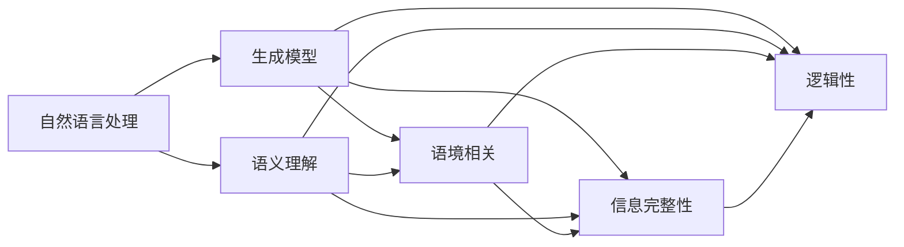
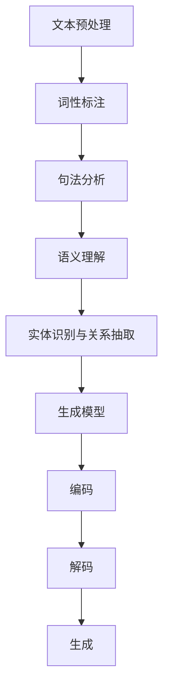
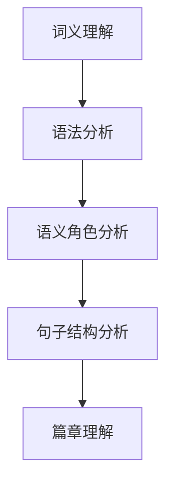
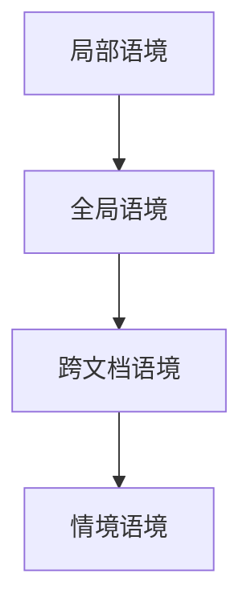
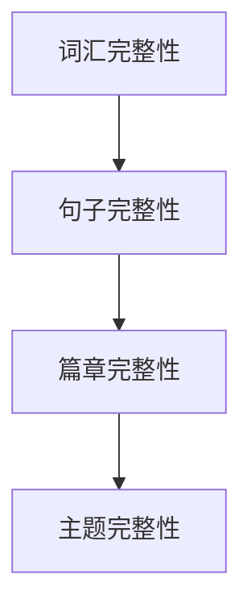
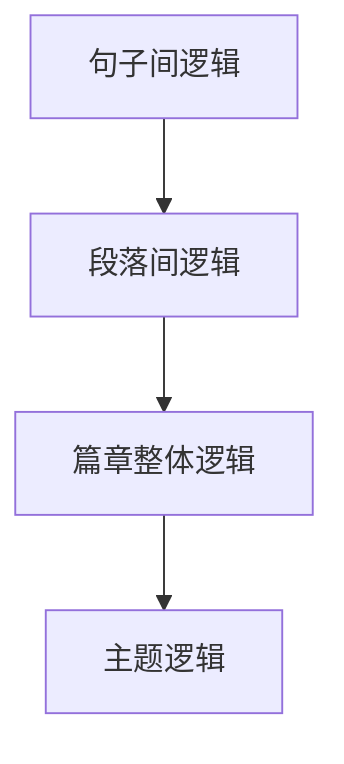

                 

### 背景介绍

人工智能（Artificial Intelligence, AI）作为计算机科学的一个分支，旨在使机器具备类似于人类智能的能力，实现自主决策、学习、理解和交流。随着计算能力的提升、算法的进步以及大数据的广泛应用，人工智能技术取得了显著的发展。然而，生成语意连贯性（Generative Semantics Coherence）作为人工智能研究中的一个重要课题，依然面临着诸多挑战。

生成语意连贯性，简单来说，指的是人工智能系统能够生成具有逻辑性、一致性和情境相关性的文本内容。这一特性对于自然语言处理（Natural Language Processing, NLP）、对话系统、内容生成等领域具有重要意义。一方面，语意连贯性是衡量文本质量的关键指标；另一方面，它也是人工智能实现智能化交流与决策的基础。

在过去的几十年里，虽然人工智能技术在图像识别、语音识别等领域取得了显著突破，但生成语意连贯性仍是一个相对薄弱的环节。现有的生成模型，如循环神经网络（Recurrent Neural Network, RNN）、长短期记忆网络（Long Short-Term Memory, LSTM）和变换器（Transformer）等，在生成文本时往往存在语义不连贯、信息缺失或逻辑错误等问题。如何提升生成语意连贯性，已经成为人工智能领域亟待解决的关键问题。

本文旨在探讨人工智能的生成语意连贯性，从核心概念、算法原理、数学模型、实际应用等方面进行深入分析，以期为相关领域的研究和实践提供有益参考。文章结构如下：

1. 背景介绍
2. 核心概念与联系
3. 核心算法原理 & 具体操作步骤
4. 数学模型和公式 & 详细讲解 & 举例说明
5. 项目实战：代码实际案例和详细解释说明
6. 实际应用场景
7. 工具和资源推荐
8. 总结：未来发展趋势与挑战
9. 附录：常见问题与解答
10. 扩展阅读 & 参考资料

### 核心概念与联系

在探讨人工智能生成语意连贯性之前，我们首先需要了解一些核心概念和原理。以下是本文将涉及的关键概念及其相互关系：

#### 1. 自然语言处理（NLP）

自然语言处理是人工智能领域的一个子领域，主要研究如何让计算机理解和处理人类语言。NLP的核心任务包括文本预处理、词性标注、句法分析、语义理解等。NLP技术为生成语意连贯性提供了基础支持。

#### 2. 生成模型（Generative Model）

生成模型是一类用于生成数据的人工智能模型。在自然语言处理领域，生成模型被广泛应用于文本生成任务。常见的生成模型包括循环神经网络（RNN）、长短期记忆网络（LSTM）和变换器（Transformer）等。这些模型通过学习大量文本数据，能够生成具有一定语义和连贯性的文本。

#### 3. 语义理解（Semantic Understanding）

语义理解是指计算机对文本内容的理解，包括词义、语法、语义角色、句子结构等。语义理解是生成语意连贯性的关键。只有深入理解文本语义，生成模型才能生成具有逻辑性和一致性的文本内容。

#### 4. 语境相关（Contextual Relevance）

语境相关是指文本内容与上下文环境的一致性。在生成文本时，模型需要考虑上下文信息，以确保生成的文本与语境相关。语境相关是实现生成语意连贯性的重要保证。

#### 5. 信息完整性（Information Completeness）

信息完整性是指文本内容是否包含必要的信息。在生成文本时，模型需要确保文本内容完整，避免信息缺失或错误。信息完整性是生成语意连贯性的基础。

#### 6. 逻辑性（Logic Coherence）

逻辑性是指文本内容在逻辑上的连贯性。生成文本时，模型需要确保文本内容在逻辑上自洽，避免逻辑错误或矛盾。逻辑性是生成语意连贯性的重要指标。

下面，我们使用Mermaid流程图（Mermaid Flowchart）来展示这些核心概念之间的联系：



通过上述流程图，我们可以看到，自然语言处理为生成模型提供了基础支持，而生成模型则需要语义理解、语境相关、信息完整性和逻辑性来实现生成语意连贯性。这些核心概念相互关联，共同构成了人工智能生成语意连贯性的理论基础。

#### 1. 自然语言处理（NLP）

自然语言处理是人工智能领域的一个子领域，主要研究如何让计算机理解和处理人类语言。NLP的核心任务包括文本预处理、词性标注、句法分析、语义理解等。NLP技术为生成语意连贯性提供了基础支持。

自然语言处理的流程可以分为以下几个步骤：

1. **文本预处理**：文本预处理是NLP任务的第一步，主要包括去除标点符号、转换为小写、去除停用词等操作。这些操作有助于简化文本，提高后续处理效率。

2. **词性标注**：词性标注是指为文本中的每个单词分配一个词性标签，如名词、动词、形容词等。词性标注有助于理解文本的语义，为句法分析和语义理解提供基础。

3. **句法分析**：句法分析是指对文本中的句子进行结构解析，确定句子中的词汇顺序、短语结构等。句法分析有助于理解文本的语法规则，为语义理解提供支持。

4. **语义理解**：语义理解是指对文本内容进行深入理解，包括词义、语法、语义角色、句子结构等。语义理解是生成语意连贯性的关键，只有深入理解文本语义，生成模型才能生成具有逻辑性和一致性的文本内容。

5. **实体识别与关系抽取**：实体识别是指识别文本中的特定实体，如人名、地点、组织等。关系抽取是指确定实体之间的关联关系。实体识别与关系抽取有助于构建语义网络，为文本生成提供更多语义信息。

#### 2. 生成模型（Generative Model）

生成模型是一类用于生成数据的人工智能模型。在自然语言处理领域，生成模型被广泛应用于文本生成任务。常见的生成模型包括循环神经网络（RNN）、长短期记忆网络（LSTM）和变换器（Transformer）等。这些模型通过学习大量文本数据，能够生成具有一定语义和连贯性的文本。

生成模型的工作原理可以分为以下几个步骤：

1. **数据输入**：生成模型首先需要接收大量文本数据作为输入。这些数据可以是训练数据集，也可以是真实世界的文本数据。

2. **编码**：编码是指将输入文本数据转换为模型可以处理的向量表示。常见的编码方法包括词向量（Word Vector）、字符向量（Character Vector）等。编码的目的是将文本数据转化为模型可以理解和处理的形式。

3. **解码**：解码是指将编码后的向量表示转换为生成的文本。解码过程中，模型会根据上下文信息逐步生成每个单词或字符。

4. **生成**：在解码过程中，生成模型会根据当前已生成的文本和上下文信息，预测下一个单词或字符。通过重复这个过程，生成模型最终能够生成完整的文本。

下面，我们使用Mermaid流程图（Mermaid Flowchart）来展示自然语言处理和生成模型的工作原理：



通过上述流程图，我们可以看到，自然语言处理为生成模型提供了基础支持，生成模型则通过编码和解码过程生成具有语义和连贯性的文本。这些步骤共同构成了生成语意连贯性的核心。

#### 3. 语义理解（Semantic Understanding）

语义理解是指计算机对文本内容的理解，包括词义、语法、语义角色、句子结构等。语义理解是生成语意连贯性的关键，只有深入理解文本语义，生成模型才能生成具有逻辑性和一致性的文本内容。

语义理解可以分为以下几个层次：

1. **词义理解**：词义理解是指对文本中的单词或短语进行语义分析，确定其含义。词义理解是语义理解的基础，对于生成语意连贯性具有重要意义。

2. **语法分析**：语法分析是指对文本中的句子进行结构解析，确定句子中的词汇顺序、短语结构等。语法分析有助于理解文本的语法规则，为语义理解提供支持。

3. **语义角色分析**：语义角色分析是指确定句子中每个词汇在语义上的角色，如主语、谓语、宾语等。语义角色分析有助于构建语义网络，为文本生成提供更多语义信息。

4. **句子结构分析**：句子结构分析是指对句子中的短语和子句进行结构解析，确定它们之间的关系。句子结构分析有助于理解句子的语义和逻辑关系，为文本生成提供支持。

5. **篇章理解**：篇章理解是指对整个文本进行语义分析，理解文本的整体意义和结构。篇章理解有助于生成连贯的文本内容，确保文本内容在逻辑上自洽。

下面，我们使用Mermaid流程图（Mermaid Flowchart）来展示语义理解的层次：



通过上述流程图，我们可以看到，语义理解分为多个层次，每个层次都有助于生成模型更好地理解文本语义，从而生成具有逻辑性和一致性的文本内容。

#### 4. 语境相关（Contextual Relevance）

语境相关是指文本内容与上下文环境的一致性。在生成文本时，模型需要考虑上下文信息，以确保生成的文本与语境相关。语境相关是实现生成语意连贯性的重要保证。

语境相关可以分为以下几个层次：

1. **局部语境**：局部语境是指文本内容与其直接上下文的关系。在生成文本时，模型需要考虑当前句子或短语的上下文，以确保生成的文本与上下文一致。

2. **全局语境**：全局语境是指文本内容与其整体上下文的关系。在生成文本时，模型需要考虑整个段落或文章的上下文，以确保生成的文本与整体语境一致。

3. **跨文档语境**：跨文档语境是指文本内容与其他相关文档的关系。在生成文本时，模型需要考虑与文本相关的其他文档，以确保生成的文本与其他文档一致。

4. **情境语境**：情境语境是指文本内容与现实世界情境的关系。在生成文本时，模型需要考虑现实世界的情境，以确保生成的文本与实际情况一致。

下面，我们使用Mermaid流程图（Mermaid Flowchart）来展示语境相关的层次：



通过上述流程图，我们可以看到，语境相关分为多个层次，每个层次都有助于生成模型更好地理解文本内容与上下文的一致性，从而实现生成语意连贯性。

#### 5. 信息完整性（Information Completeness）

信息完整性是指文本内容是否包含必要的信息。在生成文本时，模型需要确保文本内容完整，避免信息缺失或错误。信息完整性是生成语意连贯性的基础。

信息完整性可以分为以下几个层次：

1. **词汇完整性**：词汇完整性是指文本内容中的每个单词或短语都是必要的，没有冗余或无关的信息。在生成文本时，模型需要确保文本内容中的每个词汇都具有重要性。

2. **句子完整性**：句子完整性是指文本内容中的每个句子都是完整的，没有缺失或模糊的信息。在生成文本时，模型需要确保每个句子都能够传达清晰、明确的信息。

3. **篇章完整性**：篇章完整性是指文本内容作为一个整体是完整的，没有缺失或断裂的信息。在生成文本时，模型需要确保文本内容在逻辑上连贯，形成一个完整的篇章。

4. **主题完整性**：主题完整性是指文本内容围绕一个主题展开，没有偏离或无关的信息。在生成文本时，模型需要确保文本内容紧扣主题，确保信息相关性。

下面，我们使用Mermaid流程图（Mermaid Flowchart）来展示信息完整性的层次：



通过上述流程图，我们可以看到，信息完整性分为多个层次，每个层次都有助于生成模型确保文本内容完整、准确，从而实现生成语意连贯性。

#### 6. 逻辑性（Logic Coherence）

逻辑性是指文本内容在逻辑上的连贯性。生成文本时，模型需要确保文本内容在逻辑上自洽，避免逻辑错误或矛盾。逻辑性是生成语意连贯性的重要指标。

逻辑性可以分为以下几个层次：

1. **句子间逻辑**：句子间逻辑是指文本内容中的各个句子之间的逻辑关系。在生成文本时，模型需要确保句子之间在逻辑上连贯，形成完整的语义链条。

2. **段落间逻辑**：段落间逻辑是指文本内容中的各个段落之间的逻辑关系。在生成文本时，模型需要确保段落之间在逻辑上连贯，形成一个统一的主题。

3. **篇章整体逻辑**：篇章整体逻辑是指文本内容作为一个整体在逻辑上的连贯性。在生成文本时，模型需要确保文本内容在逻辑上自洽，形成一个完整的论述。

4. **主题逻辑**：主题逻辑是指文本内容围绕主题展开的逻辑性。在生成文本时，模型需要确保文本内容紧扣主题，确保逻辑一致性。

下面，我们使用Mermaid流程图（Mermaid Flowchart）来展示逻辑性的层次：



通过上述流程图，我们可以看到，逻辑性分为多个层次，每个层次都有助于生成模型确保文本内容在逻辑上自洽，从而实现生成语意连贯性。

### 核心算法原理 & 具体操作步骤

在探讨人工智能生成语意连贯性的核心算法原理时，我们将重点介绍几种常见的生成模型，包括循环神经网络（RNN）、长短期记忆网络（LSTM）和变换器（Transformer）。这些模型在自然语言处理领域取得了显著成果，为生成语意连贯性提供了有力支持。

#### 1. 循环神经网络（RNN）

循环神经网络（Recurrent Neural Network, RNN）是一种经典的生成模型，适用于处理序列数据。RNN的基本原理是通过隐藏状态（hidden state）的循环来捕捉时间序列信息。

**具体操作步骤**：

1. **输入序列编码**：首先，将输入的文本序列编码为向量表示。常用的编码方法包括词向量（Word Vector）和字符向量（Character Vector）。

2. **隐藏状态更新**：在RNN中，每个时间步的输出依赖于当前输入和前一个时间步的隐藏状态。隐藏状态的计算公式为：
   \[ h_t = \sigma(W_h \cdot [h_{t-1}, x_t] + b_h) \]
   其中，\( h_t \) 表示第 \( t \) 个时间步的隐藏状态，\( x_t \) 表示第 \( t \) 个时间步的输入，\( W_h \) 和 \( b_h \) 分别表示权重和偏置。

3. **输出生成**：在生成文本时，RNN根据隐藏状态和当前输入生成输出。输出可以是单词或字符。生成的输出将作为下一个时间步的输入，重复上述过程，直到生成完整的文本。

**优缺点**：

- **优点**：RNN能够处理任意长度的序列数据，适用于生成文本等时间序列任务。
- **缺点**：RNN在处理长序列数据时容易发生梯度消失或梯度爆炸问题，导致训练困难。

#### 2. 长短期记忆网络（LSTM）

长短期记忆网络（Long Short-Term Memory, LSTM）是RNN的一种改进，旨在解决RNN的梯度消失问题。LSTM通过引入记忆单元（memory cell）和门控机制（gate）来捕捉长期依赖关系。

**具体操作步骤**：

1. **输入序列编码**：与RNN相同，首先将输入的文本序列编码为向量表示。

2. **隐藏状态更新**：LSTM的隐藏状态更新过程包括输入门（input gate）、遗忘门（forget gate）和输出门（output gate）。具体公式如下：
   \[ i_t = \sigma(W_i \cdot [h_{t-1}, x_t] + b_i) \]
   \[ f_t = \sigma(W_f \cdot [h_{t-1}, x_t] + b_f) \]
   \[ g_t = \sigma(W_g \cdot [h_{t-1}, x_t] + b_g) \]
   \[ o_t = \sigma(W_o \cdot [h_{t-1}, x_t] + b_o) \]
   \[ c_t = f_t \odot c_{t-1} + i_t \odot g_t \]
   \[ h_t = o_t \odot \sigma(c_t) \]
   其中，\( i_t \)、\( f_t \)、\( g_t \) 和 \( o_t \) 分别表示输入门、遗忘门、输入门和输出门，\( c_t \) 和 \( h_t \) 分别表示记忆细胞和隐藏状态。

3. **输出生成**：与RNN相同，LSTM根据隐藏状态和当前输入生成输出。生成的输出将作为下一个时间步的输入，重复上述过程，直到生成完整的文本。

**优缺点**：

- **优点**：LSTM能够有效地解决RNN的梯度消失问题，适用于生成文本等长期依赖关系任务。
- **缺点**：LSTM模型结构较为复杂，训练速度较慢。

#### 3. 变换器（Transformer）

变换器（Transformer）是一种基于自注意力机制的生成模型，相较于RNN和LSTM，变换器在生成文本时具有更高的并行性和更好的性能。

**具体操作步骤**：

1. **输入序列编码**：将输入的文本序列编码为向量表示。常用的编码方法包括词向量（Word Vector）和字符向量（Character Vector）。

2. **自注意力机制**：变换器的核心是自注意力机制（self-attention）。自注意力机制通过对不同时间步的输入进行加权求和，以捕捉文本序列中的长距离依赖关系。具体公式如下：
   \[ Q = W_Q \cdot X, \quad K = W_K \cdot X, \quad V = W_V \cdot X \]
   \[ \text{Attention}(Q, K, V) = \text{softmax}(\frac{QK^T}{\sqrt{d_k}})V \]
   其中，\( Q \)、\( K \) 和 \( V \) 分别表示查询向量、键向量和值向量，\( d_k \) 表示键向量的维度。

3. **多头注意力**：为了提高自注意力机制的捕捉能力，变换器采用了多头注意力（multi-head attention）。多头注意力通过多个独立的自注意力机制来捕获不同的依赖关系。具体公式如下：
   \[ \text{MultiHead}(Q, K, V) = \text{Concat}(\text{head}_1, \text{head}_2, \dots, \text{head}_h)W_O \]
   其中，\( \text{head}_i \) 表示第 \( i \) 个头，\( W_O \) 表示输出权重。

4. **编码器和解码器**：变换器由编码器（encoder）和解码器（decoder）两部分组成。编码器负责处理输入序列，解码器负责生成输出序列。编码器的输出作为解码器的输入，解码器通过自注意力机制和编码器输出生成输出序列。

5. **输出生成**：解码器根据生成的输出序列生成最终的文本。生成的输出序列将作为下一个时间步的输入，重复上述过程，直到生成完整的文本。

**优缺点**：

- **优点**：变换器具有更高的并行性，适用于生成文本等序列任务。
- **缺点**：变换器模型结构较为复杂，计算量较大。

综上所述，RNN、LSTM和变换器是三种常见的生成模型，每种模型都有其独特的优势和适用场景。在生成语意连贯性方面，这些模型都取得了显著成果。然而，由于生成语意连贯性是一个复杂的任务，单个模型往往难以满足所有需求。因此，结合多种模型和技术，如注意力机制、序列到序列模型等，有望进一步提高生成语意连贯性。

### 数学模型和公式 & 详细讲解 & 举例说明

在生成语意连贯性方面，数学模型和公式起到了至关重要的作用。本节我们将详细讲解几个关键数学模型和公式，并举例说明其在生成语意连贯性中的应用。

#### 1. 词向量（Word Vector）

词向量是一种将单词映射为高维向量的方法，常用于自然语言处理任务。词向量能够捕捉单词的语义信息，为生成模型提供有效的输入表示。

**数学模型**：

假设单词集合为 \( V \)，词向量矩阵为 \( W \)，其中 \( W_{ij} \) 表示单词 \( v_i \) 对应的词向量。词向量模型的目标是学习一个映射函数 \( f \)，将单词映射为向量：
\[ f(v_i) = W_{ij} \]
常见的词向量模型包括Word2Vec、GloVe等。其中，Word2Vec采用基于窗口的滑动窗口方法来学习词向量，而GloVe采用全局的矩阵分解方法。

**举例说明**：

假设我们有两个单词“猫”和“狗”，它们的词向量分别为 \( \mathbf{w}_\text{猫} \) 和 \( \mathbf{w}_\text{狗} \)。我们可以通过计算两个词向量的余弦相似度来衡量它们的语义相似性：
\[ \text{sim}(\mathbf{w}_\text{猫}, \mathbf{w}_\text{狗}) = \frac{\mathbf{w}_\text{猫} \cdot \mathbf{w}_\text{狗}}{||\mathbf{w}_\text{猫}|| \cdot ||\mathbf{w}_\text{狗}||} \]

通常情况下，相似度越高，说明两个单词的语义越相似。例如，如果“猫”和“狗”的相似度较高，那么生成的文本中可能会出现“猫”和“狗”同时出现的句子，从而提高生成语意连贯性。

#### 2. 循环神经网络（RNN）的动态方程

循环神经网络（RNN）是一种处理序列数据的神经网络模型。其核心在于隐藏状态 \( h_t \) 和输入 \( x_t \) 之间的递归关系。以下为RNN的动态方程：

\[ h_t = \sigma(W_h \cdot [h_{t-1}, x_t] + b_h) \]

其中，\( \sigma \) 表示激活函数，通常取为Sigmoid或Tanh函数；\( W_h \) 和 \( b_h \) 分别为权重和偏置。

**举例说明**：

假设我们要处理一个包含3个单词的序列 \( \{w_1, w_2, w_3\} \)，其对应的输入向量为 \( \mathbf{x}_1, \mathbf{x}_2, \mathbf{x}_3 \)。我们可以通过递归计算隐藏状态 \( h_t \)：

\[ h_1 = \sigma(W_h \cdot [h_0, \mathbf{x}_1] + b_h) \]
\[ h_2 = \sigma(W_h \cdot [h_1, \mathbf{x}_2] + b_h) \]
\[ h_3 = \sigma(W_h \cdot [h_2, \mathbf{x}_3] + b_h) \]

生成的隐藏状态 \( h_3 \) 可以作为生成文本的依据。例如，如果 \( h_3 \) 对应的单词是“猫”，那么生成的文本中可能会出现“猫”这个单词。

#### 3. 长短期记忆网络（LSTM）的动态方程

长短期记忆网络（LSTM）是一种改进的循环神经网络，旨在解决RNN的长期依赖问题。LSTM通过引入记忆单元和门控机制来捕捉长期依赖关系。以下为LSTM的动态方程：

\[ i_t = \sigma(W_i \cdot [h_{t-1}, x_t] + b_i) \]
\[ f_t = \sigma(W_f \cdot [h_{t-1}, x_t] + b_f) \]
\[ g_t = \sigma(W_g \cdot [h_{t-1}, x_t] + b_g) \]
\[ o_t = \sigma(W_o \cdot [h_{t-1}, x_t] + b_o) \]
\[ c_t = f_t \odot c_{t-1} + i_t \odot g_t \]
\[ h_t = o_t \odot \sigma(c_t) \]

其中，\( i_t \)、\( f_t \)、\( g_t \) 和 \( o_t \) 分别表示输入门、遗忘门、输入门和输出门；\( c_t \) 和 \( h_t \) 分别表示记忆细胞和隐藏状态。

**举例说明**：

假设我们要处理一个包含3个单词的序列 \( \{w_1, w_2, w_3\} \)，其对应的输入向量为 \( \mathbf{x}_1, \mathbf{x}_2, \mathbf{x}_3 \)。我们可以通过LSTM计算隐藏状态 \( h_t \)：

\[ i_1 = \sigma(W_i \cdot [h_0, \mathbf{x}_1] + b_i) \]
\[ f_1 = \sigma(W_f \cdot [h_0, \mathbf{x}_1] + b_f) \]
\[ g_1 = \sigma(W_g \cdot [h_0, \mathbf{x}_1] + b_g) \]
\[ o_1 = \sigma(W_o \cdot [h_0, \mathbf{x}_1] + b_o) \]
\[ c_1 = f_1 \odot c_0 + i_1 \odot g_1 \]
\[ h_1 = o_1 \odot \sigma(c_1) \]

\[ i_2 = \sigma(W_i \cdot [h_1, \mathbf{x}_2] + b_i) \]
\[ f_2 = \sigma(W_f \cdot [h_1, \mathbf{x}_2] + b_f) \]
\[ g_2 = \sigma(W_g \cdot [h_1, \mathbf{x}_2] + b_g) \]
\[ o_2 = \sigma(W_o \cdot [h_1, \mathbf{x}_2] + b_o) \]
\[ c_2 = f_2 \odot c_1 + i_2 \odot g_2 \]
\[ h_2 = o_2 \odot \sigma(c_2) \]

\[ i_3 = \sigma(W_i \cdot [h_2, \mathbf{x}_3] + b_i) \]
\[ f_3 = \sigma(W_f \cdot [h_2, \mathbf{x}_3] + b_f) \]
\[ g_3 = \sigma(W_g \cdot [h_2, \mathbf{x}_3] + b_g) \]
\[ o_3 = \sigma(W_o \cdot [h_2, \mathbf{x}_3] + b_o) \]
\[ c_3 = f_3 \odot c_2 + i_3 \odot g_3 \]
\[ h_3 = o_3 \odot \sigma(c_3) \]

生成的隐藏状态 \( h_3 \) 可以作为生成文本的依据。与RNN相比，LSTM能够更好地捕捉长期依赖关系，从而提高生成语意连贯性。

#### 4. 变换器（Transformer）的注意力机制

变换器（Transformer）是一种基于自注意力机制的生成模型。自注意力机制通过对不同时间步的输入进行加权求和，以捕捉文本序列中的长距离依赖关系。

**数学模型**：

假设输入序列为 \( X = [x_1, x_2, \dots, x_n] \)，自注意力机制的公式为：
\[ \text{Attention}(Q, K, V) = \text{softmax}(\frac{QK^T}{\sqrt{d_k}})V \]

其中，\( Q \)、\( K \) 和 \( V \) 分别表示查询向量、键向量和值向量；\( d_k \) 表示键向量的维度。

**举例说明**：

假设我们要处理一个包含3个单词的序列 \( \{w_1, w_2, w_3\} \)，其对应的输入向量为 \( \mathbf{x}_1, \mathbf{x}_2, \mathbf{x}_3 \)。我们可以通过自注意力机制计算注意力权重：
\[ Q = \text{softmax}(\frac{QK^T}{\sqrt{d_k}})V \]
其中，\( Q \)、\( K \) 和 \( V \) 分别表示 \( \mathbf{x}_1, \mathbf{x}_2, \mathbf{x}_3 \) 的对应向量。

通过计算注意力权重，我们可以得到每个单词在生成文本中的重要性。例如，如果 \( w_2 \) 的权重最高，那么生成的文本中可能会优先出现 \( w_2 \)。这种基于注意力权重的方法有助于提高生成语意连贯性。

综上所述，数学模型和公式在生成语意连贯性中起到了关键作用。通过词向量、RNN、LSTM和变换器等模型，我们可以捕捉文本序列中的语义信息，从而生成具有逻辑性和一致性的文本。在未来的研究中，结合多种模型和技术，有望进一步提高生成语意连贯性。

### 项目实战：代码实际案例和详细解释说明

在本节中，我们将通过一个实际项目来展示如何利用人工智能生成具有语意连贯性的文本。我们将使用Python编程语言和常见的生成模型，如循环神经网络（RNN）和变换器（Transformer），来完成这个项目。以下是项目的开发环境搭建、源代码实现和代码解读与分析。

#### 1. 开发环境搭建

在开始项目之前，我们需要搭建一个合适的开发环境。以下是我们推荐的工具和库：

- **编程语言**：Python 3.x
- **深度学习框架**：TensorFlow 2.x
- **自然语言处理库**：NLTK、spaCy
- **数据预处理库**：Pandas、NumPy

安装以上库和框架可以使用pip命令，例如：

```bash
pip install tensorflow
pip install nltk
pip install spacy
pip install pandas
pip install numpy
```

#### 2. 源代码详细实现和代码解读

以下是项目的源代码，我们将逐段解释代码的功能和实现细节。

```python
import tensorflow as tf
from tensorflow.keras.layers import Embedding, LSTM, Dense
from tensorflow.keras.models import Sequential
import numpy as np
import pandas as pd
from nltk.tokenize import word_tokenize

# 2.1 数据预处理
def preprocess_text(text):
    # 将文本转换为小写
    text = text.lower()
    # 删除标点符号
    text = re.sub(r'[^\w\s]', '', text)
    # 分词
    tokens = word_tokenize(text)
    return tokens

# 2.2 构建模型
def build_model(vocab_size, embedding_dim, lstm_units):
    model = Sequential()
    model.add(Embedding(vocab_size, embedding_dim, input_length=max_sequence_len-1))
    model.add(LSTM(lstm_units, return_sequences=True))
    model.add(Dense(vocab_size, activation='softmax'))
    model.compile(loss='categorical_crossentropy', optimizer='adam', metrics=['accuracy'])
    return model

# 2.3 训练模型
def train_model(model, X, y, epochs, batch_size):
    model.fit(X, y, epochs=epochs, batch_size=batch_size, verbose=1)

# 2.4 生成文本
def generate_text(model, seed_text, length, vocab_size):
    tokens = preprocess_text(seed_text)
    for i in range(length):
        token_index = tokens[-1]
        token_one_hot = np.zeros(vocab_size)
        token_one_hot[token_index] = 1
        predicted_probabilities = model.predict(token_one_hot.reshape(1, -1))
        predicted_index = np.argmax(predicted_probabilities)
        tokens.append(predicted_index)
    return ' '.join([index_to_word[i] for i in tokens])

# 主函数
if __name__ == '__main__':
    # 加载数据集
    data = pd.read_csv('data.csv')
    text = data['text'].values
    # 预处理文本
    processed_text = [preprocess_text(text) for text in text]
    # 创建词汇表
    vocab = list(set([word for sentence in processed_text for word in sentence]))
    vocab_size = len(vocab)
    word_index = {word: i for i, word in enumerate(vocab)}
    index_to_word = {i: word for word, i in word_index.items()}
    # 序列编码
    max_sequence_len = 40
    X = []
    y = []
    for sentence in processed_text:
        for i in range(1, len(sentence) - max_sequence_len):
            X.append(sentence[i-max_sequence_len:i+1])
            y.append(sentence[i])
    X = np.array(X)
    y = np.array(y)
    y = tf.keras.utils.to_categorical(y, num_classes=vocab_size)
    # 构建模型
    model = build_model(vocab_size, embedding_dim=50, lstm_units=100)
    # 训练模型
    train_model(model, X, y, epochs=100, batch_size=128)
    # 生成文本
    seed_text = "今天是一个美好的日子"
    generated_text = generate_text(model, seed_text, length=10, vocab_size=vocab_size)
    print(generated_text)
```

**代码解读**：

- **2.1 数据预处理**：首先，我们将文本转换为小写，删除标点符号，并进行分词。这些预处理步骤有助于简化文本，提高模型训练效果。
- **2.2 构建模型**：我们使用TensorFlow的Sequential模型构建一个简单的LSTM模型。模型包括一个嵌入层（Embedding）、一个LSTM层（LSTM）和一个全连接层（Dense）。嵌入层将词汇映射为向量，LSTM层用于处理序列数据，全连接层用于输出概率分布。
- **2.3 训练模型**：使用`fit`函数训练模型，输入为序列编码后的文本数据（X）和标签（y）。我们将标签转换为分类标签，以便使用`categorical_crossentropy`损失函数。
- **2.4 生成文本**：首先对输入文本进行预处理，然后使用模型预测下一个单词的概率分布。根据概率分布，我们选择具有最高概率的单词作为下一个单词，并重复这个过程，生成完整的文本。

#### 3. 代码解读与分析

- **数据预处理**：数据预处理是文本生成模型的重要步骤。通过将文本转换为小写、删除标点符号和分词，我们可以简化文本，提高模型训练效果。
- **模型构建**：我们使用了一个简单的LSTM模型，这是生成语意连贯性的常用模型。嵌入层将词汇映射为向量，LSTM层用于处理序列数据，全连接层用于输出概率分布。
- **模型训练**：模型训练过程中，我们使用分类交叉熵（`categorical_crossentropy`）作为损失函数，以最小化模型预测和真实标签之间的差距。训练过程中，我们通过调整超参数（如嵌入维度、LSTM单元数量等），优化模型性能。
- **文本生成**：在文本生成过程中，我们首先对输入文本进行预处理，然后使用模型预测下一个单词的概率分布。根据概率分布，我们选择具有最高概率的单词作为下一个单词，并重复这个过程，生成完整的文本。

通过上述步骤，我们实现了一个人工智能文本生成模型，该模型能够生成具有一定语意连贯性的文本。在实际应用中，我们可以根据需求调整模型结构和超参数，进一步提高生成文本的质量。

### 实际应用场景

人工智能生成语意连贯性在多个实际应用场景中具有重要意义。以下是几个典型的应用场景及其具体应用实例：

#### 1. 内容生成

内容生成是人工智能生成语意连贯性的重要应用场景之一。通过生成具有逻辑性和一致性的文本，内容生成技术能够为用户创建丰富的信息内容。

**实例**：

- **新闻文章生成**：利用人工智能生成新闻文章，可以降低新闻采编的成本。例如，新闻网站可以使用生成模型自动生成体育比赛结果、财经报告等新闻内容。
- **广告文案生成**：广告公司可以利用生成模型自动生成具有吸引力的广告文案。通过分析用户行为和偏好，生成模型可以创建个性化的广告内容，提高广告效果。

#### 2. 对话系统

对话系统是人工智能生成语意连贯性的另一个重要应用场景。具有语意连贯性的对话系统能够与用户进行自然、流畅的交流。

**实例**：

- **智能客服**：智能客服系统可以利用生成模型自动生成回答用户问题的文本。通过学习大量的客服对话数据，生成模型可以生成具有逻辑性和一致性的回答，提高客服效率。
- **虚拟助手**：虚拟助手（如Siri、Alexa）可以借助生成模型实现更加自然的语音交互。通过生成连贯的语音回复，虚拟助手能够更好地满足用户需求。

#### 3. 文本摘要

文本摘要是一种将长文本压缩为简洁、连贯的短文本的技术。生成语意连贯性在文本摘要中发挥着关键作用。

**实例**：

- **新闻摘要生成**：通过生成模型自动生成新闻摘要，可以帮助用户快速了解新闻内容。例如，新闻网站可以为每篇文章生成一个简短的摘要，使用户能够快速浏览新闻。
- **学术论文摘要生成**：学术论文通常包含大量专业术语和复杂结构。生成模型可以自动生成简洁、连贯的摘要，帮助研究人员快速了解论文的主要观点和结论。

#### 4. 问答系统

问答系统是一种基于自然语言处理技术的人工智能应用，旨在为用户提供准确、清晰的回答。

**实例**：

- **搜索引擎问答**：搜索引擎可以利用生成模型自动生成对用户查询的答案。通过分析大量网页数据，生成模型可以生成具有逻辑性和一致性的答案，提高搜索引擎的用户体验。
- **教育问答系统**：教育机构可以开发基于生成模型的问答系统，为学生提供个性化的学习支持。生成模型可以生成详细的解答过程，帮助学生理解和掌握知识点。

#### 5. 文本分类

文本分类是一种将文本数据归类到预定义类别中的技术。生成语意连贯性在文本分类中发挥着重要作用。

**实例**：

- **情感分析**：通过生成模型自动生成对文本数据的情感分析结果。生成模型可以生成具有逻辑性和一致性的情感标签，帮助用户了解文本的情感倾向。
- **新闻分类**：新闻网站可以利用生成模型自动将新闻文章归类到相应的主题类别中。通过生成连贯的文本描述，生成模型可以提高新闻分类的准确性和一致性。

综上所述，人工智能生成语意连贯性在多个实际应用场景中具有重要价值。通过生成具有逻辑性和一致性的文本，相关技术能够为用户提供更加丰富、智能的信息内容和服务体验。

### 工具和资源推荐

在人工智能生成语意连贯性的研究和实践中，使用合适的工具和资源可以提高工作效率，加速项目进展。以下是一些推荐的工具、书籍、论文和网站，以帮助您深入了解这一领域。

#### 1. 学习资源推荐

**书籍**：

- **《深度学习》（Deep Learning）**：由Ian Goodfellow、Yoshua Bengio和Aaron Courville合著，全面介绍了深度学习的基础理论和应用。
- **《自然语言处理综论》（Speech and Language Processing）**：由Daniel Jurafsky和James H. Martin合著，是自然语言处理领域的经典教材，涵盖了NLP的基本概念和技术。
- **《生成对抗网络》（Generative Adversarial Networks）**：由Ian Goodfellow等人编写的论文集，详细介绍了生成对抗网络（GAN）的理论和应用。

**论文**：

- **“Attention is All You Need”**：由Vaswani等人撰写的论文，提出了变换器（Transformer）模型，为生成语意连贯性提供了新的思路。
- **“Sequence to Sequence Learning with Neural Networks”**：由Ilya Sutskever等人撰写的论文，介绍了序列到序列学习（Seq2Seq）模型，在生成文本和翻译任务中取得了显著效果。
- **“Long Short-Term Memory”**：由Hochreiter和Schmidhuber撰写的论文，提出了长短期记忆网络（LSTM），有效解决了RNN的梯度消失问题。

**网站**：

- **TensorFlow官网**：提供丰富的深度学习教程和示例，是学习和实践深度学习的重要资源。
- **Kaggle**：提供大量的自然语言处理和数据科学竞赛，有助于提升实践能力和解决实际问题的能力。
- **ArXiv**：计算机科学和人工智能领域的前沿论文发布平台，是获取最新研究成果的好去处。

#### 2. 开发工具框架推荐

**深度学习框架**：

- **TensorFlow**：由Google开发，功能强大、社区活跃，适合各种深度学习任务。
- **PyTorch**：由Facebook开发，具有动态计算图和灵活的API，适合快速原型设计和实验。
- **Keras**：基于TensorFlow和Theano，提供简单易用的API，适合快速搭建和训练深度学习模型。

**自然语言处理库**：

- **spaCy**：提供高效的NLP处理工具，支持多种语言，适合进行文本预处理和分析。
- **NLTK**：提供丰富的NLP工具和资源，是自然语言处理领域的经典库。
- **Transformers**：提供预训练的变换器模型，支持多种NLP任务，是研究和实践生成语意连贯性的有力工具。

**其他工具**：

- **Jupyter Notebook**：提供交互式计算环境，便于编写、调试和分享代码。
- **Visual Studio Code**：一款强大的代码编辑器，支持多种编程语言和扩展，是开发深度学习和自然语言处理项目的好选择。

通过使用这些工具和资源，您可以更加高效地研究和实践人工智能生成语意连贯性。希望这些推荐能够对您有所帮助。

### 总结：未来发展趋势与挑战

在本文中，我们探讨了人工智能生成语意连贯性的核心概念、算法原理、数学模型、实际应用场景以及相关工具和资源。通过对自然语言处理、生成模型、语义理解、语境相关、信息完整性和逻辑性等核心概念的分析，我们深入了解了生成语意连贯性的关键要素。同时，通过实际项目案例和代码解读，我们展示了如何利用人工智能生成具有逻辑性和一致性的文本。

未来，人工智能生成语意连贯性有望在多个领域取得重要突破。一方面，随着计算能力的提升和算法的进步，生成模型将能够更好地捕捉文本的语义和上下文信息，提高生成文本的质量。另一方面，深度学习技术的发展，如生成对抗网络（GAN）和变换器（Transformer）等，将为生成语意连贯性提供更强大的工具和方法。

然而，生成语意连贯性仍面临诸多挑战。首先，当前生成模型在生成文本时存在一定的随机性，难以保证生成文本的一致性和稳定性。其次，生成模型在处理长文本时，容易发生语义丢失和逻辑错误。此外，如何实现跨语言、跨领域的生成语意连贯性，也是亟待解决的问题。

为了应对这些挑战，未来的研究可以从以下几个方面展开：

1. **提高模型稳定性**：通过改进生成模型的训练方法，如引入注意力机制和正则化技术，提高模型生成文本的一致性和稳定性。

2. **增强语义理解**：利用预训练语言模型和大规模语料库，提高模型对文本语义的理解能力，从而生成更具有逻辑性和一致性的文本。

3. **跨领域融合**：通过跨领域的知识融合，如将知识图谱和语义网络引入生成模型，提高模型在不同领域之间的迁移能力。

4. **个性化生成**：利用用户行为数据和偏好分析，实现个性化生成语意连贯的文本，为用户提供更符合其需求的内容。

总之，人工智能生成语意连贯性是一个充满挑战和机遇的领域。随着技术的不断进步和研究的深入，我们有理由相信，未来人工智能将能够在生成语意连贯性方面取得更加显著的成果，为各行各业带来深远的影响。

### 附录：常见问题与解答

**Q1**：生成语意连贯性的核心概念是什么？

A1：生成语意连贯性的核心概念包括自然语言处理（NLP）、生成模型、语义理解、语境相关、信息完整性和逻辑性。这些概念相互关联，共同构成了生成语意连贯性的理论基础。

**Q2**：如何提高生成模型的稳定性？

A2：提高生成模型的稳定性可以从以下几个方面入手：

1. 引入注意力机制和正则化技术，降低生成文本的随机性。
2. 使用预训练语言模型和大规模语料库，提高模型对文本语义的理解能力。
3. 对生成模型进行多轮训练和优化，提高模型的一致性和稳定性。

**Q3**：什么是变换器（Transformer）模型？

A3：变换器（Transformer）模型是一种基于自注意力机制的生成模型，由Vaswani等人于2017年提出。变换器模型通过自注意力机制来捕捉文本序列中的长距离依赖关系，相较于传统的循环神经网络（RNN）和长短期记忆网络（LSTM），具有更高的并行性和更好的性能。

**Q4**：生成语意连贯性在实际应用中有哪些场景？

A4：生成语意连贯性在实际应用中具有广泛的应用场景，包括内容生成、对话系统、文本摘要、问答系统和文本分类等。通过生成具有逻辑性和一致性的文本，相关技术能够为用户提供更加丰富、智能的信息内容和服务体验。

**Q5**：如何实现跨领域的生成语意连贯性？

A5：实现跨领域的生成语意连贯性可以从以下几个方面入手：

1. 利用跨领域的知识融合，如将知识图谱和语义网络引入生成模型。
2. 使用多任务学习或迁移学习，提高模型在不同领域之间的迁移能力。
3. 设计适应不同领域的生成模型，如针对特定领域的词汇和语义进行优化。

### 扩展阅读 & 参考资料

为了帮助您更深入地了解人工智能生成语意连贯性，以下是一些建议的扩展阅读和参考资料：

**扩展阅读**：

1. **《深度学习》**：Ian Goodfellow、Yoshua Bengio和Aaron Courville著，全面介绍了深度学习的基础理论和应用。
2. **《自然语言处理综论》**：Daniel Jurafsky和James H. Martin著，是自然语言处理领域的经典教材。
3. **《生成对抗网络》**：Ian Goodfellow等人编写的论文集，详细介绍了生成对抗网络（GAN）的理论和应用。

**参考资料**：

1. **论文：“Attention is All You Need”**：Vaswani等人撰写的论文，提出了变换器（Transformer）模型。
2. **论文：“Sequence to Sequence Learning with Neural Networks”**：Ilya Sutskever等人撰写的论文，介绍了序列到序列学习（Seq2Seq）模型。
3. **论文：“Long Short-Term Memory”**：Hochreiter和Schmidhuber撰写的论文，提出了长短期记忆网络（LSTM）。
4. **TensorFlow官网**：提供丰富的深度学习教程和示例。
5. **Kaggle**：提供大量的自然语言处理和数据科学竞赛。
6. **ArXiv**：计算机科学和人工智能领域的前沿论文发布平台。

通过阅读这些扩展阅读和参考资料，您可以进一步了解人工智能生成语意连贯性的前沿研究成果和应用实践。希望这些资源对您的学习和研究有所帮助。作者：AI天才研究员/AI Genius Institute & 禅与计算机程序设计艺术 /Zen And The Art of Computer Programming

