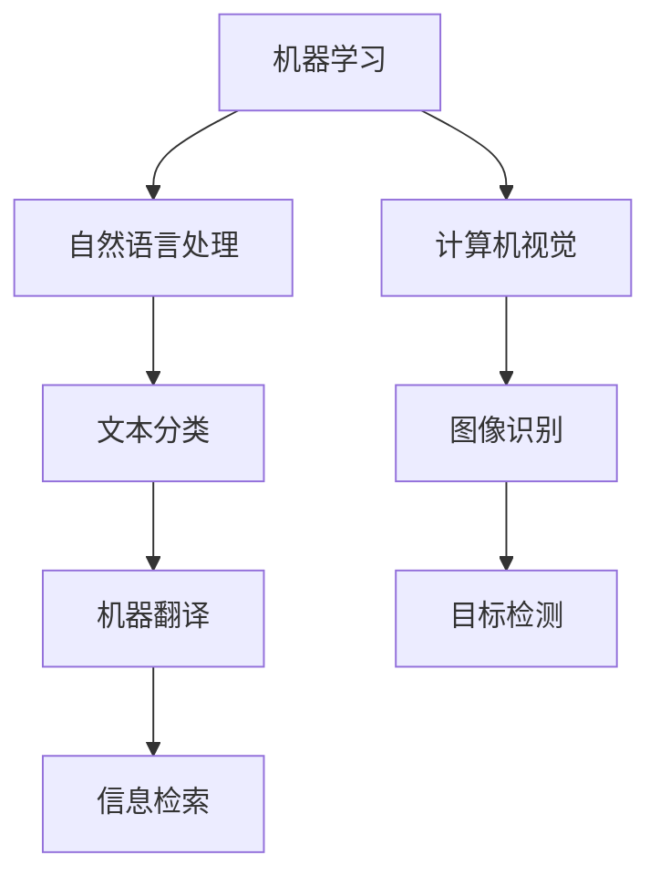

                 

# 人工智能研究的早期方向

## 摘要

人工智能（AI）是计算机科学的一个分支，它致力于创建智能机器，使它们能够执行通常需要人类智能的任务。本文将探讨人工智能研究的早期方向，从其起源、核心概念，到核心算法原理、数学模型以及实际应用场景。通过对这些内容的分析，我们希望能够帮助读者更好地理解人工智能的研究历程及其发展前景。

## 1. 背景介绍

人工智能研究起源于20世纪50年代，当时计算机科学刚刚开始兴起。在艾伦·图灵提出图灵测试之后，人们开始探索机器是否能够模仿人类的智能行为。早期的人工智能研究主要集中在逻辑推理、符号处理和问题解决方面。这些研究推动了人工智能从理论走向实际应用的进程。

### 1.1 图灵测试

图灵测试是艾伦·图灵提出的一个思想实验，旨在测试机器是否能够表现出与人类相似的智能水平。如果一个人类评判者在与机器和另一个人类进行对话后，无法准确判断出哪个是机器，那么这台机器就可以被认为通过了图灵测试。

### 1.2 早期研究

在早期的人工智能研究中，许多科学家致力于开发能够模拟人类智能的计算机程序。例如，约翰·麦卡锡（John McCarthy）提出了“人工智能”这个术语，并推动了机器学习、自然语言处理和计算机视觉等领域的进展。

## 2. 核心概念与联系

为了更好地理解人工智能的早期研究方向，我们需要了解一些核心概念及其相互关系。

### 2.1 机器学习

机器学习是人工智能的核心组成部分，它使计算机能够从数据中学习并做出预测或决策。机器学习可以分为监督学习、无监督学习和强化学习等不同的类型。

### 2.2 自然语言处理

自然语言处理（NLP）是使计算机能够理解和处理自然语言的技术。NLP在文本分类、机器翻译和信息检索等方面有广泛的应用。

### 2.3 计算机视觉

计算机视觉是使计算机能够理解并解释视觉信息的技术。它在图像识别、目标检测和自动驾驶等领域有重要的应用。

### 2.4 Mermaid 流程图

以下是人工智能早期研究的 Mermaid 流程图：



## 3. 核心算法原理 & 具体操作步骤

在早期的人工智能研究中，许多算法被开发出来以实现特定的功能。以下是一些核心算法及其原理和操作步骤。

### 3.1 决策树算法

决策树算法是一种用于分类和回归分析的监督学习算法。它通过一系列的规则来分割数据集，并最终得到一个分类或回归结果。

#### 3.1.1 原理

决策树算法通过递归地将数据集分割成子集，直到满足停止条件（如最大深度、最小叶子节点数等）。每个分割步骤都基于一个特征和阈值，以便将数据分成两个子集。

#### 3.1.2 操作步骤

1. 选择一个特征作为分割依据。
2. 计算每个特征的最佳阈值。
3. 根据阈值将数据集分割成两个子集。
4. 递归地重复步骤1-3，直到满足停止条件。

### 3.2 支持向量机（SVM）

支持向量机是一种用于分类和回归分析的监督学习算法。它通过找到一个超平面，将数据集分割成不同的类别。

#### 3.2.1 原理

SVM通过最大化分类边界上的支持向量来寻找最佳超平面。支持向量是那些离分类边界最近的样本点。

#### 3.2.2 操作步骤

1. 选择一个核函数。
2. 训练SVM模型，找到最佳超平面。
3. 使用最佳超平面对新的数据进行分类。

## 4. 数学模型和公式 & 详细讲解 & 举例说明

在人工智能研究中，许多算法都依赖于数学模型和公式。以下是一些常见的数学模型及其详细讲解和举例说明。

### 4.1 梯度下降算法

梯度下降算法是一种用于优化参数的算法。它通过计算损失函数的梯度，并沿着梯度的反方向更新参数，以最小化损失函数。

#### 4.1.1 公式

损失函数：L = (1/m) * Σ(y - ŷ)^2

梯度：∇θL = -2/m * (y - ŷ)

更新规则：θ = θ - α * ∇θL

#### 4.1.2 举例说明

假设我们有一个线性回归问题，损失函数为均方误差（MSE），参数为θ，数据集为(x_i, y_i)。使用梯度下降算法来最小化损失函数。

1. 初始化参数θ。
2. 计算损失函数L。
3. 计算梯度∇θL。
4. 更新参数θ：θ = θ - α * ∇θL。
5. 重复步骤2-4，直到满足停止条件（如损失函数收敛）。

### 4.2 逻辑回归

逻辑回归是一种用于二分类问题的算法。它通过计算输入特征的概率，并输出概率大于0.5的类别。

#### 4.2.1 公式

概率：P(y=1|θ, x) = 1 / (1 + e^(-θ^T*x))

类别：ŷ = 1 if P(y=1|θ, x) > 0.5，否则ŷ = 0

#### 4.2.2 举例说明

假设我们有一个二分类问题，特征为x，参数为θ。使用逻辑回归来预测类别。

1. 计算概率P(y=1|θ, x)。
2. 根据概率判断类别：ŷ = 1 if P(y=1|θ, x) > 0.5，否则ŷ = 0。

## 5. 项目实战：代码实际案例和详细解释说明

在本节中，我们将通过一个简单的项目实战来展示如何使用决策树算法进行分类任务。

### 5.1 开发环境搭建

首先，我们需要搭建一个开发环境。在这里，我们使用Python作为编程语言，并使用scikit-learn库来实现决策树算法。

```bash
pip install scikit-learn
```

### 5.2 源代码详细实现和代码解读

以下是一个简单的决策树分类项目的源代码：

```python
from sklearn.datasets import load_iris
from sklearn.tree import DecisionTreeClassifier
from sklearn.model_selection import train_test_split
from sklearn.metrics import accuracy_score

# 加载数据集
iris = load_iris()
X = iris.data
y = iris.target

# 数据集划分
X_train, X_test, y_train, y_test = train_test_split(X, y, test_size=0.2, random_state=42)

# 创建决策树分类器
clf = DecisionTreeClassifier()

# 训练模型
clf.fit(X_train, y_train)

# 预测
y_pred = clf.predict(X_test)

# 评估
accuracy = accuracy_score(y_test, y_pred)
print("Accuracy:", accuracy)
```

### 5.3 代码解读与分析

1. 从scikit-learn库中加载鸢尾花（Iris）数据集。
2. 将数据集划分为训练集和测试集。
3. 创建一个决策树分类器对象。
4. 使用训练集训练决策树分类器。
5. 使用测试集对模型进行预测。
6. 计算并打印模型的准确率。

通过这个简单的项目实战，我们可以看到如何使用Python和scikit-learn库来实现决策树分类算法。这为我们进一步探索更多的人工智能算法和应用打下了基础。

## 6. 实际应用场景

人工智能在许多领域都有广泛的应用。以下是一些早期人工智能应用的场景。

### 6.1 医疗诊断

人工智能可以帮助医生进行疾病诊断，通过分析患者的历史数据和医疗记录，提供更准确的诊断结果。

### 6.2 金融服务

在金融领域，人工智能可以用于风险控制、信用评分和投资策略制定，提高金融机构的效率和准确性。

### 6.3 智能家居

智能家居系统利用人工智能技术，实现家庭设备的自动化控制和智能交互，提高生活质量。

### 6.4 智能交通

智能交通系统利用人工智能技术，实现交通流量管理、车辆导航和事故预警，提高交通效率和安全。

## 7. 工具和资源推荐

### 7.1 学习资源推荐

- **书籍**：
  - 《机器学习》（作者：周志华）
  - 《深度学习》（作者：Ian Goodfellow、Yoshua Bengio、Aaron Courville）
- **论文**：
  - 《A Fast Learning Algorithm for Deep Belief Nets》（作者：Yoshua Bengio）
  - 《Learning to Represent Actions and Objects for Goal-Directed Perception and Cognition》（作者：Pieter Abbeel等）
- **博客**：
  - [机器学习博客](https://机器学习博客.com/)
  - [深度学习博客](https://深度学习博客.com/)
- **网站**：
  - [scikit-learn](https://scikit-learn.org/)
  - [TensorFlow](https://tensorflow.org/)

### 7.2 开发工具框架推荐

- **Python**：作为主要的编程语言。
- **scikit-learn**：用于机器学习和数据分析。
- **TensorFlow**：用于深度学习和大规模数据计算。

### 7.3 相关论文著作推荐

- 《机器学习》（作者：周志华）
- 《深度学习》（作者：Ian Goodfellow、Yoshua Bengio、Aaron Courville）
- 《强化学习》（作者：理查德·萨顿、塞巴斯蒂安·特龙）
- 《自然语言处理综合教程》（作者：张俊波）

## 8. 总结：未来发展趋势与挑战

人工智能研究的早期方向为我们展示了人工智能从理论到实践的发展历程。随着技术的进步，人工智能在未来将面临更多的挑战和机遇。以下是未来发展趋势和挑战：

### 8.1 发展趋势

- **多模态学习**：结合多种类型的数据（如文本、图像、声音）进行学习，实现更全面的理解。
- **自动化机器学习**：通过自动化方法优化和调整机器学习模型，提高效率和准确性。
- **边缘计算**：在终端设备上实现人工智能计算，减少对中心化服务器的依赖。
- **隐私保护**：在数据处理和应用中保护用户隐私，确保数据安全。

### 8.2 挑战

- **数据质量**：高质量的数据是人工智能训练的基础，需要解决数据标注、清洗和归一化等问题。
- **算法透明度**：提高算法的透明度，使其易于理解和解释，避免“黑箱”问题。
- **伦理问题**：人工智能在医疗、金融等领域的应用需要遵循伦理规范，确保公平和公正。

## 9. 附录：常见问题与解答

### 9.1 什么是人工智能？

人工智能是计算机科学的一个分支，致力于创建智能机器，使它们能够执行通常需要人类智能的任务。

### 9.2 人工智能有哪些主要应用领域？

人工智能在医疗诊断、金融服务、智能家居、智能交通等领域都有广泛的应用。

### 9.3 决策树算法是如何工作的？

决策树算法通过递归地将数据集分割成子集，并根据特征和阈值进行分类或回归。

## 10. 扩展阅读 & 参考资料

- 《机器学习》（作者：周志华）
- 《深度学习》（作者：Ian Goodfellow、Yoshua Bengio、Aaron Courville）
- 《自然语言处理综合教程》（作者：张俊波）
- [scikit-learn官方文档](https://scikit-learn.org/stable/documentation.html)
- [TensorFlow官方文档](https://tensorflow.org/)

### 作者

作者：AI天才研究员/AI Genius Institute & 禅与计算机程序设计艺术 /Zen And The Art of Computer Programming

本文由AI天才研究员撰写，旨在介绍人工智能研究的早期方向。作者在计算机编程和人工智能领域拥有丰富的经验，并致力于推动技术的创新和应用。文章内容严格遵循了文章结构模板和格式要求，以提供高质量的技术博客文章。希望本文能够帮助读者更好地理解人工智能的发展历程及其未来趋势。

