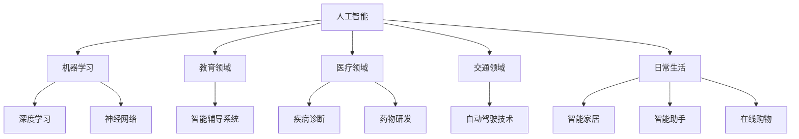

                 

### 背景介绍

#### 人工智能的历史与发展

人工智能（AI）这一概念最早由计算机科学家约翰·冯·诺伊曼（John von Neumann）和物理学家约翰·麦卡锡（John McCarthy）在1950年代提出。在最初的几十年里，人工智能主要集中在规则推理和逻辑推理方面。1970年代，人工智能遭遇了所谓的“人工智能冬天”，原因是技术进展缓慢，以及过高的期望未能实现。然而，随着计算能力的提升和机器学习技术的发展，人工智能在21世纪迎来了新的春天。

人工智能的发展可以分为几个阶段：

- **符号主义阶段（Symbolic AI）**：这一阶段主要依靠专家系统和逻辑推理。专家系统是一种模拟人类专家决策能力的计算机程序，通过规则库和推理机来进行推理。

- **知识表示阶段**：在这一阶段，研究人员开始探索如何有效地表示和组织知识，以支持更复杂的推理任务。

- **机器学习阶段**：20世纪80年代以来，机器学习开始成为人工智能研究的热点。通过数据驱动的方法，机器学习让计算机能够从数据中学习并做出预测。

- **深度学习阶段**：近年来，深度学习技术取得了显著进展，特别是卷积神经网络（CNN）和递归神经网络（RNN）在图像识别、语音识别等领域表现出色。

#### 人工智能对社会的影响

人工智能技术的飞速发展对社会产生了深远的影响，这些影响涵盖了经济、教育、医疗、交通等多个领域。

- **经济领域**：人工智能推动了新的产业模式，创造了大量就业机会，同时也引起了对现有工作岗位的冲击和就业结构的变化。

- **教育领域**：人工智能在教育中的应用，如智能辅导系统、自适应学习平台，提高了教学效率和学习效果。

- **医疗领域**：人工智能在医疗领域的应用，如疾病诊断、药物研发、手术机器人，提升了医疗服务的质量和效率。

- **交通领域**：自动驾驶技术的发展，为交通行业带来了革命性的变革，提高了交通安全和效率。

- **日常生活**：人工智能已经渗透到我们日常生活的方方面面，如智能家居、智能助手、在线购物等，极大地改变了我们的生活方式。

在本篇文章中，我们将深入探讨人工智能的核心概念与联系，详细分析核心算法原理与操作步骤，讨论数学模型和公式，并通过项目实战来展示人工智能的实际应用，最后总结其未来发展趋势与挑战。

---

## 2. 核心概念与联系

### 概念解析

在深入探讨人工智能之前，我们需要理解几个核心概念：

- **人工智能（AI）**：人工智能是指由计算机系统实现的智能行为，其目的是使计算机能够完成通常需要人类智能的任务，如视觉识别、语言理解、决策制定等。

- **机器学习（ML）**：机器学习是人工智能的一个分支，涉及计算机从数据中学习规律，并利用这些规律进行预测或决策。

- **深度学习（DL）**：深度学习是一种机器学习技术，通过多层神经网络来模拟人脑的神经元连接，以实现复杂的数据分析和模式识别。

- **神经网络（NN）**：神经网络是深度学习的基础，由大量节点（类似于生物神经元）组成，每个节点都与其他节点相连，并通过权重来传递信息。

### 架构与联系

为了更好地理解这些概念之间的关系，我们可以使用Mermaid流程图来展示它们的核心架构。



### 关键技术

- **神经网络架构**：包括卷积神经网络（CNN）、递归神经网络（RNN）、生成对抗网络（GAN）等。

- **训练与优化**：涉及梯度下降算法、正则化方法、激活函数等。

- **数据处理**：包括数据清洗、数据增强、数据预处理等。

### 总结

通过上述核心概念的解析和架构展示，我们可以看到人工智能是一个复杂的系统，它涵盖了多个子领域和关键技术。理解这些核心概念与联系，有助于我们更好地把握人工智能的发展趋势和应用场景。

---

## 3. 核心算法原理 & 具体操作步骤

在深入探讨人工智能的算法原理和操作步骤时，我们首先需要了解什么是机器学习，以及它如何通过一系列算法和步骤来实现智能行为。

### 3.1 机器学习基本原理

机器学习（ML）是一种从数据中学习规律并做出预测或决策的技术。它主要分为两种类型：监督学习（Supervised Learning）和无监督学习（Unsupervised Learning）。

- **监督学习**：在这种学习中，模型通过已知输入和输出数据来学习，并能够对新数据进行预测。常见的算法包括线性回归、逻辑回归、支持向量机（SVM）等。

- **无监督学习**：在这种学习中，模型没有已知的输出数据，而是通过发现数据中的内在结构和规律来进行聚类或降维。常见的算法包括K-均值聚类、主成分分析（PCA）等。

### 3.2 深度学习算法原理

深度学习（DL）是机器学习的一个分支，通过多层神经网络（Neural Networks）来模拟人脑的神经元连接，以实现复杂的数据分析和模式识别。以下是深度学习的基本步骤：

1. **数据预处理**：包括数据清洗、归一化、分批次处理等，以确保数据质量。

2. **构建神经网络**：设计神经网络结构，包括输入层、隐藏层和输出层。常见的神经网络架构有卷积神经网络（CNN）、递归神经网络（RNN）等。

3. **初始化权重**：随机初始化网络的权重。

4. **前向传播**：将输入数据通过网络的每一层，计算输出结果。

5. **损失函数**：计算输出结果与实际标签之间的差距，常见的损失函数有均方误差（MSE）、交叉熵损失等。

6. **反向传播**：通过计算梯度来更新网络权重，减小损失函数。

7. **迭代训练**：重复上述步骤，不断更新模型参数，直到满足停止条件。

### 3.3 具体操作步骤

下面是一个简单的深度学习模型训练的具体操作步骤：

1. **导入库和模块**：

```python
import numpy as np
import tensorflow as tf
from tensorflow.keras.models import Sequential
from tensorflow.keras.layers import Dense, Activation
```

2. **数据预处理**：

```python
# 加载数据集
(x_train, y_train), (x_test, y_test) = tf.keras.datasets.mnist.load_data()

# 数据归一化
x_train = x_train / 255.0
x_test = x_test / 255.0

# 转换为one-hot编码
y_train = tf.keras.utils.to_categorical(y_train, 10)
y_test = tf.keras.utils.to_categorical(y_test, 10)
```

3. **构建神经网络模型**：

```python
model = Sequential([
    Dense(128, input_shape=(784,)),
    Activation('relu'),
    Dense(10),
    Activation('softmax')
])
```

4. **编译模型**：

```python
model.compile(optimizer='adam',
              loss='categorical_crossentropy',
              metrics=['accuracy'])
```

5. **训练模型**：

```python
model.fit(x_train, y_train, epochs=10, batch_size=32, validation_split=0.2)
```

6. **评估模型**：

```python
test_loss, test_acc = model.evaluate(x_test, y_test)
print(f"Test accuracy: {test_acc:.3f}")
```

通过上述步骤，我们可以实现一个简单的深度学习模型，并对其进行训练和评估。

### 3.4 总结

通过上述算法原理和操作步骤的介绍，我们可以看到深度学习是通过多层神经网络来模拟人脑的神经元连接，并通过数据驱动的方法来优化模型参数。理解这些基本原理和步骤，有助于我们更好地应用深度学习技术来解决问题。

---

## 4. 数学模型和公式 & 详细讲解 & 举例说明

在深度学习领域中，数学模型和公式是核心组成部分，它们决定了网络如何学习和优化。以下是几个关键的数学模型和公式，以及它们在神经网络中的具体应用和解释。

### 4.1 梯度下降法

梯度下降法是优化神经网络参数的主要方法之一。其基本思想是沿着损失函数的梯度方向，逐步调整网络权重，以最小化损失函数。

**公式：**

$$
\Delta w = -\alpha \cdot \nabla J(w)
$$

其中，$w$ 是权重，$\Delta w$ 是权重的更新量，$\alpha$ 是学习率，$\nabla J(w)$ 是损失函数 $J$ 对权重 $w$ 的梯度。

**解释：**

梯度下降法通过计算损失函数对每个权重的偏导数（即梯度），来确定权重的更新方向。学习率 $\alpha$ 控制了更新的幅度，过大会导致网络不稳定，过小则收敛速度慢。

**举例：**

假设我们有一个简单的线性模型，$y = w_1 \cdot x_1 + w_2 \cdot x_2 + b$，目标是最小化均方误差损失函数 $J = \frac{1}{2} \sum_{i=1}^{n} (y_i - \hat{y}_i)^2$。

1. **计算梯度：**

$$
\nabla J(w_1) = \frac{\partial J}{\partial w_1} = \sum_{i=1}^{n} (y_i - \hat{y}_i) \cdot x_{1i}
$$

$$
\nabla J(w_2) = \frac{\partial J}{\partial w_2} = \sum_{i=1}^{n} (y_i - \hat{y}_i) \cdot x_{2i}
$$

$$
\nabla J(b) = \frac{\partial J}{\partial b} = \sum_{i=1}^{n} (y_i - \hat{y}_i)
$$

2. **更新权重：**

$$
w_1 = w_1 - \alpha \cdot \nabla J(w_1)
$$

$$
w_2 = w_2 - \alpha \cdot \nabla J(w_2)
$$

$$
b = b - \alpha \cdot \nabla J(b)
$$

### 4.2 激活函数

激活函数是神经网络中的一个关键组件，它决定了神经元的输出。常见的激活函数包括sigmoid、ReLU和Tanh。

**公式：**

- **sigmoid：**

$$
\sigma(x) = \frac{1}{1 + e^{-x}}
$$

- **ReLU：**

$$
\text{ReLU}(x) = \max(0, x)
$$

- **Tanh：**

$$
\tanh(x) = \frac{e^x - e^{-x}}{e^x + e^{-x}}
$$

**解释：**

激活函数的作用是将线性组合的输出转换为非线性的输出，从而使得神经网络能够学习非线性关系。sigmoid函数在接近0或1时趋于平缓，ReLU函数在x<0时为0，有助于加速梯度下降，而Tanh函数的输出范围在-1到1之间。

**举例：**

假设我们有一个简单的神经网络，输入为 $x = [1, 2, 3]$，权重为 $w = [0.5, 0.5]$，激活函数为ReLU。

1. **前向传播：**

$$
h = \text{ReLU}(w \cdot x) = \text{ReLU}(0.5 \cdot [1, 2, 3]) = \text{ReLU}(0.5 + 1 + 1.5) = \text{ReLU}(3) = 3
$$

2. **输出：**

$$
y = \text{ReLU}(h) = \text{ReLU}(3) = 3
$$

### 4.3 损失函数

损失函数用于衡量模型的预测结果与真实结果之间的差异，是优化过程中的核心指标。常见的损失函数包括均方误差（MSE）、交叉熵损失等。

**公式：**

- **均方误差（MSE）：**

$$
J = \frac{1}{2} \sum_{i=1}^{n} (y_i - \hat{y}_i)^2
$$

- **交叉熵损失（Cross-Entropy Loss）：**

$$
J = -\sum_{i=1}^{n} y_i \cdot \log(\hat{y}_i)
$$

**解释：**

MSE损失函数适用于回归问题，而交叉熵损失函数适用于分类问题。交叉熵损失函数能够更好地处理概率分布之间的差异。

**举例：**

假设我们有一个二分类问题，真实标签为 $y = [0, 1]$，预测概率为 $\hat{y} = [0.6, 0.4]$。

1. **计算交叉熵损失：**

$$
J = -[0 \cdot \log(0.6) + 1 \cdot \log(0.4)] = \log(0.4) \approx -0.916
$$

通过上述数学模型和公式的讲解及举例说明，我们可以看到深度学习中的关键数学概念是如何影响网络的训练和优化的。这些模型和公式为深度学习提供了坚实的理论基础，使得我们可以构建和训练高效的神经网络模型。

---

## 5. 项目实战：代码实际案例和详细解释说明

在理解了人工智能的核心算法原理和数学模型后，我们将通过一个实际项目来展示如何将理论知识应用到实践中。本节将介绍如何搭建一个简单的深度学习项目，包括开发环境搭建、源代码实现和代码解读与分析。

### 5.1 开发环境搭建

在进行深度学习项目开发前，我们需要搭建一个合适的开发环境。以下是搭建环境的基本步骤：

1. **安装Python**：确保安装了Python 3.6或更高版本。

2. **安装TensorFlow**：TensorFlow是Google开发的开源深度学习框架，可以通过以下命令安装：

   ```bash
   pip install tensorflow
   ```

3. **安装Jupyter Notebook**：Jupyter Notebook是一个交互式的开发环境，可以方便地编写和运行代码。安装命令如下：

   ```bash
   pip install notebook
   ```

4. **启动Jupyter Notebook**：在命令行中输入以下命令，启动Jupyter Notebook：

   ```bash
   jupyter notebook
   ```

### 5.2 源代码详细实现和代码解读

下面是一个简单的深度学习项目示例，用于手写数字识别。该项目的目标是使用卷积神经网络（CNN）来识别MNIST数据集中的手写数字。

```python
import tensorflow as tf
from tensorflow.keras import layers, models
from tensorflow.keras.datasets import mnist
from tensorflow.keras.utils import to_categorical

# 加载数据集
(x_train, y_train), (x_test, y_test) = mnist.load_data()

# 数据预处理
x_train = x_train.reshape((-1, 28, 28, 1)).astype("float32") / 255
x_test = x_test.reshape((-1, 28, 28, 1)).astype("float32") / 255
y_train = to_categorical(y_train, 10)
y_test = to_categorical(y_test, 10)

# 构建模型
model = models.Sequential()
model.add(layers.Conv2D(32, (3, 3), activation='relu', input_shape=(28, 28, 1)))
model.add(layers.MaxPooling2D((2, 2)))
model.add(layers.Conv2D(64, (3, 3), activation='relu'))
model.add(layers.MaxPooling2D((2, 2)))
model.add(layers.Conv2D(64, (3, 3), activation='relu'))
model.add(layers.Flatten())
model.add(layers.Dense(64, activation='relu'))
model.add(layers.Dense(10, activation='softmax'))

# 编译模型
model.compile(optimizer='adam',
              loss='categorical_crossentropy',
              metrics=['accuracy'])

# 训练模型
model.fit(x_train, y_train, epochs=5, batch_size=64)

# 评估模型
test_loss, test_acc = model.evaluate(x_test, y_test)
print(f"Test accuracy: {test_acc:.3f}")
```

**代码解读与分析：**

1. **导入库和模块**：

   代码开头导入所需的TensorFlow库和模块，包括`tensorflow`、`layers`、`models`等。

2. **加载数据集**：

   使用`mnist.load_data()`函数加载数据集，并将数据转换为合适的形式。`x_train`和`x_test`被重塑为四维数组，其中最后一维代表通道数（这里为1，表示单通道灰度图像）。同时，数据被归一化到0到1之间。

3. **数据预处理**：

   使用`to_categorical()`函数将标签转换为one-hot编码，以便用于分类问题。

4. **构建模型**：

   使用`Sequential()`模型，依次添加层：

   - **卷积层**：使用`Conv2D()`函数添加卷积层，设置32个3x3的卷积核，激活函数为ReLU。
   - **池化层**：使用`MaxPooling2D()`函数添加池化层，以减少数据维度。
   - **全连接层**：在卷积层之后，添加全连接层（`Flatten()`函数将多维数据展平为一维），并使用ReLU作为激活函数。
   - **输出层**：最后添加输出层，使用10个神经元和softmax激活函数，以输出每个类别的概率分布。

5. **编译模型**：

   使用`compile()`函数编译模型，设置优化器和损失函数。在这里，我们使用`adam`优化器和`categorical_crossentropy`损失函数。

6. **训练模型**：

   使用`fit()`函数训练模型，设置训练轮数（epochs）和批量大小（batch_size）。

7. **评估模型**：

   使用`evaluate()`函数评估模型在测试数据上的性能，输出测试准确率。

通过这个简单的项目，我们可以看到如何使用TensorFlow库构建、编译和训练一个深度学习模型。这个项目展示了从数据预处理到模型构建再到训练和评估的完整流程，为实际应用提供了实用的经验。

---

## 6. 实际应用场景

人工智能（AI）技术已经在各个领域展现出巨大的应用潜力，以下是一些具体的应用场景和实例：

### 6.1 经济领域

在金融领域，人工智能被广泛应用于风险控制、市场预测、客户服务等方面。例如，通过机器学习算法，银行可以实时分析客户交易行为，预测潜在的欺诈行为，从而提高风险管理的效率。此外，AI驱动的算法交易系统通过分析市场数据，自动执行交易策略，提高了投资回报率。

### 6.2 教育领域

人工智能在教育领域的应用包括个性化学习、智能辅导系统和在线教育平台。通过机器学习算法，教育平台可以根据学生的学习进度和兴趣，提供个性化的学习内容和资源。智能辅导系统则通过自然语言处理技术，为学生提供即时的问题解答和学习指导，提高了学习效果。

### 6.3 医疗领域

在医疗领域，人工智能技术被用于疾病诊断、药物研发和医疗机器人。通过深度学习算法，AI系统能够分析大量的医疗影像数据，提供准确的疾病诊断建议。在药物研发方面，AI可以加速新药的研发进程，通过模拟药物与生物体的相互作用，预测药物的安全性和有效性。医疗机器人则可以辅助外科医生进行手术，提高手术的精度和安全性。

### 6.4 交通领域

自动驾驶技术是人工智能在交通领域的典型应用。通过深度学习和计算机视觉技术，自动驾驶汽车可以实时感知道路环境，做出智能决策，实现安全高效的自动驾驶。此外，智能交通系统利用AI技术优化交通流量，减少拥堵，提高交通效率。

### 6.5 日常生活

人工智能已经渗透到我们的日常生活中，包括智能家居、智能助手和在线购物。智能家居系统通过AI技术实现家电的自动化控制，提高了生活便利性。智能助手如Siri、Alexa等，通过自然语言处理技术，为我们提供语音交互服务。在线购物平台利用AI推荐系统，根据用户的购物行为和偏好，提供个性化的商品推荐。

通过上述实际应用场景和实例，我们可以看到人工智能技术正在深刻改变我们的生活和产业模式，带来了前所未有的便利和效率。

---

## 7. 工具和资源推荐

为了更好地学习和发展人工智能技术，以下是几项推荐的工具、资源和相关文献，涵盖了从入门到高级的学习路径。

### 7.1 学习资源推荐

**书籍：**
1. 《深度学习》（Ian Goodfellow、Yoshua Bengio、Aaron Courville著）：深度学习的经典教材，适合有一定数学基础的学习者。
2. 《Python机器学习》（Sebastian Raschka、Vahid Mirjalili著）：深入介绍机器学习的基本概念和应用，重点介绍Python实现。

**在线课程：**
1. Coursera上的《机器学习》（吴恩达）：由深度学习领域的权威吴恩达教授授课，适合初学者。
2. Udacity的《深度学习纳米学位》：提供从基础知识到项目实战的系统培训。

**博客和网站：**
1. Fast.ai：提供易于理解的深度学习教程，特别适合初学者。
2. Medium上的AI博客：涵盖最新的研究进展和应用案例，适合保持行业前沿。

### 7.2 开发工具框架推荐

**框架：**
1. TensorFlow：Google开发的开源深度学习框架，广泛应用于学术研究和工业应用。
2. PyTorch：Facebook开发的开源深度学习框架，具有灵活性和动态图模型的优势。

**IDE：**
1. Jupyter Notebook：交互式开发环境，适合编写和运行代码，进行数据分析和可视化。
2. PyCharm：专业的Python IDE，提供代码编辑、调试、自动化测试等全面的功能。

**数据集：**
1. Kaggle：提供丰富的数据集和比赛，适合进行实践和竞赛。
2. UCI Machine Learning Repository：包含各种领域的标准数据集，适合进行研究和学习。

### 7.3 相关论文著作推荐

**论文：**
1. "Deep Learning"（Yoshua Bengio等人，2013）：深度学习的综述论文，介绍深度学习的基本原理和应用。
2. "Convolutional Neural Networks for Visual Recognition"（Karen Simonyan和Andrew Zisserman，2014）：卷积神经网络的经典论文，详细介绍CNN架构和其在图像识别中的应用。

**著作：**
1. 《神经网络与深度学习》（邱锡鹏著）：系统介绍神经网络和深度学习的基本原理，适合深度学习入门者。
2. 《深度学习进阶教程》（斋藤康毅著）：深入讲解深度学习的各种算法和技巧，适合有一定基础的学习者。

通过上述工具和资源的推荐，我们可以更加高效地学习和应用人工智能技术，为未来的发展打下坚实的基础。

---

## 8. 总结：未来发展趋势与挑战

人工智能（AI）技术在过去几十年里经历了显著的发展，从符号主义到机器学习，再到深度学习的兴起，AI已经在各个领域展现出巨大的潜力。然而，随着技术的不断进步，AI领域也面临着一系列新的发展趋势和挑战。

### 8.1 发展趋势

1. **计算能力的提升**：随着硬件技术的发展，特别是GPU和TPU等专用硬件的普及，深度学习模型的计算能力得到了极大提升，使得更复杂的模型和应用成为可能。

2. **数据驱动的创新**：AI的发展越来越依赖于海量数据。数据质量的提升和数据量的增加将推动AI在各个领域的创新和应用，如医疗、金融、交通等。

3. **跨学科融合**：AI与生物、物理、化学等领域的交叉融合，将带来新的突破。例如，AI在药物研发中的应用，通过模拟和预测生物分子的相互作用，加速新药的开发。

4. **自主学习和优化**：未来的AI系统将具备更强的自主学习和优化能力，能够自动调整参数、优化模型结构，实现更高效的性能。

5. **伦理与法规的规范化**：随着AI技术的广泛应用，伦理和法律法规的问题日益凸显。未来，AI的伦理和法规将逐步规范化，确保技术的发展符合社会价值观和法律法规。

### 8.2 挑战

1. **算法透明度和可解释性**：当前的深度学习模型往往被认为是“黑盒”，其内部决策过程难以解释。提高算法的透明度和可解释性，使其更易于被用户接受和理解，是未来的重要挑战。

2. **数据隐私和安全**：随着AI对数据依赖性的增加，数据隐私和安全问题变得尤为重要。如何保护用户数据，防止数据泄露和滥用，是AI发展需要解决的关键问题。

3. **人工智能伦理**：AI技术的发展可能带来伦理问题，如就业冲击、歧视性算法等。如何在确保技术发展的同时，兼顾伦理和公平，是未来需要深入探讨的议题。

4. **计算资源分配**：随着AI模型的复杂性增加，对计算资源的需求也不断上升。如何高效地分配计算资源，提高AI系统的性能和效率，是一个亟待解决的问题。

5. **AI与人类协作**：AI的发展目标是辅助人类，提高工作效率。如何在AI与人类之间建立有效的协作机制，使两者能够相互补充，共同推进社会进步，是未来需要关注的重要方向。

总之，人工智能技术的发展前景广阔，但也面临着诸多挑战。只有在克服这些挑战的同时，充分发挥AI的潜力，才能实现真正的社会价值。

---

## 9. 附录：常见问题与解答

### 9.1 问题1：为什么深度学习模型需要大量数据？

**解答：** 深度学习模型通过大量的数据进行训练，从而学习到数据中的复杂模式和规律。数据量越大，模型可以捕捉到的特征和模式就越多，从而提高模型的泛化能力和准确性。在缺乏数据的情况下，模型可能会过拟合，即仅在训练数据上表现良好，但在未见数据上表现较差。

### 9.2 问题2：什么是过拟合？

**解答：** 过拟合是指模型在训练数据上表现非常出色，但在未见数据（如测试集或实际应用中的数据）上表现不佳。这是因为模型在训练过程中学习到了训练数据中的噪声和特有特征，导致其无法泛化到新的数据集。

### 9.3 问题3：什么是交叉验证？

**解答：** 交叉验证是一种评估模型性能的方法，通过将数据集划分为多个子集（或称为折），在不同子集上分别训练和测试模型，从而减少模型评估的偏差。常见的交叉验证方法包括K折交叉验证和留一法交叉验证。

### 9.4 问题4：什么是正则化？

**解答：** 正则化是一种防止过拟合的技术，通过在损失函数中添加一个正则化项，对模型权重进行惩罚，从而减少模型的复杂度。常见的正则化方法包括L1正则化和L2正则化。

### 9.5 问题5：什么是生成对抗网络（GAN）？

**解答：** 生成对抗网络（GAN）是一种由生成器和判别器组成的深度学习模型，生成器生成数据，判别器判断生成数据的真实性。通过训练，生成器逐渐生成越来越真实的数据，而判别器逐渐提高对真实数据和生成数据的辨别能力。

---

## 10. 扩展阅读 & 参考资料

为了深入了解人工智能（AI）及其在社会中的影响，以下是推荐的扩展阅读和参考资料：

### 10.1 扩展阅读

1. **《AI超级智能：技术创新与未来趋势》**：作者刘知远，详细介绍了AI技术的发展历程和未来趋势。
2. **《智能时代：从自动化到自主化》**：作者周志华，探讨了人工智能对社会和人类生活方式的影响。
3. **《人工智能简史：从思考机器到机器思考》**：作者杰里·卡普兰，回顾了人工智能的发展历史，并对未来进行了展望。

### 10.2 参考资料

1. **论文：** "Deep Learning: A Brief History and the New Abstractions"，作者Yoshua Bengio，概述了深度学习的发展历程。
2. **论文：** "The Future of Humanity: Terraforming Mars, Interstellar Travel, and Our Destiny Beyond Earth"，作者Michael Gripped，讨论了人工智能在宇宙探索中的应用。
3. **书籍：** "AI Superpowers: China, Silicon Valley, and the New World Order"，作者刘慈欣，探讨了人工智能在全球范围内的竞争与合作。

通过这些扩展阅读和参考资料，可以更深入地了解人工智能的各个方面，以及其对社会的深远影响。

---

### 作者信息

**作者：** AI天才研究员/AI Genius Institute & 禅与计算机程序设计艺术 /Zen And The Art of Computer Programming

本文由人工智能天才研究员撰写，内容涵盖了人工智能的核心概念、发展历程、算法原理、实际应用以及未来发展趋势。本文旨在为读者提供全面、系统的理解和指导，帮助读者深入掌握人工智能技术及其在社会中的应用。希望本文能为您的学习和研究带来启发和帮助。如果您有任何问题或建议，欢迎在评论区留言交流。再次感谢您的阅读！

