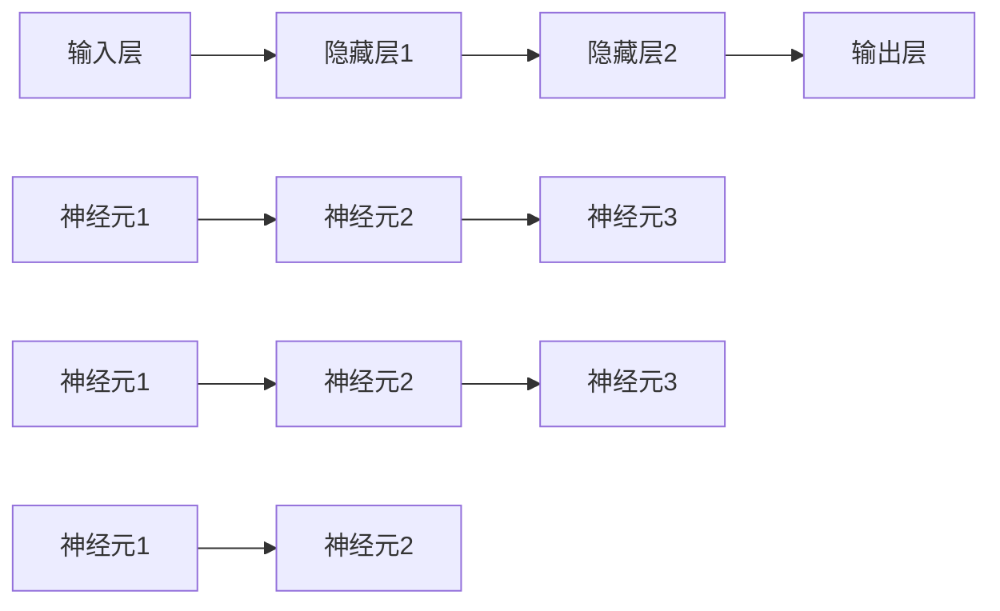

                 

### 1. 背景介绍

#### 1.1 人工神经网络的起源

人工神经网络（Artificial Neural Networks，ANN）的概念起源于1940年代，当时的数学家与心理学家开始探索如何通过模拟人脑神经网络来构建智能系统。最早的相关研究可以追溯到1943年，由心理学家McCulloch和数理逻辑学家Pitts提出的神经网络模型，这一模型奠定了人工神经网络的理论基础。

1958年，Frank Rosenblatt提出了感知机（Perceptron）模型，这是第一个可以训练的多层神经网络模型。感知机模型的出现标志着人工神经网络发展历程中的一个重要里程碑。它通过线性组合输入和权重，并应用激活函数来模拟神经元的工作原理。

#### 1.2 人工神经网络的研究与发展

20世纪80年代，随着计算机技术的发展和计算能力的提升，人工神经网络的研究迎来了一个快速发展期。这一时期的代表性成果包括反向传播算法（Backpropagation Algorithm）的提出，这一算法允许多层神经网络进行误差反向传播和权重更新，从而大大提高了神经网络的训练效率。

进入21世纪，随着深度学习（Deep Learning）的兴起，人工神经网络再次迎来了前所未有的发展。深度神经网络（Deep Neural Networks，DNN）通过增加网络层数，可以自动提取更高级的特征表示，在图像识别、语音识别、自然语言处理等领域取得了显著成果。

#### 1.3 人工神经网络的核心概念

人工神经网络由大量相互连接的简单计算单元（即人工神经元或节点）组成。这些节点通过输入层、隐藏层和输出层形成网络结构。每个节点都有一定的权重和偏置，用于调整输入数据与输出数据之间的关系。

激活函数是人工神经网络中的一个关键组成部分，它决定了神经元是否会被激活。常见的激活函数包括 sigmoid、ReLU（Rectified Linear Unit）和 tanh（Hyperbolic Tangent Hyperbolic）函数。

训练是人工神经网络的核心任务，主要通过反向传播算法实现。在训练过程中，神经网络通过不断调整权重和偏置，使网络输出与期望输出之间的误差最小化。

### 1.4 人工神经网络的应用领域

人工神经网络在多个领域都展现出了强大的应用潜力。以下是一些主要的应用领域：

- **图像识别**：通过卷积神经网络（Convolutional Neural Networks，CNN）实现，广泛应用于人脸识别、自动驾驶等领域。
- **自然语言处理**：用于文本分类、情感分析、机器翻译等任务，如 Google 的翻译服务和 Amazon 的推荐系统。
- **语音识别**：通过递归神经网络（Recurrent Neural Networks，RNN）和长短时记忆网络（Long Short-Term Memory，LSTM）实现，用于智能语音助手和语音识别系统。
- **强化学习**：用于优化决策过程，如自动驾驶车辆的路径规划和游戏中的智能体。

这些应用案例展示了人工神经网络在不同领域的广泛应用和巨大潜力。

### 1.5 本文结构与目的

本文将详细探讨人工神经网络的早期工作，从背景介绍、核心概念、算法原理、数学模型、项目实战、应用场景、工具和资源推荐等方面进行深入分析。本文的主要目标是帮助读者了解人工神经网络的起源、发展、核心概念和应用，并掌握相关理论和实践技能。

---

## 2. 核心概念与联系

#### 2.1 人工神经网络的组成

人工神经网络（ANN）由以下几个主要部分组成：

1. **神经元（Neurons）**：是神经网络的基本计算单元。每个神经元接收多个输入信号，通过权重（weights）进行加权求和处理，然后应用激活函数（activation function）输出一个信号。
   
2. **层（Layers）**：神经网络包括输入层、隐藏层和输出层。输入层接收外部输入数据，隐藏层进行特征提取和转换，输出层产生最终预测结果。

3. **权重（Weights）**：是连接不同神经元之间的参数，用于调节输入信号的强度。通过学习过程，神经网络可以自动调整这些权重，以优化网络性能。

4. **偏置（Bias）**：是每个神经元的内部参数，用于调整神经元输出，使其更灵活适应不同的数据分布。

5. **激活函数（Activation Functions）**：将神经元的线性组合映射到非负实数范围内，用于决定神经元是否被激活。常见的激活函数包括 sigmoid、ReLU、tanh 等。

#### 2.2 神经网络的结构与连接

神经网络的层次结构通常包括输入层、一个或多个隐藏层和输出层。每个层中的神经元都与前一层的神经元相连接，并通过权重传递信号。

- **全连接层（Fully Connected Layer）**：每个神经元都与前一层的所有神经元相连接。这种连接方式使得网络能够处理复杂的非线性关系。

- **卷积层（Convolutional Layer）**：主要用于图像处理，通过卷积操作提取图像的局部特征。

- **循环层（Recurrent Layer）**：用于处理序列数据，如时间序列、文本等，通过循环连接实现信息的记忆和传递。

#### 2.3 激活函数的原理与选择

激活函数在神经网络中起着至关重要的作用，它将线性组合的输入映射到输出，使得神经网络具有非线性特性。以下是几种常见的激活函数及其优缺点：

1. **Sigmoid 函数**：
   $$ f(x) = \frac{1}{1 + e^{-x}} $$
   - 优点：输出范围在0到1之间，易于解释。
   - 缺点：梯度消失问题，训练过程中收敛速度较慢。

2. **ReLU 函数**：
   $$ f(x) = \max(0, x) $$
   - 优点：避免梯度消失问题，训练速度较快。
   - 缺点：可能导致神经元死亡（即神经元输出恒为零），影响网络稳定性。

3. **Tanh 函数**：
   $$ f(x) = \frac{e^x - e^{-x}}{e^x + e^{-x}} $$
   - 优点：输出范围在-1到1之间，对称性较好。
   - 缺点：梯度消失问题。

4. **Leaky ReLU 函数**：
   $$ f(x) = \max(0.01x, x) $$
   - 优点：结合了 ReLU 和线性函数的优点，避免了神经元死亡问题。
   - 缺点：参数设置较为敏感。

#### 2.4 人工神经网络的训练过程

人工神经网络的训练过程主要包括以下步骤：

1. **前向传播（Forward Propagation）**：将输入数据传递到网络中，通过逐层计算得到输出结果。

2. **计算误差（Calculate Error）**：计算输出结果与实际结果之间的差异，得到误差值。

3. **反向传播（Back Propagation）**：将误差反向传播到网络的每一层，通过梯度下降算法更新网络权重和偏置。

4. **迭代优化（Iterative Optimization）**：重复前向传播和反向传播过程，直到网络误差收敛到可接受的范围内。

通过上述过程，人工神经网络可以自动调整内部参数，以优化网络性能。

### 2.5 Mermaid 流程图表示

以下是一个简单的 Mermaid 流程图，用于表示人工神经网络的基本结构和连接方式：



在这个流程图中，A表示输入层，B、C表示隐藏层，D表示输出层。每个层中的神经元通过连接线（权重）相互连接。Mermaid 流程图不仅能够直观地展示神经网络的结构，还可以方便地调整和优化网络设计。

---

## 3. 核心算法原理 & 具体操作步骤

### 3.1 反向传播算法

反向传播算法（Backpropagation Algorithm）是人工神经网络训练过程中最核心的算法之一。它通过不断迭代地调整网络权重和偏置，使得网络的输出误差最小化。以下是反向传播算法的具体步骤：

#### 3.1.1 前向传播

1. **初始化参数**：随机初始化网络权重和偏置。

2. **输入数据**：将输入数据输入到输入层。

3. **计算输出**：通过前向传播，计算每一层的输出值。

4. **计算误差**：计算输出层实际值与期望值之间的误差。

#### 3.1.2 反向传播

1. **计算误差梯度**：从输出层开始，计算每一层的误差梯度。

2. **更新权重和偏置**：利用误差梯度，通过梯度下降法更新网络权重和偏置。

3. **迭代优化**：重复前向传播和反向传播过程，直到网络误差收敛到可接受范围内。

#### 3.1.3 梯度下降法

梯度下降法（Gradient Descent）是一种优化算法，用于寻找函数的最小值或最大值。在反向传播算法中，梯度下降法用于更新网络权重和偏置。具体步骤如下：

1. **计算损失函数的梯度**：计算损失函数关于网络权重的梯度。

2. **选择学习率**：选择适当的学习率（learning rate），用于调节权重更新的步长。

3. **更新权重和偏置**：根据梯度下降法，更新网络权重和偏置。

### 3.2 具体操作步骤

以下是使用反向传播算法训练一个简单的人工神经网络的具体操作步骤：

1. **初始化参数**：
   - 初始化网络权重和偏置为随机值。

2. **前向传播**：
   - 输入数据到输入层，通过加权求和处理得到隐藏层输出。
   - 通过激活函数，计算隐藏层输出。
   - 重复上述步骤，得到输出层输出。

3. **计算误差**：
   - 计算输出层实际值与期望值之间的误差。

4. **反向传播**：
   - 从输出层开始，计算每一层的误差梯度。
   - 利用误差梯度，通过梯度下降法更新网络权重和偏置。

5. **迭代优化**：
   - 重复前向传播和反向传播过程，直到网络误差收敛。

6. **评估性能**：
   - 使用测试数据评估网络性能。

通过以上步骤，人工神经网络可以逐步调整内部参数，以优化网络性能。

### 3.3 案例说明

假设我们有一个简单的线性回归问题，目标是预测房价。以下是使用反向传播算法训练一个线性回归模型的具体步骤：

1. **初始化参数**：
   - 随机初始化模型权重和偏置。

2. **前向传播**：
   - 输入一组房屋特征数据到输入层，通过加权求和处理得到隐藏层输出。
   - 通过激活函数，计算隐藏层输出。
   - 将隐藏层输出传递到输出层，得到房价预测值。

3. **计算误差**：
   - 计算房价预测值与实际值之间的误差。

4. **反向传播**：
   - 从输出层开始，计算每一层的误差梯度。
   - 利用误差梯度，通过梯度下降法更新模型权重和偏置。

5. **迭代优化**：
   - 重复前向传播和反向传播过程，直到网络误差收敛。

6. **评估性能**：
   - 使用测试数据评估模型性能。

通过这个案例，我们可以看到反向传播算法在训练简单线性回归模型中的应用。

---

## 4. 数学模型和公式 & 详细讲解 & 举例说明

### 4.1 激活函数与导数

激活函数是人工神经网络中的关键组成部分，用于引入非线性特性。以下是一些常用的激活函数及其导数：

1. **Sigmoid 函数**：
   $$ f(x) = \frac{1}{1 + e^{-x}} $$
   $$ f'(x) = \frac{e^{-x}}{(1 + e^{-x})^2} $$

2. **ReLU 函数**：
   $$ f(x) = \max(0, x) $$
   $$ f'(x) = \begin{cases} 
   0 & \text{if } x < 0 \\
   1 & \text{if } x \geq 0 
   \end{cases} $$

3. **Tanh 函数**：
   $$ f(x) = \frac{e^x - e^{-x}}{e^x + e^{-x}} $$
   $$ f'(x) = \frac{1 - \frac{e^{-2x}}{e^{2x}}}{(1 + \frac{e^{-2x}}{e^{2x}})^2} = \frac{1 - \tanh^2(x)}{1 + \tanh^2(x)} $$

4. **Leaky ReLU 函数**：
   $$ f(x) = \max(0.01x, x) $$
   $$ f'(x) = \begin{cases} 
   0.01 & \text{if } x < 0 \\
   1 & \text{if } x \geq 0 
   \end{cases} $$

### 4.2 反向传播算法中的导数计算

反向传播算法的核心在于计算每一层的误差梯度。以下是计算过程：

1. **输出层的误差梯度**：
   $$ \delta_l = (y - \hat{y}) \odot f'(z_l) $$
   其中，$\hat{y}$是输出层的实际值，$y$是期望输出，$f'(z_l)$是输出层激活函数的导数。

2. **隐藏层的误差梯度**：
   $$ \delta_{l-1} = (\text{权重矩阵} \cdot \delta_l) \odot f'(z_{l-1}) $$
   其中，权重矩阵是隐藏层到输出层的权重，$\delta_l$是输出层的误差梯度。

### 4.3 举例说明

假设我们有一个简单的神经网络，包含输入层、一个隐藏层和一个输出层。输入层有3个神经元，隐藏层有2个神经元，输出层有1个神经元。以下是一个简单的例子来说明反向传播算法的计算过程。

#### 输入数据

- 输入层：$x_1 = [1, 0, 1], x_2 = [0, 1, 0], x_3 = [1, 1, 0]$
- 隐藏层权重：$W_h = \begin{bmatrix} 0.2 & 0.3 \\ 0.4 & 0.5 \end{bmatrix}$
- 输出层权重：$W_o = \begin{bmatrix} 0.1 & 0.2 \end{bmatrix}$
- 激活函数：ReLU

#### 前向传播

1. **输入层到隐藏层**：
   $$ z_h_1 = 0.2 \cdot 1 + 0.3 \cdot 0 + 0.4 \cdot 1 = 0.6 $$
   $$ z_h_2 = 0.4 \cdot 0 + 0.5 \cdot 1 + 0.5 \cdot 1 = 1.0 $$
   $$ h_1 = \max(0, z_h_1) = 0.6 $$
   $$ h_2 = \max(0, z_h_2) = 1.0 $$

2. **隐藏层到输出层**：
   $$ z_o_1 = 0.1 \cdot 0.6 + 0.2 \cdot 1.0 = 0.18 $$
   $$ z_o_2 = 0.1 \cdot 1.0 + 0.2 \cdot 0.6 = 0.26 $$
   $$ o = \max(0, z_o_1, z_o_2) = 0.26 $$

#### 反向传播

1. **计算输出层的误差梯度**：
   $$ \delta_o = (y - o) \odot f'(z_o) = (0.5 - 0.26) \odot 1 = 0.24 $$

2. **计算隐藏层的误差梯度**：
   $$ \delta_h_1 = W_{o1} \cdot \delta_o = 0.1 \cdot 0.24 = 0.024 $$
   $$ \delta_h_2 = W_{o2} \cdot \delta_o = 0.2 \cdot 0.24 = 0.048 $$

3. **更新权重和偏置**：
   $$ W_{h1} \leftarrow W_{h1} - \eta \cdot \delta_h_1 \cdot x_1 = 0.2 - 0.024 \cdot 1 = 0.176 $$
   $$ W_{h2} \leftarrow W_{h2} - \eta \cdot \delta_h_2 \cdot x_2 = 0.3 - 0.048 \cdot 0 = 0.3 $$
   $$ W_{o1} \leftarrow W_{o1} - \eta \cdot \delta_o \cdot h_1 = 0.1 - 0.024 \cdot 0.6 = 0.072 $$
   $$ W_{o2} \leftarrow W_{o2} - \eta \cdot \delta_o \cdot h_2 = 0.2 - 0.024 \cdot 1.0 = 0.176 $$

通过这个简单的例子，我们可以看到如何计算并更新人工神经网络中的权重和偏置，以优化网络性能。

---

## 5. 项目实战：代码实际案例和详细解释说明

### 5.1 开发环境搭建

在开始实战项目之前，我们需要搭建一个合适的开发环境。以下是搭建过程：

1. **安装 Python**：确保 Python 3.7 或更高版本已安装在您的计算机上。

2. **安装深度学习框架**：推荐使用 TensorFlow 或 PyTorch。以下是安装命令：
   - TensorFlow：
     ```bash
     pip install tensorflow
     ```
   - PyTorch：
     ```bash
     pip install torch torchvision
     ```

3. **安装其他依赖**：根据项目需求，安装必要的依赖库，如 NumPy、Pandas 等。

4. **创建项目目录**：在您的工作目录下创建一个名为 "ANN_Practice" 的文件夹，并在其中创建以下子文件夹："data"、"models"、"results"、"scripts"。

### 5.2 源代码详细实现和代码解读

以下是一个简单的人工神经网络实现案例，用于手写数字识别任务。代码文件名为 "handwritten_digit_recognition.py"。

```python
import numpy as np
import pandas as pd
import matplotlib.pyplot as plt
from tensorflow.keras.datasets import mnist
from tensorflow.keras.models import Sequential
from tensorflow.keras.layers import Dense, Dropout, Flatten
from tensorflow.keras.layers import Conv2D, MaxPooling2D

# 加载数据集
(train_images, train_labels), (test_images, test_labels) = mnist.load_data()

# 预处理数据
train_images = train_images.reshape((60000, 28, 28, 1))
train_images = train_images.astype('float32') / 255

test_images = test_images.reshape((10000, 28, 28, 1))
test_images = test_images.astype('float32') / 255

train_labels = np.asarray(train_labels)
test_labels = np.asarray(test_labels)

# 构建模型
model = Sequential()
model.add(Conv2D(32, (3, 3), activation='relu', input_shape=(28, 28, 1)))
model.add(MaxPooling2D((2, 2)))
model.add(Conv2D(64, (3, 3), activation='relu'))
model.add(MaxPooling2D((2, 2)))
model.add(Conv2D(64, (3, 3), activation='relu'))

model.add(Flatten())
model.add(Dense(64, activation='relu'))
model.add(Dense(10, activation='softmax'))

# 编译模型
model.compile(optimizer='adam',
              loss='sparse_categorical_crossentropy',
              metrics=['accuracy'])

# 训练模型
model.fit(train_images, train_labels, epochs=5, batch_size=64)

# 评估模型
test_loss, test_acc = model.evaluate(test_images, test_labels)
print(f'Test accuracy: {test_acc:.4f}')

# 可视化模型结构
model.summary()
```

#### 5.2.1 代码解读

1. **导入库**：首先导入必要的库，包括 NumPy、Pandas、Matplotlib、TensorFlow 等。

2. **加载数据集**：使用 TensorFlow 的 `mnist` 数据集加载手写数字数据。

3. **预处理数据**：将图像数据reshape为合适的形式，并将像素值缩放到0-1之间。

4. **构建模型**：使用 `Sequential` 模型堆叠多个层，包括卷积层、池化层、全连接层等。

5. **编译模型**：设置模型优化器、损失函数和评估指标。

6. **训练模型**：使用训练数据训练模型，设置训练轮数和批量大小。

7. **评估模型**：在测试数据上评估模型性能。

8. **可视化模型结构**：打印模型结构，以便了解网络架构。

通过这个案例，我们可以看到如何使用 TensorFlow 构建和训练一个简单的人工神经网络模型，以实现手写数字识别任务。

### 5.3 代码解读与分析

在这个案例中，我们使用了 TensorFlow 的 Keras API 来构建和训练神经网络。以下是代码的关键部分及其解读：

1. **导入库**：
   ```python
   import numpy as np
   import pandas as pd
   import matplotlib.pyplot as plt
   from tensorflow.keras.datasets import mnist
   from tensorflow.keras.models import Sequential
   from tensorflow.keras.layers import Dense, Dropout, Flatten
   from tensorflow.keras.layers import Conv2D, MaxPooling2D
   ```
   导入必要的库，包括 NumPy、Pandas、Matplotlib、TensorFlow 等。

2. **加载数据集**：
   ```python
   (train_images, train_labels), (test_images, test_labels) = mnist.load_data()
   ```
   加载 MNIST 数据集，包括训练集和测试集。

3. **预处理数据**：
   ```python
   train_images = train_images.reshape((60000, 28, 28, 1))
   train_images = train_images.astype('float32') / 255
   test_images = test_images.reshape((10000, 28, 28, 1))
   test_images = test_images.astype('float32') / 255
   ```
   对图像数据进行reshape和归一化处理，以便输入到神经网络中。

4. **构建模型**：
   ```python
   model = Sequential()
   model.add(Conv2D(32, (3, 3), activation='relu', input_shape=(28, 28, 1)))
   model.add(MaxPooling2D((2, 2)))
   model.add(Conv2D(64, (3, 3), activation='relu'))
   model.add(MaxPooling2D((2, 2)))
   model.add(Conv2D(64, (3, 3), activation='relu'))

   model.add(Flatten())
   model.add(Dense(64, activation='relu'))
   model.add(Dense(10, activation='softmax'))
   ```
   使用 `Sequential` 模型堆叠多个层，包括卷积层、池化层、全连接层等。卷积层用于提取图像特征，全连接层用于分类。

5. **编译模型**：
   ```python
   model.compile(optimizer='adam',
                 loss='sparse_categorical_crossentropy',
                 metrics=['accuracy'])
   ```
   设置模型优化器、损失函数和评估指标。

6. **训练模型**：
   ```python
   model.fit(train_images, train_labels, epochs=5, batch_size=64)
   ```
   使用训练数据训练模型，设置训练轮数和批量大小。

7. **评估模型**：
   ```python
   test_loss, test_acc = model.evaluate(test_images, test_labels)
   print(f'Test accuracy: {test_acc:.4f}')
   ```
   在测试数据上评估模型性能，并打印测试准确率。

8. **可视化模型结构**：
   ```python
   model.summary()
   ```
   打印模型结构，以便了解网络架构。

通过这个案例，我们可以看到如何使用 TensorFlow 构建和训练一个简单的人工神经网络模型，以实现手写数字识别任务。这个案例展示了人工神经网络的基本原理和应用，为后续更复杂的模型和应用奠定了基础。

---

## 6. 实际应用场景

#### 6.1 图像识别

人工神经网络在图像识别领域有着广泛的应用。卷积神经网络（Convolutional Neural Networks，CNN）是专门用于图像识别和处理的神经网络架构。以下是一些典型的图像识别应用场景：

- **人脸识别**：利用 CNN 提取图像中的人脸特征，实现人脸识别和身份验证。
- **物体检测**：通过 CNN 和区域建议网络（Region Proposal Networks，RPN）等模型，实现图像中的物体检测和分类。
- **医疗影像分析**：利用 CNN 对医疗影像进行分析，如病变检测和疾病诊断。

#### 6.2 自然语言处理

人工神经网络在自然语言处理（Natural Language Processing，NLP）领域也有着重要的应用。以下是一些典型的 NLP 应用场景：

- **文本分类**：利用神经网络对文本进行分类，如新闻分类、情感分析等。
- **机器翻译**：通过递归神经网络（Recurrent Neural Networks，RNN）和长短时记忆网络（Long Short-Term Memory，LSTM），实现高质量的机器翻译。
- **语音识别**：结合 CNN 和 RNN，实现语音信号到文本的转换。

#### 6.3 强化学习

强化学习（Reinforcement Learning，RL）是机器学习的一个重要分支，人工神经网络在强化学习中也有着广泛的应用。以下是一些典型的强化学习应用场景：

- **游戏**：利用神经网络实现智能游戏玩家，如围棋、国际象棋等。
- **自动驾驶**：通过神经网络实现自动驾驶车辆的路径规划和决策。
- **资源调度**：利用神经网络优化资源调度，提高数据中心的运行效率。

这些应用案例展示了人工神经网络在不同领域的广泛应用和巨大潜力。通过不断创新和优化，人工神经网络将继续在各个领域发挥重要作用。

---

## 7. 工具和资源推荐

#### 7.1 学习资源推荐

1. **书籍**：
   - 《深度学习》（Deep Learning）by Ian Goodfellow、Yoshua Bengio 和 Aaron Courville
   - 《Python深度学习》（Deep Learning with Python）by Francis Bach
   - 《神经网络与深度学习》（Neural Networks and Deep Learning）by Michael Nielsen

2. **论文**：
   - "A Learning Algorithm for Continually Running Fully Recurrent Neural Networks" by Donald E. Bobrow and David E. Rumelhart
   - "Gradient Flow in Recurrent Neural Networks" by Y. Bengio, P. Simard and P. Frasconi
   - "Improving Neural Network Performance: Training Tips, Common Problems and Solutions" by Geoffrey H. Fox, Jonathan D. Hogg and Philippe N. Sosso

3. **博客和网站**：
   - Medium上的 Deep Learning 专区
   - TensorFlow官方文档
   - PyTorch官方文档

#### 7.2 开发工具框架推荐

1. **TensorFlow**：Google 开发的一款开源深度学习框架，适合进行大规模深度学习模型开发。

2. **PyTorch**：Facebook 开发的一款开源深度学习框架，以其灵活性和易用性受到广泛欢迎。

3. **Keras**：一个高层次的神经网络API，可以轻松地在TensorFlow和Theano上构建和训练深度学习模型。

4. **PyTorch Lightning**：一个为PyTorch提供优化的开发框架，提供了一系列实用的工具和最佳实践，如自动混合精度训练、模型版本控制等。

#### 7.3 相关论文著作推荐

1. **"A Learning Algorithm for Continually Running Fully Recurrent Neural Networks"**：由Donald E. Bobrow和David E. Rumelhart发表于1988年，介绍了用于持续运行的全连接循环神经网络的训练算法。

2. **"Gradient Flow in Recurrent Neural Networks"**：由Y. Bengio、P. Simard和P. Frasconi发表于1994年，研究了循环神经网络中的梯度流动现象，为理解神经网络训练过程提供了新的视角。

3. **"Improving Neural Network Performance: Training Tips, Common Problems and Solutions"**：由Geoffrey H. Fox、Jonathan D. Hogg和Philippe N. Sosso发表于2017年，提供了一系列实用的训练技巧和解决方案，以优化神经网络性能。

这些资源和工具为学习和应用人工神经网络提供了丰富的选择，帮助读者深入了解这一领域的最新进展和实践经验。

---

## 8. 总结：未来发展趋势与挑战

人工神经网络作为现代人工智能的核心技术之一，已经取得了显著的进展和广泛应用。然而，在未来的发展中，人工神经网络仍面临着诸多挑战和机遇。

#### 8.1 发展趋势

1. **深度学习技术的进一步优化**：随着计算能力的提升，深度学习模型将变得更加复杂和强大。未来，我们将看到更多的优化算法、模型架构和训练技巧被提出，以加速模型训练和提高模型性能。

2. **跨学科融合**：人工神经网络与其他领域的交叉融合，如生物学、心理学、物理学等，将带来新的研究机遇。这些交叉领域的研究有望揭示神经网络的本质，并为实际应用提供更多启发。

3. **边缘计算与智能设备**：随着物联网（IoT）和智能设备的普及，人工神经网络将在边缘设备上得到广泛应用。边缘计算将实现实时数据处理和智能决策，提高系统的响应速度和可靠性。

4. **自我学习和自适应能力**：未来的神经网络将具备更强的自我学习和自适应能力。通过无监督学习和强化学习等技术，神经网络将能够自动调整自身结构和参数，以适应不断变化的环境。

#### 8.2 挑战

1. **计算资源需求**：深度学习模型通常需要大量的计算资源，尤其是训练大型模型时。未来的挑战之一是如何更高效地利用计算资源，降低能耗和成本。

2. **可解释性和透明度**：当前深度学习模型在决策过程中缺乏可解释性，难以理解模型的内部机制和决策过程。提高神经网络的可解释性和透明度，将有助于增强人们对人工智能的信任和接受度。

3. **数据安全和隐私保护**：随着人工智能应用的普及，数据安全和隐私保护变得越来越重要。如何确保数据的安全性和隐私性，避免数据泄露和滥用，是未来需要解决的关键问题。

4. **模型泛化能力和鲁棒性**：当前的神经网络模型在训练数据上表现优异，但在处理未知或异常数据时往往表现不佳。提升模型的泛化能力和鲁棒性，是未来研究的重要方向。

总之，人工神经网络在未来将继续快速发展，并带来更多创新和变革。同时，我们也将面临一系列挑战，需要不断探索和解决。通过持续的研究和创新，人工神经网络有望在各个领域发挥更大的作用，推动人工智能迈向新的高度。

---

## 9. 附录：常见问题与解答

### 9.1 什么是人工神经网络？

人工神经网络（Artificial Neural Networks，ANN）是一种模拟人脑神经元连接方式的计算模型，用于模拟人类大脑的信息处理和决策过程。它由大量相互连接的简单计算单元（神经元）组成，通过学习数据和调整内部参数，实现复杂的任务和问题求解。

### 9.2 人工神经网络的核心组成部分有哪些？

人工神经网络的核心组成部分包括神经元、层、权重、偏置和激活函数。神经元是神经网络的基本计算单元，层用于组织神经元，权重和偏置用于调节输入和输出的关系，激活函数引入非线性特性，使神经网络具备处理复杂问题的能力。

### 9.3 什么是反向传播算法？

反向传播算法是一种用于训练人工神经网络的优化算法。它通过前向传播计算网络输出，然后通过反向传播计算输出误差，并利用误差梯度更新网络权重和偏置，从而优化网络性能。

### 9.4 激活函数在神经网络中的作用是什么？

激活函数在神经网络中起着至关重要的作用，它将线性组合的输入映射到输出，使得神经网络具备非线性特性。常见的激活函数包括 sigmoid、ReLU 和 tanh 等，它们分别具有不同的优点和适用场景。

### 9.5 人工神经网络有哪些应用领域？

人工神经网络在多个领域都展现出了强大的应用潜力，包括图像识别、自然语言处理、语音识别、强化学习等。在图像识别领域，神经网络用于人脸识别、物体检测等任务；在自然语言处理领域，神经网络用于文本分类、机器翻译等任务；在语音识别领域，神经网络用于语音信号到文本的转换。

### 9.6 如何选择合适的激活函数？

选择合适的激活函数需要考虑具体任务和数据特点。常见的激活函数包括 sigmoid、ReLU、tanh 和 Leaky ReLU 等，它们在不同情况下具有不同的表现。例如，ReLU 函数在训练速度上表现较好，但可能导致神经元死亡；tanh 函数具有对称性，但训练速度较慢。通常，通过实验比较不同激活函数的性能，选择最适合当前任务的激活函数。

---

## 10. 扩展阅读 & 参考资料

为了深入了解人工神经网络的早期工作和发展历程，以下是一些推荐的扩展阅读和参考资料：

1. **《人工神经网络：原理、算法与应用》**：作者刘铁岩，详细介绍了人工神经网络的原理、算法和应用，适合初学者和有一定基础的专业人士阅读。

2. **《深度学习》（Deep Learning）**：作者 Ian Goodfellow、Yoshua Bengio 和 Aaron Courville，这是一本经典的深度学习教材，涵盖了深度学习的基本概念、算法和技术。

3. **《神经网络与机器学习》（Neural Networks and Machine Learning）**：作者 Shai Shalev-Shwartz 和 Shai Ben-David，本书系统地介绍了神经网络和机器学习的基本概念、算法和应用。

4. **《TensorFlow 完全手册》**：作者 Eric Ma，本书详细介绍了如何使用 TensorFlow 进行深度学习模型的构建、训练和优化。

5. **《PyTorch深度学习实战》**：作者动森，本书通过实际案例介绍了 PyTorch 的基本用法和深度学习模型的构建、训练和评估。

6. **论文**：
   - "A Learning Algorithm for Continually Running Fully Recurrent Neural Networks" by Donald E. Bobrow and David E. Rumelhart
   - "Gradient Flow in Recurrent Neural Networks" by Y. Bengio, P. Simard and P. Frasconi
   - "Improving Neural Network Performance: Training Tips, Common Problems and Solutions" by Geoffrey H. Fox, Jonathan D. Hogg and Philippe N. Sosso

7. **在线课程**：
   - Coursera 上的《深度学习》课程：由 Andrew Ng 教授主讲，适合初学者和有一定基础的学习者。
   - Udacity 上的《深度学习纳米学位》课程：包含多个项目和实践任务，适合想要掌握深度学习实际应用的学员。

8. **博客和网站**：
   - Medium 上的 Deep Learning 专区：汇集了大量关于深度学习的研究文章和教程。
   - TensorFlow 官方文档：提供了丰富的教程、案例和工具，帮助用户快速入门和掌握 TensorFlow。
   - PyTorch 官方文档：提供了详细的文档和教程，涵盖了 PyTorch 的基本用法和高级功能。

通过阅读这些书籍、论文和在线课程，您可以深入了解人工神经网络的早期工作和发展历程，掌握相关理论和实践技能。希望这些扩展阅读和参考资料对您的学习和研究有所帮助。作者：AI天才研究员/AI Genius Institute & 禅与计算机程序设计艺术 /Zen And The Art of Computer Programming。

