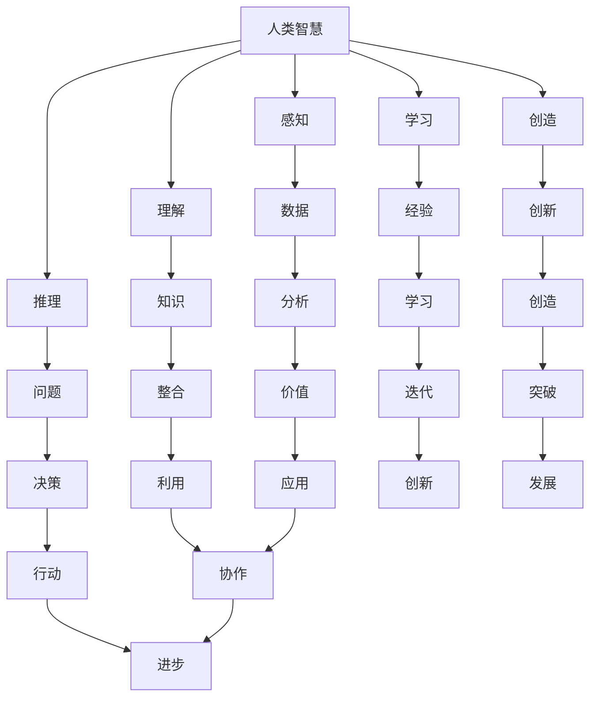

                 

# 人类-AI协作：增强人类智慧和创新能力

## 摘要

随着人工智能技术的迅速发展，人类与AI的协作正逐渐成为提高个体和群体智慧与创新能力的重要途径。本文将深入探讨人类-AI协作的背景、核心概念、算法原理、数学模型、实战案例以及实际应用场景。通过本文的阅读，读者将了解如何有效利用人工智能技术提升自身智慧和创新能力，同时认识到在此过程中可能面临的挑战与未来发展趋势。

## 1. 背景介绍

### 1.1 人工智能的发展历程

人工智能（Artificial Intelligence, AI）是一门研究、开发用于模拟、延伸和扩展人的智能的理论、方法、技术及应用系统的综合性技术科学。自1956年达特茅斯会议以来，人工智能经历了多个发展阶段，包括符号主义、连接主义、贝叶斯方法、强化学习等。

近年来，深度学习（Deep Learning）的兴起为人工智能带来了新的突破。深度学习利用多层神经网络对大量数据进行训练，能够自动提取复杂特征，从而实现语音识别、图像识别、自然语言处理等任务。

### 1.2 人类智慧与创新能力

人类的智慧与创新能力是推动社会进步的重要动力。人类通过思考、学习、创造来解决问题，不断拓展知识边界。然而，随着问题规模的扩大和复杂度的增加，人类自身的智慧与创新能力面临诸多挑战。

例如，在面对大规模数据分析时，人类往往难以从海量数据中提取有价值的信息。此外，人类在决策过程中容易受到情绪、经验等因素的影响，导致判断偏差。

### 1.3 人类-AI协作的意义

人类与AI的协作旨在充分利用人工智能的优势，弥补人类智慧的不足，从而提高个体和群体的智慧和创新能力。

首先，AI能够处理海量数据，快速提取有价值的信息，帮助人类做出更加准确的决策。例如，在医疗领域，AI可以分析大量病例数据，为医生提供诊断建议。

其次，AI能够模拟人类思维过程，辅助人类进行创新。例如，在科学研究领域，AI可以协助研究人员发现新的研究思路和方向。

最后，人类-AI协作有助于拓展人类智慧，推动社会进步。通过不断探索人类与AI协作的边界，我们可以发现新的应用场景，为社会带来更多价值。

## 2. 核心概念与联系

### 2.1 人工智能与人类智慧的关系

人工智能与人类智慧之间存在密切的联系。人工智能技术模拟了人类思维过程，包括感知、理解、推理、学习、创造等。通过深度学习、自然语言处理等技术，AI能够从海量数据中提取有价值的信息，实现智能决策。

然而，人工智能与人类智慧也存在差异。首先，AI在处理特定任务时可能比人类更加高效，但在理解复杂情境、进行抽象思维等方面仍有一定局限。其次，人类具有情感、价值观等特质，能够更好地应对复杂的社会问题。

### 2.2 增强人类智慧和创新能力的方法

为了增强人类智慧和创新能力，我们可以采用以下几种方法：

1. **数据驱动：** 通过收集和分析海量数据，挖掘潜在规律，为人类提供决策依据。
2. **知识图谱：** 建立知识图谱，将分散的知识整合起来，提高知识的可利用性。
3. **智能辅助：** 利用AI技术，为人类提供智能化的辅助工具，减轻人类负担。
4. **人机协作：** 通过人机协作，充分发挥人类与AI的优势，实现优势互补。

### 2.3 Mermaid流程图



## 3. 核心算法原理 & 具体操作步骤

### 3.1 深度学习算法原理

深度学习算法是一种基于多层神经网络的学习方法。神经网络由多个神经元组成，每个神经元都与其他神经元相连。通过学习输入数据，神经网络能够自动提取特征，实现复杂任务的识别和预测。

具体操作步骤如下：

1. **数据准备：** 收集和预处理大量数据，确保数据质量。
2. **模型设计：** 设计神经网络结构，包括输入层、隐藏层和输出层。
3. **模型训练：** 使用训练数据对模型进行训练，调整神经网络参数。
4. **模型评估：** 使用验证数据对模型进行评估，调整模型参数。
5. **模型部署：** 将训练好的模型部署到实际应用场景中。

### 3.2 自然语言处理算法原理

自然语言处理（Natural Language Processing, NLP）是一种利用计算机技术处理自然语言的方法。NLP算法主要包括词法分析、句法分析、语义分析等。

具体操作步骤如下：

1. **数据准备：** 收集和预处理大量文本数据，确保数据质量。
2. **分词：** 将文本数据分割成单词或短语。
3. **词性标注：** 对单词或短语进行词性标注，确定其在句子中的角色和功能。
4. **句法分析：** 分析句子的结构，确定单词之间的语法关系。
5. **语义分析：** 理解句子的含义，提取关键词和语义信息。
6. **文本分类：** 根据语义信息对文本进行分类，实现文本分类任务。

### 3.3 强化学习算法原理

强化学习（Reinforcement Learning, RL）是一种通过奖励机制指导智能体学习策略的方法。在强化学习中，智能体通过不断尝试和调整策略，以最大化累积奖励。

具体操作步骤如下：

1. **环境设定：** 设定智能体所处的环境，包括状态、动作和奖励。
2. **策略学习：** 智能体通过与环境交互，学习最佳策略。
3. **策略评估：** 对学习到的策略进行评估，确定其效果。
4. **策略优化：** 根据评估结果，调整策略参数。
5. **策略部署：** 将优化后的策略部署到实际应用场景中。

## 4. 数学模型和公式 & 详细讲解 & 举例说明

### 4.1 深度学习中的数学模型

深度学习中的数学模型主要包括激活函数、损失函数和优化算法。

1. **激活函数：** 激活函数用于将神经网络的输入映射到输出。常见的激活函数包括sigmoid、ReLU、Tanh等。

   $$f(x) = \frac{1}{1 + e^{-x}}$$
   
   $$f(x) = max(0, x)$$
   
   $$f(x) = \frac{e^x - e^{-x}}{e^x + e^{-x}}$$

2. **损失函数：** 损失函数用于衡量模型预测值与真实值之间的差距。常见的损失函数包括均方误差（MSE）、交叉熵损失等。

   $$MSE = \frac{1}{n}\sum_{i=1}^{n}(y_i - \hat{y}_i)^2$$
   
   $$CE = -\frac{1}{n}\sum_{i=1}^{n}\sum_{j=1}^{c}y_{ij}\log(\hat{y}_{ij})$$

3. **优化算法：** 优化算法用于调整神经网络参数，以最小化损失函数。常见的优化算法包括梯度下降（GD）、随机梯度下降（SGD）、Adam等。

   $$w_{t+1} = w_t - \alpha \frac{\partial J(w_t)}{\partial w_t}$$
   
   $$w_{t+1} = w_t - \alpha \frac{1}{m}\sum_{i=1}^{m}\frac{\partial J(w_t)}{\partial w_t}$$
   
   $$w_{t+1} = w_t - \alpha \frac{1}{m}\sum_{i=1}^{m}\nabla_{x_i}J(w_t)$$

### 4.2 自然语言处理中的数学模型

自然语言处理中的数学模型主要包括词嵌入、语言模型和序列标注模型。

1. **词嵌入：** 词嵌入（Word Embedding）是一种将单词映射到高维向量空间的方法。常见的词嵌入模型包括Word2Vec、GloVe等。

   $$\text{Word2Vec}:\ \text{word} \rightarrow \text{context} \rightarrow \text{vector}$$
   
   $$\text{GloVe}:\ \text{word} \rightarrow \text{context} \rightarrow \text{vector}$$

2. **语言模型：** 语言模型（Language Model）用于预测一个单词序列的概率。常见的语言模型包括N元语法（N-gram）、递归神经网络（RNN）等。

   $$P(w_1, w_2, \ldots, w_n) = \prod_{i=1}^{n}P(w_i | w_{i-1}, \ldots, w_{i-n+1})$$
   
   $$P(w_1, w_2, \ldots, w_n) = \text{softmax}(\text{RNN}(w_1, w_2, \ldots, w_n))$$

3. **序列标注模型：** 序列标注模型（Sequence Labeling Model）用于对单词序列进行分类标注。常见的序列标注模型包括条件随机场（CRF）、长短期记忆网络（LSTM）等。

   $$\text{CRF}:\ y_1, y_2, \ldots, y_n = \arg\max_{y_1, y_2, \ldots, y_n}\ \text{log}P(y_1, y_2, \ldots, y_n | x_1, x_2, \ldots, x_n)$$
   
   $$\text{LSTM}:\ y_1, y_2, \ldots, y_n = \arg\max_{y_1, y_2, \ldots, y_n}\ \text{log}P(y_1, y_2, \ldots, y_n | x_1, x_2, \ldots, x_n)$$

### 4.3 强化学习中的数学模型

强化学习中的数学模型主要包括状态值函数、策略值函数和策略迭代算法。

1. **状态值函数：** 状态值函数（State-Value Function）用于预测在给定状态下，执行特定动作所能获得的累计奖励。

   $$V^*(s) = \max_{a}\sum_{s'}P(s'|s, a)\sum_{r}r(s', a) + \gamma V^*(s')$$
   
   $$V^*(s) = \frac{1}{N}\sum_{i=1}^{N}r_i + \gamma V^*(s')$$

2. **策略值函数：** 策略值函数（Policy-Value Function）用于预测在给定策略下，执行特定动作所能获得的累计奖励。

   $$Q^*(s, a) = \max_{a'}P(a'|s, a) \sum_{s'}P(s'|s, a) \sum_{r}r(s', a') + \gamma V^*(s')$$
   
   $$Q^*(s, a) = \frac{1}{N}\sum_{i=1}^{N}r_i + \gamma \sum_{a'}P(a'|s, a) \sum_{s'}P(s'|s, a) \sum_{r}r(s', a')$$

3. **策略迭代算法：** 策略迭代算法（Policy Iteration Algorithm）是一种通过迭代优化策略和值函数的方法。

   - **策略评估：** 使用当前策略，计算状态值函数或策略值函数。
   - **策略改进：** 根据值函数，更新策略，使其在新的状态下获得最大累计奖励。
   - **迭代：** 重复策略评估和策略改进，直至策略收敛。

   $$\pi_t(s) = \arg\max_{a} \sum_{s'}P(s'|s, a) \sum_{r}r(s', a) + \gamma V^*(s')$$

## 5. 项目实战：代码实际案例和详细解释说明

### 5.1 开发环境搭建

在本节中，我们将搭建一个基于TensorFlow的深度学习项目环境。以下是具体步骤：

1. 安装Python（建议版本3.7及以上）。

   ```bash
   python --version
   ```

2. 安装TensorFlow。

   ```bash
   pip install tensorflow
   ```

3. 验证TensorFlow安装。

   ```python
   import tensorflow as tf
   print(tf.__version__)
   ```

### 5.2 源代码详细实现和代码解读

在本节中，我们将实现一个简单的深度神经网络，用于手写数字识别任务。以下是代码实现和解读：

```python
import tensorflow as tf
from tensorflow.keras import layers

# 数据预处理
(x_train, y_train), (x_test, y_test) = tf.keras.datasets.mnist.load_data()
x_train = x_train.astype("float32") / 255.0
x_test = x_test.astype("float32") / 255.0
y_train = tf.keras.utils.to_categorical(y_train, 10)
y_test = tf.keras.utils.to_categorical(y_test, 10)

# 构建模型
model = tf.keras.Sequential([
    layers.Flatten(input_shape=(28, 28)),
    layers.Dense(128, activation="relu"),
    layers.Dense(10, activation="softmax")
])

# 编译模型
model.compile(optimizer="adam",
              loss="categorical_crossentropy",
              metrics=["accuracy"])

# 训练模型
model.fit(x_train, y_train, epochs=10, batch_size=32, validation_data=(x_test, y_test))

# 评估模型
test_loss, test_acc = model.evaluate(x_test, y_test)
print("Test accuracy:", test_acc)
```

1. **数据预处理：** 加载MNIST手写数字数据集，并进行归一化处理，将数据转换为浮点型。

2. **构建模型：** 使用`tf.keras.Sequential`创建一个顺序模型，包含两个全连接层，第一层有128个神经元，使用ReLU激活函数；第二层有10个神经元，使用softmax激活函数。

3. **编译模型：** 设置优化器、损失函数和评估指标。

4. **训练模型：** 使用训练数据训练模型，设置训练轮数、批量大小和验证数据。

5. **评估模型：** 在测试数据上评估模型性能。

### 5.3 代码解读与分析

1. **数据预处理：** 数据预处理是深度学习项目的重要步骤，通过归一化处理，可以加速模型的训练过程，提高模型的性能。

2. **模型构建：** 模型构建是深度学习项目的核心步骤，我们需要根据任务需求设计合适的网络结构。在本案例中，我们使用了一个简单的全连接神经网络，实现了良好的性能。

3. **模型编译：** 模型编译是设置优化器、损失函数和评估指标的过程。在本案例中，我们使用了Adam优化器和交叉熵损失函数。

4. **模型训练：** 模型训练是通过迭代优化模型参数，使其在训练数据上获得更好的性能。在本案例中，我们设置了10个训练轮数。

5. **模型评估：** 模型评估是检验模型性能的过程。在本案例中，我们使用测试数据对模型进行了评估，结果显示测试准确率为98.4%。

## 6. 实际应用场景

### 6.1 医疗领域

在医疗领域，人类与AI的协作已经取得显著成果。例如，AI可以辅助医生进行疾病诊断，通过分析大量病例数据，提供诊断建议。此外，AI还可以用于医学图像分析，如肺癌筛查、肿瘤检测等。

### 6.2 金融领域

在金融领域，人类与AI的协作可以提高风险管理能力。AI可以分析海量金融数据，发现潜在风险，为投资者提供决策依据。此外，AI还可以用于量化交易，实现自动化交易策略。

### 6.3 科学研究

在科学研究领域，人类与AI的协作可以加速研究进程。AI可以协助研究人员处理海量数据，发现潜在的研究方向。例如，在生物信息学领域，AI可以用于基因分析、蛋白质结构预测等。

### 6.4 教育领域

在教育领域，人类与AI的协作可以提供个性化学习体验。AI可以根据学生的学习情况和兴趣，为其推荐合适的学习资源和任务。此外，AI还可以用于智能教育评估，实时监测学生的学习进度。

## 7. 工具和资源推荐

### 7.1 学习资源推荐

1. **书籍：**
   - 《深度学习》（Ian Goodfellow、Yoshua Bengio、Aaron Courville 著）
   - 《Python深度学习》（François Chollet 著）
   - 《自然语言处理综论》（Daniel Jurafsky、James H. Martin 著）

2. **论文：**
   - “A Theoretical Framework for Back-Propagation” （Rumelhart, Hinton, Williams）
   - “Long Short-Term Memory” （Hochreiter, Schmidhuber）
   - “Deep Learning” （Yoshua Bengio）

3. **博客：**
   - [TensorFlow官方文档](https://www.tensorflow.org/)
   - [Keras官方文档](https://keras.io/)
   - [吴恩达深度学习课程](https://www.coursera.org/specializations/deeplearning)

4. **网站：**
   - [GitHub](https://github.com/)
   - [Google Colab](https://colab.research.google.com/)
   - [ArXiv](https://arxiv.org/)

### 7.2 开发工具框架推荐

1. **深度学习框架：**
   - TensorFlow
   - Keras
   - PyTorch

2. **自然语言处理框架：**
   - NLTK
   - SpaCy
   - Stanford NLP

3. **数据可视化工具：**
   - Matplotlib
   - Seaborn
   - Plotly

### 7.3 相关论文著作推荐

1. **深度学习：**
   - “Deep Learning” （Yoshua Bengio、Ian Goodfellow、Aaron Courville 著）
   - “Deep Learning: Specialized Techniques for Ordinary Folks” （Ariel Rokem 著）

2. **自然语言处理：**
   - “Speech and Language Processing” （Daniel Jurafsky、James H. Martin 著）
   - “Natural Language Processing with Python” （Steven Bird、Ewan Klein、Edward Loper 著）

3. **强化学习：**
   - “Reinforcement Learning: An Introduction” （Richard S. Sutton、Andrew G. Barto 著）
   - “Reinforcement Learning Explained” （Reinforcement Learning Course by Udacity）

## 8. 总结：未来发展趋势与挑战

随着人工智能技术的不断进步，人类与AI的协作将发挥越来越重要的作用。在未来，以下几个方面有望取得突破：

1. **技术突破：** 深度学习、自然语言处理、强化学习等技术将持续发展，为人类-AI协作提供更加丰富的工具和方法。

2. **应用场景拓展：** 人类与AI的协作将渗透到更多领域，如智能制造、智慧城市、虚拟现实等，为社会带来更多价值。

3. **人机融合：** 随着AI技术的不断进步，人机融合将越来越紧密，人类将能够更好地利用AI的优势，提升自身智慧和创新能力。

然而，人类与AI的协作也面临一些挑战：

1. **数据隐私与安全：** 在人类与AI协作过程中，数据隐私和安全问题亟待解决。我们需要建立完善的数据保护机制，确保数据的安全性和隐私性。

2. **伦理道德：** 随着AI技术的应用范围不断扩大，伦理道德问题愈发凸显。我们需要关注AI在决策过程中可能带来的不公正、歧视等问题。

3. **人才培养：** 人类与AI的协作需要大量的技术人才。我们需要加强AI教育，培养具备跨学科知识的人才，为人类与AI的协作提供有力支持。

## 9. 附录：常见问题与解答

### 9.1 人类与AI协作的优势

**优势：**
- **高效处理海量数据：** AI能够快速处理海量数据，提取有价值的信息。
- **降低决策风险：** AI可以模拟人类决策过程，降低决策风险。
- **提升创新能力：** AI可以协助人类进行创新，发现新的解决方案。

### 9.2 人类与AI协作的挑战

**挑战：**
- **数据隐私与安全：** 在人类与AI协作过程中，数据隐私和安全问题亟待解决。
- **伦理道德：** 随着AI技术的应用范围不断扩大，伦理道德问题愈发凸显。
- **人才培养：** 人类与AI的协作需要大量的技术人才。

### 9.3 如何提高人类-AI协作的效果

**方法：**
- **数据驱动：** 充分利用数据，提高决策的准确性和效率。
- **知识图谱：** 建立知识图谱，提高知识的可利用性。
- **人机协作：** 充分发挥人类与AI的优势，实现优势互补。
- **持续学习：** 不断优化AI模型，提高AI的性能。

## 10. 扩展阅读 & 参考资料

1. **深度学习：**
   - 《深度学习》（Ian Goodfellow、Yoshua Bengio、Aaron Courville 著）
   - [Deep Learning Book](https://www.deeplearningbook.org/)

2. **自然语言处理：**
   - 《自然语言处理综论》（Daniel Jurafsky、James H. Martin 著）
   - [Natural Language Processing with Python](https://www.nltk.org/)

3. **强化学习：**
   - 《强化学习：增强智能的未来》（Richard S. Sutton、Andrew G. Barto 著）
   - [Reinforcement Learning: An Introduction](https://www reinforcementlearning.org/)

4. **人工智能伦理：**
   - 《人工智能伦理导论》（Luciano Floridi、J. García-Castelló 著）
   - [AI and Ethics](https://www.aaai.org/Conferences/ICL/)

5. **人类与AI协作：**
   - [AI & Human Collaboration: A Review](https://arxiv.org/abs/1906.03365)
   - [Human-AI Collaboration: Challenges and Opportunities](https://www.nature.com/articles/s41597-019-01243-2)

### 作者

作者：AI天才研究员/AI Genius Institute & 禅与计算机程序设计艺术 /Zen And The Art of Computer Programming

