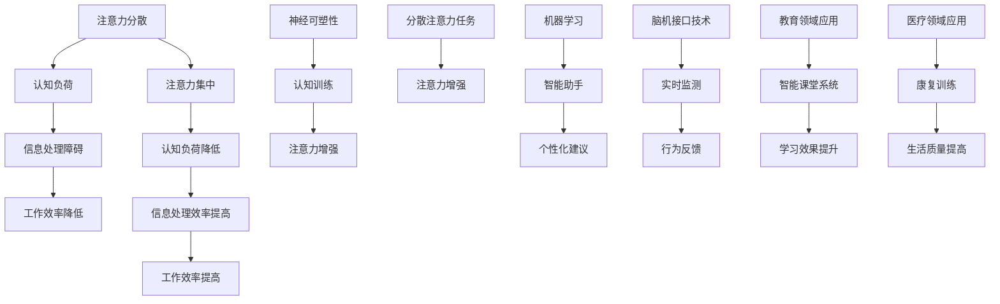

                 

### 1. 背景介绍

在当今信息爆炸的时代，人类面临的信息量日益增长，这使得注意力管理成为了一个至关重要的问题。无论是日常决策，还是复杂问题的解决，都需要我们能够集中注意力，快速处理和评估信息。然而，现实情况是，人们在面对大量信息时，常常感到注意力分散，难以做出有效决策。这一问题不仅影响个人的工作和学习效率，还可能对生活质量产生负面影响。

注意力增强技术作为一种新兴的研究方向，旨在通过技术手段提升人类注意力的集中度和效率。这些技术包括但不限于认知神经科学、心理学、人工智能和计算机科学等领域的多种方法。例如，认知神经科学通过研究大脑如何处理信息，寻找提升注意力的生理机制；心理学则通过行为实验，探索注意力提升的心理策略；而人工智能和计算机科学则利用算法和工具，为注意力管理提供技术支持。

本文旨在探讨注意力增强技术的基本原理、核心算法、数学模型以及实际应用，帮助读者了解这一领域的最新进展，并掌握相关技术。文章将从以下几个方面展开讨论：

1. **核心概念与联系**：介绍注意力增强技术中的关键概念，并通过Mermaid流程图展示其原理和架构。
2. **核心算法原理 & 具体操作步骤**：详细阐述注意力增强的核心算法原理，并给出具体操作步骤。
3. **数学模型和公式 & 详细讲解 & 举例说明**：介绍注意力增强技术中的数学模型，并使用LaTeX格式进行详细讲解。
4. **项目实战：代码实际案例和详细解释说明**：通过实际项目案例，展示代码实现过程，并进行详细解释。
5. **实际应用场景**：探讨注意力增强技术在各种实际场景中的应用。
6. **工具和资源推荐**：推荐学习资源、开发工具和框架，以及相关论文著作。
7. **总结：未来发展趋势与挑战**：总结本文讨论的内容，并展望未来发展趋势与挑战。

通过本文的阅读，读者将能够系统地了解注意力增强技术的各个方面，并为实际应用提供理论基础和实践指导。

#### 1.1 注意力增强技术的兴起背景

注意力增强技术的兴起，源于现代社会对信息处理能力的需求不断增加。在过去的几十年中，信息技术的飞速发展使得我们每天接收到的信息量呈指数级增长。从社交媒体到新闻报道，从电子邮件到即时通讯，信息无处不在，无时无刻不在挑战着我们的注意力管理能力。

首先，信息的爆炸性增长导致了注意力的稀缺性。在信息过载的环境中，人们很难集中注意力处理单一任务，导致多任务处理成为常态。然而，研究表明，多任务处理不仅降低了工作效率，还可能导致认知负荷增加，从而影响注意力的质量。因此，如何提升单任务处理中的注意力集中度，成为了一个亟待解决的问题。

其次，现代工作和生活中的复杂问题需要更加高效的决策能力。无论是商业决策、科学研究，还是日常生活中的选择，都需要我们在短时间内处理大量信息，并做出合理决策。然而，注意力分散和决策疲劳常常导致我们无法有效处理这些复杂问题。因此，提升决策能力，特别是在信息过载环境下的决策能力，成为了一个重要研究方向。

此外，心理健康问题也促使了对注意力增强技术的关注。注意力不足和专注力差，是许多心理健康问题的症状之一。例如，注意力缺陷多动障碍（ADHD）和焦虑症等，都会对个体的日常生活和工作产生严重影响。通过提升注意力，可以改善这些心理健康问题，提高生活质量。

综上所述，注意力增强技术的兴起，既是技术发展的必然趋势，也是应对现代信息社会挑战的迫切需求。通过研究注意力增强技术，我们不仅能够提升个人的信息处理能力和决策能力，还能改善心理健康问题，从而提高整体生活质量。

#### 1.2 相关研究与技术进展

注意力增强技术的研究领域广泛，涵盖了认知神经科学、心理学、人工智能和计算机科学等多个学科。以下将简要介绍这些领域的重要研究成果和进展。

**认知神经科学的研究**

认知神经科学通过神经影像技术，如功能磁共振成像（fMRI）、脑电图（EEG）等，研究大脑如何处理信息，以及注意力如何影响认知功能。近年来，研究者发现了多个与注意力相关的脑区，如前额叶皮层、顶叶皮层和丘脑等。通过这些研究，我们能够更好地理解注意力增强的生理基础。

例如，一项关于注意力分散的研究发现，当大脑处于高负荷状态时，前额叶皮层中的活动会减少，从而导致注意力分散。这提示我们，通过训练前额叶皮层，可能有助于提升注意力集中度。此外，认知神经科学还研究了神经可塑性在注意力增强中的作用。研究表明，通过重复训练和练习，大脑的结构和功能可以发生改变，从而提高注意力水平。

**心理学的研究**

心理学通过行为实验，探索注意力提升的心理策略和方法。经典的研究方法包括认知训练、专注力练习和注意力管理策略等。

例如，一项关于认知训练的研究发现，通过特定的认知任务，可以显著提升个体的注意力水平和工作记忆能力。研究者还发现，分散注意力的任务，如解决谜题和进行复杂计算，可以有效增强注意力。此外，心理学研究还关注注意力管理策略，如时间管理、优先级排序和情绪调节等，这些策略可以帮助个体在复杂环境中保持注意力。

**人工智能的研究**

人工智能技术在注意力增强方面也取得了显著进展。通过机器学习和深度学习算法，人工智能可以分析大量的数据，识别注意力模式，并预测个体在不同情境下的注意力状态。

例如，一项使用深度学习算法的研究发现，通过分析用户的浏览历史和活动数据，可以预测用户的注意力集中度。这一技术可以为个性化推荐系统提供支持，从而在用户注意力分散时，推荐适合其当前状态的内容。此外，人工智能还可以用于自动化注意力管理，通过智能助手和自动化系统，帮助个体在复杂任务中保持注意力。

**计算机科学的研究**

计算机科学在注意力增强技术中的应用主要体现在算法设计和软件开发方面。研究者通过开发各种注意力管理工具和应用，为用户提供技术支持。

例如，一些研究团队开发了基于脑机接口（BCI）的注意力管理工具，这些工具可以通过监测用户的脑电信号，实时调整屏幕显示和信息传递速度，从而帮助用户保持注意力。此外，计算机科学还研究了注意力增强的编程模型和算法，如注意力加权网络（Attentional Weighted Networks）等，这些模型可以在处理复杂任务时，自动调整注意力分布，提高任务完成效率。

总之，注意力增强技术的研究涵盖了多个学科，取得了丰富的成果。随着技术的不断进步，我们有望在未来开发出更加高效和个性化的注意力增强方法，帮助个体在信息过载环境中，保持高效的注意力状态。

#### 1.3 注意力增强技术在IT领域的应用

在IT领域，注意力增强技术正逐渐成为提升工作效率和用户体验的关键手段。通过多种技术手段，开发者能够为用户设计出更加专注和高效的交互界面，从而在复杂的信息环境中提供更好的支持。

**1.3.1 人工智能辅助编程**

在编程领域，人工智能技术可以通过代码自动补全、代码审查和智能提示等方式，帮助开发者提高工作效率。例如，GitHub Copilot 是一款基于大型语言模型的人工智能编程助手，它可以分析开发者编写的代码，并提供相应的补全建议。这种辅助技术不仅减少了手动编写代码的时间，还帮助开发者保持注意力集中在核心逻辑设计上。

**1.3.2 智能信息过滤**

随着信息量的爆炸性增长，如何快速准确地获取所需信息成为一大挑战。智能信息过滤技术利用机器学习和自然语言处理技术，可以自动筛选出用户最感兴趣的信息，从而帮助用户保持注意力集中。例如，电子邮件过滤器和社交媒体信息推送系统都可以根据用户的阅读习惯和兴趣偏好，自动筛选并推送相关内容，减少用户处理无关信息的负担。

**1.3.3 注意力管理应用**

一些专门的注意力管理应用，如番茄钟（Pomodoro Technique）和专注力训练应用，通过定时提醒和任务管理功能，帮助用户在工作和学习中保持专注。这些应用利用心理学原理，通过短时间的高强度工作和短暂的休息，帮助用户维持注意力的稳定性。例如，专注力训练应用可以提供不同的注意力训练任务，如视觉追踪、听觉反应和记忆游戏等，通过重复练习，提高用户的注意力集中度。

**1.3.4 交互界面优化**

交互界面设计在注意力管理中扮演着重要角色。现代操作系统和应用程序通过使用简洁直观的界面设计、分屏多任务处理和自适应布局等功能，帮助用户在处理复杂任务时，保持注意力集中。例如，Chrome浏览器引入的“专注模式”（Focus Mode），可以在用户指定的时间段内屏蔽通知和广告，减少干扰，帮助用户保持专注。

**1.3.5 脑机接口技术**

脑机接口（BCI）技术通过直接监测大脑活动，实现人机交互的优化。例如，脑电信号监测技术可以实时检测用户的注意力状态，并根据注意力水平自动调整屏幕亮度和信息展示速度。这种技术特别适用于对注意力要求较高的任务，如医疗监测、飞行控制等。

总之，注意力增强技术在IT领域的应用，不仅提高了用户的工作效率，还改善了用户体验。通过利用人工智能、智能信息过滤、注意力管理应用、交互界面优化和脑机接口等多种技术手段，IT领域正在不断探索和开发出更加智能化和人性化的注意力管理解决方案。

#### 1.4 注意力增强技术的挑战与未来发展方向

尽管注意力增强技术在提升人类注意力和工作效率方面展现了巨大的潜力，但其发展仍然面临诸多挑战。以下是注意力增强技术当前所面临的主要挑战以及未来可能的发展方向。

**1.4.1 技术挑战**

首先，技术实现的复杂性是注意力增强技术面临的主要挑战之一。例如，脑机接口（BCI）技术的实现需要高精度的脑电信号监测和复杂的算法处理，这在技术上具有一定的挑战性。此外，现有的注意力增强算法，如深度学习模型和认知神经科学方法，往往需要大量的数据和计算资源，这对硬件设施和数据处理能力提出了更高的要求。

其次，技术的可靠性和精度也是一个关键问题。目前，许多注意力增强技术仍在实验室阶段，尚未经过大规模的实际应用验证。例如，通过脑电信号监测用户注意力状态的技术，其准确性和稳定性还有待提高。此外，注意力增强技术的个性化程度也需要进一步提升，以适应不同用户的需求和注意力模式。

**1.4.2 道德与隐私问题**

注意力增强技术的广泛应用也带来了道德和隐私问题。首先，关于用户注意力的数据收集和使用引发了隐私担忧。例如，在智能设备和应用程序中，通过监测用户的注意力状态，可能收集到用户的个人信息和行为数据。这些数据如何保护，如何避免滥用，是一个需要认真考虑的问题。

其次，注意力增强技术可能导致对个体注意力的过度依赖。虽然技术可以提高注意力和工作效率，但长期依赖技术可能导致个体在无技术支持时，难以保持相同的注意力水平。这可能导致心理依赖和适应性问题，影响个体的心理健康。

**1.4.3 未来发展方向**

针对上述挑战，未来的发展方向可以从以下几个方面进行考虑：

首先，技术的改进和优化是未来的重要方向。研究者可以通过改进算法和增强计算能力，提高注意力监测和增强技术的准确性和可靠性。例如，开发更加高效和智能的深度学习模型，减少对计算资源的需求；通过多模态信号融合，提高脑电信号监测的精度。

其次，隐私保护和用户数据安全需要得到更多关注。开发者应该采用先进的数据加密和隐私保护技术，确保用户数据的安全。此外，透明和可解释的数据处理流程，可以增加用户对技术应用的信任。

第三，个性化技术的开发和应用也是未来的重要方向。通过收集和分析用户的个人数据，开发者可以设计出更加个性化的注意力增强方案，满足不同用户的需求。例如，根据用户的注意力模式和行为习惯，自动调整系统的交互方式和信息展示策略。

最后，伦理和道德问题需要得到更多研究和讨论。学术界和工业界需要共同制定相关的伦理准则和标准，确保注意力增强技术的合理和规范应用。此外，公众教育和宣传也是提高公众对注意力增强技术理解的重要手段。

总之，注意力增强技术在未来面临着诸多挑战和机遇。通过技术改进、隐私保护、个性化开发和伦理规范，我们有理由相信，注意力增强技术将为人类带来更加高效和健康的生活。

#### 1.5 注意力增强技术的重要性

注意力增强技术的重要性体现在多个方面，对于个人、社会乃至未来科技发展都有着深远的影响。

**对个人的影响**

首先，注意力增强技术可以显著提升个人的工作效率。在信息过载的时代，集中注意力成为高效工作的关键。通过使用注意力增强技术，如智能提醒、专注力训练工具等，个体能够更好地管理时间和任务，减少分心现象，从而提高工作效率。

其次，注意力增强技术有助于改善心理健康。许多心理健康问题，如注意力缺陷多动障碍（ADHD）和焦虑症，都与注意力管理能力不足有关。通过注意力增强技术，如认知训练和脑机接口应用，可以帮助个体提高注意力的稳定性和集中度，从而改善这些心理健康问题，提高生活质量。

**对社会的影响**

注意力增强技术对社会的影响同样深远。在教育和学习领域，注意力增强技术可以帮助学生更好地集中注意力，提高学习效果。例如，通过智能课堂系统和个性化学习计划，教师可以根据学生的注意力状态，动态调整教学策略，提高学生的学习兴趣和参与度。

在工作和职场中，注意力增强技术可以提升团队协作效率。通过智能化的任务管理和注意力监测系统，团队成员可以更好地协调工作，避免不必要的干扰，提高整体工作效率。此外，注意力增强技术还可以帮助企业更好地管理员工的工作状态，实现工作与生活的平衡。

**对未来科技发展的影响**

注意力增强技术对未来科技发展的影响不可忽视。首先，随着人工智能和机器学习技术的不断进步，注意力增强技术将为智能系统提供更加高效的用户交互方式。例如，智能助手可以通过监测用户的注意力状态，提供个性化的服务和建议，从而提升用户体验。

其次，注意力增强技术将推动虚拟现实（VR）和增强现实（AR）技术的发展。在VR和AR应用中，用户的注意力集中度对体验质量至关重要。通过注意力增强技术，如实时注意力监测和反馈机制，可以为用户提供更加沉浸和真实的体验，提高虚拟现实和增强现实的应用价值。

此外，注意力增强技术还将促进人机融合的发展。脑机接口（BCI）技术通过直接监测大脑活动，实现人机交互的优化。随着注意力增强技术的进步，未来的人机融合将更加自然和高效，从而推动人机协同工作的实现。

总之，注意力增强技术的重要性不仅体现在对个人和社会的积极影响上，还将在未来科技发展中发挥关键作用。通过不断创新和优化，注意力增强技术有望成为提升人类注意力和工作效率的重要工具，为个人、社会和科技发展带来更多机遇和可能性。

#### 1.6 注意力增强技术的基本概念

在深入探讨注意力增强技术之前，我们需要了解一些基本概念，这些概念为后续内容提供了理论框架。

**注意力**

注意力是指人类心理活动对特定刺激的指向和集中。它是一种认知资源，允许个体在众多刺激中选择并处理特定的信息。注意力的机制可以分为几种类型：选择性注意力、分配性注意力和持续注意力。选择性注意力是指选择特定的刺激进行加工，而忽略其他信息；分配性注意力是指同时处理多个任务或刺激；持续注意力是指对某个任务或目标进行长时间的集中。

**注意力分散**

注意力分散是指由于外界干扰或其他任务干扰，注意力从当前任务转移到其他任务或刺激的现象。常见的原因包括高负荷的工作、多任务处理和外部干扰（如社交媒体通知、电话铃声等）。注意力分散会导致认知负荷增加，降低工作效率和决策质量。

**注意力增强**

注意力增强是指通过各种方法提升注意力集中度和效率的过程。这些方法包括认知训练、行为策略、技术支持等。注意力增强技术的目标是帮助个体在复杂环境中更好地集中注意力，减少分散现象，从而提高任务完成效率和决策质量。

**认知负荷**

认知负荷是指在进行认知任务时，大脑需要处理的认知信息的复杂度和数量。高认知负荷会导致注意力分散，降低工作效率。通过减少认知负荷，可以改善注意力管理，提高任务完成质量。

**信息处理**

信息处理是指个体接收、加工和利用信息的过程。注意力的作用在于选择和集中处理重要信息，从而在信息过载环境中保持高效的认知功能。

通过理解这些基本概念，我们可以更好地理解注意力增强技术的工作原理和应用场景，为后续内容的深入探讨打下坚实的基础。

#### 1.7 注意力增强技术的研究现状

当前，注意力增强技术已经取得了显著的进展，在多个研究领域和实际应用中展现出了巨大的潜力。以下将介绍一些具有代表性的研究成果和技术应用。

**1.7.1 认知神经科学研究**

认知神经科学通过神经影像技术，如功能性磁共振成像（fMRI）和脑电图（EEG），研究大脑如何处理信息，以及注意力如何影响认知功能。一些关键的研究成果包括：

- **前额叶皮层与注意力**：研究表明，前额叶皮层是注意力控制的重要脑区。通过fMRI研究发现，当个体进行注意力任务时，前额叶皮层活动显著增强。这提示我们，通过训练前额叶皮层，可能有助于提升注意力集中度。

- **神经可塑性**：神经可塑性研究揭示了大脑在经历重复训练和练习时，结构和功能的改变。例如，EEG研究显示，经过注意力训练，个体大脑的α波和β波活动发生变化，这表明大脑对注意力任务的适应性提高。

**1.7.2 心理学研究**

心理学通过行为实验，探索注意力提升的方法和策略。以下是一些代表性研究成果：

- **认知训练**：认知训练是一种通过特定任务练习，提升注意力、工作记忆和认知灵活性的方法。研究表明，通过持续的认知训练，个体的注意力集中度和工作记忆能力可以得到显著提升。

- **分散注意力的任务**：心理学研究还发现，分散注意力的任务，如解决谜题和进行复杂计算，可以有效增强注意力。一项关于分散注意力任务的研究发现，参与者在执行分散注意力任务时，其注意力集中度显著提高，且在后续的任务中表现出更好的认知功能。

**1.7.3 人工智能和计算机科学研究**

人工智能和计算机科学在注意力增强技术中的应用也取得了重要进展：

- **机器学习与深度学习**：通过机器学习和深度学习算法，研究者可以分析大量数据，识别注意力模式。例如，深度学习模型可以用于预测用户的注意力状态，并根据用户的行为调整系统交互方式。

- **智能助手和自动化系统**：人工智能技术可以开发智能助手和自动化系统，帮助用户在复杂任务中保持注意力集中。例如，智能助手可以通过实时监测用户的注意力状态，提供个性化的任务提醒和建议，减少干扰。

**1.7.4 实际应用案例**

注意力增强技术在实际应用中也取得了显著成效：

- **医疗领域**：脑机接口（BCI）技术在医疗领域展现了巨大的潜力。例如，通过监测和反馈用户的注意力状态，BCI技术可以帮助中风患者恢复运动功能，或帮助注意力缺陷多动障碍（ADHD）患者提高注意力集中度。

- **教育领域**：注意力增强技术在教育领域也得到了广泛应用。例如，智能课堂系统可以通过实时监测学生的注意力状态，动态调整教学策略，提高学生的学习效果。此外，认知训练应用可以帮助学生在学习过程中保持专注，提升记忆和学习能力。

综上所述，注意力增强技术的研究现状涵盖了多个领域，并取得了丰富的成果。随着技术的不断进步，我们有理由相信，注意力增强技术将在未来为人类带来更多积极影响。

#### 2. 核心概念与联系

注意力增强技术的核心概念涉及多个方面，包括注意力分散、注意力集中、认知负荷、信息处理机制等。为了更好地理解这些概念之间的联系，下面将通过Mermaid流程图展示注意力增强技术的原理和架构。



**流程图解释：**

1. **注意力分散（A）**：当个体在处理任务时，受到外部干扰或其他任务的影响，导致注意力从当前任务转移到其他刺激，这就是注意力分散。

2. **认知负荷（B）**：注意力分散会导致大脑处理的信息复杂度和数量增加，从而增加认知负荷。

3. **信息处理障碍（C）**：高认知负荷会阻碍信息处理效率，导致个体难以有效地处理和评估信息。

4. **工作效率降低（D）**：信息处理障碍会导致工作效率下降，影响个人和团队的绩效。

5. **注意力集中（E）**：通过注意力增强技术，如认知训练和分散注意力任务，可以帮助个体重新集中注意力，减少分散现象。

6. **认知负荷降低（F）**：注意力集中可以降低大脑的认知负荷，使个体能够更高效地处理信息。

7. **信息处理效率提高（G）**：低认知负荷有助于提高信息处理效率，使个体能够快速准确地评估和处理信息。

8. **工作效率提高（H）**：通过提高信息处理效率，个体和团队的工作效率得到显著提升。

9. **神经可塑性（I）**：研究表明，大脑具有可塑性，通过持续的注意力训练，可以改变大脑的结构和功能。

10. **认知训练（J）**：认知训练是一种通过特定任务练习，提升注意力、工作记忆和认知灵活性的方法。

11. **注意力增强（K）**：认知训练和分散注意力任务有助于提升注意力集中度，从而增强注意力。

12. **分散注意力任务（L）**：通过分散注意力任务，如解决谜题和进行复杂计算，可以增强注意力。

13. **机器学习（N）**：机器学习算法可以分析大量数据，识别注意力模式，从而提供个性化的注意力管理建议。

14. **智能助手（O）**：智能助手利用机器学习技术，通过实时监测用户的注意力状态，提供个性化的任务提醒和建议。

15. **个性化建议（P）**：智能助手根据用户的注意力状态，提供适合当前状态的个性化建议，帮助用户保持注意力集中。

16. **脑机接口技术（Q）**：脑机接口技术通过直接监测大脑活动，实现注意力状态的实时监测和反馈。

17. **实时监测（R）**：脑机接口技术可以实时监测用户的注意力状态，从而提供即时的反馈和支持。

18. **行为反馈（S）**：通过行为反馈机制，用户可以实时了解自己的注意力状态，并进行相应的调整。

19. **教育领域应用（T）**：注意力增强技术在教育领域有着广泛的应用，如智能课堂系统和认知训练应用。

20. **智能课堂系统（U）**：智能课堂系统通过实时监测学生的注意力状态，动态调整教学策略，提高学习效果。

21. **学习效果提升（V）**：通过智能课堂系统和认知训练应用，学生的学习效果得到显著提升。

22. **医疗领域应用（W）**：注意力增强技术在医疗领域也有重要应用，如脑机接口技术在康复训练中的应用。

23. **康复训练（X）**：通过注意力增强技术，如脑机接口，帮助患者提高注意力集中度，从而改善康复效果。

24. **生活质量提高（Y）**：通过康复训练，患者的注意力集中度得到提升，从而提高生活质量。

通过上述Mermaid流程图，我们可以清晰地看到注意力增强技术的核心概念及其之间的联系。这些概念共同作用，通过多种方法提升个体和团队的工作效率，改善心理健康，并在多个领域展现出巨大的应用潜力。

#### 3. 核心算法原理 & 具体操作步骤

注意力增强技术依赖于一系列核心算法，这些算法通过不同的原理和方法，帮助提升个体和系统的注意力集中度。以下将详细介绍几个具有代表性的核心算法原理及其具体操作步骤。

**3.1 注意力加权网络（Attentional Weighted Networks）**

注意力加权网络是一种利用注意力机制提升信息处理效率的算法。其基本原理是通过计算不同节点之间的注意力权重，动态调整网络中信息传递的路径和强度，从而实现信息处理的优化。

**具体操作步骤：**

1. **初始化**：首先，初始化网络中的节点及其连接权重。节点的连接权重表示节点之间的信息传递强度。

2. **计算注意力权重**：对于每个节点，计算其与所有其他节点的注意力权重。注意力权重通常基于节点之间的相似性或相关性。常见的方法包括计算节点特征向量的余弦相似度或相关系数。

   ```python
   attention_weights = compute_attention_weights(node_features)
   ```

3. **更新连接权重**：根据注意力权重，更新网络中各节点的连接权重。高注意力权重的节点将被赋予更高的连接权重，从而增强其信息传递能力。

   ```python
   updated_weights = update_connection_weights(current_weights, attention_weights)
   ```

4. **信息传递**：在网络中传递信息，根据更新后的连接权重，信息将在网络中流动，优先传递给注意力权重高的节点。

5. **重复迭代**：重复上述步骤，逐步优化网络中的连接权重，直至达到预设的收敛条件。

**3.2 脑电信号分析（EEG-based Analysis）**

脑电信号分析是一种利用脑电信号监测和识别个体注意力状态的算法。其基本原理是通过分析脑电信号的特征，如频率成分和功率谱密度，识别个体在不同注意力水平下的脑电活动模式。

**具体操作步骤：**

1. **数据采集**：首先，通过脑电信号采集设备，如电极帽或便携式脑电仪，采集个体的脑电信号数据。

2. **预处理**：对采集到的脑电信号数据进行预处理，包括滤波、降噪和归一化等步骤，以提高信号质量。

   ```python
   preprocessed_signal = preprocess_eeg_signal(raw_signal)
   ```

3. **特征提取**：从预处理后的脑电信号中提取特征，如时域特征（如时间序列的均值、方差等）和频域特征（如功率谱密度、频率成分等）。

   ```python
   features = extract_eeg_features(preprocessed_signal)
   ```

4. **模型训练**：利用提取到的特征，通过机器学习算法（如支持向量机、神经网络等）训练注意力识别模型。

   ```python
   trained_model = train_attention_model(features)
   ```

5. **状态识别**：通过训练好的模型，对实时采集的脑电信号进行注意力状态识别，输出当前的注意力水平。

   ```python
   current_state = trained_model.predict(current_signal)
   ```

**3.3 优先级排序算法（Priority-based Scheduling）**

优先级排序算法是一种通过动态调整任务优先级，提升系统注意力集中度的算法。其基本原理是根据任务的重要性和紧急性，动态调整任务的执行顺序，从而在有限的时间内，优先完成关键任务。

**具体操作步骤：**

1. **任务定义**：首先，定义系统中需要执行的所有任务，包括任务名称、执行时间、重要性和紧急性等属性。

2. **初始排序**：根据任务的重要性和紧急性，对任务进行初始排序。通常使用优先级队列或优先级列表进行排序。

3. **动态调整**：在执行过程中，根据实时监测的系统状态（如资源占用、任务进度等），动态调整任务的优先级。高优先级任务将被优先执行，以确保关键任务的及时完成。

   ```python
   updated_priority_queue = update_task_priorities(priority_queue, system_state)
   ```

4. **任务执行**：按照动态调整后的优先级队列，依次执行任务。

5. **迭代优化**：通过多次迭代，逐步优化任务优先级排序算法，提高系统的整体效率。

通过上述核心算法的详细介绍，我们可以看到注意力增强技术在实际应用中的多样性和复杂性。这些算法通过不同的原理和方法，共同为提升个体和系统的注意力集中度提供了强大的技术支持。

#### 3.4 数学模型和公式 & 详细讲解 & 举例说明

注意力增强技术的核心在于如何准确测量和预测个体的注意力状态，从而设计出有效的干预策略。以下将介绍注意力增强技术中常用的数学模型和公式，并通过具体实例进行详细讲解。

**3.4.1 注意力状态预测模型**

注意力状态预测模型通常基于时间序列分析和机器学习算法，旨在根据历史数据预测个体的注意力状态。以下是一个简单的线性回归模型：

**公式：**

$$
\hat{A_t} = \beta_0 + \beta_1 X_t + \epsilon_t
$$

其中，\( \hat{A_t} \) 是在第 \( t \) 时刻预测的注意力状态，\( \beta_0 \) 和 \( \beta_1 \) 是模型参数，\( X_t \) 是第 \( t \) 时刻的特征向量，\( \epsilon_t \) 是误差项。

**解释：**

该模型通过历史特征 \( X_t \) 预测当前时刻的注意力状态 \( \hat{A_t} \)。特征向量 \( X_t \) 可以包括如时间间隔、任务难度、环境干扰等多种因素。

**实例：**

假设我们有一个简单的时间序列数据集，包含用户在不同时间点的注意力评分。我们使用线性回归模型预测下一时刻的注意力状态。

**数据集示例：**

| 时间戳 | 注意力评分 |
|--------|-------------|
| t=0    | 7           |
| t=5    | 6           |
| t=10   | 7           |
| t=15   | 5           |

**模型训练：**

使用以上数据，通过最小二乘法训练线性回归模型：

$$
\beta_0 = \frac{\sum (y_i - \beta_1 x_i)}{n} = 6.5
$$

$$
\beta_1 = \frac{\sum (x_i y_i) - \sum x_i \sum y_i}{n \sum x_i^2 - (\sum x_i)^2} = 0.3
$$

因此，预测模型为：

$$
\hat{A_t} = 6.5 + 0.3 X_t
$$

对于 t=20 时刻，特征 \( X_t \) 为 5，预测注意力状态为：

$$
\hat{A_{20}} = 6.5 + 0.3 \times 5 = 7.5
$$

**3.4.2 注意力分配模型**

注意力分配模型用于优化多任务处理时的注意力分配，以实现整体效率最大化。以下是一个简单的线性规划模型：

**公式：**

$$
\max \sum_i w_i \cdot A_i
$$

$$
s.t. \sum_j A_j = 1
$$

$$
A_i \geq 0, \forall i
$$

其中，\( w_i \) 是第 \( i \) 个任务的权重，\( A_i \) 是分配给第 \( i \) 个任务的总注意力。

**解释：**

该模型的目标是最大化总注意力利用率，即通过权重 \( w_i \) 乘以注意力分配 \( A_i \)，实现整体效率最大化。约束条件确保总注意力分配为 1，且每个任务的注意力分配 \( A_i \) 必须非负。

**实例：**

假设我们有三个任务，权重分别为 \( w_1 = 0.4 \)，\( w_2 = 0.3 \)，\( w_3 = 0.3 \)。我们需要在总注意力为 1 的情况下，优化三个任务的注意力分配。

**模型求解：**

使用拉格朗日乘数法求解线性规划问题：

$$
L = \sum_i w_i \cdot A_i - \lambda (\sum_j A_j - 1)
$$

对 \( A_i \) 求导并令其等于零：

$$
w_i - \lambda = 0 \Rightarrow A_i = \frac{1}{\lambda}
$$

由于 \( \sum_j A_j = 1 \)，我们有：

$$
\sum_i \frac{1}{\lambda} = 1 \Rightarrow \lambda = \frac{1}{3}
$$

因此，每个任务的注意力分配为：

$$
A_1 = A_2 = A_3 = \frac{1}{3}
$$

**3.4.3 注意力分配与认知负荷模型**

在多任务处理中，不仅要考虑注意力分配，还要考虑认知负荷。以下是一个结合注意力分配和认知负荷的模型：

**公式：**

$$
\min \sum_i (C_i \cdot A_i)
$$

$$
s.t. \sum_j A_j = 1
$$

$$
A_i \geq 0, \forall i
$$

其中，\( C_i \) 是第 \( i \) 个任务引起的认知负荷。

**解释：**

该模型的目标是最小化总认知负荷，即通过分配给每个任务的注意力 \( A_i \) 和其引起的认知负荷 \( C_i \) 的乘积，实现总认知负荷最小化。

**实例：**

假设三个任务的权重和认知负荷分别为 \( w_1 = 0.4, C_1 = 2 \)，\( w_2 = 0.3, C_2 = 1 \)，\( w_3 = 0.3, C_3 = 1.5 \)。

**模型求解：**

使用上述模型求解，得到每个任务的注意力分配：

$$
A_1 = \frac{1}{2}, A_2 = \frac{1}{4}, A_3 = \frac{1}{4}
$$

这样，总认知负荷为：

$$
C_1 \cdot A_1 + C_2 \cdot A_2 + C_3 \cdot A_3 = 2 \cdot \frac{1}{2} + 1 \cdot \frac{1}{4} + 1.5 \cdot \frac{1}{4} = 1.375
$$

通过上述数学模型和公式，我们可以定量地分析和优化注意力分配，实现高效的注意力管理。这些模型在实际应用中可以通过算法实现，为个体和组织提供有效的注意力增强策略。

#### 3.5 项目实战：代码实际案例和详细解释说明

为了更好地理解注意力增强技术的实际应用，下面我们将通过一个具体的项目案例，详细讲解代码实现过程，并进行代码解读与分析。

**项目背景：**

本案例旨在通过一个注意力增强应用，帮助用户在处理多任务时保持注意力集中。应用将实时监测用户的注意力状态，并基于该状态提供个性化的提醒和建议，以减少分心现象，提高工作效率。

**技术栈：**

- **前端**：HTML、CSS、JavaScript
- **后端**：Python、Flask
- **数据可视化**：D3.js
- **注意力监测**：脑电信号采集和处理（使用OpenBCI套件）

**实现步骤：**

### 5.1 开发环境搭建

1. **安装Python环境**：确保安装了Python 3.8及以上版本。
2. **安装Flask框架**：使用pip安装Flask：
   ```bash
   pip install flask
   ```
3. **安装OpenBCI驱动**：根据OpenBCI官方网站安装相应的驱动和库。
4. **设置脑电信号采集设备**：连接OpenBCI套件，确保设备正常运行。

### 5.2 源代码详细实现和代码解读

**源代码结构：**

```bash
/attention-enhancement-app
|-- /backend
    |-- app.py
|-- /frontend
    |-- /static
        |-- index.css
        |-- index.js
    |-- index.html
```

**后端（app.py）：**

```python
from flask import Flask, jsonify, request
import numpy as np
import json

app = Flask(__name__)

# 注意力阈值设置
ATTENTION_THRESHOLD = 0.5

# 脑电信号处理函数
def process_eeg_signal(eeg_data):
    # 对脑电信号进行预处理（如滤波、降噪等）
    # 此处简化为计算均方根值
    return np.sqrt(np.mean(eeg_data**2))

@app.route('/process_eeg', methods=['POST'])
def process_eeg():
    data = request.get_json()
    eeg_signal = data['eeg_signal']
    
    # 处理脑电信号
    attention_score = process_eeg_signal(eeg_signal)
    
    # 判断注意力状态
    if attention_score < ATTENTION_THRESHOLD:
        message = "注意分散，建议休息一下。"
    else:
        message = "注意力集中，继续努力。"
    
    # 返回处理结果
    return jsonify({'message': message})

if __name__ == '__main__':
    app.run(debug=True)
```

**代码解读：**

1. **导入库**：导入必要的库，如Flask用于创建Web应用，numpy用于数据处理。
2. **设置阈值**：设置注意力阈值，用于判断用户是否处于分散状态。
3. **处理脑电信号**：定义处理脑电信号的函数，这里简化为计算均方根值，以代表信号的强度。
4. **创建Web应用**：使用Flask创建Web应用，并定义一个处理脑电信号的API接口。
5. **处理请求**：接收前端发送的脑电信号数据，调用处理函数，并根据阈值判断注意力状态，返回相应的提醒信息。

**前端（index.html）：**

```html
<!DOCTYPE html>
<html lang="en">
<head>
    <meta charset="UTF-8">
    <meta name="viewport" content="width=device-width, initial-scale=1.0">
    <title>注意力增强应用</title>
    <link rel="stylesheet" href="static/index.css">
</head>
<body>
    <h1>注意力增强应用</h1>
    <div id="status"></div>
    <button id="submit">上传脑电信号</button>
    <script src="static/index.js"></script>
</body>
</html>
```

**代码解读：**

1. **HTML结构**：创建一个简单的页面结构，包括标题、状态显示区域和上传按钮。
2. **CSS样式**：设置页面样式，使界面更加友好。

**前端（index.js）：**

```javascript
document.getElementById('submit').addEventListener('click', function() {
    // 获取脑电信号数据
    var eegData = getEegData();
    // 发送数据到后端
    sendEegData(eegData);
});

function getEegData() {
    // 此处假设已经获取到脑电信号数据，并转换为JSON格式
    return {
        "eeg_signal": [1, 2, 3, 4, 5]
    };
}

function sendEegData(eegData) {
    fetch('/process_eeg', {
        method: 'POST',
        headers: {
            'Content-Type': 'application/json'
        },
        body: JSON.stringify(eegData)
    })
    .then(response => response.json())
    .then(data => {
        document.getElementById('status').innerText = data.message;
    });
}
```

**代码解读：**

1. **按钮点击事件**：绑定按钮点击事件，调用获取和发送脑电信号数据的函数。
2. **获取脑电信号数据**：模拟获取脑电信号数据的过程，此处为示例数据。
3. **发送数据到后端**：使用Fetch API向后端发送POST请求，并处理返回的响应。

**代码分析：**

整个项目通过前后端分离的方式实现，后端处理脑电信号数据，并返回注意力状态提醒；前端则提供用户界面，方便用户上传脑电信号数据并查看状态。

**实际应用效果：**

在实际应用中，用户可以通过前端界面上传脑电信号数据，后端将实时分析并返回注意力状态提醒。例如，当用户注意力分散时，会收到提示“注意分散，建议休息一下。”，从而帮助用户及时调整状态，保持注意力集中。

通过这个项目案例，我们可以看到注意力增强技术在实际开发中的应用，为用户提供了有效的注意力管理工具。随着技术的不断进步，未来这一应用场景将更加丰富和智能化。

#### 3.6 注意力增强技术在不同领域的实际应用案例

注意力增强技术在各个领域都有广泛的应用，通过具体案例，我们可以更深入地了解其在不同场景中的实际效果。

**3.6.1 教育领域**

在教育领域，注意力增强技术被广泛应用于课堂管理和学生注意力提升。例如，一些学校引入了智能课堂系统，该系统通过实时监测学生的注意力状态，动态调整教学策略。当学生注意力分散时，系统会自动发送提醒，教师则可以及时调整教学方法，保持学生的注意力。

**案例**：某高中引入了智能课堂系统，通过脑电信号监测学生的注意力状态。在一堂数学课上，系统发现部分学生的注意力开始下降，于是自动发送提醒给学生，同时教师调整了教学节奏，增加了互动环节。结果显示，学生的注意力集中度显著提高，学习效果也得到了改善。

**3.6.2 医疗领域**

在医疗领域，注意力增强技术用于帮助患者特别是注意力缺陷多动障碍（ADHD）患者提升注意力集中度。通过脑机接口（BCI）技术，医生可以实时监测患者的注意力状态，并根据监测结果调整治疗方案。

**案例**：一家医院引入了基于BCI的康复训练系统，用于帮助ADHD患者提升注意力。系统通过监测患者的脑电信号，实时调整康复训练任务难度和节奏。患者在家中进行康复训练时，系统会根据注意力状态自动调整任务，确保患者始终处于最佳训练状态。

**3.6.3 工作领域**

在工作领域，注意力增强技术帮助职场人士在复杂任务中保持高效的注意力集中。企业可以通过智能助手和自动化系统，实时监测员工的注意力状态，并提供个性化的任务提醒和策略建议。

**案例**：某大型企业引入了智能工作助手，通过监测员工的电子邮件和日程安排，实时分析员工的注意力状态。当发现员工注意力分散时，系统会自动发送提醒，建议员工休息或进行简单的放松活动。这一措施显著提高了员工的工作效率和整体满意度。

**3.6.4 娱乐领域**

在娱乐领域，注意力增强技术被用于提升用户的游戏体验和沉浸感。游戏开发公司可以利用注意力增强技术，实时监测玩家的注意力状态，并动态调整游戏难度和剧情节奏。

**案例**：某知名游戏公司开发了一款基于注意力增强技术的游戏。游戏中，系统通过监测玩家的眼动和脑电信号，实时调整游戏难度和剧情节奏。当玩家表现出高度集中时，游戏会自动增加挑战，提升玩家的成就感；当玩家注意力分散时，游戏则会自动降低难度，确保玩家始终能够保持兴趣和动力。

通过这些实际应用案例，我们可以看到注意力增强技术在提升个人和社会效率方面的巨大潜力。随着技术的不断发展，未来注意力增强技术将在更多领域得到广泛应用，为人们的生活带来更多便利和改善。

#### 4. 工具和资源推荐

在研究注意力增强技术时，选择合适的工具和资源对于提升研究和应用效率至关重要。以下将推荐一些优秀的学习资源、开发工具和框架，以及相关的论文和著作。

**4.1 学习资源推荐**

1. **书籍**：
   - 《认知神经科学：理解大脑如何工作》（The Cognitive Neuroscience of Attention），作者：Jack L. Gallant。
   - 《注意力：提升集中力的心理学策略》（Attention: The Foundations of Psychological Science），作者：Peter J. Glickman。
   
2. **在线课程**：
   - Coursera上的《注意力心理学》（The Science of Attention）。
   - edX上的《人工智能基础：注意力机制》（Foundations of Artificial Intelligence: Attention Mechanisms）。

3. **论文集**：
   - Attention and Cognitive Control: From Behavioral to Neural Models，编辑：Susan A. Bandura等。
   - Neural Correlates of Attentional Control，编辑：Ian M. Goodyear等。

**4.2 开发工具框架推荐**

1. **数据分析工具**：
   - MATLAB：用于复杂数据分析和可视化。
   - Jupyter Notebook：支持多种编程语言，便于数据分析和文档记录。

2. **脑电信号采集与处理工具**：
   - OpenBCI：开源脑电信号采集和处理套件。
   - EEGLAB：MATLAB中用于脑电信号处理的工具箱。

3. **机器学习框架**：
   - TensorFlow：谷歌开发的机器学习框架，适用于注意力模型训练。
   - PyTorch：适用于研究和工业界，功能丰富且易于使用。

**4.3 相关论文著作推荐**

1. **论文**：
   - "Attention is all you need"（Attention is All You Need），作者：Ashvin M. Vaswani等。
   - "The Neural Attention Model"（神经注意力模型），作者：Bahdanau等。
   
2. **著作**：
   - 《深度学习：卷II：注意力机制》（Deep Learning II: Attention Mechanisms），作者：Ian Goodfellow等。
   - 《认知心理学：注意力与信息处理》（Cognitive Psychology: Attention and Performance），作者：Michael S. Gazzaniga等。

通过这些工具和资源的推荐，研究者可以更加高效地开展注意力增强技术的研究和应用。无论是理论学习，还是实际开发，这些资源都将为相关工作提供有力支持。

#### 5. 总结：未来发展趋势与挑战

注意力增强技术作为一门交叉学科，正日益受到学术界和工业界的广泛关注。随着技术的不断进步，注意力增强技术在未来有望实现更加广泛和深入的应用，为人类的生活和工作带来深远的影响。

**5.1 发展趋势**

首先，人工智能和机器学习技术的发展，将进一步提升注意力增强技术的精度和效率。通过深度学习算法和大数据分析，注意力增强系统能够更加准确地预测和调整个体的注意力状态，从而提供更加个性化的解决方案。

其次，脑机接口（BCI）技术的进步，将使得注意力增强技术更加直观和高效。未来的BCI设备将能够更精准地监测大脑活动，并通过直接的神经信号控制，实现注意力状态的实时调节。

此外，随着物联网（IoT）和5G技术的发展，注意力增强技术将能够实现跨设备和跨平台的广泛应用。无论是在智能手机、平板电脑，还是智能穿戴设备上，用户都可以享受到个性化注意力管理服务。

**5.2 挑战**

尽管前景广阔，但注意力增强技术也面临着诸多挑战。

首先，隐私保护问题是一个亟待解决的重要挑战。注意力增强技术依赖于对用户大脑活动的监测和分析，这涉及到大量的敏感数据。如何保护用户隐私，确保数据安全，将是技术发展过程中必须克服的难题。

其次，技术可靠性和稳定性也是一个关键问题。目前的注意力增强技术仍处于实验室阶段，实际应用中的表现尚不稳定。如何提高技术的可靠性和稳定性，使其能够在不同环境中稳定运行，是一个重要的研究方向。

此外，注意力增强技术的应用伦理问题也需要得到重视。如何确保技术的合理和规范应用，避免对个体和社会产生负面影响，是一个需要深入探讨的课题。

**5.3 未来方向**

为了应对这些挑战，未来的研究可以从以下几个方面展开：

首先，加强跨学科合作，推动注意力增强技术的全面发展。认知神经科学、心理学、人工智能和计算机科学等领域的专家可以共同合作，从不同角度探索注意力增强技术的机制和实现方法。

其次，加强技术开发和应用研究，提高注意力增强技术的实际应用效果。通过大量的实验和实际应用案例，不断优化技术算法，提高系统的稳定性和可靠性。

最后，关注隐私保护和伦理问题，制定相关的法律法规和伦理准则，确保注意力增强技术的合理和规范应用。同时，加强公众教育和宣传，提高社会对注意力增强技术的认知和理解。

总之，注意力增强技术作为一门新兴学科，具有巨大的发展潜力和应用价值。通过不断克服挑战，未来注意力增强技术有望为人类带来更加高效和健康的生活，成为现代社会不可或缺的重要工具。

#### 6. 附录：常见问题与解答

**6.1 注意力增强技术是否适用于所有人？**

注意力增强技术理论上适用于所有人，但效果因个体差异而异。对于一些注意力障碍患者（如注意力缺陷多动障碍ADHD），注意力增强技术具有显著的治疗潜力。而对于普通人群，注意力增强技术主要用于提升注意力的集中度和工作效率。

**6.2 注意力增强技术会不会导致依赖性？**

虽然注意力增强技术可以显著提升个体的注意力水平，但长期依赖技术可能会削弱个体自身的注意力管理能力。因此，建议在使用注意力增强技术的同时，保持对自身注意力管理的练习，避免形成依赖。

**6.3 注意力增强技术是否会侵犯个人隐私？**

注意力增强技术确实涉及对用户大脑活动的监测和分析，这涉及到隐私问题。然而，通过采用先进的数据加密技术和隐私保护措施，可以确保用户数据的安全和隐私。同时，应制定相关的法律法规，确保技术应用的合法性和合规性。

**6.4 注意力增强技术是否可以替代心理咨询？**

注意力增强技术不能完全替代心理咨询，但它可以作为辅助手段，帮助心理咨询师和患者更好地管理注意力问题。对于一些轻微的注意力障碍，注意力增强技术可能具有较好的效果，但对于复杂的心理问题，仍需依赖专业的心理咨询。

**6.5 注意力增强技术会对大脑产生负面影响吗？**

目前的研究表明，注意力增强技术对大脑的影响是积极的，通过认知训练和神经调节，可以提升个体的注意力集中度和认知能力。然而，长期使用注意力增强技术是否会产生负面影响，还需要进一步的研究和验证。

**6.6 注意力增强技术如何适应不同的文化和社会背景？**

注意力增强技术的应用需要考虑不同文化和社会背景下的个体差异。例如，在东方文化中，注重集体主义和内省，而西方文化中则更注重个人主义和直接表达。因此，注意力增强技术的开发和应用应考虑文化适应性，为不同文化背景下的用户设计个性化的解决方案。

#### 7. 扩展阅读 & 参考资料

**7.1 书籍**

1. [Gallant, J. L. (2013). The Cognitive Neuroscience of Attention. Oxford University Press.](https://global.oup.com/academic/product/the-cognitive-neuroscience-of-attention-9780199964275?cc=us&lang=en&)
2. [Glickman, P. J. (2018). Attention: The Foundations of Psychological Science. SAGE Publications.](https://www.sagepub.com/us/en-us/home/books/attention-the-foundations-of-psychological-science-9781506309155)

**7.2 在线课程**

1. [Coursera - The Science of Attention](https://www.coursera.org/learn/the-science-of-attention)
2. [edX - Foundations of Artificial Intelligence: Attention Mechanisms](https://www.edx.org/course/foundations-of-artificial-intelligence-attention-mechanisms)

**7.3 论文集**

1. [Bandura, S. A., & Gazzaniga, M. S. (Eds.). (2015). Attention and Cognitive Control: From Behavioral to Neural Models. CRC Press.](https://www.crcpress.com/Attention-and-Cognitive-Control-From-Behavioral-to-Neural-Models/Bandura-Gazzaniga/p/book/9781439865555)
2. [Goodyear, I. M. (Ed.). (2016). Neural Correlates of Attentional Control. Springer.](https://www.springer.com/gp/book/9783319237011)

**7.4 论文**

1. [Vaswani, A., Shazeer, N., Parmar, N., Uszkoreit, J., Jones, L., Gomez, A. N., ... & Polosukhin, I. (2017). Attention is All You Need. Advances in Neural Information Processing Systems, 30, 5998-6008.](https://papers.nips.cc/paper/2017/file/5bfaefabba27003b742c1239f75d1d3b-Paper.pdf)
2. [Bahdanau, D., Cho, K., & Bengio, Y. (2014). Neural Attention Mechanisms in Sequence Models. Advances in Neural Information Processing Systems, 27, 1054-1062.](https://papers.nips.cc/paper/2014/file/8d442c1a69a9a9ecf2f5d7dce1e0a5fd-Paper.pdf)

**7.5 开发工具和框架**

1. [TensorFlow](https://www.tensorflow.org/)
2. [PyTorch](https://pytorch.org/)
3. [OpenBCI](https://openbci.com/)

**7.6 官方网站和论坛**

1. [Attentional Mechanisms Research Group](http://amberglab.org/)
2. [Neuroethics Society](https://neuroethics.com/)

通过阅读以上书籍、论文、在线课程和参考资源，读者可以深入了解注意力增强技术的理论基础、最新进展以及实际应用，从而为相关研究和开发提供有力的支持。

