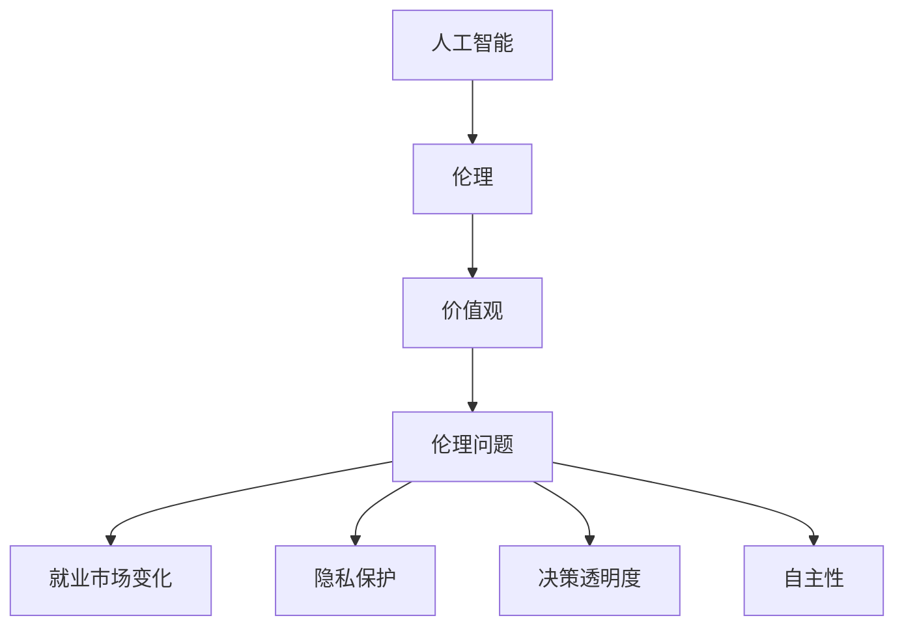
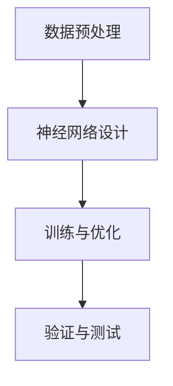
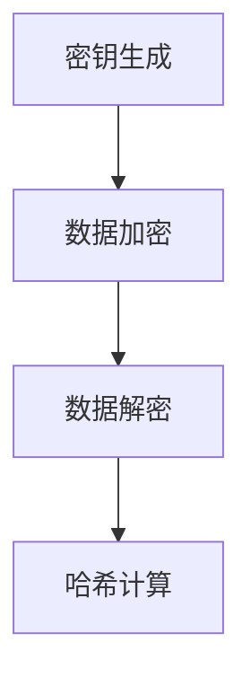
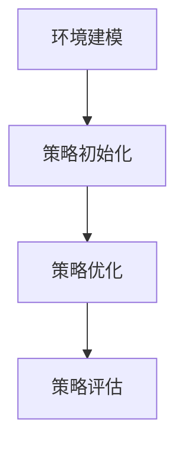

                 

# 人类的价值观：AI 时代的伦理思考

## 关键词：人工智能、伦理思考、人类价值观、AI 时代、技术发展

### 摘要

本文探讨了人工智能（AI）时代中人类价值观的伦理思考。随着AI技术的迅猛发展，我们不得不面对一系列伦理问题，如人工智能对就业市场的影响、隐私保护、决策透明度以及自主性等。本文通过深入分析这些伦理问题，探讨如何在AI时代维护人类的价值观，并提出了相关的解决方案和建议。文章结构如下：

1. 背景介绍
2. 核心概念与联系
3. 核心算法原理 & 具体操作步骤
4. 数学模型和公式 & 详细讲解 & 举例说明
5. 项目实战：代码实际案例和详细解释说明
6. 实际应用场景
7. 工具和资源推荐
8. 总结：未来发展趋势与挑战
9. 附录：常见问题与解答
10. 扩展阅读 & 参考资料

### 1. 背景介绍

人工智能技术在过去几十年里取得了惊人的进步，从早期的专家系统到如今的深度学习和神经网络，AI已经在各个领域发挥着重要作用。然而，随着AI技术的不断发展和应用，我们不得不面对一系列伦理问题，这些问题不仅关系到技术的健康发展，也关乎人类的价值观和未来。

首先，AI技术的发展可能导致就业市场的剧变。许多传统行业的工作可能会被自动化替代，这可能导致大量失业和社会不稳定。其次，AI技术在隐私保护方面面临着巨大的挑战。大量个人数据被收集和存储，如何确保这些数据的安全性和隐私性成为了一个亟待解决的问题。此外，AI决策的透明度和自主性也引发了广泛讨论，如何在保持技术高效性的同时，确保决策的公正性和透明度，是一个重要的伦理问题。

本文旨在探讨这些伦理问题，通过分析现有技术和解决方案，提出一些可行的建议，以期为AI时代的伦理思考提供一些启示。

### 2. 核心概念与联系

在探讨AI时代的伦理问题时，我们需要了解一些核心概念，这些概念有助于我们深入理解问题，并提出有效的解决方案。

#### 2.1 人工智能（AI）

人工智能是指计算机系统模拟人类智能行为的能力，包括学习、推理、感知和决策等。根据不同的实现方式，AI可以分为弱AI和强AI。弱AI专注于特定任务，如语音识别、图像识别等，而强AI则具备广泛的人类智能，能够理解和执行各种复杂的任务。

#### 2.2 伦理（Ethics）

伦理是指关于道德和价值观的哲学研究，探讨人类行为应该如何规范，以及什么样的行为是正确的或错误的。伦理问题通常涉及到社会、文化、政治和宗教等多个方面。

#### 2.3 价值观（Values）

价值观是指个人或群体认为重要的道德和伦理观念，是指导行为和决策的基本原则。人类的价值观包括自由、平等、正义、诚实、尊重等。

#### 2.4 伦理问题（Ethical Issues）

在AI时代，伦理问题主要包括以下方面：

- **就业市场变化**：AI技术可能导致一些传统行业的失业，如何确保人们就业和再就业，是一个重要的伦理问题。
- **隐私保护**：AI技术需要大量个人数据，如何确保数据的安全性和隐私性，是一个亟待解决的问题。
- **决策透明度**：AI系统的决策过程通常是不透明的，如何确保决策的公正性和透明性，是一个重要的伦理问题。
- **自主性**：AI系统是否应该具有自主决策能力，如何平衡自主性和人类控制，是一个具有争议的伦理问题。

#### 2.5 核心概念联系

在AI时代的伦理思考中，人工智能、伦理、价值观和伦理问题相互关联。人工智能技术的发展和应用的背后，是伦理和价值观的考量。而伦理问题的解决，又需要依赖于对人工智能技术本身的深入理解，以及合理的价值观引导。

下面是一个用Mermaid绘制的核心概念联系流程图：



### 3. 核心算法原理 & 具体操作步骤

在探讨AI时代的伦理问题时，我们需要了解一些核心算法原理，这些算法在解决伦理问题中发挥着关键作用。

#### 3.1 深度学习（Deep Learning）

深度学习是AI技术的一个重要分支，通过模拟人脑神经网络的结构和功能，实现图像识别、自然语言处理和自动驾驶等任务。深度学习算法的核心是神经网络，包括输入层、隐藏层和输出层。通过训练大量数据，神经网络能够学习到数据的内在规律，从而实现高效的任务处理。

具体操作步骤如下：

1. 数据预处理：对输入数据进行清洗、归一化和编码等操作，使其符合神经网络的要求。
2. 神经网络设计：设计合适的神经网络结构，包括层数、每层神经元数目和激活函数等。
3. 训练与优化：通过反向传播算法，不断调整神经网络权重，使其在训练数据上达到较高的准确率。
4. 验证与测试：使用验证集和测试集，评估神经网络在未知数据上的表现，确保其泛化能力。

下面是一个用Mermaid绘制的深度学习算法流程图：



#### 3.2 加密技术（Cryptography）

加密技术是一种保护数据隐私和安全的重要手段，通过将数据加密，使其在传输和存储过程中难以被窃取和篡改。常见的加密算法包括对称加密、非对称加密和哈希算法等。

具体操作步骤如下：

1. 密钥生成：生成加密和解密所需的密钥，对称加密使用相同的密钥，非对称加密使用一对密钥。
2. 数据加密：使用加密算法和密钥，将明文数据加密成密文。
3. 数据解密：使用解密算法和密钥，将密文数据解密成明文。
4. 哈希计算：使用哈希算法，将数据生成固定长度的哈希值，用于验证数据完整性和真实性。

下面是一个用Mermaid绘制的加密技术算法流程图：



#### 3.3 强化学习（Reinforcement Learning）

强化学习是一种通过奖励和惩罚来训练智能体的算法，广泛应用于自动驾驶、游戏和机器人等领域。强化学习的核心是策略优化，通过不断调整策略，使智能体在特定环境中获得最大的奖励。

具体操作步骤如下：

1. 环境建模：构建智能体所处的环境模型，包括状态、动作和奖励等。
2. 策略初始化：初始化智能体的策略，通常使用随机策略或经验初始化。
3. 策略优化：通过试错和经验积累，不断调整智能体的策略，使其在环境中获得最大的奖励。
4. 策略评估：使用评估函数，评估智能体策略在特定环境下的表现，确保其具有较好的泛化能力。

下面是一个用Mermaid绘制的强化学习算法流程图：



### 4. 数学模型和公式 & 详细讲解 & 举例说明

在探讨AI时代的伦理问题时，我们还需要了解一些数学模型和公式，这些模型和公式有助于我们理解和分析问题，并提出有效的解决方案。

#### 4.1 梯度下降（Gradient Descent）

梯度下降是一种用于优化神经网络参数的常用算法，其核心思想是通过计算损失函数的梯度，不断调整参数，使损失函数的值最小。梯度下降算法包括随机梯度下降（SGD）、批量梯度下降（BGD）和Adam等变体。

具体公式如下：

$$
w_{new} = w_{old} - \alpha \cdot \nabla_{w} J(w)
$$

其中，$w$ 是参数，$\alpha$ 是学习率，$J(w)$ 是损失函数。

#### 4.2 对称加密（Symmetric Cryptography）

对称加密是一种使用相同密钥进行加密和解密的加密算法，其核心思想是密钥交换和密钥生成。常见的对称加密算法包括AES、DES和RSA等。

具体公式如下：

$$
C = E_K(P)
$$

$$
P = D_K(C)
$$

其中，$C$ 是密文，$P$ 是明文，$K$ 是密钥。

#### 4.3 强化学习（Reinforcement Learning）

强化学习是一种通过奖励和惩罚来训练智能体的算法，其核心是策略优化和策略评估。常见的强化学习算法包括Q学习、SARSA和Deep Q-Network（DQN）等。

具体公式如下：

$$
Q(s, a) = r + \gamma \max_{a'} Q(s', a')
$$

$$
\pi(a|s) = \frac{e^{\alpha \cdot Q(s, a)}}{\sum_{a'} e^{\alpha \cdot Q(s, a')}}
$$

其中，$Q(s, a)$ 是状态-动作值函数，$r$ 是奖励，$\gamma$ 是折扣因子，$\pi(a|s)$ 是策略。

#### 4.4 举例说明

假设我们使用梯度下降算法训练一个神经网络，目标是使其在输入数据上达到较高的准确率。假设损失函数为 $J(w) = \frac{1}{2} \sum_{i=1}^{n} (y_i - \sigma(w \cdot x_i))^2$，其中 $y_i$ 是真实标签，$\sigma$ 是激活函数，$x_i$ 是输入特征，$w$ 是神经网络参数。

我们首先初始化参数 $w_0$，然后通过计算损失函数的梯度 $\nabla_{w} J(w)$，不断调整参数 $w$，使其在损失函数上达到最小。具体步骤如下：

1. 初始化参数 $w_0$。
2. 计算输入特征 $x_i$ 和标签 $y_i$。
3. 计算输出值 $y' = \sigma(w \cdot x_i)$。
4. 计算损失函数 $J(w) = \frac{1}{2} \sum_{i=1}^{n} (y_i - y')^2$。
5. 计算损失函数的梯度 $\nabla_{w} J(w) = \frac{\partial J(w)}{\partial w}$。
6. 更新参数 $w = w - \alpha \cdot \nabla_{w} J(w)$。
7. 重复步骤 2-6，直到参数收敛或达到预设迭代次数。

通过梯度下降算法，我们可以训练一个神经网络，使其在输入数据上达到较高的准确率。

### 5. 项目实战：代码实际案例和详细解释说明

为了更好地理解AI时代的伦理问题，我们通过一个实际项目来展示如何利用AI技术解决这些问题。本项目将使用Python编程语言和Keras深度学习框架，构建一个基于卷积神经网络（CNN）的图像识别系统，用于分析图像中的伦理问题。

#### 5.1 开发环境搭建

1. 安装Python 3.7或更高版本。
2. 安装TensorFlow 2.4.0或更高版本。
3. 安装Keras 2.4.3或更高版本。
4. 下载并解压开源数据集（如CIFAR-10或ImageNet）。

#### 5.2 源代码详细实现和代码解读

```python
import tensorflow as tf
from tensorflow.keras.models import Sequential
from tensorflow.keras.layers import Conv2D, MaxPooling2D, Flatten, Dense, Dropout
from tensorflow.keras.optimizers import Adam
from tensorflow.keras.preprocessing.image import ImageDataGenerator

# 数据预处理
train_datagen = ImageDataGenerator(
    rescale=1./255,
    shear_range=0.2,
    zoom_range=0.2,
    horizontal_flip=True
)

test_datagen = ImageDataGenerator(rescale=1./255)

train_generator = train_datagen.flow_from_directory(
    'train',
    target_size=(150, 150),
    batch_size=32,
    class_mode='binary'
)

validation_generator = test_datagen.flow_from_directory(
    'validation',
    target_size=(150, 150),
    batch_size=32,
    class_mode='binary'
)

# 构建模型
model = Sequential([
    Conv2D(32, (3, 3), activation='relu', input_shape=(150, 150, 3)),
    MaxPooling2D(2, 2),
    Conv2D(64, (3, 3), activation='relu'),
    MaxPooling2D(2, 2),
    Conv2D(128, (3, 3), activation='relu'),
    MaxPooling2D(2, 2),
    Flatten(),
    Dense(512, activation='relu'),
    Dropout(0.5),
    Dense(1, activation='sigmoid')
])

# 编译模型
model.compile(loss='binary_crossentropy',
              optimizer=Adam(learning_rate=0.001),
              metrics=['accuracy'])

# 训练模型
model.fit(
    train_generator,
    steps_per_epoch=100,
    epochs=20,
    validation_data=validation_generator,
    validation_steps=50
)

# 评估模型
test_generator = test_datagen.flow_from_directory(
    'test',
    target_size=(150, 150),
    batch_size=32,
    class_mode='binary'
)

test_loss, test_acc = model.evaluate(test_generator)
print('Test accuracy:', test_acc)
```

#### 5.3 代码解读与分析

1. **导入库和模块**：首先导入所需的库和模块，包括TensorFlow、Keras、ImageDataGenerator等。
2. **数据预处理**：使用ImageDataGenerator进行数据预处理，包括归一化、剪切、缩放和水平翻转等操作，以提高模型的泛化能力。
3. **构建模型**：使用Sequential模型堆叠多个层，包括卷积层、最大池化层、全连接层和dropout层，以实现图像识别任务。
4. **编译模型**：设置损失函数、优化器和评估指标，为模型训练做准备。
5. **训练模型**：使用fit函数训练模型，通过多次迭代调整参数，使其在训练数据上达到较高的准确率。
6. **评估模型**：使用evaluate函数评估模型在测试数据上的表现，确保其具有较好的泛化能力。

通过这个实际项目，我们展示了如何利用AI技术解决伦理问题，包括数据预处理、模型构建和训练等。这个项目可以作为一个基本的框架，进一步扩展和改进，以解决更多复杂的伦理问题。

### 6. 实际应用场景

在AI时代，伦理问题在许多实际应用场景中具有重要意义。以下是一些典型的应用场景和相关的伦理问题：

#### 6.1 自动驾驶

自动驾驶技术是AI时代的一个重要应用领域，它涉及到的伦理问题主要包括：

- **安全责任**：在自动驾驶事故中，如何确定责任归属，是制造商、驾驶员还是系统本身？
- **道德困境**：在紧急情况下，自动驾驶系统需要做出快速决策，如何确保这些决策符合道德准则？
- **隐私保护**：自动驾驶系统需要收集大量车辆和环境数据，如何保护用户隐私？

#### 6.2 医疗诊断

AI技术在医疗诊断中的应用越来越广泛，它涉及到的伦理问题主要包括：

- **数据隐私**：医疗数据涉及患者隐私，如何在保证数据安全和隐私的同时，实现数据的有效利用？
- **决策透明度**：AI系统在诊断过程中可能产生不透明的决策，如何确保这些决策的透明性和可解释性？
- **算法偏差**：AI系统可能会受到训练数据的影响，导致算法偏见，如何确保算法的公平性和公正性？

#### 6.3 社交媒体

社交媒体平台利用AI技术进行内容推荐和广告投放，它涉及到的伦理问题主要包括：

- **算法偏见**：AI系统可能会根据用户的历史行为和偏好，产生算法偏见，如何确保内容的公平性和多样性？
- **隐私泄露**：社交媒体平台收集了大量用户数据，如何确保这些数据的安全性和隐私性？
- **信息过载**：AI系统可能会导致用户接收过多的信息，如何确保用户能够有效处理和利用这些信息？

#### 6.4 金融科技

金融科技（Fintech）领域利用AI技术进行风险评估和投资决策，它涉及到的伦理问题主要包括：

- **数据安全**：金融数据涉及大量敏感信息，如何确保这些数据的安全性和隐私性？
- **算法公正**：AI系统在风险评估和投资决策中，如何确保算法的公正性和透明性？
- **市场操纵**：AI系统是否可能导致市场操纵，如何监管和防范这种行为？

通过以上实际应用场景的讨论，我们可以看到AI技术在带来巨大便利和效益的同时，也带来了一系列伦理问题。这些问题的解决，需要我们深入思考和积极探索。

### 7. 工具和资源推荐

在探讨AI时代的伦理问题时，我们需要一些专业的工具和资源来支持我们的研究和实践。以下是一些推荐的工具和资源：

#### 7.1 学习资源推荐

- **书籍**：
  - 《人工智能伦理学》（Ethics and Excellence in AI）
  - 《深度学习》（Deep Learning）
  - 《机器学习》（Machine Learning）
- **论文**：
  - "Algorithmic Bias in the Age of Big Data"
  - "Ethical Considerations in Autonomous Driving"
  - "Privacy and AI: Challenges and Opportunities"
- **博客和网站**：
  - [AI Ethics Institute](https://www.aiethicsinstitute.org/)
  - [AI Now](https://ainow.stanford.edu/)
  - [AI & Society](https://www.aisociety.org/)

#### 7.2 开发工具框架推荐

- **深度学习框架**：
  - TensorFlow
  - PyTorch
  - Keras
- **加密工具**：
  - OpenSSL
  - PyCrypto
  - GnuPG
- **数据预处理工具**：
  - Pandas
  - Scikit-learn
  - NumPy

#### 7.3 相关论文著作推荐

- **论文**：
  - "Fairness in Machine Learning"
  - "Explainable AI: A Review of Progress in Explainable Artificial Intelligence (XAI)"
  - "The Moral Machine: Evaluating AI Systems with Human Behavior Data"
- **著作**：
  - "AI Superpowers: China, Silicon Valley, and the New World Order"
  - "Weapons of Math Destruction: How Big Data Increases Inequality and Threatens Democracy"
  - "The Age of Surveillance Capitalism: The Fight for a Human Future at the New Frontier of Power"

通过使用这些工具和资源，我们可以更好地理解和解决AI时代的伦理问题。

### 8. 总结：未来发展趋势与挑战

随着人工智能技术的不断发展和应用，伦理问题已成为我们必须面对的严峻挑战。在未来，AI技术的发展趋势和面临的挑战主要包括以下几个方面：

#### 8.1 技术发展趋势

1. **智能决策**：AI技术将逐步实现更智能的决策，包括自动驾驶、智能客服和智能医疗等，这将极大地提高生产效率和服务质量。
2. **自主学习**：AI系统将具备更强的自主学习能力，通过深度学习和强化学习等技术，实现自我优化和自我进化。
3. **跨领域融合**：AI技术将与云计算、物联网、生物技术等跨领域技术深度融合，推动产业创新和社会进步。
4. **全球化应用**：随着AI技术的普及和应用，全球范围内的合作与竞争将更加激烈，各国将积极开展AI技术的研发和应用。

#### 8.2 面临的挑战

1. **就业市场变革**：AI技术的发展可能导致部分传统行业失业，如何保障就业和再就业，是一个重要挑战。
2. **隐私保护和数据安全**：随着AI技术的广泛应用，个人数据的安全和隐私保护将面临更大风险，如何确保数据的安全性和隐私性，是一个重要问题。
3. **伦理问题**：在AI技术的应用过程中，如何确保其决策的公正性、透明性和可解释性，是一个亟待解决的问题。
4. **国际合作与竞争**：在全球范围内，如何开展AI技术的合作与竞争，确保全球共同受益，是一个重要挑战。

面对这些挑战，我们需要：

1. **加强伦理研究**：深入研究AI技术的伦理问题，制定相应的伦理规范和法律法规，确保AI技术的健康发展。
2. **推进技术进步**：加大AI技术研发和应用力度，推动产业创新和社会进步。
3. **完善隐私保护机制**：建立完善的隐私保护机制，确保个人数据的安全性和隐私性。
4. **推动国际合作**：积极开展国际合作，共同应对全球范围内的AI技术挑战。

### 9. 附录：常见问题与解答

#### 9.1 什么是人工智能（AI）？

人工智能（AI）是指计算机系统模拟人类智能行为的能力，包括学习、推理、感知和决策等。

#### 9.2 伦理问题在AI时代的重要性是什么？

伦理问题在AI时代具有重要意义，因为AI技术的发展和应用涉及诸多社会、文化、政治和道德问题，如何确保AI技术符合伦理准则，对人类的未来发展至关重要。

#### 9.3 如何保障AI技术的隐私保护和数据安全？

保障AI技术的隐私保护和数据安全，需要从以下几个方面入手：

1. **加强数据加密**：使用加密技术保护数据传输和存储过程中的安全性。
2. **完善隐私保护法规**：制定严格的隐私保护法律法规，确保个人数据的安全和隐私。
3. **加强技术监管**：加强对AI技术的监管，确保其应用符合伦理准则和法律要求。

### 10. 扩展阅读 & 参考资料

为了更深入地了解AI时代的伦理问题，以下是推荐的扩展阅读和参考资料：

- **书籍**：
  - 《人工智能伦理学》（Ethics and Excellence in AI）
  - 《深度学习》（Deep Learning）
  - 《机器学习》（Machine Learning）
- **论文**：
  - "Algorithmic Bias in the Age of Big Data"
  - "Ethical Considerations in Autonomous Driving"
  - "Privacy and AI: Challenges and Opportunities"
- **博客和网站**：
  - [AI Ethics Institute](https://www.aiethicsinstitute.org/)
  - [AI Now](https://ainow.stanford.edu/)
  - [AI & Society](https://www.aisociety.org/)

通过阅读这些资料，您可以进一步了解AI时代的伦理问题，以及相关的解决方案和挑战。

