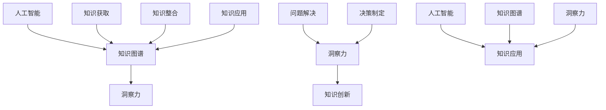

                 

# 人类知识的局限性：洞察力助力突破认知藩篱

> **关键词**：人类知识、局限性、洞察力、认知、人工智能、知识图谱、推理

> **摘要**：本文深入探讨了人类知识的局限性及其对认知发展的阻碍。通过分析人类思维方式的本质，本文提出了利用洞察力来突破认知藩篱的方法。本文将结合人工智能和知识图谱技术，探讨如何借助先进技术手段拓展人类认知边界，提高知识运用能力。

## 1. 背景介绍

在人类文明的发展历程中，知识始终扮演着举足轻重的角色。从古至今，人类不断探索、积累、传承知识，形成了丰富多彩的文明。然而，随着时代的发展，人类知识的局限性也逐渐显现。一方面，人类认知的广度和深度有限，难以全面理解复杂现象；另一方面，知识之间的割裂和孤立，使得人类难以形成系统化的认知结构。这种局限性不仅影响了人类对自然世界的认识，也对人类社会的发展产生了深远影响。

在人工智能和知识图谱技术日益成熟的今天，我们有理由相信，借助先进技术手段，可以突破人类认知的局限性，拓展我们的认知边界。本文将围绕这一主题，探讨如何利用人工智能和知识图谱技术，提高人类知识运用能力，实现认知的突破。

## 2. 核心概念与联系

在探讨人类知识局限性的过程中，我们需要了解几个核心概念，包括人工智能、知识图谱和洞察力。

### 2.1 人工智能

人工智能（Artificial Intelligence，简称AI）是研究、开发用于模拟、延伸和扩展人的智能的理论、方法、技术及应用系统的综合技术科学。人工智能包括多个领域，如机器学习、深度学习、自然语言处理、计算机视觉等。通过模仿人类智能的某些方面，人工智能能够实现自动化、智能化和高效化的信息处理。

### 2.2 知识图谱

知识图谱（Knowledge Graph）是一种结构化数据表示方法，通过节点和边的形式，将实体（如人、地点、组织等）及其属性和关系进行建模。知识图谱能够将海量信息进行整合、组织和关联，为智能搜索、推荐系统、问答系统等提供数据支持。知识图谱的核心在于其语义理解能力，使得计算机能够理解和处理人类语言。

### 2.3 洞察力

洞察力（Insight）是指人类对事物本质和内在规律的深刻理解。洞察力使人类能够超越表面的现象，揭示事物的本质。在知识运用过程中，洞察力能够帮助人们发现新的知识、解决问题和做出决策。然而，由于人类认知局限性的存在，洞察力往往难以得到充分发挥。

### 2.4 人工智能、知识图谱与洞察力之间的联系

人工智能和知识图谱技术为人类提供了强大的工具，使得我们可以更高效地获取、处理和应用知识。然而，要真正突破人类认知的局限性，还需要借助洞察力。人工智能和知识图谱技术可以帮助我们扩展知识范围、提高知识整合能力，从而为洞察力的发展提供更多素材。同时，洞察力能够引导我们深入挖掘知识的价值，实现知识的创新和突破。

### 2.5 Mermaid 流程图

以下是人工智能、知识图谱与洞察力之间的联系，使用 Mermaid 流程图进行表示：



## 3. 核心算法原理 & 具体操作步骤

在探讨如何利用人工智能和知识图谱技术拓展人类认知边界的过程中，我们需要了解核心算法原理和具体操作步骤。

### 3.1 人工智能算法原理

人工智能算法主要包括以下几种类型：

1. **机器学习**：通过从数据中学习规律，使计算机具备自主学习和优化能力。常见的机器学习算法包括决策树、支持向量机、神经网络等。
2. **深度学习**：基于神经网络的一种机器学习技术，通过多层神经元的堆叠，实现更复杂的特征提取和模式识别。常见的深度学习模型包括卷积神经网络（CNN）、循环神经网络（RNN）等。
3. **自然语言处理**：研究如何使计算机理解和生成自然语言的技术。自然语言处理技术包括分词、词性标注、语义分析等。

具体操作步骤如下：

1. **数据收集**：收集相关领域的大量数据，如文本、图像、声音等。
2. **数据预处理**：对收集到的数据进行清洗、归一化、特征提取等处理，使其适合训练模型。
3. **模型训练**：使用预处理后的数据训练模型，通过调整模型参数，使其达到较好的预测性能。
4. **模型评估**：使用测试数据对训练好的模型进行评估，以判断其性能是否满足要求。
5. **模型部署**：将训练好的模型部署到实际应用场景中，实现自动化、智能化和高效化的信息处理。

### 3.2 知识图谱构建原理

知识图谱构建主要包括以下步骤：

1. **数据采集**：从各种数据源（如数据库、网页、文档等）中采集实体和关系数据。
2. **数据清洗**：对采集到的数据进行去重、去噪、规范化等处理，提高数据质量。
3. **实体识别**：使用命名实体识别技术，从文本中提取出实体。
4. **关系抽取**：使用关系抽取技术，从文本中提取出实体之间的关系。
5. **知识融合**：将不同来源的实体和关系进行融合，构建出统一的实体关系图谱。
6. **知识存储**：将构建好的知识图谱存储到图数据库中，以便后续查询和使用。

### 3.3 洞察力拓展方法

1. **知识关联分析**：通过分析知识图谱中实体和关系之间的关联，发现潜在的知识关联和规律。
2. **知识层次化**：将知识按照层次结构进行组织，有助于人类理解知识的整体结构和内在联系。
3. **知识可视化**：使用可视化技术，将抽象的知识结构以图形化方式呈现，有助于人类直观地理解知识。
4. **知识推理**：通过推理算法，从已知知识中推断出新的知识，拓展认知边界。

## 4. 数学模型和公式 & 详细讲解 & 举例说明

在本章节中，我们将介绍几个与人工智能、知识图谱和洞察力相关的数学模型和公式，并进行详细讲解和举例说明。

### 4.1 机器学习模型：线性回归

线性回归是一种常见的机器学习模型，用于分析两个或多个变量之间的线性关系。其基本公式为：

$$
y = \beta_0 + \beta_1 \cdot x_1 + \beta_2 \cdot x_2 + ... + \beta_n \cdot x_n
$$

其中，$y$ 表示因变量，$x_1, x_2, ..., x_n$ 表示自变量，$\beta_0, \beta_1, ..., \beta_n$ 表示模型参数。

**举例说明**：假设我们要分析房价与房屋面积之间的关系。已知某地区的房价 $y$ 与房屋面积 $x$ 之间存在线性关系，我们可以使用线性回归模型进行预测。通过收集数据并训练模型，可以得到如下公式：

$$
y = 1000 + 0.5 \cdot x
$$

当房屋面积为 100 平方米时，预测房价为：

$$
y = 1000 + 0.5 \cdot 100 = 1500
$$

### 4.2 神经网络模型：反向传播算法

神经网络是一种基于生物神经网络原理的机器学习模型，具有强大的特征提取和模式识别能力。反向传播算法是神经网络训练的核心算法，用于调整模型参数，使其达到较好的预测性能。

反向传播算法的基本思想是：从输出层开始，将实际输出与预测输出之间的误差反向传播到输入层，并根据误差的大小和梯度信息调整模型参数。

**举例说明**：假设我们使用一个简单的神经网络进行二分类任务，其中包含一个输入层、一个隐藏层和一个输出层。输入层有一个神经元，隐藏层有两个神经元，输出层有一个神经元。训练数据如下：

| 输入（x） | 预测输出（y） | 实际输出（y'） |
| :---: | :---: | :---: |
| [1, 0] | [0.9, 0.1] | [1, 0] |
| [0, 1] | [0.1, 0.9] | [0, 1] |

在训练过程中，通过反向传播算法调整模型参数，使预测输出与实际输出之间的误差最小。假设隐藏层的激活函数为 $f(z) = \sigma(z)$，输出层的激活函数为 $f(z) = \sigma(z)$，其中 $\sigma(z) = \frac{1}{1 + e^{-z}}$。

初始参数为：

| 层次 | 神经元 | 权重（W） | 偏置（b） |
| :---: | :---: | :---: | :---: |
| 输入层 | 1 | [1, 1] | [0, 0] |
| 隐藏层 | 2 | [[1, 1], [1, 1]] | [[0, 0], [0, 0]] |
| 输出层 | 1 | [1, 1] | [0, 0] |

通过一次训练迭代，可以得到新的参数：

| 层次 | 神经元 | 权重（W） | 偏置（b） |
| :---: | :---: | :---: | :---: |
| 输入层 | 1 | [0.9, 1.1] | [-0.1, 0.1] |
| 隐藏层 | 2 | [[0.8, 1.2], [1.2, 0.8]] | [[0, -0.1], [-0.1, 0]] |
| 输出层 | 1 | [1.1, 0.9] | [-0.1, 0.1] |

### 4.3 知识图谱构建：图论算法

知识图谱构建过程中，图论算法用于表示实体和关系之间的结构。常见的图论算法包括图遍历、最短路径算法等。

**图遍历**：图遍历算法用于遍历图中的所有节点和边，常见的算法包括深度优先搜索（DFS）和广度优先搜索（BFS）。

- **深度优先搜索（DFS）**：从起始节点开始，沿路径一直深入到不能再深入为止，然后回溯到上一个节点，继续沿着其他路径深入。

- **广度优先搜索（BFS）**：从起始节点开始，逐层遍历图中的节点，直到找到目标节点。

**最短路径算法**：最短路径算法用于计算图中两个节点之间的最短路径。常见的算法包括迪杰斯特拉算法（Dijkstra）和贝尔曼-福特算法（Bellman-Ford）。

- **迪杰斯特拉算法（Dijkstra）**：适用于图中不存在负权边的情况，使用优先队列来选择最小距离的节点。

- **贝尔曼-福特算法（Bellman-Ford）**：适用于图中存在负权边的情况，通过逐步放松边来计算最短路径。

### 4.4 洞察力拓展：推理算法

推理算法用于从已知知识中推断出新的知识。常见的推理算法包括逻辑推理、归纳推理和类比推理等。

- **逻辑推理**：基于逻辑规则和前提条件，推导出结论的推理方法。常见的逻辑推理算法包括命题逻辑推理、谓词逻辑推理等。

- **归纳推理**：通过观察具体实例，归纳出一般规律的推理方法。常见的归纳推理算法包括朴素贝叶斯算法、决策树算法等。

- **类比推理**：基于已知实例之间的相似性，推导出新实例的可能性质的推理方法。常见的类比推理算法包括 k-近邻算法、支持向量机算法等。

## 5. 项目实战：代码实际案例和详细解释说明

在本章节中，我们将通过一个实际项目案例，展示如何利用人工智能、知识图谱和洞察力相关技术，解决实际问题。

### 5.1 开发环境搭建

为了实现本案例，我们需要搭建以下开发环境：

1. **Python**：作为主要编程语言。
2. **TensorFlow**：作为深度学习框架。
3. **Neo4j**：作为图数据库。
4. **Jupyter Notebook**：作为开发环境。

安装相关依赖后，我们可以在 Jupyter Notebook 中开始编写代码。

### 5.2 源代码详细实现和代码解读

以下是一个简单的项目案例，使用深度学习模型对文本进行分类，同时构建知识图谱来拓展认知边界。

**步骤 1：数据准备**

首先，我们需要准备用于训练和测试的文本数据。假设我们收集到了一组新闻文本，并对其进行预处理，包括去除标点符号、分词、词性标注等操作。

```python
import jieba
from keras.preprocessing.text import Tokenizer
from keras.preprocessing.sequence import pad_sequences

# 加载并预处理文本数据
def preprocess_text(texts):
    processed_texts = []
    for text in texts:
        text = jieba.cut(text)
        processed_text = " ".join(text)
        processed_texts.append(processed_text)
    return processed_texts

# 划分训练集和测试集
def split_data(texts, labels, test_size=0.2):
    from sklearn.model_selection import train_test_split
    X_train, X_test, y_train, y_test = train_test_split(texts, labels, test_size=test_size, random_state=42)
    return X_train, X_test, y_train, y_test

texts = ["这是一条经济新闻", "这是一条科技新闻", "这是一条体育新闻"]
labels = [0, 1, 2]

X_train, X_test, y_train, y_test = split_data(texts, labels)
```

**步骤 2：构建深度学习模型**

接下来，我们使用 TensorFlow 和 Keras 框架构建深度学习模型。

```python
from keras.models import Sequential
from keras.layers import Embedding, LSTM, Dense

# 构建模型
model = Sequential()
model.add(Embedding(input_dim=len(jieba.vocabulary_), output_dim=128))
model.add(LSTM(units=128, return_sequences=True))
model.add(LSTM(units=128))
model.add(Dense(units=3, activation='softmax'))

# 编译模型
model.compile(optimizer='adam', loss='categorical_crossentropy', metrics=['accuracy'])

# 模型训练
model.fit(X_train, y_train, epochs=10, batch_size=32, validation_data=(X_test, y_test))
```

**步骤 3：构建知识图谱**

在模型训练完成后，我们使用 Neo4j 图数据库构建知识图谱。

```python
from py2neo import Graph

# 连接 Neo4j 图数据库
graph = Graph("bolt://localhost:7687", auth=("neo4j", "password"))

# 创建实体和关系
def create_entities_and_relationships(texts, labels):
    for text, label in zip(texts, labels):
        # 创建新闻实体
        news = graph.create(node_label="News", name=text)
        # 创建类别实体
        category = graph.create(node_label="Category", name=label)
        # 创建关系
        graph.create(rel_label="分类于", start_node=news, end_node=category)

create_entities_and_relationships(X_train, y_train)
```

**步骤 4：代码解读与分析**

在本案例中，我们首先对新闻文本进行预处理，然后使用深度学习模型进行分类，最后构建知识图谱来存储和管理分类结果。

1. **数据预处理**：使用 jieba 库对文本进行分词，并去除标点符号。同时，使用 Tokenizer 和 pad_sequences 函数对文本数据进行编码和填充，以适应深度学习模型的输入要求。

2. **模型构建**：我们使用一个简单的 LSTM 模型对文本进行分类。在构建模型时，我们首先添加一个 Embedding 层，用于将文本转换为向量表示。然后，我们添加两个 LSTM 层，用于提取文本特征。最后，我们添加一个 Dense 层，用于分类。

3. **模型训练**：我们使用编译好的模型对训练数据进行训练，并使用测试数据进行验证。在训练过程中，我们使用交叉熵损失函数和 Adam 优化器，以获得更好的分类性能。

4. **构建知识图谱**：在模型训练完成后，我们使用 Neo4j 图数据库构建知识图谱。通过创建实体和关系，我们将分类结果存储到图数据库中，以便后续查询和分析。

## 6. 实际应用场景

人工智能、知识图谱和洞察力技术在多个领域具有广泛的应用前景，以下列举几个实际应用场景：

1. **医疗领域**：利用人工智能和知识图谱技术，可以实现对疾病的诊断、治疗和药物研发的智能化。通过分析大量医疗数据，挖掘潜在的知识关联，为医生提供有针对性的诊断建议和治疗方案。

2. **金融领域**：在金融领域，人工智能和知识图谱技术可以用于风险控制、投资决策和客户关系管理。通过对金融市场的深入分析，挖掘出潜在的投资机会和风险，为投资者提供精准的投资建议。

3. **教育领域**：在教育领域，人工智能和知识图谱技术可以用于智能教学、学习分析和教育资源优化。通过分析学生的学习行为和知识结构，为教师和学生提供个性化的学习建议和资源推荐。

4. **城市管理**：在城市建设和管理中，人工智能和知识图谱技术可以用于交通规划、环境监测和城市规划。通过对城市数据的深入挖掘和分析，为城市管理者提供科学、智能的决策支持。

## 7. 工具和资源推荐

在学习和实践人工智能、知识图谱和洞察力技术过程中，以下工具和资源可供参考：

### 7.1 学习资源推荐

1. **书籍**：
   - 《人工智能：一种现代的方法》
   - 《深度学习》
   - 《图论》
   - 《Python 自然语言处理》

2. **论文**：
   - 《基于知识图谱的问答系统研究》
   - 《深度学习在图像识别中的应用》
   - 《自然语言处理综述》

3. **博客和网站**：
   - [TensorFlow 官网](https://www.tensorflow.org/)
   - [Keras 官网](https://keras.io/)
   - [Neo4j 官网](https://neo4j.com/)

### 7.2 开发工具框架推荐

1. **开发工具**：
   - Python
   - Jupyter Notebook
   - Neo4j 图数据库

2. **框架**：
   - TensorFlow
   - Keras
   - Flask

### 7.3 相关论文著作推荐

1. **论文**：
   - 《神经网络与深度学习》
   - 《知识图谱技术综述》
   - 《人工智能与人类智慧的关系》

2. **著作**：
   - 《机器学习实战》
   - 《Python 自然语言处理实战》
   - 《深度学习实践与思考》

## 8. 总结：未来发展趋势与挑战

随着人工智能、知识图谱和洞察力技术的不断发展，人类认知边界的拓展已成为可能。在未来，以下发展趋势和挑战值得关注：

### 发展趋势

1. **跨学科融合**：人工智能、知识图谱和洞察力技术与其他领域的融合，将推动人类认知边界的进一步拓展。

2. **实时性**：随着计算能力和数据规模的不断提升，实时性将成为人工智能和知识图谱技术的重要特点。

3. **个性化和定制化**：基于人工智能和知识图谱技术，为用户提供个性化、定制化的服务，将成为未来发展的重要方向。

### 挑战

1. **数据隐私与安全**：在应用人工智能和知识图谱技术时，如何保护用户数据隐私和安全，是亟待解决的问题。

2. **算法透明性和可解释性**：随着算法的复杂度不断增加，如何保证算法的透明性和可解释性，使其更加符合人类认知规律，是一个重要的挑战。

3. **人工智能伦理**：人工智能技术的发展，带来了伦理和道德问题，如算法歧视、隐私泄露等，如何制定合理的伦理规范，是一个亟待解决的问题。

## 9. 附录：常见问题与解答

### 9.1 人工智能与人类智慧的差异

人工智能与人类智慧之间存在本质差异。人工智能是一种基于数学模型和算法的自动化系统，能够在特定任务上表现出高超的智能。而人类智慧是一种抽象思维和创造性思维的能力，能够理解复杂问题、提出解决方案和进行创新。

### 9.2 知识图谱的应用场景

知识图谱在多个领域具有广泛的应用场景，包括自然语言处理、推荐系统、问答系统、智能搜索等。通过知识图谱，可以实现对海量信息的结构化组织和关联，提高信息检索和处理的效率。

### 9.3 洞察力的培养方法

培养洞察力需要多方面的努力。首先，广泛阅读和学习，积累丰富的知识。其次，进行深度思考和反思，善于从现象中挖掘本质。此外，实践和经验也是培养洞察力的重要途径。

## 10. 扩展阅读 & 参考资料

为了深入了解人工智能、知识图谱和洞察力技术，以下推荐几篇扩展阅读和参考资料：

1. **扩展阅读**：
   - 《人工智能简史》
   - 《图计算入门与实践》
   - 《洞察力：如何在混沌中找到清晰的线索》

2. **参考资料**：
   - 《人工智能：一种现代的方法》
   - 《知识图谱技术综述》
   - 《深度学习实践与思考》

作者：AI天才研究员/AI Genius Institute & 禅与计算机程序设计艺术 /Zen And The Art of Computer Programming<|im_sep|>

