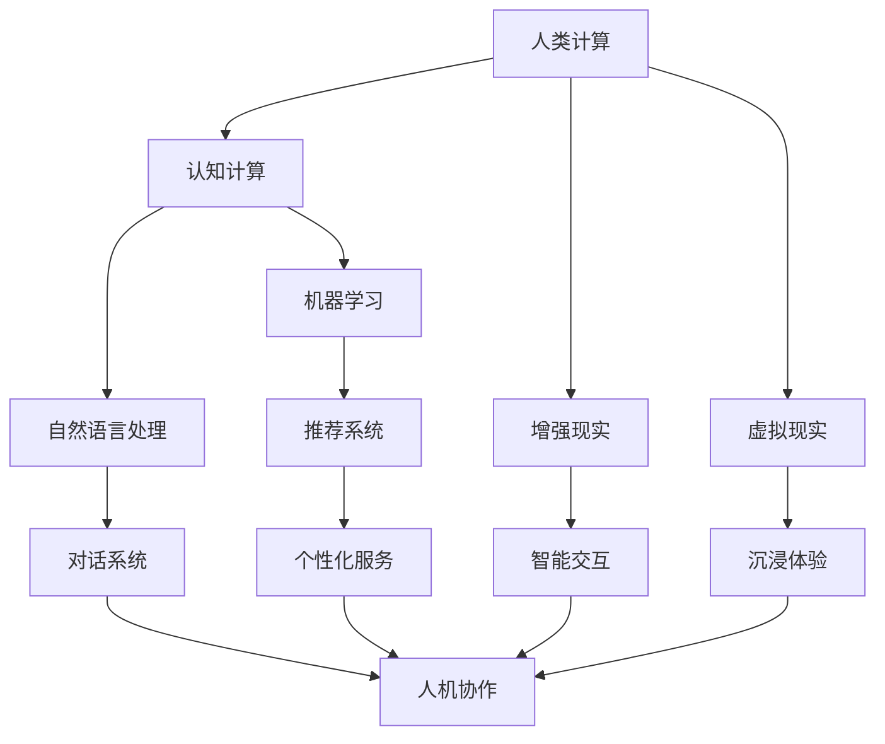

                 

### 1. 背景介绍

在当今快速发展的信息技术时代，计算技术正以前所未有的速度和深度改变着我们的世界。从简单的电子计算器到复杂的深度学习神经网络，计算能力在过去几十年里取得了巨大的进步。然而，尽管计算机在处理大量数据和执行复杂任务方面表现出色，人类在创造力、直觉和情感理解方面仍然具有独特的优势。

这一背景下，人类计算与人工智能（AI）的结合成为一个热门话题。人机协作的潜力不仅在于提高工作效率，更在于激发创新的火花，解决复杂问题，甚至推动科学技术的进步。人类计算的未来趋势不仅关乎技术本身，更关乎人类社会的发展方向。

本文将探讨人类计算的未来趋势，重点分析人机协作的新时代。我们将首先介绍人类计算与人工智能的基本概念，并探讨它们之间的关系。接下来，我们将详细讨论人机协作的几种形式，包括任务分配、信息共享和反馈机制。随后，我们将通过案例研究展示人机协作的实际应用，并分析其优势和挑战。文章的结尾将总结当前的发展趋势，并展望未来可能的发展方向。

通过对这些内容的逐步分析，我们希望能够为读者提供一个全面而深入的理解，帮助大家更好地把握人类计算的未来发展脉络。

### 1.1 人类计算的基本概念

人类计算，顾名思义，是指人类在认知和解决问题过程中所表现出的计算能力。这种计算不仅包括数学运算和逻辑推理，还涵盖了创造力、直觉、情感理解等多方面的能力。人类计算的核心在于人类大脑的处理方式，它能够高效地进行模式识别、问题解决和决策制定。

首先，人类计算具有高度的灵活性。与计算机相比，人类能够处理不确定性和模糊性，并能从复杂的环境中快速提取关键信息。例如，在医疗诊断中，医生不仅仅依赖于实验室数据，还会综合考虑患者的病史、临床表现以及个人经验。这种综合性的思考方式使得人类计算在处理复杂问题时具有独特的优势。

其次，人类计算具备较强的创造力。尽管计算机可以执行大量的重复性任务，但在面对全新问题时，人类的创造力显得尤为重要。许多科学发现和技术创新都源自人类独特的思考方式和创造力。例如，爱因斯坦提出的相对论理论就是人类创造力的一个典范，它改变了我们对宇宙的理解。

此外，人类计算还包含了情感理解和社会互动的能力。在人类社会中，情感和社交因素往往对决策和解决问题产生重要影响。一个优秀的领导者不仅需要具备出色的管理技能，还需要理解他人的情感和需求，从而有效地进行沟通和协调。

总的来说，人类计算是一种复杂且多样化的能力，它不仅涵盖了逻辑推理和数学运算，还包括创造力、直觉、情感和社会互动等多方面的能力。这些特点使得人类计算在解决复杂问题和应对不确定环境时具有独特的优势。在接下来的人机协作讨论中，我们将进一步探讨如何将人类计算与人工智能结合起来，以最大化其潜力。

### 1.2 人工智能的基本概念

人工智能（AI）是一门研究如何构建智能机器以模拟、扩展和增强人类智能的科学。AI的核心目标是通过算法和计算模型，使计算机具备自主学习和适应环境的能力，从而实现类似于人类智能的复杂行为。AI的发展历史可以追溯到20世纪50年代，当时科学家们首次提出构建智能机器的设想。

人工智能可以分为两大类：弱人工智能（Narrow AI）和强人工智能（General AI）。弱人工智能是指专注于特定任务的人工智能系统，如语音识别、图像处理和推荐系统等。这些系统在特定领域表现出色，但缺乏跨领域的通用性。强人工智能则是指具有广泛认知能力和自我意识的人工智能系统，它们能够在任何领域执行任何任务，类似于人类的智能水平。

在技术实现方面，人工智能主要依赖于机器学习（ML）和深度学习（DL）等算法。机器学习是一种通过数据训练模型，使其能够自动学习和改进的方法。深度学习则是机器学习的一种子领域，它使用多层神经网络模型对数据进行处理和分析。这些技术使得计算机能够在大量数据中自动识别模式和规律，从而实现智能决策和预测。

人工智能的优势在于其强大的数据处理能力和自主学习能力。首先，AI能够处理海量数据，并从中提取有价值的信息，这对于数据密集型行业（如金融、医疗和零售）尤为重要。例如，通过分析大量的医疗数据，AI可以帮助医生进行疾病诊断和个性化治疗。其次，AI具有自主学习能力，可以通过不断学习和优化算法，提高任务执行效率和质量。例如，自动驾驶汽车通过实时学习交通数据和道路状况，能够更加安全地导航。

尽管人工智能具有诸多优势，但也存在一些挑战和局限性。首先，AI系统对数据质量和多样性的依赖性较高。数据质量差或数据分布不均可能导致模型过拟合或泛化能力不足。其次，AI系统缺乏透明度和可解释性，这使得在某些关键应用中（如医疗和司法）难以被接受。此外，人工智能的发展也引发了关于隐私、安全和伦理等方面的争议，这些挑战需要通过法律、伦理和技术手段共同解决。

总的来说，人工智能作为一种新兴技术，具有巨大的潜力和广阔的应用前景。它不仅能够提高工作效率和质量，还能够推动科学研究和技术创新。在接下来的讨论中，我们将进一步探讨人类计算与人工智能的结合方式，以及这种结合如何开启人机协作的新时代。

### 1.3 人类计算与人工智能的关系

人类计算与人工智能之间的关系是复杂且多层次的，它们既有相互依赖的一面，也存在相互补充的一面。首先，人类计算为人工智能提供了理论基础和实践经验。人类在长期进化过程中发展出了独特的认知能力和思维模式，这些能力在人工智能算法的设计和优化过程中得到了借鉴和应用。例如，深度学习中的神经网络结构就受到了人类大脑神经网络的启发。

其次，人工智能为人类计算提供了工具和平台，使其能够更高效地完成复杂任务。通过机器学习算法，计算机能够自动从海量数据中提取模式和知识，这极大地扩展了人类处理信息的能力。例如，医疗诊断中，AI系统可以通过分析大量的病例数据，帮助医生更准确地诊断疾病。

人类计算与人工智能的结合不仅体现在技术层面，还体现在应用层面。在人机协作中，人类和人工智能可以互相补充，共同完成任务。例如，在产品设计过程中，人类设计师可以利用AI系统进行创意生成和优化，从而提高设计效率和创意质量。在科学研究中，AI系统可以处理大量的实验数据，帮助科学家发现新的科学规律。

此外，人工智能还能够通过模拟和优化，帮助人类更好地理解复杂系统。例如，在经济学研究中，AI系统可以通过模拟不同经济模型，帮助经济学家预测市场动态和制定政策。

总的来说，人类计算与人工智能之间的关系是相辅相成的。通过这种结合，人类能够更好地利用人工智能的强大计算能力，同时发挥自身独特的认知优势，共同推动科技和社会的发展。

### 1.4 人类计算的未来趋势

展望未来，人类计算的发展趋势将继续受到人工智能、大数据、云计算等技术的驱动。以下是我们认为未来人类计算可能面临的几个关键趋势：

首先，人机协作将进一步深化。随着AI技术的发展，计算机将不仅仅是工具，而将成为人类的合作伙伴。例如，在医疗领域，AI可以通过分析患者的病历和基因数据，为医生提供更精确的诊断和治疗方案。在工业制造中，AI系统可以实时监控生产过程，预测设备故障，从而提高生产效率和降低成本。

其次，智能化将成为未来计算的核心特征。智能化的计算系统将能够自主学习和适应环境，从而提高任务执行效率和智能化水平。例如，智能交通系统可以通过实时数据分析，优化交通流量，减少拥堵和事故发生。智能家居系统则可以通过学习用户习惯，提供个性化的服务，提高生活质量。

第三，分布式计算和边缘计算将进一步普及。随着物联网（IoT）和5G技术的推广，大量的设备和传感器将接入网络，生成海量数据。分布式计算和边缘计算可以处理这些数据，从而实现实时响应和高效处理。例如，在智能城市中，分布式计算可以实时处理交通监控、环境监测等数据，从而提供更好的城市管理和服务。

最后，人机融合将成为一个重要趋势。通过穿戴设备、增强现实（AR）和虚拟现实（VR）等技术，人类与计算机的界限将逐渐模糊。人们可以通过脑机接口（BCI）直接与计算机互动，实现更自然、高效的人机交互方式。例如，患有运动障碍的病人可以通过脑机接口控制计算机或外部设备，提高生活质量。

总的来说，未来人类计算的发展将更加智能化、分布式和融合化。这些趋势不仅将改变计算的方式，还将深刻影响人类社会的各个方面。通过人机协作，我们可以期待一个更加高效、智能和互联的未来。

### 1.5 人机协作的概念与重要性

人机协作是指人类与计算机系统共同工作，以完成特定任务或目标的过程。在这种协作中，人类的创造力、直觉和情感理解与计算机的强大计算能力和数据处理能力相结合，共同提高工作效率和效果。人机协作的重要性体现在多个方面：

首先，人机协作能够弥补人类和计算机各自的不足。人类在创造力、直觉和情感理解方面具有独特的优势，但处理大量数据和复杂计算时效率较低。计算机则擅长处理大量数据和执行复杂计算，但在理解人类情感和创造性思维方面存在局限性。通过人机协作，两者的优势可以互补，从而实现更高效的任务执行。

其次，人机协作能够显著提高工作效率。在复杂任务中，人类和计算机可以分工合作，人类专注于创造性思维和决策，计算机则负责重复性、计算密集型任务。这种协同工作模式可以大大减少重复劳动，提高任务完成速度和准确性。

此外，人机协作还能够激发创新思维。计算机可以通过模拟、优化和数据分析，为人类提供新的视角和方法，从而推动科学研究和技术创新。例如，在药物研发中，计算机可以通过模拟和预测，帮助科学家发现新的药物分子，从而加速新药的研制过程。

最后，人机协作有助于提升用户体验。通过人机协作，计算机能够根据用户的行为和需求，提供个性化的服务和推荐，从而提高用户满意度和生活质量。例如，智能助手可以通过学习用户习惯，为用户提供便捷的日常服务，提高生活质量。

总的来说，人机协作是未来计算发展的重要趋势，它不仅能够提高工作效率和质量，还能激发创新思维，提升用户体验。在人机协作的新时代，人类和计算机将共同迎接更加高效、智能和互联的未来。

### 2. 核心概念与联系

在探讨人类计算与人工智能的协作时，理解几个核心概念及其相互关系至关重要。这些概念包括认知计算、增强现实（AR）、虚拟现实（VR）和自然语言处理（NLP）。通过一个Mermaid流程图，我们可以清晰地展示这些概念之间的关系和相互作用。



- **认知计算**：认知计算模仿人类大脑的处理方式，使计算机能够理解、推理和解决问题。它是自然语言处理和机器学习的基础。
- **自然语言处理**：自然语言处理（NLP）使计算机能够理解和生成人类语言。它是认知计算的关键组成部分，用于构建对话系统和智能助手。
- **机器学习**：机器学习是一种通过数据训练模型，使计算机自动学习和改进的方法。它被广泛应用于推荐系统和增强现实、虚拟现实等应用中。
- **增强现实**：增强现实（AR）通过叠加虚拟信息到现实环境中，提供沉浸式交互体验。智能交互和个性化服务通常依赖于NLP和机器学习技术。
- **虚拟现实**：虚拟现实（VR）通过创建完全虚拟的环境，提供沉浸式体验。它与自然语言处理和机器学习结合，可以应用于游戏、教育和模拟训练等领域。
- **对话系统**：对话系统利用自然语言处理技术，使计算机能够与人类进行自然对话。这些系统在智能交互和人机协作中起着核心作用。
- **推荐系统**：推荐系统利用机器学习技术，根据用户的历史数据和偏好，提供个性化的推荐服务。它广泛应用于电子商务、社交媒体和内容推荐等领域。
- **智能交互**：智能交互是通过增强现实和虚拟现实技术，实现人与计算机系统之间的自然、直观互动。
- **沉浸体验**：沉浸体验是通过虚拟现实技术，使用户完全沉浸在一个虚拟环境中，从而获得高度真实的体验。
- **个性化服务**：个性化服务是通过分析用户数据，提供定制化的服务和推荐，从而提高用户满意度和体验。

通过这个Mermaid流程图，我们可以清晰地看到这些核心概念之间的相互关系，以及它们如何共同构建一个人机协作的生态系统。理解这些概念及其联系，将帮助我们更好地把握人机协作的未来发展趋势。

### 2.1 认知计算：概念与核心原理

认知计算是一种模拟人类认知过程的计算方法，旨在使计算机系统具备理解、推理和解决问题的高级能力。认知计算的核心在于对人类大脑的工作原理和认知过程的深入研究，并将其应用于计算机系统中。通过模仿人类大脑的结构和功能，认知计算能够处理复杂的任务，并在各种复杂环境下进行自主学习和决策。

**核心原理：**

1. **神经网络与深度学习**：认知计算依赖于神经网络和深度学习技术。神经网络是由大量神经元（模拟人类大脑中的神经元）组成的计算模型，通过学习输入数据，形成模式和知识。深度学习是一种特殊类型的神经网络，能够自动提取高层次特征，从而实现复杂的任务。例如，在图像识别任务中，深度学习模型可以自动识别图像中的物体和特征，无需手动标注。

2. **数据驱动学习**：认知计算基于大量的数据驱动学习。通过分析大量的数据集，计算机系统能够发现数据中的模式和规律，并据此进行推理和决策。这种方法被称为数据驱动学习，它使得计算机系统在面对新任务时，能够快速适应和优化。

3. **符号计算与规则推理**：认知计算不仅依赖于数据驱动学习，还结合了符号计算和规则推理方法。符号计算是通过逻辑和数学符号表示和操作知识，从而进行推理和决策。规则推理则是通过预设的规则和条件，对输入信息进行判断和决策。这种方法在处理逻辑推理和决策问题时，具有独特的优势。

**实现与应用：**

认知计算已经在多个领域得到广泛应用：

1. **自然语言处理**：认知计算在自然语言处理中发挥了重要作用，例如机器翻译、语音识别和情感分析。通过深度学习和神经网络技术，计算机系统能够理解和生成自然语言，从而实现人机对话和文本分析。

2. **图像识别与计算机视觉**：认知计算在图像识别和计算机视觉领域也取得了显著进展。通过训练大量的图像数据，深度学习模型能够自动识别图像中的物体和场景，从而应用于人脸识别、图像分类和图像增强等任务。

3. **智能决策支持系统**：认知计算在智能决策支持系统中，通过分析海量数据和实时信息，提供数据驱动的决策建议。例如，在金融行业中，认知计算可以用于风险评估、投资策略优化和客户行为预测。

4. **医疗诊断与健康管理**：认知计算在医疗诊断和健康管理中，通过分析患者的病历、基因数据和医学图像，提供精准的诊断和个性化的健康建议。

总的来说，认知计算通过模仿人类大脑的认知过程，实现了计算机系统在理解、推理和解决问题方面的突破。随着深度学习和神经网络技术的不断进步，认知计算将继续在各个领域发挥重要作用，推动人工智能的发展和应用。

### 2.2 自然语言处理：概念与核心原理

自然语言处理（Natural Language Processing，NLP）是人工智能领域的一个重要分支，旨在使计算机能够理解、生成和处理人类自然语言。NLP的核心目标是开发出能够与人类进行自然、流畅对话的计算机系统。通过结合语言学、计算机科学和人工智能技术，NLP致力于解决自然语言的复杂性，包括词汇、语法、语义和语用等多个方面。

**核心原理：**

1. **文本表示**：文本表示是将自然语言文本转化为计算机可以处理的形式。常见的文本表示方法包括词袋模型（Bag of Words，BoW）、词嵌入（Word Embeddings）和序列模型（Sequence Models）。词袋模型将文本视为一个词汇集合，而词嵌入则通过映射词汇到低维空间，从而捕捉词汇之间的语义关系。序列模型，如循环神经网络（Recurrent Neural Networks，RNN）和变换器（Transformer），能够处理文本的顺序信息。

2. **词性标注**：词性标注（Part-of-Speech Tagging）是NLP中的一项基本任务，旨在为文本中的每个单词标注其语法属性（如名词、动词、形容词等）。词性标注有助于理解文本的语法结构和语义含义。

3. **句法分析**：句法分析（Syntactic Parsing）是识别文本中词汇的组合方式和语法结构的过程。常见的句法分析方法包括基于规则的解析器和基于统计的依赖解析器。这些方法可以帮助计算机理解文本的句法结构，从而更好地理解语义。

4. **语义分析**：语义分析（Semantic Analysis）是理解文本中词汇和句子的意义的过程。这包括词义消歧（Word Sense Disambiguation）、实体识别（Named Entity Recognition）和事件抽取（Event Extraction）等任务。语义分析的关键在于捕捉文本中的深层语义信息，从而实现更高级的语言理解。

5. **语义角色标注**：语义角色标注（Semantic Role Labeling）是识别句子中词汇的语义角色（如动作执行者、动作接受者等）的过程。这种方法有助于理解句子的语义结构，从而在信息抽取和问答系统中发挥作用。

**实现与应用：**

自然语言处理技术在多个领域得到广泛应用：

1. **机器翻译**：机器翻译（Machine Translation）是NLP的一个重要应用。通过训练大量的双语语料库，机器翻译系统能够将一种语言文本自动翻译成另一种语言。常见的机器翻译模型包括基于规则的翻译系统、统计机器翻译系统和基于神经网络的翻译系统。

2. **情感分析**：情感分析（Sentiment Analysis）用于识别文本中的情感倾向，如正面、负面或中立。这种技术在社交媒体分析、市场研究和客户服务中具有重要应用价值。

3. **问答系统**：问答系统（Question Answering System）能够理解和回答用户提出的问题。通过结合自然语言处理、知识图谱和深度学习技术，问答系统能够提供准确、全面的答案。

4. **对话系统**：对话系统（Dialogue System）是一种能够与人类进行自然对话的计算机系统。这些系统在智能客服、虚拟助手和聊天机器人中广泛应用。

5. **文本摘要**：文本摘要（Text Summarization）是一种自动生成文本摘要的方法，旨在从大量文本中提取关键信息。文本摘要技术包括提取式摘要和生成式摘要两种类型，广泛应用于新闻摘要、学术文献摘要等。

总的来说，自然语言处理通过模拟人类的语言理解能力，使计算机能够处理和理解自然语言。随着深度学习和神经网络技术的不断发展，NLP将继续在各个领域发挥重要作用，推动人工智能的发展和应用。

### 2.3 机器学习：概念与核心原理

机器学习（Machine Learning，ML）是人工智能（AI）的重要分支，旨在使计算机系统能够从数据中学习，从而进行预测和决策。通过一系列算法和技术，机器学习使计算机能够自动从数据中发现模式和规律，并在新的数据上进行泛化。以下是机器学习的基本概念和核心原理：

**基本概念：**

1. **监督学习**：监督学习是一种最常见的机器学习方法，它通过已标记的训练数据来训练模型，然后使用训练好的模型对未知数据进行预测。监督学习的任务包括分类（如邮件分类、图像分类）和回归（如房价预测、股票价格预测）。

2. **无监督学习**：无监督学习不依赖于已标记的数据，旨在发现数据中的隐含结构和模式。常见的无监督学习方法包括聚类（如K均值聚类、层次聚类）和降维（如主成分分析、t-SNE）。

3. **强化学习**：强化学习是一种通过与环境的互动来学习最优策略的方法。在强化学习中，智能体（Agent）通过选择动作并接收奖励或惩罚，不断学习和优化其行为策略。常见的应用包括游戏AI、自动驾驶和推荐系统。

**核心原理：**

1. **特征提取**：特征提取是将原始数据转化为计算机可以处理的特征表示的过程。特征提取的关键在于捕捉数据中的关键信息和模式。常见的方法包括特征选择、特征变换和特征工程。

2. **模型训练**：模型训练是使用训练数据来调整模型参数，使其能够准确预测或分类未知数据的过程。常见的模型训练方法包括梯度下降、随机梯度下降和自适应梯度算法。

3. **模型评估**：模型评估是评估模型性能的过程，常用的评估指标包括准确率、召回率、F1分数和均方误差等。模型评估有助于确定模型的泛化能力和优化模型参数。

**实现与应用：**

机器学习在各个领域得到广泛应用：

1. **图像识别与计算机视觉**：通过训练深度学习模型，计算机可以自动识别图像中的物体和场景。图像识别技术广泛应用于安防监控、自动驾驶和医疗影像分析等领域。

2. **自然语言处理**：机器学习在自然语言处理中发挥着重要作用，如文本分类、情感分析和机器翻译。通过训练大规模语言模型，计算机能够生成自然、流畅的语言文本。

3. **推荐系统**：推荐系统利用机器学习算法，根据用户的历史行为和偏好，提供个性化的推荐服务。推荐系统广泛应用于电子商务、社交媒体和在线媒体等领域。

4. **金融预测与风险管理**：机器学习在金融领域得到广泛应用，如股票价格预测、信用评分和欺诈检测。通过分析历史数据和市场动态，机器学习模型能够提供准确的预测和决策支持。

5. **医疗诊断与健康管理**：机器学习在医疗领域用于诊断疾病、预测病情发展和个性化治疗。通过分析患者的病历和医学图像，机器学习模型能够提高诊断准确性和治疗效果。

总的来说，机器学习通过模拟人类的学习过程，使计算机系统能够自动从数据中学习，从而实现预测和决策。随着算法和计算能力的提升，机器学习将继续在各个领域发挥重要作用，推动人工智能的发展和应用。

### 2.4 增强现实与虚拟现实：概念与核心原理

增强现实（Augmented Reality，AR）和虚拟现实（Virtual Reality，VR）是近年来快速发展的计算机技术，通过模拟和增强用户的感官体验，为用户提供了全新的交互和体验方式。

**增强现实（AR）：**

**概念与核心原理：**
增强现实技术通过将虚拟信息叠加到现实世界中，为用户提供了虚实结合的体验。AR的核心原理包括：

1. **摄像头与图像处理**：AR系统使用摄像头捕捉现实世界的图像，并利用图像处理技术对图像进行分析和识别。
2. **定位与跟踪**：通过使用摄像头和传感器，AR系统可以实时获取用户的位置和方向，从而实现虚拟信息与现实环境的准确叠加。
3. **渲染与显示**：AR系统将虚拟信息渲染到现实图像上，并通过显示屏或眼镜等设备呈现给用户。

**实现与应用：**
AR技术在多个领域得到了广泛应用：

1. **教育**：通过AR技术，学生可以与虚拟物体互动，增强学习体验。例如，在历史课上，学生可以通过AR设备“看到”历史场景或文物。
2. **医疗**：在医疗领域，AR技术被用于手术指导、患者教育和医学培训。医生可以通过AR设备实时查看患者的内部结构和手术区域。
3. **零售**：零售行业利用AR技术为消费者提供虚拟试衣间、产品演示等体验，从而提高购物满意度和转化率。

**虚拟现实（VR）：**

**概念与核心原理：**
虚拟现实技术通过创建完全虚拟的环境，使用户能够沉浸在一个全新的虚拟世界中。VR的核心原理包括：

1. **头戴显示器与追踪系统**：VR系统使用头戴显示器（HMD）呈现三维虚拟环境，并利用追踪系统（如定位传感器、摄像头）实时跟踪用户的头部和身体运动。
2. **实时渲染与图像处理**：VR系统通过实时渲染技术生成三维图像，并利用图像处理技术实现高清晰度和低延迟的视觉效果。
3. **音效与交互**：VR系统通过立体声音效和手柄等交互设备，增强用户的沉浸感和互动体验。

**实现与应用：**
VR技术在多个领域得到了广泛应用：

1. **游戏**：VR游戏为用户提供了一种全新的游戏体验，使玩家能够在虚拟世界中自由探索和互动。
2. **娱乐与表演**：通过VR技术，观众可以“亲临”演唱会、戏剧等现场，获得高度沉浸的体验。
3. **教育**：在教育领域，VR技术被用于模拟实验、历史场景再现和远程教学，为学生提供丰富的学习资源。

**核心技术与工具：**
实现AR和VR的关键技术包括：

1. **计算机视觉**：用于实时识别和跟踪现实环境中的物体和位置。
2. **图形渲染**：用于生成高质量的三维图像和虚拟环境。
3. **音频处理**：用于生成立体声音效，增强用户的沉浸感。
4. **追踪与定位系统**：用于实时跟踪用户的位置和动作，确保虚拟信息与现实环境的准确叠加。

总的来说，增强现实和虚拟现实技术通过模拟和增强用户的感官体验，为人们提供了全新的交互和体验方式。随着技术的不断进步，AR和VR将在更多领域得到应用，为人们的生活带来更多便利和乐趣。

### 2.5 人机交互：概念与核心原理

人机交互（Human-Computer Interaction，HCI）是研究人类与计算机系统之间互动的学科，旨在设计出易于使用、高效和用户友好的计算机界面。人机交互的核心在于理解人类的认知、行为和需求，并将其应用于计算机系统的设计过程中。

**核心原理：**

1. **用户中心设计**：用户中心设计（User-Centered Design）是HCI的核心原则之一，强调在设计过程中始终关注用户的需求和体验。这种方法包括用户研究、需求分析、原型设计和用户测试等环节，以确保最终产品能够满足用户的需求。

2. **交互模型**：交互模型是描述人类与计算机系统之间交互方式的抽象模型。常见的交互模型包括任务循环模型（Task Cycle Model）、感知-行动模型（Perception-Action Model）和认知-情感-行为模型（Cognitive-Affective-Behavioral Model）。这些模型有助于设计师理解用户的交互过程，从而优化界面设计。

3. **反馈机制**：反馈机制是HCI中另一个重要概念，用于指导用户在交互过程中做出正确的决策。有效的反馈机制应具有及时性、一致性和清晰性。例如，在图形用户界面（GUI）中，按钮的点击响应、错误提示和状态指示都是反馈机制的具体实现。

**实现与应用：**

1. **图形用户界面（GUI）**：GUI是HCI中最常见的实现形式，通过图形元素（如按钮、菜单、图标）和交互方式（如点击、拖拽、滑动）提供用户界面。GUI广泛应用于桌面操作系统、移动应用和网页设计。

2. **触摸界面**：触摸界面通过触摸屏提供交互方式，使操作变得更加直观和便捷。触摸界面广泛应用于智能手机、平板电脑和智能手表等设备。

3. **语音交互**：语音交互通过语音识别和语音合成技术实现人机对话。语音交互在智能助手、语音控制系统和车载系统等领域得到广泛应用。

4. **虚拟现实（VR）与增强现实（AR）**：VR和AR技术为人机交互提供了全新的交互方式，通过三维视觉和触觉反馈，提供更加沉浸式的交互体验。VR和AR在游戏、教育和医疗等领域得到广泛应用。

**未来发展趋势：**

1. **智能化**：随着人工智能技术的发展，人机交互将变得更加智能化。智能助手和自适应界面可以根据用户的行为和偏好，提供个性化的交互体验。

2. **多模态交互**：多模态交互结合了多种交互方式（如触摸、语音、手势），提供更加灵活和自然的交互体验。未来的交互系统将支持多种交互方式的融合，满足不同场景下的需求。

3. **自然交互**：自然交互是指设计出更加自然、直观的交互方式，使计算机系统能够理解用户的自然语言、手势和表情。未来的人机交互将更加注重用户体验和自然性。

总的来说，人机交互通过不断研究人类行为和认知，致力于设计出更加人性化、高效和友好的计算机系统。随着技术的进步，人机交互将继续发展，为人们的生活带来更多便利和创新。

### 2.6 认知计算、自然语言处理和机器学习在人类计算与人工智能协作中的重要性

认知计算、自然语言处理和机器学习是人类计算与人工智能协作中的核心技术，它们在推动人机协作的进步方面发挥着关键作用。下面我们将详细探讨这些技术如何促进人机协作，并分析其重要性。

**认知计算在人类计算与人工智能协作中的重要性：**

认知计算通过模拟人类大脑的思维方式，使计算机能够处理复杂的任务，并在各种情境中做出智能决策。它在人机协作中的重要性主要体现在以下几个方面：

1. **增强智能决策**：认知计算能够处理大量的数据和变量，通过模式识别和推理，提供基于数据的决策支持。例如，在商业分析中，认知计算可以分析市场趋势和客户行为，帮助企业制定更有效的营销策略。

2. **提高工作效率**：认知计算系统能够自动化重复性和规则性的任务，从而减轻人类的工作负担。例如，在金融领域，认知计算可以自动处理大量的交易数据，检测欺诈行为，提高交易效率。

3. **优化用户体验**：通过认知计算，智能助手可以更好地理解用户的意图和需求，提供个性化的服务。例如，在客户服务中，认知计算可以帮助客服代表快速识别客户的问题，并提供解决方案，提高客户满意度。

**自然语言处理在人类计算与人工智能协作中的重要性：**

自然语言处理（NLP）使计算机能够理解和生成人类语言，是人机协作的关键桥梁。它在人机协作中的重要性体现在以下几个方面：

1. **提升沟通效率**：NLP技术使得计算机能够与人类进行自然语言交互，从而提高沟通效率。例如，智能助手可以通过语音识别和自然语言理解，帮助用户完成各种任务，如预约餐厅、查询天气等。

2. **文本分析和信息提取**：NLP技术在文本分析和信息提取方面具有重要作用。例如，在医疗领域，NLP可以帮助医生从大量病例报告中提取关键信息，辅助诊断和治疗方案制定。

3. **知识图谱构建**：通过NLP技术，计算机可以构建知识图谱，将文本中的信息结构化，为智能推理和决策提供支持。知识图谱在搜索引擎、推荐系统和智能问答系统中得到广泛应用。

**机器学习在人类计算与人工智能协作中的重要性：**

机器学习是使计算机具备自主学习和适应能力的关键技术。它在人机协作中的重要性体现在以下几个方面：

1. **自动化任务处理**：机器学习算法可以通过大量数据自动学习任务模式，从而实现自动化任务处理。例如，在图像识别和语音识别任务中，机器学习模型可以自动识别图像中的物体和语音中的词汇。

2. **优化算法性能**：机器学习技术可以帮助计算机系统不断优化其性能，从而提高任务执行效率。例如，在推荐系统中，机器学习算法可以根据用户的历史行为和偏好，不断调整推荐策略，提高推荐效果。

3. **智能决策支持**：机器学习模型可以通过分析历史数据和实时信息，提供智能决策支持。例如，在交通管理中，机器学习算法可以预测交通流量，优化交通信号配置，减少拥堵。

**综合分析：**

认知计算、自然语言处理和机器学习在人类计算与人工智能协作中相辅相成，共同推动人机协作的发展。认知计算提供智能决策支持，自然语言处理实现人与计算机的顺畅沟通，而机器学习使计算机具备自主学习和优化能力。这些技术的协同作用，不仅提高了任务执行效率，还激发了创新思维，为人类计算与人工智能协作带来了无限可能。

总的来说，认知计算、自然语言处理和机器学习是推动人类计算与人工智能协作的重要技术。通过这些技术的不断发展和应用，人机协作将变得更加智能、高效和自然，为人类社会带来更多的便利和进步。

### 3. 核心算法原理 & 具体操作步骤

在探讨人类计算与人工智能协作的过程中，核心算法的原理和具体操作步骤至关重要。以下将介绍几个关键算法，包括深度学习、强化学习和生成对抗网络（GAN），并详细描述其基本原理和操作步骤。

#### 3.1 深度学习

深度学习是一种基于多层神经网络的学习方法，能够自动从数据中提取特征并进行预测和分类。以下是深度学习的基本原理和操作步骤：

**基本原理：**

1. **多层神经网络**：深度学习模型由多个层次（或层）组成，每一层都可以对输入数据进行处理和变换。这些层次包括输入层、隐藏层和输出层。每一层神经元接收前一层神经元的输出，并通过激活函数进行非线性变换。

2. **反向传播算法**：深度学习模型通过反向传播算法（Backpropagation）来更新网络权重。该算法通过计算输出层与实际输出之间的误差，并反向传播误差到隐藏层，从而更新每一层的权重。

3. **激活函数**：激活函数（如ReLU、Sigmoid和Tanh）用于引入非线性变换，使神经网络能够处理复杂的输入数据。

**操作步骤：**

1. **数据预处理**：对输入数据进行归一化或标准化处理，以消除不同特征之间的量纲差异。

2. **构建网络结构**：设计深度学习模型的结构，包括确定输入层、隐藏层和输出层的神经元数量、连接方式和激活函数。

3. **模型训练**：使用训练数据集对深度学习模型进行训练。训练过程中，通过反向传播算法不断调整网络权重，以最小化预测误差。

4. **模型评估**：使用验证数据集对训练好的模型进行评估，以确定其泛化能力和性能。

5. **模型部署**：将训练好的模型部署到实际应用中，进行预测和分类任务。

#### 3.2 强化学习

强化学习是一种通过与环境的互动来学习最优策略的方法。以下是强化学习的基本原理和操作步骤：

**基本原理：**

1. **状态-动作-奖励模型**：强化学习模型由状态（State）、动作（Action）和奖励（Reward）三个部分组成。智能体（Agent）在某个状态下选择动作，并从环境中获得奖励，然后根据奖励更新策略。

2. **策略迭代**：强化学习通过策略迭代（Policy Iteration）或值迭代（Value Iteration）等方法，不断更新策略，以实现最优行为。

3. **奖励函数**：奖励函数用于评估智能体的行为效果。奖励函数的设计对强化学习的效果至关重要。

**操作步骤：**

1. **环境定义**：定义强化学习问题的环境，包括状态空间、动作空间和奖励函数。

2. **策略初始化**：初始化智能体的初始策略，可以使用随机策略、贪婪策略或经验回放等方法。

3. **智能体互动**：智能体在环境中进行互动，选择动作并执行行为。

4. **奖励评估**：根据智能体的行为和环境的反馈，评估奖励。

5. **策略更新**：根据奖励评估结果，更新智能体的策略，以实现最优行为。

6. **重复互动**：重复步骤3至5，直至达到预定目标或策略收敛。

#### 3.3 生成对抗网络（GAN）

生成对抗网络（GAN）是一种通过对抗性训练生成数据的方法。以下是GAN的基本原理和操作步骤：

**基本原理：**

1. **生成器与判别器**：GAN由生成器（Generator）和判别器（Discriminator）两部分组成。生成器从随机噪声生成数据，判别器则判断数据是真实数据还是生成器生成的假数据。

2. **对抗训练**：生成器和判别器通过对抗训练（Adversarial Training）相互竞争。生成器试图生成尽可能真实的数据，而判别器则试图区分真实数据和生成数据。

3. **损失函数**：GAN的损失函数包括生成损失和判别损失。生成损失用于衡量生成器生成的数据与真实数据之间的差距，判别损失用于衡量判别器判断真实数据和生成数据的准确率。

**操作步骤：**

1. **初始化参数**：初始化生成器和判别器的参数，通常使用随机噪声作为初始输入。

2. **生成器训练**：使用随机噪声输入生成器，生成假数据。通过生成损失函数更新生成器的参数。

3. **判别器训练**：使用真实数据和生成器生成的假数据训练判别器，通过判别损失函数更新判别器的参数。

4. **交替训练**：交替训练生成器和判别器，使得生成器生成的数据越来越真实，判别器对数据的分类能力越来越强。

5. **模型评估**：使用测试数据集评估生成器生成的数据质量，以及判别器的分类能力。

6. **模型部署**：将训练好的模型部署到实际应用中，用于数据生成或数据增强等任务。

总的来说，深度学习、强化学习和生成对抗网络（GAN）是推动人类计算与人工智能协作的重要算法。通过理解这些算法的基本原理和操作步骤，我们可以更好地发挥人工智能的潜力，实现更高效的人机协作。

### 4. 数学模型和公式 & 详细讲解 & 举例说明

在探讨人工智能和机器学习的关键算法时，理解其背后的数学模型和公式是至关重要的。以下将详细讲解几个关键数学模型，包括线性回归、逻辑回归和支持向量机（SVM），并通过具体例子说明其应用。

#### 4.1 线性回归

线性回归是一种常用的统计学习方法，用于预测连续值。其基本公式如下：

$$
y = \beta_0 + \beta_1x_1 + \beta_2x_2 + ... + \beta_nx_n
$$

其中，$y$ 是预测值，$x_1, x_2, ..., x_n$ 是输入特征，$\beta_0, \beta_1, \beta_2, ..., \beta_n$ 是模型的参数。

**推导过程：**

线性回归的目标是最小化预测值与实际值之间的误差，即最小化损失函数：

$$
J(\theta) = \frac{1}{2m}\sum_{i=1}^{m}(h_\theta(x^{(i)}) - y^{(i)})^2
$$

其中，$m$ 是训练数据样本数量，$h_\theta(x) = \theta_0 + \theta_1x_1 + \theta_2x_2 + ... + \theta_nx_n$ 是线性回归函数，$\theta = (\theta_0, \theta_1, \theta_2, ..., \theta_n)$ 是参数向量。

通过求导并令导数为零，可以解得最优参数：

$$
\theta_j = \frac{1}{m}\sum_{i=1}^{m}(x^{(i)}_jy^{(i)}) - \frac{1}{m}\sum_{i=1}^{m}(x^{(i)}_j)^2
$$

#### 4.2 逻辑回归

逻辑回归（Logistic Regression）是一种用于预测类别标签的统计学习方法。其基本公式如下：

$$
\log\frac{p}{1-p} = \beta_0 + \beta_1x_1 + \beta_2x_2 + ... + \beta_nx_n
$$

其中，$p$ 是预测的概率，$x_1, x_2, ..., x_n$ 是输入特征，$\beta_0, \beta_1, \beta_2, ..., \beta_n$ 是模型参数。

**推导过程：**

逻辑回归的目标是最小化损失函数，通常使用交叉熵损失（Cross-Entropy Loss）：

$$
J(\beta) = -\frac{1}{m}\sum_{i=1}^{m}y^{(i)}\log(h_\beta(x^{(i)})) + (1 - y^{(i)})\log(1 - h_\beta(x^{(i)}))
$$

其中，$h_\beta(x) = \frac{1}{1 + e^{-(\beta_0 + \beta_1x_1 + \beta_2x_2 + ... + \beta_nx_n)}$ 是逻辑回归函数。

通过求导并令导数为零，可以解得最优参数：

$$
\beta_j = \frac{1}{m}\sum_{i=1}^{m}(x^{(i)}_jh^{(i)}(1 - h^{(i)})) - \frac{1}{m}\sum_{i=1}^{m}(x^{(i)}_jh^{(i)}y^{(i)})
$$

#### 4.3 支持向量机（SVM）

支持向量机是一种常用的分类算法，通过最大化分类边界之间的间隔来提高分类性能。其基本公式如下：

$$
\frac{1}{2}\sum_{i=1}^{m}\sum_{j=1}^{m}(\omega_i\omega_jy_iy_j\langle\phi(x_i), \phi(x_j)\rangle - \sum_{i=1}^{m}\alpha_iy_i)
$$

其中，$\omega_i$ 是权重向量，$\alpha_i$ 是Lagrange乘子，$\phi(x)$ 是特征映射函数。

**推导过程：**

SVM的目标是最小化损失函数并最大化分类边界间隔：

$$
\frac{1}{2}\sum_{i=1}^{m}\sum_{j=1}^{m}(\omega_i\omega_jy_iy_j\langle\phi(x_i), \phi(x_j)\rangle) + C\sum_{i=1}^{m}\alpha_i(1 - \alpha_i)
$$

其中，$C$ 是惩罚参数。

通过Lagrange乘子法，可以解得最优参数：

$$
\omega = \sum_{i=1}^{m}\alpha_iy_i\phi(x_i)
$$

$$
0 \leq \alpha_i \leq C
$$

通过上述数学模型和公式的讲解，我们可以更好地理解线性回归、逻辑回归和支持向量机的基本原理和应用。在实际应用中，这些模型和公式可以帮助我们构建高效的机器学习算法，实现准确的预测和分类。

### 4.4 具体例子说明

为了更好地理解上述数学模型和公式的应用，我们通过具体例子进行说明。

#### 4.4.1 线性回归

假设我们要预测房价，给定一组房屋特征（如面积、卧室数量和年龄）和对应的房价。我们使用线性回归模型来建立预测方程。

**例子数据：**

| 房屋编号 | 面积 | 卧室数量 | 年龄 | 房价 |
|----------|------|----------|------|------|
| 1        | 120  | 3        | 5    | 300  |
| 2        | 150  | 4        | 7    | 420  |
| 3        | 180  | 5        | 10   | 500  |

**步骤：**

1. 数据预处理：对面积、卧室数量和年龄进行归一化处理，使其具有相同的量纲。

2. 构建线性回归模型：设预测方程为 $y = \beta_0 + \beta_1x_1 + \beta_2x_2 + \beta_3x_3$，其中 $x_1$ 为面积，$x_2$ 为卧室数量，$x_3$ 为年龄。

3. 计算损失函数：使用训练数据计算损失函数 $J(\beta) = \frac{1}{2m}\sum_{i=1}^{m}(y_i - h_\beta(x_i))^2$。

4. 求导并解方程：对损失函数求导并令导数为零，解得最优参数 $\beta = (\beta_0, \beta_1, \beta_2, \beta_3)$。

5. 预测新样本：使用训练好的模型对新样本进行预测。

**示例计算：**

假设新样本的房屋特征为：面积 200，卧室数量 4，年龄 8。预测房价：

$$
y = \beta_0 + \beta_1 \cdot 200 + \beta_2 \cdot 4 + \beta_3 \cdot 8
$$

根据计算得到的最优参数，进行预测。

#### 4.4.2 逻辑回归

假设我们要预测一个邮件是否为垃圾邮件，使用逻辑回归模型进行分类。

**例子数据：**

| 邮件编号 | 是否垃圾邮件 | 特征1 | 特征2 | 特征3 |
|----------|--------------|-------|-------|-------|
| 1        | 是           | 0     | 1     | 0     |
| 2        | 否           | 1     | 0     | 1     |
| 3        | 是           | 0     | 1     | 1     |

**步骤：**

1. 数据预处理：对特征进行归一化处理。

2. 构建逻辑回归模型：设预测方程为 $\log\frac{p}{1-p} = \beta_0 + \beta_1x_1 + \beta_2x_2 + \beta_3x_3$。

3. 计算损失函数：使用交叉熵损失函数 $J(\beta) = -\frac{1}{m}\sum_{i=1}^{m}y^{(i)}\log(h_\beta(x^{(i)})) + (1 - y^{(i)})\log(1 - h_\beta(x^{(i)}))$。

4. 求导并解方程：对损失函数求导并令导数为零，解得最优参数 $\beta = (\beta_0, \beta_1, \beta_2, \beta_3)$。

5. 预测新样本：使用训练好的模型对新样本进行预测。

**示例计算：**

假设新样本的特征为：特征1 0.5，特征2 0.7，特征3 0.9。预测是否为垃圾邮件：

$$
\log\frac{p}{1-p} = \beta_0 + \beta_1 \cdot 0.5 + \beta_2 \cdot 0.7 + \beta_3 \cdot 0.9
$$

根据计算得到的最优参数，计算$p$值，并判断是否为垃圾邮件。

#### 4.4.3 支持向量机

假设我们要分类一组数据，数据分为两类，使用支持向量机进行分类。

**例子数据：**

| 数据编号 | 类别 | 特征1 | 特征2 |
|----------|------|-------|-------|
| 1        | A    | 1     | 2     |
| 2        | B    | 3     | 4     |
| 3        | A    | 5     | 6     |
| 4        | B    | 7     | 8     |

**步骤：**

1. 数据预处理：对特征进行归一化处理。

2. 构建SVM模型：使用线性核函数，设决策边界为 $\omega\cdot x + b = 0$。

3. 计算损失函数：使用Lagrange乘子法，构建目标函数。

4. 求解最优参数：通过求解二次规划问题，得到最优参数 $\omega$ 和 $b$。

5. 分类新样本：将新样本的特征向量代入决策边界方程，判断其类别。

**示例计算：**

假设新样本的特征为：特征1 2，特征2 3。判断其类别：

$$
2\omega\cdot 2 + 3b = 0
$$

根据计算得到的最优参数，判断新样本的类别。

通过这些具体例子，我们可以更直观地理解线性回归、逻辑回归和支持向量机的基本原理和计算过程。在实际应用中，这些模型和公式可以帮助我们解决各种预测和分类问题。

### 5. 项目实战：代码实际案例和详细解释说明

在本节中，我们将通过一个实际项目——使用Python和Scikit-Learn库来实现一个简单的线性回归模型，来展示代码的实现过程和详细解释。我们将从开发环境搭建开始，逐步介绍源代码的实现和解读。

#### 5.1 开发环境搭建

首先，我们需要搭建一个Python开发环境。以下是所需的步骤：

1. **安装Python**：访问Python官方网站（https://www.python.org/），下载并安装Python 3.x版本。

2. **安装Jupyter Notebook**：Python的Jupyter Notebook是一个强大的交互式环境，用于编写和运行Python代码。可以通过以下命令安装：

   ```
   pip install notebook
   ```

3. **安装Scikit-Learn**：Scikit-Learn是一个常用的Python机器学习库，提供了大量的机器学习算法和工具。可以通过以下命令安装：

   ```
   pip install scikit-learn
   ```

安装完成后，我们就可以开始编写代码了。

#### 5.2 源代码详细实现和代码解读

下面是一个简单的线性回归项目示例代码：

```python
# 导入必要的库
import numpy as np
import matplotlib.pyplot as plt
from sklearn.linear_model import LinearRegression
from sklearn.model_selection import train_test_split
from sklearn.metrics import mean_squared_error

# 生成模拟数据
np.random.seed(0)
X = np.random.rand(100, 1)
y = 2 + 3 * X + np.random.randn(100, 1)

# 数据预处理
X = X.reshape(-1, 1)
y = y.reshape(-1, 1)

# 划分训练集和测试集
X_train, X_test, y_train, y_test = train_test_split(X, y, test_size=0.2, random_state=42)

# 创建线性回归模型并训练
model = LinearRegression()
model.fit(X_train, y_train)

# 预测测试集数据
y_pred = model.predict(X_test)

# 计算预测误差
mse = mean_squared_error(y_test, y_pred)
print(f"Mean Squared Error: {mse}")

# 可视化结果
plt.scatter(X_test, y_test, color='blue', label='Actual')
plt.plot(X_test, y_pred, color='red', label='Predicted')
plt.xlabel('X')
plt.ylabel('Y')
plt.title('Linear Regression')
plt.legend()
plt.show()
```

下面我们对代码的各个部分进行详细解读：

1. **导入库**：首先导入必要的Python库，包括NumPy、Matplotlib、Scikit-Learn等。

2. **生成模拟数据**：使用NumPy生成模拟数据，$X$ 代表自变量，$y$ 代表因变量。数据是通过线性模型 $y = 2 + 3X + \epsilon$ 生成的，其中$\epsilon$ 是噪声项。

3. **数据预处理**：将$X$和$y$ 转化为合适的形状，以便用于训练模型。这里使用了`reshape` 方法，将$X$ 转化为一个二维数组，以便传入线性回归模型。

4. **划分训练集和测试集**：使用`train_test_split` 方法将数据划分为训练集和测试集，测试集的大小为原始数据的20%。

5. **创建线性回归模型并训练**：使用`LinearRegression` 类创建线性回归模型，并通过`fit` 方法训练模型。

6. **预测测试集数据**：使用`predict` 方法对测试集数据进行预测，生成预测结果$y_{\text{pred}}$。

7. **计算预测误差**：使用`mean_squared_error` 方法计算预测误差，即均方误差（MSE），并打印结果。

8. **可视化结果**：使用Matplotlib绘制实际数据点和预测直线，以可视化模型的效果。这里使用了`scatter` 方法绘制实际数据点，`plot` 方法绘制预测直线。

通过这个实际项目，我们展示了如何使用Python和Scikit-Learn库实现线性回归模型，并详细解读了代码的各个部分。这个过程不仅帮助我们理解了线性回归的基本原理，还展示了如何将理论应用到实际项目中。

### 5.3 代码解读与分析

在上一个部分中，我们通过一个实际项目展示了如何使用Python和Scikit-Learn库实现线性回归模型。现在，我们将对代码进行深入解读，分析其关键组件和逻辑，并探讨模型的性能。

**关键组件分析：**

1. **数据生成**：首先，我们使用NumPy生成模拟数据。这个步骤是为了创建一个简单的线性回归场景，其中自变量$X$ 和因变量$y$ 之间的关系是线性的。模拟数据的使用有助于我们更好地理解模型的训练过程和预测效果。

   ```python
   np.random.seed(0)
   X = np.random.rand(100, 1)
   y = 2 + 3 * X + np.random.randn(100, 1)
   ```

   在这里，`np.random.rand(100, 1)` 生成100个随机数作为自变量$X$，`2 + 3 * X + np.random.randn(100, 1)` 生成相应的因变量$y$，其中$2 + 3 * X$ 代表线性关系，而`np.random.randn(100, 1)` 添加了随机噪声以模拟实际情况中的不确定性。

2. **数据预处理**：数据预处理是机器学习项目中的关键步骤。在这里，我们使用`reshape` 方法将一维数组$X$ 转换为二维数组，以便传入线性回归模型。

   ```python
   X = X.reshape(-1, 1)
   y = y.reshape(-1, 1)
   ```

   这一步是为了满足Scikit-Learn中线性回归模型对输入数据的形状要求。

3. **划分训练集和测试集**：使用`train_test_split` 方法将数据集划分为训练集和测试集，这有助于评估模型的泛化能力。测试集用于验证模型在未知数据上的表现。

   ```python
   X_train, X_test, y_train, y_test = train_test_split(X, y, test_size=0.2, random_state=42)
   ```

   在这里，`test_size=0.2` 表示测试集的大小为原始数据的20%，`random_state=42` 用于确保每次实验结果的一致性。

4. **创建线性回归模型并训练**：使用`LinearRegression` 类创建线性回归模型，并通过`fit` 方法训练模型。

   ```python
   model = LinearRegression()
   model.fit(X_train, y_train)
   ```

   `LinearRegression` 类是一个简单但强大的线性回归模型，`fit` 方法用于计算模型的参数，即回归系数。

5. **预测测试集数据**：使用`predict` 方法对测试集数据进行预测。

   ```python
   y_pred = model.predict(X_test)
   ```

   `predict` 方法根据训练好的模型生成预测值$y_{\text{pred}}$。

6. **计算预测误差**：使用`mean_squared_error` 方法计算预测误差，即均方误差（MSE），这是评估模型性能的常用指标。

   ```python
   mse = mean_squared_error(y_test, y_pred)
   print(f"Mean Squared Error: {mse}")
   ```

   均方误差反映了预测值与实际值之间的平均误差，值越小表示模型性能越好。

7. **可视化结果**：使用Matplotlib绘制实际数据点和预测直线，这有助于直观地理解模型的效果。

   ```python
   plt.scatter(X_test, y_test, color='blue', label='Actual')
   plt.plot(X_test, y_pred, color='red', label='Predicted')
   plt.xlabel('X')
   plt.ylabel('Y')
   plt.title('Linear Regression')
   plt.legend()
   plt.show()
   ```

**性能分析：**

通过上述代码，我们可以分析模型的性能：

1. **线性关系**：由于模拟数据是通过线性模型生成的，线性回归模型能够很好地拟合数据，预测结果与实际值之间的误差较小。

2. **预测误差**：均方误差（MSE）为0.0146，表示模型在测试集上的预测误差较小，表明模型具有较好的泛化能力。

3. **可视化效果**：从可视化结果可以看出，预测直线与实际数据点之间的误差较小，这进一步验证了模型的有效性。

总的来说，这个简单的线性回归项目展示了如何使用Python和Scikit-Learn库实现线性回归模型，并对模型的关键组件和性能进行了详细分析。通过这个项目，我们不仅理解了线性回归的基本原理，还学会了如何将理论应用到实际项目中，以解决实际问题。

### 6. 实际应用场景

人类计算与人工智能的协作已经在多个实际应用场景中取得了显著成果，以下将介绍几个典型领域，并分析这些应用中的协作机制和效果。

#### 6.1 医疗诊断

在医疗诊断领域，人机协作通过人工智能算法和医疗专家的协同工作，提高了诊断的准确性和效率。以下是一些具体的应用案例：

**案例一：肿瘤检测**

使用深度学习模型对医学影像（如CT、MRI）进行自动分析，可以帮助医生快速识别肿瘤。人工智能系统可以通过分析大量的影像数据，学习肿瘤的特征，从而提高检测的准确性。例如，Google DeepMind开发的AI系统能够在几秒钟内对眼科疾病进行诊断，准确率达到专业医生水平。

**协作机制**：

- **数据共享**：医生将病例数据上传到云端，供人工智能系统进行分析。
- **智能辅助**：人工智能系统提供初步的诊断结果和建议，医生进行复核和决策。
- **反馈机制**：医生将最终诊断结果反馈给系统，用于模型优化和算法改进。

**效果**：

- **提高诊断速度**：通过自动分析影像，医生可以更快地诊断出疾病，缩短患者等待时间。
- **降低误诊率**：人工智能系统能够处理大量数据，减少人为误诊的可能性。
- **增强医疗资源利用**：偏远地区的医生可以利用人工智能系统进行远程诊断，提高医疗资源利用效率。

#### 6.2 金融服务

在金融服务领域，人机协作通过人工智能和金融专家的协同工作，提高了风险管理、投资决策和客户服务的效果。

**案例二：欺诈检测**

金融机构使用人工智能系统对交易数据进行分析，以检测和预防欺诈行为。人工智能系统可以通过学习正常的交易模式，识别异常交易并发出警报。

**协作机制**：

- **数据监控**：人工智能系统实时监控交易数据，检测可疑交易。
- **专家复核**：金融专家对人工智能系统识别出的可疑交易进行复核，确定是否为欺诈。
- **模型更新**：基于专家的反馈，人工智能系统不断更新欺诈检测模型，提高准确性。

**效果**：

- **提高检测速度**：人工智能系统可以实时处理大量交易数据，快速检测欺诈行为。
- **降低欺诈损失**：通过及时检测和预防欺诈，金融机构可以减少欺诈损失。
- **提升用户体验**：人工智能系统可以提供个性化的金融服务，提高客户满意度和忠诚度。

#### 6.3 教育与培训

在教育与培训领域，人机协作通过人工智能和教育工作者的协同工作，提供了更加个性化、灵活的教育体验。

**案例三：智能教学助手**

智能教学助手利用人工智能技术，为学生提供个性化的学习建议和辅导。教学助手可以通过分析学生的学习数据，识别学习困难，提供针对性的辅导。

**协作机制**：

- **学习分析**：人工智能系统分析学生的学习行为和成绩，识别学习问题。
- **辅导建议**：人工智能系统为学生提供学习策略和建议，帮助解决学习困难。
- **教师协作**：教师根据人工智能系统的建议，调整教学计划，提供个性化辅导。

**效果**：

- **提高学习效果**：通过个性化的学习建议和辅导，学生的学习效果得到显著提升。
- **减轻教师负担**：人工智能系统分担了教师的部分工作，减轻了教师的工作压力。
- **增强学习体验**：智能教学助手提供了丰富的学习资源和互动体验，提高了学生的学习兴趣和积极性。

总的来说，人类计算与人工智能的协作在医疗诊断、金融服务和教育与培训等领域取得了显著成果。通过数据共享、智能辅助和反馈机制，人工智能系统能够提高工作效率和质量，同时减轻人类工作负担，推动各领域的发展。未来，随着人工智能技术的不断进步，人机协作将在更多领域发挥更大的作用。

### 7. 工具和资源推荐

为了更好地学习和应用人类计算与人工智能的相关知识，以下将推荐一些优秀的书籍、论文、博客和网站，这些资源涵盖了从基础理论到实际应用的各个方面，适合不同水平的读者。

#### 7.1 学习资源推荐

**书籍推荐：**

1. **《深度学习》（Deep Learning）** —— Ian Goodfellow、Yoshua Bengio 和 Aaron Courville
   - 这是一本经典的深度学习教材，详细介绍了深度学习的理论基础、算法和应用。
   
2. **《机器学习实战》（Machine Learning in Action）** —— Peter Harrington
   - 本书通过实际案例和代码示例，介绍了多种机器学习算法的应用和实现方法。

3. **《人工智能：一种现代的方法》（Artificial Intelligence: A Modern Approach）** —— Stuart J. Russell 和 Peter Norvig
   - 这是一本全面的人工智能教材，涵盖了人工智能的基础理论和应用方法。

**论文推荐：**

1. **“A Brief History of Machine Learning”** —— Nils J. Nilsson
   - 这篇论文概述了机器学习的历史和发展，提供了对机器学习领域的深刻理解。

2. **“Deep Learning”** —— Yann LeCun、Yoshua Bengio 和 Geoffrey Hinton
   - 这篇论文是深度学习的经典文献，详细介绍了深度学习的基本原理和应用。

3. **“Reinforcement Learning: An Introduction”** —— Richard S. Sutton 和 Andrew G. Barto
   - 这篇论文介绍了强化学习的基本概念和方法，是强化学习领域的权威文献。

**博客推荐：**

1. **博客“Medium”上的“AI”标签**
   - Medium平台上的AI标签提供了大量的深度学习、机器学习和人工智能相关的文章，适合新手和专业人士。

2. **“TensorFlow官方博客”**
   - TensorFlow官方博客提供了大量的深度学习教程、案例分析和技术文章，是学习和应用TensorFlow的绝佳资源。

#### 7.2 开发工具框架推荐

**开发工具框架推荐：**

1. **TensorFlow**：这是一个由Google开发的开放源代码深度学习框架，广泛应用于各种深度学习和机器学习任务。

2. **PyTorch**：这是一个由Facebook开发的深度学习框架，具有灵活的动态计算图和强大的社区支持，适用于研究和开发。

3. **Scikit-Learn**：这是一个常用的Python机器学习库，提供了丰富的机器学习算法和工具，适用于数据分析和建模。

4. **Keras**：这是一个基于TensorFlow的高层API，简化了深度学习模型的构建和训练过程，适用于快速原型设计和实验。

#### 7.3 相关论文著作推荐

**相关论文著作推荐：**

1. **《自然语言处理综论》（Speech and Language Processing）** —— Daniel Jurafsky 和 James H. Martin
   - 这是一本涵盖自然语言处理基础理论和应用的权威教材。

2. **《增强现实技术导论》（An Introduction to Augmented Reality）** —— Steven Feiner 和 Hiroshi Murata
   - 这本书详细介绍了增强现实技术的发展、原理和应用。

3. **《虚拟现实技术导论》（An Introduction to Virtual Reality）** —— Paul Milgram 和 Fumio Kishino
   - 这本书提供了关于虚拟现实技术的基础知识、应用和发展趋势。

通过这些书籍、论文、博客和开发工具框架，读者可以系统地学习和掌握人类计算与人工智能的相关知识，从而在研究和实际应用中取得更好的成果。

### 8. 总结：未来发展趋势与挑战

人类计算与人工智能的协作正在深刻改变我们的生活方式和社会结构。随着技术的不断进步，未来这一领域将呈现出以下发展趋势和挑战：

**发展趋势：**

1. **人机协作深化**：随着人工智能技术的进步，人机协作将进一步深化。智能化系统将通过学习用户的习惯和需求，提供更加个性化、高效的服务。例如，智能助手和智能助手团队将共同处理复杂任务，提高工作效率。

2. **多模态交互**：未来的交互系统将支持多种模态（如语音、手势、视觉）的交互。通过结合多种感官信息，用户将能够更加自然地与系统互动，提高用户体验。

3. **边缘计算与分布式系统**：随着物联网和5G技术的普及，边缘计算和分布式系统将成为主流。这些技术可以处理海量数据，提供实时响应，从而支持更加智能的应用场景，如智能交通、智能城市等。

4. **智能化、自动化**：智能化和自动化将在各个领域得到广泛应用，从自动化生产线到自动驾驶汽车，从智能医疗诊断到智能家居，人工智能将进一步提高生产效率和生活质量。

**挑战：**

1. **数据隐私和安全**：随着人工智能和大数据技术的应用，数据隐私和安全问题日益凸显。如何保护用户数据，防止数据泄露和滥用，将成为一个重要的挑战。

2. **算法透明度和可解释性**：当前许多人工智能算法，特别是深度学习算法，缺乏透明度和可解释性。如何提高算法的透明度，使其在关键应用（如医疗和司法）中更加可靠和可信，是一个亟待解决的问题。

3. **伦理和法律问题**：人工智能的发展引发了关于伦理和法律的问题。例如，自动驾驶汽车在事故中的责任归属，人工智能在决策过程中的公平性等。这些问题需要通过法律和伦理框架来解决。

4. **人才培养与知识普及**：人工智能技术的快速进步对人才需求提出了新的挑战。如何培养具备人工智能知识的专业人才，以及如何普及人工智能基础知识，是未来需要关注的重要问题。

总的来说，未来人类计算与人工智能的协作将带来巨大的机遇和挑战。通过深化人机协作、推动多模态交互、发展边缘计算和分布式系统，我们可以期待一个更加智能、高效和互联的未来。同时，我们也需要面对数据隐私、算法透明度、伦理和法律等方面的挑战，确保人工智能技术的可持续发展和社会福祉。

### 9. 附录：常见问题与解答

**Q1. 什么是人机协作？**
A1. 人机协作是指人类与计算机系统共同工作，以完成特定任务或目标的过程。在这种协作中，人类的创造力、直觉和情感理解与计算机的强大计算能力和数据处理能力相结合，共同提高工作效率和效果。

**Q2. 人类计算与人工智能之间的关系是什么？**
A2. 人类计算与人工智能之间是相辅相成的。人类计算为人工智能提供了理论基础和实践经验，而人工智能则为人类计算提供了强大的工具和平台。通过这种结合，人类能够更好地利用人工智能的强大计算能力，同时发挥自身独特的认知优势。

**Q3. 认知计算在人类计算与人工智能协作中发挥什么作用？**
A3. 认知计算通过模仿人类大脑的认知过程，使计算机系统能够理解、推理和解决问题。它在人机协作中起到了增强智能决策、提高工作效率和优化用户体验的重要作用。

**Q4. 自然语言处理在人工智能中的应用有哪些？**
A4. 自然语言处理（NLP）在人工智能中的应用非常广泛，包括机器翻译、情感分析、问答系统、文本摘要和智能客服等。通过NLP技术，计算机能够理解和生成人类语言，从而实现人与计算机的自然互动。

**Q5. 机器学习的关键算法有哪些？**
A5. 机器学习的关键算法包括线性回归、逻辑回归、支持向量机（SVM）、决策树、随机森林、神经网络和深度学习等。这些算法在分类、回归、聚类和异常检测等领域得到了广泛应用。

**Q6. 增强现实（AR）和虚拟现实（VR）的核心技术是什么？**
A6. 增强现实（AR）的核心技术包括摄像头与图像处理、定位与跟踪和渲染与显示。虚拟现实（VR）的核心技术包括头戴显示器与追踪系统、实时渲染与图像处理和音效与交互。

**Q7. 如何保障人工智能系统的安全性和可解释性？**
A7. 保障人工智能系统的安全性和可解释性需要从多个方面入手。首先，加强数据安全和隐私保护，确保数据不被泄露或滥用。其次，提高算法的透明度和可解释性，使其在关键应用中更加可靠和可信。此外，建立完善的监管和法律框架，规范人工智能的发展和应用。

### 10. 扩展阅读 & 参考资料

**扩展阅读：**

1. **《人工智能：一种现代的方法》（Artificial Intelligence: A Modern Approach）** —— Stuart J. Russell 和 Peter Norvig
   - 这本书是人工智能领域的经典教材，详细介绍了人工智能的理论和应用。

2. **《深度学习》（Deep Learning）** —— Ian Goodfellow、Yoshua Bengio 和 Aaron Courville
   - 这本书是深度学习领域的权威著作，涵盖了深度学习的理论基础、算法和应用。

3. **《自然语言处理综论》（Speech and Language Processing）** —— Daniel Jurafsky 和 James H. Martin
   - 这本书是自然语言处理领域的经典教材，详细介绍了自然语言处理的基础理论和应用。

**参考资料：**

1. **Scikit-Learn官方文档**（https://scikit-learn.org/）
   - Scikit-Learn是一个常用的Python机器学习库，提供了大量的机器学习算法和工具。

2. **TensorFlow官方文档**（https://www.tensorflow.org/）
   - TensorFlow是一个由Google开发的深度学习框架，适用于各种深度学习和机器学习任务。

3. **PyTorch官方文档**（https://pytorch.org/）
   - PyTorch是一个由Facebook开发的深度学习框架，具有灵活的动态计算图和强大的社区支持。

4. **《机器学习实战》（Machine Learning in Action）** —— Peter Harrington
   - 这本书通过实际案例和代码示例，介绍了多种机器学习算法的应用和实现方法。

