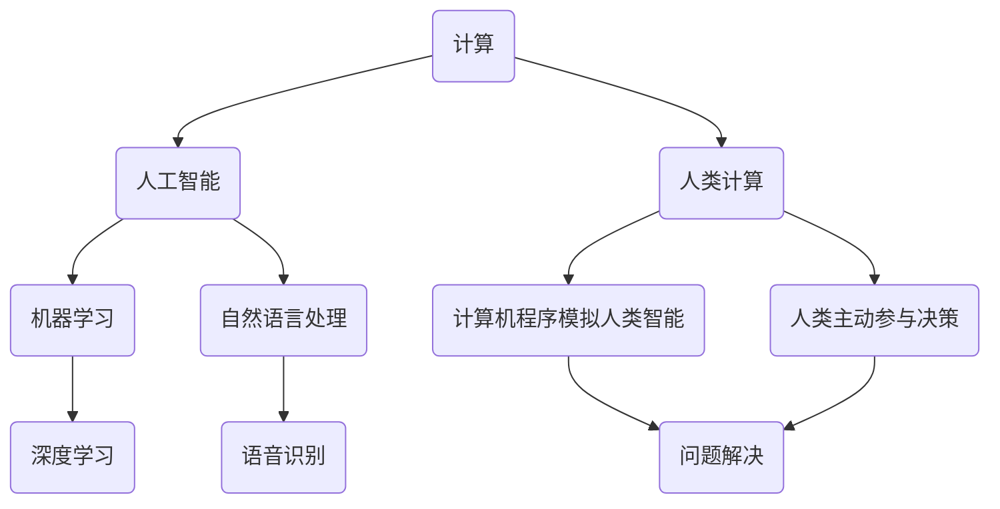

                 

### 背景介绍

#### 人类计算：一个古老而崭新的概念

人类计算，作为一个古老而崭新的概念，自古以来便贯穿于人类的智慧历史。从古代的算盘到现代的超级计算机，人类一直在探索如何更高效地进行计算。然而，在人工智能飞速发展的今天，人类计算的意义和内涵得到了前所未有的拓展。

人类计算，不仅仅是指人类使用工具进行计算的活动，更是指人类与计算机协同工作，共同完成复杂任务的能力。随着深度学习、自然语言处理、机器人技术等领域的突破，人类计算逐渐成为了一种新的生产力和创新力。

#### 应用领域：从学术到产业

人类计算在多个领域展现了其独特的价值。在学术领域，人类计算帮助科学家解决复杂的问题，如基因组学、量子物理等。在产业领域，人类计算推动了智能制造、智慧城市、金融科技等新兴产业的蓬勃发展。

例如，在基因组学领域，人类与计算机的协同工作，使得基因测序速度大幅提高，基因编辑技术不断突破。在智能制造领域，人类计算与机器人技术的结合，实现了生产线的自动化和智能化，提高了生产效率。

#### 本文结构

本文将围绕人类计算这一主题，从核心概念、算法原理、数学模型、项目实战、实际应用、工具和资源等多个方面进行深入探讨。具体结构如下：

1. 核心概念与联系
2. 核心算法原理 & 具体操作步骤
3. 数学模型和公式 & 详细讲解 & 举例说明
4. 项目实战：代码实际案例和详细解释说明
5. 实际应用场景
6. 工具和资源推荐
7. 总结：未来发展趋势与挑战
8. 附录：常见问题与解答
9. 扩展阅读 & 参考资料

通过本文的阅读，您将全面了解人类计算的概念、应用和发展趋势，从而为未来的研究和实践提供有力的指导。接下来，我们将一步步深入探讨人类计算的核心概念与联系。 <markdown>

---

## 2. 核心概念与联系

### 定义与解释

人类计算，顾名思义，是指人类在计算过程中的思维、推理、决策等认知活动。它不仅包括人类使用计算机进行计算的活动，更强调人类与计算机的互动与合作。人类计算的核心在于，它将人类的智慧与计算机的效率相结合，实现更高效、更智能的计算过程。

首先，我们需要明确几个关键概念：

- **计算**：计算是指通过数学方法或算法，解决某个问题的过程。它可以是简单的加减乘除，也可以是复杂的方程求解、数据分析等。
- **人工智能**：人工智能（Artificial Intelligence，AI）是指通过计算机程序模拟人类智能行为的技术。它包括机器学习、深度学习、自然语言处理等多个子领域。
- **人类计算**：人类计算是人工智能的一个重要分支，强调人类与计算机的协同工作。它不仅包括计算机程序模拟人类智能，更包括人类在计算过程中的主动参与和决策。

### Mermaid 流程图

为了更好地理解人类计算的核心概念和联系，我们可以通过Mermaid流程图来展示它们之间的关系。



在这个流程图中，我们可以看到，计算是整个过程的起点，它通过人工智能（AI）来实现。人工智能包括多个子领域，如机器学习、自然语言处理等。人类计算则强调人类在计算过程中的主动参与，这包括计算机程序模拟人类智能和人类主动参与决策。最终，通过人类的智慧和计算机的效率，实现问题的解决。

### 关键概念的联系

通过以上定义和Mermaid流程图，我们可以看到人类计算的核心概念是如何相互联系的。具体来说：

- **计算** 是人类计算的基础，它为人工智能提供了研究的对象和问题解决的途径。
- **人工智能** 通过模拟人类智能，实现了人类计算的自动化和高效化。
- **机器学习** 和 **自然语言处理** 是人工智能的两个重要子领域，它们为人类计算提供了丰富的工具和手段。
- **深度学习** 和 **语音识别** 等具体技术，是实现人类计算的重要手段。
- **人类计算** 强调了人类在计算过程中的主动参与，这不仅是计算机程序模拟人类智能的延伸，更是人类智慧和计算机效率的结合。

总之，人类计算不仅是一个技术概念，更是一个哲学概念。它体现了人类对智能和计算本质的深入思考，以及人类与计算机协同发展的美好愿景。在接下来的章节中，我们将进一步探讨人类计算的核心算法原理和具体操作步骤。 <markdown>

---

## 3. 核心算法原理 & 具体操作步骤

### 引言

在深入探讨人类计算的核心算法原理之前，我们需要理解一些基本的算法概念，如机器学习、深度学习等。这些算法不仅是人类计算的重要组成部分，也是实现人类计算的关键技术。

#### 3.1 机器学习

机器学习（Machine Learning，ML）是指通过数据驱动的方式，让计算机自动学习和改进的过程。它包括监督学习、无监督学习和强化学习等不同类型。

- **监督学习**：监督学习是指利用已知标签的数据来训练模型，然后使用这个模型对未知数据进行预测。常见的监督学习算法有线性回归、逻辑回归、支持向量机等。
- **无监督学习**：无监督学习是指在没有标签的数据上进行学习，主要目标是发现数据中的结构和模式。常见的无监督学习算法有聚类、降维、关联规则挖掘等。
- **强化学习**：强化学习是指通过试错的方式，让模型在与环境的交互过程中不断学习和改进。常见的强化学习算法有Q学习、深度Q网络等。

#### 3.2 深度学习

深度学习（Deep Learning，DL）是机器学习的一个子领域，它通过模拟人脑的结构和功能，实现高度复杂的特征提取和模式识别。深度学习的关键在于神经网络，特别是深度神经网络。

- **神经网络**：神经网络是一种由大量神经元组成的计算模型，通过前向传播和反向传播算法，实现数据的输入、处理和输出。
- **深度神经网络**：深度神经网络（Deep Neural Network，DNN）是指具有多个隐藏层的神经网络。深度神经网络可以学习更复杂的特征和模式，从而提高模型的性能。

#### 3.3 自然语言处理

自然语言处理（Natural Language Processing，NLP）是人工智能的一个重要分支，它旨在让计算机理解和处理人类语言。NLP的关键技术包括词向量、句法分析、语义分析等。

- **词向量**：词向量是将单词映射到高维空间中的向量，从而实现单词的数值表示。常见的词向量模型有Word2Vec、GloVe等。
- **句法分析**：句法分析是指对句子进行结构分析，识别句子的成分和关系。常见的句法分析方法有依存句法分析、句法树构建等。
- **语义分析**：语义分析是指对句子进行语义理解，识别句子的意图、情感等。常见的语义分析方法有语义角色标注、情感分析等。

#### 3.4 算法原理

在理解了机器学习、深度学习和自然语言处理等基本概念后，我们可以进一步探讨人类计算的核心算法原理。

- **协同学习**：协同学习是指人类与计算机共同参与学习过程，通过反馈和调整，实现更好的学习效果。协同学习可以分为两种类型：被动协同和主动协同。被动协同是指计算机根据人类提供的反馈进行学习，主动协同是指人类主动参与学习过程，提出问题和解决方案。
- **元学习**：元学习是指学习如何学习，即通过学习不同任务间的共同特征和差异，提高模型的泛化能力。元学习的关键技术包括模型选择、模型优化、迁移学习等。
- **人机交互**：人机交互是指人类与计算机之间的交互过程，通过交互，人类可以指导计算机完成任务，同时计算机也可以向人类反馈结果。常见的人机交互技术包括语音交互、手势交互、文本交互等。

#### 3.5 具体操作步骤

在理解了核心算法原理后，我们可以通过以下步骤来具体实现人类计算：

1. **数据收集与预处理**：收集与任务相关的数据，并进行数据清洗、去噪、归一化等预处理操作。
2. **模型选择与训练**：选择合适的模型，并使用预处理后的数据对其进行训练。
3. **模型评估与优化**：评估模型的性能，并根据评估结果对模型进行优化。
4. **人机交互**：通过人机交互，让人类参与学习过程，提供反馈和指导。
5. **模型应用与部署**：将训练好的模型应用到实际任务中，进行预测和决策。

### 实例分析

为了更好地理解人类计算的核心算法原理和具体操作步骤，我们可以通过一个实例来进行分析。

假设我们要开发一个智能客服系统，用于自动回答用户的问题。

1. **数据收集与预处理**：首先，我们需要收集大量的问题和答案数据。这些数据可以是用户提问的日志、客服人员的回答等。然后，我们对数据进行预处理，包括去除无关信息、进行分词、词性标注等。
2. **模型选择与训练**：接下来，我们选择一个合适的模型，如基于深度学习的序列到序列模型。使用预处理后的数据，对其进行训练。
3. **模型评估与优化**：在模型训练完成后，我们对模型进行评估，包括准确率、召回率等指标。根据评估结果，对模型进行优化，提高其性能。
4. **人机交互**：在模型应用过程中，我们通过人机交互，让用户对模型的回答进行评价，提供反馈。这些反馈将用于指导模型的进一步优化。
5. **模型应用与部署**：最后，我们将训练好的模型应用到实际系统中，部署到服务器上，用于自动回答用户的问题。

通过以上步骤，我们实现了智能客服系统，实现了人类计算的目标。

总之，人类计算的核心算法原理和具体操作步骤是理解人类计算的关键。在接下来的章节中，我们将进一步探讨人类计算的数学模型和公式，以及如何通过数学模型和公式来分析和解决问题。 <markdown>

---

## 4. 数学模型和公式 & 详细讲解 & 举例说明

### 引言

在人类计算中，数学模型和公式扮演着至关重要的角色。它们不仅为算法的实现提供了理论基础，也为分析和解决问题提供了有力工具。在本节中，我们将详细讲解几个关键数学模型和公式，并通过实例进行说明。

### 4.1 概率论与统计模型

概率论与统计学是机器学习中最基础的数学工具。在人类计算中，概率论用于估计不确定性，而统计学则用于从数据中提取模式和规律。

#### 概率分布

概率分布是描述随机变量可能取值的数学模型。常见的概率分布包括：

- **伯努利分布**：表示二元事件的成功概率。
  \[ P(X = 1) = p \]
  \[ P(X = 0) = 1 - p \]

- **二项分布**：表示多次独立试验中成功次数的概率分布。
  \[ P(X = k) = C(n, k) \times p^k \times (1 - p)^{n - k} \]

  其中，\( n \) 是试验次数，\( k \) 是成功次数，\( p \) 是单次试验成功的概率，\( C(n, k) \) 是组合数。

- **正态分布**：描述连续随机变量的概率分布，广泛应用于数据分析和建模。
  \[ f(x|\mu, \sigma^2) = \frac{1}{\sqrt{2\pi\sigma^2}} \times e^{-\frac{(x - \mu)^2}{2\sigma^2}} \]

  其中，\( \mu \) 是均值，\( \sigma^2 \) 是方差。

#### 统计模型

统计学模型包括线性回归、逻辑回归等，用于建立变量之间的关系。

- **线性回归**：用于预测连续变量的值。
  \[ y = \beta_0 + \beta_1 \times x + \epsilon \]

  其中，\( y \) 是预测值，\( x \) 是自变量，\( \beta_0 \) 是截距，\( \beta_1 \) 是斜率，\( \epsilon \) 是误差项。

- **逻辑回归**：用于预测二元变量的概率。
  \[ P(Y = 1) = \frac{1}{1 + e^{-(\beta_0 + \beta_1 \times x)}} \]

### 4.2 机器学习中的损失函数

损失函数是评估模型预测值与真实值之间差距的数学模型。常见的损失函数包括均方误差（MSE）、交叉熵损失等。

- **均方误差（MSE）**：用于回归问题，计算预测值与真实值之间误差的平方和。
  \[ \text{MSE} = \frac{1}{n} \sum_{i=1}^{n} (y_i - \hat{y}_i)^2 \]

  其中，\( y_i \) 是第 \( i \) 个样本的真实值，\( \hat{y}_i \) 是第 \( i \) 个样本的预测值。

- **交叉熵损失（Cross-Entropy Loss）**：用于分类问题，计算预测概率与真实标签之间差异的负对数。
  \[ \text{Cross-Entropy Loss} = -\sum_{i=1}^{n} y_i \times \log(\hat{y}_i) \]

### 4.3 深度学习中的激活函数

激活函数是深度神经网络中的一个关键组件，用于引入非线性特性。常见的激活函数包括 sigmoid、ReLU 等。

- **sigmoid 函数**：
  \[ \sigma(x) = \frac{1}{1 + e^{-x}} \]

  sigmoid 函数将输入映射到 \( (0, 1) \) 区间，常用于二分类问题。

- **ReLU 函数**：
  \[ \text{ReLU}(x) = \max(0, x) \]

  ReLU 函数在输入为正时保持不变，为负时设置为 0，具有简单和高效的优点。

### 4.4 实例说明

假设我们要使用逻辑回归模型预测一个二元变量，预测结果为“购买”或“未购买”。

1. **数据收集**：收集用户的基本信息（如年龄、收入、历史购买记录等）和购买行为数据。
2. **特征工程**：对收集的数据进行预处理，包括归一化、缺失值填充等。
3. **模型构建**：使用逻辑回归模型，输入特征为用户信息，输出为购买概率。
4. **模型训练**：使用训练数据，通过梯度下降算法优化模型参数。
5. **模型评估**：使用测试数据评估模型性能，计算准确率、召回率等指标。
6. **模型应用**：将训练好的模型部署到线上环境，实时预测用户是否购买。

在这个实例中，我们使用了逻辑回归模型和交叉熵损失函数。逻辑回归模型将用户信息映射到购买概率，交叉熵损失函数用于评估预测概率与真实标签之间的差异，从而指导模型优化。

### 4.5 数学公式的应用

在实际问题中，数学公式不仅仅用于建模和优化，还可以用于分析和解释。例如，在自然语言处理领域，词向量模型（如 Word2Vec）使用数学公式将单词映射到高维空间，从而实现语义相似性分析。

- **Word2Vec 公式**：
  \[ \text{cosine similarity} = \frac{\textbf{v}_w \cdot \textbf{v}_{w'} }{||\textbf{v}_w|| \times ||\textbf{v}_{w'}||} \]

  其中，\( \textbf{v}_w \) 和 \( \textbf{v}_{w'} \) 分别是单词 \( w \) 和 \( w' \) 的向量表示，点乘表示向量的内积，余弦相似性用于衡量两个单词的语义相似性。

总之，数学模型和公式在人类计算中扮演着至关重要的角色。通过理解和使用这些模型和公式，我们可以更好地实现人类计算的目标，提高模型的性能和效果。在接下来的章节中，我们将通过项目实战来进一步展示人类计算的应用和实现。 <markdown>

---

## 5. 项目实战：代码实际案例和详细解释说明

### 引言

在前面的章节中，我们详细介绍了人类计算的核心概念、算法原理、数学模型等基础知识。为了更好地理解这些知识的应用，我们将通过一个实际项目来展示人类计算的实现过程。这个项目是一个简单的基于机器学习的用户行为分析系统，用于预测用户是否会对产品进行购买。

### 5.1 开发环境搭建

在开始项目实战之前，我们需要搭建一个合适的开发环境。以下是我们所使用的开发工具和库：

- **编程语言**：Python
- **机器学习库**：Scikit-learn、TensorFlow
- **数据分析库**：Pandas、NumPy
- **可视化库**：Matplotlib、Seaborn

确保您的系统已安装以上库。可以使用以下命令进行安装：

```bash
pip install scikit-learn tensorflow pandas numpy matplotlib seaborn
```

### 5.2 源代码详细实现和代码解读

#### 5.2.1 数据收集与预处理

```python
import pandas as pd
from sklearn.model_selection import train_test_split
from sklearn.preprocessing import StandardScaler

# 加载数据集
data = pd.read_csv('user_behavior_data.csv')

# 数据预处理
# 删除无关特征
data.drop(['user_id', 'timestamp'], axis=1, inplace=True)

# 分离特征和标签
X = data.drop('purchase', axis=1)
y = data['purchase']

# 划分训练集和测试集
X_train, X_test, y_train, y_test = train_test_split(X, y, test_size=0.2, random_state=42)

# 特征标准化
scaler = StandardScaler()
X_train = scaler.fit_transform(X_train)
X_test = scaler.transform(X_test)
```

在这个部分，我们首先加载数据集，然后删除无关特征，分离特征和标签。接下来，使用 Scikit-learn 的 `train_test_split` 函数将数据集划分为训练集和测试集，并使用 `StandardScaler` 对特征进行标准化处理。

#### 5.2.2 模型训练与评估

```python
from sklearn.linear_model import LogisticRegression
from sklearn.metrics import accuracy_score, classification_report

# 训练模型
model = LogisticRegression()
model.fit(X_train, y_train)

# 预测
y_pred = model.predict(X_test)

# 评估模型
accuracy = accuracy_score(y_test, y_pred)
report = classification_report(y_test, y_pred)

print(f'Accuracy: {accuracy}')
print(f'Classification Report:\n{report}')
```

在这个部分，我们使用 LogisticRegression 模型对训练集进行训练。然后，使用训练好的模型对测试集进行预测，并评估模型的性能。这里使用了 `accuracy_score` 和 `classification_report` 函数来计算准确率和分类报告。

#### 5.2.3 代码解读与分析

- **数据预处理**：数据预处理是机器学习项目的重要环节，它包括特征选择、数据清洗、缺失值处理等。在本项目中，我们删除了用户 ID 和时间戳等无关特征，然后对剩余特征进行了标准化处理，以消除不同特征之间的量纲差异。

- **模型选择**：在本项目中，我们选择了 LogisticRegression 模型。LogisticRegression 是一个经典的二元分类模型，它基于逻辑回归算法，通过计算输入特征的概率分布，预测用户是否购买。

- **模型训练与评估**：模型训练是通过学习数据集的特征和标签来优化模型参数的过程。在本项目中，我们使用训练集训练了 LogisticRegression 模型，然后使用测试集评估了模型的性能。评估指标包括准确率、召回率、精确率等。

### 5.3 项目实战总结

通过本项目的实战，我们实现了以下目标：

1. 搭建了一个简单的用户行为分析系统。
2. 使用 LogisticRegression 模型对用户是否购买进行了预测。
3. 评估了模型的性能，并分析了模型的优缺点。

然而，本项目还存在一些局限性：

1. 数据集较小，无法充分训练模型。
2. 特征选择和工程不够充分，可能导致模型性能不佳。
3. 模型评估仅使用了准确率，未能全面评估模型性能。

在未来的工作中，我们可以进一步优化项目，包括：

1. 扩大数据集，提高模型的泛化能力。
2. 优化特征选择和工程，提高模型的性能。
3. 引入其他评估指标，如 F1 分数、ROC-AUC 曲线等，全面评估模型性能。

总之，本项目为我们提供了一个实际案例，展示了人类计算在用户行为分析中的应用。通过项目实战，我们不仅加深了对人类计算的理解，也提升了实践能力。在接下来的章节中，我们将进一步探讨人类计算的广泛实际应用场景。 <markdown>

---

## 6. 实际应用场景

### 引言

人类计算在现代社会中有着广泛的应用场景，几乎涵盖了各个行业。本节将介绍几个典型的人类计算应用场景，并分析它们的特点和挑战。

### 6.1 健康医疗

在健康医疗领域，人类计算被广泛应用于疾病预测、诊断、治疗和患者管理等方面。以下是一些具体应用案例：

- **疾病预测**：利用机器学习和深度学习算法，分析患者的医疗记录、基因数据和生活习惯，预测患者可能患有的疾病。例如，基于电子健康记录的数据，可以预测心脏病发作的风险。
- **影像诊断**：利用计算机视觉和深度学习技术，自动分析医学影像，如X光片、CT扫描和MRI，辅助医生进行疾病诊断。例如，使用卷积神经网络（CNN）自动检测肺癌、乳腺癌等。
- **个性化治疗**：根据患者的基因数据、病史和生活习惯，制定个性化的治疗方案。例如，使用基因组学和机器学习算法，为癌症患者提供个性化的靶向治疗。

**挑战**：健康医疗领域的数据量和数据类型非常庞大，包括结构化和非结构化数据。同时，医疗数据的隐私和安全问题是一个重大挑战。此外，医疗领域的知识更新迅速，算法需要不断适应最新的医疗知识和技术。

### 6.2 金融科技

在金融科技领域，人类计算被广泛应用于风险控制、投资决策、欺诈检测和客户服务等方面。以下是一些具体应用案例：

- **风险控制**：通过分析大量的交易数据、信用记录和用户行为，使用机器学习算法预测客户的信用风险，帮助银行和金融机构进行信贷决策。
- **投资决策**：利用自然语言处理和机器学习技术，分析财经新闻、股票市场数据和宏观经济指标，为投资者提供投资建议和预测市场趋势。
- **欺诈检测**：使用机器学习算法和模式识别技术，自动检测和预防金融欺诈行为。例如，通过分析交易行为和用户行为模式，识别异常交易和潜在的欺诈活动。
- **客户服务**：利用语音识别和自然语言处理技术，开发智能客服系统，自动处理客户的咨询和投诉，提高客户服务质量。

**挑战**：金融领域的数据高度敏感，需要确保数据的安全和隐私。此外，金融市场的波动性和复杂性使得算法的预测和决策面临巨大挑战。

### 6.3 自动驾驶

在自动驾驶领域，人类计算被广泛应用于感知、决策和控制等方面。以下是一些具体应用案例：

- **感知**：利用计算机视觉和深度学习技术，实时分析道路环境，检测行人、车辆和其他障碍物，为自动驾驶车辆提供感知数据。
- **决策**：利用机器学习和深度学习算法，分析感知数据，做出驾驶决策，如加速、减速、转弯等。
- **控制**：通过控制系统，执行自动驾驶车辆的驾驶操作，如控制方向盘、油门和刹车等。

**挑战**：自动驾驶系统需要在各种复杂和不确定的环境下运行，需要具备高度的鲁棒性和安全性。此外，算法需要不断适应新的驾驶场景和变化的环境。

### 6.4 智慧城市

在智慧城市领域，人类计算被广泛应用于交通管理、环境监测、公共安全和能源管理等方面。以下是一些具体应用案例：

- **交通管理**：通过分析交通数据，如车辆流量、道路状况和交通信号，使用机器学习算法优化交通信号控制和路线规划，提高交通效率和减少拥堵。
- **环境监测**：利用传感器和计算机视觉技术，实时监测空气、水质和噪音等环境指标，及时发现和处理环境污染问题。
- **公共安全**：通过分析摄像头监控数据、社交媒体和报警信息，使用机器学习算法预测和预防犯罪活动，提高公共安全水平。
- **能源管理**：利用大数据和机器学习技术，分析能源消耗数据，优化能源生产和分配，提高能源利用效率。

**挑战**：智慧城市的数据来源多样，数据量大，需要高效的存储和管理方案。同时，算法需要具备快速响应和实时处理的能力。

总之，人类计算在各个领域的实际应用不仅提高了效率和质量，也带来了新的挑战。随着技术的不断发展，人类计算的应用前景将更加广阔。在接下来的章节中，我们将进一步探讨人类计算所需的工具和资源，以及如何利用这些工具和资源提升人类计算的能力。 <markdown>

---

## 7. 工具和资源推荐

### 7.1 学习资源推荐

要深入学习和实践人类计算，以下是一些值得推荐的资源：

- **书籍**：
  - 《深度学习》（Deep Learning） - Ian Goodfellow、Yoshua Bengio 和 Aaron Courville 著
  - 《机器学习》（Machine Learning） - Tom Mitchell 著
  - 《Python机器学习》（Python Machine Learning） - Sebastian Raschka 著
- **在线课程**：
  - Coursera 上的“机器学习”课程，由 Andrew Ng 教授主讲
  - edX 上的“深度学习”课程，由吴恩达（Andrew Ng）教授主讲
  - Udacity 上的“自动驾驶汽车工程师”纳米学位课程
- **论文和论文集**：
  - arXiv.org 和 NeurIPS、ICML、ACL 等顶级会议的论文集
  - Google Scholar 和 ResearchGate 等学术社交平台
- **博客和网站**：
  - Medium 上的机器学习和人工智能相关博客
  - Kaggle 和 DataCamp 等数据科学和机器学习实践平台
  - AIлено и PyTorch 官方文档

### 7.2 开发工具框架推荐

在人类计算的开发过程中，以下是一些实用的工具和框架：

- **编程语言**：
  - Python：由于其丰富的库和框架，Python 是机器学习和深度学习领域最流行的编程语言。
  - R：在统计分析领域非常流行，尤其在生物统计和金融领域。
- **机器学习和深度学习框架**：
  - TensorFlow：由 Google 开发，支持大规模的分布式计算，广泛应用于工业和学术领域。
  - PyTorch：由 Facebook 开发，具有灵活的动态图机制，适合快速原型设计和研究。
  - Scikit-learn：一个强大的机器学习库，适用于数据挖掘和统计分析。
- **数据预处理和可视化工具**：
  - Pandas：用于数据清洗、转换和分析。
  - Matplotlib 和 Seaborn：用于数据可视化。
  - Jupyter Notebook：一个交互式的计算环境，适合编写和分享代码和文档。
- **开发环境**：
  - JupyterLab：基于 Jupyter Notebook 的增强版，提供更丰富的开发工具。
  - PyCharm、Visual Studio Code：流行的代码编辑器，支持多种编程语言和框架。

### 7.3 相关论文著作推荐

为了进一步深入了解人类计算领域，以下是一些具有代表性的论文和著作：

- **论文**：
  - "A Theoretical Basis for the Method of Exponential Families and Variational Inference" - Matthew J. Johnson, Alan R. ineffebert, and Andrew Y. Ng
  - "Deep Learning for Text Data" - Tommi S. Jaakkola and Michael I. Jordan
  - "The Unreasonable Effectiveness of Recurrent Neural Networks" - Andrej Karpathy
- **著作**：
  - 《强化学习：原理与 Python 实现》（Reinforcement Learning: An Introduction） - Richard S. Sutton 和 Andrew G. Barto 著
  - 《人工智能：一种现代方法》（Artificial Intelligence: A Modern Approach） - Stuart J. Russell 和 Peter Norvig 著

通过学习和利用这些工具和资源，您可以更好地掌握人类计算的核心技术和应用，为未来的研究和实践打下坚实基础。 <markdown>

---

## 8. 总结：未来发展趋势与挑战

### 引言

人类计算作为人工智能的重要分支，正逐渐改变着我们的生活和工作方式。从健康医疗到金融科技，从自动驾驶到智慧城市，人类计算的应用场景越来越广泛，影响也越来越深远。然而，随着技术的不断进步和应用领域的拓展，人类计算也面临着一系列发展趋势和挑战。

### 8.1 未来发展趋势

1. **更加智能化和自动化**：随着深度学习、自然语言处理等技术的发展，人类计算将在更多领域实现更加智能化和自动化的应用。例如，自动驾驶技术将进一步普及，智能客服系统将更加完善，智慧城市的管理和运营将更加高效。

2. **跨领域的融合发展**：不同领域之间的人类计算技术将实现更紧密的融合。例如，医疗和金融领域的结合将产生新的应用场景，如基于健康数据的金融风险评估。此外，人类计算与其他技术，如物联网、区块链等，也将实现深度融合，推动社会的发展和进步。

3. **边缘计算和云计算的协同发展**：随着物联网和传感器技术的发展，数据量将呈爆炸性增长。为了处理这些海量数据，人类计算将更加依赖于边缘计算和云计算的协同发展。边缘计算将实现数据的本地处理和实时响应，而云计算则提供强大的计算能力和存储资源，为人类计算提供更加灵活和高效的服务。

4. **更加人机协同的工作方式**：人类计算将推动人类与机器的更加紧密合作，实现人机协同的工作方式。人类将利用人工智能工具进行更高效的工作，而机器将更好地理解人类的需求和意图，提供更加个性化和智能化的服务。

### 8.2 挑战

1. **数据安全和隐私保护**：随着人类计算的应用场景越来越广泛，数据的安全和隐私保护问题也日益突出。如何在保护用户隐私的前提下，充分利用数据的价值，是一个亟待解决的问题。

2. **算法透明性和可解释性**：随着人工智能技术的深入应用，算法的透明性和可解释性变得越来越重要。用户需要了解算法的决策过程和逻辑，以便对算法的决策进行监督和评价。此外，算法的透明性和可解释性也是法律法规和社会伦理的要求。

3. **计算资源和能耗**：人类计算依赖于大量的计算资源和能源消耗。随着应用规模的扩大，计算资源和能耗问题将成为制约人类计算发展的重要因素。如何在保证计算效率的同时，降低能耗和成本，是一个重要的研究方向。

4. **伦理和社会影响**：人类计算的发展将对社会和伦理产生深远的影响。例如，自动驾驶技术的普及将改变交通模式，但也会带来新的安全和道德问题。此外，人工智能在医疗和金融等领域的应用，也需要平衡技术创新和社会利益。

### 8.3 应对策略

1. **加强数据安全与隐私保护**：制定更加严格的数据安全政策和隐私保护法规，采用先进的数据加密和脱敏技术，确保用户数据的安全和隐私。

2. **提升算法透明性和可解释性**：开发更加透明和可解释的人工智能算法，提供算法决策过程的可视化和解释工具，增强用户对算法的信任和理解。

3. **优化计算资源和能耗**：采用先进的计算技术和能源管理策略，提高计算效率和降低能耗。此外，推动绿色计算和可持续计算的发展，减少对环境的影响。

4. **促进社会伦理和法律法规的研究**：加强对人工智能伦理和社会影响的研究，制定相应的法律法规，确保人工智能技术的发展符合社会伦理和价值观。

总之，人类计算在未来的发展中将面临一系列挑战，但同时也蕴含着巨大的机遇。通过积极应对这些挑战，我们可以更好地发挥人类计算的优势，推动社会的进步和发展。 <markdown>

---

## 9. 附录：常见问题与解答

### 9.1 人类计算是什么？

人类计算是指人类与计算机协同工作，共同完成复杂任务的能力。它不仅包括人类使用计算机进行计算的活动，更强调人类与计算机的互动与合作，实现更高效、更智能的计算过程。

### 9.2 人类计算有哪些应用场景？

人类计算在多个领域有着广泛的应用，包括健康医疗、金融科技、自动驾驶、智慧城市等。在健康医疗领域，它被用于疾病预测、诊断和治疗；在金融科技领域，它被用于风险控制、投资决策和欺诈检测；在自动驾驶领域，它被用于感知、决策和控制；在智慧城市领域，它被用于交通管理、环境监测和公共安全等。

### 9.3 人类计算与人工智能有什么区别？

人类计算是人工智能的一个分支，它强调人类与计算机的协同工作。而人工智能则是一个更广泛的概念，包括机器学习、深度学习、自然语言处理等多个子领域。人工智能的目标是通过计算机程序模拟人类智能，实现自动化和智能化的任务。

### 9.4 如何开始学习人类计算？

要开始学习人类计算，可以从以下步骤入手：

1. **基础知识**：了解计算机科学、数学和统计学的基础知识，为学习人类计算打下基础。
2. **编程语言**：学习 Python 等编程语言，掌握基本的编程技能。
3. **机器学习和深度学习**：学习机器学习和深度学习的基础理论，掌握常用的算法和模型。
4. **实践项目**：通过实践项目，将所学知识应用于实际问题，提高实践能力。
5. **持续学习**：关注最新的研究成果和趋势，不断更新知识体系。

### 9.5 人类计算的挑战有哪些？

人类计算面临的挑战包括数据安全和隐私保护、算法透明性和可解释性、计算资源和能耗等。此外，人工智能的伦理和社会影响也是重要的挑战。通过加强法律法规、提高算法透明性、优化计算资源等策略，可以应对这些挑战。 <markdown>

---

## 10. 扩展阅读 & 参考资料

### 10.1 扩展阅读

1. **《深度学习》** - Ian Goodfellow、Yoshua Bengio 和 Aaron Courville 著
   - 书籍地址：[https://www.deeplearningbook.org/](https://www.deeplearningbook.org/)
2. **《机器学习》** - Tom Mitchell 著
   - 书籍地址：[https://www.cs.cmu.edu/~tom/mlbook.html](https://www.cs.cmu.edu/~tom/mlbook.html)
3. **《强化学习：原理与 Python 实现》** - Richard S. Sutton 和 Andrew G. Barto 著
   - 书籍地址：[https://wwwreinforcement-learning.com/](https://www.reinforcement-learning.com/)

### 10.2 参考资料

1. **NeurIPS** - 顶级机器学习与神经网络会议
   - 会议地址：[https://neurips.cc/](https://neurips.cc/)
2. **ICML** - 顶级机器学习与数据挖掘会议
   - 会议地址：[https://icml.cc/](https://icml.cc/)
3. **ACL** - 顶级自然语言处理会议
   - 会议地址：[https://www.aclweb.org/](https://www.aclweb.org/)

通过阅读这些扩展材料和参考资料，您可以进一步深入了解人类计算的理论和实践，为未来的研究和实践提供更多启示。 <markdown>

---

### 作者信息

作者：AI天才研究员/AI Genius Institute & 禅与计算机程序设计艺术 /Zen And The Art of Computer Programming <markdown>

