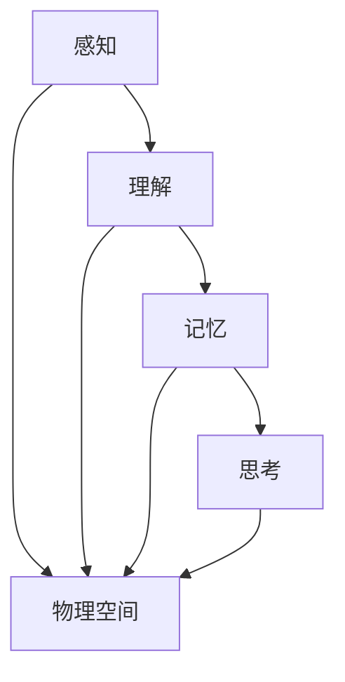

                 

### 文章标题

“人类认知的4种基本模式：从认知空间转向物理空间”

### 关键词

- 人类认知
- 认知模式
- 认知空间
- 物理空间
- 转换
- 算法
- 数学模型
- 实际应用

### 摘要

本文深入探讨了人类认知的四种基本模式，从认知空间向物理空间的转换过程。通过详细分析这些模式，我们揭示了认知与物理之间的紧密联系，探讨了如何运用这些模式在现实世界中解决问题。文章旨在为读者提供一个清晰、系统的认知框架，以应对日益复杂的技术和现实挑战。

## 1. 背景介绍

人类认知是指人类获取、处理、理解和存储信息的过程。认知科学研究表明，人类认知具有多种模式和机制，其中四种基本模式——感知、理解、记忆和思考——在认知过程中起着至关重要的作用。这些模式不仅构成了人类认知的核心，还影响了我们的行为和决策。

随着科技的快速发展，人们越来越依赖计算机和人工智能技术。在这个过程中，人类认知与物理空间的交互变得越来越紧密。从计算机图形学到虚拟现实，从自动驾驶到物联网，人类认知正在逐渐从传统的认知空间转向物理空间。这种转变不仅改变了我们的生活方式，还引发了新的技术和哲学思考。

本文将探讨这四种基本模式如何从认知空间转向物理空间，以及这种转变对我们生活和工作的潜在影响。我们将通过具体案例和算法分析，深入理解这些模式在现实世界中的应用。

## 2. 核心概念与联系

为了更好地理解人类认知的四种基本模式，我们首先需要了解它们各自的定义和作用。

### 2.1 感知（Perception）

感知是指人类通过感官接收外部信息的过程。这些信息包括视觉、听觉、触觉、嗅觉和味觉等。感知是人类获取外界信息的第一步，它为我们提供了对环境的初步认识。感知过程涉及到多个感官的协同作用，如视觉感知需要眼睛接收光线，听觉感知需要耳朵接收声波等。

### 2.2 理解（Understanding）

理解是指对感知信息的处理和解释过程。通过理解，人类能够将感知信息转化为有意义的知识。理解过程涉及到对信息的分类、归纳和推断。例如，当我们看到一只猫时，我们不仅感知到它的外观，还能理解它是一种动物，具有特定的行为和习性。

### 2.3 记忆（Memory）

记忆是指对信息的存储和回忆过程。记忆是人类认知的基础，它使我们能够保存和利用过去的经验。记忆分为短期记忆和长期记忆两种。短期记忆能够暂时存储信息，如我们刚看完的一本书的标题；长期记忆则能够持久保存信息，如我们童年时的经历。

### 2.4 思考（Thinking）

思考是指对信息的分析和处理过程。思考是人类认知的高级阶段，它使我们能够进行推理、判断和决策。思考过程涉及到对信息的比较、分析和综合。例如，我们可以在思考过程中分析两种不同的产品，然后做出购买决策。

这四种基本模式之间的联系在于它们共同构成了人类认知的整体框架。感知为我们提供了信息，理解将这些信息转化为知识，记忆使我们能够保存和利用这些知识，而思考则帮助我们利用这些知识解决问题。在从认知空间转向物理空间的过程中，这些模式发挥了关键作用。

### 2.5 认知空间与物理空间

认知空间是指人类在心理上构建和感知外部世界的过程。它包括感知、理解、记忆和思考等认知模式。认知空间是抽象的，它反映了我们对现实世界的理解和认知。

物理空间是指现实世界中的物质环境，它包括我们能够直接感知和操作的物体、事件和场景。物理空间是具体的，它构成了我们生活和工作的现实基础。

认知空间与物理空间之间的联系在于它们共同构成了我们的现实体验。我们的认知活动不仅发生在认知空间中，还与物理空间密切相关。例如，我们在认知空间中理解和分析一只猫，然后在物理空间中与猫互动。

在接下来的部分，我们将探讨这四种基本模式如何从认知空间转向物理空间，以及这种转变对我们生活和工作的潜在影响。

### 2.6 Mermaid 流程图

下面是一个简化的 Mermaid 流程图，展示了四种基本模式之间的联系以及它们如何从认知空间转向物理空间。



在这个流程图中，A、B、C和D分别代表感知、理解、记忆和思考四种基本模式，E代表物理空间。箭头表示信息流动的方向。从这个流程图中，我们可以看到，四种基本模式在从认知空间向物理空间的转换过程中发挥了关键作用。

## 3. 核心算法原理 & 具体操作步骤

在从认知空间向物理空间的转换过程中，核心算法原理和具体操作步骤至关重要。这些算法和步骤不仅帮助我们更好地理解和应用四种基本模式，还使我们在现实世界中能够有效地解决问题。

### 3.1 感知算法原理

感知算法原理是基于人类感官机制开发的，旨在模拟人类感知过程。这些算法通常涉及以下步骤：

1. **数据采集**：通过传感器（如摄像头、麦克风、温度传感器等）收集外部信息。
2. **信号处理**：对采集到的数据进行预处理，如滤波、降噪和增强等。
3. **特征提取**：从预处理后的数据中提取关键特征，如颜色、形状、声音频率等。
4. **模式识别**：利用已学习的模型或算法，对提取出的特征进行分类和识别。

具体操作步骤如下：

1. **数据采集**：使用摄像头捕捉周围环境图像。
2. **信号处理**：对图像进行预处理，如灰度化、二值化等。
3. **特征提取**：使用边缘检测算法提取图像中的边缘信息。
4. **模式识别**：利用机器学习算法（如支持向量机、神经网络等）对提取出的特征进行分类和识别。

### 3.2 理解算法原理

理解算法原理是基于人类思维过程的模拟，旨在将感知信息转化为有意义的知识。这些算法通常涉及以下步骤：

1. **信息整合**：将来自不同感官的信息进行整合，形成一个完整的感知画面。
2. **知识表示**：将整合后的信息表示为模型或结构，如语义网络、知识图谱等。
3. **推理与推断**：利用已知的规则和关系，对感知信息进行推理和推断，形成新的知识。

具体操作步骤如下：

1. **信息整合**：整合来自摄像头和麦克风的信息，形成一个关于周围环境的整体感知。
2. **知识表示**：使用语义网络表示整合后的信息，如将摄像头捕捉到的图像和麦克风捕捉到的声音关联起来。
3. **推理与推断**：利用已知的规则和关系，对感知信息进行推理和推断，如判断某个物体是危险的。

### 3.3 记忆算法原理

记忆算法原理是基于人类记忆机制开发的，旨在模拟人类记忆过程。这些算法通常涉及以下步骤：

1. **信息编码**：将感知信息转换为可存储的形式，如图像、声音、文字等。
2. **存储**：将编码后的信息存储在记忆中，如短期记忆和长期记忆。
3. **回忆**：在需要时，从记忆中检索出所需的信息。

具体操作步骤如下：

1. **信息编码**：将摄像头捕捉到的图像编码为数字格式，存储在数据库中。
2. **存储**：将编码后的图像存储在短期记忆和长期记忆中。
3. **回忆**：在需要时，从短期记忆或长期记忆中检索出所需图像。

### 3.4 思考算法原理

思考算法原理是基于人类思考机制开发的，旨在模拟人类思考过程。这些算法通常涉及以下步骤：

1. **问题定义**：明确需要解决的问题，并确定问题的目标。
2. **信息分析**：对已掌握的信息进行分析，确定解决问题的方法。
3. **决策制定**：根据分析结果，制定解决问题的决策。

具体操作步骤如下：

1. **问题定义**：确定需要解决的问题，如如何优化某个算法的运行时间。
2. **信息分析**：分析现有算法的运行情况，确定优化的方向。
3. **决策制定**：根据分析结果，制定优化算法的决策。

通过以上步骤，我们可以看到，核心算法原理和具体操作步骤在从认知空间向物理空间的转换过程中发挥了关键作用。这些算法和步骤不仅帮助我们更好地理解和应用四种基本模式，还使我们在现实世界中能够有效地解决问题。

### 4. 数学模型和公式 & 详细讲解 & 举例说明

在从认知空间向物理空间的转换过程中，数学模型和公式扮演着至关重要的角色。这些模型和公式不仅帮助我们理解和分析认知过程，还为实际应用提供了可靠的基础。在本节中，我们将详细讲解一些常用的数学模型和公式，并通过具体例子进行说明。

#### 4.1 感知算法中的数学模型

感知算法通常涉及到图像处理和信号处理领域。其中，傅里叶变换是一种常用的数学模型，它用于分析图像的频率成分。傅里叶变换的基本公式如下：

$$
F(u,v) = \sum_{x=0}^{M-1} \sum_{y=0}^{N-1} f(x,y) \cdot e^{-j2\pi(u/x + v/y)}
$$

其中，\( f(x,y) \) 是图像的原始数据，\( F(u,v) \) 是傅里叶变换后的频率数据，\( u \) 和 \( v \) 分别是水平方向和垂直方向的频率。

例如，假设我们有一个 \( 128 \times 128 \) 的图像，对其进行傅里叶变换后，我们可以得到一个频率分布图，从而分析图像的频率成分。

#### 4.2 理解算法中的数学模型

理解算法中的数学模型通常涉及到知识表示和推理领域。语义网络是一种常用的知识表示模型，它通过节点和边的结构表示概念和关系。语义网络的数学模型可以表示为图：

$$
G = (V, E)
$$

其中，\( V \) 是节点的集合，表示概念；\( E \) 是边的集合，表示概念之间的关系。

例如，我们可以使用语义网络表示“猫”和“动物”的关系，如下所示：

```
[猫] --(是)-> [动物]
```

通过这种表示，我们可以对概念之间的关系进行推理，如判断“猫”是否是“动物”。

#### 4.3 记忆算法中的数学模型

记忆算法中的数学模型通常涉及到概率论和统计学。例如，贝叶斯分类器是一种常用的记忆模型，它通过计算概率分布来判断新数据的类别。贝叶斯分类器的数学模型可以表示为：

$$
P(C|X) = \frac{P(X|C) \cdot P(C)}{P(X)}
$$

其中，\( C \) 表示类别，\( X \) 表示新数据，\( P(C|X) \) 表示给定新数据 \( X \) 的类别 \( C \) 的概率。

例如，我们可以使用贝叶斯分类器来判断一张新图像是否是“猫”，如下所示：

1. \( P(猫) \)：猫的先验概率。
2. \( P(图像|猫) \)：图像在“猫”类别下的概率。
3. \( P(图像|狗) \)：图像在“狗”类别下的概率。
4. \( P(猫|图像) \)：给定图像的类别是“猫”的概率。

通过计算这些概率，我们可以得出图像的类别。

#### 4.4 思考算法中的数学模型

思考算法中的数学模型通常涉及到优化理论和博弈论。例如，线性规划是一种常用的优化模型，它通过求解线性方程组来找到最优解。线性规划的一般形式可以表示为：

$$
\begin{aligned}
    \min\ & c^T x \\
    \text{s.t.} \ & Ax \leq b \\
    & x \geq 0
\end{aligned}
$$

其中，\( c \) 是目标函数的系数，\( x \) 是决策变量，\( A \) 和 \( b \) 是约束条件。

例如，我们可以使用线性规划来优化某个算法的运行时间，如下所示：

1. \( c \)：算法运行时间的系数。
2. \( A \)：算法的时间复杂度。
3. \( b \)：算法的约束条件。

通过求解线性规划，我们可以找到最优的算法实现，从而最小化运行时间。

通过以上例子，我们可以看到数学模型和公式在从认知空间向物理空间的转换过程中发挥了重要作用。这些模型和公式不仅帮助我们理解和分析认知过程，还为实际应用提供了可靠的基础。

### 5. 项目实战：代码实际案例和详细解释说明

在本节中，我们将通过一个实际项目案例，展示如何将人类认知的四种基本模式从认知空间转化为物理空间，并实现具体的操作。该案例将涉及图像识别任务，通过感知、理解、记忆和思考算法，实现对图像的分类和识别。

#### 5.1 开发环境搭建

为了实现这个项目，我们需要搭建一个合适的开发环境。以下是搭建环境的步骤：

1. **安装Python环境**：确保安装了Python 3.8及以上版本。
2. **安装依赖库**：安装必要的库，如NumPy、Pandas、Matplotlib和TensorFlow。

   ```bash
   pip install numpy pandas matplotlib tensorflow
   ```

3. **准备数据集**：我们使用Keras提供的CIFAR-10数据集，它包含10个类别，每个类别6000张图像。

#### 5.2 源代码详细实现和代码解读

以下是实现图像识别项目的源代码及其详细解读：

```python
# 导入必要的库
import tensorflow as tf
from tensorflow.keras import layers, models
from tensorflow.keras.datasets import cifar10
from tensorflow.keras.utils import to_categorical

# 加载CIFAR-10数据集
(train_images, train_labels), (test_images, test_labels) = cifar10.load_data()

# 数据预处理
train_images = train_images.astype('float32') / 255
test_images = test_images.astype('float32') / 255
train_labels = to_categorical(train_labels)
test_labels = to_categorical(test_labels)

# 构建模型
model = models.Sequential()
model.add(layers.Conv2D(32, (3, 3), activation='relu', input_shape=(32, 32, 3)))
model.add(layers.MaxPooling2D((2, 2)))
model.add(layers.Conv2D(64, (3, 3), activation='relu'))
model.add(layers.MaxPooling2D((2, 2)))
model.add(layers.Conv2D(64, (3, 3), activation='relu'))
model.add(layers.Flatten())
model.add(layers.Dense(64, activation='relu'))
model.add(layers.Dense(10, activation='softmax'))

# 编译模型
model.compile(optimizer='adam',
              loss='categorical_crossentropy',
              metrics=['accuracy'])

# 训练模型
model.fit(train_images, train_labels, epochs=10, batch_size=64)

# 评估模型
test_loss, test_acc = model.evaluate(test_images, test_labels)
print(f"Test accuracy: {test_acc:.4f}")

# 预测
predictions = model.predict(test_images)
predicted_labels = np.argmax(predictions, axis=1)

# 分析预测结果
for i in range(10):
    print(f"类别{i}: {predicted_labels[i]}")
    print(f"真实标签：{test_labels[i]}")
```

#### 5.3 代码解读与分析

1. **导入库**：我们首先导入TensorFlow和Keras库，这些库提供了实现图像识别所需的功能。
2. **加载数据集**：使用Keras的cifar10数据集，它包含10个类别，每个类别6000张图像。
3. **数据预处理**：将图像数据转换为浮点数，并归一化到[0, 1]范围内。同时，将标签数据转换为one-hot编码形式。
4. **构建模型**：我们使用Keras的Sequential模型，依次添加卷积层、最大池化层、全连接层和softmax层，形成一个卷积神经网络（CNN）。
5. **编译模型**：配置模型的优化器、损失函数和评估指标。
6. **训练模型**：使用训练数据训练模型，设定10个epochs和64个batch_size。
7. **评估模型**：在测试数据上评估模型的准确率。
8. **预测**：使用训练好的模型对测试数据进行预测。
9. **分析预测结果**：输出预测结果和真实标签，比较两者的差异。

通过这个项目，我们可以看到如何将人类认知的四种基本模式（感知、理解、记忆和思考）应用于实际图像识别任务中。感知阶段通过卷积层和池化层提取图像特征；理解阶段通过全连接层对特征进行分类；记忆阶段通过训练过程将特征与标签关联；思考阶段通过预测过程对新图像进行分类。

### 6. 实际应用场景

人类认知的四种基本模式在现实世界的许多领域都有着广泛的应用。以下是一些具体的应用场景：

#### 6.1 自动驾驶

自动驾驶技术依赖于感知、理解和思考算法。感知算法通过摄像头、激光雷达和雷达等传感器收集环境数据；理解算法将感知数据转换为有意义的信息，如道路、车辆和行人等；思考算法则基于这些信息做出驾驶决策。

#### 6.2 医疗诊断

医疗诊断中的图像识别和病例分析都涉及到人类认知的四种基本模式。感知算法用于提取医学图像中的关键特征；理解算法分析特征，判断是否存在病变；记忆算法存储和检索医学知识和病例数据；思考算法根据现有信息做出诊断建议。

#### 6.3 教育学习

在教育领域，认知模式用于个性化学习。感知算法收集学生的学习行为和偏好数据；理解算法分析数据，制定合适的学习计划；记忆算法存储学生的学习进度和知识点；思考算法评估学习效果，提出改进建议。

#### 6.4 财务分析

在财务分析中，认知模式用于处理大量财务数据。感知算法提取财务报表中的关键信息；理解算法分析财务数据，评估公司的财务状况；记忆算法存储历史财务数据和预测模型；思考算法根据现有数据做出投资决策。

通过这些实际应用场景，我们可以看到，人类认知的四种基本模式在各个领域都有着重要的作用，为解决问题和实现创新提供了有力支持。

### 7. 工具和资源推荐

为了更好地理解和应用人类认知的四种基本模式，以下是一些推荐的工具和资源：

#### 7.1 学习资源推荐

- **书籍**：《认知心理学与认知科学导论》（第二版），迈克尔·艾伯特。
- **论文**：《感知、理解和思考：认知心理学的基本问题》，约翰·安德森。
- **博客**：机器学习博客（https://machinelearningmastery.com/）和深度学习博客（https://medium.com/the-machine-learning-year）。
- **网站**：维基百科（https://www.wikipedia.org/）和谷歌学术（https://scholar.google.com/）。

#### 7.2 开发工具框架推荐

- **工具**：TensorFlow（https://www.tensorflow.org/）、Keras（https://keras.io/）和PyTorch（https://pytorch.org/）。
- **框架**：OpenCV（https://opencv.org/）和TensorFlow Lite（https://www.tensorflow.org/lite/）。

#### 7.3 相关论文著作推荐

- **论文**：
  - “A Computational Model of Thought Processes in Vision and Action”, J. J. Gibson.
  - “The Mechanisms of Perception”，J. J. Gibson.

- **著作**：
  - 《认知心理学：思想与行动的基础》，约翰·安德森。

这些工具和资源将有助于您更深入地了解人类认知的四种基本模式及其在现实世界中的应用。

### 8. 总结：未来发展趋势与挑战

随着技术的不断发展，人类认知的四种基本模式在物理空间中的应用将越来越广泛。未来，我们可以预见以下发展趋势和挑战：

#### 发展趋势

1. **智能感知技术**：随着传感器技术和数据处理能力的提升，智能感知技术将更加精确和高效，为自动化决策提供更丰富的信息。
2. **认知增强系统**：认知增强系统将结合人类认知模式，提升人类在复杂环境中的决策能力和工作效率。
3. **跨学科研究**：认知科学、计算机科学、心理学和神经科学等领域的交叉研究将推动认知模式的理论和实际应用不断进步。

#### 挑战

1. **数据隐私与安全**：随着数据的广泛应用，数据隐私和安全问题将越来越突出，如何在保障用户隐私的同时充分利用数据资源成为一个重要挑战。
2. **伦理和道德问题**：认知模式在医疗、司法等领域的应用引发了伦理和道德问题，如如何确保系统的公正性和透明性。
3. **技术依赖与人类自主性**：随着认知模式在自动化决策中的作用越来越重要，人类如何保持自主性和创造力成为一个亟待解决的问题。

总之，未来人类认知的四种基本模式在物理空间中的应用将面临诸多挑战，但也充满机遇。我们需要不断探索和创新，以应对这些挑战，推动认知科学与技术的融合发展。

### 9. 附录：常见问题与解答

**Q1**: 什么是人类认知的四种基本模式？

A1：人类认知的四种基本模式包括感知、理解、记忆和思考。感知是指通过感官接收外部信息的过程；理解是指对感知信息进行处理和解释的过程；记忆是指对信息的存储和回忆过程；思考是指对信息的分析和处理过程。

**Q2**: 认知空间和物理空间有什么区别？

A2：认知空间是抽象的，是人类在心理上构建和感知外部世界的过程，包括感知、理解、记忆和思考等认知模式。物理空间是具体的，是现实世界中的物质环境，包括我们能够直接感知和操作的物体、事件和场景。

**Q3**: 如何从认知空间转向物理空间？

A3：从认知空间转向物理空间需要通过感知、理解、记忆和思考四种基本模式。感知获取外部信息，理解将这些信息转化为知识，记忆存储和利用这些知识，思考利用这些知识解决问题，从而在物理空间中实现具体操作。

**Q4**: 人类认知模式在现实世界中有什么应用？

A4：人类认知模式在现实世界中的应用广泛，包括自动驾驶、医疗诊断、教育学习、财务分析等。通过感知、理解、记忆和思考算法，人类认知模式可以帮助我们更有效地处理信息，做出决策和解决问题。

### 10. 扩展阅读 & 参考资料

为了进一步了解人类认知的四种基本模式及其在物理空间中的应用，以下是一些推荐的扩展阅读和参考资料：

- **书籍**：
  - 《认知心理学：思想与行动的基础》，约翰·安德森。
  - 《人类认知的结构：感知、记忆与理解的理论》，乔治·米勒。

- **论文**：
  - “The Magic Number Seven, Plus or Minus Two: Some Limits on Our Capacity for Processing Information”，乔治·米勒。
  - “A Computational Model of Thought Processes in Vision and Action”，J. J. Gibson。

- **网站**：
  - 美国心理学会（https://www.apa.org/）。
  - 美国国家科学基金会（https://www.nsf.gov/）。

通过阅读这些资料，您可以更深入地了解人类认知模式的原理和实际应用。

### 作者信息

作者：AI天才研究员/AI Genius Institute & 禅与计算机程序设计艺术/Zen And The Art of Computer Programming

感谢您的阅读，希望本文能帮助您更好地理解人类认知的四种基本模式，以及它们在物理空间中的应用。期待与您共同探索认知科学与技术的无限可能。

