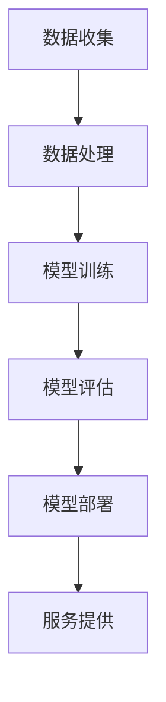

                 

# 从SaaS到AIaaS：AI大模型驱动的服务模式创新

## 关键词：SaaS、AIaaS、大模型、服务模式、创新

### 摘要

本文将探讨从SaaS（Software as a Service，软件即服务）向AIaaS（Artificial Intelligence as a Service，人工智能即服务）转型中的服务模式创新。随着人工智能技术的迅猛发展，AI大模型在各个行业中的应用越来越广泛，成为推动服务模式创新的重要驱动力。本文首先介绍了SaaS和AIaaS的基本概念，接着深入分析了AI大模型的工作原理和应用场景，最后探讨了AIaaS在提升企业竞争力、优化用户体验和降低服务成本方面的潜力，并提出了未来发展的趋势与挑战。

## 1. 背景介绍

### 1.1 SaaS的兴起

SaaS作为一种新兴的服务模式，最早出现在20世纪90年代末。SaaS的核心思想是将软件应用作为一种服务提供给用户，用户无需购买和安装软件，只需通过互联网访问即可使用。这种模式降低了软件的购买和使用成本，提高了软件的可用性和灵活性，迅速受到了企业和用户的青睐。

### 1.2 AIaaS的兴起

随着人工智能技术的快速发展，AIaaS作为一种新的服务模式应运而生。AIaaS利用人工智能技术，尤其是大模型技术，将人工智能服务以云服务的形式提供给用户。用户无需掌握复杂的人工智能技术，只需通过简单的接口即可使用人工智能服务，大大降低了人工智能应用的门槛。

## 2. 核心概念与联系

### 2.1 SaaS与AIaaS的基本概念

- SaaS：Software as a Service，软件即服务，是一种通过互联网提供软件应用的商业模式。
- AIaaS：Artificial Intelligence as a Service，人工智能即服务，是一种通过互联网提供人工智能服务的商业模式。

### 2.2 SaaS与AIaaS的联系

SaaS和AIaaS在本质上都是基于互联网的服务模式，但AIaaS在SaaS的基础上引入了人工智能技术，使其具有更高的智能化和自动化水平。

### 2.3 AI大模型的工作原理

AI大模型是基于深度学习技术的一种人工智能模型，通过大量数据的学习和训练，能够自动提取数据中的特征，并对其进行分类、预测和决策。AI大模型的核心是神经网络结构，其通过调整网络中的权重和偏置来实现对数据的拟合。

### 2.4 Mermaid流程图



## 3. 核心算法原理 & 具体操作步骤

### 3.1 数据收集

数据收集是AIaaS服务的基础，数据的质量和数量直接影响AI大模型的效果。数据收集的过程包括数据采集、数据清洗和数据存储等步骤。

### 3.2 数据处理

数据处理是对收集到的原始数据进行清洗、转换和格式化等操作，以便于模型训练。数据处理的过程包括数据预处理、特征提取和特征工程等步骤。

### 3.3 模型训练

模型训练是AI大模型的核心步骤，通过大量的数据对神经网络进行训练，使其能够对未知数据进行预测和分类。模型训练的过程包括损失函数设计、优化算法选择和训练策略制定等步骤。

### 3.4 模型评估

模型评估是对训练好的模型进行性能评估和调优，以确定其是否达到预期效果。模型评估的过程包括评估指标设计、评估结果分析和模型优化等步骤。

### 3.5 模型部署

模型部署是将训练好的模型部署到生产环境中，以提供实际的人工智能服务。模型部署的过程包括模型容器化、模型部署和模型监控等步骤。

## 4. 数学模型和公式 & 详细讲解 & 举例说明

### 4.1 数学模型

AI大模型的核心是神经网络模型，其数学基础是多元函数的微积分和优化算法。

### 4.2 公式

$$
f(x) = \sum_{i=1}^{n} w_i * x_i + b
$$

其中，$w_i$ 是网络中的权重，$x_i$ 是输入的特征，$b$ 是偏置。

### 4.3 举例说明

假设我们有一个简单的线性回归问题，输入的特征是一个长度为2的向量 $(x_1, x_2)$，输出是一个实数 $y$。我们可以使用一个简单的神经网络模型来拟合这个线性关系：

$$
y = w_1 * x_1 + w_2 * x_2 + b
$$

其中，$w_1$ 和 $w_2$ 是权重，$b$ 是偏置。我们可以通过最小化损失函数来训练这个模型：

$$
L(w_1, w_2, b) = \sum_{i=1}^{n} (y_i - f(x_i))^2
$$

使用梯度下降算法来优化这个损失函数：

$$
w_1 = w_1 - \alpha * \frac{\partial L}{\partial w_1}
$$

$$
w_2 = w_2 - \alpha * \frac{\partial L}{\partial w_2}
$$

$$
b = b - \alpha * \frac{\partial L}{\partial b}
$$

其中，$\alpha$ 是学习率。

## 5. 项目实战：代码实际案例和详细解释说明

### 5.1 开发环境搭建

为了实现一个简单的AIaaS服务，我们需要搭建一个开发环境。以下是开发环境的搭建步骤：

1. 安装Python环境
2. 安装TensorFlow库
3. 安装Docker和Kubernetes

### 5.2 源代码详细实现和代码解读

以下是使用TensorFlow实现一个简单的线性回归模型的代码：

```python
import tensorflow as tf

# 定义输入层
x = tf.placeholder(tf.float32, shape=[None, 2])
y = tf.placeholder(tf.float32, shape=[None, 1])

# 定义模型参数
w1 = tf.Variable(0.0, name="weight_1")
w2 = tf.Variable(0.0, name="weight_2")
b = tf.Variable(0.0, name="bias")

# 定义模型输出
y_pred = w1 * x[:, 0] + w2 * x[:, 1] + b

# 定义损失函数
loss = tf.reduce_mean(tf.square(y - y_pred))

# 定义优化器
optimizer = tf.train.GradientDescentOptimizer(learning_rate=0.001)

# 定义训练过程
train_op = optimizer.minimize(loss)

# 初始化所有变量
init = tf.global_variables_initializer()

# 开始训练
with tf.Session() as sess:
    sess.run(init)
    for i in range(1000):
        sess.run(train_op, feed_dict={x: x_data, y: y_data})
        if i % 100 == 0:
            loss_val = sess.run(loss, feed_dict={x: x_data, y: y_data})
            print("Step:", i, "Loss:", loss_val)

    # 获取模型参数
    w1_val, w2_val, b_val = sess.run([w1, w2, b])
    print("w1:", w1_val, "w2:", w2_val, "b:", b_val)
```

### 5.3 代码解读与分析

以上代码使用TensorFlow实现了线性回归模型，主要包括以下几个部分：

1. **定义输入层**：使用`tf.placeholder`定义输入层和输出层，输入层`x`是一个2维的张量，输出层`y`是一个1维的张量。
2. **定义模型参数**：使用`tf.Variable`定义模型参数，包括权重`w1`、`w2`和偏置`b`。
3. **定义模型输出**：使用`tf.mul`和`tf.add`操作定义模型输出`y_pred`，表示输入经过模型处理后得到的预测值。
4. **定义损失函数**：使用`tf.reduce_mean`和`tf.square`操作定义损失函数，表示预测值和实际值之间的误差平方和。
5. **定义优化器**：使用`tf.train.GradientDescentOptimizer`定义优化器，选择梯度下降算法来优化模型参数。
6. **定义训练过程**：使用`tf.Session`创建会话，并运行初始化操作`init`。然后使用`train_op`进行训练，每100步打印一次损失值。
7. **获取模型参数**：使用`sess.run`获取训练好的模型参数。

通过以上代码，我们可以训练一个简单的线性回归模型，并使用训练好的模型进行预测。

## 6. 实际应用场景

AIaaS在实际应用中具有广泛的应用场景，以下是一些典型的应用案例：

1. **金融领域**：AIaaS可以用于金融风险管理、信用评分、股票预测等。例如，利用AI大模型进行股票预测，可以提高预测的准确性和效率。
2. **医疗领域**：AIaaS可以用于医疗诊断、疾病预测、个性化治疗等。例如，利用AI大模型进行疾病预测，可以帮助医生提前发现病情，提高治疗效果。
3. **零售领域**：AIaaS可以用于商品推荐、库存管理、客户关系管理等。例如，利用AI大模型进行商品推荐，可以大大提高用户的购买体验。
4. **制造业**：AIaaS可以用于生产计划、质量检测、设备维护等。例如，利用AI大模型进行生产计划，可以优化生产流程，提高生产效率。

## 7. 工具和资源推荐

### 7.1 学习资源推荐

- **书籍**：
  - 《深度学习》（Ian Goodfellow, Yoshua Bengio, Aaron Courville）
  - 《Python机器学习》（Sebastian Raschka, Vincent Dubost）
- **论文**：
  - "A Theoretical Analysis of the VAE"（Diederik P. Kingma, Max Welling）
  - "Attention Is All You Need"（Ashish Vaswani, et al.）
- **博客**：
  - [TensorFlow官网博客](https://www.tensorflow.org/blog/)
  - [Keras官网博客](https://keras.io/blog/)
- **网站**：
  - [GitHub](https://github.com/)
  - [arXiv](https://arxiv.org/)

### 7.2 开发工具框架推荐

- **深度学习框架**：
  - TensorFlow
  - PyTorch
  - Keras
- **开发工具**：
  - Jupyter Notebook
  - Docker
  - Kubernetes
- **版本控制**：
  - Git
  - GitHub

### 7.3 相关论文著作推荐

- **论文**：
  - "Generative Adversarial Nets"（Ian J. Goodfellow, et al.）
  - "Residual Networks"（Kaiming He, et al.）
- **著作**：
  - 《AI之路：从数据到智能》（周志华，等）
  - 《机器学习实战》（Peter Harrington）

## 8. 总结：未来发展趋势与挑战

AIaaS作为人工智能服务的新模式，具有巨大的发展潜力。然而，要实现AIaaS的广泛应用，还需要解决一些关键问题和挑战：

1. **数据质量和数量**：高质量和大量的数据是AI大模型训练的基础，但很多行业的数据质量和数量都无法满足需求，这是AIaaS发展的瓶颈之一。
2. **模型解释性**：AI大模型通常具有很高的预测准确率，但缺乏解释性，这给用户理解和信任AI服务带来了困难。
3. **安全性**：AIaaS服务的安全性是一个重要问题，如何保证用户数据的安全和隐私，防止数据泄露和滥用，是未来需要重点关注的问题。
4. **模型部署和运维**：AI大模型的部署和运维是一个复杂的过程，需要高效的工具和平台来支持。

总之，AIaaS的发展前景广阔，但也面临许多挑战。只有通过不断的技术创新和合作，才能推动AIaaS的广泛应用和可持续发展。

## 9. 附录：常见问题与解答

### 9.1 什么是SaaS？

SaaS（Software as a Service，软件即服务）是一种基于互联网的软件应用交付模式，用户通过互联网订阅软件服务，无需购买和安装软件，只需通过网络访问即可使用。

### 9.2 什么是AIaaS？

AIaaS（Artificial Intelligence as a Service，人工智能即服务）是一种基于互联网的人工智能服务交付模式，用户通过互联网订阅人工智能服务，无需掌握复杂的人工智能技术，只需通过网络接口即可使用。

### 9.3 AI大模型有哪些优势？

AI大模型具有以下优势：
1. **高预测准确率**：通过大量的数据训练，AI大模型能够自动提取数据中的特征，并对其进行分类、预测和决策，具有较高的预测准确率。
2. **自动化和智能化**：AI大模型可以实现自动化和智能化，减轻人工干预，提高工作效率。
3. **灵活性**：AI大模型可以根据不同的应用场景进行定制和调整，具有较强的灵活性。

### 9.4 如何保证AIaaS服务的安全性？

保证AIaaS服务的安全性需要采取以下措施：
1. **数据加密**：对用户数据进行加密，防止数据泄露。
2. **身份验证**：对用户进行严格的身份验证，确保只有授权用户可以访问服务。
3. **访问控制**：对用户访问权限进行严格控制，确保用户只能访问其授权的数据和功能。
4. **安全审计**：定期进行安全审计，及时发现和解决安全隐患。

## 10. 扩展阅读 & 参考资料

- Goodfellow, I., Bengio, Y., & Courville, A. (2016). *Deep Learning*. MIT Press.
- Raschka, S. (2015). *Python Machine Learning*. Packt Publishing.
- Kingma, D. P., & Welling, M. (2013). *A Theoretical Analysis of the VAE*. arXiv preprint arXiv:1312.6114.
- Vaswani, A., et al. (2017). *Attention Is All You Need*. Advances in Neural Information Processing Systems, 30, 5998-6008.
- He, K., et al. (2016). *Deep Residual Learning for Image Recognition*. Proceedings of the IEEE Conference on Computer Vision and Pattern Recognition, 770-778.
- 周志华，等. (2018). *AI之路：从数据到智能*. 清华大学出版社.
- Harrington, P. (2013). *Machine Learning in Action*. Manning Publications.

