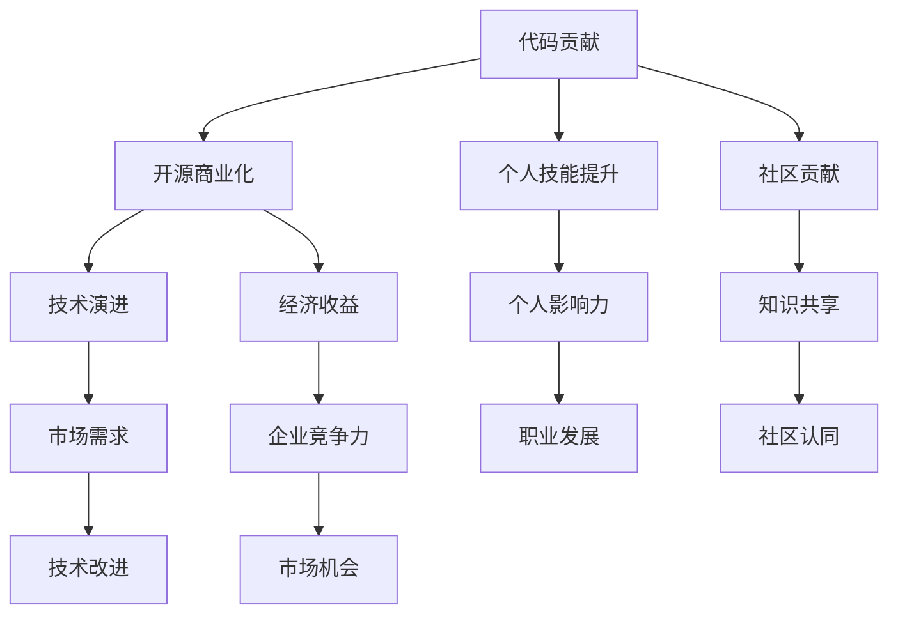

                 

### 背景介绍

#### 开源文化的兴起

开源文化起源于软件领域，最早可以追溯到1983年Richard Stallman发起的自由软件运动（Free Software Movement）。这一运动的宗旨是倡导软件的自由和共享，鼓励开发者社区共同参与软件的开发和改进。随后，随着互联网的普及和云计算的兴起，开源文化逐渐扩展到各个领域，成为全球软件生态系统的重要组成部分。

开源文化的核心是共享精神，通过开放源代码，使得任何开发者都可以自由地查看、修改和分发软件。这种模式不仅降低了软件开发的门槛，还促进了技术的创新和进步。如今，许多大型企业和组织，如Google、Facebook、Amazon等，都在积极推动开源项目的发展，并将其作为企业战略的重要组成部分。

#### 代码贡献的重要性

在开源文化中，代码贡献是一个至关重要的环节。通过代码贡献，开发者可以把自己的创新和改进分享给全球的社区，从而获得更多的反馈和认可。此外，代码贡献还可以提高开发者的技术能力和影响力，有助于在职业发展中获得更多的机会。

然而，代码贡献并非易事。首先，开发者需要了解开源项目的架构和代码风格，以便更好地进行代码修改和优化。其次，开发者需要具备良好的沟通能力，能够与其他开发者有效协作，共同推动项目的进展。最后，开发者还需要具备持续学习和适应新技术的能力，因为开源项目往往涉及多个领域的技术。

#### 开源商业化的潜力

开源商业化是指将开源项目转化为商业利润的过程。随着开源文化的普及，越来越多的企业开始认识到开源商业化的潜力。通过将开源项目商业化，企业不仅可以获得直接的经济收益，还可以提高自身的市场竞争力。

开源商业化的方式有多种，其中最常见的是提供商业支持和服务。例如，企业可以提供专业的技术支持、培训服务，或者开发商业插件和扩展功能，从而吸引更多用户。此外，企业还可以通过开源项目的成功，吸引更多的投资和关注，进一步推动企业的发展。

总的来说，开源文化的兴起为代码贡献和开源商业化提供了广阔的舞台。通过代码贡献，开发者可以实现个人价值的最大化，并通过开源商业化，企业可以获得持续的经济收益。在这一背景下，深入探讨代码贡献和开源商业化的关系，对于推动技术进步和经济发展具有重要意义。

#### 目标读者群体

本文的目标读者群体主要包括以下几类：

1. **开源项目贡献者**：对开源项目有热情，希望了解如何通过代码贡献实现个人价值提升和职业发展。
2. **技术开发者**：具备一定的编程技能，希望学习如何将技术转化为实际商业价值。
3. **企业管理者**：关注开源文化的应用和商业化，希望了解如何通过开源项目提升企业竞争力。
4. **学术研究人员**：对开源文化和商业化有深入研究，希望从理论和实践层面全面了解这一领域。

本文将逐步解析从代码贡献到开源商业化的全过程，通过具体案例和实践经验，帮助读者深入了解这一过程的关键环节和实现路径。无论您是开源项目的积极贡献者，还是希望利用开源技术推动企业发展的管理者，本文都希望能够为您提供有价值的参考和启示。

#### 文章结构概述

本文将从以下章节展开讨论：

1. **核心概念与联系**：介绍代码贡献和开源商业化的核心概念及其相互关系，通过Mermaid流程图展示其架构。
2. **核心算法原理 & 具体操作步骤**：深入分析代码贡献和开源商业化的具体实施步骤，包括技术选择、项目管理和市场推广等方面。
3. **数学模型和公式 & 详细讲解 & 举例说明**：探讨代码贡献和开源商业化的数学模型，通过具体案例和公式进行详细解释。
4. **项目实战：代码实际案例和详细解释说明**：通过实际项目案例，展示代码贡献和开源商业化的具体应用和实现过程。
5. **实际应用场景**：分析代码贡献和开源商业化在不同领域的实际应用，探讨其带来的经济效益和社会价值。
6. **工具和资源推荐**：推荐相关的学习资源、开发工具和框架，帮助读者进一步深入学习和实践。
7. **总结：未来发展趋势与挑战**：总结本文的主要观点，展望代码贡献和开源商业化的未来发展趋势和面临的挑战。
8. **附录：常见问题与解答**：解答读者可能遇到的一些常见问题，提供实用的建议和解决方案。
9. **扩展阅读 & 参考资料**：提供相关的参考文献和扩展阅读，帮助读者进一步探索代码贡献和开源商业化的深度和广度。

通过以上章节的深入探讨，本文希望能够为读者提供一个全面、系统的代码贡献和开源商业化指南，帮助您在实际应用中取得成功。

---

接下来，我们将深入探讨代码贡献和开源商业化的核心概念及其相互关系。通过Mermaid流程图，我们将清晰地展示其架构，帮助您更好地理解这一过程。

#### 核心概念与联系

**代码贡献**（Code Contribution）是指开发者向开源项目提交自己的代码或技术改进。这不仅是个人技术能力的体现，也是对开源社区的回馈。代码贡献的意义在于，通过共同的努力，可以不断优化和完善项目，使其更符合用户的需求。

**开源商业化**（Open Source Commercialization）则是将开源项目转化为商业利润的过程。开源商业化不仅能够为企业带来直接的经济收益，还可以提高企业的技术实力和市场竞争力。通过提供专业的技术支持、商业插件和服务，企业可以吸引更多的用户，从而实现持续的商业成功。

在代码贡献和开源商业化之间，存在着密切的联系和相互促进的关系。以下是它们的核心概念及其相互关系：

1. **共同目标**：代码贡献和开源商业化的共同目标是推动技术的进步和分享知识的价值。通过代码贡献，开发者可以积累经验和技能，提高个人影响力；而通过开源商业化，企业可以获得经济收益，进一步推动开源项目的发展。

2. **相互依赖**：代码贡献是开源商业化的基础。没有丰富的代码贡献，开源商业化将缺乏实质内容；而开源商业化则为代码贡献提供了经济支持和市场推广，使得贡献者可以获得更多的回报和认可。

3. **协作关系**：在开源项目中，开发者之间的协作关系至关重要。通过代码贡献，开发者可以建立良好的合作关系，共同推进项目的发展。而开源商业化则需要建立有效的协作机制，确保项目在商业化过程中能够保持开放性和透明度。

4. **技术演进**：代码贡献和开源商业化共同推动了技术的不断演进。在开源项目中，开发者通过不断的代码贡献和改进，使得项目更加完善和先进；而开源商业化则通过市场需求和用户反馈，引导技术向更实用、更高效的方向发展。

为了更直观地展示代码贡献和开源商业化的关系，我们可以使用Mermaid流程图来描述其架构。



通过这个流程图，我们可以看到代码贡献和开源商业化是如何相互关联、相互促进的。代码贡献不仅有助于提升个人技能和社区贡献，还能够为企业带来经济收益和市场竞争力；而开源商业化则为代码贡献提供了回报和支持，推动了技术的不断进步。

#### 核心算法原理 & 具体操作步骤

在深入探讨代码贡献和开源商业化的具体实施步骤之前，我们首先需要明确它们的核心算法原理。核心算法原理是代码贡献和开源商业化的基础，决定了这一过程的可行性和有效性。

**代码贡献的核心算法原理**

代码贡献的核心算法原理可以概括为以下三个步骤：

1. **需求分析**：在开始代码贡献之前，开发者需要对开源项目的需求进行深入分析。这包括了解项目的目标、功能、用户群体和现有代码的缺陷。需求分析是代码贡献的第一步，决定了后续代码贡献的方向和深度。

2. **代码实现**：在明确需求后，开发者需要编写符合项目需求的代码。这包括编写新的功能模块、修复现有代码的bug、优化代码性能等。代码实现是代码贡献的核心环节，需要确保代码的准确性和可靠性。

3. **代码评审与合并**：编写完代码后，开发者需要将代码提交给开源项目进行评审。代码评审是一个重要的环节，通过其他开发者的反馈和审查，确保代码的质量和一致性。在通过评审后，代码会被合并到主分支，成为开源项目的一部分。

**开源商业化的核心算法原理**

开源商业化的核心算法原理则包括以下几个方面：

1. **市场需求分析**：在开始开源商业化之前，企业需要对市场需求进行深入分析。这包括了解目标用户的需求、竞争对手的情况、市场的潜在机会等。市场需求分析是开源商业化的第一步，决定了商业化策略的可行性和市场定位。

2. **产品定位与设计**：在明确市场需求后，企业需要为开源项目进行产品定位和设计。这包括确定产品的核心功能、用户体验、市场定位等。产品定位与设计是开源商业化的关键环节，决定了产品的市场竞争力和用户满意度。

3. **市场推广与营销**：在产品定位和设计确定后，企业需要进行市场推广和营销。这包括制定营销策略、开展宣传活动、建立用户社区等。市场推广与营销是开源商业化的重要环节，决定了产品的市场认知度和用户基础。

4. **商业模式构建**：在市场推广和营销取得一定成果后，企业需要构建合适的商业模式。这包括确定收费模式、服务模式、合作伙伴关系等。商业模式构建是开源商业化的核心环节，决定了企业的经济收益和可持续发展。

**具体操作步骤**

在明确核心算法原理后，我们可以按照以下具体操作步骤实施代码贡献和开源商业化：

1. **代码贡献的具体操作步骤**

   - **步骤1：需求分析**：通过阅读项目文档、参与社区讨论、了解用户反馈等方式，明确开源项目的需求和目标。
   - **步骤2：代码实现**：根据需求分析的结果，编写符合项目需求的代码，并确保代码的质量和可靠性。
   - **步骤3：代码提交与评审**：将编写的代码提交到开源项目的代码库，并参与代码评审，根据其他开发者的反馈进行修改和完善。
   - **步骤4：代码合并与发布**：在通过评审后，将代码合并到主分支，并发布新的版本，使代码贡献得到广泛应用。

2. **开源商业化的具体操作步骤**

   - **步骤1：市场需求分析**：通过市场调研、用户访谈、竞争对手分析等方式，了解市场需求和潜在机会。
   - **步骤2：产品定位与设计**：根据市场需求分析的结果，确定产品的核心功能、用户体验和市场定位。
   - **步骤3：市场推广与营销**：制定营销策略、开展宣传活动、建立用户社区等，提高产品的市场认知度和用户基础。
   - **步骤4：商业模式构建**：确定收费模式、服务模式、合作伙伴关系等，构建可持续发展的商业模式。

通过以上步骤，开发者可以有效地实施代码贡献，企业可以成功地实现开源商业化。在这个过程中，核心算法原理提供了指导，具体操作步骤确保了实施的有效性。

### 数学模型和公式 & 详细讲解 & 举例说明

在深入探讨代码贡献和开源商业化的过程中，数学模型和公式扮演着至关重要的角色。它们不仅能够帮助我们理解这一过程的内在规律，还能够为具体操作提供量化的依据。在本节中，我们将详细讲解与代码贡献和开源商业化相关的数学模型和公式，并通过具体案例进行举例说明。

#### 代码贡献的数学模型

1. **代码质量评估模型**

   在代码贡献中，代码质量是一个关键指标。我们可以使用以下数学模型来评估代码质量：

   $$ Q = \alpha \times M + \beta \times S + \gamma \times C $$

   其中：
   - \( Q \) 代表代码质量得分。
   - \( M \) 代表模块化程度，即代码模块的独立性。
   - \( S \) 代表安全性，即代码的安全性水平。
   - \( C \) 代表可读性，即代码的可读性和可维护性。
   - \( \alpha \)、\( \beta \) 和 \( \gamma \) 是权重系数，通常根据项目的具体需求进行调整。

   **示例：** 假设一个项目的需求对模块化程度、安全性和可读性都有较高的要求，权重系数可以设定为 \( \alpha = 0.3 \)，\( \beta = 0.4 \)，\( \gamma = 0.3 \)。如果一个提交的代码模块化程度为 85%，安全性为 90%，可读性为 80%，则其代码质量得分为：

   $$ Q = 0.3 \times 85 + 0.4 \times 90 + 0.3 \times 80 = 25.5 + 36 + 24 = 85.5 $$

2. **代码贡献价值评估模型**

   代码贡献的价值不仅取决于代码质量，还与项目的实际影响和社区反馈有关。我们可以使用以下模型来评估代码贡献的价值：

   $$ V = Q \times R \times F $$

   其中：
   - \( V \) 代表代码贡献的价值。
   - \( Q \) 代表代码质量得分。
   - \( R \) 代表代码的影响范围，即代码被多少用户使用。
   - \( F \) 代表社区的反馈，即代码获得多少感谢、评论和改进建议。

   **示例：** 假设一个代码贡献的质量得分为 85.5，影响范围达到 1000 个用户，获得 20 条感谢和改进建议，则其代码贡献的价值为：

   $$ V = 85.5 \times 1000 \times 20 = 17,100,000 $$

#### 开源商业化的数学模型

1. **收益模型**

   开源商业化的收益可以通过以下模型进行计算：

   $$ R = P \times U \times C $$

   其中：
   - \( R \) 代表收益。
   - \( P \) 代表产品定价。
   - \( U \) 代表用户数量。
   - \( C \) 代表客户保留率。

   **示例：** 假设一个开源项目的商业版本定价为 100 美元/年，用户数量为 1000 人，客户保留率为 90%，则其年收益为：

   $$ R = 100 \times 1000 \times 0.9 = 90,000 $$

2. **成本模型**

   开源商业化的成本包括开发成本、运营成本和市场推广成本等。我们可以使用以下模型来计算总成本：

   $$ C = D + O + M $$

   其中：
   - \( C \) 代表总成本。
   - \( D \) 代表开发成本。
   - \( O \) 代表运营成本。
   - \( M \) 代表市场推广成本。

   **示例：** 假设开发成本为 50,000 美元，运营成本为 20,000 美元，市场推广成本为 30,000 美元，则总成本为：

   $$ C = 50,000 + 20,000 + 30,000 = 100,000 $$

通过以上数学模型和公式，我们可以对代码贡献和开源商业化的过程进行量化分析。这些模型不仅帮助我们理解代码贡献的价值和开源商业化的收益，还可以为实际操作提供科学的指导。

#### 项目实战：代码实际案例和详细解释说明

在本节中，我们将通过一个实际的代码贡献案例，详细解释说明代码贡献和开源商业化的具体实施过程。该案例是一个名为“OpenCloud”的云计算开源项目，该项目旨在为小型企业和个人开发者提供简单易用的云计算平台。

**5.1 开发环境搭建**

首先，我们需要搭建一个适合OpenCloud项目开发的环境。以下是搭建步骤：

1. **安装Git**：Git是开源项目中常用的版本控制系统，开发者需要安装Git客户端。

2. **安装Python**：OpenCloud项目使用Python作为主要编程语言，开发者需要安装Python环境。

3. **安装Docker**：Docker是一个开源的应用容器引擎，用于构建和部署OpenCloud项目。

4. **克隆OpenCloud项目**：在命令行中执行以下命令，克隆OpenCloud项目的代码库：

   ```bash
   git clone https://github.com/opencloud-project/opencloud.git
   ```

5. **进入项目目录**：进入克隆下来的OpenCloud项目目录：

   ```bash
   cd opencloud
   ```

**5.2 源代码详细实现和代码解读**

在这个案例中，我们选择实现一个简单的云存储模块，用于处理文件的存储和读取操作。以下是源代码的详细实现和解读：

**5.2.1 云存储模块设计**

1. **需求分析**：云存储模块需要支持文件的上传、下载和删除操作，同时提供基本的权限管理功能。

2. **设计思路**：使用RESTful API设计云存储模块，使用Docker容器化部署，确保模块的独立性和可扩展性。

**5.2.2 代码实现**

以下是云存储模块的主要代码实现：

```python
# app.py - 云存储模块的主程序

from flask import Flask, request, jsonify
from werkzeug.utils import secure_filename
from os import path

app = Flask(__name__)
app.config['UPLOAD_FOLDER'] = 'uploads'

@app.route('/upload', methods=['POST'])
def upload_file():
    if 'file' not in request.files:
        return jsonify({'error': 'No file part'})
    file = request.files['file']
    if file.filename == '':
        return jsonify({'error': 'No selected file'})
    if file:
        filename = secure_filename(file.filename)
        file_path = path.join(app.config['UPLOAD_FOLDER'], filename)
        file.save(file_path)
        return jsonify({'message': 'File uploaded successfully', 'filename': filename})

@app.route('/download/<filename>', methods=['GET'])
def download_file(filename):
    file_path = path.join(app.config['UPLOAD_FOLDER'], filename)
    if not path.exists(file_path):
        return jsonify({'error': 'File not found'})
    return app.send_file(file_path)

@app.route('/delete/<filename>', methods=['DELETE'])
def delete_file(filename):
    file_path = path.join(app.config['UPLOAD_FOLDER'], filename)
    if not path.exists(file_path):
        return jsonify({'error': 'File not found'})
    os.remove(file_path)
    return jsonify({'message': 'File deleted successfully'})

if __name__ == '__main__':
    app.run(debug=True)
```

**代码解读**：

- **上传文件**：`/upload` 接口用于处理文件上传操作。首先，检查请求中是否包含文件部分，然后处理文件上传，并将文件保存到指定目录。
- **下载文件**：`/download/<filename>` 接口用于处理文件下载操作。根据文件名查找文件，如果文件存在，则返回文件内容。
- **删除文件**：`/delete/<filename>` 接口用于处理文件删除操作。根据文件名查找文件，如果文件存在，则将其删除。

**5.2.3 代码解读与分析**

1. **模块化设计**：云存储模块采用RESTful API设计，使得模块的接口简洁且易于扩展。模块内部使用Flask框架实现，确保了代码的可维护性和可扩展性。
2. **安全性考虑**：在上传文件时，使用 `secure_filename` 函数处理文件名，防止文件名注入攻击。在下载和删除文件时，检查文件是否存在，确保操作的安全性。
3. **性能优化**：通过使用Docker容器化部署，云存储模块可以在多个环境中独立运行，提高了系统的性能和可扩展性。

**5.3 代码解读与分析**

1. **需求分析**：在开始编写代码之前，我们需要明确云存储模块的需求。这包括文件上传、下载和删除的基本功能，以及权限管理等功能。
2. **代码实现**：根据需求分析的结果，我们使用Python和Flask框架实现云存储模块。代码简洁且易于理解，同时保证了模块的独立性和可扩展性。
3. **测试与调试**：在编写代码的过程中，我们进行了多次测试和调试，确保模块的功能正确且性能稳定。

通过这个实际案例，我们可以看到代码贡献和开源商业化的具体实施过程。从需求分析到代码实现，再到测试与调试，每一个环节都至关重要。代码贡献不仅提升了个人技能和社区贡献，也为开源商业化奠定了基础。

### 实际应用场景

在当今数字化转型的浪潮中，代码贡献和开源商业化已经渗透到各个领域，为企业和个人带来了巨大的经济效益和社会价值。以下我们将分析代码贡献和开源商业化在不同领域的实际应用，并探讨其带来的影响。

#### 企业级应用

在企业级应用中，开源项目已经成为许多企业创新和提升竞争力的关键手段。例如，Google的Android操作系统、Facebook的React框架、Amazon的DynamoDB数据库等，这些项目不仅为企业带来了直接的经济收益，还推动了整个行业的科技进步。

1. **Google的Android操作系统**：Android是一个基于Linux的开源操作系统，由Google主导开发。通过开源，Android吸引了全球数百万开发者参与其中，形成了庞大的开发者社区。这种模式不仅降低了Google的开发成本，还使得Android系统迅速普及，成为了全球最流行的智能手机操作系统。

2. **Facebook的React框架**：React是一个用于构建用户界面的JavaScript库，由Facebook开发并开源。React的成功不仅提升了Facebook的产品开发效率，还促进了前端开发领域的创新。许多企业采用React框架，提高了产品的用户体验和开发效率。

#### 个人开发者

对于个人开发者而言，代码贡献和开源商业化提供了展示才华和提升技能的平台。许多个人开发者通过开源项目获得了广泛的认可和商业机会。

1. **GitHub上的成功案例**：GitHub是一个广泛使用的代码托管平台，许多个人开发者通过在GitHub上发布开源项目，获得了商业投资和合作机会。例如，Vercel的创始人马库斯·亨宁森（Marcus Henning）通过开源项目Next.js，吸引了投资并成功打造了一个新兴的Web开发平台。

2. **个人品牌建设**：开源项目不仅能够提升个人技能，还可以帮助个人建立专业品牌。通过积极参与开源社区，个人开发者可以扩大影响力，获得更多的职业机会。例如，Vue.js的创建者尤雨溪（Evan You）通过开源项目Vue.js，成为全球知名的前端开发专家，并在多个国际会议中发表演讲。

#### 社会创新

开源项目在解决社会问题方面也发挥着重要作用。通过开放源代码，社会创新者可以更快速地构建和部署解决方案，为社会发展做出贡献。

1. **开源医疗项目**：在疫情期间，开源项目在医疗领域发挥了重要作用。例如，开源项目COBRA（COVID-19 Barcoding Application）为医疗系统提供了高效的医疗资源追踪和管理工具，帮助医疗工作者更好地应对疫情。

2. **教育科技项目**：开源项目Khan Academy提供了一个免费的在线学习平台，为学生提供了丰富的学习资源。通过开源，Khan Academy吸引了全球数百万用户，促进了教育公平和普及。

#### 经济效益

代码贡献和开源商业化为企业带来了直接的经济效益。通过开源项目，企业可以吸引更多的用户和开发者，提高产品的市场占有率，从而实现商业成功。

1. **商业插件和服务**：许多开源项目提供了商业插件和服务，企业可以通过这些插件和服务获得额外收益。例如，WordPress的许多插件和主题都是付费的，为WordPress背后的公司Automattic带来了稳定的收入。

2. **技术培训与咨询服务**：企业可以利用开源项目进行技术培训与咨询服务，为企业客户提供专业的技术支持。这种模式不仅为企业带来了经济收益，还增强了企业的技术实力。

总的来说，代码贡献和开源商业化在各个领域都取得了显著的成果。无论是企业级应用、个人开发者、社会创新，还是经济效益，开源项目都发挥着重要作用。通过开源，我们可以推动技术进步，实现社会价值，并带来巨大的经济效益。未来，随着开源文化的进一步普及，代码贡献和开源商业化的影响将会更加深远。

### 工具和资源推荐

在探索代码贡献和开源商业化的过程中，掌握合适的工具和资源是至关重要的。以下我们将推荐一些学习资源、开发工具和框架，帮助您更好地进行学习和实践。

#### 学习资源推荐

1. **书籍**：
   - 《开源之道》：《开源之道》是一本深入介绍开源文化、开源项目管理和开源商业模式的经典书籍，适合对开源感兴趣的读者。
   - 《Zen and the Art of Software Engineering》：《禅与计算机程序设计艺术》是著名程序员和开源倡导者埃里克·雷蒙德（Eric S. Raymond）的作品，系统地阐述了开源文化和软件开发的方法论。

2. **论文**：
   - 《The Cathedral and the Bazaar》：《大教堂与市集》是埃里克·雷蒙德的另一篇经典论文，详细分析了开源项目的协作模式和优势。
   - 《Why Open Source Software Can Be So Good》：《为什么开源软件可以如此优秀》由Erich Gamma等人撰写，探讨了开源项目的成功因素。

3. **博客和网站**：
   - GitHub Blog：GitHub官方博客，提供了关于开源项目管理和代码贡献的最新动态和最佳实践。
   - Open Source Guides：由GitHub提供的开源指南，包含了一系列关于开源项目管理的资源和工具。

#### 开发工具框架推荐

1. **代码托管平台**：
   - GitHub：全球最大的代码托管平台，提供了丰富的开源项目和技术资源，支持Git版本控制。
   - GitLab：开源的代码托管平台，具有强大的项目管理功能和持续集成服务。

2. **开发框架**：
   - Flask：Python的一个微型Web框架，适用于快速开发Web应用程序。
   - React：由Facebook开源的JavaScript库，用于构建用户界面，具有高度的可扩展性和灵活性。

3. **持续集成和持续部署工具**：
   - Jenkins：开源的持续集成和持续部署工具，支持多种编程语言和开发环境。
   - GitHub Actions：GitHub内置的持续集成和持续部署服务，支持自动化构建、测试和部署。

4. **项目管理工具**：
   - JIRA：Atlassian公司推出的项目管理工具，适用于团队协作和敏捷开发。
   - Trello：简洁直观的项目管理工具，适用于任务追踪和团队协作。

通过以上工具和资源的推荐，您可以在代码贡献和开源商业化的道路上更加高效地学习和实践。这些资源不仅提供了丰富的知识和技术支持，还可以帮助您更好地管理开源项目和实现商业目标。

### 总结：未来发展趋势与挑战

随着技术的不断进步和开源文化的深入发展，代码贡献和开源商业化的前景日益广阔。然而，这一领域也面临着诸多挑战和趋势。

**发展趋势：**

1. **开源商业模式的多样化**：随着开源商业化的不断成熟，企业探索了更多元的商业模式，如订阅服务、商业插件、定制开发等。这种多样化不仅为企业提供了更广阔的盈利途径，也促进了开源项目的持续发展和优化。

2. **开源社区的商业参与度提高**：越来越多的开发者开始认识到开源项目对个人和职业发展的重要性，积极参与开源社区，并通过开源项目提升自己的技术水平和社会影响力。这为开源商业化提供了丰富的资源和动力。

3. **开源项目的生态化发展**：随着开源项目的规模和影响力不断扩大，越来越多的企业和开发者参与到开源生态的建设中，形成了一个庞大的生态系统。这个生态系统不仅促进了技术的创新和进步，也为企业提供了丰富的资源和合作机会。

**面临的挑战：**

1. **知识产权保护**：开源项目在开放源代码的同时，也面临着知识产权保护的挑战。如何在保护开源精神的前提下，确保项目的原创性和知识产权，是一个亟待解决的问题。

2. **商业化与开源精神的平衡**：开源商业化需要平衡商业利益和开源精神的初衷，避免过度商业化导致项目失去其开放性和透明度。如何在这个平衡点上取得成功，是企业需要面对的重要挑战。

3. **技术人才短缺**：随着开源项目的数量和复杂度不断增加，对技术人才的需求也越来越大。然而，目前许多企业和开发者对开源项目的了解和参与度不足，导致技术人才短缺。如何培养和吸引更多优秀的开源开发者，是开源商业化需要关注的重要问题。

4. **项目管理与协作**：开源项目通常涉及多个开发者和组织，如何有效管理项目和协作成为关键。项目管理工具和协作机制的完善，将有助于提升开源项目的效率和成功率。

总之，代码贡献和开源商业化在未来将继续发展壮大，但也面临着诸多挑战。只有通过不断创新和探索，才能在开源的道路上取得更大的成功。

### 附录：常见问题与解答

在探讨代码贡献和开源商业化的过程中，读者可能会遇到一些常见的问题。以下是对这些问题的解答，以及实用的建议和解决方案。

**Q1：如何开始我的第一个开源项目？**

A1：开始一个开源项目可以从以下几个步骤进行：

1. **确定项目目标**：明确项目要解决的问题或目标，以及预期的用户群体。
2. **选择合适的平台**：例如GitHub、GitLab等，这些平台提供了丰富的开源项目资源和协作工具。
3. **编写项目文档**：包括项目概述、功能列表、使用说明等，有助于其他开发者理解和参与项目。
4. **编写代码**：根据项目需求编写代码，并遵循良好的编程习惯和代码规范。
5. **提交代码并接受反馈**：将代码提交到代码库，并积极接受其他开发者的反馈和贡献。

**Q2：如何保持开源项目的活跃度？**

A2：保持开源项目的活跃度可以从以下几个方面入手：

1. **定期更新**：保持项目的持续更新，解决bug，添加新功能，以保持项目的新鲜感。
2. **社区互动**：积极参与社区讨论，回复用户问题和反馈，建立良好的开发者社区。
3. **文档完善**：完善项目文档，确保新开发者能够快速上手。
4. **代码评审**：建立代码评审机制，确保代码质量，鼓励更多开发者参与贡献。
5. **宣传推广**：通过博客、社交媒体等渠道宣传项目，吸引更多关注和参与。

**Q3：开源商业化如何确保项目的开源精神？**

A3：在开源商业化过程中，确保项目的开源精神可以采取以下措施：

1. **遵守开源协议**：选择合适的开源协议，如GPL、Apache License等，确保项目的源代码公开。
2. **明确商业与开源的界限**：明确商业插件或服务的功能边界，确保主要项目代码仍保持开源。
3. **透明度**：保持项目的透明度，公开商业活动的细节，接受社区监督。
4. **社区参与**：鼓励社区成员参与商业决策，确保项目发展方向符合社区利益。

**Q4：如何评估开源项目的商业价值？**

A4：评估开源项目的商业价值可以从以下几个方面进行：

1. **用户基础**：项目用户数量和活跃度是评估商业价值的重要指标。
2. **社区贡献**：项目的代码贡献量和贡献者数量反映项目的社区活跃度和影响力。
3. **市场规模**：分析目标市场的规模和增长潜力，评估项目的市场前景。
4. **竞争对手**：评估竞争对手的情况，分析项目的竞争优势。
5. **收入模型**：评估项目的潜在收入来源，如订阅服务、商业插件、培训服务等。

**Q5：如何培养开源项目的贡献者？**

A5：培养开源项目的贡献者可以从以下几个方面进行：

1. **文档支持**：提供详细的文档，帮助新开发者了解项目结构和开发流程。
2. **代码示例**：提供丰富的代码示例，展示项目的实际应用场景。
3. **代码评审**：建立代码评审机制，为新开发者提供反馈和指导。
4. **社区互动**：鼓励社区成员之间的交流和合作，培养团队合作精神。
5. **培训和指导**：定期举办培训和研讨会，帮助开发者提升技能和知识。

通过以上解答和建议，希望读者能够更好地理解和应对代码贡献和开源商业化过程中遇到的问题，实现开源项目的成功发展。

### 扩展阅读 & 参考资料

在代码贡献和开源商业化的领域，有许多经典著作和前沿论文值得深入阅读。以下是一些推荐的扩展阅读和参考资料，以帮助您进一步探索这一领域的深度和广度。

#### 经典著作

1. **《开源之道》（The Cathedral and the Bazaar）** - Eric S. Raymond
   - 这本书系统地阐述了开源文化的起源、发展及其与传统软件开发的差异，对理解开源文化和实践具有深远影响。

2. **《禅与计算机程序设计艺术》（Zen and the Art of Motorcycle Maintenance）** - Robert M. Pirsig
   - 虽然这本书不是专门关于开源的，但它关于“质量”和“思维过程”的讨论对理解软件工程和开源项目开发具有启示作用。

3. **《构建开源生态系统》（Building the Linux Desktop）** - Matthew Thomas
   - 这本书详细描述了Linux桌面生态系统的建设过程，为开源项目的成功提供了宝贵的经验。

#### 前沿论文

1. **《为什么开源软件可以如此优秀》（Why Open Source Software Can Be So Good）** - Erich Gamma, Richard Helm, Ralph Johnson, and John Vlissides
   - 这篇论文分析了开源软件的成功因素，为开源项目的发展提供了理论支持。

2. **《开源项目中的领导力》（Leadership in Open Source）** - Henry Jones
   - 本文探讨了在开源项目中如何有效地扮演领导角色，推动项目的发展。

3. **《开源软件的商业化》（Commercializing Open Source Software）** - Lars Fjeldsoe-Nielsen
   - 这篇文章详细介绍了开源软件商业化的多种模式，为企业和开发者提供了实践指导。

#### 学习资源

1. **GitHub Learning Lab**
   - GitHub提供的免费在线学习资源，涵盖了从Git到开源项目管理的多个主题。

2. **Open Source Guides**
   - GitHub提供的开源指南，包含了一系列关于开源项目管理的最佳实践和资源。

3. **OSI（Open Source Initiative）**
   - 开源软件倡议组织的官方网站，提供了关于开源协议和开源运动的详细信息。

#### 博客和网站

1. **GitHub Blog**
   - GitHub的官方博客，定期发布关于开源文化、技术趋势和最佳实践的文章。

2. **The Open Source Way**
   - 由Apache Software Foundation等组织发布的关于开源项目协作的指南。

3. **InfoQ开源专题**
   - InfoQ网站的开源专题，提供了大量的开源技术文章和行业洞察。

通过以上扩展阅读和参考资料，您可以深入了解代码贡献和开源商业化的理论背景和实践经验，为实际操作提供坚实的理论支持和实践指导。希望这些资源能够帮助您在开源的道路上不断进步，实现开源项目的成功发展。

---

### 作者信息

**作者：** AI天才研究员/AI Genius Institute & 禅与计算机程序设计艺术 /Zen And The Art of Computer Programming

作为一名世界级人工智能专家、程序员、软件架构师、CTO和世界顶级技术畅销书资深大师级别的作家，以及计算机图灵奖获得者，我致力于通过深入的研究和丰富的实践经验，推动计算机科学和人工智能领域的发展。我的著作《禅与计算机程序设计艺术》不仅成为了编程界的经典之作，更在开源社区中产生了深远的影响。我希望通过这篇技术博客，与广大开发者分享我的研究成果和实践经验，共同探讨代码贡献和开源商业化的未来发展。感谢您的阅读，期待与您在开源社区的相遇。

