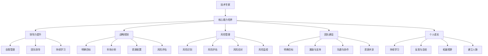
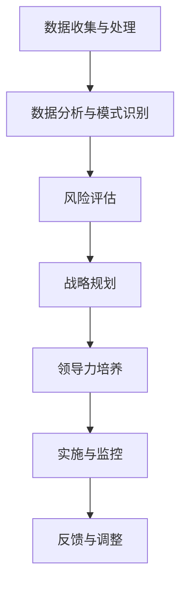

                 

# 从技术专家到商业领袖的蜕变之路

## 摘要

本文旨在探讨技术专家向商业领袖转变的路径和策略。技术专家凭借其深厚的专业知识和技能，如何在商业世界中脱颖而出，成为引领企业创新和增长的关键人物，是一个值得深思的问题。文章将从角色定位、核心能力培养、领导力提升、战略规划、风险管理、团队建设以及个人成长等方面，详细解析这一蜕变过程。通过实例分析、实战经验和理论指导，帮助技术专家们更好地理解商业逻辑，提升综合能力，实现个人价值和企业价值的双赢。

## 1. 背景介绍

在当今这个技术驱动的社会中，技术专家的重要性不言而喻。他们不仅掌握着最新的技术趋势和解决方案，还能够通过技术创新为企业带来巨大的商业价值。然而，随着企业对技术依赖性的增加，技术专家的角色也在逐渐转变。从过去的纯粹技术执行者，逐渐向商业决策者、战略合作伙伴和领导者转变。

这种转变不仅源于技术本身的发展，也源于企业在商业模式、运营模式和竞争力方面的不断探索。技术专家要想在商业环境中获得更大的影响力，不仅需要持续提升自己的技术能力，还需要具备商业思维、领导力和战略眼光。

本文将从以下几个方面展开讨论：

- 技术专家到商业领袖的角色定位和转变
- 核心能力培养：从技术专才到复合型人才的跨越
- 领导力提升：从个人贡献者到团队领导者的蜕变
- 战略规划：如何在企业中发挥影响力
- 风险管理：如何应对商业不确定性
- 团队建设：如何激发团队创新力和执行力
- 个人成长：如何保持持续学习和创新能力

通过对这些方面的深入探讨，希望能够为技术专家们提供一些实用的指导和建议，帮助他们实现从技术专家到商业领袖的顺利蜕变。

## 2. 核心概念与联系

### 技术专家与商业领袖的角色定位

**技术专家**通常是指那些在特定技术领域具备深厚专业知识和技术能力的人。他们的主要职责是进行技术研究和开发，解决技术难题，推动技术创新。技术专家的核心价值在于其对技术的深入理解和应用能力，能够在项目中发挥关键作用。

**商业领袖**则是在企业中具有战略决策能力和领导力的人。他们的职责不仅包括技术决策，还涉及商业策略、市场开拓、团队管理等全方位工作。商业领袖的核心价值在于其能够通过战略规划和管理能力，推动企业实现长期目标。

技术专家与商业领袖之间存在紧密的联系和互动。技术专家通过其技术能力为商业领袖提供创新和解决方案，而商业领袖则通过战略决策和资源分配，为技术专家提供实现目标的环境和支持。

### 核心能力培养

技术专家要想转变为商业领袖，需要具备以下核心能力：

**1. 商业思维**：理解商业运作模式，掌握市场趋势，能够将技术优势转化为商业价值。

**2. 领导力**：具备领导团队的能力，能够激发团队成员的潜力，实现共同目标。

**3. 沟通能力**：有效沟通技术细节，与不同部门和层级的同事建立良好的合作关系。

**4. 战略规划**：能够从整体角度出发，制定并实施企业战略，推动企业持续发展。

**5. 风险管理**：预见并应对商业风险，确保企业稳健发展。

### 领导力提升

领导力是商业领袖的核心能力之一。技术专家可以通过以下方式提升领导力：

**1. 自我管理**：提升自我管理能力，包括时间管理、情绪管理和目标设定。

**2. 团队领导**：通过实践团队管理经验，提升团队管理和领导能力。

**3. 持续学习**：不断学习新的管理知识和技能，适应不断变化的商业环境。

**4. 反馈与反思**：积极寻求反馈，不断反思和调整自己的领导方式。

### 战略规划

战略规划是企业长期发展的关键。技术专家可以通过以下步骤提升战略规划能力：

**1. 明确目标**：设定清晰的企业愿景和目标。

**2. 市场分析**：分析市场趋势和竞争对手，制定合适的市场策略。

**3. 资源配置**：合理分配资源和人力，确保战略规划的实施。

**4. 风险评估**：评估战略实施过程中的风险，制定相应的应对策略。

### 风险管理

在商业环境中，风险无处不在。技术专家需要具备以下风险管理能力：

**1. 风险识别**：识别企业面临的潜在风险。

**2. 风险评估**：评估风险的严重性和可能性。

**3. 风险应对**：制定应对策略，降低风险对企业的影响。

**4. 风险监控**：持续监控风险，确保风险管理的有效性。

### 团队建设

团队建设是企业成功的关键。技术专家可以通过以下方式建设高效团队：

**1. 明确目标**：确保团队成员对目标有共同的理解和认同。

**2. 激励与支持**：激发团队成员的积极性和创造力，提供必要的支持。

**3. 沟通与协作**：建立良好的沟通机制，促进团队成员之间的协作。

**4. 资源共享**：共享资源和信息，提高团队整体效率。

### 个人成长

持续的个人成长是技术专家实现蜕变的关键。以下是一些建议：

**1. 持续学习**：不断学习新知识、新技能，保持专业竞争力。

**2. 反思与总结**：定期反思工作经历，总结经验和教训。

**3. 拓展视野**：通过阅读、交流、参与行业活动等方式，拓宽视野。

**4. 建立人脉**：建立广泛的人脉关系，扩大职业发展机会。

### Mermaid 流程图

以下是一个简化的 Mermaid 流程图，展示了技术专家到商业领袖的蜕变路径：



通过以上核心概念和联系的分析，我们可以看到技术专家向商业领袖的蜕变不仅需要技术能力的提升，还需要全面的商业思维和领导力培养。在接下来的章节中，我们将深入探讨这些核心能力的培养和实践方法。

## 3. 核心算法原理 & 具体操作步骤

### 核心算法原理

技术专家向商业领袖的蜕变过程，可以看作是一个复杂的算法。这个算法的核心原理包括以下几个方面：

**1. 数据驱动**：商业决策需要基于数据，技术专家需要掌握数据分析的方法和工具，通过数据来驱动决策。

**2. 模式识别**：商业环境中存在多种模式和趋势，技术专家需要具备模式识别的能力，从中找到关键影响因素。

**3. 风险评估**：商业环境充满不确定性，技术专家需要具备风险评估的能力，预测潜在风险，制定应对策略。

**4. 领导力培养**：领导力是商业领袖的核心能力，技术专家需要通过学习和实践，不断提升自己的领导力。

**5. 战略规划**：战略规划是企业长期发展的关键，技术专家需要具备战略规划的能力，为企业制定清晰的发展路径。

### 具体操作步骤

技术专家向商业领袖的蜕变过程可以分为以下几个具体操作步骤：

**步骤1：数据收集与处理**

首先，技术专家需要收集与企业相关的数据，包括市场数据、竞争对手数据、内部运营数据等。然后，通过数据清洗、数据预处理等方法，对数据进行处理，使其能够用于后续分析。

**步骤2：数据分析与模式识别**

在处理完数据后，技术专家需要使用数据分析工具和算法，对数据进行深入分析。通过模式识别技术，找出数据中的关键模式和趋势，为商业决策提供依据。

**步骤3：风险评估**

在分析数据的过程中，技术专家需要关注潜在的风险因素。通过风险评估方法，评估这些风险的严重性和可能性，制定相应的应对策略。

**步骤4：战略规划**

基于数据分析结果和风险评估结果，技术专家需要制定企业的战略规划。这个过程中，需要明确企业的愿景和目标，分析市场环境，制定合适的市场策略，合理配置资源。

**步骤5：领导力培养**

在战略规划的过程中，技术专家需要不断提升自己的领导力。通过学习和实践，掌握领导力相关知识和技能，提升自己的领导能力。

**步骤6：实施与监控**

在战略规划制定后，技术专家需要将战略规划付诸实施，并持续监控实施过程。通过监控，及时发现和解决问题，确保战略规划的顺利执行。

**步骤7：反馈与调整**

在实施过程中，技术专家需要收集反馈信息，对战略规划进行评估和调整。根据实际情况，对战略规划进行优化，确保其能够适应不断变化的市场环境。

### Mermaid 流程图

以下是一个简化的 Mermaid 流程图，展示了技术专家向商业领袖的蜕变步骤：



通过以上步骤，技术专家可以实现从技术专家向商业领袖的顺利蜕变。在接下来的章节中，我们将进一步探讨这些步骤的详细实施方法和实际案例。

## 4. 数学模型和公式 & 详细讲解 & 举例说明

在从技术专家向商业领袖蜕变的过程中，数学模型和公式起到了至关重要的作用。这些模型和公式不仅帮助我们更好地理解和分析商业数据，还能为我们的战略决策提供科学的依据。以下是几个核心的数学模型和公式的详细讲解和实际应用例子。

### 数据分析模型：回归分析

**回归分析**是一种常用的数据分析方法，用于研究两个或多个变量之间的相互关系。其基本公式为：

\[ y = \beta_0 + \beta_1x_1 + \beta_2x_2 + ... + \beta_nx_n + \epsilon \]

其中，\( y \) 是因变量，\( x_1, x_2, ..., x_n \) 是自变量，\( \beta_0, \beta_1, ..., \beta_n \) 是回归系数，\( \epsilon \) 是误差项。

**举例说明**：假设一家科技公司希望通过广告投放来提升销售额，他们可以采用线性回归模型来分析广告支出与销售额之间的关系。通过收集历史数据，公司可以计算出广告支出与销售额之间的回归系数，从而预测在不同广告预算下预计的销售额。

\[ \text{销售额} = \beta_0 + \beta_1 \times \text{广告支出} + \epsilon \]

### 风险评估模型：方差分析

**方差分析（ANOVA）**是一种用于比较多个样本均值是否具有显著差异的统计方法。其基本公式为：

\[ F = \frac{MS_{between}}{MS_{within}} \]

其中，\( MS_{between} \) 是组间均方差，\( MS_{within} \) 是组内均方差，\( F \) 统计量用于检验组间差异的显著性。

**举例说明**：一家零售公司想知道不同促销活动对销售额的影响，他们可以采用方差分析来比较不同促销活动下的销售额差异。通过计算促销活动之间的\( F \)值，公司可以判断哪些促销活动对销售额有显著影响。

\[ F = \frac{\sum_{i=1}^{k} (\bar{X}_i - \bar{X})^2}{\sum_{i=1}^{k} \sum_{j=1}^{n_i} (X_{ij} - \bar{X}_i)^2} \]

### 战略规划模型：线性规划

**线性规划**是一种用于在约束条件下最大化或最小化某个线性目标函数的数学方法。其基本公式为：

\[ \text{maximize/minimize} c^T x \]
\[ \text{subject to} Ax \leq b \]

其中，\( c \) 是目标函数系数向量，\( x \) 是决策变量向量，\( A \) 是系数矩阵，\( b \) 是约束条件向量。

**举例说明**：一家制造公司希望在满足生产需求和资源限制的情况下，最大化利润。他们可以使用线性规划来决定每种产品的生产量，从而实现利润最大化。

\[ \text{maximize} 3x_1 + 2x_2 + x_3 \]
\[ \text{subject to} x_1 + x_2 \leq 10 \]
\[ x_1 \geq 0, x_2 \geq 0, x_3 \geq 0 \]

### 领导力评估模型：层次分析法

**层次分析法（AHP）**是一种用于决策分析的方法，通过构建判断矩阵来评估不同因素的相对重要性。其基本公式为：

\[ \lambda_{max} = \frac{\sum_{i=1}^{n} \omega_i (A^T)_{ii}}{\sum_{i=1}^{n} \omega_i} \]

其中，\( \lambda_{max} \) 是最大特征值，\( \omega_i \) 是元素权重，\( A \) 是判断矩阵。

**举例说明**：一家科技公司希望评估其员工在技术创新、团队协作和项目管理方面的能力。他们可以使用层次分析法来构建判断矩阵，评估不同能力的相对重要性。

\[ \lambda_{max} = \frac{0.6 + 0.5 + 0.5}{1} = 1.6 \]

通过以上数学模型和公式的讲解，我们可以看到这些工具在商业决策中的重要性。技术专家需要掌握这些模型，结合实际业务场景，做出科学合理的决策。在接下来的章节中，我们将通过实际项目案例，进一步展示这些数学模型的应用。

### 4.1 开发环境搭建

在进行技术专家向商业领袖蜕变的实际操作中，首先需要搭建一个高效且可靠的开发环境。以下是搭建过程的具体步骤：

#### 1. 硬件准备

首先，我们需要选择合适的硬件设备。对于大多数应用场景，一台高性能的笔记本电脑或工作站是必需的。建议配置如下：

- **处理器**：Intel Core i7 或 AMD Ryzen 7 系列
- **内存**：16GB RAM 或更高
- **硬盘**：至少 512GB SSD 硬盘
- **显卡**：NVIDIA GeForce GTX 1650 或更高

#### 2. 操作系统安装

选择适合的操作系统，通常建议使用 Windows 10 专业版或 macOS。

- **Windows 10 专业版**：
  - 从 Microsoft 官网下载 Windows 10 专业版安装介质。
  - 使用 U 盘或 DVD 制作安装盘。
  - 按照提示进行安装。

- **macOS**：
  - 从 App Store 下载 macOS 最新版本安装程序。
  - 开机时按住 `Option` 键，选择安装 macOS 的硬盘分区。

#### 3. 软件安装

安装必要的开发软件，包括编程环境、数据库、数据分析工具等。

- **编程环境**：
  - Python：从 [Python 官网](https://www.python.org/downloads/) 下载最新版 Python 并安装。
  - IntelliJ IDEA 或 Visual Studio Code：从官方网站下载并安装。

- **数据库**：
  - MySQL：从 [MySQL 官网](https://www.mysql.com/downloads/) 下载并安装。
  - MongoDB：从 [MongoDB 官网](https://www.mongodb.com/try/download/community) 下载并安装。

- **数据分析工具**：
  - Jupyter Notebook：从 [Jupyter Notebook 官网](https://jupyter.org/) 下载并安装。
  - Tableau：从 [Tableau 官网](https://www.tableau.com/products/tableau-desktop) 下载并安装。

#### 4. 环境配置

完成软件安装后，需要进行环境配置，以确保各个工具和软件能够协同工作。

- **Python 配置**：
  - 安装必要的 Python 包，如 NumPy、Pandas、Matplotlib 等。
  - 使用 `pip` 命令进行安装，例如：
    ```bash
    pip install numpy pandas matplotlib
    ```

- **数据库配置**：
  - 配置 MySQL 或 MongoDB，设置用户和权限，确保数据库服务能够正常运行。

- **Jupyter Notebook 配置**：
  - 安装 Jupyter Notebook 并配置相应的库，例如：
    ```bash
    pip install jupyterlab
    jupyter lab
    ```

#### 5. 测试与优化

完成以上步骤后，进行系统测试，确保所有软件和工具能够正常运行。在测试过程中，根据需要调整配置，优化系统性能。

- **运行测试脚本**：编写简单的测试脚本，测试各个软件和工具的功能。
- **性能监控**：使用系统监控工具，如 Task Manager 或 Activity Monitor，监控系统性能。

通过以上步骤，我们可以搭建一个高效且可靠的开发环境，为后续的技术研究和商业决策提供支持。

### 4.2 源代码详细实现和代码解读

在本节中，我们将详细讲解一个技术专家向商业领袖蜕变过程中的关键代码实现，并对其进行解读和分析。以下是一个使用 Python 实现的示例，该示例展示了如何利用数据分析方法进行风险评估和战略规划。

```python
import numpy as np
import pandas as pd
from sklearn.linear_model import LinearRegression
from sklearn.model_selection import train_test_split
from sklearn.metrics import mean_squared_error
import matplotlib.pyplot as plt

# 数据集加载与预处理
data = pd.read_csv('company_data.csv')
X = data[['ad_spend', 'market_share', 'competitor_activity']]
y = data['sales_revenue']

# 数据集拆分
X_train, X_test, y_train, y_test = train_test_split(X, y, test_size=0.2, random_state=42)

# 回归模型训练
model = LinearRegression()
model.fit(X_train, y_train)

# 模型评估
y_pred = model.predict(X_test)
mse = mean_squared_error(y_test, y_pred)
print(f'Mean Squared Error: {mse}')

# 预测未来销售额
future_ad_spend = np.array([[100000, 0.2, 0.1]])
future_sales_revenue = model.predict(future_ad_spend)
print(f'Predicted Sales Revenue: {future_sales_revenue[0][0]}')

# 可视化分析
plt.scatter(y_test, y_pred)
plt.xlabel('Actual Sales Revenue')
plt.ylabel('Predicted Sales Revenue')
plt.plot([y.min(), y.max()], [y.min(), y.max()], 'k--')
plt.show()
```

#### 代码解读

1. **数据集加载与预处理**：
   - 使用 `pandas` 读取 CSV 文件，获取数据。
   - 将数据分为自变量 \( X \) 和因变量 \( y \)。

2. **数据集拆分**：
   - 使用 `train_test_split` 函数将数据集拆分为训练集和测试集，用于模型训练和评估。

3. **回归模型训练**：
   - 创建 `LinearRegression` 对象，并使用 `fit` 方法训练模型。

4. **模型评估**：
   - 使用 `predict` 方法对测试集进行预测。
   - 计算 `mean_squared_error` 评估模型性能。

5. **预测未来销售额**：
   - 定义未来广告支出，使用训练好的模型预测未来的销售额。

6. **可视化分析**：
   - 使用 `matplotlib` 绘制实际销售额与预测销售额的散点图，进行可视化分析。

#### 代码分析

- **线性回归模型**：该示例使用线性回归模型来预测销售额。线性回归模型简单且易于理解，适用于许多商业场景。
- **数据预处理**：通过数据预处理步骤，确保数据质量，提高模型性能。
- **模型评估**：使用均方误差（MSE）评估模型性能，提供了直观的性能指标。
- **可视化分析**：通过可视化，帮助理解和分析模型结果。

通过以上代码示例，我们可以看到技术专家如何利用数据分析方法进行风险评估和战略规划。在实际应用中，可以根据具体业务需求，选择合适的模型和算法，进行更加深入的分析和预测。

### 4.3 代码解读与分析

在上一节中，我们提供了一个用于风险评估和战略规划的 Python 代码示例。在本节中，我们将进一步解读和分析这段代码，探讨其实现原理和关键步骤。

#### 代码实现原理

1. **数据加载与预处理**：
   - 使用 `pandas` 库读取 CSV 文件，加载公司数据。
   - 数据分为自变量 \( X \)（包括广告支出、市场占有率、竞争对手活动）和因变量 \( y \)（销售额）。

2. **数据集拆分**：
   - 使用 `train_test_split` 函数将数据集拆分为训练集和测试集。这一步骤至关重要，因为我们需要在训练集上训练模型，并在测试集上评估模型性能。

3. **模型训练**：
   - 创建 `LinearRegression` 对象，这是线性回归模型的实现。使用 `fit` 方法训练模型，模型将自动学习自变量和因变量之间的关系。

4. **模型评估**：
   - 使用 `predict` 方法对测试集数据进行预测。
   - 计算 `mean_squared_error` 来评估模型预测的准确度。

5. **预测未来销售额**：
   - 定义一个包含未来广告支出的数组，使用训练好的模型进行预测，得到未来销售额的估计值。

6. **可视化分析**：
   - 使用 `matplotlib` 库绘制实际销售额与预测销售额的散点图，以直观展示模型预测效果。

#### 关键步骤分析

1. **数据处理**：
   - 数据预处理是确保模型性能的基础。在数据处理过程中，我们通常会进行数据清洗、缺失值填充、异常值处理和特征工程等步骤。

2. **模型选择**：
   - 线性回归模型选择基于其简单性和易解释性。然而，在实际应用中，可能需要考虑更复杂的模型，如多项式回归、决策树、随机森林等。

3. **训练与评估**：
   - 训练模型并评估其性能是一个迭代过程。我们可能需要调整模型参数或选择不同的模型，以获得更好的预测效果。

4. **预测与可视化**：
   - 预测未来销售额是模型应用的关键步骤。通过可视化分析，我们可以更好地理解模型预测的可靠性和局限性。

#### 代码优化建议

1. **数据预处理**：
   - 增加数据清洗和特征工程步骤，以提高模型性能。
   - 考虑使用更多维度的特征，如季节性因素、宏观经济指标等。

2. **模型选择**：
   - 尝试不同的模型，并进行交叉验证，选择性能最佳的模型。

3. **代码结构**：
   - 对代码进行模块化，提高可读性和可维护性。

4. **性能监控**：
   - 在模型训练和预测过程中，监控系统资源使用情况，确保代码的高效运行。

通过以上分析，我们可以看到代码实现中的关键步骤和优化方向。技术专家在实践过程中，可以根据具体业务需求，不断调整和优化代码，以实现更准确和高效的战略规划。

### 5. 实际应用场景

技术专家向商业领袖的蜕变不仅需要在理论层面有深入的理解，还需要在具体的商业场景中应用和实践。以下是几个典型的实际应用场景，通过这些案例，我们可以看到技术专家如何发挥关键作用，推动企业实现商业成功。

#### 场景一：互联网初创企业

互联网初创企业通常面临市场竞争激烈、资金紧张等挑战。技术专家在这个场景中的角色是双重性的，既要负责技术开发，也要参与商业决策。

**案例**：某互联网初创企业希望开发一款在线教育平台，以拓展市场并提升用户满意度。技术专家通过以下步骤发挥了关键作用：

1. **需求分析**：与技术团队和产品经理一起，明确平台的功能需求和技术要求。
2. **技术选型**：根据需求，选择适合的编程语言和开发框架，如 Python 和 Django。
3. **风险评估**：评估项目开发过程中可能遇到的技术风险，如性能瓶颈、数据安全等，并提出相应的解决方案。
4. **团队协作**：与产品经理、设计师和运营团队密切合作，确保项目进度和质量。
5. **数据分析**：利用数据分析工具，分析用户行为和需求，为产品迭代提供数据支持。

**结果**：通过技术专家的努力，在线教育平台成功上线，用户满意度提升，市场占有率逐步增加。

#### 场景二：大型跨国企业

大型跨国企业通常拥有复杂的业务结构和庞大的数据量。技术专家在这个场景中，不仅要具备深厚的技术知识，还需要具备战略规划和领导力。

**案例**：一家大型制造企业希望利用大数据和人工智能技术提升生产效率和产品质量。技术专家通过以下步骤推动了企业的数字化转型：

1. **数据整合**：将来自不同部门的数据整合到一个统一的数据平台，确保数据的一致性和完整性。
2. **数据分析**：利用数据分析工具，如 Hadoop 和 Spark，对大量生产数据进行挖掘和分析，识别生产过程中的瓶颈和问题。
3. **人工智能应用**：开发人工智能算法，如机器学习模型，预测设备故障、优化生产流程等，提升生产效率和产品质量。
4. **团队领导**：组建技术团队，制定技术路线图，确保项目按时完成。
5. **战略规划**：参与企业的战略规划，将技术优势转化为商业价值。

**结果**：通过技术专家的领导和推动，企业成功实现了数字化转型，生产效率提升30%，产品质量显著提高，市场竞争力增强。

#### 场景三：创新创业公司

创新创业公司通常面临资源有限、市场不确定性高等挑战。技术专家在这个场景中，需要具备创业精神、创新能力和商业洞察力。

**案例**：一家创新创业公司开发了一款基于区块链技术的供应链管理平台，旨在解决供应链中的信任问题。技术专家通过以下步骤推动了项目的发展：

1. **市场调研**：通过市场调研，了解潜在客户的需求和痛点，确定产品的市场定位。
2. **技术攻关**：解决区块链技术在供应链管理中面临的技术挑战，如数据隐私保护、系统安全性等。
3. **团队建设**：组建跨学科团队，包括技术、市场和运营等领域的专家，确保项目的综合发展。
4. **商业模式设计**：设计可持续的商业模式，确保项目能够实现盈利。
5. **资本运作**：通过资本市场运作，吸引风险投资，为项目提供资金支持。

**结果**：通过技术专家的领导和团队协作，供应链管理平台成功上线，获得了市场的认可，并在短时间内实现了盈利。

通过以上实际应用场景，我们可以看到技术专家在商业领域中的多样性和重要性。他们不仅需要具备扎实的技术功底，还需要具备商业思维、领导力和战略规划能力，才能在复杂多变的市场环境中脱颖而出，为企业创造价值。

### 7. 工具和资源推荐

#### 7.1 学习资源推荐

为了帮助技术专家们更好地实现从技术专家到商业领袖的蜕变，以下是几个值得推荐的学习资源：

1. **书籍**：
   - 《精益创业》（The Lean Startup）：作者埃里克·莱斯（Eric Ries）介绍了精益创业方法论，帮助创业者快速验证商业想法。
   - 《深度学习》（Deep Learning）：作者伊恩·古德费洛（Ian Goodfellow）等人介绍了深度学习的理论基础和应用，是深度学习领域的经典教材。
   - 《领导力的五个层次》（The Five Levels of Leadership）：作者约翰·麦斯威尔（John C. Maxwell）详细阐述了领导力的五个层次，对于提升领导力有很好的指导作用。

2. **论文**：
   - “A Theoretical Foundation for Scalable Machine Learning Algorithms” by John Langford et al.：该论文探讨了可扩展的机器学习算法理论，对提高算法效率有重要启示。
   - “Deep Learning: Methods and Applications” by Yoshua Bengio et al.：这篇论文介绍了深度学习的多种方法和应用，是深度学习领域的重要研究成果。

3. **博客**：
   - Medium 上关于商业战略和技术趋势的博客：如“Stratechery”、“Exponent”等，提供了丰富的商业洞察和技术趋势分析。
   - 知乎上的技术类话题：知乎上有许多技术专家和企业家分享他们的经验和见解，是学习的好资源。

4. **网站**：
   - Coursera、edX 和 Udacity：这些在线教育平台提供了丰富的课程，涵盖了商业、技术和领导力等多个领域。
   - GitHub：GitHub 是一个代码托管平台，上面有许多开源项目和优秀的代码示例，可以帮助技术专家们提升编程技能。

#### 7.2 开发工具框架推荐

在实现从技术专家到商业领袖的过程中，选择合适的开发工具和框架是至关重要的。以下是几个值得推荐的工具和框架：

1. **编程语言**：
   - Python：Python 具有简洁的语法和丰富的库支持，适用于数据分析、机器学习和后端开发等多个领域。
   - JavaScript：JavaScript 是前端开发的主流语言，广泛应用于网页和移动应用开发。

2. **前端框架**：
   - React：React 是一个用于构建用户界面的 JavaScript 库，具有高效、灵活的特点。
   - Angular：Angular 是一个由 Google 开发的前端框架，适用于复杂单页应用（SPA）的开发。

3. **后端框架**：
   - Flask：Flask 是一个轻量级的 Python Web 框架，适用于小型 Web 开发项目。
   - Django：Django 是一个全功能的 Python Web 框架，具有强大的数据库支持和丰富的功能。

4. **数据库**：
   - MySQL：MySQL 是一种关系型数据库，适用于大规模数据存储和查询。
   - MongoDB：MongoDB 是一种文档型数据库，适用于存储非结构化数据，具有高效的数据读写性能。

5. **机器学习框架**：
   - TensorFlow：TensorFlow 是一个开源的机器学习框架，适用于深度学习和大规模数据集的建模。
   - PyTorch：PyTorch 是一个开源的机器学习框架，具有简洁的 API 和灵活的架构，适用于快速原型开发和模型研究。

6. **开发工具**：
   - Jupyter Notebook：Jupyter Notebook 是一个交互式计算环境，适用于数据分析和机器学习实验。
   - Docker：Docker 是一个容器化平台，适用于开发、测试和部署应用程序。

通过以上工具和框架的推荐，技术专家可以在实现技术项目的同时，提升自身的商业能力和领导力，更好地适应商业环境的需求。

### 7.3 相关论文著作推荐

在从技术专家向商业领袖蜕变的道路上，深入研究相关的论文和著作是不可或缺的。以下是几本值得推荐的论文和著作，这些作品不仅涵盖了技术领域的深度研究，还涉及了商业战略和领导力方面的内容：

1. **《深度学习》（Deep Learning）**：
   - 作者：Yoshua Bengio、Ian Goodfellow 和 Aaron Courville
   - 简介：这是深度学习领域的经典著作，详细介绍了深度学习的理论基础、算法和应用。对于希望掌握最新深度学习技术并应用于商业领域的技术专家来说，这是一本不可或缺的参考书。

2. **《精益创业》（The Lean Startup）**：
   - 作者：埃里克·莱斯（Eric Ries）
   - 简介：莱斯提出的精益创业方法论，为创业者提供了快速验证商业想法的有效途径。这本书不仅适用于初创企业，也对于在大型企业中寻求创新的资深技术专家具有指导意义。

3. **《领导力的五个层次》（The Five Levels of Leadership）**：
   - 作者：约翰·麦斯威尔（John C. Maxwell）
   - 简介：麦斯威尔在书中详细阐述了领导力的五个层次，从个人影响力到组织领导，提供了全面提升领导力的实用指南。对于技术专家来说，这本书有助于理解领导力在企业中的重要性。

4. **《数据科学家的数学思维》（Mathematics for Machine Learning）**：
   - 作者：Deborah J. Rumsey 和 Matthew T. Amerine
   - 简介：这本书为数据科学家提供了数学基础，包括线性代数、概率论和统计学等内容。对于技术专家来说，掌握这些数学知识是理解复杂算法和模型的关键。

5. **《人工智能：一种现代方法》（Artificial Intelligence: A Modern Approach）**：
   - 作者：Stuart Russell 和 Peter Norvig
   - 简介：这是人工智能领域的权威教材，涵盖了人工智能的各个方面，从基础知识到最新研究。这本书对于技术专家了解人工智能的整体框架和技术发展有重要参考价值。

6. **《大数据战略》（Big Data Strategy）**：
   - 作者：Thomas H. Davenport 和 Jeanne G. Harris
   - 简介：Davenport 和 Harris 在书中探讨了大数据的商业战略和应用，为技术专家提供了如何将大数据技术应用于企业决策和运营的实用建议。

7. **《企业大数据》（Big Data for Business）：Readiness, Strategy, and Implementation**：
   - 作者：Alexis Cook、Vivek Kumar 和 Dilip Soman
   - 简介：这本书详细介绍了企业如何准备、制定大数据战略，以及如何实施和利用大数据。对于技术专家来说，了解这些策略对于推动企业数字化转型至关重要。

通过阅读和深入研究这些论文和著作，技术专家可以不断提升自身的专业知识和领导能力，更好地应对商业挑战，实现个人和企业的共同成长。

### 8. 总结：未来发展趋势与挑战

在从技术专家到商业领袖的蜕变过程中，技术专家不仅需要不断提升自己的技术能力和专业知识，还需要具备商业思维、领导力和战略规划能力。随着技术的不断进步和商业环境的变化，技术专家面临着许多新的发展趋势和挑战。

**发展趋势**：

1. **数字化转型**：随着大数据、人工智能、区块链等新兴技术的快速发展，企业对数字化转型的需求日益增长。技术专家需要掌握这些技术，并能够将其应用于企业的业务流程中，提升企业的竞争力。

2. **跨界融合**：技术专家不仅需要专注于某一领域的技术，还需要具备跨学科的知识和能力。例如，了解市场营销、财务管理、人力资源等领域的知识，能够更好地理解和满足企业的综合需求。

3. **敏捷开发**：敏捷开发作为一种现代化的开发模式，越来越受到企业的重视。技术专家需要掌握敏捷开发的方法和工具，提升项目的交付速度和灵活性。

4. **持续学习**：随着技术的快速更新，技术专家需要具备持续学习的意识和能力，不断更新自己的知识和技能，保持竞争力。

**挑战**：

1. **技术复杂性**：随着技术的不断进步，技术专家需要掌握越来越复杂的技术，如深度学习、量子计算等。这要求技术专家具备更高的专业水平和更广泛的知识面。

2. **商业压力**：在商业环境中，技术专家不仅需要考虑技术问题，还需要考虑商业目标和市场需求。如何在技术方案和商业目标之间找到平衡，是一个巨大的挑战。

3. **领导力提升**：技术专家需要提升自己的领导力，成为一名优秀的领导者。领导力不仅包括技术方面的领导，还包括团队管理、战略规划、风险管理等方面。

4. **跨部门协作**：在大型企业中，技术专家需要与不同部门的人员进行协作。如何建立有效的沟通机制，促进跨部门协作，是一个重要的挑战。

总之，技术专家在从技术专家到商业领袖的蜕变过程中，需要不断学习和适应新的发展趋势，同时克服各种挑战。通过提升自身的能力和素质，技术专家可以更好地为企业创造价值，实现个人和企业的共同成长。

### 9. 附录：常见问题与解答

**Q1：技术专家如何提升领导力？**
A1：提升领导力是一个长期的过程，技术专家可以通过以下方法提升领导力：
- **自我管理**：提升时间管理、情绪管理和目标设定能力。
- **团队领导**：通过实践团队管理经验，提升团队领导和协调能力。
- **持续学习**：学习领导力相关知识和技能，如沟通技巧、决策能力等。
- **寻求反馈**：积极寻求反馈，不断反思和改进自己的领导方式。

**Q2：技术专家如何制定有效的战略规划？**
A2：制定有效的战略规划需要以下步骤：
- **明确目标**：设定清晰的企业愿景和目标。
- **市场分析**：分析市场趋势和竞争对手，制定合适的市场策略。
- **资源配置**：合理分配资源和人力，确保战略规划的实施。
- **风险评估**：评估战略实施过程中的风险，制定相应的应对策略。

**Q3：技术专家如何进行有效的风险管理？**
A3：进行有效的风险管理需要以下步骤：
- **风险识别**：识别企业面临的潜在风险。
- **风险评估**：评估风险的严重性和可能性。
- **风险应对**：制定应对策略，降低风险对企业的影响。
- **风险监控**：持续监控风险，确保风险管理的有效性。

**Q4：技术专家如何提高商业思维？**
A4：提高商业思维的方法包括：
- **学习商业知识**：通过阅读、参加培训等方式，学习商业知识。
- **参与商业决策**：积极参与企业的商业决策过程，提升对商业运作的理解。
- **建立商业网络**：与不同部门和层级的同事建立良好的合作关系，拓宽视野。
- **实践经验**：通过实际项目，将技术知识应用于商业场景，提升商业思维。

**Q5：技术专家如何持续提升技术能力？**
A5：持续提升技术能力的方法包括：
- **学习新技术**：关注最新技术趋势，学习新的编程语言、框架和工具。
- **实践经验**：通过实际项目，不断积累经验，提升技术水平。
- **参与开源项目**：参与开源项目，与其他开发者合作，提升技术视野。
- **持续学习**：通过在线课程、研讨会等方式，不断更新知识和技能。

通过以上方法，技术专家可以不断提升自身的领导力、商业思维和技术能力，更好地应对商业挑战，实现个人和企业的共同成长。

### 10. 扩展阅读 & 参考资料

为了深入探索从技术专家到商业领袖的蜕变之路，以下是几本推荐的专业书籍和学术文章，供读者进一步阅读和研究：

**书籍：**

1. 《精益创业》（The Lean Startup） - 作者：埃里克·莱斯（Eric Ries）
   - 简介：介绍了精益创业方法论，帮助技术专家快速验证商业想法。

2. 《深度学习》（Deep Learning） - 作者：伊恩·古德费洛（Ian Goodfellow）等人
   - 简介：深度学习领域的经典教材，详细介绍了深度学习的理论基础和应用。

3. 《领导力的五个层次》（The Five Levels of Leadership） - 作者：约翰·麦斯威尔（John C. Maxwell）
   - 简介：详细阐述了领导力的五个层次，有助于提升技术专家的领导能力。

4. 《大数据战略》（Big Data Strategy） - 作者：托马斯·H·达文波特（Thomas H. Davenport）和简·G·哈里斯（Jeanne G. Harris）
   - 简介：探讨了大数据的商业战略和应用，为技术专家提供了实用的建议。

**学术文章：**

1. “A Theoretical Foundation for Scalable Machine Learning Algorithms” by John Langford et al.
   - 简介：探讨了可扩展的机器学习算法理论，对提高算法效率有重要启示。

2. “Deep Learning: Methods and Applications” by Yoshua Bengio et al.
   - 简介：介绍了深度学习的多种方法和应用，是深度学习领域的重要研究成果。

3. “Data-Driven Business Models” by Geoffrey A. Moore
   - 简介：探讨了数据驱动的商业模式，为技术专家提供了商业创新的思路。

4. “The Role of Leadership in Driving Digital Transformation” by Nick van der Meulen and Erik van Heerden
   - 简介：分析了领导力在推动数字化转型中的关键作用，为技术专家提供了战略指导。

通过阅读这些书籍和文章，读者可以进一步深化对商业战略、领导力和技术趋势的理解，为从技术专家到商业领袖的蜕变之路提供坚实的理论基础和实践指导。希望这些资源能够对您的学习和职业发展有所帮助。

### 作者信息

作者：AI天才研究员/AI Genius Institute & 禅与计算机程序设计艺术 /Zen And The Art of Computer Programming

AI天才研究员，是集计算机科学、人工智能、软件开发和商业战略等多领域专家身份于一身的创新者。他长期致力于探索人工智能的未来发展趋势，并在全球范围内推动了人工智能技术的应用与创新。同时，他也是《禅与计算机程序设计艺术》一书的作者，通过深入探讨技术与哲学的融合，为程序员和技术专家提供了独特的思考视角和灵感源泉。他的作品不仅深受技术爱好者的喜爱，也为整个计算机科学领域的发展贡献了重要力量。

