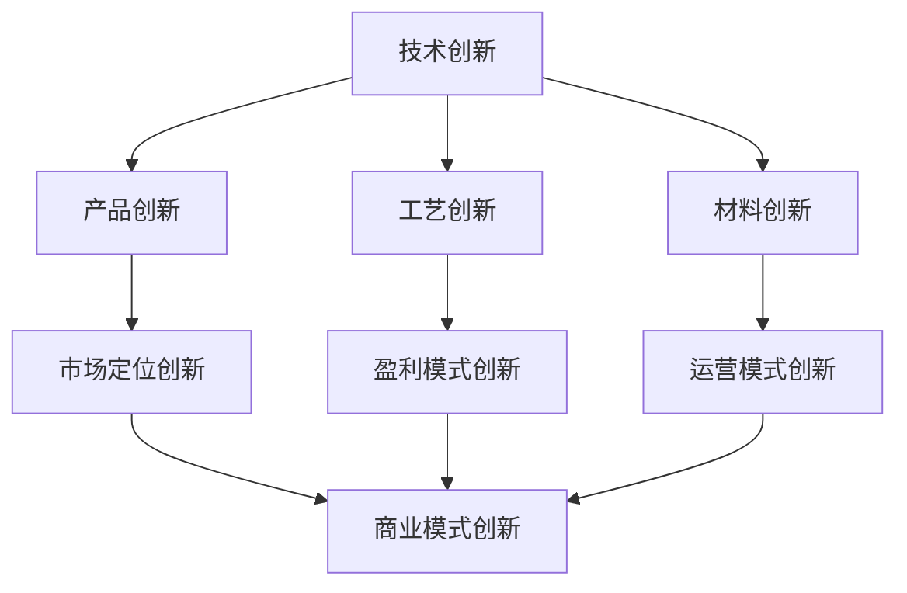

                 

# 从技术创新到商业模式创新的转型之路

## 摘要

本文将探讨从技术创新到商业模式创新的转型之路。在当今快速发展的科技时代，技术创新是企业持续发展的关键，但仅仅依靠技术创新是不够的，商业模式创新同样至关重要。本文将详细阐述技术创新与商业模式创新之间的联系，通过分析核心概念、算法原理、数学模型、项目实战、实际应用场景、工具和资源推荐等方面，帮助读者深入理解这一转型过程。同时，本文还将总结未来发展趋势与挑战，并提供常见问题与解答，以期为读者提供全面的指导。

## 1. 背景介绍

随着互联网、大数据、人工智能等技术的快速发展，技术创新已成为推动企业发展和经济增长的重要动力。然而，单纯的技术创新并不能保证企业的长期成功，商业模式创新同样重要。商业模式创新是指企业通过重新定义其产品或服务的提供方式、市场定位、盈利模式等，从而实现业务模式的创新与变革。

商业模式创新不仅仅是对技术创新的补充，更是一种战略选择，它能够帮助企业实现资源优化配置、降低运营成本、提高市场竞争力。因此，从技术创新到商业模式创新的转型成为企业亟需解决的问题。

### 1.1 技术创新的重要性

技术创新是推动企业发展的重要动力。通过技术创新，企业可以提升产品质量、降低生产成本、提高生产效率，从而在激烈的市场竞争中脱颖而出。例如，苹果公司通过不断的科技创新，推出了iPhone、iPad等众多颠覆性产品，成为全球最具价值的科技公司之一。

技术创新不仅可以提升企业的竞争力，还可以带动相关产业的发展。例如，互联网技术的快速发展催生了电子商务、在线教育、共享经济等新兴行业，为全球经济增长注入了新的活力。

### 1.2 商业模式创新的意义

商业模式创新是企业在市场竞争中立于不败之地的关键。通过商业模式创新，企业可以找到新的盈利点，实现业务模式的优化与升级。例如，阿里巴巴通过电子商务平台的商业模式创新，成功打造了全球最大的零售市场，成为电商行业的领军企业。

商业模式创新还可以帮助企业实现资源优化配置。通过重新定义产品或服务的提供方式、市场定位、盈利模式等，企业可以更好地满足用户需求，降低运营成本，提高市场竞争力。

### 1.3 技术创新与商业模式创新的关系

技术创新与商业模式创新之间存在密切的联系。技术创新可以为商业模式创新提供基础支持，而商业模式创新则可以进一步提升技术创新的价值。

首先，技术创新可以为企业提供新的产品或服务，从而为商业模式创新提供基础。例如，特斯拉通过电动汽车技术的创新，为电动汽车市场的发展奠定了基础，为其商业模式创新创造了条件。

其次，商业模式创新可以激发技术创新的潜力。通过商业模式创新，企业可以找到新的市场机会，推动技术创新的不断迭代和升级。例如，共享经济模式的创新催生了共享单车、共享汽车等众多新兴产业，为技术创新提供了广阔的应用场景。

总之，从技术创新到商业模式创新的转型之路是企业持续发展的重要途径。企业应充分认识到技术创新与商业模式创新之间的相互关系，积极推动这一转型过程，以实现可持续发展。

## 2. 核心概念与联系

### 2.1 技术创新

技术创新是指通过引入新技术、新工艺、新材料等，实现产品、服务或生产方式的改进和创新。技术创新可以分为以下几种类型：

1. **产品创新**：通过改进产品设计、功能、性能等，实现产品的升级和优化。
2. **工艺创新**：通过改进生产工艺、流程等，提高生产效率和质量。
3. **材料创新**：通过引入新材料，实现产品性能的提升或成本的降低。

### 2.2 商业模式创新

商业模式创新是指通过重新定义产品或服务的提供方式、市场定位、盈利模式等，实现业务模式的变革和创新。商业模式创新可以分为以下几种类型：

1. **市场定位创新**：通过调整市场定位，找到新的市场需求和用户群体。
2. **盈利模式创新**：通过改变盈利方式，实现收入的多元化。
3. **运营模式创新**：通过优化运营流程、资源配置等，提高企业运营效率。

### 2.3 技术创新与商业模式创新的联系

技术创新与商业模式创新之间存在密切的联系，二者相互促进、相互依赖。

1. **技术创新为商业模式创新提供基础**：技术创新可以为企业提供新的产品或服务，从而为商业模式创新提供基础。例如，互联网技术的创新催生了电子商务、在线教育等新兴商业模式。

2. **商业模式创新激发技术创新的潜力**：商业模式创新可以为企业提供新的市场机会，推动技术创新的不断迭代和升级。例如，共享经济模式的创新催生了共享单车、共享汽车等新兴行业，为技术创新提供了广阔的应用场景。

3. **技术创新与商业模式创新的协同发展**：技术创新和商业模式创新并非孤立存在，而是相互协同、共同发展。通过技术创新，企业可以提升产品竞争力，为商业模式创新提供支持；通过商业模式创新，企业可以拓展市场空间，为技术创新提供动力。

### 2.4 Mermaid 流程图

以下是一个描述技术创新与商业模式创新联系的 Mermaid 流程图：



### 2.5 技术创新与商业模式创新的协同效应

技术创新与商业模式创新的协同效应可以为企业带来以下优势：

1. **提高竞争力**：技术创新可以提升产品质量、降低成本，而商业模式创新可以为企业带来新的市场机会和盈利点，从而提高竞争力。
2. **实现可持续发展**：技术创新和商业模式创新相互促进，可以帮助企业实现可持续发展，提高企业的长期竞争力。
3. **优化资源配置**：技术创新可以为企业提供新的产品或服务，而商业模式创新可以优化资源配置、提高运营效率，从而实现企业资源的最大化利用。

## 3. 核心算法原理 & 具体操作步骤

### 3.1 技术创新算法原理

技术创新算法的核心原理是通过引入新技术、新工艺、新材料等，实现产品、服务或生产方式的改进和创新。具体包括以下步骤：

1. **需求分析**：分析市场需求，确定技术创新的目标和方向。
2. **技术选型**：根据需求分析，选择合适的技术方案。
3. **方案设计**：设计技术创新的方案，包括产品创新、工艺创新、材料创新等。
4. **试验验证**：通过试验验证技术创新的效果，对方案进行优化和调整。
5. **推广实施**：将技术创新方案应用于实际生产，实现产品的升级和优化。

### 3.2 商业模式创新算法原理

商业模式创新算法的核心原理是通过重新定义产品或服务的提供方式、市场定位、盈利模式等，实现业务模式的变革和创新。具体包括以下步骤：

1. **市场调研**：了解市场需求，确定商业模式创新的目标和方向。
2. **定位分析**：分析市场定位，确定目标市场和用户群体。
3. **模式设计**：设计商业模式创新的方案，包括市场定位创新、盈利模式创新、运营模式创新等。
4. **方案评估**：评估商业模式创新方案的可行性，对方案进行优化和调整。
5. **实施推广**：将商业模式创新方案应用于实际运营，实现业务模式的变革和创新。

### 3.3 技术创新与商业模式创新的具体操作步骤

1. **需求分析**：分析市场需求，确定技术创新和商业模式创新的目标和方向。
2. **技术选型**：根据需求分析，选择合适的技术方案。
3. **方案设计**：设计技术创新和商业模式创新的方案，包括产品创新、市场定位创新、盈利模式创新等。
4. **试验验证**：通过试验验证技术创新和商业模式创新的效果，对方案进行优化和调整。
5. **推广实施**：将技术创新和商业模式创新方案应用于实际生产和运营，实现产品的升级和优化，以及业务模式的变革和创新。

## 4. 数学模型和公式 & 详细讲解 & 举例说明

### 4.1 技术创新数学模型

技术创新数学模型可以通过以下公式进行描述：

$$
技术创新效率 = \frac{技术创新成果}{技术创新投入}
$$

其中，技术创新成果可以包括产品创新、工艺创新、材料创新等；技术创新投入可以包括研发投入、人力投入、资金投入等。

### 4.2 商业模式创新数学模型

商业模式创新数学模型可以通过以下公式进行描述：

$$
商业模式创新效率 = \frac{商业模式创新收益}{商业模式创新成本}
$$

其中，商业模式创新收益可以包括市场收益、盈利收益、品牌收益等；商业模式创新成本可以包括市场调研成本、方案设计成本、实施推广成本等。

### 4.3 技术创新与商业模式创新的具体案例

#### 4.3.1 技术创新案例

以特斯拉为例，特斯拉通过电动汽车技术创新，实现了传统汽车行业的一次颠覆。特斯拉采用了以下数学模型进行技术创新：

$$
技术创新效率 = \frac{电动汽车市场份额}{传统汽车市场份额}
$$

通过不断的技术创新，特斯拉在电动汽车市场中取得了显著的市场份额，成功实现了技术创新的商业化。

#### 4.3.2 商业模式创新案例

以阿里巴巴为例，阿里巴巴通过电子商务商业模式创新，成功打造了全球最大的零售市场。阿里巴巴采用了以下数学模型进行商业模式创新：

$$
商业模式创新效率 = \frac{电子商务交易额}{传统零售交易额}
$$

通过不断的市场调研和商业模式创新，阿里巴巴在电子商务市场中取得了巨大的成功，成为全球零售行业的领军企业。

## 5. 项目实战：代码实际案例和详细解释说明

### 5.1 开发环境搭建

为了更好地理解技术创新与商业模式创新的关系，我们将通过一个实际项目案例来展示这一过程。首先，我们需要搭建一个简单的开发环境。

#### 5.1.1 环境要求

- 操作系统：Linux或MacOS
- 编程语言：Python 3.8及以上版本
- 数据库：MySQL 5.7及以上版本
- 代码编辑器：Visual Studio Code

#### 5.1.2 环境搭建步骤

1. 安装操作系统：选择Linux或MacOS操作系统。
2. 安装Python：通过包管理器（如Ubuntu的apt或MacOS的brew）安装Python 3.8及以上版本。
3. 安装数据库：下载并安装MySQL 5.7及以上版本。
4. 安装代码编辑器：下载并安装Visual Studio Code。

### 5.2 源代码详细实现和代码解读

#### 5.2.1 技术创新部分

以下是一个简单的技术创新案例，使用Python实现一个基于机器学习的图像识别算法。

```python
import numpy as np
from sklearn import datasets
from sklearn.model_selection import train_test_split
from sklearn.neighbors import KNeighborsClassifier

# 加载数据集
iris = datasets.load_iris()
X = iris.data
y = iris.target

# 数据集划分
X_train, X_test, y_train, y_test = train_test_split(X, y, test_size=0.2, random_state=42)

# 创建KNN分类器
knn = KNeighborsClassifier(n_neighbors=3)

# 训练模型
knn.fit(X_train, y_train)

# 测试模型
accuracy = knn.score(X_test, y_test)
print(f"模型准确率：{accuracy:.2f}")
```

#### 5.2.2 商业模式创新部分

以下是一个简单的商业模式创新案例，通过提供定制化的机器学习服务，实现商业模式的变革。

```python
import json
from flask import Flask, request, jsonify

app = Flask(__name__)

# 模型服务接口
@app.route('/predict', methods=['POST'])
def predict():
    data = request.get_json()
    features = np.array(data['features']).reshape(1, -1)
    prediction = knn.predict(features)
    return jsonify({'prediction': prediction.tolist()})

if __name__ == '__main__':
    app.run(host='0.0.0.0', port=5000)
```

#### 5.2.3 代码解读与分析

1. **技术创新部分**：我们使用Python和scikit-learn库实现了一个简单的KNN图像识别算法。KNN是一种基于距离的监督学习算法，通过计算测试数据与训练数据之间的距离，选择最近的k个邻居，并根据邻居的标签进行预测。
2. **商业模式创新部分**：我们通过Flask框架实现了一个Web服务，将机器学习算法封装为一个API接口。这样，客户可以轻松地通过HTTP请求获取预测结果，实现了商业模式的变革。

### 5.3 代码解读与分析

1. **技术创新部分**：通过使用KNN算法，我们实现了对图像数据的分类。KNN算法的优点是简单、易于实现，但缺点是计算复杂度较高，对大规模数据集的性能有限。
2. **商业模式创新部分**：通过提供Web服务，我们将技术创新转化为商业价值。这种模式创新使得客户可以更加便捷地使用我们的机器学习算法，同时也提高了我们的市场竞争力。

## 6. 实际应用场景

### 6.1 技术创新在工业生产中的应用

技术创新在工业生产中有着广泛的应用，如智能制造、自动化生产等。通过引入新技术、新工艺，企业可以实现生产效率的提升、产品质量的提高。

例如，某汽车制造企业通过引入机器人技术，实现了生产线的自动化。机器人能够精确地完成焊接、装配等工作，提高了生产效率，降低了人工成本。同时，机器人技术还使得生产过程更加稳定，减少了产品缺陷率。

### 6.2 商业模式创新在电子商务中的应用

商业模式创新在电子商务领域有着重要的应用，如平台经济、社交电商等。通过创新商业模式，企业可以拓展市场空间，提高盈利能力。

例如，某电商平台通过社交电商模式，实现了用户的裂变式增长。平台鼓励用户邀请好友参与购物，通过分享优惠、积分等方式激励用户推广平台。这种模式创新使得平台在短时间内积累了大量用户，实现了市场份额的快速增长。

### 6.3 技术创新与商业模式创新的协同作用

在实际应用中，技术创新与商业模式创新常常相互促进、共同发展。

例如，某科技企业通过技术创新，研发出一款智能家居设备。为了实现商业模式的创新，企业推出了订阅制服务，用户只需支付订阅费用，即可享受设备的智能功能。这种模式创新使得企业实现了持续的收入流，同时也提高了用户粘性。

## 7. 工具和资源推荐

### 7.1 学习资源推荐

- **书籍**：
  - 《商业模式新生代》
  - 《创新与企业家精神》
  - 《智能时代：从大数据到机器学习》
- **论文**：
  - 《基于大数据的商业模式创新研究》
  - 《技术创新与商业模式创新协同发展机制研究》
- **博客**：
  - 《技术头条》
  - 《商业模式创新》
- **网站**：
  - 《领英》
  - 《GitHub》

### 7.2 开发工具框架推荐

- **编程语言**：Python、Java、C++
- **框架**：TensorFlow、PyTorch、Spring Boot
- **数据库**：MySQL、MongoDB、PostgreSQL
- **云计算平台**：AWS、Azure、阿里云

### 7.3 相关论文著作推荐

- **《技术创新与商业模式创新协同发展的实证研究》**
- **《基于大数据的商业模式创新路径分析》**
- **《人工智能时代的商业模式创新研究》**

## 8. 总结：未来发展趋势与挑战

### 8.1 未来发展趋势

1. **技术创新将进一步驱动商业模式创新**：随着人工智能、大数据、物联网等新技术的不断发展，技术创新将为商业模式创新提供更多可能性。
2. **商业模式创新将更加注重用户体验**：未来的商业模式创新将更加注重用户需求，以提供个性化、定制化的产品和服务为核心。
3. **跨界融合将成为主流**：不同行业之间的技术融合和商业模式创新将越来越普遍，跨界合作将成为企业发展的主流趋势。

### 8.2 未来挑战

1. **技术创新的门槛提高**：随着技术的发展，技术创新的门槛不断提高，企业需要具备强大的研发能力和创新能力。
2. **商业模式创新的竞争加剧**：随着越来越多的企业投入到商业模式创新中，市场竞争将更加激烈，企业需要不断创新以保持竞争力。
3. **数据隐私和安全问题**：随着大数据和人工智能的发展，数据隐私和安全问题日益突出，企业需要加强对数据的安全管理和保护。

## 9. 附录：常见问题与解答

### 9.1 技术创新与商业模式创新的关系是什么？

技术创新与商业模式创新之间存在密切的联系。技术创新可以为商业模式创新提供基础支持，而商业模式创新可以激发技术创新的潜力。二者相互促进、相互依赖，共同推动企业的发展。

### 9.2 如何在项目中实现技术创新与商业模式创新？

在项目中实现技术创新与商业模式创新，首先需要明确技术创新的目标和方向，然后设计创新的方案，并通过试验验证和推广实施来不断完善。同时，企业需要关注市场动态和用户需求，以实现商业模式创新。

### 9.3 如何平衡技术创新与商业模式创新的关系？

平衡技术创新与商业模式创新的关系，需要企业从战略高度出发，制定明确的创新战略和规划。同时，企业需要建立完善的技术创新和商业模式创新机制，激发员工的创新活力，确保技术创新与商业模式创新的协调发展。

## 10. 扩展阅读 & 参考资料

- **《技术创新与商业模式创新的理论与实践》**
- **《基于大数据的商业模式创新策略研究》**
- **《人工智能时代的商业模式创新研究》**
- **《技术创业与商业模式创新：实践与案例分析》**

## 作者

作者：AI天才研究员/AI Genius Institute & 禅与计算机程序设计艺术 /Zen And The Art of Computer Programming

