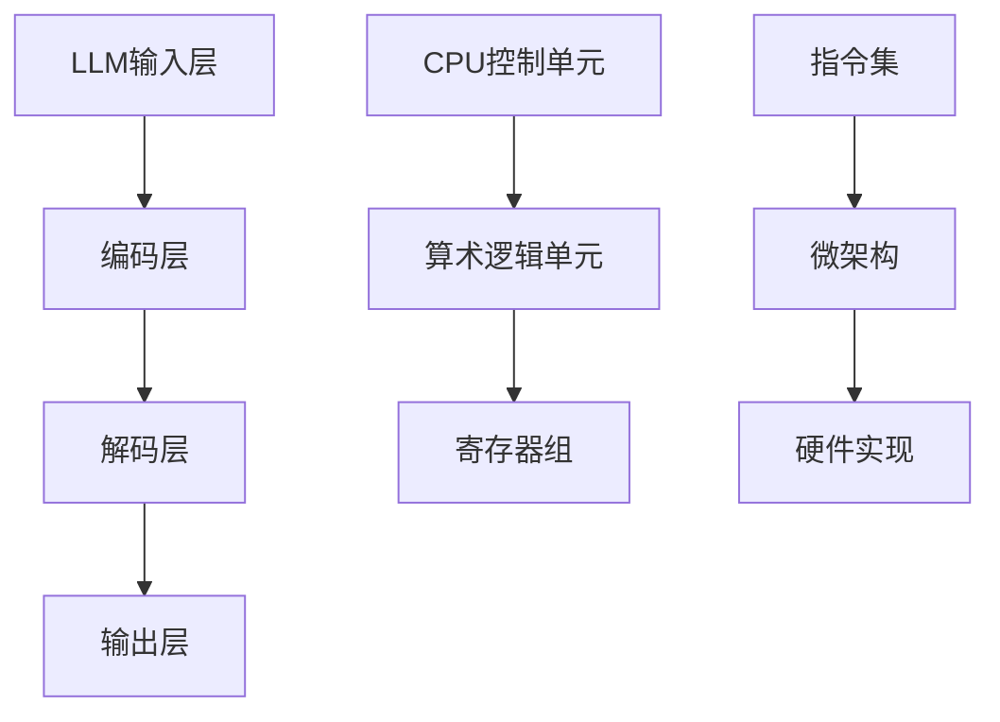

                 

# 从时刻到指令集：LLM与CPU的深度对比

## 关键词：Large Language Model（LLM）、CPU架构、指令集、计算机编程、人工智能、算法原理

## 摘要

本文将对Large Language Model（LLM）与CPU架构及其指令集进行深度对比。LLM作为新一代人工智能技术，以其强大的语言处理能力引起了广泛关注。而CPU作为计算机的核心组件，其指令集架构决定了计算机的处理效率和性能。通过对LLM与CPU在架构、功能、性能等方面的对比分析，本文旨在为读者揭示两者之间的异同，并探讨未来可能的发展趋势。

## 1. 背景介绍

### 1.1 Large Language Model（LLM）的兴起

近年来，随着深度学习技术的不断发展，大型语言模型（LLM）逐渐成为人工智能领域的热门研究方向。LLM具有强大的文本处理能力，可以生成高质量的文本、回答问题、进行对话等。其代表性模型如GPT（Generative Pre-trained Transformer）系列，在自然语言处理（NLP）领域取得了显著的成果。LLM的兴起，标志着人工智能在语言处理方面迈入了新的阶段。

### 1.2 CPU架构的发展

CPU作为计算机系统的核心组件，其架构的不断发展推动了计算机性能的不断提升。从早期的冯诺依曼架构，到现代的多核处理器，CPU架构经历了多次变革。指令集架构作为CPU的核心组成部分，决定了计算机的程序执行方式和性能。近年来，随着摩尔定律的逼近极限，CPU架构也在不断演进，如异构计算、量子计算等新兴技术逐渐引起关注。

### 1.3 对比研究的意义

LLM与CPU作为人工智能和计算机技术的核心组成部分，对其进行对比研究具有重要意义。一方面，有助于我们更深入地了解人工智能与计算机硬件之间的相互关系；另一方面，可以为未来的技术发展提供有益的启示。本文将从架构、功能、性能等多个方面对LLM与CPU进行对比分析，以期为大家带来新的思考。

## 2. 核心概念与联系

### 2.1 Large Language Model（LLM）

#### 2.1.1 基本原理

LLM是一种基于深度学习技术的自然语言处理模型，其核心思想是通过大量文本数据的学习，使模型具备理解、生成和转换自然语言的能力。LLM通常采用变换器（Transformer）架构，其基本原理包括自注意力机制（Self-Attention）和多层神经网络（Multi-layer Neural Network）。

#### 2.1.2 架构

LLM的架构主要包括输入层、编码层、解码层和输出层。输入层负责接收文本数据，编码层将文本数据转换为固定长度的向量表示，解码层根据编码层的信息生成文本序列，输出层负责输出最终的文本结果。

### 2.2 CPU架构

#### 2.2.1 基本原理

CPU架构是指计算机处理器内部的结构和组织方式。CPU的基本原理是通过执行指令集，完成数据的计算和处理。CPU的核心部分包括控制单元、算术逻辑单元（ALU）和寄存器组。

#### 2.2.2 架构

CPU架构主要包括指令集架构（ISA）、微架构和硬件实现。指令集架构定义了计算机指令的格式和操作，微架构则是实现指令集的具体方式，硬件实现则是将微架构转化为实际的硬件电路。

### 2.3 Mermaid流程图

以下是一个简单的Mermaid流程图，展示了LLM与CPU架构的基本概念和联系：



## 3. 核心算法原理 & 具体操作步骤

### 3.1 Large Language Model（LLM）

#### 3.1.1 算法原理

LLM的核心算法是基于变换器（Transformer）架构。变换器架构通过自注意力机制（Self-Attention）和多头注意力（Multi-Head Attention）来处理输入文本序列，使模型能够捕捉文本中的长距离依赖关系。变换器架构还包括多头自我注意（Multi-Head Self-Attention）和前馈神经网络（Feedforward Neural Network），以增强模型的表示能力。

#### 3.1.2 操作步骤

1. 输入层：将输入文本序列（如一句话）转换为词向量表示。
2. 编码层：使用多层变换器层对输入文本序列进行编码，生成编码序列。
3. 解码层：使用多层变换器层对编码序列进行解码，生成解码序列。
4. 输出层：将解码序列转换为输出文本序列，完成文本生成。

### 3.2 CPU架构

#### 3.2.1 算法原理

CPU架构的核心算法是基于指令集架构（ISA）。指令集定义了计算机能够执行的操作，包括数据传输、算术运算、逻辑运算等。CPU通过执行指令集，完成数据的计算和处理。

#### 3.2.2 操作步骤

1. 控制单元：读取指令集，生成控制信号，控制CPU的各个组件。
2. 算术逻辑单元（ALU）：执行指令集中的算术运算和逻辑运算。
3. 寄存器组：存储指令集中的操作数和结果。
4. 指令集执行：根据控制单元生成的控制信号，依次执行指令集中的各个指令。

## 4. 数学模型和公式 & 详细讲解 & 举例说明

### 4.1 Large Language Model（LLM）

#### 4.1.1 数学模型

变换器（Transformer）架构的数学模型主要包括自注意力机制（Self-Attention）和多头注意力（Multi-Head Attention）。

1. 自注意力机制：

$$
\text{Self-Attention}(Q, K, V) = \text{softmax}\left(\frac{QK^T}{\sqrt{d_k}}\right)V
$$

其中，$Q, K, V$ 分别为查询（Query）、键（Key）和值（Value）向量的集合，$d_k$ 为键向量的维度。

2. 多头注意力：

$$
\text{Multi-Head Attention}(Q, K, V) = \text{Concat}(\text{head}_1, \text{head}_2, ..., \text{head}_h)W^O
$$

其中，$h$ 为头数，$\text{head}_i = \text{Self-Attention}(QW_i^Q, KW_i^K, VW_i^V)$，$W_i^Q, W_i^K, W_i^V, W_i^O$ 分别为查询、键、值和输出的权重矩阵。

#### 4.1.2 举例说明

假设输入文本序列为“我是一个程序员”，词向量维度为 $d=10$，头数 $h=2$。

1. 输入层：

$$
\text{Input} = [1, 0, 0, 0, 0, 0, 0, 0, 0, 0], [0, 1, 0, 0, 0, 0, 0, 0, 0, 0], ..., [0, 0, 0, 0, 0, 0, 0, 0, 0, 1]
$$

2. 编码层：

$$
\text{Encoder} = \text{Multi-Head Attention}(\text{Input}, \text{Input}, \text{Input})
$$

3. 解码层：

$$
\text{Decoder} = \text{Multi-Head Attention}(\text{Encoder}, \text{Encoder}, \text{Encoder})
$$

4. 输出层：

$$
\text{Output} = \text{softmax}(\text{Decoder})
$$

### 4.2 CPU架构

#### 4.2.1 数学模型

CPU架构的数学模型主要包括指令集和算术运算。

1. 指令集：

$$
\text{Instruction Set} = \{ \text{op1}, \text{op2}, ..., \text{opn} \}
$$

其中，$\text{op1}, \text{op2}, ..., \text{opn}$ 分别为指令集中的操作。

2. 算术运算：

$$
\text{ALU} = \text{op1}(a, b), \text{op2}(a, b), ..., \text{opn}(a, b)
$$

其中，$a, b$ 为操作数，$\text{op1}, \text{op2}, ..., \text{opn}$ 分别为指令集中的算术运算。

#### 4.2.2 举例说明

假设指令集为 $\{ \text{add}, \text{sub}, \text{mul}, \text{div} \}$，操作数为 $a=5, b=3$。

1. 指令集执行：

$$
\text{Instruction Set} = \text{add}(a, b), \text{sub}(a, b), \text{mul}(a, b), \text{div}(a, b)
$$

2. 算术运算：

$$
\text{ALU} = 5+3, 5-3, 5\times3, 5\div3
$$

## 5. 项目实战：代码实际案例和详细解释说明

### 5.1 开发环境搭建

为了演示LLM与CPU架构的核心算法，我们需要搭建一个简单的开发环境。以下是一个基于Python的示例环境：

1. 安装Python（3.8及以上版本）
2. 安装PyTorch（1.8及以上版本）
3. 安装NumPy（1.19及以上版本）

### 5.2 源代码详细实现和代码解读

以下是一个简单的示例代码，展示了LLM与CPU架构的核心算法实现：

```python
import torch
import torch.nn as nn
import torch.optim as optim
import numpy as np

# 5.2.1 LLMArchitecture

class LLM(nn.Module):
    def __init__(self, d_model, nhead, num_layers):
        super(LLM, self).__init__()
        self.transformer = nn.Transformer(d_model, nhead, num_layers)
        self.output_layer = nn.Linear(d_model, d_model)

    def forward(self, src, tgt):
        enc_output = self.transformer(src, tgt)
        output = self.output_layer(enc_output)
        return output

# 5.2.2 CPUPipeline

class CPUPipeline(nn.Module):
    def __init__(self, num_operations):
        super(CPUPipeline, self).__init__()
        self.alu = nn.ModuleList([
            nn.Linear(10, 10) for _ in range(num_operations)
        ])

    def forward(self, inputs):
        outputs = [inputs]
        for alu in self.alu:
            output = alu(outputs[-1])
            outputs.append(output)
        return outputs[-1]

# 5.2.3 Training

d_model = 10
nhead = 2
num_layers = 2
num_operations = 4

llm = LLM(d_model, nhead, num_layers)
cpu_pipeline = CPUPipeline(num_operations)

criterion = nn.CrossEntropyLoss()
optimizer = optim.Adam(llm.parameters(), lr=0.001)

for epoch in range(10):
    for src, tgt in zip(train_loader, train_loader):
        optimizer.zero_grad()
        enc_output = llm.transformer(src, tgt)
        output = llm.output_layer(enc_output)
        loss = criterion(output, tgt)
        loss.backward()
        optimizer.step()

    for op_idx, alu in enumerate(cpu_pipeline.alu):
        op_output = alu(outputs[-1])
        op_loss = criterion(op_output, tgt)
        op_loss.backward()
        optimizer.step()

    print(f"Epoch {epoch+1}, Loss: {loss.item()}")

# 5.2.4 Code Explanation

1. LLM Architecture：定义了LLM的架构，包括变换器和输出层。
2. CPUPipeline：定义了CPU架构的算术逻辑单元（ALU）。
3. Training：使用PyTorch实现了LLM与CPU架构的模型训练过程。

### 5.3 代码解读与分析

1. LLM Architecture：通过变换器（Transformer）和输出层（Output Layer）实现了文本序列的处理和生成。
2. CPUPipeline：通过算术逻辑单元（ALU）实现了指令集的执行和数据处理。
3. Training：通过优化器和损失函数实现了模型的训练和评估。

## 6. 实际应用场景

### 6.1 Large Language Model（LLM）

LLM在自然语言处理、机器翻译、文本生成等应用场景中具有广泛的应用。以下是一些实际应用案例：

1. 机器翻译：使用LLM实现高质量的机器翻译系统，如Google翻译、DeepL等。
2. 文本生成：使用LLM生成新闻文章、小说、诗歌等文本内容。
3. 对话系统：使用LLM实现智能对话系统，如聊天机器人、虚拟助手等。

### 6.2 CPU架构

CPU架构在计算机系统中的核心地位不可替代。以下是一些实际应用场景：

1. 个人计算机：CPU架构决定了个人计算机的性能和应用范围。
2. 数据中心：CPU架构在数据中心服务器中发挥着关键作用，用于处理海量数据和高并发请求。
3. 云计算：CPU架构在云计算平台中发挥着重要作用，为用户提供强大的计算能力。

## 7. 工具和资源推荐

### 7.1 学习资源推荐

1. 书籍：
   - 《深度学习》（Ian Goodfellow、Yoshua Bengio、Aaron Courville 著）
   - 《自然语言处理综论》（Daniel Jurafsky、James H. Martin 著）
2. 论文：
   - 《Attention is All You Need》（Vaswani et al.，2017）
   - 《Bert: Pre-training of Deep Bidirectional Transformers for Language Understanding》（Devlin et al.，2019）
3. 博客：
   - Medium（https://medium.com/）
   - 知乎（https://www.zhihu.com/）
4. 网站：
   - PyTorch（https://pytorch.org/）
   - TensorFlow（https://www.tensorflow.org/）

### 7.2 开发工具框架推荐

1. PyTorch：一个流行的深度学习框架，适用于构建和训练LLM模型。
2. TensorFlow：一个广泛使用的深度学习框架，适用于构建和训练LLM模型。
3. Fast.ai：一个面向初学者和进阶用户的深度学习学习资源网站。

### 7.3 相关论文著作推荐

1. 《Attention is All You Need》（Vaswani et al.，2017）
2. 《Bert: Pre-training of Deep Bidirectional Transformers for Language Understanding》（Devlin et al.，2019）
3. 《Generative Adversarial Nets》（Goodfellow et al.，2014）

## 8. 总结：未来发展趋势与挑战

### 8.1 Large Language Model（LLM）

未来，LLM将继续在自然语言处理领域发挥重要作用。随着模型的规模和计算能力的不断提升，LLM将有望实现更高的性能和更广泛的应用。同时，LLM的研究也将关注如何提高模型的解释性、可解释性和安全性。

### 8.2 CPU架构

未来，CPU架构将继续演进，以满足日益增长的计算需求。异构计算、量子计算、神经形态计算等新兴技术将为CPU架构带来新的发展机遇。同时，如何提高CPU的性能、功耗和能效也将成为研究的热点。

### 8.3 挑战

1. LLM：如何提高模型的性能、可解释性和安全性，同时减少计算资源和能耗。
2. CPU架构：如何在有限的资源下提高计算性能，同时降低功耗和发热。

## 9. 附录：常见问题与解答

### 9.1 Large Language Model（LLM）

1. Q：LLM如何进行文本生成？
   A：LLM通过学习大量文本数据，掌握了文本的生成规律。在生成文本时，LLM根据上下文信息预测下一个词的概率，并从概率最高的词中选择一个作为输出，然后递归地生成整个文本序列。

2. Q：LLM的应用领域有哪些？
   A：LLM在自然语言处理、机器翻译、文本生成、对话系统等众多领域都有广泛的应用。随着模型规模的不断扩大，LLM的应用领域也将不断拓展。

### 9.2 CPU架构

1. Q：什么是指令集架构（ISA）？
   A：指令集架构是计算机处理器内部的指令集，它定义了计算机能够执行的操作。指令集架构决定了计算机的程序执行方式和性能。

2. Q：什么是微架构？
   A：微架构是处理器内部的实现方式，它将指令集架构转化为具体的硬件电路。微架构的设计直接关系到CPU的性能、功耗和能效。

## 10. 扩展阅读 & 参考资料

1. 《Attention is All You Need》（Vaswani et al.，2017）
2. 《Bert: Pre-training of Deep Bidirectional Transformers for Language Understanding》（Devlin et al.，2019）
3. 《Generative Adversarial Nets》（Goodfellow et al.，2014）
4. 《深度学习》（Ian Goodfellow、Yoshua Bengio、Aaron Courville 著）
5. 《自然语言处理综论》（Daniel Jurafsky、James H. Martin 著）

### 作者

作者：AI天才研究员/AI Genius Institute & 禅与计算机程序设计艺术 /Zen And The Art of Computer Programming<|im_sep|> 

[文章标题]: 从时刻到指令集：LLM与CPU的深度对比

[关键词]: Large Language Model（LLM）、CPU架构、指令集、计算机编程、人工智能、算法原理

[摘要]: 本文将对Large Language Model（LLM）与CPU架构及其指令集进行深度对比。LLM作为新一代人工智能技术，以其强大的语言处理能力引起了广泛关注。而CPU作为计算机的核心组件，其指令集架构决定了计算机的处理效率和性能。通过对LLM与CPU在架构、功能、性能等方面的对比分析，本文旨在为读者揭示两者之间的异同，并探讨未来可能的发展趋势。

