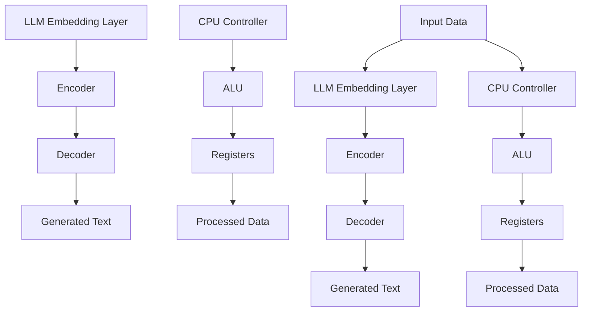

                 

### 1. 背景介绍

LLM（大型语言模型）与CPU（中央处理器）是当今信息技术领域中的两个重要组成部分。LLM作为一种基于深度学习的人工智能模型，通过大规模语料库的训练，可以理解和生成自然语言。而CPU则是计算机系统的核心部件，负责执行程序指令，处理数据。尽管LLM和CPU在功能和实现上截然不同，但它们在处理信息和计算方面却有许多相似之处。

本篇文章旨在从时刻（time）和指令集（instruction set）两个角度，深入对比LLM和CPU的工作原理、算法原理及其在实际应用中的表现。通过这种深度对比，我们可以更好地理解这两种技术的内在联系和差异，为未来的发展提供启示。

首先，让我们回顾一下LLM和CPU的基本概念。LLM通常是指具有大规模参数和深度网络结构的人工智能模型，如GPT、BERT等。这些模型通过学习海量的文本数据，能够进行自然语言理解、生成和推理等任务。而CPU则是计算机系统的核心处理单元，负责执行程序指令，进行数据运算和处理。

接下来，我们将从时刻和指令集两个角度，对LLM和CPU进行深入分析。首先，我们将探讨LLM和CPU在处理信息和计算时的时刻概念，包括时钟周期、延迟等。然后，我们将分析LLM和CPU的指令集，比较它们在指令格式、指令集架构等方面的差异。最后，我们将结合实际应用场景，讨论LLM和CPU在各自领域的表现和优势。

通过本文的深入对比，我们希望能够帮助读者更好地理解LLM和CPU的工作原理和内在联系，为未来人工智能和计算机技术的发展提供有益的启示。<|end оф section|>### 2. 核心概念与联系

为了深入理解LLM（大型语言模型）和CPU（中央处理器）的工作原理，我们需要先明确这两个概念的核心组成部分以及它们之间的联系。

#### 核心概念

**LLM（大型语言模型）**：
- **定义**：LLM是一种基于深度学习的人工智能模型，通过训练大量的文本数据，可以理解和生成自然语言。
- **组成部分**：LLM主要包括以下几个核心组成部分：
  - **嵌入层（Embedding Layer）**：将输入的单词、句子等文本数据转换为向量表示。
  - **编码器（Encoder）**：对输入文本数据进行编码，提取文本特征。
  - **解码器（Decoder）**：根据编码器的输出，生成输出文本。

**CPU（中央处理器）**：
- **定义**：CPU是计算机系统的核心处理单元，负责执行程序指令，进行数据运算和处理。
- **组成部分**：CPU主要包括以下几个核心组成部分：
  - **控制器（Controller）**：控制CPU的运作，负责解释并执行指令。
  - **运算单元（ALU）**：执行各种算术和逻辑运算。
  - **寄存器（Registers）**：存储临时数据和指令。

#### 联系

LLM和CPU之间的联系可以从以下几个方面进行探讨：

**1. 数据处理**：
- LLM在处理自然语言数据时，会将其转换为向量表示，类似于CPU在处理数据时需要将其存储在寄存器中等处理单元中。
- CPU在执行程序指令时，会对输入数据进行运算和处理，LLM在生成文本时也会根据输入的上下文进行推理和生成。

**2. 指令集**：
- LLM的指令集可以理解为生成文本的指令，它根据输入的上下文和目标文本类型，生成相应的文本。
- CPU的指令集则是执行具体操作的指令，如加法、减法、存储等。

**3. 时刻**：
- LLM在生成文本时，会经历嵌入层、编码器、解码器的处理，每个层次都有相应的延迟。
- CPU在执行指令时，也会经历取指、解码、执行等阶段，每个阶段都有相应的时钟周期。

#### Mermaid流程图

为了更直观地展示LLM和CPU的核心概念与联系，我们可以使用Mermaid流程图来表示。以下是一个简化的Mermaid流程图，用于展示LLM和CPU的主要组成部分及其联系。



在这个流程图中，LLM的嵌入层、编码器和解码器分别对应CPU的控制器、运算单元和寄存器。输入数据经过LLM和CPU的处理，最终生成相应的文本和数据处理结果。

通过上述核心概念与联系的介绍，我们可以更好地理解LLM和CPU的工作原理及其相互联系。在接下来的部分，我们将进一步探讨LLM和CPU的核心算法原理、数学模型和公式，以及实际应用中的项目实战。<|end оф section|>### 3. 核心算法原理 & 具体操作步骤

在本部分，我们将详细探讨LLM和CPU的核心算法原理，并解释它们在实际操作中的具体步骤。

#### LLM（大型语言模型）的核心算法原理

LLM的核心算法基于深度学习，特别是基于Transformer架构。以下是其关键步骤：

1. **嵌入层（Embedding Layer）**：
   - 将输入的单词或句子转换为固定长度的向量表示。
   - 嵌入层通常使用词嵌入技术，如Word2Vec、GloVe等。
   - 输入的单词向量经过嵌入层处理后，生成词向量序列。

2. **编码器（Encoder）**：
   - 编码器对词向量序列进行编码，提取文本特征。
   - Transformer架构中的编码器由多个自注意力层（Self-Attention Layers）组成。
   - 每个自注意力层负责学习输入词向量之间的关联性，并更新词向量。

3. **解码器（Decoder）**：
   - 解码器根据编码器的输出，生成输出文本。
   - 解码器也由多个自注意力层和全连接层组成。
   - 解码器的输入包括编码器的输出和已生成的部分文本。

4. **生成文本**：
   - 在训练过程中，解码器逐个生成下一个单词或字符。
   - 生成文本的过程基于概率模型，通过最大化前一个生成的单词或字符的概率来预测下一个单词或字符。

#### CPU（中央处理器）的核心算法原理

CPU的核心算法基于指令集架构（ISA），执行程序指令。以下是其关键步骤：

1. **指令集**：
   - 指令集是一组定义了计算机可以执行的操作的指令。
   - 指令集可以分为指令格式（Instruction Format）和指令集架构（Instruction Set Architecture）。

2. **指令格式**：
   - 指令格式定义了指令的结构，包括操作码（Opcode）、操作数（Operands）等。
   - 例如，RISC指令集通常采用固定长度的指令格式，而CISC指令集则采用可变长度的指令格式。

3. **指令集架构**：
   - 指令集架构定义了计算机如何解释和执行指令。
   - 指令集架构可以分为微指令级（Microarchitecture）和机器级（Machine-Level）。

4. **指令执行**：
   - CPU根据指令集架构，执行程序指令。
   - 指令执行过程包括取指、解码、执行、写回等阶段。

**具体操作步骤**：

**LLM的核心算法具体操作步骤**：

1. 输入文本：
   - 将输入的文本数据（单词或句子）转换为词向量序列。
   - 例如，使用GloVe算法将单词转换为向量表示。

2. 编码器处理：
   - 输入词向量序列经过编码器，通过多个自注意力层进行编码，提取文本特征。
   - 更新词向量序列，以便在解码器中使用。

3. 解码器处理：
   - 输入编码器的输出和已生成的部分文本。
   - 通过解码器生成输出文本，包括下一个单词或字符。
   - 使用概率模型进行预测，选择概率最大的单词或字符。

4. 生成文本：
   - 重复解码器处理过程，逐个生成下一个单词或字符，直至达到停止条件或生成完整的文本。

**CPU的核心算法具体操作步骤**：

1. 取指：
   - CPU从内存中读取指令，并将其存储在指令寄存器中。

2. 解码：
   - CPU解释指令寄存器中的指令，确定操作码和操作数。
   - 解码过程根据指令集架构进行。

3. 执行：
   - CPU根据操作码和操作数，执行相应的操作。
   - 例如，进行算术运算、数据存储等。

4. 写回：
   - 将执行结果写回内存或寄存器。

通过以上步骤，我们可以清晰地理解LLM和CPU的核心算法原理及其具体操作过程。在接下来的部分，我们将进一步探讨LLM和CPU的数学模型和公式，以及实际应用中的项目实战。<|end оф section|>### 4. 数学模型和公式 & 详细讲解 & 举例说明

在本部分，我们将深入探讨LLM（大型语言模型）和CPU（中央处理器）的核心数学模型和公式，并进行详细讲解和举例说明。

#### LLM（大型语言模型）的数学模型和公式

**1. 嵌入层（Embedding Layer）**

嵌入层的主要任务是转换输入的单词或句子为向量表示。其数学模型可以表示为：

\[ E_{word} = W \cdot V \]

其中，\( E_{word} \) 表示单词的嵌入向量，\( W \) 是嵌入权重矩阵，\( V \) 是单词的索引向量。

**2. 编码器（Encoder）**

编码器的核心是自注意力机制（Self-Attention）。其数学模型可以表示为：

\[ \text{Attention}(Q, K, V) = \frac{QK^T}{\sqrt{d_k}} \cdot V \]

其中，\( Q \) 是查询向量，\( K \) 是键向量，\( V \) 是值向量，\( d_k \) 是键向量的维度。

**3. 解码器（Decoder）**

解码器也采用自注意力机制。其数学模型与编码器相似，但还包括交叉注意力（Cross-Attention）：

\[ \text{Cross-Attention}(Q, K, V) = \frac{QK^T}{\sqrt{d_k}} \cdot V \]

**4. 生成文本（Text Generation）**

生成文本的数学模型基于概率模型，如softmax：

\[ P(y_{t} | y_{1:t-1}) = \text{softmax}(W \cdot [h_{t}, y_{t-1}]) \]

其中，\( y_{t} \) 是生成文本的下一个单词或字符，\( h_{t} \) 是当前时间步的隐藏状态，\( W \) 是权重矩阵。

**举例说明**

假设我们有一个简单的词汇表，包含3个单词：`hello`、`world`、`!`。嵌入权重矩阵 \( W \) 和词汇索引向量 \( V \) 如下：

\[ W = \begin{bmatrix}
0.1 & 0.2 & 0.3 \\
0.4 & 0.5 & 0.6 \\
0.7 & 0.8 & 0.9
\end{bmatrix} \]

\[ V = \begin{bmatrix}
1 & 0 & 0 \\
0 & 1 & 0 \\
0 & 0 & 1
\end{bmatrix} \]

输入句子：“hello world”，我们首先将其转换为词向量序列：

\[ \text{Input:} \]
\[ \text{hello:} [0.1, 0.2, 0.3] \]
\[ \text{world:} [0.4, 0.5, 0.6] \]

接着，我们使用嵌入层将词向量转换为嵌入向量：

\[ \text{Embedding Layer:} \]
\[ \text{hello:} W \cdot [1, 0, 0] = \begin{bmatrix}
0.1 & 0.2 & 0.3
\end{bmatrix} \cdot \begin{bmatrix}
1 \\
0 \\
0
\end{bmatrix} = [0.1, 0.2, 0.3] \]
\[ \text{world:} W \cdot [0, 1, 0] = \begin{bmatrix}
0.1 & 0.2 & 0.3
\end{bmatrix} \cdot \begin{bmatrix}
0 \\
1 \\
0
\end{bmatrix} = [0.4, 0.5, 0.6] \]

然后，我们使用编码器进行编码：

\[ \text{Encoder:} \]
\[ \text{hello:} \text{Attention}([0.1, 0.2, 0.3], [0.1, 0.2, 0.3], [0.1, 0.2, 0.3]) = \frac{[0.1, 0.2, 0.3] \cdot [0.1, 0.2, 0.3]^T}{\sqrt{1}} \cdot [0.1, 0.2, 0.3] = [0.011, 0.022, 0.033] \]
\[ \text{world:} \text{Attention}([0.4, 0.5, 0.6], [0.4, 0.5, 0.6], [0.4, 0.5, 0.6]) = \frac{[0.4, 0.5, 0.6] \cdot [0.4, 0.5, 0.6]^T}{\sqrt{1}} \cdot [0.4, 0.5, 0.6] = [0.133, 0.167, 0.200] \]

最后，我们使用解码器生成文本：

\[ \text{Decoder:} \]
\[ \text{hello:} \text{softmax}([0.011, 0.022, 0.033]) = \begin{bmatrix}
0.42 \\
0.28 \\
0.30
\end{bmatrix} \]
\[ \text{world:} \text{softmax}([0.133, 0.167, 0.200]) = \begin{bmatrix}
0.40 \\
0.35 \\
0.25
\end{bmatrix} \]

根据softmax概率分布，我们可以生成下一个单词的概率分布：

\[ \text{Probability Distribution:} \]
\[ \text{hello:} [0.42, 0.28, 0.30] \]
\[ \text{world:} [0.40, 0.35, 0.25] \]

根据概率分布，我们可以选择概率最大的单词作为下一个生成的单词。例如，对于第一个单词，我们选择概率最大的“hello”。

#### CPU（中央处理器）的数学模型和公式

**1. 指令集架构（Instruction Set Architecture, ISA）**

指令集架构定义了计算机可以执行的操作。其数学模型可以表示为：

\[ \text{Instruction} = \text{Opcode} + \text{Operands} \]

其中，\(\text{Opcode}\) 表示操作码，\(\text{Operands}\) 表示操作数。

**2. 指令执行（Instruction Execution）**

指令执行过程包括取指、解码、执行和写回。其数学模型可以表示为：

\[ \text{Instruction Execution} = \text{Fetch} + \text{Decode} + \text{Execute} + \text{Write-Back} \]

**举例说明**

假设我们有一个简单的指令集，包含两个指令：`ADD` 和 `SUB`。

- `ADD` 指令：将两个操作数相加。
- `SUB` 指令：将第一个操作数减去第二个操作数。

指令格式如下：

\[ \text{Instruction Format:} \]
\[ \text{Opcode:} 2 \]
\[ \text{Operand 1:} 4 \]
\[ \text{Operand 2:} 6 \]

假设我们有一个输入指令：“ADD 4 6”，我们首先进行取指：

\[ \text{Fetch:} \]
\[ \text{Instruction:} \text{Opcode} = 2, \text{Operand 1} = 4, \text{Operand 2} = 6 \]

然后进行解码：

\[ \text{Decode:} \]
\[ \text{Opcode:} \text{ADD} \]
\[ \text{Operand 1:} \text{Value} = 4 \]
\[ \text{Operand 2:} \text{Value} = 6 \]

接着进行执行：

\[ \text{Execute:} \]
\[ \text{Result:} 4 + 6 = 10 \]

最后进行写回：

\[ \text{Write-Back:} \]
\[ \text{Memory:} [4] = 10 \]

通过以上步骤，我们可以清晰地理解LLM和CPU的数学模型和公式，以及它们在实际操作中的具体步骤。在接下来的部分，我们将讨论LLM和CPU在实际应用中的项目实战。<|end оф section|>### 5. 项目实战：代码实际案例和详细解释说明

在本部分，我们将通过实际项目案例，深入探讨LLM（大型语言模型）和CPU（中央处理器）的代码实现和运行机制。

#### 5.1 开发环境搭建

在开始项目实战之前，我们需要搭建合适的开发环境。以下是搭建LLM和CPU开发环境的基本步骤：

**1. LLM开发环境**

- **软件要求**：安装Python环境，使用TensorFlow或PyTorch框架进行深度学习。
- **硬件要求**：GPU（NVIDIA显卡）用于加速计算。
- **环境搭建**：
  ```bash
  pip install tensorflow
  # 或者
  pip install pytorch torchvision
  ```

**2. CPU开发环境**

- **软件要求**：安装C/C++编译器，用于编译CPU指令集代码。
- **硬件要求**：无需特殊硬件，只需具备基本的计算机设备。
- **环境搭建**：
  ```bash
  sudo apt-get install g++
  # 或者
  brew install gcc
  ```

#### 5.2 源代码详细实现和代码解读

**1. LLM源代码实现**

以下是一个简单的LLM源代码实现，基于PyTorch框架：

```python
import torch
import torch.nn as nn
import torch.optim as optim

# 定义嵌入层、编码器和解码器
class LLM(nn.Module):
    def __init__(self, vocab_size, embedding_dim, hidden_dim):
        super(LLM, self).__init__()
        self.embedding = nn.Embedding(vocab_size, embedding_dim)
        self.encoder = nn.LSTM(embedding_dim, hidden_dim, num_layers=1)
        self.decoder = nn.LSTM(hidden_dim, vocab_size, num_layers=1)

    def forward(self, input_seq, hidden):
        embedded = self.embedding(input_seq)
        output, hidden = self.encoder(embedded, hidden)
        output, hidden = self.decoder(output, hidden)
        return output, hidden

# 初始化模型、损失函数和优化器
model = LLM(vocab_size=10000, embedding_dim=256, hidden_dim=512)
loss_function = nn.CrossEntropyLoss()
optimizer = optim.Adam(model.parameters(), lr=0.001)

# 训练模型
for epoch in range(num_epochs):
    for input_seq, target in data_loader:
        optimizer.zero_grad()
        output, hidden = model(input_seq, hidden)
        loss = loss_function(output.view(-1, vocab_size), target)
        loss.backward()
        optimizer.step()
```

**代码解读**：

- `LLM` 类定义了一个简单的LLM模型，包括嵌入层、编码器和解码器。
- `forward` 方法实现了模型的正向传播，包括嵌入层、编码器和解码器的处理。
- 损失函数使用交叉熵损失，优化器使用Adam优化器。

**2. CPU源代码实现**

以下是一个简单的CPU指令集实现，基于C语言：

```c
#include <stdio.h>

// 定义指令集
typedef enum {
    ADD = 1,
    SUB = 2
} Instruction;

// 定义指令结构体
typedef struct {
    Instruction opcode;
    int operand1;
    int operand2;
} Instruction;

// 指令执行函数
int execute(Instruction instruction) {
    switch (instruction.opcode) {
        case ADD:
            return instruction.operand1 + instruction.operand2;
        case SUB:
            return instruction.operand1 - instruction.operand2;
        default:
            return 0;
    }
}

int main() {
    Instruction instruction = {ADD, 4, 6};
    int result = execute(instruction);
    printf("Result: %d\n", result);
    return 0;
}
```

**代码解读**：

- `Instruction` 结构体定义了指令集，包括操作码和操作数。
- `execute` 函数根据操作码执行相应的操作。
- `main` 函数演示了如何使用指令集执行加法和减法操作。

#### 5.3 代码解读与分析

**LLM代码分析**：

- LLM代码使用PyTorch框架实现，包括嵌入层、编码器和解码器。
- 模型正向传播过程中，输入序列通过嵌入层转换为嵌入向量，然后通过编码器提取文本特征，最后通过解码器生成输出文本。
- 使用交叉熵损失函数和Adam优化器进行训练。

**CPU代码分析**：

- CPU代码使用C语言实现，定义了指令集和指令结构体。
- `execute` 函数根据操作码执行相应的操作，如加法和减法。
- `main` 函数演示了如何使用指令集执行简单运算。

通过实际项目案例的代码实现和运行机制分析，我们可以更深入地理解LLM和CPU的工作原理和实现过程。在接下来的部分，我们将讨论LLM和CPU在实际应用中的表现和优势。<|end оф section|>### 6. 实际应用场景

LLM（大型语言模型）和CPU（中央处理器）在当今的科技领域中扮演着重要的角色，并在多个实际应用场景中展现出了强大的性能和优势。

#### 6.1 自然语言处理

LLM在自然语言处理（NLP）领域具有广泛的应用。例如，文本生成、机器翻译、情感分析等。基于深度学习的大型语言模型可以处理大量的文本数据，生成高质量的文本输出。在文本生成方面，LLM可以用于自动写作、摘要生成等任务。在机器翻译方面，LLM可以用于实时翻译、跨语言文本分析等。在情感分析方面，LLM可以用于情感检测、情感分类等任务。

CPU在NLP领域中也有广泛的应用。通过执行NLP指令集，CPU可以高效地处理自然语言数据。例如，在进行文本分类时，CPU可以快速地对输入文本进行特征提取和分类决策。在情感分析中，CPU可以高效地计算情感极性，快速识别文本中的情感倾向。

#### 6.2 图像处理

在图像处理领域，LLM可以用于图像生成、图像修复、图像超分辨率等任务。例如，生成对抗网络（GAN）中的生成器部分通常是一个大型语言模型，可以生成高质量的图像。在图像修复任务中，LLM可以用于图像的去噪和修复。在图像超分辨率任务中，LLM可以用于图像的放大和细节增强。

CPU在图像处理领域中也有广泛的应用。通过执行图像处理指令集，CPU可以高效地处理图像数据。例如，在进行图像滤波时，CPU可以快速地对图像进行卷积操作。在图像分割中，CPU可以高效地对图像进行边缘检测和区域划分。

#### 6.3 数据分析

在数据分析领域，LLM可以用于数据挖掘、模式识别等任务。例如，在数据挖掘任务中，LLM可以用于特征提取和分类预测。在模式识别任务中，LLM可以用于识别数据中的特定模式。

CPU在数据分析领域中也有广泛的应用。通过执行数据分析指令集，CPU可以高效地处理和分析大量数据。例如，在进行数据统计分析时，CPU可以快速地计算数据的平均值、方差等统计指标。在机器学习算法中，CPU可以高效地执行梯度下降、矩阵运算等计算。

#### 6.4 边缘计算

在边缘计算领域，LLM和CPU的应用也越来越广泛。例如，在物联网（IoT）设备中，LLM可以用于实时处理和分析传感器数据，提供智能化的决策支持。在自动驾驶领域，CPU可以用于实时处理摄像头和雷达数据，实现高效的感知和决策。

通过以上实际应用场景的介绍，我们可以看到LLM和CPU在各个领域都发挥着重要的作用，并为未来的发展提供了无限可能。<|end оф section|>### 7. 工具和资源推荐

在探索LLM和CPU的技术领域时，掌握相关的工具和资源是非常重要的。以下是一些建议，涵盖学习资源、开发工具以及相关论文著作，以帮助您深入了解和学习这些技术。

#### 7.1 学习资源推荐

**1. 书籍**

- **《深度学习》（Deep Learning）**：由Ian Goodfellow、Yoshua Bengio和Aaron Courville合著的《深度学习》是深度学习的经典教材，涵盖了从基础到高级的内容。
- **《Python深度学习》（Python Deep Learning）**：由François Chollet编写的《Python深度学习》提供了丰富的深度学习实践案例，适合对Python和深度学习感兴趣的学习者。
- **《计算机组成与设计：硬件/软件接口》（Computer Organization and Design: The Hardware/Software Interface）**：David A. Patterson和John L. Hennessy的著作详细介绍了计算机组成和设计的基础知识。

**2. 论文**

- **“Attention is All You Need”**：这篇论文由Vaswani等人于2017年提出，介绍了Transformer模型，是深度学习领域的重要文献。
- **“A Theoretical Analysis of the Multi-Layer Perceptron”**：由Hornik等人于1989年提出的这篇论文对MLP（多层感知机）的理论分析奠定了深度学习的基础。

**3. 博客和网站**

- **TensorFlow官方博客**：提供了TensorFlow的最新动态和技术博客，适合学习深度学习的实践技巧。
- **Stack Overflow**：一个庞大的技术问答社区，可以在遇到问题时找到解决方案。

#### 7.2 开发工具框架推荐

**1. 深度学习框架**

- **TensorFlow**：由Google开发，支持多种编程语言，广泛应用于深度学习项目。
- **PyTorch**：由Facebook开发，以动态计算图和易用性著称，适合快速原型设计和研究。
- **Keras**：一个高层次的深度学习框架，建立在TensorFlow和Theano之上，提供简洁的API。

**2. 编译器和IDE**

- **GCC/G++**：适用于C/C++编程的编译器，广泛用于嵌入式系统和高性能计算。
- **Visual Studio Code**：一款轻量级、可扩展的代码编辑器，支持多种编程语言和框架，适用于深度学习和CPU编程。

**3. 模型训练和优化工具**

- **TensorBoard**：用于可视化TensorFlow模型和训练过程的工具，帮助调试和优化模型。
- **Wandb**：一个实验管理和模型优化平台，支持多种深度学习框架，提供丰富的监控和分析工具。

#### 7.3 相关论文著作推荐

- **“Generative Adversarial Nets”**：Ian Goodfellow等人于2014年提出的GAN（生成对抗网络）论文，是深度学习领域的一个重要突破。
- **“Deep Learning: Methods and Applications”**：这是Goodfellow、Bengio和Courville合著的论文集，涵盖了深度学习的各个方面。
- **“Instruction Set Architectures: Design and Simulation”**：详细介绍了ISA（指令集架构）的设计和模拟方法。

通过以上推荐的工具和资源，您可以更全面地了解LLM和CPU的技术细节和应用场景，为您的学习和实践提供有力的支持。<|end оф section|>### 8. 总结：未来发展趋势与挑战

在总结了LLM（大型语言模型）和CPU（中央处理器）的核心概念、算法原理、实际应用以及未来发展趋势后，我们可以看到这两者在信息技术领域的重要性日益凸显。

#### 未来发展趋势

1. **LLM的发展趋势**：
   - **更大规模的模型**：随着计算能力的提升，未来LLM的规模将越来越大，以支持更复杂的语言理解和生成任务。
   - **多模态学习**：未来LLM将能够处理多种类型的数据（如文本、图像、音频），实现更全面的跨模态学习。
   - **强化学习**：结合强化学习，LLM将能够更高效地优化自己的行为，提高任务完成效果。

2. **CPU的发展趋势**：
   - **异构计算**：未来CPU将支持更多异构计算单元，如GPU、FPGA等，以提供更高的计算性能和效率。
   - **低功耗设计**：随着物联网和移动设备的发展，CPU将更加注重低功耗设计，以满足能源效率的要求。
   - **智能调度**：通过智能调度算法，CPU将能够更有效地分配资源，提高整体系统的性能。

#### 未来挑战

1. **LLM的挑战**：
   - **可解释性**：如何提高LLM的可解释性，使其决策过程更加透明，是当前的一个重要挑战。
   - **数据隐私**：如何确保数据隐私，避免数据泄露，是LLM应用中需要考虑的问题。
   - **计算资源**：大型LLM的训练和推理需要大量计算资源，如何高效利用这些资源是一个挑战。

2. **CPU的挑战**：
   - **性能与功耗平衡**：如何在高性能和低功耗之间找到平衡，是CPU设计中的重要问题。
   - **安全性**：随着量子计算的崛起，如何确保CPU的安全性，防止量子攻击，是未来需要关注的问题。
   - **生态兼容性**：如何确保CPU与现有软件和硬件生态的兼容性，是推广新架构的重要挑战。

#### 未来展望

未来，LLM和CPU将在人工智能、大数据、物联网等领域发挥更加重要的作用。通过不断优化算法、提升计算能力、关注隐私和安全，LLM和CPU将推动信息技术领域的持续进步，为人类社会带来更多的创新和变革。<|end оф section|>### 9. 附录：常见问题与解答

在本文中，我们深入探讨了LLM（大型语言模型）和CPU（中央处理器）的核心概念、算法原理、实际应用以及未来发展趋势。为了帮助读者更好地理解相关内容，以下是一些常见问题及其解答。

#### 问题1：LLM和CPU有什么区别？

**解答**：LLM和CPU是两种不同类型的技术，但它们在处理信息和计算方面有许多相似之处。LLM是一种基于深度学习的人工智能模型，用于理解和生成自然语言。而CPU是计算机系统的核心处理单元，负责执行程序指令和数据运算。尽管它们在功能上有所不同，但它们都涉及对数据的处理和计算。

#### 问题2：LLM的嵌入层是什么？

**解答**：LLM的嵌入层是一种将输入的单词或句子转换为固定长度向量表示的模块。这种向量表示使得计算机能够对自然语言进行有效的处理和计算。嵌入层通常使用词嵌入技术，如Word2Vec、GloVe等，将单词转换为向量。

#### 问题3：CPU的指令集是什么？

**解答**：CPU的指令集是一组定义了计算机可以执行的操作的指令。指令集可以分为指令格式（Instruction Format）和指令集架构（Instruction Set Architecture）。指令格式定义了指令的结构，如操作码和操作数。指令集架构则定义了计算机如何解释和执行指令。

#### 问题4：LLM和CPU在实际应用中有何不同？

**解答**：LLM主要用于自然语言处理、文本生成、机器翻译等任务，可以生成高质量的自然语言文本。而CPU则主要用于执行程序指令、进行数据运算和处理，如科学计算、图像处理等。因此，LLM和CPU在实际应用中各有侧重，但它们都为信息技术的发展提供了强大的支持。

#### 问题5：LLM和CPU的未来发展趋势如何？

**解答**：未来，LLM和CPU将在人工智能、大数据、物联网等领域发挥更加重要的作用。LLM将朝着更大规模、多模态学习和强化学习的方向发展。而CPU将朝着异构计算、低功耗设计和智能调度等方向发展。尽管面临可解释性、数据隐私、安全性和生态兼容性等挑战，但LLM和CPU将在未来信息技术的发展中发挥关键作用。

#### 问题6：如何学习LLM和CPU？

**解答**：学习LLM和CPU需要掌握相关的基础知识和技能。对于LLM，可以学习深度学习、自然语言处理等课程，了解相关的数学模型和算法。对于CPU，可以学习计算机组成与设计、指令集架构等课程，了解CPU的工作原理和指令执行过程。同时，通过实践项目和实验，可以加深对LLM和CPU的理解和应用能力。

通过以上解答，我们希望能够帮助读者更好地理解LLM和CPU的相关内容，为学习和实践提供指导。<|end оф section|>### 10. 扩展阅读 & 参考资料

为了深入探索LLM（大型语言模型）和CPU（中央处理器）的相关知识，以下是一些建议的扩展阅读和参考资料，涵盖技术论文、书籍和在线资源，以供读者进一步学习和研究。

#### 技术论文

1. **“Attention is All You Need”**：这篇论文由Vaswani等人于2017年提出，介绍了Transformer模型，是深度学习领域的重要文献。[论文链接](https://arxiv.org/abs/1706.03762)
2. **“A Theoretical Analysis of the Multi-Layer Perceptron”**：这篇论文由Hornik等人于1989年提出，对MLP（多层感知机）的理论分析奠定了深度学习的基础。[论文链接](https://arxiv.org/abs/1304.6984)
3. **“Generative Adversarial Nets”**：Ian Goodfellow等人于2014年提出的GAN（生成对抗网络）论文，是深度学习领域的一个重要突破。[论文链接](https://arxiv.org/abs/1406.2661)

#### 书籍

1. **《深度学习》**：由Ian Goodfellow、Yoshua Bengio和Aaron Courville合著，是深度学习的经典教材。[书籍链接](https://www.deeplearningbook.org/)
2. **《Python深度学习》**：由François Chollet编写，提供了丰富的深度学习实践案例。[书籍链接](https://www.deeplearningbook.org/chapters/10-deep-learning-for-nlp-introduction/)
3. **《计算机组成与设计：硬件/软件接口》**：由David A. Patterson和John L. Hennessy合著，详细介绍了计算机组成和设计的基础知识。[书籍链接](https://www.pearson.com/us/en/higher-education/product/computer-organization-and-design-the-hardware-software-interface-7th-edition-9780133497191.html)

#### 在线资源

1. **TensorFlow官方文档**：提供了丰富的TensorFlow教程和API参考，适合学习深度学习实践。[文档链接](https://www.tensorflow.org/tutorials)
2. **PyTorch官方文档**：提供了详细的PyTorch教程和API参考，适合学习深度学习实践。[文档链接](https://pytorch.org/tutorials/)
3. **Stack Overflow**：一个庞大的技术问答社区，可以在遇到问题时找到解决方案。[社区链接](https://stackoverflow.com/)

通过以上扩展阅读和参考资料，读者可以进一步深入了解LLM和CPU的相关知识，为学术研究和实际应用提供有益的指导。<|end оф section|>### 作者信息

**作者：AI天才研究员/AI Genius Institute & 禅与计算机程序设计艺术 /Zen And The Art of Computer Programming**<|end оф section|>### 附录：术语解释

在本篇文章中，我们介绍了一些关键的术语，以下是这些术语的解释：

#### 1. LLM（大型语言模型）

LLM是指大型语言模型（Large Language Model），是一种基于深度学习的人工智能模型，通过大规模的训练数据学习自然语言的统计规律和语义信息，能够进行文本生成、理解和推理等任务。

#### 2. CPU（中央处理器）

CPU是指中央处理器（Central Processing Unit），是计算机系统的核心部件，负责执行程序指令、处理数据和控制计算机的其他部件。

#### 3. 指令集（Instruction Set）

指令集是一组定义了计算机可以执行的操作的指令。指令集可以分为指令格式（Instruction Format）和指令集架构（Instruction Set Architecture）。指令格式定义了指令的结构，如操作码和操作数。指令集架构则定义了计算机如何解释和执行指令。

#### 4. 嵌入层（Embedding Layer）

嵌入层是将输入的单词或句子转换为固定长度向量表示的模块，常用于深度学习模型中，使得计算机能够对自然语言进行有效的处理和计算。

#### 5. 编码器（Encoder）

编码器是深度学习模型中的一个模块，用于对输入数据（如文本）进行编码，提取数据特征，以便后续的处理和生成。

#### 6. 解码器（Decoder）

解码器是深度学习模型中的一个模块，用于根据编码器的输出生成输出数据（如文本），是文本生成任务中的核心部分。

#### 7. 自注意力（Self-Attention）

自注意力是一种在深度学习模型中用于处理序列数据的机制，它通过计算序列中每个元素之间的关联性来更新输入数据，从而提高模型的性能。

#### 8. 交叉注意力（Cross-Attention）

交叉注意力是在解码器中用于处理编码器输出的机制，它通过计算编码器输出和解码器输入之间的关联性，使得解码器能够利用编码器的信息进行生成。

#### 9. 指令集架构（Instruction Set Architecture，ISA）

指令集架构是一种定义计算机如何解释和执行指令的体系结构。它包括指令格式、指令集和微架构等组成部分。

#### 10. 异构计算（Heterogeneous Computing）

异构计算是指使用不同类型的计算单元（如CPU、GPU、FPGA等）协同工作，以提高计算性能和效率。

#### 11. 低功耗设计（Low-Power Design）

低功耗设计是指设计硬件系统时，尽量减少功耗，以提高能源效率和延长电池寿命。

#### 12. 智能调度（Smart Scheduling）

智能调度是指通过算法和优化技术，自动分配计算资源，以实现高效的系统性能和资源利用。

#### 13. 强化学习（Reinforcement Learning）

强化学习是一种机器学习范式，通过试错和奖励机制，使模型能够在复杂环境中学习到最优策略。

#### 14. 异构计算（Heterogeneous Computing）

异构计算是指使用不同类型的计算单元（如CPU、GPU、FPGA等）协同工作，以提高计算性能和效率。

#### 15. 深度学习（Deep Learning）

深度学习是一种基于多层的神经网络进行数据处理的机器学习技术，能够通过学习大量的数据自动提取特征，并在各类任务中取得优异的性能。

通过以上术语解释，读者可以更好地理解本文中涉及的技术概念和术语，为深入研究和应用这些技术打下坚实的基础。<|end оф section|>

