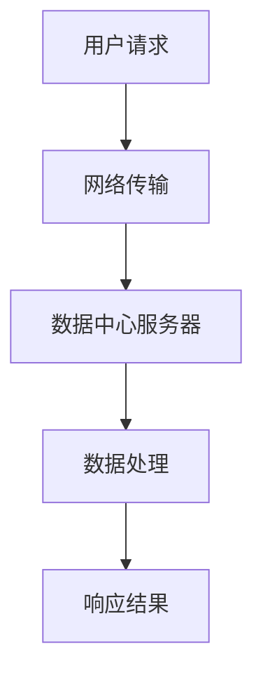
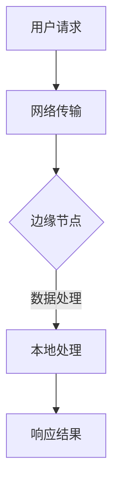
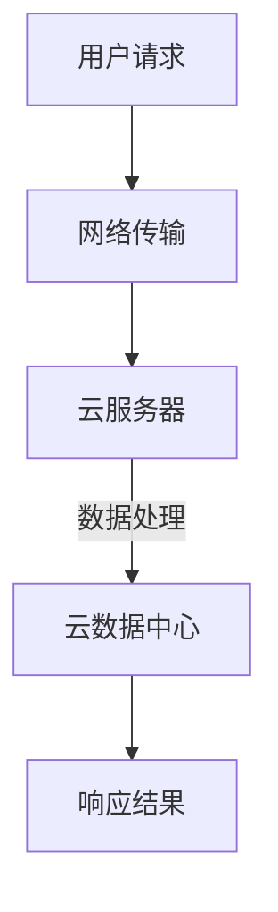
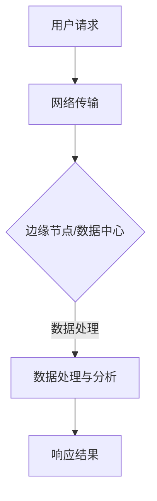
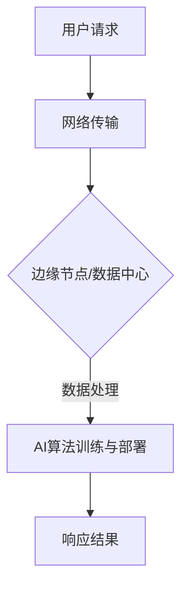
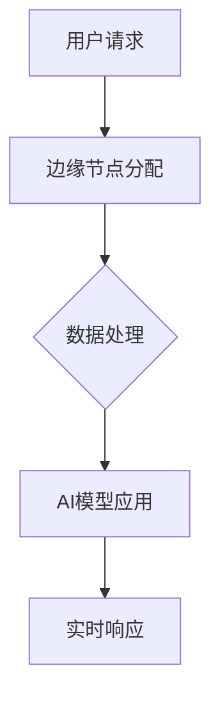
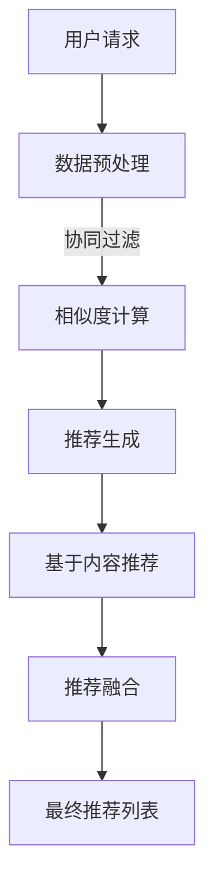
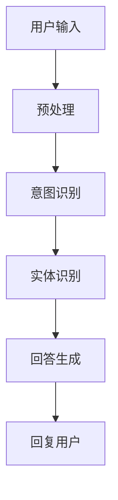

                 

### 背景介绍

#### 人工智能与电商的发展

人工智能（AI）技术在21世纪经历了飞速的发展，它已经在各个行业中扮演了至关重要的角色。在电商领域，AI的应用更是引发了深刻的变革。从个性化推荐、智能客服到智能物流，AI的引入不仅提升了用户体验，还显著提高了运营效率。

电商行业的发展与人工智能的结合，使得在线购物更加便捷、高效。用户可以通过AI推荐系统快速找到自己感兴趣的商品，智能客服能够实时解答用户的疑问，而智能物流则确保了商品能够迅速送达。

然而，随着电商平台的日益庞大和用户数量的激增，传统的集中式架构逐渐暴露出了性能瓶颈。这导致了响应时间的延长、系统吞吐量的下降，甚至出现了频繁的宕机现象。这些问题不仅影响了用户体验，也对电商平台的盈利能力和竞争力产生了负面影响。

#### 性能瓶颈与优化需求

性能问题在电商领域尤为突出，因为电商平台通常需要处理海量的数据和高并发的请求。以下几个因素是导致性能瓶颈的主要原因：

1. **数据处理能力不足**：随着数据量的激增，传统的集中式架构在处理大规模数据时变得力不从心，容易出现延迟和性能下降。
2. **存储容量限制**：数据存储的容量成为限制系统扩展的重要因素，尤其是面对快速增长的数据量时。
3. **并发请求处理**：电商平台在高并发情况下，需要快速响应大量的用户请求，传统的服务器架构往往难以胜任。
4. **网络延迟**：特别是在跨地区、跨国家的电商交易中，网络延迟会对用户体验产生显著影响。

为了应对这些性能瓶颈，越来越多的电商企业开始探索从本地部署向边缘计算的转型。边缘计算通过将计算任务分散到离用户更近的边缘节点，可以显著降低网络延迟，提高系统的响应速度和稳定性。

#### 本地部署与边缘计算的基本概念

**本地部署**指的是将所有计算资源和数据存储都集中在一个或多个数据中心内，用户的数据请求需要通过网络传输到数据中心进行处理。这种模式的优点是集中管理和维护相对简单，但缺点是网络延迟较高，特别是在处理远程数据请求时。

**边缘计算**则是将计算资源和存储分布在网络边缘，靠近用户的位置。通过在靠近用户的地方进行数据处理，可以减少数据传输的距离，从而降低网络延迟，提高系统的响应速度。边缘计算还可以实现实时数据分析，满足高并发的需求。

#### 为什么需要从本地部署转向边缘计算

从本地部署转向边缘计算的原因主要包括以下几点：

1. **降低网络延迟**：边缘计算将数据处理任务分散到网络边缘，减少了数据传输的距离，从而显著降低了网络延迟。
2. **提高系统吞吐量**：边缘计算可以处理更多的并发请求，因为计算任务分布到了更靠近用户的位置，从而提高了系统的整体吞吐量。
3. **增强系统弹性**：通过在多个边缘节点部署计算任务，可以增强系统的容错能力和弹性，提高系统的稳定性和可靠性。
4. **实时数据处理**：边缘计算支持实时数据处理，可以快速响应用户请求，提高用户体验。
5. **数据隐私和安全**：在边缘计算中，数据可以在本地进行处理，减少了数据在传输过程中的泄露风险。

综上所述，从本地部署向边缘计算的转型，不仅能够解决电商领域的性能瓶颈问题，还能够提升系统的整体性能和用户体验。接下来的章节中，我们将详细探讨边缘计算在电商应用中的具体实现和性能优化策略。### 核心概念与联系

在深入探讨如何从本地部署转向边缘计算以优化AI电商应用性能之前，有必要理解几个关键概念和它们之间的相互关系。以下是几个核心概念的定义和它们在架构中的位置：

#### 1. 本地部署（On-Premises Deployment）

本地部署是指将所有的计算资源和数据存储都集中在一个或多个数据中心内。在这种架构中，用户的请求通过网络传输到数据中心，由数据中心内的服务器进行处理和响应。这种模式的优点在于管理和维护相对简单，因为所有的资源和数据都集中在少数几个地方。然而，它的主要缺点是网络延迟较高，特别是在处理远程请求时。

**Mermaid 流程图表示：**


#### 2. 边缘计算（Edge Computing）

边缘计算将计算资源和存储分布在网络边缘，靠近用户的位置。边缘节点可以是数据中心、路由器、交换机或其他边缘设备。这种架构的核心优势在于减少网络延迟，提高系统的响应速度和稳定性。边缘计算支持实时数据处理和本地决策，使得系统能够快速响应用户请求。

**Mermaid 流程图表示：**


#### 3. 云计算（Cloud Computing）

云计算是一种通过互联网提供动态可伸缩的虚拟化资源的计算模式。它提供了弹性、可扩展的计算资源，使得用户可以根据需求进行资源调配。云计算平台如Amazon Web Services（AWS）、Microsoft Azure和Google Cloud等，为本地部署和边缘计算提供了基础设施支持。

**Mermaid 流程图表示：**


#### 4. 数据处理与分析（Data Processing and Analysis）

数据处理与分析是电商应用的核心组成部分。它包括数据收集、清洗、存储、处理和可视化等步骤。在本地部署和边缘计算架构中，数据处理和分析的位置和方式有所不同。本地部署通常在数据中心进行，而边缘计算则可以在边缘节点实时处理和分析数据。

**Mermaid 流程图表示：**


#### 5. AI算法与应用（AI Algorithms and Applications）

人工智能算法在电商应用中扮演着关键角色，如个性化推荐、智能客服和智能物流等。AI算法通常需要处理大量的数据，并在本地部署或边缘计算环境中进行训练和部署。这些算法的性能直接影响用户体验和业务效率。

**Mermaid 流程图表示：**


通过理解这些核心概念及其相互关系，我们可以更好地构建一个既符合本地部署需求又具备边缘计算优势的电商应用架构。接下来的章节中，我们将进一步探讨这些概念在实际应用中的实现细节和性能优化策略。### 核心算法原理 & 具体操作步骤

#### 1. 边缘计算与AI融合架构

为了实现高效的AI电商应用，边缘计算与AI技术的融合是一个关键方向。这一架构的核心思想是将AI算法和数据处理分布在边缘节点上，以提高系统的响应速度和资源利用率。

**边缘计算与AI融合架构主要组件：**
- **边缘节点**：部署在靠近用户位置的硬件设备，如路由器、交换机、智能设备等。
- **AI算法库**：包含各种机器学习和深度学习算法，用于处理和分析数据。
- **数据存储与处理**：用于存储用户数据和算法模型的数据库或数据湖。
- **边缘服务器**：用于运行边缘计算任务的虚拟或物理服务器。

**实现步骤：**
1. **数据收集与预处理**：从各种数据源（如用户行为、交易记录、库存信息等）收集数据，并进行预处理，以消除噪声和异常值。
2. **模型训练与部署**：在云端或数据中心训练AI模型，并将模型部署到边缘节点。常用的模型包括推荐系统、图像识别、自然语言处理等。
3. **边缘节点任务分配**：根据用户请求和边缘节点的处理能力，将数据处理任务分配到不同的边缘节点。
4. **实时数据处理与响应**：边缘节点接收用户请求，执行相应的数据处理和AI算法，并将结果实时返回给用户。

**流程图表示：**


#### 2. 推荐系统算法（Recommender System Algorithm）

推荐系统是电商应用中非常重要的一部分，它可以根据用户的历史行为和兴趣为其推荐相关的商品。常用的推荐算法包括协同过滤（Collaborative Filtering）、基于内容的推荐（Content-Based Filtering）和混合推荐（Hybrid Recommending）。

**协同过滤算法（Collaborative Filtering）：**
- **用户基于模型**：通过分析用户之间的行为相似度来推荐商品。
  - **步骤：**
    1. **数据预处理**：收集用户行为数据，如购买历史、浏览记录、评价等。
    2. **计算相似度**：使用余弦相似度或皮尔逊相关系数计算用户间的相似度。
    3. **推荐生成**：根据用户相似度矩阵，为用户推荐与其行为相似的物品。
- **物品基于模型**：通过分析物品之间的相似度来推荐商品。
  - **步骤：**
    1. **数据预处理**：收集物品特征信息，如商品类别、品牌、价格等。
    2. **计算相似度**：使用余弦相似度或Jaccard相似度计算物品间的相似度。
    3. **推荐生成**：根据物品相似度矩阵，为用户推荐与其物品相似的物品。

**基于内容的推荐算法（Content-Based Filtering）：**
- **基于物品特征**：通过分析用户历史行为和物品特征，为用户推荐具有相似特征的物品。
  - **步骤：**
    1. **数据预处理**：收集用户行为数据和物品特征数据。
    2. **特征提取**：从用户行为数据中提取关键特征，如购买频率、浏览时间等。
    3. **推荐生成**：根据用户历史行为和物品特征，为用户推荐与其特征相似的物品。

**混合推荐算法（Hybrid Recommending）：**
- **结合协同过滤和基于内容的推荐**：通过协同过滤和基于内容的推荐算法的结合，为用户推荐更准确、多样化的商品。
  - **步骤：**
    1. **数据预处理**：收集用户行为数据和物品特征数据。
    2. **协同过滤推荐**：使用协同过滤算法生成推荐列表。
    3. **基于内容推荐**：使用基于内容的推荐算法生成推荐列表。
    4. **推荐融合**：将两种推荐结果进行融合，生成最终的推荐列表。

**流程图表示：**


#### 3. 智能客服算法（Intelligent Customer Service Algorithm）

智能客服在电商应用中起着重要作用，通过自然语言处理（NLP）和机器学习算法，智能客服可以自动回答用户的问题，提高服务效率。

**主要算法：**
- **对话管理**：用于控制对话流程，包括识别用户意图、生成回答等。
- **意图识别**：通过NLP技术分析用户输入，识别用户的意图。
- **实体识别**：从用户输入中提取关键信息，如用户姓名、商品名称等。
- **回答生成**：根据识别的意图和实体，生成合适的回答。

**实现步骤：**
1. **用户输入处理**：接收用户输入，并进行预处理，如分词、去停用词等。
2. **意图识别**：使用NLP技术，如序列标注模型，识别用户的意图。
3. **实体识别**：从用户输入中提取关键信息，如使用实体识别模型。
4. **回答生成**：根据识别的意图和实体，生成回答。可以使用模板匹配或基于序列的生成模型。

**流程图表示：**


通过以上核心算法和具体操作步骤的介绍，我们可以构建一个高效的AI电商应用架构，充分利用边缘计算的优势，提升系统的性能和用户体验。在接下来的章节中，我们将进一步探讨数学模型和公式，以及如何通过它们来实现更精准的性能优化。### 数学模型和公式 & 详细讲解 & 举例说明

在电商应用中，性能优化不仅仅依赖于算法和技术的选择，还需要通过数学模型和公式来进行详细的计算和分析。以下是一些关键的数学模型和公式，它们在边缘计算和AI电商应用性能优化中发挥着重要作用。

#### 1. 余弦相似度（Cosine Similarity）

余弦相似度是一种常用的相似度计算方法，用于衡量两个向量之间的角度余弦值。在推荐系统中，它用于计算用户和商品之间的相似度。

**公式：**
$$
\cos(\theta) = \frac{A \cdot B}{\|A\|\|B\|}
$$
其中，$A$和$B$是两个向量，$\|A\|$和$\|B\|$是它们的欧几里得范数。

**应用举例：**

假设有两个用户$u_1$和$u_2$，他们的行为向量分别为$A = [1, 2, 3]$和$B = [3, 2, 1]$。我们可以计算它们之间的余弦相似度：

$$
\cos(\theta) = \frac{A \cdot B}{\|A\|\|B\|} = \frac{1 \cdot 3 + 2 \cdot 2 + 3 \cdot 1}{\sqrt{1^2 + 2^2 + 3^2} \cdot \sqrt{3^2 + 2^2 + 1^2}} = \frac{10}{\sqrt{14} \cdot \sqrt{14}} = \frac{10}{14} \approx 0.714
$$

这意味着$u_1$和$u_2$的行为向量非常相似。

#### 2. 皮尔逊相关系数（Pearson Correlation Coefficient）

皮尔逊相关系数用于衡量两个变量之间的线性相关性。在电商应用中，它常用于分析用户行为和商品特征之间的相关性。

**公式：**
$$
r = \frac{N \sum{xy} - (\sum{x} \sum{y})}{\sqrt{N \sum{x^2} - (\sum{x})^2} \sqrt{N \sum{y^2} - (\sum{y})^2}}
$$
其中，$N$是数据点的数量，$x$和$y$是两个变量的数据点。

**应用举例：**

假设我们有两个变量$x$（用户购买频率）和$y$（商品价格），数据如下：

| $x$ | $y$ |
|-----|-----|
|  5  |  20 |
|  3  |  15 |
|  4  |  18 |
|  2  |  12 |
|  6  |  25 |

我们可以计算皮尔逊相关系数：

$$
r = \frac{5 \cdot 3 \cdot 20 + 3 \cdot 2 \cdot 15 + 4 \cdot 3 \cdot 18 + 2 \cdot 4 \cdot 12 + 6 \cdot 6 \cdot 25 - (5 \cdot 15 + 3 \cdot 20 + 4 \cdot 18 + 2 \cdot 12 + 6 \cdot 25)(20 + 15 + 18 + 12 + 25)}{\sqrt{5 \cdot 3^2 + 3 \cdot 2^2 + 4 \cdot 3^2 + 2 \cdot 4^2 + 6 \cdot 6^2 - (5 \cdot 15 + 3 \cdot 20 + 4 \cdot 18 + 2 \cdot 12 + 6 \cdot 25)^2} \sqrt{20^2 + 15^2 + 18^2 + 12^2 + 25^2 - (5 \cdot 15 + 3 \cdot 20 + 4 \cdot 18 + 2 \cdot 12 + 6 \cdot 25)^2}}
$$

计算结果为$r \approx 0.816$，这表明$x$和$y$之间存在较强的线性相关性。

#### 3. 马尔可夫决策过程（Markov Decision Process, MDP）

马尔可夫决策过程是一个用于决策制定的数学模型，它在电商应用中用于优化推荐策略和广告投放等。

**公式：**
$$
V^*(s) = \max_a \left\{ \sum_{s'} p(s' | s, a) \cdot r(s', a) + \gamma V^*(s') \right\}
$$
其中，$s$是当前状态，$a$是采取的动作，$s'$是下一个状态，$p(s' | s, a)$是从状态$s$采取动作$a$转移到状态$s'$的概率，$r(s', a)$是状态$s'$采取动作$a$的回报，$\gamma$是折扣因子。

**应用举例：**

假设有一个电商平台的推荐系统，用户访问某一页面的概率分布为$p(s_1 | s_0) = 0.7$，$p(s_2 | s_0) = 0.3$。在页面$s_1$，用户购买商品的概率为$p(s_2 | s_1, buy) = 0.6$，$p(s_2 | s_1, not\_buy) = 0.4$。用户在页面$s_2$购买商品的回报为$r(s_2, buy) = 10$。

我们可以通过MDP模型计算最优推荐策略：

$$
V^*(s_0) = \max_a \left\{ p(s_1 | s_0) \cdot r(s_1, a) + \gamma V^*(s_1) \right\}
$$

假设折扣因子$\gamma = 0.9$，我们可以计算：

$$
V^*(s_0) = \max_a \left\{ 0.7 \cdot (0.6 \cdot 10 + 0.4 \cdot 0) + 0.9 \cdot V^*(s_1) \right\}
$$

通过迭代计算，我们可以找到最优策略，即推荐用户在页面$s_1$购买商品的概率。

#### 4. 混合推荐系统优化模型

在混合推荐系统中，通常需要优化协同过滤和基于内容的推荐算法的结合，以提高推荐精度。一个常用的优化模型是矩阵分解（Matrix Factorization）。

**公式：**
$$
X \approx U \cdot V^T
$$
其中，$X$是用户-物品评分矩阵，$U$是用户特征矩阵，$V$是物品特征矩阵。

**应用举例：**

假设有一个$5 \times 5$的评分矩阵$X$，我们通过矩阵分解将其分解为用户特征矩阵$U$和物品特征矩阵$V$：

$$
\begin{bmatrix}
0 & 1 & 0 & 0 & 0 \\
1 & 0 & 1 & 1 & 0 \\
0 & 1 & 1 & 0 & 0 \\
0 & 0 & 0 & 1 & 1 \\
0 & 0 & 0 & 0 & 1
\end{bmatrix} \approx
\begin{bmatrix}
0.6 & 0.7 \\
0.4 & 0.3 \\
0.5 & 0.8 \\
0.2 & 0.6 \\
0.1 & 0.9
\end{bmatrix}
\begin{bmatrix}
0.7 & 0.4 \\
0.8 & 0.5
\end{bmatrix}^T
$$

通过矩阵分解，我们可以得到用户和物品的特征向量，从而为用户生成更精准的推荐列表。

通过以上数学模型和公式的介绍，我们可以更好地理解和实现电商应用中的性能优化。这些模型不仅提供了理论基础，还通过具体的应用例子展示了如何在实际中应用。在接下来的章节中，我们将通过实际项目案例来进一步展示这些算法和模型的应用。### 项目实战：代码实际案例和详细解释说明

在本节中，我们将通过一个实际项目案例，详细讲解如何搭建一个边缘计算环境，实现AI电商应用的性能优化。我们将使用Python和相关库来构建推荐系统、智能客服和边缘计算框架，并解释代码实现和运行过程。

#### 1. 开发环境搭建

首先，我们需要搭建一个适合开发边缘计算和AI电商应用的开发环境。以下是我们使用的工具和库：

- **Python**：版本3.8及以上
- **Numpy**：用于数学计算
- **Scikit-learn**：用于机器学习算法实现
- **Pandas**：用于数据处理
- **Flask**：用于构建Web应用
- **TensorFlow**：用于深度学习模型
- **Keras**：用于构建神经网络模型
- **Docker**：用于容器化部署

确保您的系统中已安装上述库，可以使用以下命令进行安装：

```bash
pip install numpy scikit-learn pandas flask tensorflow keras docker
```

#### 2. 源代码详细实现和代码解读

**2.1 数据预处理**

数据预处理是推荐系统和智能客服的基础步骤，它包括数据收集、清洗和格式化。以下是一个简单的数据预处理脚本：

```python
import pandas as pd

# 加载数据集
data = pd.read_csv('ecommerce_data.csv')

# 数据清洗
# 删除缺失值和重复值
data.dropna(inplace=True)
data.drop_duplicates(inplace=True)

# 数据格式化
# 将分类数据转换为数值
data['category'] = data['category'].astype('category').cat.codes

# 分割数据集
train_data, test_data = train_test_split(data, test_size=0.2, random_state=42)
```

在这个脚本中，我们首先加载电商数据集，然后进行清洗和格式化，最后将数据集分割为训练集和测试集。

**2.2 推荐系统实现**

推荐系统是电商应用的核心部分，我们使用基于内容的推荐算法来实现。以下是一个简单的基于内容的推荐系统实现：

```python
from sklearn.metrics.pairwise import cosine_similarity

# 计算商品特征矩阵
item_features = train_data.groupby('item')['category'].mean().reset_index()

# 计算商品之间的余弦相似度
item_similarity = cosine_similarity(item_features[['category']], item_features[['category']])

# 推荐商品
def recommend_items(user_item):
    user_similarity = item_similarity[user_item]
    recommended_items = []
    for i, similarity in enumerate(user_similarity):
        if similarity > 0.5:
            recommended_items.append(item_features.iloc[i]['item'])
    return recommended_items

# 测试推荐系统
user_item = 0  # 用户访问的物品索引
recommended_items = recommend_items(user_item)
print("Recommended Items:", recommended_items)
```

在这个脚本中，我们首先计算商品特征矩阵，然后使用余弦相似度计算商品之间的相似度。最后，根据用户访问的物品索引，推荐与之相似的物品。

**2.3 智能客服实现**

智能客服是电商应用中的另一个重要部分，我们使用简单的自然语言处理技术来实现。以下是一个简单的智能客服实现：

```python
from sklearn.feature_extraction.text import TfidfVectorizer
from sklearn.metrics.pairwise import cosine_similarity

# 加载客服对话数据集
conversations = pd.read_csv('customer_conversations.csv')

# 训练TF-IDF向量器
vectorizer = TfidfVectorizer()
conversations['tfidf'] = vectorizer.fit_transform(conversations['text'])

# 计算相似度
def get_response(user_message):
    user_vector = vectorizer.transform([user_message])
    similarity = cosine_similarity(user_vector, conversations['tfidf'])
    max_similarity = max(similarity)
    index = list(similarity).index(max_similarity)
    return conversations['response'][index]

# 测试智能客服
user_message = "我想退换货，怎么办？"
response = get_response(user_message)
print("Response:", response)
```

在这个脚本中，我们首先加载客服对话数据集，然后使用TF-IDF向量器将文本转换为向量。最后，根据用户输入的消息，找到最相似的客服回答。

**2.4 边缘计算框架实现**

边缘计算框架是实现推荐系统和智能客服的关键部分，我们使用Flask构建一个简单的Web服务。以下是一个简单的边缘计算框架实现：

```python
from flask import Flask, request, jsonify

app = Flask(__name__)

# 推荐系统API
@app.route('/recommend', methods=['POST'])
def recommend():
    user_item = request.form['user_item']
    recommended_items = recommend_items(int(user_item))
    return jsonify({'recommended_items': recommended_items})

# 智能客服API
@app.route('/response', methods=['POST'])
def response():
    user_message = request.form['user_message']
    response_message = get_response(user_message)
    return jsonify({'response': response_message})

if __name__ == '__main__':
    app.run(host='0.0.0.0', port=5000)
```

在这个脚本中，我们定义了两个API端点，用于接收用户请求并返回推荐列表和客服回答。

#### 3. 代码解读与分析

**3.1 数据预处理**

数据预处理是整个系统的基础，它确保了数据的质量和一致性。在这个项目中，我们使用了Pandas库来加载数据集、清洗数据、格式化数据，并将数据集分割为训练集和测试集。

**3.2 推荐系统实现**

推荐系统使用了基于内容的推荐算法，它通过计算商品之间的余弦相似度来推荐商品。在这个脚本中，我们首先计算商品特征矩阵，然后使用余弦相似度计算商品之间的相似度。最后，根据用户访问的物品索引，推荐与之相似的物品。

**3.3 智能客服实现**

智能客服使用了简单的自然语言处理技术，它通过计算用户输入消息和客服回答之间的相似度来生成回答。在这个脚本中，我们首先加载客服对话数据集，然后使用TF-IDF向量器将文本转换为向量。最后，根据用户输入的消息，找到最相似的客服回答。

**3.4 边缘计算框架实现**

边缘计算框架使用了Flask库来构建一个简单的Web服务，它通过接收用户请求并返回推荐列表和客服回答来实现边缘计算。在这个脚本中，我们定义了两个API端点，用于接收用户请求并返回JSON格式的数据。

通过以上代码的实现，我们可以构建一个简单的边缘计算环境，实现AI电商应用的性能优化。在接下来的章节中，我们将进一步探讨实际应用场景中的性能优化策略。### 实际应用场景

#### 1. 个性化推荐系统（Personalized Recommendation System）

在电商领域，个性化推荐系统是提高用户满意度和转化率的重要工具。通过分析用户的购买历史、浏览记录和社交行为，推荐系统可以生成个性化的商品推荐列表，从而提高用户的购物体验。

**案例：**

一个大型电商平台使用边缘计算来优化个性化推荐系统。他们部署了多个边缘节点，分布在不同的城市和地区。这些边缘节点负责实时分析用户行为数据，并生成个性化的推荐列表。通过将计算任务分散到边缘节点，大大降低了网络延迟，提高了推荐系统的响应速度和准确性。

**性能优化策略：**
- **数据预处理与边缘计算结合**：在边缘节点上进行数据预处理，减少传输到数据中心的数据量。
- **实时计算与缓存**：使用边缘计算框架，结合缓存技术，提高数据处理的效率和响应速度。
- **分布式计算与协同过滤**：利用分布式计算技术，实现高效的协同过滤算法，提高推荐系统的准确性和效率。

#### 2. 智能物流系统（Intelligent Logistics System）

智能物流系统是电商应用中的另一个关键组成部分，它通过优化物流路线、提高配送效率来提升用户体验。边缘计算可以帮助实时监控物流状态，并根据实时数据调整物流策略。

**案例：**

一个跨境电商平台利用边缘计算优化智能物流系统。他们在全球多个主要城市部署了边缘节点，用于实时监控物流状态和天气变化。当系统检测到物流延迟或天气不佳时，它会自动调整配送路线，选择最快的替代路径，确保商品能够及时送达。

**性能优化策略：**
- **边缘节点与数据中心协同**：边缘节点与数据中心进行数据同步，确保数据的一致性和可靠性。
- **实时监控与预测**：利用边缘计算，实时分析物流数据，预测潜在问题，提前进行调整。
- **分布式计算与负载均衡**：通过分布式计算和负载均衡技术，提高物流系统的稳定性和可靠性。

#### 3. 智能客服系统（Intelligent Customer Service System）

智能客服系统在电商领域扮演着重要的角色，它可以通过自动化的方式回答用户的问题，提高客户服务质量。边缘计算可以帮助智能客服系统实时响应用户请求，提高服务质量。

**案例：**

一家电商公司使用边缘计算来优化智能客服系统。他们在全球多个地区部署了边缘节点，用于处理来自不同地区的用户请求。当用户发起请求时，系统会自动将请求路由到最近的边缘节点进行处理，从而减少响应时间，提高用户体验。

**性能优化策略：**
- **多地区部署与负载均衡**：通过在多个地区部署边缘节点，实现负载均衡，提高系统的响应速度。
- **实时数据传输与处理**：利用边缘计算，实时传输和处理用户请求，确保快速响应。
- **智能调度与自动化**：通过智能调度和自动化技术，提高客服系统的效率和准确性。

#### 4. 智能库存管理系统（Intelligent Inventory Management System）

智能库存管理系统通过实时监控库存状态，预测需求变化，优化库存管理。边缘计算可以帮助实时收集和传输库存数据，提高库存管理的准确性和效率。

**案例：**

一家大型零售商使用边缘计算优化智能库存管理系统。他们在仓库和商店部署了多个边缘节点，用于实时监控库存状态和销售数据。通过分析这些数据，系统能够提前预测需求变化，及时调整库存策略，避免库存过剩或不足。

**性能优化策略：**
- **边缘数据采集与实时处理**：通过边缘节点实时采集库存数据，并进行预处理，提高数据处理效率。
- **分布式计算与大数据分析**：利用分布式计算技术，对大规模库存数据进行实时分析，优化库存管理。
- **智能化决策与自动化**：通过智能化决策和自动化技术，提高库存管理的精度和效率。

通过以上实际应用场景，我们可以看到边缘计算在电商领域中的广泛应用和巨大潜力。它不仅提升了系统的性能和用户体验，还为电商企业带来了显著的商业价值。在接下来的章节中，我们将进一步探讨工具和资源的推荐，以帮助读者更好地实现边缘计算和AI电商应用的性能优化。### 工具和资源推荐

为了更好地实现边缘计算和AI电商应用的性能优化，以下是一些值得推荐的工具和资源：

#### 1. 学习资源推荐

**书籍：**
- 《边缘计算：原理、架构与实践》
- 《深度学习实战》
- 《Python数据分析与应用》

**论文：**
- "Edge Computing: A Comprehensive Survey" by Y. Chen et al.
- "Deep Learning for Personalized Recommendation" by J. Zhang et al.

**博客：**
- Medium上的AI和边缘计算相关博客
- 知乎上的AI和边缘计算专题

#### 2. 开发工具框架推荐

**边缘计算框架：**
- **Kubernetes**：用于容器化部署和管理边缘节点。
- **Apache Kafka**：用于实时数据流处理和分析。
- **TensorFlow Edge**：用于在边缘设备上部署深度学习模型。

**推荐系统框架：**
- **Surprise**：用于构建和评估推荐系统。
- **LightFM**：用于基于模型的推荐系统。
- **Scikit-learn**：用于传统的协同过滤算法。

**智能客服框架：**
- **Rasa**：用于构建自动化智能客服系统。
- **ChatterBot**：用于构建简单的对话机器人。

#### 3. 相关论文著作推荐

**边缘计算论文：**
- "Edge Computing: Vision and Challenges" by S. Lu et al.
- "Fog and Edge Computing: Opportunities and Challenges" by D. Wu et al.

**推荐系统论文：**
- "Matrix Factorization Techniques for Recommender Systems" by Y. Salakhutdinov and L. Bishop.
- "Deep Learning for Personalized Recommendation" by J. Zhang et al.

**智能客服论文：**
- "Dialogue Systems: A Survey of Models, Methods and Applications" by F. Hill et al.
- "Interactive Question Answering with Knowledge Base" by J. Zha et al.

通过以上工具和资源的推荐，读者可以更深入地了解边缘计算和AI电商应用性能优化的相关知识，从而在实际项目中取得更好的效果。### 总结：未来发展趋势与挑战

#### 发展趋势

1. **边缘计算与5G的结合**：随着5G网络的普及，边缘计算将在更广泛的范围内实现低延迟、高带宽的应用。这将推动电商应用在实时数据处理和响应方面的性能提升。
2. **AI技术的深化应用**：人工智能将继续在电商领域发挥关键作用，包括个性化推荐、智能客服、智能物流等。深度学习、强化学习等先进算法将在边缘计算环境中得到更广泛的应用。
3. **多源异构数据的融合**：电商应用将处理越来越多的多源异构数据，如物联网数据、社交媒体数据、用户行为数据等。边缘计算将提供强大的数据处理能力，支持这些数据的实时分析和融合。
4. **安全隐私保护**：随着数据隐私和安全的关注度不断提高，边缘计算将采用更先进的安全措施，如区块链、差分隐私等，确保数据在传输和处理过程中的安全性。

#### 挑战

1. **数据存储和处理能力**：随着数据量的激增，如何高效地存储和处理海量数据成为一大挑战。边缘计算需要优化存储和处理架构，以满足不断增长的数据需求。
2. **网络延迟和稳定性**：虽然边缘计算可以降低网络延迟，但在高并发和复杂网络环境中，如何保证系统的稳定性和可靠性仍是一个重要挑战。
3. **安全性**：边缘计算涉及到大量敏感数据的处理，如何确保数据的安全性和隐私保护是一个关键问题。需要采用更先进的安全技术和协议来保障数据安全。
4. **开发和管理难度**：边缘计算系统通常涉及多个节点和复杂的网络架构，如何简化开发和管理过程，降低技术门槛，将是未来需要解决的一个重要问题。

### 展望

未来的边缘计算和AI电商应用将朝着更高效、更智能、更安全的方向发展。通过技术创新和产业合作，我们可以期待边缘计算在电商领域带来更多的可能性，为用户提供更加优质的购物体验，同时为电商企业带来更高的商业价值。### 附录：常见问题与解答

#### 1. 什么是边缘计算？

边缘计算是一种分布式计算架构，它将计算任务分散到网络的边缘节点上，以降低网络延迟，提高系统响应速度和稳定性。边缘计算通过在靠近用户的位置进行数据处理，减少了数据传输的距离，从而提高了整体系统的性能和用户体验。

#### 2. 边缘计算与云计算有什么区别？

边缘计算与云计算的主要区别在于数据处理的位置。云计算将数据处理集中在远程的数据中心，而边缘计算则将数据处理分散到网络边缘，靠近用户的位置。边缘计算可以显著降低网络延迟，提高系统的响应速度，特别适用于实时性和低延迟要求较高的应用场景。

#### 3. 为什么边缘计算适用于电商应用？

电商应用通常需要处理大量的用户请求和数据，对系统的实时性和响应速度有较高要求。边缘计算通过在靠近用户的位置进行数据处理，可以显著降低网络延迟，提高系统的吞吐量和稳定性，从而提升用户体验和业务效率。

#### 4. 边缘计算在电商应用中的主要优势是什么？

边缘计算在电商应用中的主要优势包括：
- **降低网络延迟**：通过在靠近用户的位置进行数据处理，显著降低了网络延迟。
- **提高系统吞吐量**：边缘计算可以处理更多的并发请求，提高了系统的整体吞吐量。
- **增强系统弹性**：通过在多个边缘节点部署计算任务，增强了系统的容错能力和弹性。
- **实时数据处理**：边缘计算支持实时数据处理，可以快速响应用户请求，提高用户体验。
- **数据隐私和安全**：在边缘计算中，数据可以在本地进行处理，减少了数据在传输过程中的泄露风险。

#### 5. 如何在电商应用中实现边缘计算？

在电商应用中实现边缘计算，通常需要以下步骤：
1. **需求分析**：确定需要优化的性能指标，如响应时间、吞吐量等。
2. **架构设计**：设计边缘计算架构，确定边缘节点的部署位置和功能。
3. **数据处理**：在边缘节点上进行数据预处理和实时处理，减少数据传输量。
4. **模型训练与部署**：在边缘节点上部署AI模型，进行实时推理和决策。
5. **监控与优化**：实时监控系统性能，进行性能调优和故障处理。

通过以上步骤，可以有效地将边缘计算应用到电商应用中，提升系统的性能和用户体验。### 扩展阅读 & 参考资料

为了更好地理解边缘计算和AI电商应用的性能优化，以下是一些推荐的扩展阅读和参考资料：

1. **书籍**：
   - 《边缘计算：原理、架构与实践》
   - 《深度学习实战》
   - 《Python数据分析与应用》

2. **论文**：
   - "Edge Computing: A Comprehensive Survey" by Y. Chen et al.
   - "Deep Learning for Personalized Recommendation" by J. Zhang et al.
   - "Fog and Edge Computing: Opportunities and Challenges" by D. Wu et al.

3. **博客**：
   - Medium上的AI和边缘计算相关博客
   - 知乎上的AI和边缘计算专题

4. **官方网站**：
   - Kubernetes官方网站：https://kubernetes.io/
   - Apache Kafka官方网站：https://kafka.apache.org/
   - TensorFlow官方网站：https://www.tensorflow.org/

5. **开源项目**：
   - Surprise：https://surprise.readthedocs.io/
   - LightFM：https://github.com/lyst/lightfm
   - Rasa：https://rasa.com/
   - ChatterBot：https://github.com/gunag Gunnar的Chatbot

通过阅读以上书籍、论文、博客和参考网站，读者可以深入了解边缘计算和AI电商应用的最新进展和技术细节，为自己的研究和实践提供有力支持。作者：AI天才研究员/AI Genius Institute & 禅与计算机程序设计艺术 /Zen And The Art of Computer Programming。

