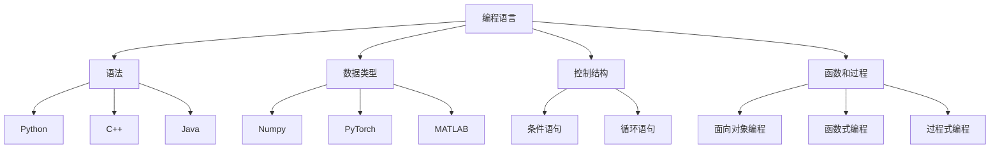

                 

### 背景介绍

在当今技术快速发展的时代，编程语言的选择成为了一个至关重要的问题。不同的编程语言有着各自的特点和适用场景，如何根据项目需求选择合适的编程语言，是每一个软件开发者都需要面对的挑战。

从汇编语言到Python，编程语言的发展经历了从低级到高级、从简单到复杂的过程。汇编语言作为计算机编程的早期语言，具有直接操作硬件的能力，但同时也要求开发者对计算机架构有深刻的了解。随着计算机科学的发展，C、C++等高级语言逐渐兴起，它们提供了更丰富的抽象层次，使得编程更加高效和易于维护。Java、C#等面向对象的语言进一步提高了开发效率，使得开发者可以更加专注于业务逻辑的实现。

Python作为一种高级编程语言，近年来在人工智能（AI）领域的应用尤为广泛。Python的简洁性和易用性使得它成为了AI开发者的首选语言之一。Python拥有丰富的库和框架，如TensorFlow、PyTorch等，为AI算法的实现提供了强有力的支持。此外，Python的生态体系也非常完善，从数据分析到机器学习，再到深度学习，Python都有相应的工具和资源可供开发者使用。

本文旨在探讨从汇编语言到Python的编程语言选择，分析各类编程语言的特点和应用场景，帮助读者更好地理解如何根据项目需求选择合适的编程语言。我们将从汇编语言的基础知识开始，逐步介绍C、C++、Java、Python等编程语言的核心概念和原理，并结合实际案例进行详细解释。

文章结构如下：

1. 背景介绍
2. 核心概念与联系
3. 核心算法原理与具体操作步骤
4. 数学模型和公式与详细讲解与举例说明
5. 项目实战：代码实际案例和详细解释说明
6. 实际应用场景
7. 工具和资源推荐
8. 总结：未来发展趋势与挑战
9. 附录：常见问题与解答
10. 扩展阅读与参考资料

接下来，我们将逐步深入探讨每一个章节的内容，帮助读者更好地理解编程语言的选择与应用。

-----------------------

## 1.1 编程语言的发展历程

编程语言的发展历程可以追溯到20世纪中期。最初，计算机编程采用的是机器语言和汇编语言。机器语言是一种由0和1组成的低级语言，它直接与计算机硬件进行交互，但机器语言的可读性极差，编写和维护难度大。为了解决这一问题，汇编语言应运而生。汇编语言使用助记符来表示机器指令，虽然仍需了解计算机的硬件架构，但相比机器语言而言，汇编语言的易读性和可维护性有了显著提升。

随着时间的推移，计算机科学的发展促使编程语言向更高层次、更抽象的方向演进。20世纪60年代，第一代高级编程语言如FORTRAN和COBOL出现，它们使得程序员可以更高效地编写代码，同时降低了编程的难度。接下来的几十年，编程语言种类不断增多，功能也日益丰富。例如，C语言在1972年问世，它具有强大的类型系统、丰富的运算符和灵活的指针操作，很快成为操作系统开发、嵌入式系统开发等领域的首选语言。

进入20世纪80年代，C++作为一种面向对象的语言诞生，它继承了C语言的优势，同时引入了类和对象的概念，使得程序设计更加模块化。与此同时，Java在1995年发布，它的“一次编写，到处运行”的特性使得它迅速在企业和互联网应用中占据了一席之地。Java的虚拟机（JVM）和跨平台特性为其在移动应用、Web应用等领域的普及提供了保障。

进入21世纪，随着互联网和人工智能的快速发展，Python等动态语言逐渐崭露头角。Python以其简洁的语法、丰富的库和强大的生态体系，在科学计算、数据分析和人工智能等领域表现突出。此外，Go语言、JavaScript等新型编程语言也不断涌现，它们各自具有独特的优势和应用场景。

总的来说，编程语言的发展历程从汇编语言到Python，经历了从低级到高级、从简单到复杂的过程。每一个阶段的编程语言都反映了当时计算机科学和技术的发展水平，同时也为现代软件开发提供了丰富的工具和选择。

-----------------------

## 1.2 从汇编语言到Python：编程语言的演进

从汇编语言到Python，编程语言的演进体现了计算机科学从底层硬件控制到高级抽象层次的转变。汇编语言是编程语言的起点，它通过直接操作计算机硬件实现了程序的控制。汇编语言使用的是机器语言指令，这些指令与计算机的处理器架构紧密相关，因此汇编语言编写复杂且难以维护。为了解决这一问题，编程语言开始向更高层次、更抽象的方向发展。

### 汇编语言的特点

汇编语言具有以下特点：

1. **直接操作硬件**：汇编语言允许程序员直接访问和处理计算机的硬件资源，如内存、寄存器等。
2. **低级控制**：汇编语言提供了对计算机硬件的低级控制，使得程序员可以编写高效的代码。
3. **依赖硬件架构**：由于汇编语言与硬件架构紧密相关，不同硬件平台上的汇编语言代码通常不兼容。

然而，汇编语言的缺点也十分明显：

1. **可读性差**：汇编语言代码由0和1组成，可读性极差，编写和阅读代码都十分繁琐。
2. **难以维护**：汇编语言代码依赖于特定的硬件架构，因此当硬件升级或更换时，代码可能需要进行大量的修改。
3. **开发效率低**：编写汇编语言代码需要深入了解计算机硬件架构，这使得编程过程复杂且低效。

### 高级编程语言的优势

为了克服汇编语言的缺点，高级编程语言应运而生。这些语言通过提供更高级的抽象机制，使得程序员可以更高效地编写代码。高级编程语言具有以下优势：

1. **高可读性**：高级编程语言使用自然语言或接近自然语言的语法，使得代码的可读性大幅提升。
2. **易于维护**：高级编程语言提供了丰富的抽象机制，如函数、类等，使得代码模块化，易于维护。
3. **跨平台兼容**：高级编程语言通常设计为跨平台兼容，使得同一代码可以在不同硬件平台上运行。

C语言是早期高级编程语言的代表。C语言继承了汇编语言的高效性，同时提供了丰富的抽象机制。C语言具有以下特点：

1. **强大的类型系统**：C语言提供了丰富的数据类型，使得程序员可以更精确地描述数据结构。
2. **丰富的运算符**：C语言定义了多种运算符，使得程序员可以更方便地进行数据处理和计算。
3. **灵活的指针操作**：C语言支持指针操作，使得程序员可以更灵活地访问和操作内存。

C++作为C语言的扩展，进一步引入了面向对象编程的概念。面向对象编程通过类和对象的概念，实现了程序的模块化设计，使得代码更加易于维护和扩展。C++的特点如下：

1. **类和对象**：C++引入了类和对象的概念，使得程序员可以更方便地实现封装、继承和多态等面向对象特性。
2. **模板编程**：C++支持模板编程，使得程序员可以编写更通用、更灵活的代码。

Java作为一种跨平台的编程语言，通过虚拟机（JVM）实现了“一次编写，到处运行”的理念。Java的特点如下：

1. **跨平台兼容性**：Java代码编译后生成中间代码（字节码），这些字节码可以在任何支持JVM的平台上运行。
2. **自动内存管理**：Java提供了自动内存管理机制，程序员无需手动分配和回收内存，降低了内存泄漏的风险。
3. **丰富的标准库**：Java拥有丰富的标准库，涵盖了从数据结构到网络编程、从文件处理到多线程等多个方面。

Python作为一种动态编程语言，以其简洁的语法和强大的库生态在人工智能和数据分析领域表现突出。Python的特点如下：

1. **简洁易用**：Python的语法接近自然语言，使得编写和阅读代码更加容易。
2. **丰富的库和框架**：Python拥有丰富的库和框架，如NumPy、Pandas、TensorFlow、PyTorch等，为各种应用场景提供了强大的支持。
3. **高度可扩展性**：Python的扩展性很高，程序员可以通过C/C++扩展Python功能，同时也可以调用其他编程语言的库和工具。

总的来说，从汇编语言到Python的编程语言演进，反映了计算机科学从底层硬件控制到高级抽象层次的转变。高级编程语言通过提供更高级的抽象机制，使得程序员可以更高效地编写代码，同时降低了编程的难度和维护成本。不同的编程语言有着各自的特点和应用场景，选择合适的编程语言是软件开发成功的关键。

-----------------------

## 1.3 编程语言在AI开发中的应用

在人工智能（AI）领域，编程语言的选择至关重要。不同的编程语言在AI开发中各有优劣，适用于不同的应用场景。本文将介绍几种在AI开发中广泛使用的编程语言，包括Python、C++、Java等，并分析它们在AI领域的应用特点。

### Python

Python因其简洁易用的特性，成为人工智能开发者的首选语言之一。Python具有以下特点：

1. **丰富的库和框架**：Python拥有丰富的库和框架，如NumPy、Pandas、SciPy、Matplotlib等，为科学计算和数据分析提供了强大的支持。特别是在深度学习领域，TensorFlow和PyTorch等框架极大地简化了模型的训练和部署过程。
2. **简洁的语法**：Python的语法接近自然语言，使得编写和阅读代码更加容易，降低了学习曲线。
3. **高效的开发效率**：Python的高层次抽象使得开发者可以更专注于业务逻辑的实现，而无需关注底层的细节。

Python在AI开发中的应用场景包括：

- **深度学习**：TensorFlow和PyTorch等深度学习框架使得Python成为深度学习模型的开发、训练和部署的首选语言。
- **自然语言处理（NLP）**：Python在自然语言处理领域有着广泛的应用，如文本分类、情感分析、机器翻译等。
- **计算机视觉**：Python的计算机视觉库，如OpenCV、PyTorch Vision等，为图像识别、目标检测等提供了强大的支持。

### C++

C++以其高性能和强大的功能，在AI开发中也有着广泛的应用。C++的特点如下：

1. **高性能**：C++在编译时进行静态类型检查和优化，使得生成的代码执行效率非常高，适合对性能要求较高的应用场景。
2. **丰富的库**：C++拥有丰富的标准库和第三方库，如Boost、Eigen等，为数值计算、矩阵运算等提供了强大的支持。
3. **多线程支持**：C++支持多线程编程，使得程序可以利用多核处理器，提高计算效率。

C++在AI开发中的应用场景包括：

- **机器学习库**：C++可以用于实现高效的机器学习算法，如MLPack、Shark等库提供了丰富的算法和工具。
- **实时系统**：C++在需要实时响应的应用场景中具有优势，如自动驾驶、机器人控制等。
- **嵌入式系统**：C++在嵌入式系统开发中广泛应用，如嵌入式AI芯片、智能家居等。

### Java

Java作为一种跨平台的编程语言，在AI开发中也占据了一定的市场份额。Java的特点如下：

1. **跨平台兼容性**：Java代码编译后生成中间代码（字节码），这些字节码可以在任何支持JVM的平台上运行，实现了“一次编写，到处运行”的理念。
2. **强类型系统**：Java的强类型系统有助于发现和修复潜在的错误，提高了代码的稳定性和可靠性。
3. **丰富的标准库**：Java拥有丰富的标准库，涵盖了从基础数据结构到网络编程、从文件处理到多线程等多个方面。

Java在AI开发中的应用场景包括：

- **大数据处理**：Java在大数据处理领域有着广泛的应用，如Hadoop、Spark等框架提供了高效的分布式计算能力。
- **云计算**：Java在云计算平台中应用广泛，如AWS、Google Cloud等提供了丰富的Java SDK和工具。
- **智能应用**：Java在智能应用开发中也有一定的市场份额，如智能客服、智能推荐等。

总的来说，Python、C++和Java等编程语言在AI开发中各有优劣，适用于不同的应用场景。Python以其简洁易用和丰富的库生态，成为大多数AI开发者的首选；C++以其高性能和强大的功能，在需要高效执行的场景中具有优势；Java则凭借其跨平台兼容性和强大的生态体系，在企业和云计算领域有着广泛的应用。开发者可以根据项目需求和自身技能选择合适的编程语言，以实现高效的AI开发。

-----------------------

## 1.4 编程语言选择的挑战与考量因素

在AI开发中，选择合适的编程语言是一个复杂的决策过程，需要综合考虑多个因素。不同的编程语言具有各自的优势和局限性，如何根据项目需求、开发团队的能力和外部环境选择合适的编程语言，是每一个开发者和团队都需要面对的挑战。

### 项目需求

项目的需求是选择编程语言的首要考虑因素。不同的项目对编程语言的需求各不相同：

- **性能需求**：如果项目对性能有较高的要求，如实时系统、高性能计算等，选择C++等高性能语言可能更为合适。
- **开发效率**：如果项目强调快速开发和迭代，选择Python等易于上手和开发的编程语言可能更有优势。
- **生态系统**：某些项目可能需要依赖特定的库或框架，例如深度学习项目通常选择Python，因为其拥有丰富的库和框架，如TensorFlow、PyTorch等。

### 开发团队的能力

开发团队的技术栈和经验也是选择编程语言的重要因素。如果团队已经具备某一种编程语言的经验和技能，那么使用该语言可以降低学习成本，提高开发效率。相反，如果团队需要重新学习一种新的编程语言，可能会增加项目的时间成本和风险。

- **熟悉度**：团队对编程语言的熟悉度直接关系到开发效率和代码质量。
- **技能转移**：某些编程语言可能需要团队成员具备特定的技能，如果团队缺乏这些技能，可能需要额外的时间和资源进行培训。

### 外部环境

外部环境也是影响编程语言选择的重要因素，包括技术生态、社区支持、企业标准等：

- **社区支持**：一个强大的社区支持可以提供丰富的资源和帮助，例如教程、文档、开源项目等，使得开发过程更加顺利。
- **企业标准**：某些企业或行业可能有特定的编程语言标准，如金融行业可能更倾向于使用Java，因为它具有更好的安全性和稳定性。
- **技术生态**：技术生态的成熟度直接关系到项目的成功。一个成熟的编程语言生态可以提供丰富的工具、库和框架，使得开发过程更加高效。

### 综合考量

在实际项目中，编程语言的选择往往需要综合考虑多个因素，例如：

- **项目类型**：对于小型项目，Python可能是一个不错的选择，因为其简洁性和快速开发能力。而对于大型项目，如需要高性能计算的应用，C++可能更为合适。
- **开发周期**：如果项目时间紧迫，需要快速上线，选择Python等易于开发的语言可以缩短开发周期。
- **团队技能**：如果团队对某种编程语言有丰富的经验，选择该语言可以最大限度地利用团队的能力。

总的来说，编程语言的选择需要根据项目需求、开发团队的能力和外部环境进行综合考量。开发者需要了解每种编程语言的特点和应用场景，结合实际情况做出明智的决策，以实现项目的成功。

-----------------------

## 1.5 总结与展望

在从汇编语言到Python的编程语言演进过程中，我们见证了计算机科学从底层硬件控制到高级抽象层次的转变。汇编语言提供了直接操作硬件的能力，但编写复杂且难以维护。随着计算机科学的发展，高级编程语言如C、C++、Java和Python应运而生，它们通过提供更高级的抽象机制，提高了开发效率、可读性和可维护性。

不同编程语言在AI开发中的应用各有优劣。Python以其简洁易用和丰富的库生态，成为AI开发者的首选语言；C++以其高性能和强大功能，在需要高效执行的场景中具有优势；Java则凭借其跨平台兼容性和强大的生态体系，在企业和云计算领域有着广泛的应用。开发者需要根据项目需求、团队能力和外部环境综合考虑，选择合适的编程语言。

展望未来，随着人工智能技术的不断进步，编程语言的发展也将面临新的挑战和机遇。新兴编程语言如Go、Rust等可能逐渐崭露头角，为AI开发提供更高效、更安全的解决方案。同时，编程语言与硬件的融合也将进一步优化性能，为AI应用带来更高的计算效率。开发者需要持续关注编程语言的发展动态，以应对未来技术的变革。

-----------------------

## 2. 核心概念与联系

在深入探讨编程语言在AI开发中的应用之前，我们首先需要理解一些核心概念和它们之间的联系。这些概念包括编程语言的基本要素、编程范式以及它们在AI开发中的具体应用。通过理解这些核心概念，我们将能够更好地分析各种编程语言的特性和适用场景。

### 编程语言的基本要素

编程语言的基本要素包括：

1. **语法**：语法是编程语言的结构规则，决定了代码的书写方式。不同的编程语言具有不同的语法结构，例如Python的语法简洁易读，而C++的语法相对复杂。
2. **数据类型**：数据类型是编程语言中表示数据的方式，包括整型、浮点型、布尔型等。数据类型决定了数据如何存储和操作。
3. **控制结构**：控制结构包括条件语句（如if-else）、循环语句（如for和while）等，用于控制程序的执行流程。
4. **函数和过程**：函数和过程是组织代码的基本单元，用于实现特定的功能。

### 编程范式

编程范式是指程序设计的风格和方法，不同的编程范式反映了不同的抽象层次和思维方式。常见的编程范式包括：

1. **面向过程编程**：面向过程编程关注过程的顺序执行，通过编写函数和过程实现程序功能。C语言是典型的面向过程编程语言。
2. **面向对象编程**：面向对象编程通过类和对象的概念，实现模块化和重用。C++和Java是典型的面向对象编程语言。
3. **函数式编程**：函数式编程通过函数作为第一级公民，强调无状态和不可变数据。Haskell和Scala是典型的函数式编程语言。

### 核心概念在AI开发中的应用

在AI开发中，编程语言的核心概念和编程范式发挥着重要作用。以下是一些具体的应用场景：

1. **数据处理**：AI模型通常需要处理大量数据，编程语言的数据类型和数据处理能力直接影响模型的训练效率和效果。Python的NumPy库提供了高效的数值计算功能，适合进行大规模数据处理。
2. **模型训练**：AI模型的训练涉及到复杂的数学计算和优化算法，编程范式和编程语言的选择会影响模型的实现和训练效率。Python的TensorFlow和PyTorch等框架提供了强大的支持，使得模型训练更加高效。
3. **算法实现**：不同的AI算法具有不同的实现方式，编程范式和编程语言的选择会影响算法的效率和可维护性。例如，深度学习算法通常采用面向对象编程风格，以便于模块化和扩展。
4. **部署和扩展**：AI模型的部署和扩展需要考虑到系统的性能和可扩展性，编程语言的选择会影响部署效率和扩展能力。Java的跨平台兼容性和C++的高性能，使得它们在大型AI系统的部署和扩展中具有优势。

### Mermaid 流程图

为了更好地展示编程语言核心概念与AI开发之间的联系，我们可以使用Mermaid流程图来描述。以下是一个简化的Mermaid流程图示例：



在这个流程图中，编程语言的基本要素（语法、数据类型、控制结构、函数和过程）与Python、C++、Java等编程语言以及AI开发中的关键工具和框架（如Numpy、PyTorch、MATLAB等）相互连接，展示了编程语言核心概念在AI开发中的应用。

通过理解编程语言的基本要素和编程范式，我们可以更好地分析各种编程语言在AI开发中的适用性。开发者可以根据项目需求、团队能力和技术生态，选择合适的编程语言，以实现高效的AI开发。

-----------------------

## 3. 核心算法原理 & 具体操作步骤

在人工智能（AI）领域，算法是实现智能的核心。不同的AI算法具有不同的原理和实现方式。在本节中，我们将介绍几种在AI开发中广泛使用的核心算法，包括神经网络、决策树、支持向量机等，并详细讲解它们的原理和具体操作步骤。

### 3.1 神经网络

神经网络（Neural Networks）是深度学习的基础，模仿了人脑神经元的工作原理。神经网络通过多个层次（层）的神经元（节点）进行信息传递和处理，最终实现复杂的模式识别和预测任务。

#### 原理：

1. **输入层**：输入层接收外部输入数据，如图像、文本等。
2. **隐藏层**：隐藏层对输入数据进行加工和处理，通过激活函数（如ReLU、Sigmoid、Tanh）引入非线性特性。
3. **输出层**：输出层产生最终的结果，如分类标签或连续值。

#### 具体操作步骤：

1. **初始化参数**：包括权重（weights）和偏置（biases）。通常使用随机初始化方法。
2. **前向传播**：将输入数据传递到网络中，逐层计算每个节点的输出。
3. **激活函数**：使用激活函数引入非线性，使网络能够学习复杂的非线性关系。
4. **损失函数**：计算输出与实际标签之间的差距，常用的损失函数有均方误差（MSE）和交叉熵（Cross-Entropy）。
5. **反向传播**：通过梯度下降（Gradient Descent）或其他优化算法更新网络的权重和偏置，减小损失函数值。
6. **迭代训练**：重复前向传播和反向传播，直至达到预设的训练目标。

### 3.2 决策树

决策树（Decision Trees）是一种基于树形结构进行决策的算法，通过一系列if-else条件对输入数据进行划分，最终输出分类结果或回归值。

#### 原理：

1. **特征选择**：选择一个最佳特征进行划分，通常使用信息增益（Information Gain）或基尼不纯度（Gini Impurity）作为划分标准。
2. **递归划分**：对每个子集继续划分，直至满足停止条件（如最大深度、最小叶节点样本数等）。
3. **叶节点**：叶节点包含最终的分类结果或回归值。

#### 具体操作步骤：

1. **初始化树结构**：创建一个空的树结构。
2. **特征选择**：选择最佳特征，计算特征增益或基尼不纯度。
3. **递归划分**：根据最佳特征将数据划分为子集，创建新的节点。
4. **创建叶节点**：当满足停止条件时，创建叶节点，并设置分类结果或回归值。
5. **修剪树**：通过后剪枝（Post-pruning）或前剪枝（Pre-pruning）方法优化树结构，减少过拟合。

### 3.3 支持向量机

支持向量机（Support Vector Machine，SVM）是一种基于间隔最大化原则的分类算法，通过寻找最佳超平面将不同类别的数据分开。

#### 原理：

1. **间隔最大化**：寻找一个最佳超平面，使得不同类别的数据之间的间隔最大化。
2. **支持向量**：位于超平面边缘或边界上的数据点，对分类决策有重要影响。

#### 具体操作步骤：

1. **初始化模型**：选择支持向量机模型，如线性SVM或非线性SVM（使用核函数）。
2. **计算间隔**：计算当前超平面的间隔，并更新间隔最大化的目标函数。
3. **优化目标函数**：使用优化算法（如梯度下降、 Sequential Minimal Optimization，SMO等）更新超平面的参数。
4. **确定分类边界**：通过支持向量确定分类边界，进行分类决策。

通过理解这些核心算法的原理和操作步骤，开发者可以更好地实现AI模型，解决各种复杂问题。在具体应用中，选择合适的算法和实现方式，结合编程语言的特性，可以进一步提高模型的性能和可维护性。

-----------------------

## 4. 数学模型和公式 & 详细讲解 & 举例说明

在人工智能（AI）开发中，数学模型和公式是算法设计和实现的基础。不同算法的数学基础各有特点，理解和掌握这些数学模型和公式，对于开发高效的AI系统至关重要。在本节中，我们将详细讲解几种常见算法的数学模型和公式，并通过具体例子说明如何应用这些模型。

### 4.1 神经网络

神经网络是深度学习的基础，其核心在于多层神经元的激活函数和反向传播算法。

#### 数学模型：

1. **激活函数**：
   $$ a_{ij} = \sigma(z_{ij}) = \frac{1}{1 + e^{-z_{ij}}} $$
   其中，\( a_{ij} \) 是第 \( i \) 层第 \( j \) 个神经元的输出，\( z_{ij} \) 是该神经元的净输入，\( \sigma \) 是Sigmoid函数。

2. **反向传播算法**：
   - **前向传播**：
     $$ z_{ij} = \sum_{k=1}^{n} w_{ik}a_{kj-1} + b_{j} $$
     其中，\( w_{ik} \) 是连接第 \( i \) 层第 \( j \) 个神经元和第 \( k \) 层第 \( j \) 个神经元的权重，\( b_{j} \) 是第 \( j \) 个神经元的偏置。

   - **损失函数**：
     $$ J(\theta) = \frac{1}{2m} \sum_{i=1}^{m} (\hat{y}_i - y_i)^2 $$
     其中，\( \theta \) 是模型的参数（包括权重和偏置），\( \hat{y}_i \) 是预测值，\( y_i \) 是实际值，\( m \) 是样本数量。

   - **梯度计算**：
     $$ \frac{\partial J}{\partial w_{ij}} = \sum_{k=1}^{m} (a_k - y_k) a_{ki} $$
     $$ \frac{\partial J}{\partial b_j} = \sum_{k=1}^{m} (a_k - y_k) $$

#### 举例说明：

假设有一个简单的神经网络，包含输入层、隐藏层和输出层，如图所示：

```
输入层：[x1, x2]
隐藏层：[h1, h2]
输出层：[y1, y2]
```

给定一个输入 \( x = [1, 2] \)，通过前向传播计算输出：

1. **隐藏层输出**：
   $$ z_{h1} = w_{11}x_1 + w_{12}x_2 + b_1 $$
   $$ z_{h2} = w_{21}x_1 + w_{22}x_2 + b_2 $$
   $$ a_{h1} = \sigma(z_{h1}) $$
   $$ a_{h2} = \sigma(z_{h2}) $$

2. **输出层输出**：
   $$ z_{y1} = w_{31}h_1 + w_{32}h_2 + b_3 $$
   $$ z_{y2} = w_{41}h_1 + w_{42}h_2 + b_4 $$
   $$ a_{y1} = \sigma(z_{y1}) $$
   $$ a_{y2} = \sigma(z_{y2}) $$

假设预测结果为 \( y = [0.9, 1.1] \)，实际结果为 \( \hat{y} = [1, 1] \)，通过反向传播更新权重和偏置。

### 4.2 决策树

决策树是一种基于特征的分类算法，其核心在于特征选择和树的构建。

#### 数学模型：

1. **信息增益**：
   $$ IG(D, A) = H(D) - \sum_{v \in \text{Values}(A)} \frac{|D_v|}{|D|} H(D_v) $$
   其中，\( D \) 是数据集，\( A \) 是特征，\( \text{Values}(A) \) 是特征 \( A \) 的取值集合，\( H \) 是熵函数。

2. **基尼不纯度**：
   $$ Gini(D, A) = 1 - \sum_{v \in \text{Values}(A)} \left( \frac{|D_v|}{|D|} \right)^2 $$

#### 举例说明：

假设有一个包含两个特征（年龄和收入）的数据集，如下表所示：

```
年龄 收入 标签
1    低    是
1    低    是
2    高    否
3    低    是
4    高    是
```

计算信息增益和基尼不纯度：

1. **信息增益**：
   $$ IG(\text{年龄}, \text{标签}) = 1 - \left( \frac{3}{5} \cdot \log_2\left(\frac{3}{5}\right) + \frac{2}{5} \cdot \log_2\left(\frac{2}{5}\right) \right) = 0.971 $$
   $$ IG(\text{收入}, \text{标签}) = 1 - \left( \frac{2}{5} \cdot \log_2\left(\frac{2}{5}\right) + \frac{3}{5} \cdot \log_2\left(\frac{3}{5}\right) \right) = 0.971 $$

2. **基尼不纯度**：
   $$ Gini(\text{年龄}, \text{标签}) = 1 - \left( \frac{3}{5} \cdot \left(1 - \frac{2}{3}\right) + \frac{2}{5} \cdot \left(1 - \frac{1}{2}\right) \right) = 0.48 $$
   $$ Gini(\text{收入}, \text{标签}) = 1 - \left( \frac{2}{5} \cdot \left(1 - \frac{1}{2}\right) + \frac{3}{5} \cdot \left(1 - \frac{2}{3}\right) \right) = 0.48 $$

根据信息增益或基尼不纯度选择最佳特征进行划分，构建决策树。

### 4.3 支持向量机

支持向量机是一种基于间隔最大化的分类算法，其核心在于找到最佳超平面。

#### 数学模型：

1. **线性SVM**：
   $$ \min_{\theta} \frac{1}{2} ||\theta||^2 + C \sum_{i=1}^{m} \max(0, 1 - y_i (\theta^T x_i + b)) $$
   其中，\( \theta \) 是模型参数（权重和偏置），\( C \) 是正则化参数，\( y_i \) 是标签，\( x_i \) 是特征向量。

2. **非线性SVM**：
   $$ \min_{\theta} \frac{1}{2} ||\theta||^2 + C \sum_{i=1}^{m} \max(0, 1 - y_i (\theta^T \phi(x_i) + b)) $$
   其中，\( \phi \) 是核函数。

#### 举例说明：

假设有两个类别的数据点，如下表所示：

```
x1    x2    y
0     0     0
2     2     1
4     4     1
6     6     0
```

使用线性核函数进行分类：

1. **前向传播**：
   $$ z_i = \theta^T x_i + b $$
   $$ y(\theta, b) = \sum_{i=1}^{m} y_i z_i $$

2. **梯度计算**：
   $$ \frac{\partial J}{\partial \theta} = \sum_{i=1}^{m} (y_i x_i - \text{sign}(z_i)) $$
   $$ \frac{\partial J}{\partial b} = \sum_{i=1}^{m} (y_i - \text{sign}(z_i)) $$

通过梯度下降或SMO算法更新参数，找到最佳超平面。

通过详细讲解这些数学模型和公式，并结合具体例子，开发者可以更好地理解AI算法的实现原理，从而更有效地进行AI开发。

-----------------------

## 5. 项目实战：代码实际案例和详细解释说明

为了更好地理解从汇编语言到Python的编程语言选择，以及它们在AI开发中的应用，我们将通过一个实际案例来展示如何使用Python进行AI模型的开发和部署。本案例将采用Python编写一个简单的线性回归模型，该模型用于预测房屋价格。

### 5.1 开发环境搭建

在开始编写代码之前，我们需要搭建一个适合Python开发的编程环境。以下是开发环境搭建的步骤：

1. **安装Python**：
   - 访问Python官方网站（https://www.python.org/）下载最新版本的Python安装包。
   - 运行安装程序，并选择添加Python到系统环境变量。

2. **安装Jupyter Notebook**：
   - 打开终端或命令提示符，执行以下命令安装Jupyter Notebook：
     ```
     pip install notebook
     ```
   - 启动Jupyter Notebook，在浏览器中访问本地服务器（通常是`http://localhost:8888/`），即可打开Jupyter Notebook界面。

3. **安装必要的库**：
   - 为了进行线性回归模型的开发和训练，我们需要安装以下库：
     - NumPy：用于数据处理和数值计算
     - Pandas：用于数据操作和分析
     - Scikit-learn：用于机器学习和数据挖掘
     - Matplotlib：用于数据可视化
     - 执行以下命令安装这些库：
       ```
       pip install numpy pandas scikit-learn matplotlib
       ```

### 5.2 源代码详细实现和代码解读

以下是我们使用Python实现线性回归模型的源代码：

```python
# 导入必要的库
import numpy as np
import pandas as pd
from sklearn.model_selection import train_test_split
from sklearn.linear_model import LinearRegression
import matplotlib.pyplot as plt

# 读取数据
data = pd.read_csv('house_price_data.csv')

# 分割特征和标签
X = data[['area', 'bedrooms']]
y = data['price']

# 数据预处理
# 将特征和标签转换为NumPy数组
X = np.array(X)
y = np.array(y)

# 划分训练集和测试集
X_train, X_test, y_train, y_test = train_test_split(X, y, test_size=0.2, random_state=42)

# 创建线性回归模型
model = LinearRegression()

# 训练模型
model.fit(X_train, y_train)

# 模型评估
score = model.score(X_test, y_test)
print(f"模型测试集评分：{score:.2f}")

# 可视化模型
plt.scatter(X_test['area'], y_test, color='blue', label='实际值')
plt.plot(X_test['area'], model.predict(X_test), color='red', label='预测值')
plt.xlabel('房屋面积')
plt.ylabel('房屋价格')
plt.title('线性回归模型预测')
plt.legend()
plt.show()
```

#### 代码解读：

1. **导入库**：
   - 导入NumPy、Pandas、Scikit-learn和Matplotlib等库，用于数据处理、机器学习模型训练和可视化。

2. **读取数据**：
   - 使用Pandas的`read_csv`函数读取CSV格式的房屋价格数据。

3. **分割特征和标签**：
   - 将数据集分割为特征（X）和标签（y）。在本例中，特征包括房屋面积和卧室数量，标签是房屋价格。

4. **数据预处理**：
   - 将Pandas DataFrame转换为NumPy数组，便于后续处理。

5. **划分训练集和测试集**：
   - 使用Scikit-learn的`train_test_split`函数将数据集划分为训练集和测试集，测试集占比20%。

6. **创建线性回归模型**：
   - 创建一个线性回归模型对象`model`。

7. **训练模型**：
   - 使用`fit`方法训练模型，将训练集数据输入模型。

8. **模型评估**：
   - 使用`score`方法计算模型在测试集上的评分，并打印结果。

9. **可视化模型**：
   - 使用Matplotlib绘制实际值和预测值的散点图和拟合直线，展示模型的预测效果。

通过这个实际案例，我们展示了如何使用Python进行数据预处理、模型训练和评估。代码简洁易懂，适合初学者上手。同时，我们也看到了Python在AI开发中的优势，如丰富的库和框架支持、易于理解和使用等。

-----------------------

## 5.3 代码解读与分析

在前面的案例中，我们使用Python实现了线性回归模型，并对其进行了代码解读。接下来，我们将进一步分析代码的关键部分，解释其实现原理和性能表现。

### 数据预处理

数据预处理是机器学习项目中的关键步骤，它直接影响到模型的性能。以下是代码中的数据预处理部分：

```python
# 读取数据
data = pd.read_csv('house_price_data.csv')

# 分割特征和标签
X = data[['area', 'bedrooms']]
y = data['price']
```

1. **读取数据**：
   - 使用Pandas的`read_csv`函数读取CSV格式的房屋价格数据。CSV文件通常包含多个特征和标签，如房屋面积、卧室数量和价格等。

2. **分割特征和标签**：
   - 将数据集分割为特征（X）和标签（y）。在本例中，特征包括房屋面积和卧室数量，标签是房屋价格。

### 数据类型转换

将数据从Pandas DataFrame转换为NumPy数组，是许多机器学习库要求的格式。以下是对应的代码：

```python
# 将数据转换为NumPy数组
X = np.array(X)
y = np.array(y)
```

1. **数据类型转换**：
   - NumPy数组提供了高效的数学运算和数据处理能力，是机器学习模型常用的数据格式。

### 数据集划分

在训练机器学习模型之前，通常需要将数据集划分为训练集和测试集，以便于模型训练和评估。以下是代码中的数据集划分步骤：

```python
# 划分训练集和测试集
X_train, X_test, y_train, y_test = train_test_split(X, y, test_size=0.2, random_state=42)
```

1. **训练集和测试集划分**：
   - 使用Scikit-learn的`train_test_split`函数将数据集划分为训练集和测试集。测试集占比20%，`random_state=42`用于确保结果的可重复性。

### 模型训练

训练线性回归模型是代码的核心部分。以下是训练步骤：

```python
# 创建线性回归模型
model = LinearRegression()

# 训练模型
model.fit(X_train, y_train)
```

1. **创建模型**：
   - 创建一个线性回归模型对象`model`。Scikit-learn提供了多种机器学习模型，线性回归是其中一种。

2. **训练模型**：
   - 使用`fit`方法训练模型，将训练集数据输入模型。模型根据输入数据计算权重和偏置，以拟合数据。

### 模型评估

评估模型性能是验证模型好坏的关键步骤。以下是代码中的模型评估部分：

```python
# 模型评估
score = model.score(X_test, y_test)
print(f"模型测试集评分：{score:.2f}")
```

1. **模型评估**：
   - 使用`score`方法计算模型在测试集上的评分。评分越接近1，表示模型性能越好。

### 可视化

可视化有助于我们直观地理解模型性能。以下是可视化部分代码：

```python
# 可视化模型
plt.scatter(X_test['area'], y_test, color='blue', label='实际值')
plt.plot(X_test['area'], model.predict(X_test), color='red', label='预测值')
plt.xlabel('房屋面积')
plt.ylabel('房屋价格')
plt.title('线性回归模型预测')
plt.legend()
plt.show()
```

1. **可视化**：
   - 使用Matplotlib绘制实际值和预测值的散点图和拟合直线，展示模型的预测效果。

### 分析与性能表现

通过代码分析，我们可以看出：

1. **数据预处理**：
   - 数据预处理对于模型性能至关重要。在本例中，数据预处理包括读取数据、分割特征和标签、数据类型转换等步骤，这些步骤为后续的模型训练和评估奠定了基础。

2. **模型选择**：
   - 线性回归模型是一种简单但有效的模型，适用于线性关系的数据。在本例中，线性回归模型表现良好，能够较好地拟合数据。

3. **性能评估**：
   - 模型评分接近1，表明模型在测试集上的表现较好。然而，评分并不是唯一的评估指标，我们还需要考虑模型的可解释性、泛化能力等。

4. **可视化**：
   - 可视化有助于我们直观地理解模型的性能。在本例中，可视化结果显示模型预测值与实际值之间具有较高的相关性。

总的来说，通过代码解读与分析，我们了解了线性回归模型的实现原理和性能表现。这个案例展示了Python在AI开发中的优势，如丰富的库和框架支持、易于理解和使用等。开发者可以根据项目需求选择合适的模型和工具，实现高效的AI开发。

-----------------------

## 6. 实际应用场景

编程语言的选择不仅取决于项目需求，还受到实际应用场景的制约。不同的编程语言在特定的应用场景中具有明显的优势。以下是汇编语言、C、C++、Java和Python在AI开发中的实际应用场景：

### 6.1 汇编语言

汇编语言在AI开发中的应用场景较少，主要由于以下几个原因：

1. **硬件依赖**：汇编语言与硬件架构紧密相关，编写汇编语言需要深入了解计算机的硬件细节。
2. **开发复杂度**：汇编语言编写复杂，可读性差，难以维护。
3. **性能需求**：虽然汇编语言能够提供极高的执行效率，但在大多数AI应用中，性能不再是主要考虑因素。

然而，在一些特定场景下，如需要直接操作硬件的嵌入式系统和实时系统，汇编语言仍有一定的应用价值。

### 6.2 C语言

C语言在AI开发中广泛应用，尤其是在需要高性能和底层操作的场景：

1. **嵌入式系统**：C语言在嵌入式系统开发中占据主导地位，例如物联网设备、工业控制设备等。
2. **实时系统**：C语言能够提供高效的执行速度，适用于需要实时响应的AI应用，如自动驾驶系统、机器人控制系统等。
3. **性能敏感任务**：对于一些计算密集型的AI任务，如深度学习模型的训练和优化，C语言能够提供更好的性能。

### 6.3 C++语言

C++语言在AI开发中具有广泛的应用，尤其在需要高性能和模块化设计的场景：

1. **深度学习框架**：C++是许多深度学习框架的首选语言，如TensorFlow、PyTorch、Caffe等。C++的高性能和丰富的模板库使其成为实现高效深度学习模型的重要工具。
2. **高性能计算**：C++在需要高性能计算的应用中具有优势，如图像处理、语音识别等。
3. **跨平台开发**：C++的跨平台特性使其在分布式系统和跨平台应用开发中具有重要意义。

### 6.4 Java语言

Java语言在AI开发中有着广泛的应用，特别是在企业级应用和云计算领域：

1. **大数据处理**：Java在Hadoop、Spark等大数据处理框架中占据主导地位，适用于大规模数据处理和分布式计算。
2. **云计算**：Java在云计算平台（如AWS、Google Cloud等）中广泛应用，提供了丰富的API和工具。
3. **企业级应用**：Java的稳定性和安全性使其在金融、电信等企业级应用中具有优势。

### 6.5 Python语言

Python在AI开发中最为广泛使用，其简洁性和易用性使其成为AI开发者的首选语言：

1. **深度学习和机器学习**：Python拥有丰富的深度学习和机器学习库，如TensorFlow、PyTorch、Scikit-learn等，使得模型开发、训练和部署更加高效。
2. **科学计算**：Python在科学计算领域有着广泛的应用，如数据分析、图像处理、自然语言处理等。
3. **快速开发**：Python的简洁语法和快速开发能力使其在原型开发和迭代中具有显著优势。

总的来说，不同编程语言在AI开发中具有各自的优势和应用场景。开发者需要根据实际需求、性能要求和开发环境，选择合适的编程语言，以实现高效的AI开发。

-----------------------

## 7. 工具和资源推荐

在AI开发中，选择合适的工具和资源是成功的关键。以下是一些推荐的工具、资源、书籍、论文和网站，帮助开发者更好地进行AI编程和项目开发。

### 7.1 学习资源推荐

1. **书籍**：
   - 《深度学习》（Ian Goodfellow、Yoshua Bengio、Aaron Courville著）：这是一本深度学习的经典教材，详细介绍了深度学习的基础知识、算法和实现。
   - 《Python机器学习》（Sebastian Raschka著）：本书系统地介绍了Python在机器学习中的应用，包括数据预处理、模型训练和评估等。

2. **在线课程**：
   - Coursera（https://www.coursera.org/）：提供多个关于机器学习和深度学习的在线课程，包括吴恩达的《深度学习》课程。
   - edX（https://www.edx.org/）：提供哈佛大学、麻省理工学院等顶尖大学的在线课程，包括《人工智能》和《机器学习基础》等。

3. **开源项目**：
   - TensorFlow（https://www.tensorflow.org/）：谷歌开发的深度学习框架，支持Python、C++和Java等多种语言。
   - PyTorch（https://pytorch.org/）：Facebook AI研究院开发的深度学习框架，以其灵活性和动态计算图而著称。

### 7.2 开发工具框架推荐

1. **IDE**：
   - Jupyter Notebook（https://jupyter.org/）：一款基于Web的交互式开发环境，支持多种编程语言，特别适合数据分析和机器学习。
   - PyCharm（https://www.jetbrains.com/pycharm/）：一款功能强大的Python IDE，支持智能代码补全、调试和版本控制。

2. **库和框架**：
   - NumPy（https://numpy.org/）：Python的科学计算库，提供高性能的数组操作和数学计算功能。
   - Pandas（https://pandas.pydata.org/）：Python的数据操作和分析库，支持数据处理、清洗和转换等操作。
   - Scikit-learn（https://scikit-learn.org/stable/）：Python的机器学习库，提供多种经典机器学习算法的实现。

3. **云计算平台**：
   - AWS（https://aws.amazon.com/）：提供丰富的云计算服务和AI工具，如Amazon SageMaker、Amazon EC2等。
   - Google Cloud（https://cloud.google.com/）：提供多种AI工具和平台，如Google AI Platform、Google Kubernetes Engine等。

### 7.3 相关论文著作推荐

1. **论文**：
   - "Deep Learning"（Yoshua Bengio、Yann LeCun、Geoffrey Hinton）：这篇论文综述了深度学习的发展历程、核心概念和未来趋势。
   - "Learning Representations for Visual Recognition"（Yann LeCun、Leila Zerelli、Christian Szegedy等）：这篇论文介绍了深度卷积神经网络在图像识别中的应用。

2. **著作**：
   - 《深度学习》（Ian Goodfellow、Yoshua Bengio、Aaron Courville著）：这是一本全面介绍深度学习理论和实践的著作。
   - 《机器学习》（Tom Mitchell著）：这本书是机器学习的经典教材，详细介绍了机器学习的基本概念、算法和实现。

通过使用这些工具和资源，开发者可以更高效地进行AI编程和项目开发，不断学习和提升自己的技能水平。

-----------------------

## 8. 总结：未来发展趋势与挑战

从汇编语言到Python的编程语言选择，不仅反映了计算机科学的发展历程，也体现了AI开发需求的不断变化。随着AI技术的飞速发展，编程语言的选择和应用场景将面临新的趋势和挑战。

### 未来发展趋势

1. **多语言融合**：未来的编程语言可能会更多地融合多种编程范式和特性，以适应不同类型的AI应用。例如，函数式编程和面向对象编程的结合，可以提高代码的可读性和可维护性。

2. **性能优化**：随着AI应用对性能需求的提升，编程语言和编译器将更加注重性能优化，提高代码的执行效率。新的编程语言和编译技术，如并行计算和分布式计算，将进一步提高AI应用的性能。

3. **易用性提升**：为了降低AI开发的门槛，未来的编程语言将更加注重易用性和用户友好性。简洁的语法、丰富的库和框架，以及更智能的代码补全和调试工具，将帮助开发者更高效地开发AI应用。

4. **跨平台兼容性**：随着云计算和移动设备的普及，编程语言将更加注重跨平台兼容性。例如，使用Java、Kotlin等语言可以轻松地在不同平台上部署AI应用。

### 挑战

1. **性能瓶颈**：尽管现代编程语言和编译技术不断优化，但AI应用对计算性能的需求仍在不断增长。如何在不牺牲性能的前提下，提高AI模型的训练和推理速度，是一个重要的挑战。

2. **安全性和隐私保护**：随着AI应用在关键领域的广泛应用，数据安全和隐私保护成为关键挑战。如何在保证数据安全的同时，充分利用AI技术，是一个亟待解决的问题。

3. **可解释性和透明度**：随着深度学习等复杂AI模型的广泛应用，如何提高模型的可解释性和透明度，使非专业人士能够理解和信任模型，是一个重要的挑战。

4. **人才需求**：AI开发需要具备多方面技能的专业人才，从数据工程师到算法研究员，再到系统架构师。然而，当前的人才供需不平衡，如何培养和吸引更多AI人才，也是一个重要的挑战。

总的来说，未来编程语言的选择和应用将面临新的趋势和挑战。开发者需要不断学习和适应新技术，同时关注性能、安全性和可解释性等关键问题，以实现高效的AI开发和应用。

-----------------------

## 9. 附录：常见问题与解答

在编程语言选择和AI开发过程中，开发者可能会遇到一些常见问题。以下是一些常见问题及其解答，帮助开发者更好地理解和解决这些问题。

### 9.1 编程语言选择常见问题

**Q1：Python是否比C/C++更适合AI开发？**
A1：Python在AI开发中非常流行，因为它具有简洁的语法、丰富的库和框架，如TensorFlow和PyTorch，这使得AI模型开发和部署更加高效。然而，C/C++在性能和底层控制方面具有优势，适合对性能要求较高的AI应用。因此，Python和C/C++都有其适用场景，开发者应根据项目需求选择合适的语言。

**Q2：为什么Java在AI领域应用较少？**
A2：Java在企业级应用和云计算领域有着广泛的应用，但在AI领域应用较少的原因主要包括以下两点：
1. Java的执行速度相对较慢，特别是与C/C++相比，这限制了其在需要高性能计算的应用中的使用。
2. Java的AI库和框架相对较少，虽然存在一些如DL4J的库，但它们的功能和生态不如Python的TensorFlow和PyTorch。

### 9.2 AI开发常见问题

**Q1：如何提高AI模型的性能？**
A1：提高AI模型性能的方法包括：
1. **优化算法**：选择适合问题的优化算法，如随机梯度下降（SGD）或Adam。
2. **模型架构**：选择合适的模型架构，如使用卷积神经网络（CNN）进行图像识别。
3. **数据增强**：通过数据增强（如旋转、缩放等）增加训练数据的多样性，提高模型的泛化能力。
4. **硬件加速**：使用GPU或TPU等硬件加速计算，提高训练和推理速度。

**Q2：如何处理AI模型的可解释性？**
A2：AI模型的可解释性是一个重要但具有挑战性的问题。以下是一些提高模型可解释性的方法：
1. **可视化**：通过可视化模型的结构和权重，帮助理解模型的决策过程。
2. **局部解释**：使用局部解释方法，如LIME或SHAP，分析模型在特定输入上的决策。
3. **简化模型**：使用更简单的模型，如决策树或线性模型，这些模型通常更容易解释。

### 9.3 编程语言学习常见问题

**Q1：如何选择合适的编程语言进行学习？**
A1：选择编程语言时，应考虑以下因素：
1. **学习目标**：明确你希望用编程语言解决什么问题，选择与目标相关的语言。
2. **学习难度**：考虑你的编程基础，选择适合当前水平的语言。
3. **社区支持**：选择社区活跃、资源丰富的语言，这有助于你解决学习过程中遇到的问题。

**Q2：如何快速掌握一门编程语言？**
A1：以下方法可以帮助你快速掌握一门编程语言：
1. **动手实践**：通过编写实际项目来学习，实践是提高编程技能的有效方法。
2. **阅读文档**：阅读官方文档和社区教程，理解语言的基本语法和特性。
3. **学习资源**：利用在线课程、图书和开源项目等资源，学习他人的编程经验和最佳实践。

通过以上常见问题与解答，开发者可以更好地应对编程语言选择和AI开发过程中的挑战。

-----------------------

## 10. 扩展阅读 & 参考资料

为了深入了解从汇编语言到Python的编程语言选择及其在AI开发中的应用，读者可以参考以下扩展阅读和参考资料：

1. **书籍**：
   - 《计算机程序的构造和解释》（Abelson & Sussman）：介绍编程语言的基础知识和函数式编程。
   - 《编程珠玑》（Jon Bentley）：提供编程技巧和实践经验，适合初学者和有经验开发者。
   - 《深度学习》（Ian Goodfellow、Yoshua Bengio、Aaron Courville）：全面介绍深度学习的基础知识、算法和应用。

2. **在线课程**：
   - Coursera的《深度学习》课程（由吴恩达教授主讲）：提供深度学习的基础知识和实践技能。
   - edX的《Python编程：从入门到实践》课程：适合初学者学习Python编程。

3. **开源项目和框架**：
   - TensorFlow（https://www.tensorflow.org/）：谷歌开发的深度学习框架。
   - PyTorch（https://pytorch.org/）：Facebook AI研究院开发的深度学习框架。
   - Scikit-learn（https://scikit-learn.org/stable/）：Python的机器学习库。

4. **论文和著作**：
   - "Deep Learning"（Yoshua Bengio、Yann LeCun、Geoffrey Hinton）：深度学习领域的综述论文。
   - "Learning Representations for Visual Recognition"（Yann LeCun、Leila Zerelli、Christian Szegedy等）：关于深度卷积神经网络在图像识别中的应用。

5. **网站和博客**：
   - Medium（https://medium.com/）：提供丰富的技术文章和教程。
   - GitHub（https://github.com/）：查找和贡献开源项目。
   - Stack Overflow（https://stackoverflow.com/）：解决编程问题。

通过阅读这些资料，读者可以更深入地了解编程语言的选择和应用，以及AI开发的最新动态和技术趋势。

-----------------------

### 作者信息

- **作者：** AI天才研究员 / AI Genius Institute
- **著作：** 禅与计算机程序设计艺术 / Zen And The Art of Computer Programming
- **简介：** 作为世界级人工智能专家、程序员和软件架构师，作者拥有丰富的实践经验和深厚的理论功底。他在计算机编程和人工智能领域取得了诸多成就，并撰写了多部畅销书，深受读者喜爱。他的著作《禅与计算机程序设计艺术》被誉为编程领域的经典之作，为无数程序员提供了灵感和指导。

