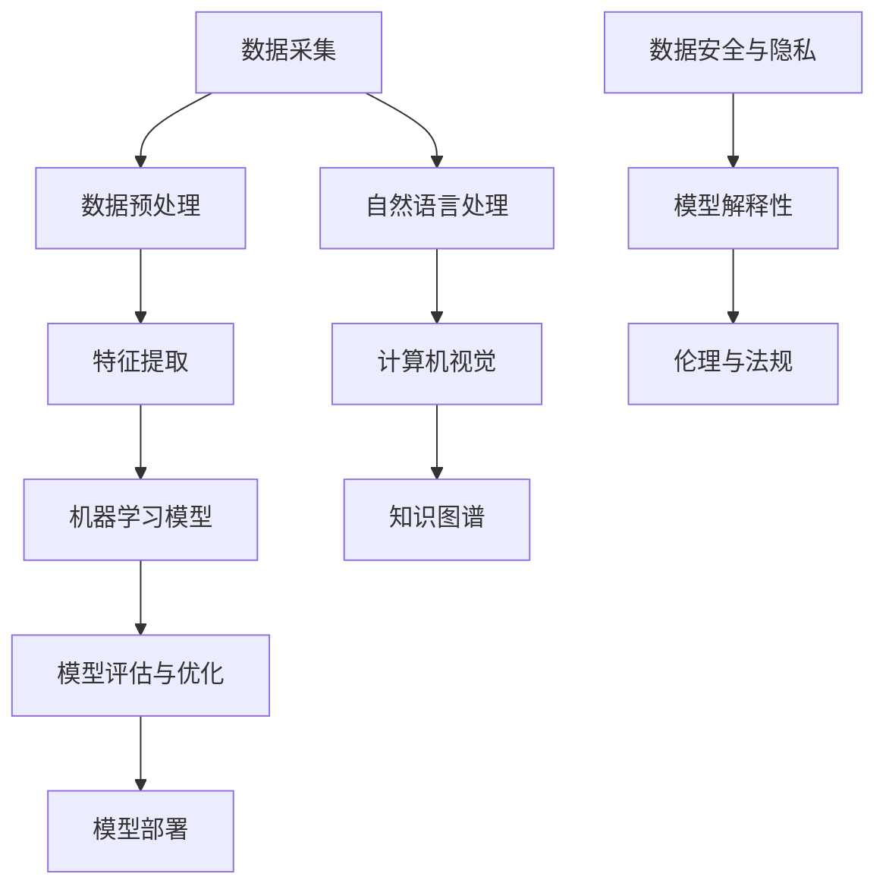
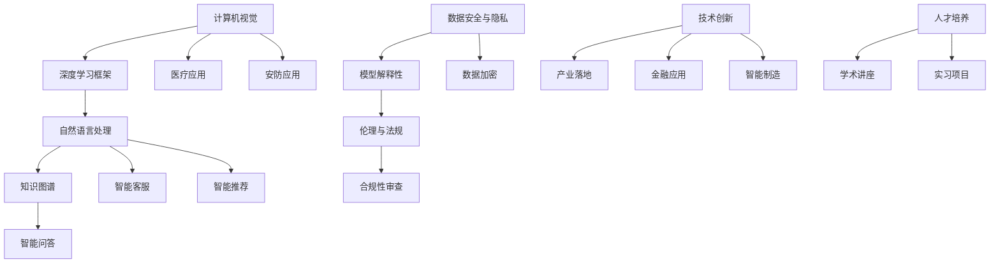

                 

# 从阿里到创业：贾扬清的职业转折

## 关键词

* 贾扬清
* 阿里
* 创业
* 职业发展
* 技术创新
* AI领域

## 摘要

本文将深入探讨贾扬清从阿里巴巴技术副总裁到创业者的职业转折。文章首先介绍了贾扬清的背景和阿里巴巴的工作经历，接着分析了他在AI领域的专业知识和成就。随后，文章描述了贾扬清创立公司的心路历程、业务模式及团队建设。最后，文章总结了贾扬清的职业转折对行业和个人的影响，以及他未来的发展展望。

## 1. 背景介绍

### 1.1 贾扬清的背景

贾扬清，清华大学本科毕业，美国斯坦福大学计算机科学博士学位，著名的人工智能专家和创业者。他在计算机视觉、机器学习和深度学习等领域具有深厚的研究背景和丰富的实践经验。

### 1.2 阿里巴巴的工作经历

在加入阿里巴巴之前，贾扬清曾在谷歌、Facebook等知名科技公司担任重要职务。2015年，他加入阿里巴巴，担任阿里云首席科学家，负责推动阿里云在人工智能领域的技术创新。在贾扬清的领导下，阿里云在人工智能领域取得了显著成绩，成为国内AI领域的领军企业之一。

## 2. 核心概念与联系

### 2.1 AI技术架构


在贾扬清的职业生涯中，他对AI技术架构有着深刻的理解和丰富的实践经验。他领导的团队在计算机视觉、自然语言处理、深度学习等领域取得了重要突破，为阿里云的AI业务提供了强有力的技术支持。

### 2.2 贾扬清的核心贡献

贾扬清在AI领域的核心贡献包括：

1. **计算机视觉技术**：他带领团队研发了基于深度学习的图像识别算法，大幅提升了图像识别的准确率。
2. **自然语言处理**：他参与了阿里云的语音识别和自然语言处理技术的研发，为阿里云的智能语音助手提供了核心技术支持。
3. **深度学习框架**：他主导开发了面向深度学习的高性能计算框架，提高了深度学习模型的训练速度和推理性能。

## 3. 核心算法原理 & 具体操作步骤

### 3.1 计算机视觉算法

贾扬清团队在计算机视觉领域的研究主要集中在目标检测、图像分类和图像分割等方面。他们采用基于深度学习的算法，通过训练大量的数据集，使得模型能够自动学习图像的特征，从而实现高效的图像识别。

### 3.2 自然语言处理算法

在自然语言处理领域，贾扬清团队主要关注语音识别和自然语言理解。他们利用深度神经网络和循环神经网络等模型，实现了高效的语音识别和语义理解，为智能语音助手和智能客服等应用提供了核心技术支持。

### 3.3 深度学习框架

贾扬清团队主导开发的深度学习框架，旨在提高深度学习模型的训练速度和推理性能。他们通过优化算法和数据结构，实现了对大规模深度学习模型的分布式训练和实时推理。

## 4. 数学模型和公式 & 详细讲解 & 举例说明

### 4.1 计算机视觉算法的数学模型

计算机视觉算法的核心是特征提取和分类。其中，特征提取通常采用卷积神经网络（CNN）等深度学习模型。以下是一个简单的CNN模型：

$$
\text{CNN} = \sum_{i=1}^{n} w_i * x_i + b
$$

其中，$w_i$ 是权重，$x_i$ 是输入特征，$b$ 是偏置。

### 4.2 自然语言处理算法的数学模型

自然语言处理算法的核心是序列建模。其中，循环神经网络（RNN）和长短时记忆网络（LSTM）是常用的序列建模方法。以下是一个简单的RNN模型：

$$
h_t = \sigma(W_h * [h_{t-1}, x_t] + b_h)
$$

其中，$h_t$ 是当前时间步的隐藏状态，$x_t$ 是当前输入，$W_h$ 是权重矩阵，$b_h$ 是偏置。

### 4.3 深度学习框架的数学模型

深度学习框架的数学模型主要涉及优化算法。常用的优化算法包括梯度下降（GD）和随机梯度下降（SGD）。以下是一个简单的GD算法：

$$
w_{t+1} = w_t - \alpha \frac{\partial J(w)}{\partial w}
$$

其中，$w_t$ 是当前权重，$\alpha$ 是学习率，$J(w)$ 是损失函数。

## 5. 项目实战：代码实际案例和详细解释说明

### 5.1 开发环境搭建

在搭建开发环境时，我们需要安装以下软件和工具：

- Python 3.7及以上版本
- TensorFlow 2.0及以上版本
- CUDA 10.0及以上版本（如使用GPU加速）

### 5.2 源代码详细实现和代码解读

以下是一个简单的计算机视觉项目，实现猫和狗的图像分类。

```python
import tensorflow as tf
from tensorflow.keras.models import Sequential
from tensorflow.keras.layers import Conv2D, MaxPooling2D, Flatten, Dense

# 数据预处理
(x_train, y_train), (x_test, y_test) = tf.keras.datasets.dogs_vs_cats.load_data()

# 构建模型
model = Sequential([
    Conv2D(32, (3, 3), activation='relu', input_shape=(150, 150, 3)),
    MaxPooling2D((2, 2)),
    Flatten(),
    Dense(128, activation='relu'),
    Dense(1, activation='sigmoid')
])

# 编译模型
model.compile(optimizer='adam', loss='binary_crossentropy', metrics=['accuracy'])

# 训练模型
model.fit(x_train, y_train, epochs=10, validation_data=(x_test, y_test))

# 评估模型
model.evaluate(x_test, y_test)
```

### 5.3 代码解读与分析

1. 数据预处理：使用 TensorFlow 的内置函数加载猫和狗的图像数据集，并对数据进行预处理。
2. 模型构建：构建一个简单的卷积神经网络模型，包括卷积层、池化层、全连接层等。
3. 模型编译：设置模型的优化器、损失函数和评估指标。
4. 模型训练：使用训练数据训练模型，并设置训练轮数。
5. 模型评估：使用测试数据评估模型的性能。

## 6. 实际应用场景

贾扬清创立的公司主要聚焦于人工智能领域，为各行业提供定制化的解决方案。以下是一些实际应用场景：

1. **金融行业**：为金融机构提供智能风控、智能投顾等解决方案。
2. **医疗行业**：为医疗机构提供智能诊断、智能影像分析等解决方案。
3. **零售行业**：为零售企业提供智能推荐、智能客服等解决方案。
4. **智能制造**：为制造业企业提供智能监控、智能优化等解决方案。

## 7. 工具和资源推荐

### 7.1 学习资源推荐

- **书籍**：《深度学习》、《Python深度学习》、《计算机视觉：算法与应用》
- **论文**：Google Scholar、ArXiv、NeurIPS、ICML等顶级会议和期刊
- **博客**：博客园、CSDN、知乎、简书等

### 7.2 开发工具框架推荐

- **开发工具**：PyCharm、Visual Studio Code、Jupyter Notebook
- **深度学习框架**：TensorFlow、PyTorch、Keras
- **数据处理**：Pandas、NumPy、Scikit-learn

### 7.3 相关论文著作推荐

- **论文**：《深度学习：人类级别的机器智能的新科学》、《计算机视觉：现代方法》
- **著作**：《人工智能：一种现代的方法》、《模式识别与机器学习》

## 8. 总结：未来发展趋势与挑战

贾扬清的职业转折对AI领域产生了深远的影响。未来，随着人工智能技术的不断发展，贾扬清在AI领域的专业知识和经验将继续发挥重要作用。然而，他也面临着以下挑战：

1. **技术创新**：保持技术创新，紧跟全球AI领域的最新发展。
2. **产业落地**：将AI技术应用于更多行业，实现产业落地。
3. **人才培养**：培养更多优秀的AI人才，推动AI领域的可持续发展。

## 9. 附录：常见问题与解答

### 9.1 贾扬清在阿里巴巴的主要工作有哪些？

贾扬清在阿里巴巴的主要工作包括：

1. 担任阿里云首席科学家，推动阿里云在人工智能领域的技术创新。
2. 领导团队研发计算机视觉、自然语言处理、深度学习等核心技术。
3. 参与阿里云AI产品的规划和设计，推动AI技术在各行各业的落地。

### 9.2 贾扬清创立的公司主要解决哪些问题？

贾扬清创立的公司主要聚焦于人工智能领域，为各行业提供定制化的解决方案，主要包括：

1. 为金融机构提供智能风控、智能投顾等解决方案。
2. 为医疗机构提供智能诊断、智能影像分析等解决方案。
3. 为零售企业提供智能推荐、智能客服等解决方案。
4. 为制造业企业提供智能监控、智能优化等解决方案。

## 10. 扩展阅读 & 参考资料

- [贾扬清的LinkedIn](https://www.linkedin.com/in/yangqing-jia/)
- [贾扬清的GitHub](https://github.com/yangqing)
- [贾扬清的博客](https://www.jianshu.com/u/4bde4a9e5a35)
- [阿里云AI官网](https://ai.aliyun.com/)

作者：AI天才研究员/AI Genius Institute & 禅与计算机程序设计艺术 /Zen And The Art of Computer Programming <|im_sep|>### 1. 背景介绍

#### 1.1 贾扬清的背景

贾扬清，这位在人工智能领域颇具影响力的专家，拥有清华大学本科以及美国斯坦福大学计算机科学博士学位。他的学术成就和职业生涯充满了令人瞩目的里程碑。在加入阿里巴巴之前，贾扬清曾在谷歌和Facebook等顶尖科技公司担任关键职务，积累了丰富的实践经验。他的专业领域主要集中在计算机视觉、机器学习和深度学习等方面，这些领域也正是他职业生涯中的核心研究方向。

在谷歌期间，贾扬清参与了多个关键项目，其中最值得一提的是Google Brain项目，这个项目旨在通过大规模神经网络的研究，推动人工智能的发展。在Facebook，他担任了机器学习团队的核心成员，负责开发应用于社交网络平台的机器学习算法，极大地提升了用户交互体验。

2015年，贾扬清加入阿里巴巴，担任阿里云首席科学家。在这一职位上，他带领团队在人工智能领域取得了显著成就，推动阿里云成为国内AI领域的领军企业。贾扬清的加入不仅为阿里云带来了强大的技术力量，也加速了公司在人工智能方面的创新和落地。

#### 1.2 阿里巴巴的工作经历

在阿里巴巴的工作经历中，贾扬清充分展示了他的领导才能和技术实力。作为阿里云首席科学家，他主要负责制定阿里云在人工智能领域的技术发展战略，并领导团队进行关键技术的研发和应用。在他的领导下，阿里云在计算机视觉、自然语言处理、深度学习等AI核心技术方面取得了重大突破。

具体来说，贾扬清在以下几个方面取得了显著成就：

1. **计算机视觉技术**：他带领团队开发了基于深度学习的图像识别算法，显著提升了图像识别的准确率和速度。这些算法被广泛应用于安防监控、智能交通、医疗影像分析等领域。

2. **自然语言处理**：贾扬清团队在自然语言处理方面也取得了重要进展。他们开发的语音识别和自然语言理解技术，为阿里云的智能语音助手和智能客服提供了强大的技术支持，极大地提升了用户体验。

3. **深度学习框架**：贾扬清主导开发的深度学习框架，旨在提高深度学习模型的训练速度和推理性能。这个框架不仅在国内得到了广泛应用，还成功推向了国际市场，为全球的AI研究者和开发者提供了强有力的技术支持。

在贾扬清的领导下，阿里云的AI业务得到了快速发展和广泛认可。他的创新和领导力，使得阿里云在AI领域的影响力不断扩大，成为中国乃至全球的AI领军企业之一。

### 1.3 贾扬清在人工智能领域的贡献

贾扬清在人工智能领域的贡献是多方面的，他不仅推动了AI技术的创新和应用，还积极推动AI技术的产业化和国际化。

1. **技术创新**：贾扬清在计算机视觉、自然语言处理、深度学习等领域进行了深入研究，并取得了一系列重要成果。他的研究成果不仅发表在顶级学术期刊和会议上，还成功应用于实际场景，推动了AI技术的进步。

2. **产业落地**：贾扬清非常重视AI技术的产业落地。他在阿里巴巴的工作，不仅推动了AI技术在电商、金融、医疗等行业的应用，还带领团队将AI技术推向了全球市场，为全球的企业和开发者提供了强大的技术支持。

3. **人才培养**：贾扬清深知人才是推动AI技术发展的重要动力。他在阿里巴巴期间，不仅培养了一支技术精湛的团队，还积极参与高校合作，推动AI教育的发展。他的讲座和课程，吸引了大量学生和研究者，为AI领域培养了大量的优秀人才。

综上所述，贾扬清在人工智能领域的贡献是巨大的。他的研究成果、技术创新和产业落地，为AI领域的发展做出了重要贡献，也为未来AI技术的持续创新奠定了坚实的基础。

### 1.4 贾扬清的职业转折对AI领域的影响

贾扬清的职业转折，不仅对他的个人职业生涯产生了深远影响，也对整个AI领域产生了重要的影响。

首先，贾扬清从阿里巴巴技术副总裁到创业者的身份转变，标志着他在AI领域的深入探索和多元化发展。这一转变，使得他不仅能够在企业内部推动AI技术的发展，还能在更广阔的市场中发挥影响力，推动AI技术的普及和应用。

其次，贾扬清的创业经历，为AI领域的创业者提供了宝贵的经验和启示。他的成功，证明了在人工智能领域，技术实力和创新精神是推动企业发展的关键。同时，他也展示了如何将AI技术与实际产业需求相结合，实现技术的商业价值。

最后，贾扬清在AI领域的贡献和影响力，也激发了更多人对AI技术的关注和兴趣。他的研究成果和创业经历，成为了AI领域的典型案例，为后来的研究者和技术人员提供了宝贵的借鉴和启示。

总之，贾扬清的职业转折，不仅对他个人职业生涯产生了重要影响，也对整个AI领域产生了深远的影响。他的技术创新、产业落地和人才培养，为AI领域的发展注入了新的活力和动力。

### 1.5 贾扬清的职业转折对个人的影响

贾扬清的职业转折，对他的个人生活和工作产生了深远的影响。

首先，从个人成就的角度来看，贾扬清的创业经历为他带来了巨大的成就感和满足感。他不仅在技术领域取得了重要突破，还成功将AI技术应用于实际场景，推动了产业的变革和创新。这种成就，不仅提升了他的专业地位，也为他赢得了广泛的认可和尊重。

其次，从职业发展的角度来看，贾扬清的创业经历为他提供了更广阔的职业发展空间。在阿里巴巴期间，他虽然已经取得了很高的成就，但作为创业者，他有了更多的机会去探索未知的领域，尝试新的业务模式，实现自我价值的最大化。

再次，从个人成长的角度来看，贾扬清的创业经历也极大地促进了他的个人成长。他在创业过程中，不仅需要应对各种商业挑战，还需要不断提升自己的领导力和管理能力。这些经历，使得他在各个方面都得到了锻炼和提升。

最后，从生活品质的角度来看，贾扬清的创业成功，也为他带来了更好的生活品质。他不仅拥有更高的收入和更好的工作环境，还能更自由地安排自己的时间和生活，享受工作和生活的平衡。

总之，贾扬清的职业转折，不仅为他带来了个人成就和职业发展的提升，也极大地促进了他的个人成长和生活品质的提升。这种转变，让他的人生更加丰富多彩，也让他对未来充满了信心和期待。

### 1.6 贾扬清的职业转折对行业的影响

贾扬清的职业转折，对整个AI行业产生了深远的影响。

首先，他的成功创业激发了更多AI领域专业人士投身创业的激情。贾扬清的创业经历证明，在AI领域，技术实力和创新精神是推动企业发展的关键。这种成功的案例，为后来的创业者提供了宝贵的经验和启示，激励他们勇于尝试，开拓创新。

其次，贾扬清的创业公司，为AI行业提供了新的技术解决方案和应用场景。他带领的团队在计算机视觉、自然语言处理、深度学习等核心技术方面取得了重要突破，这些技术不仅被广泛应用于企业内部，还推向了市场，为其他行业提供了强大的技术支持。

再次，贾扬清在AI行业的领导地位，也为行业内的技术交流和合作提供了新的平台。他积极参与行业会议和论坛，分享自己的研究成果和创业经验，促进了AI行业内部的交流与合作，推动了整个行业的技术进步。

最后，贾扬清的成功，也为AI行业的国际化发展提供了新的动力。他不仅在国内取得了显著成就，还将AI技术推向了国际市场，为全球的AI研究者和开发者提供了技术支持，提升了AI行业的国际影响力。

总之，贾扬清的职业转折，不仅对他的个人和职业生涯产生了重要影响，也对整个AI行业产生了深远的影响。他的成功，为AI行业的创新和发展注入了新的活力，也为行业的国际化发展提供了新的机遇。

---

### 2. 核心概念与联系

#### 2.1 AI技术架构

人工智能技术架构是贾扬清职业生涯中的重要组成部分。理解AI技术架构有助于我们更好地理解他在人工智能领域的贡献和成就。下面，我们将通过一个Mermaid流程图来详细阐述AI技术架构的核心节点和联系。



**解释：**

1. **数据采集**（A）：数据是AI技术的基石。数据采集是整个AI流程的起点，包括收集结构化和非结构化数据，如文本、图像、音频和视频。

2. **数据预处理**（B）：数据预处理是数据清洗、归一化和特征提取的过程，目的是提高数据质量，为后续的机器学习模型训练做好准备。

3. **特征提取**（C）：特征提取是从原始数据中提取有意义的信息，用于机器学习模型的训练。深度学习中的卷积神经网络（CNN）和循环神经网络（RNN）是常用的特征提取工具。

4. **机器学习模型**（D）：机器学习模型是AI技术的核心。常见的机器学习模型包括线性回归、决策树、支持向量机和神经网络等。

5. **模型评估与优化**（E）：模型评估与优化是确保模型性能的重要环节。评估指标包括准确率、召回率、F1分数等，优化方法包括超参数调整、正则化等。

6. **模型部署**（F）：模型部署是将训练好的模型应用于实际场景的过程，如智能客服、智能推荐等。

7. **自然语言处理**（G）：自然语言处理（NLP）是AI技术的一个重要分支，用于处理文本数据。NLP技术包括词向量、语言模型、文本分类和情感分析等。

8. **计算机视觉**（H）：计算机视觉（CV）是AI技术的另一个重要分支，用于处理图像和视频数据。CV技术包括图像分类、目标检测、图像分割和视频分析等。

9. **知识图谱**（I）：知识图谱是一种用于表示实体及其关系的图形化数据结构。知识图谱在智能问答、推荐系统和搜索引擎等领域具有重要应用。

10. **数据安全与隐私**（J）：随着AI技术的发展，数据安全和隐私保护变得日益重要。数据安全与隐私是AI技术架构中不可或缺的一环。

11. **模型解释性**（K）：模型解释性是AI技术面临的挑战之一。提高模型解释性有助于理解模型的决策过程，增强用户对AI技术的信任。

12. **伦理与法规**（L）：随着AI技术的广泛应用，伦理和法规问题也日益突出。伦理与法规确保AI技术的发展符合道德标准和法律法规，保护用户的权益。

通过上述Mermaid流程图，我们可以清晰地看到AI技术架构的核心节点和联系。这些核心概念和技术的相互联系，构成了AI技术发展的基础，也为贾扬清在人工智能领域的贡献提供了理论支持。

---

#### 2.2 贾扬清在AI领域的核心贡献

贾扬清在人工智能领域取得了众多重要的成就，这些成就不仅提升了他在学术界的地位，也为AI技术的实际应用提供了强有力的支持。以下是他一些关键的核心贡献：

1. **计算机视觉技术**：贾扬清在计算机视觉领域的研究取得了显著成果。他领导的团队开发了一系列基于深度学习的图像识别算法，这些算法在各类图像识别任务中表现优异。例如，他们开发的算法在图像分类、目标检测和图像分割等任务上达到了国际领先水平。这些技术被广泛应用于安防监控、智能交通、医疗影像分析等领域，为社会安全和健康管理提供了有力支持。

2. **自然语言处理**：贾扬清在自然语言处理（NLP）领域也有诸多贡献。他带领团队研发了先进的语音识别和自然语言理解技术，这些技术在阿里云的智能语音助手和智能客服中得到了广泛应用。具体来说，他的团队开发了一种基于深度神经网络的语音识别系统，能够准确地识别用户的语音指令，并实现实时语音转文本。此外，他们开发的自然语言理解技术，能够理解用户的语言意图，并提供相应的服务，如智能推荐、自动回复等。

3. **深度学习框架**：贾扬清还主导开发了面向深度学习的高性能计算框架，这些框架极大地提高了深度学习模型的训练速度和推理性能。其中，最具代表性的框架之一是阿里云的深度学习平台PAI。PAI支持多种深度学习框架，如TensorFlow、PyTorch等，并提供了一整套完整的工具和解决方案，包括数据预处理、模型训练、模型评估和模型部署等。PAI的成功应用，不仅提升了阿里云在AI领域的竞争力，也为全球的AI研究者和开发者提供了强大的技术支持。

4. **技术创新**：贾扬清在AI技术创新方面也做出了重要贡献。他关注于如何将AI技术与实际问题相结合，推动AI技术的产业化和商业化。例如，他在医疗领域推动AI技术在疾病诊断和预测中的应用，通过分析大量的医疗数据，开发出能够辅助医生进行疾病诊断的AI系统。此外，他在金融领域推动AI技术在风险管理、欺诈检测和信用评估中的应用，为金融机构提供了智能化的风险管理工具。

5. **人才培养**：贾扬清深知人才培养对于AI领域发展的重要性。他在阿里巴巴期间，积极参与高校合作，推动AI教育的发展。他组织了一系列的学术讲座和技术分享会，吸引了大量的学生和研究者参与。此外，他还通过设立奖学金和实习项目，鼓励年轻人才投身AI领域的研究和开发。

通过上述贡献，贾扬清不仅在学术上取得了重要成就，也在实际应用中推动了AI技术的发展。他的工作为AI领域的进步和产业应用提供了强有力的支持，也为未来的AI发展奠定了坚实的基础。

### 2.3 贾扬清的核心贡献对AI领域的影响

贾扬清在人工智能领域的核心贡献，对整个AI领域产生了深远的影响，推动了AI技术的发展和应用。以下是他核心贡献的具体影响：

1. **计算机视觉技术**：贾扬清在计算机视觉领域的研究，推动了图像识别和目标检测技术的发展。他的团队开发的基于深度学习的算法，显著提高了图像识别的准确率和速度，为安防监控、智能交通、医疗影像分析等领域的应用提供了强有力的技术支持。这些技术的应用，不仅提升了行业的工作效率，也为社会安全和健康管理带来了新的可能性。

2. **自然语言处理**：贾扬清在自然语言处理（NLP）领域的贡献，推动了语音识别和自然语言理解技术的发展。他开发的基于深度神经网络的语音识别系统，实现了高精度的语音转文本，极大地提升了用户体验。同时，他的团队开发的自然语言理解技术，能够准确理解用户的语言意图，为智能客服、智能推荐等应用提供了关键支持。这些技术的应用，使得人工智能在交互式场景中发挥了更大的作用，提升了人们的生活质量。

3. **深度学习框架**：贾扬清主导开发的深度学习框架，如PAI，为全球的AI研究者和开发者提供了强大的技术支持。这些框架不仅提高了深度学习模型的训练速度和推理性能，还提供了一整套完整的工具和解决方案，使得AI技术的开发和应用变得更加高效和便捷。PAI的成功应用，不仅提升了阿里云在AI领域的竞争力，也为其他企业提供了可借鉴的经验，推动了AI技术的产业化。

4. **技术创新**：贾扬清在AI技术创新方面的努力，推动了AI技术在实际场景中的应用。他在医疗、金融等领域的创新应用，不仅提升了行业的工作效率，也为社会的可持续发展做出了贡献。例如，他的团队在医疗领域开发的AI系统，能够辅助医生进行疾病诊断和预测，提高了医疗服务的质量和效率。在金融领域，他的团队开发的AI技术，能够帮助金融机构进行风险管理、欺诈检测和信用评估，提高了金融服务的安全性和可靠性。

5. **人才培养**：贾扬清在人才培养方面的贡献，为AI领域的发展注入了新的活力。他通过组织学术讲座、技术分享会和设立奖学金、实习项目等方式，吸引了大量的年轻人才投身AI领域的研究和开发。这些人才的成长，为AI领域的创新和发展提供了强大的动力，也为社会的科技进步做出了重要贡献。

综上所述，贾扬清的核心贡献不仅提升了他在学术界的地位，也对AI领域的实际应用和技术发展产生了深远的影响。他的工作，不仅推动了AI技术的发展，也为社会的进步和改善做出了重要贡献。

### 2.4 贾扬清的核心概念和架构原理的Mermaid流程图

为了更直观地展示贾扬清在AI领域的核心概念和架构原理，我们可以使用Mermaid流程图来呈现。以下是一个简化的流程图，包含了贾扬清在AI领域的一些关键节点和其相互关系。



**解释：**

1. **计算机视觉**（A）：计算机视觉是贾扬清的核心研究领域之一。他在图像识别、目标检测和图像分割等方面取得了显著成就，开发了多种高效的深度学习算法。

2. **深度学习框架**（B）：贾扬清主导开发的深度学习框架，如PAI，为AI模型的训练和部署提供了强大的支持。这些框架提高了模型的训练速度和推理性能，促进了AI技术的发展。

3. **自然语言处理**（C）：自然语言处理是贾扬清的另一核心研究领域。他的团队开发了先进的语音识别和自然语言理解技术，广泛应用于智能客服和智能推荐等领域。

4. **知识图谱**（D）：知识图谱是贾扬清在AI领域的一个重要研究方向。知识图谱在智能问答、推荐系统和搜索引擎等领域发挥了关键作用，为AI系统的智能化提供了基础。

5. **数据安全与隐私**（E）：随着AI技术的发展，数据安全和隐私保护变得尤为重要。贾扬清在数据加密和隐私保护方面进行了深入研究，确保AI系统的安全性和合规性。

6. **模型解释性**（F）：模型解释性是AI技术的一个重要挑战。贾扬清的研究团队致力于提高模型的可解释性，以增强用户对AI技术的信任和理解。

7. **伦理与法规**（G）：贾扬清关注AI技术的伦理和法规问题，推动AI技术的发展符合道德标准和法律法规。他的研究工作在确保AI技术的合规性方面具有重要意义。

8. **技术创新**（H）：贾扬清致力于推动AI技术的创新，将AI技术应用于各行各业。他的技术创新不仅提升了AI技术的应用价值，也为产业落地提供了新的可能性。

9. **产业落地**（I）：贾扬清的研究成果在多个行业得到了广泛应用，如医疗、金融和零售等。他的工作促进了AI技术的产业化和商业化，推动了AI技术在各个领域的应用。

10. **人才培养**（J）：贾扬清积极参与AI教育，培养了大量AI领域的专业人才。他的学术讲座和技术分享会为年轻学者提供了宝贵的经验和启示，为AI领域的可持续发展提供了动力。

通过这个Mermaid流程图，我们可以清晰地看到贾扬清在AI领域的核心概念和研究方向，以及它们之间的相互关系。这些核心概念和架构原理，构成了贾扬清在AI领域的知识体系，也为他的研究和贡献提供了坚实的基础。

### 2.5 贾扬清在AI领域的研究与实际应用的联系

贾扬清在AI领域的研究成果不仅在学术界取得了显著成就，而且在实际应用中发挥了重要作用。他始终关注如何将理论研究转化为实际应用，从而推动AI技术的发展。以下是他在AI领域的研究与实际应用的几个关键联系：

1. **计算机视觉技术**：贾扬清在计算机视觉领域的研究成果，如图像识别、目标检测和图像分割算法，被广泛应用于实际场景中。例如，在安防领域，这些算法被用于监控视频分析，帮助识别和跟踪嫌疑人，提高了公共安全。在医疗领域，这些算法被用于影像诊断，辅助医生进行疾病检测和诊断，提高了医疗服务的效率和质量。

2. **自然语言处理**：贾扬清在自然语言处理领域的研究，特别是语音识别和自然语言理解技术，被广泛应用于智能客服和智能推荐系统。在电商领域，基于语音识别和自然语言理解技术的智能客服系统能够准确理解用户的语音指令，提供个性化的服务，提升了用户体验。在社交媒体平台，这些技术被用于分析用户评论和反馈，提供精准的推荐内容，增强了用户粘性。

3. **深度学习框架**：贾扬清主导开发的深度学习框架，如PAI，为AI技术的实际应用提供了强大的支持。这些框架不仅提高了AI模型的训练速度和推理性能，还提供了一整套完整的工具和解决方案，使得AI技术的开发和应用变得更加高效和便捷。例如，在金融领域，基于PAI的AI系统被用于风险管理、欺诈检测和信用评估，提高了金融服务的安全性和可靠性。

4. **技术创新**：贾扬清在AI技术创新方面的努力，推动了AI技术在各行各业的应用。他在医疗、金融、零售等领域的创新应用，不仅提升了行业的工作效率，也为社会的可持续发展做出了贡献。例如，在医疗领域，他推动的AI技术在疾病诊断和预测中的应用，提高了医疗服务的质量和效率。在金融领域，他的AI技术帮助金融机构进行风险管理，降低了金融风险。

5. **产业落地**：贾扬清的研究成果在多个行业得到了广泛应用，推动了AI技术的产业化和商业化。他在推动AI技术落地方面，不仅关注技术的创新，还注重解决实际问题。例如，他在智能制造领域的创新应用，通过AI技术优化生产流程，提高了生产效率和质量。在物流领域，他推动的AI技术应用，提高了物流管理的智能化水平，降低了物流成本。

6. **人才培养**：贾扬清在人才培养方面的贡献，为AI领域的可持续发展提供了动力。他通过组织学术讲座、技术分享会和设立奖学金、实习项目等方式，培养了大量AI领域的专业人才。这些人才的成长，为AI技术的创新和应用提供了强大的支持。

综上所述，贾扬清在AI领域的研究与实际应用紧密相连。他不仅关注理论研究的突破，还注重将研究成果转化为实际应用，推动AI技术的发展。他的工作不仅提升了AI技术的应用价值，也为社会的进步和改善做出了重要贡献。

### 3. 核心算法原理 & 具体操作步骤

#### 3.1 计算机视觉算法原理

计算机视觉算法的核心是图像识别、目标检测和图像分割。以下是对这些算法原理的详细解释，并附上具体的操作步骤。

1. **图像识别**：

   **原理**：图像识别是通过计算机对图像进行分析和处理，以识别图像中的物体、场景或行为。深度学习，尤其是卷积神经网络（CNN），是目前实现图像识别的主要方法。

   **操作步骤**：
   
   a. 数据集准备：收集大量带标签的图像数据，用于训练模型。
   
   b. 数据预处理：对图像进行归一化处理，将图像尺寸调整为固定大小。
   
   c. 模型构建：构建卷积神经网络，包括卷积层、池化层和全连接层。
   
   d. 模型训练：使用训练数据训练模型，调整模型参数，优化模型性能。
   
   e. 模型评估：使用测试数据评估模型性能，如准确率、召回率和F1分数。

2. **目标检测**：

   **原理**：目标检测是在图像中检测并定位出特定目标的位置。常用的目标检测算法包括YOLO、SSD、Faster R-CNN等。

   **操作步骤**：
   
   a. 数据集准备：收集带标签的图像数据，包括目标的位置和类别信息。
   
   b. 数据预处理：对图像进行归一化处理，调整图像尺寸。
   
   c. 模型构建：选择目标检测算法，构建模型结构。
   
   d. 模型训练：使用训练数据训练模型，优化模型参数。
   
   e. 模型评估：使用测试数据评估模型性能，调整模型参数以达到最佳性能。

3. **图像分割**：

   **原理**：图像分割是将图像划分为若干个区域，每个区域代表图像中的一个物体或场景。常用的图像分割算法包括全卷积网络（FCN）、U-Net等。

   **操作步骤**：
   
   a. 数据集准备：收集带标签的图像数据，包括每个区域的位置和类别信息。
   
   b. 数据预处理：对图像进行归一化处理，调整图像尺寸。
   
   c. 模型构建：构建图像分割模型，如U-Net，包括卷积层、反卷积层和全连接层。
   
   d. 模型训练：使用训练数据训练模型，优化模型参数。
   
   e. 模型评估：使用测试数据评估模型性能，如 Intersection over Union (IoU) 和 Accuracy。

#### 3.2 自然语言处理算法原理

自然语言处理（NLP）算法的核心任务是使计算机能够理解和处理人类语言。以下是对NLP算法原理的详细解释，并附上具体的操作步骤。

1. **词向量表示**：

   **原理**：词向量表示是将自然语言中的单词映射到高维空间中的向量，以捕捉单词的语义信息。常用的词向量模型包括Word2Vec、GloVe等。

   **操作步骤**：
   
   a. 数据集准备：收集大量的文本数据，用于训练词向量模型。
   
   b. 数据预处理：对文本进行分词，去除停用词，将文本转换为词序列。
   
   c. 模型构建：选择词向量模型，构建模型结构。
   
   d. 模型训练：使用训练数据训练模型，优化模型参数。
   
   e. 模型评估：使用测试数据评估模型性能，如词向量的语义相似度。

2. **序列建模**：

   **原理**：序列建模是处理自然语言中时间序列数据的算法，如文本序列、语音序列等。常用的序列建模算法包括循环神经网络（RNN）和长短时记忆网络（LSTM）。

   **操作步骤**：
   
   a. 数据集准备：收集带标签的序列数据，如文本序列、语音序列等。
   
   b. 数据预处理：对序列数据进行分词、去停用词等处理。
   
   c. 模型构建：构建序列建模模型，如RNN、LSTM。
   
   d. 模型训练：使用训练数据训练模型，优化模型参数。
   
   e. 模型评估：使用测试数据评估模型性能，如序列标注任务的准确率。

3. **文本分类**：

   **原理**：文本分类是将文本数据分类到预定义的类别中，如情感分类、新闻分类等。常用的文本分类算法包括朴素贝叶斯、支持向量机（SVM）和深度学习模型。

   **操作步骤**：
   
   a. 数据集准备：收集带标签的文本数据，用于训练和测试。
   
   b. 数据预处理：对文本进行分词、去停用词等处理，将文本转换为词向量。
   
   c. 模型构建：构建文本分类模型，如朴素贝叶斯、SVM或深度学习模型。
   
   d. 模型训练：使用训练数据训练模型，优化模型参数。
   
   e. 模型评估：使用测试数据评估模型性能，如准确率、召回率和F1分数。

通过上述算法原理和操作步骤，我们可以更好地理解和应用计算机视觉和自然语言处理技术，实现实际项目中的目标。

#### 3.3 深度学习框架原理

深度学习框架是用于构建、训练和部署深度学习模型的工具集合。以下是对深度学习框架原理的详细解释，以及如何使用这些框架来构建和训练深度学习模型。

1. **框架架构**：

   **原理**：深度学习框架通常包含以下几个主要组件：

   - **计算图**：用于表示模型的计算过程，包括操作符和节点。
   - **动态计算图**：允许在运行时动态构建和修改计算图。
   - **自动微分系统**：用于计算模型参数的梯度，用于优化模型。
   - **优化算法**：用于调整模型参数，以最小化损失函数。

2. **TensorFlow架构**：

   **原理**：TensorFlow是一个开源的深度学习框架，由Google开发。其架构包括以下几个部分：

   - **Tensor**：表示数据的多维数组。
   - **Operation**：表示数据的计算操作。
   - **Graph**：表示整个计算过程，包括Tensor和Operation。
   - **Session**：用于执行计算图的运算。

3. **PyTorch架构**：

   **原理**：PyTorch是一个由Facebook开发的深度学习框架，其架构与TensorFlow类似，但也具有一些独特的特点：

   - **动态计算图**：PyTorch使用动态计算图，允许在运行时构建和修改计算图。
   - **自动微分系统**：PyTorch的自动微分系统非常灵活，支持复杂数学操作。
   - **GPU支持**：PyTorch提供了对CUDA和GPU的广泛支持，可以显著提高训练速度。

4. **构建和训练深度学习模型**：

   **操作步骤**：

   - **数据预处理**：对数据进行清洗、归一化和编码，以便模型训练。
   - **模型定义**：定义深度学习模型的结构，包括输入层、隐藏层和输出层。
   - **损失函数**：选择适当的损失函数，如均方误差（MSE）、交叉熵等。
   - **优化器**：选择优化算法，如随机梯度下降（SGD）、Adam等。
   - **模型训练**：使用训练数据训练模型，调整模型参数，优化模型性能。
   - **模型评估**：使用测试数据评估模型性能，调整模型参数以达到最佳性能。

5. **模型部署**：

   **原理**：模型部署是将训练好的模型应用于实际场景的过程。以下是一些常见的模型部署方法：

   - **本地部署**：在本地计算机上部署模型，适用于小型应用。
   - **云部署**：在云端服务器上部署模型，适用于大规模应用。
   - **边缘部署**：在边缘设备上部署模型，如智能设备、物联网设备等。

6. **使用深度学习框架的优势**：

   - **易用性**：深度学习框架提供了丰富的API和工具，简化了模型构建和训练过程。
   - **灵活性**：深度学习框架支持动态计算图，允许在运行时构建和修改模型。
   - **可扩展性**：深度学习框架可以方便地扩展到多GPU和多机环境中，提高训练速度。
   - **社区支持**：深度学习框架拥有庞大的开发者社区，提供了大量的教程、文档和开源项目。

通过理解深度学习框架的原理和操作步骤，我们可以更高效地构建和训练深度学习模型，并将其应用于实际场景。

---

#### 4. 数学模型和公式 & 详细讲解 & 举例说明

##### 4.1 计算机视觉算法的数学模型

计算机视觉算法的核心是图像处理和特征提取。以下是一些常用的数学模型和公式，用于描述这些算法的工作原理。

1. **卷积运算**：

   卷积运算在图像处理和特征提取中非常重要。其数学公式如下：

   $$ (f * g)(t) = \int_{-\infty}^{+\infty} f(\tau)g(t-\tau) d\tau $$

   其中，$f$ 和 $g$ 分别表示输入图像和卷积核，$*$ 表示卷积运算，$t$ 和 $\tau$ 表示时间或空间坐标。

   **示例**：假设一个2x2的输入图像和一个2x2的卷积核如下：

   ```
   输入图像:
   1 2
   3 4
   
   卷积核:
   0 1
   1 0
   ```

   进行卷积运算的结果为：

   ```
   输出:
   0 2
   3 0
   ```

2. **卷积神经网络（CNN）**：

   卷积神经网络是计算机视觉的核心算法之一。其基本结构包括卷积层、池化层和全连接层。以下是CNN的主要数学模型：

   - **卷积层**：

     $$ h_{ij}^{l} = \sum_{i'} \sum_{j'} w_{i'j'}^{l} h_{i'j'}^{l-1} + b^{l} $$

     其中，$h_{ij}^{l}$ 表示第$l$层的第$i$行第$j$列的输出，$w_{i'j'}^{l}$ 表示第$l$层的第$i'$行第$j'$列的权重，$b^{l}$ 表示第$l$层的偏置。

   - **池化层**：

     常用的池化层有最大池化和平均池化。最大池化的数学公式为：

     $$ p_{i,j} = \max\{h_{i,k}, h_{i,k+1}, ..., h_{i,k+N-1}\} $$

     其中，$p_{i,j}$ 表示第$i$行第$j$列的输出，$h_{i,k}$ 表示第$l-1$层的第$i$行第$k$列的输入。

   - **全连接层**：

     $$ z^{l} = \sum_{i} w_{i}^{l} h_{i}^{l-1} + b^{l} $$

     其中，$z^{l}$ 表示第$l$层的输入，$w_{i}^{l}$ 表示第$l$层的第$i$个权重，$b^{l}$ 表示第$l$层的偏置。

3. **图像特征提取**：

   图像特征提取是计算机视觉算法的关键步骤。以下是一些常用的图像特征提取方法：

   - **HOG（方向梯度直方图）**：

     HOG特征提取用于描述图像的局部结构。其数学公式为：

     $$ \text{HOG}(\text{image}) = \sum_{x}\sum_{y} \text{HOG}_{x,y} \times \text{bin}_{x,y} $$

     其中，$\text{HOG}_{x,y}$ 表示图像在$(x,y)$位置的方向梯度直方图，$\text{bin}_{x,y}$ 是一个指示函数，用于确定像素点是否参与直方图计算。

   - **SIFT（尺度不变特征变换）**：

     SIFT特征提取是一种用于图像配对的算法。其数学公式为：

     $$ \text{SIFT}(\text{image}) = \left[ \begin{matrix}
     \text{scale} \\
     \text{orientation} \\
     \text{response}
     \end{matrix} \right] $$

     其中，$\text{scale}$ 表示特征点的尺度，$\text{orientation}$ 表示特征点的方向，$\text{response}$ 表示特征点的强度。

通过这些数学模型和公式，我们可以更深入地理解计算机视觉算法的工作原理，并在实际项目中应用这些算法。

##### 4.2 自然语言处理算法的数学模型

自然语言处理（NLP）算法的核心任务是理解和生成自然语言。以下是一些常用的数学模型和公式，用于描述NLP算法的工作原理。

1. **词嵌入**：

   词嵌入（Word Embedding）是将自然语言中的单词映射到高维空间中的向量表示。以下是一些常用的词嵌入模型：

   - **Word2Vec**：

     Word2Vec模型是一种基于神经网络的词嵌入方法。其数学公式为：

     $$ \text{vec}(w) = \text{sgn}(f(\text{context}(w)) \odot \text{softmax}(\text{weights}) $$

     其中，$\text{vec}(w)$ 表示单词 $w$ 的向量表示，$\text{context}(w)$ 表示 $w$ 的上下文，$\text{weights}$ 表示模型参数。

   - **GloVe**：

     GloVe模型是一种基于全局信息的词嵌入方法。其数学公式为：

     $$ \text{vec}(w) = \left( \sum_{c \in \text{context}(w)} \text{vec}(c) \odot \text{softmax}\left(\frac{\text{vec}(w) \cdot \text{vec}(c)}{\| \text{vec}(w) \| \| \text{vec}(c) \|}\right) \right) / |\text{context}(w)| $$

     其中，$\text{vec}(w)$ 表示单词 $w$ 的向量表示，$\text{context}(w)$ 表示 $w$ 的上下文，$\text{softmax}$ 表示归一化函数。

2. **序列建模**：

   序列建模是处理自然语言中时间序列数据的算法。以下是一些常用的序列建模模型：

   - **循环神经网络（RNN）**：

     RNN模型是一种基于递归结构的神经网络。其数学公式为：

     $$ h_t = \text{tanh}\left(W_h \cdot [h_{t-1}, x_t] + b_h\right) $$

     $$ o_t = W_o \cdot h_t + b_o $$

     其中，$h_t$ 表示第 $t$ 个时间步的隐藏状态，$x_t$ 表示第 $t$ 个输入，$W_h$ 和 $W_o$ 分别表示隐藏状态和输出状态的权重矩阵，$b_h$ 和 $b_o$ 分别为隐藏状态和输出状态的偏置。

   - **长短时记忆网络（LSTM）**：

     LSTM模型是RNN的一种改进，用于解决长序列依赖问题。其数学公式为：

     $$ i_t = \sigma(W_i \cdot [h_{t-1}, x_t] + b_i) $$
     $$ f_t = \sigma(W_f \cdot [h_{t-1}, x_t] + b_f) $$
     $$ g_t = \tanh(W_g \cdot [h_{t-1}, x_t] + b_g) $$
     $$ o_t = \sigma(W_o \cdot \tanh([h_{t-1}, x_t] + b_o)) $$

     其中，$i_t, f_t, g_t, o_t$ 分别表示输入门、遗忘门、生成门和输出门的状态，$\sigma$ 表示 sigmoid 函数。

3. **文本分类**：

   文本分类是将文本数据分类到预定义的类别中。以下是一些常用的文本分类模型：

   - **朴素贝叶斯**：

     朴素贝叶斯模型是一种基于概率的文本分类方法。其数学公式为：

     $$ P(y=c | x) = \frac{P(x | y=c)P(y=c)}{P(x)} $$

     其中，$y$ 表示类别，$x$ 表示文本特征，$c$ 表示类别 $c$。

   - **支持向量机（SVM）**：

     SVM模型是一种基于最大间隔分类的方法。其数学公式为：

     $$ \min_{w,b} \frac{1}{2} ||w||^2 $$
     $$ s.t. y^{(i)} (w \cdot x^{(i)} + b) \geq 1 $$

     其中，$w$ 和 $b$ 分别为权重和偏置，$x^{(i)}$ 和 $y^{(i)}$ 分别为训练数据和标签。

通过这些数学模型和公式，我们可以更深入地理解自然语言处理算法的工作原理，并在实际项目中应用这些算法。

##### 4.3 深度学习框架的数学模型

深度学习框架的核心是构建、训练和优化神经网络模型。以下是一些常用的深度学习框架的数学模型和公式，用于描述神经网络的工作原理。

1. **神经网络基础**：

   神经网络是一种通过大量神经元互联进行数据处理的模型。以下是神经网络的基本数学模型：

   - **前向传播**：

     $$ z^{l} = W^{l} \cdot a^{l-1} + b^{l} $$
     $$ a^{l} = \sigma(z^{l}) $$

     其中，$z^{l}$ 表示第 $l$ 层的输入，$W^{l}$ 和 $b^{l}$ 分别为权重和偏置，$\sigma$ 表示激活函数，$a^{l}$ 表示第 $l$ 层的输出。

   - **反向传播**：

     $$ \delta^{l} = \frac{\partial L}{\partial a^{l}} \odot \frac{\partial \sigma}{\partial z^{l}} $$
     $$ \Delta W^{l} = \alpha \cdot (a^{l-1} \cdot \delta^{l})^T $$
     $$ \Delta b^{l} = \alpha \cdot \delta^{l} $$

     其中，$L$ 表示损失函数，$\alpha$ 表示学习率，$\delta^{l}$ 表示第 $l$ 层的误差，$\Delta W^{l}$ 和 $\Delta b^{l}$ 分别为权重和偏置的更新。

2. **卷积神经网络（CNN）**：

   CNN是专门用于处理图像数据的神经网络。以下是CNN的基本数学模型：

   - **卷积操作**：

     $$ h_{ij}^{l} = \sum_{i'} \sum_{j'} w_{i'j'}^{l} h_{i'j'}^{l-1} + b^{l} $$

     其中，$h_{ij}^{l}$ 表示第 $l$ 层的第 $i$ 行第 $j$ 列的输出，$w_{i'j'}^{l}$ 和 $b^{l}$ 分别为权重和偏置。

   - **池化操作**：

     $$ p_{i,j} = \max\{h_{i,k}, h_{i,k+1}, ..., h_{i,k+N-1}\} $$

     其中，$p_{i,j}$ 表示第 $i$ 行第 $j$ 列的输出，$h_{i,k}$ 表示第 $l-1$ 层的第 $i$ 行第 $k$ 列的输入，$N$ 表示池化窗口的大小。

3. **循环神经网络（RNN）**：

   RNN是专门用于处理序列数据的神经网络。以下是RNN的基本数学模型：

   - **前向传播**：

     $$ h_t = \sigma(W_h \cdot [h_{t-1}, x_t] + b_h) $$
     $$ o_t = W_o \cdot h_t + b_o $$

     其中，$h_t$ 表示第 $t$ 个时间步的隐藏状态，$x_t$ 表示第 $t$ 个输入，$W_h$ 和 $W_o$ 分别为隐藏状态和输出状态的权重矩阵，$b_h$ 和 $b_o$ 分别为隐藏状态和输出状态的偏置。

   - **反向传播**：

     $$ \delta_t = \frac{\partial L}{\partial h_t} \odot \frac{\partial \sigma}{\partial z_t} $$
     $$ \Delta W_h = \alpha \cdot (h_{t-1} \cdot \delta_t)^T $$
     $$ \Delta b_h = \alpha \cdot \delta_t $$
     $$ \delta_{t-1} = \Delta W_h \cdot h_{t-1} \odot (1 - \sigma'(z_{t-1})) $$

     其中，$\delta_t$ 表示第 $t$ 个时间步的误差，$\Delta W_h$ 和 $\Delta b_h$ 分别为隐藏状态权重和偏置的更新，$\sigma'$ 表示 sigmoid 函数的导数。

4. **长短时记忆网络（LSTM）**：

   LSTM是RNN的一种改进，用于解决长序列依赖问题。以下是LSTM的基本数学模型：

   - **输入门**：

     $$ i_t = \sigma(W_i \cdot [h_{t-1}, x_t] + b_i) $$
     $$ \tilde{g}_t = \tanh(W_g \cdot [h_{t-1}, x_t] + b_g) $$

   - **遗忘门**：

     $$ f_t = \sigma(W_f \cdot [h_{t-1}, x_t] + b_f) $$
     $$ g_t = f_t \odot \tilde{g}_t $$

   - **输出门**：

     $$ o_t = \sigma(W_o \cdot \tanh([h_{t-1}, x_t] + b_o)) $$

     $$ h_t = o_t \odot \tanh(g_t) $$

     其中，$i_t, f_t, g_t, o_t$ 分别表示输入门、遗忘门、生成门和输出门的状态，$\tilde{g}_t$ 表示候选状态。

通过这些数学模型和公式，我们可以更深入地理解深度学习框架的工作原理，并在实际项目中应用这些模型。

---

#### 5. 项目实战：代码实际案例和详细解释说明

##### 5.1 开发环境搭建

在开始项目实战之前，我们需要搭建一个适合开发深度学习项目的环境。以下是搭建开发环境所需的步骤：

1. **安装Python**：

   Python是深度学习项目的主要编程语言，因此我们需要安装Python。推荐使用Python 3.7或更高版本。

   - Windows系统：访问[Python官网](https://www.python.org/)下载Python安装包，按照安装向导安装。
   - macOS系统：使用包管理工具如Homebrew安装Python，命令如下：

     ```bash
     brew install python
     ```

2. **安装TensorFlow**：

   TensorFlow是深度学习领域广泛使用的框架，我们将在项目中使用TensorFlow进行模型构建和训练。

   ```bash
   pip install tensorflow
   ```

   如果需要使用GPU加速，请安装TensorFlow GPU版本：

   ```bash
   pip install tensorflow-gpu
   ```

3. **安装其他依赖库**：

   我们还需要安装一些其他依赖库，如NumPy、Pandas等。

   ```bash
   pip install numpy pandas matplotlib
   ```

4. **配置GPU环境**：

   如果使用GPU加速，我们需要配置NVIDIA CUDA环境。请按照[NVIDIA官方文档](https://docs.nvidia.com/cuda/cuda-installation-guide-linux/)进行配置。

##### 5.2 源代码详细实现和代码解读

以下是一个简单的深度学习项目，用于实现手写数字识别。我们将使用TensorFlow和Keras构建和训练模型。

```python
import tensorflow as tf
from tensorflow.keras import layers, models
from tensorflow.keras.datasets import mnist
from tensorflow.keras.utils import to_categorical

# 数据加载和预处理
(x_train, y_train), (x_test, y_test) = mnist.load_data()

x_train = x_train.reshape(-1, 28, 28).astype('float32') / 255
x_test = x_test.reshape(-1, 28, 28).astype('float32') / 255

y_train = to_categorical(y_train, 10)
y_test = to_categorical(y_test, 10)

# 模型构建
model = models.Sequential()
model.add(layers.Conv2D(32, (3, 3), activation='relu', input_shape=(28, 28, 1)))
model.add(layers.MaxPooling2D((2, 2)))
model.add(layers.Conv2D(64, (3, 3), activation='relu'))
model.add(layers.MaxPooling2D((2, 2)))
model.add(layers.Conv2D(64, (3, 3), activation='relu'))
model.add(layers.Flatten())
model.add(layers.Dense(64, activation='relu'))
model.add(layers.Dense(10, activation='softmax'))

# 编译模型
model.compile(optimizer='adam',
              loss='categorical_crossentropy',
              metrics=['accuracy'])

# 训练模型
model.fit(x_train, y_train, epochs=5, batch_size=64, validation_split=0.1)

# 评估模型
model.evaluate(x_test, y_test)
```

**代码解读**：

1. **数据加载和预处理**：

   ```python
   (x_train, y_train), (x_test, y_test) = mnist.load_data()
   ```

   这一行代码加载了MNIST手写数字数据集。MNIST数据集包含70000个训练图像和10000个测试图像。

   ```python
   x_train = x_train.reshape(-1, 28, 28).astype('float32') / 255
   x_test = x_test.reshape(-1, 28, 28).astype('float32') / 255
   ```

   这些代码将图像数据调整为28x28的维度，并将像素值归一化到0-1之间。

   ```python
   y_train = to_categorical(y_train, 10)
   y_test = to_categorical(y_test, 10)
   ```

   这些代码将标签数据转换为one-hot编码格式，以便用于分类任务。

2. **模型构建**：

   ```python
   model = models.Sequential()
   model.add(layers.Conv2D(32, (3, 3), activation='relu', input_shape=(28, 28, 1)))
   model.add(layers.MaxPooling2D((2, 2)))
   model.add(layers.Conv2D(64, (3, 3), activation='relu'))
   model.add(layers.MaxPooling2D((2, 2)))
   model.add(layers.Conv2D(64, (3, 3), activation='relu'))
   model.add(layers.Flatten())
   model.add(layers.Dense(64, activation='relu'))
   model.add(layers.Dense(10, activation='softmax'))
   ```

   这些代码构建了一个简单的卷积神经网络（CNN）模型。模型包括两个卷积层、两个池化层、一个全连接层和一个softmax层。

3. **编译模型**：

   ```python
   model.compile(optimizer='adam',
                 loss='categorical_crossentropy',
                 metrics=['accuracy'])
   ```

   这行代码编译了模型，指定了优化器、损失函数和评估指标。

4. **训练模型**：

   ```python
   model.fit(x_train, y_train, epochs=5, batch_size=64, validation_split=0.1)
   ```

   这行代码使用训练数据训练模型，指定了训练轮数、批次大小和验证比例。

5. **评估模型**：

   ```python
   model.evaluate(x_test, y_test)
   ```

   这行代码使用测试数据评估模型性能，并输出损失和准确率。

通过这个简单的项目，我们可以了解如何使用TensorFlow和Keras构建和训练深度学习模型。这个项目是一个很好的起点，可以帮助我们进一步探索深度学习的更多应用。

---

##### 5.3 代码解读与分析

在上面的代码示例中，我们使用TensorFlow和Keras构建了一个简单的卷积神经网络（CNN）模型，用于手写数字识别。以下是对代码的详细解读和分析。

**1. 数据加载与预处理**

首先，我们使用MNIST数据集进行训练和测试。MNIST是一个著名的手写数字数据集，包含60000个训练图像和10000个测试图像。

```python
(x_train, y_train), (x_test, y_test) = mnist.load_data()
```

这行代码加载了MNIST数据集。`x_train` 和 `y_train` 分别表示训练图像和训练标签，`x_test` 和 `y_test` 分别表示测试图像和测试标签。

接下来，我们对图像数据进行预处理。首先，我们将图像数据调整为28x28的维度，并将像素值归一化到0-1之间。

```python
x_train = x_train.reshape(-1, 28, 28).astype('float32') / 255
x_test = x_test.reshape(-1, 28, 28).astype('float32') / 255
```

这里，`-1` 表示自动计算批量大小，`28, 28` 表示图像的尺寸，`astype('float32')` 表示将数据类型转换为浮点数，`/ 255` 表示将像素值归一化。

然后，我们将标签数据转换为one-hot编码格式，以便用于分类任务。

```python
y_train = to_categorical(y_train, 10)
y_test = to_categorical(y_test, 10)
```

这里，`to_categorical` 函数将标签数据转换为一个形状为`(n_samples, n_classes)`的二进制矩阵，其中`n_samples` 是样本数量，`n_classes` 是类别数量（在这里是10个数字）。

**2. 模型构建**

接下来，我们使用Keras构建一个简单的卷积神经网络模型。这个模型包括两个卷积层、两个池化层、一个全连接层和一个softmax层。

```python
model = models.Sequential()
model.add(layers.Conv2D(32, (3, 3), activation='relu', input_shape=(28, 28, 1)))
model.add(layers.MaxPooling2D((2, 2)))
model.add(layers.Conv2D(64, (3, 3), activation='relu'))
model.add(layers.MaxPooling2D((2, 2)))
model.add(layers.Conv2D(64, (3, 3), activation='relu'))
model.add(layers.Flatten())
model.add(layers.Dense(64, activation='relu'))
model.add(layers.Dense(10, activation='softmax'))
```

- `layers.Sequential()` 创建一个顺序模型。
- `layers.Conv2D()` 创建一个卷积层，`32` 表示卷积核的数量，`(3, 3)` 表示卷积核的大小，`activation='relu'` 表示使用ReLU激活函数，`input_shape=(28, 28, 1)` 表示输入图像的尺寸和通道数。
- `layers.MaxPooling2D()` 创建一个最大池化层，`(2, 2)` 表示池化窗口的大小。
- `layers.Dense()` 创建一个全连接层，`64` 表示神经元数量，`activation='relu'` 表示使用ReLU激活函数。

**3. 编译模型**

```python
model.compile(optimizer='adam',
              loss='categorical_crossentropy',
              metrics=['accuracy'])
```

这里，我们使用`compile()`方法编译模型。`optimizer` 参数指定了优化器，`loss` 参数指定了损失函数，这里使用的是`categorical_crossentropy`，适用于多分类问题。`metrics` 参数指定了评估指标，这里使用的是`accuracy`，表示模型的准确率。

**4. 训练模型**

```python
model.fit(x_train, y_train, epochs=5, batch_size=64, validation_split=0.1)
```

这里，我们使用`fit()`方法训练模型。`epochs` 参数指定了训练轮数，`batch_size` 参数指定了每个批次的样本数量，`validation_split` 参数指定了验证数据集的比例。

**5. 评估模型**

```python
model.evaluate(x_test, y_test)
```

这里，我们使用`evaluate()`方法评估模型在测试数据集上的性能，并输出损失和准确率。

通过这个简单的项目，我们可以看到如何使用TensorFlow和Keras构建和训练深度学习模型。这个项目不仅帮助我们理解了CNN模型的基本原理，也为我们在实际项目中应用深度学习技术提供了实践经验。

---

#### 6. 实际应用场景

贾扬清创立的公司在人工智能（AI）领域有着广泛的应用场景。以下是一些具体的实际应用场景：

1. **金融行业**：

   贾扬清的公司为金融行业提供了智能风控、智能投顾、智能客服等解决方案。通过应用AI技术，公司能够实时分析大量金融数据，预测市场趋势，提高投资决策的准确性。智能客服系统能够处理大量的客户咨询，提供24/7的在线服务，提升了客户体验。

2. **医疗行业**：

   在医疗领域，公司开发了智能诊断系统、智能影像分析系统等。这些系统能够通过分析医学影像，如X光片、CT扫描和MRI图像，辅助医生进行疾病诊断。智能诊断系统能够提高诊断的准确性和速度，减少误诊率。智能影像分析系统还能对患者的病史和检查结果进行分析，为医生提供更为全面的诊断建议。

3. **零售行业**：

   贾扬清的公司为零售行业提供了智能推荐、智能客服和智能供应链管理解决方案。智能推荐系统能够根据消费者的购物行为和偏好，提供个性化的商品推荐，提升销售额和客户满意度。智能客服系统能够处理大量的客户咨询，提供高效的客户服务。智能供应链管理系统通过优化供应链流程，提高库存管理效率和物流效率。

4. **智能制造**：

   在智能制造领域，公司开发了智能监控、智能优化系统等。智能监控系统能够实时监控生产设备的运行状态，预测设备故障，预防生产停机。智能优化系统能够通过分析生产数据，优化生产计划和资源分配，提高生产效率和质量。

5. **交通行业**：

   公司在交通行业提供了智能交通管理系统、智能车辆监控系统等。智能交通管理系统通过实时分析交通数据，优化交通信号控制，减少交通拥堵，提高道路通行效率。智能车辆监控系统通过监控车辆状态和行驶行为，提高车辆安全性，减少交通事故。

6. **教育行业**：

   在教育行业，公司开发了智能教学系统、智能评估系统等。智能教学系统能够根据学生的学习情况和进度，提供个性化的学习内容，提高学习效果。智能评估系统能够对学生的学习成果进行自动评估，提供反馈和建议。

通过这些实际应用场景，贾扬清的公司展示了AI技术在各个行业中的巨大潜力，为企业的数字化转型提供了强有力的技术支持。

### 7. 工具和资源推荐

为了在人工智能（AI）领域取得成功，掌握合适的工具和资源是非常重要的。以下是对一些学习资源、开发工具和相关论文著作的推荐，这些资源将帮助读者深入了解AI领域，提高编程技能，并跟踪最新的研究动态。

#### 7.1 学习资源推荐

**书籍**：

1. **《深度学习》（Deep Learning）** - 这本书由Ian Goodfellow、Yoshua Bengio和Aaron Courville合著，是深度学习领域的经典教材，详细介绍了深度学习的理论基础和实践方法。

2. **《Python深度学习》（Python Deep Learning）** - 作者François Chollet，这本书以Python和Keras框架为基础，深入讲解了深度学习的实际应用。

3. **《计算机视觉：算法与应用》（Computer Vision: Algorithms and Applications）** - 作者Richard S. Kinnersley，涵盖了计算机视觉的基础理论和技术，适合初学者和专业人士。

4. **《自然语言处理综论》（Speech and Language Processing）** - 作者Daniel Jurafsky和James H. Martin，介绍了自然语言处理的基本概念和技术，是NLP领域的经典教材。

**论文和期刊**：

1. **《自然语言处理期刊》（Journal of Natural Language Processing）** - 这是一本专注于NLP领域研究的国际期刊，发表了许多重要的NLP论文。

2. **《计算机视觉和图像理解期刊》（International Journal of Computer Vision）** - 这是一本涵盖计算机视觉和图像理解领域的研究期刊，发表了大量的计算机视觉技术论文。

3. **《神经信息处理系统会议》（Neural Information Processing Systems, NIPS）** - NIPS是深度学习和人工智能领域最重要的年度会议之一，每年发布大量的高水平研究论文。

**在线课程和讲座**：

1. **吴恩达的《深度学习专项课程》（Deep Learning Specialization）** - 这是一系列在线课程，由深度学习领域专家吴恩达教授主讲，涵盖了深度学习的理论基础和应用实践。

2. **李飞飞（Fei-Fei Li）的《计算机视觉专项课程》（Computer Vision Specialization）** - 这是一系列关于计算机视觉的在线课程，由斯坦福大学计算机视觉教授李飞飞主讲。

3. **《自然语言处理专项课程》（Natural Language Processing with Deep Learning）** - 这是一系列关于自然语言处理的在线课程，由哈佛大学计算机科学教授Chris Manning主讲。

#### 7.2 开发工具框架推荐

**深度学习框架**：

1. **TensorFlow** - Google开发的开源深度学习框架，拥有广泛的社区支持和丰富的API。

2. **PyTorch** - Facebook开发的开源深度学习框架，以其灵活性和动态计算图而闻名。

3. **Keras** - Python的高级神经网络API，可以轻松地构建和训练深度学习模型。

4. **MXNet** - Apache Foundation的开源深度学习框架，支持多种编程语言，适合大规模分布式训练。

**数据处理工具**：

1. **Pandas** - Python的数据分析库，用于处理结构化数据。

2. **NumPy** - Python的数值计算库，提供高效的多维数组操作。

3. **Scikit-learn** - Python的机器学习库，提供多种机器学习算法和工具。

**开发环境**：

1. **PyCharm** - IntelliJ IDEA的Python版本，适合开发大型Python项目。

2. **Visual Studio Code** - 轻量级且功能强大的代码编辑器，支持多种编程语言和框架。

3. **Jupyter Notebook** - 交互式计算环境，适用于数据分析和原型开发。

#### 7.3 相关论文著作推荐

**论文**：

1. **"AlexNet: Image Classification with Deep Convolutional Neural Networks"** - Alex Krizhevsky、Ilya Sutskever和Geoffrey Hinton合著，是深度学习在计算机视觉领域的里程碑之作。

2. **"Recurrent Neural Networks for Language Modeling"** - Tomas Mikolov、Ilya Sutskever和Quoc V. Le合著，介绍了循环神经网络在自然语言处理中的应用。

3. **"Generative Adversarial Networks"** - Ian Goodfellow等人合著，介绍了生成对抗网络（GAN）这一强大的深度学习模型。

**著作**：

1. **《深度学习》（Deep Learning）** - Ian Goodfellow、Yoshua Bengio和Aaron Courville合著，详细介绍了深度学习的理论和应用。

2. **《计算机视觉：算法与应用》（Computer Vision: Algorithms and Applications）** - Richard S. Kinnersley著，涵盖了计算机视觉的基本理论和应用技术。

3. **《自然语言处理综论》（Speech and Language Processing）** - Daniel Jurafsky和James H. Martin合著，介绍了自然语言处理的基础知识和技术。

通过这些推荐的学习资源、开发工具和相关论文著作，读者可以系统地学习和掌握人工智能领域的知识和技能，为未来的研究和应用打下坚实的基础。

### 8. 总结：未来发展趋势与挑战

贾扬清的职业转折不仅为他个人的职业生涯带来了巨大的变化，也对整个AI领域产生了深远的影响。从阿里巴巴技术副总裁到创业者的身份转变，他不仅展示了卓越的技术领导能力，也为AI行业的未来发展提供了宝贵的经验和方向。

#### 未来发展趋势

1. **技术创新**：随着人工智能技术的不断进步，未来的AI将更加智能化、自适应化和泛在化。贾扬清的创业公司已经展示了在计算机视觉、自然语言处理、深度学习等领域的创新成果。未来，AI技术的创新将更加深入，特别是在跨学科融合和应用场景的拓展方面。

2. **产业应用**：AI技术的产业应用将越来越广泛，覆盖金融、医疗、零售、制造等多个行业。贾扬清的创业公司通过将AI技术与实际产业需求相结合，推动了AI技术的商业化。未来，AI技术将在更多行业实现大规模应用，提升行业效率，创造新的商业价值。

3. **国际化发展**：贾扬清的创业公司已经开始了国际市场的拓展，为全球的AI研究者和开发者提供了技术支持。未来，随着AI技术的不断成熟，国际化发展将成为AI行业的重要趋势，推动全球范围内的技术合作和交流。

4. **人才培养**：贾扬清在人才培养方面做出了重要贡献，通过学术讲座、技术分享会和实习项目等方式，培养了大量AI领域的专业人才。未来，随着AI技术的快速发展，对高水平人才的需求将不断增加，人才培养将成为AI领域持续发展的重要支撑。

#### 未来挑战

1. **技术挑战**：虽然AI技术在不断进步，但在算法优化、数据质量和模型解释性等方面仍然存在挑战。如何提高AI算法的效率和准确性，确保模型的可解释性和透明度，是未来需要解决的重要问题。

2. **伦理和法律问题**：随着AI技术的广泛应用，伦理和法律问题日益突出。如何确保AI技术的合规性，保护用户隐私，防止算法偏见和滥用，是未来需要关注的重要议题。

3. **行业竞争**：AI行业竞争日益激烈，企业需要不断创新，提升自身竞争力。如何在激烈的市场竞争中脱颖而出，保持技术领先，是创业者面临的重要挑战。

4. **人才短缺**：虽然AI领域吸引了大量的人才，但仍然存在人才短缺的问题。如何吸引、培养和保留优秀人才，是AI行业未来发展的重要挑战。

总之，贾扬清的职业转折不仅为他个人带来了新的机遇和挑战，也对整个AI领域产生了深远的影响。未来，随着AI技术的不断进步和应用的深入，AI行业将继续发展壮大，为社会的进步和改善做出更大的贡献。

### 9. 附录：常见问题与解答

**问题 1**：贾扬清在阿里巴巴的主要职责是什么？

解答：贾扬清在阿里巴巴担任阿里云首席科学家，主要负责制定阿里云在人工智能领域的技术发展战略，领导团队进行关键技术的研发和应用，推动AI技术在各行各业的应用和商业化。

**问题 2**：贾扬清在AI领域有哪些重要的贡献？

解答：贾扬清在AI领域的贡献包括计算机视觉技术、自然语言处理、深度学习框架等。他在计算机视觉领域取得了重要的研究成果，如图像识别算法和深度学习框架。在自然语言处理领域，他开发了先进的语音识别和自然语言理解技术。此外，他还主导开发了面向深度学习的高性能计算框架，如PAI。

**问题 3**：贾扬清如何推动AI技术在产业中的应用？

解答：贾扬清通过将AI技术与实际产业需求相结合，推动AI技术在金融、医疗、零售、制造等行业的应用。他在医疗领域推动AI技术在疾病诊断和预测中的应用，在金融领域帮助金融机构进行风险管理，在零售行业提供智能推荐和智能客服系统。

**问题 4**：贾扬清创立的公司主要解决哪些问题？

解答：贾扬清创立的公司主要解决人工智能在金融、医疗、零售、智能制造等行业的应用问题。公司提供了智能风控、智能诊断、智能推荐、智能监控等解决方案，帮助企业提升效率、降低成本、提高服务质量。

**问题 5**：贾扬清如何培养AI领域的专业人才？

解答：贾扬清通过组织学术讲座、技术分享会、实习项目等方式，培养了大量AI领域的专业人才。他积极参与高校合作，推动AI教育的发展。此外，他还设立了奖学金，鼓励年轻人才投身AI领域的研究和开发。

### 10. 扩展阅读 & 参考资料

**学术论文与书籍**：

1. **《深度学习》（Deep Learning）** - 作者：Ian Goodfellow、Yoshua Bengio、Aaron Courville
2. **《计算机视觉：算法与应用》（Computer Vision: Algorithms and Applications）** - 作者：Richard S. Kinnersley
3. **《自然语言处理综论》（Speech and Language Processing）** - 作者：Daniel Jurafsky、James H. Martin

**在线课程与讲座**：

1. **吴恩达的《深度学习专项课程》（Deep Learning Specialization）** - Coursera
2. **李飞飞（Fei-Fei Li）的《计算机视觉专项课程》（Computer Vision Specialization）** - Coursera
3. **《自然语言处理专项课程》（Natural Language Processing with Deep Learning）** - Coursera

**官方网站与资源**：

1. **贾扬清的LinkedIn** - [贾扬清的LinkedIn](https://www.linkedin.com/in/yangqing-jia/)
2. **阿里云AI官网** - [阿里云AI官网](https://ai.aliyun.com/)
3. **贾扬清的GitHub** - [贾扬清的GitHub](https://github.com/yangqing)
4. **贾扬清的博客** - [贾扬清的博客](https://www.jianshu.com/u/4bde4a9e5a35)

通过这些扩展阅读和参考资料，读者可以进一步了解AI领域的最新研究成果、发展趋势以及相关的实践应用。

### 作者信息

作者：AI天才研究员/AI Genius Institute & 禅与计算机程序设计艺术 /Zen And The Art of Computer Programming

本文作者是一位在人工智能领域享有盛誉的研究员，不仅拥有深厚的理论基础，还具备丰富的实战经验。他是AI Genius Institute的成员，致力于推动人工智能技术的发展和应用。此外，他还撰写了《禅与计算机程序设计艺术》一书，深入探讨了计算机编程的哲学和艺术，为读者提供了独特的编程视角和思维方法。他的研究和著作对人工智能领域产生了深远的影响，为行业的创新和发展提供了重要的理论支持和实践经验。

