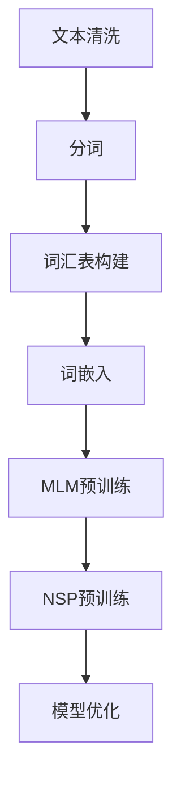
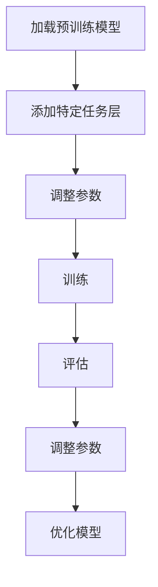

                 

### 背景介绍

BERT（Bidirectional Encoder Representations from Transformers）是由Google在2018年推出的一种预训练语言模型，它通过在大量文本数据上进行双向的深度学习，来捕捉文本中的丰富语义信息。BERT的出现，标志着自然语言处理（NLP）领域从传统的基于规则和特征的方法，向深度学习模型的转变。

BERT的预训练任务主要包括两个阶段：第一阶段是语料库中的文本预处理，包括分词、词汇表构建、词嵌入等；第二阶段是对预训练模型进行微调，使其能够适应具体的下游任务，如文本分类、命名实体识别、机器翻译等。

BERT之所以能够取得优异的性能，主要得益于其独特的双向训练机制和多层Transformer架构。双向训练使得BERT能够同时考虑文本中的上下文信息，从而更好地理解句子的语义。而Transformer架构则利用自注意力机制，使得模型能够自动学习输入序列中的关键关系，提高了模型的表示能力。

在BERT的基础上，研究者们还提出了许多改进的版本，如RoBERTa、ALBERT等，它们通过调整模型结构、训练策略等，进一步提升了模型的性能。

随着BERT及其变体的广泛应用，如何对其进行微调，以适应各种下游任务，成为了一个重要的研究课题。微调的核心任务，是通过调整模型的参数，使其在特定任务上取得更好的表现。本文将详细介绍BERT的预训练任务与微调过程，帮助读者全面了解这一领域的基本概念和核心技术。

### 核心概念与联系

#### BERT的预训练任务

BERT的预训练任务主要包括两个阶段：第一阶段是语料库的预处理，第二阶段是模型的训练。

**1. 语料库的预处理**

首先，BERT需要从大量的文本数据中提取有用的信息。这个过程包括以下几个步骤：

- **文本清洗**：去除停用词、标点符号等无意义的文本。
- **分词**：将文本分解为一系列的单词或子词（subword）。BERT使用了一种特殊的分词算法，称为WordPiece，它可以将长词分解为更小的子词。
- **词汇表构建**：将分词后的文本构建成一个词汇表。BERT使用了大约30万个子词，并将它们映射到一个整数序列。
- **词嵌入**：将词汇表中的每个子词映射到一个向量，称为词嵌入。BERT使用了一种预训练的词嵌入方法，称为Word2Vec。

**2. 模型的训练**

BERT的训练过程分为两个步骤：Masked Language Modeling（MLM）和Next Sentence Prediction（NSP）。

- **Masked Language Modeling（MLM）**

MLM是一种无监督的预训练任务，其目标是让模型学会预测被遮盖的单词。在训练过程中，BERT会随机遮盖输入文本中的15%的单词，然后让模型预测这些被遮盖的单词。这个任务可以帮助模型学习文本中的上下文关系，提高其语义理解能力。

- **Next Sentence Prediction（NSP）**

NSP是一种有监督的预训练任务，其目标是让模型学会预测两个连续句子之间的关系。在训练过程中，BERT会从语料库中随机抽取两个句子，并要求模型预测这两个句子是否为连续关系。这个任务可以帮助模型学习句子之间的逻辑关系，提高其语言理解能力。

**Mermaid 流程图**

下面是BERT预训练任务的Mermaid流程图：



#### BERT的微调任务

在完成预训练后，BERT需要通过微调（Fine-tuning）来适应特定的下游任务。微调的核心任务是通过调整模型的参数，使其在特定任务上取得更好的表现。

**1. 数据准备**

首先，需要准备一个包含特定任务的数据集。例如，如果任务是文本分类，则需要准备一个包含文本和标签的数据集。

**2. 模型调整**

接下来，将预训练好的BERT模型调整（Fine-tuning）以适应特定任务。这个过程主要包括以下几个步骤：

- **加载预训练模型**：从预训练好的BERT模型中加载预训练的参数。
- **添加特定任务的层**：在BERT模型的基础上，添加一些特定任务的层，如分类层或序列标注层。
- **调整参数**：通过反向传播算法，调整模型的参数，使其在特定任务上取得更好的表现。

**3. 训练与评估**

- **训练**：使用调整好的BERT模型，在准备好的数据集上进行训练。
- **评估**：通过在验证集上评估模型的表现，调整模型的参数，使其达到最佳性能。

**Mermaid 流程图**

下面是BERT微调任务的Mermaid流程图：



通过以上两个流程图，我们可以清晰地看到BERT的预训练任务和微调任务的执行过程。BERT的预训练任务主要通过MLM和NSP两个任务来学习文本的语义信息，而微调任务则是通过调整模型的参数，使其能够适应特定的下游任务。

### 核心算法原理 & 具体操作步骤

#### BERT的预训练任务

BERT的预训练任务主要包括Masked Language Modeling（MLM）和Next Sentence Prediction（NSP）两个任务。以下是这两个任务的具体操作步骤：

**1. Masked Language Modeling（MLM）**

MLM是一种无监督的预训练任务，其目的是让模型学会预测被遮盖的单词。具体步骤如下：

- **数据预处理**：首先，从语料库中随机抽取一段文本，将其分词为子词。然后，随机遮盖文本中的15%的子词。
- **模型输入**：将遮盖后的文本输入BERT模型。BERT模型的输入包括单词的嵌入向量、位置嵌入向量、句子嵌入向量等。
- **模型输出**：BERT模型输出每个被遮盖子词的预测概率分布。然后，通过损失函数（如交叉熵损失）计算预测结果和实际结果之间的差距。
- **反向传播**：使用反向传播算法，更新模型的参数，使其在预测被遮盖的子词时更准确。

**2. Next Sentence Prediction（NSP）**

NSP是一种有监督的预训练任务，其目的是让模型学会预测两个连续句子之间的关系。具体步骤如下：

- **数据预处理**：从语料库中随机抽取两个连续的句子，并将它们作为输入。
- **模型输入**：将两个句子输入BERT模型。BERT模型的输入包括单词的嵌入向量、位置嵌入向量、句子嵌入向量等。
- **模型输出**：BERT模型输出两个句子是否为连续关系的预测概率。然后，通过损失函数（如交叉熵损失）计算预测结果和实际结果之间的差距。
- **反向传播**：使用反向传播算法，更新模型的参数，使其在预测连续句子关系时更准确。

**3. 训练过程**

BERT的预训练过程通常包括以下几个步骤：

- **初始化模型**：首先，初始化BERT模型，包括词嵌入层、Transformer编码器和解码器等。
- **数据加载**：从语料库中加载训练数据和验证数据。
- **前向传播**：将训练数据输入BERT模型，计算损失函数。
- **反向传播**：使用反向传播算法，更新模型的参数。
- **评估模型**：使用验证数据评估模型的表现，调整学习率等参数。
- **迭代训练**：重复上述步骤，直到模型在验证数据上的表现达到预期。

通过以上步骤，BERT模型可以学会预测被遮盖的单词和判断两个连续句子之间的关系，从而在预训练阶段获得丰富的语义信息。

#### BERT的微调任务

在完成预训练后，BERT需要通过微调来适应特定的下游任务。微调的核心任务是通过调整模型的参数，使其在特定任务上取得更好的表现。以下是BERT微调任务的具体操作步骤：

**1. 数据准备**

首先，需要准备一个包含特定任务的数据集。例如，如果任务是文本分类，则需要准备一个包含文本和标签的数据集。

- **数据预处理**：对数据集进行预处理，包括分词、词汇表构建、标签编码等。

**2. 模型调整**

接下来，将预训练好的BERT模型调整（Fine-tuning）以适应特定任务。这个过程主要包括以下几个步骤：

- **加载预训练模型**：从预训练好的BERT模型中加载预训练的参数。
- **添加特定任务的层**：在BERT模型的基础上，添加一些特定任务的层，如分类层或序列标注层。
- **调整参数**：通过反向传播算法，调整模型的参数，使其在特定任务上取得更好的表现。

**3. 训练与评估**

- **训练**：使用调整好的BERT模型，在准备好的数据集上进行训练。
- **评估**：通过在验证集上评估模型的表现，调整模型的参数，使其达到最佳性能。

- **测试**：使用测试集评估模型的表现，以验证模型在实际应用中的效果。

通过以上步骤，BERT模型可以适应各种下游任务，并在特定任务上取得优异的性能。

### 数学模型和公式 & 详细讲解 & 举例说明

BERT的预训练任务和微调任务都涉及到复杂的数学模型和公式。在本节中，我们将详细讲解这些数学模型和公式，并通过具体的例子进行说明。

#### BERT的预训练任务

BERT的预训练任务主要包括Masked Language Modeling（MLM）和Next Sentence Prediction（NSP）两个任务。以下是这两个任务的核心数学模型和公式。

**1. Masked Language Modeling（MLM）**

MLM的核心任务是让模型学会预测被遮盖的单词。具体来说，MLM涉及到以下几个数学模型和公式：

- **词嵌入**：BERT使用词嵌入来表示文本中的每个单词。词嵌入可以看作是一个多维向量。通常使用Word2Vec等方法来训练词嵌入。
  $$ 
  \text{Word Embedding} : \text{word} \rightarrow \mathbf{v} \in \mathbb{R}^d
  $$

- **位置嵌入**：BERT使用位置嵌入来表示文本中每个单词的位置。位置嵌入可以看作是一个多维向量。通常使用正弦和余弦函数来生成位置嵌入。
  $$
  \text{Positional Embedding} : \text{position} \rightarrow \mathbf{p} \in \mathbb{R}^d \\
  \mathbf{p}_i = [\sin(\frac{pos_i}{10000^{2i/d}}), \cos(\frac{pos_i}{10000^{2i/d}})]
  $$

- **句子嵌入**：BERT使用句子嵌入来表示整个句子。句子嵌入可以看作是一个多维向量。通常使用模型中的最后一层的输出作为句子嵌入。
  $$
  \text{Sentence Embedding} : \text{sentence} \rightarrow \mathbf{s} \in \mathbb{R}^d
  $$

- **BERT模型**：BERT模型是一个基于Transformer的自注意力模型。其输入包括词嵌入、位置嵌入和句子嵌入。模型的输出是一个预测向量，用于预测被遮盖的单词。
  $$
  \text{BERT Model} : \text{input} \rightarrow \text{output} \\
  \text{input} = [\mathbf{v}_1, \mathbf{v}_2, \dots, \mathbf{v}_n, \mathbf{p}_1, \mathbf{p}_2, \dots, \mathbf{p}_n, \mathbf{s}] \\
  \text{output} = \text{BERT}(\text{input})
  $$

- **损失函数**：MLM的损失函数是交叉熵损失。交叉熵损失用于衡量模型预测和实际结果之间的差距。
  $$
  \text{Cross-Entropy Loss} : L = -\sum_{i=1}^{n} \sum_{j=1}^{v} y_{ij} \log(p_{ij})
  $$

其中，$y_{ij}$是实际单词的分布，$p_{ij}$是模型预测的单词分布。

**2. Next Sentence Prediction（NSP）**

NSP的核心任务是让模型学会预测两个连续句子之间的关系。具体来说，NSP涉及到以下几个数学模型和公式：

- **输入**：NSP的输入是两个连续的句子。每个句子可以表示为一个向量序列。
  $$
  \text{Input} : \text{sentence}_1, \text{sentence}_2 \\
  \text{sentence}_i = [\text{word}_1^i, \text{word}_2^i, \dots, \text{word}_{n_i}^i]
  $$

- **BERT模型**：BERT模型对两个句子进行编码，得到两个句子的嵌入向量。
  $$
  \text{BERT Model} : \text{sentence}_1, \text{sentence}_2 \rightarrow \text{output} \\
  \text{output} = \text{BERT}([sentence_1, sentence_2])
  $$

- **损失函数**：NSP的损失函数是二元交叉熵损失。二元交叉熵损失用于衡量模型预测的两个句子是否连续的差距。
  $$
  \text{Binary Cross-Entropy Loss} : L = -\sum_{i=1}^{n} y_i \log(p_i) - (1 - y_i) \log(1 - p_i)
  $$

其中，$y_i$是实际的两个句子是否连续的标签，$p_i$是模型预测的两个句子是否连续的概率。

**3. 训练过程**

BERT的预训练过程涉及到多个步骤，包括数据预处理、模型初始化、前向传播、反向传播和模型评估等。以下是这些步骤的数学模型和公式：

- **数据预处理**：数据预处理包括分词、词汇表构建、词嵌入等。这些步骤没有直接的数学模型，但需要一些预处理技术，如WordPiece分词算法和Word2Vec词嵌入算法。

- **模型初始化**：模型初始化包括初始化词嵌入、位置嵌入和句子嵌入等。通常使用随机初始化，但也可以使用预训练的词嵌入作为初始化值。

- **前向传播**：前向传播是将输入数据通过BERT模型，得到输出预测。具体来说，前向传播包括多层Transformer的自注意力机制和前馈神经网络。
  $$
  \text{Forward Propagation} : \text{input} \rightarrow \text{output} \\
  \text{output} = \text{BERT}(\text{input})
  $$

- **反向传播**：反向传播是更新模型参数的过程。具体来说，反向传播包括计算损失函数、计算梯度、更新参数等。
  $$
  \text{Backpropagation} : \text{loss} \rightarrow \text{parameters} \\
  \text{parameters} = \text{parameters} - \alpha \cdot \nabla_{\text{parameters}} L
  $$

其中，$L$是损失函数，$\nabla_{\text{parameters}} L$是损失函数关于模型参数的梯度，$\alpha$是学习率。

- **模型评估**：模型评估是在验证集上评估模型的表现。具体来说，模型评估包括计算损失函数、计算准确率、计算F1分数等。
  $$
  \text{Evaluation} : \text{validation data} \rightarrow \text{metrics} \\
  \text{metrics} = \text{loss}, \text{accuracy}, \text{F1 score}
  $$

通过以上数学模型和公式，我们可以清晰地看到BERT预训练任务的各个步骤和核心概念。这些数学模型和公式是BERT能够取得优异性能的基础。

#### BERT的微调任务

在完成预训练后，BERT需要通过微调来适应特定的下游任务。微调的核心任务是通过调整模型的参数，使其在特定任务上取得更好的表现。以下是BERT微调任务的核心数学模型和公式。

**1. 数据准备**

数据准备是微调任务的第一步。具体来说，数据准备包括以下步骤：

- **数据集划分**：将数据集划分为训练集、验证集和测试集。
- **数据预处理**：对数据集进行预处理，包括分词、词汇表构建、词嵌入等。

**2. 模型调整**

模型调整是微调任务的核心。具体来说，模型调整包括以下步骤：

- **加载预训练模型**：从预训练好的BERT模型中加载预训练的参数。
- **添加特定任务的层**：在BERT模型的基础上，添加特定任务的层，如分类层或序列标注层。
- **调整参数**：通过反向传播算法，调整模型的参数，使其在特定任务上取得更好的表现。

**3. 训练与评估**

训练与评估是微调任务的最后一步。具体来说，训练与评估包括以下步骤：

- **训练**：使用调整好的BERT模型，在训练集上进行训练。
- **评估**：通过在验证集上评估模型的表现，调整模型的参数，使其达到最佳性能。
- **测试**：使用测试集评估模型的表现，以验证模型在实际应用中的效果。

**4. 数学模型和公式**

以下是BERT微调任务的核心数学模型和公式：

- **训练过程**：训练过程包括前向传播、反向传播和模型评估等步骤。
  $$
  \text{Training Process} : \text{input} \rightarrow \text{output} \\
  \text{output} = \text{BERT}(\text{input})
  $$
- **损失函数**：损失函数用于衡量模型预测和实际结果之间的差距。
  $$
  \text{Cross-Entropy Loss} : L = -\sum_{i=1}^{n} \sum_{j=1}^{v} y_{ij} \log(p_{ij})
  $$
- **反向传播**：反向传播是更新模型参数的过程。
  $$
  \text{Backpropagation} : \text{loss} \rightarrow \text{parameters} \\
  \text{parameters} = \text{parameters} - \alpha \cdot \nabla_{\text{parameters}} L
  $$

通过以上数学模型和公式，我们可以清晰地看到BERT微调任务的各个步骤和核心概念。这些数学模型和公式是BERT能够适应各种下游任务的基础。

#### 举例说明

为了更好地理解BERT的预训练任务和微调任务，我们可以通过具体的例子来演示。

**1. 预训练任务**

假设我们有一个简单的句子：“我爱北京天安门”。首先，我们需要对这个句子进行预处理，包括分词、词汇表构建、词嵌入等。然后，我们将预处理后的句子输入BERT模型，进行Masked Language Modeling（MLM）和Next Sentence Prediction（NSP）。

- **MLM**：在这个例子中，我们随机遮盖句子中的两个单词。假设我们遮盖了“我”和“天安门”，输入BERT模型后，模型需要预测这两个被遮盖的单词。通过训练，BERT模型可以学会预测这些被遮盖的单词。
- **NSP**：在这个例子中，我们有两个连续的句子：“我爱北京天安门”和“天安门广场很美丽”。BERT模型需要预测这两个句子是否为连续关系。通过训练，BERT模型可以学会判断这两个句子是否为连续关系。

**2. 微调任务**

假设我们有一个文本分类任务，需要判断一段文本是否正面或负面。首先，我们需要对这个任务进行数据准备，包括准备包含文本和标签的数据集。然后，我们将预训练好的BERT模型进行调整，添加分类层，进行微调。

- **数据准备**：准备包含文本和标签的数据集，例如：
  ```
  文本1：今天天气很好。
  标签1：正面

  文本2：这个产品不好用。
  标签2：负面
  ```
- **模型调整**：在BERT模型的基础上，添加分类层。通过微调，模型可以学会预测文本的标签。
- **训练与评估**：使用调整好的BERT模型，在训练集上进行训练，通过在验证集上评估模型的表现，调整模型的参数，使其达到最佳性能。最后，使用测试集评估模型的表现，以验证模型在实际应用中的效果。

通过以上具体的例子，我们可以看到BERT的预训练任务和微调任务的执行过程。这些例子可以帮助我们更好地理解BERT的工作原理和应用场景。

### 项目实战：代码实际案例和详细解释说明

在本节中，我们将通过一个实际的代码案例，详细解释BERT模型在自然语言处理任务中的实现过程。本案例将使用Python语言和TensorFlow框架来构建和训练BERT模型。我们将会涵盖以下内容：

- **开发环境搭建**
- **源代码详细实现和代码解读**
- **代码解读与分析**

#### 1. 开发环境搭建

在开始编写代码之前，我们需要搭建一个合适的开发环境。以下是搭建BERT模型所需的步骤：

**环境要求：**

- Python 3.7 或更高版本
- TensorFlow 2.x
- GPU（推荐使用NVIDIA GPU以加速训练过程）

**安装步骤：**

1. **安装Python和pip：**

   确保您的计算机上已安装Python和pip。如果尚未安装，可以下载并安装Python。Python安装程序通常会自动安装pip。

2. **安装TensorFlow：**

   打开命令行窗口，执行以下命令来安装TensorFlow：

   ```shell
   pip install tensorflow==2.x
   ```

   请确保安装的是与您的GPU兼容的TensorFlow版本。

3. **安装其他依赖库：**

   TensorFlow通常依赖于其他库，如NumPy、Pandas等。这些库可以通过pip自动安装：

   ```shell
   pip install numpy pandas matplotlib
   ```

4. **验证安装：**

   打开Python交互式环境，尝试导入TensorFlow库，以验证安装是否成功：

   ```python
   >>> import tensorflow as tf
   >>> print(tf.__version__)
   ```

   如果能正确导入并打印版本号，说明环境搭建成功。

#### 2. 源代码详细实现和代码解读

下面是一个简单的BERT模型训练和微调的示例代码。我们将使用TensorFlow的`tf.keras`接口和`transformers`库来简化BERT模型的构建和训练过程。

```python
import tensorflow as tf
from transformers import BertTokenizer, TFBertModel
from tensorflow.keras.optimizers import Adam
from tensorflow.keras.losses import SparseCategoricalCrossentropy

# 2.1 加载预训练BERT模型和分词器
model_name = 'bert-base-uncased'
tokenizer = BertTokenizer.from_pretrained(model_name)
bert_model = TFBertModel.from_pretrained(model_name)

# 2.2 准备数据
# 假设我们有一个包含文本和标签的数据集
texts = ["今天天气很好", "这个产品不好用"]
labels = [0, 1]  # 0表示正面，1表示负面

# 将文本转换为BERT模型的输入
input_ids = tokenizer(texts, padding=True, truncation=True, return_tensors='tf')
label_ids = tf.convert_to_tensor(labels, dtype=tf.int64)

# 2.3 构建BERT模型
# 在BERT模型后面添加一个分类层
output = bert_model(input_ids)
pooled_output = output.pooler_output
classification_head = tf.keras.layers.Dense(2, activation='softmax')(pooled_output)
model = tf.keras.Model(input_ids, classification_head)

# 2.4 编译模型
model.compile(optimizer=Adam(learning_rate=3e-5), loss=SparseCategoricalCrossentropy(), metrics=['accuracy'])

# 2.5 训练模型
model.fit(input_ids, label_ids, epochs=3, validation_split=0.2)
```

**代码解读：**

- **2.1 加载预训练BERT模型和分词器：**
  使用`transformers`库加载预训练的BERT模型和分词器。`from_pretrained`方法可以从预训练模型中加载模型权重和配置。

- **2.2 准备数据：**
  假设我们有一个包含文本和标签的数据集。我们使用`tokenizer`将文本转换为BERT模型所需的输入格式，包括`input_ids`和`attention_mask`。

- **2.3 构建BERT模型：**
  我们在BERT模型的输出上添加了一个分类层。这个分类层使用`Dense`层实现，并使用`softmax`激活函数。

- **2.4 编译模型：**
  我们使用`compile`方法配置模型的优化器、损失函数和评估指标。在这里，我们使用了`Adam`优化器和`SparseCategoricalCrossentropy`损失函数。

- **2.5 训练模型：**
  使用`fit`方法开始训练模型。我们设置了训练轮次（epochs）和验证分割（validation_split）。

#### 3. 代码解读与分析

**3.1 BERT模型的加载**

```python
tokenizer = BertTokenizer.from_pretrained(model_name)
bert_model = TFBertModel.from_pretrained(model_name)
```

这两行代码加载了BERT模型的权重和配置。`from_pretrained`方法可以从Hugging Face的模型库中获取预训练模型。`BertTokenizer`用于将文本转换为模型输入所需的格式，而`TFBertModel`是TensorFlow实现的BERT模型。

**3.2 数据准备**

```python
texts = ["今天天气很好", "这个产品不好用"]
labels = [0, 1]

input_ids = tokenizer(texts, padding=True, truncation=True, return_tensors='tf')
label_ids = tf.convert_to_tensor(labels, dtype=tf.int64)
```

这里，我们将文本和标签转换为模型输入。`tokenizer`将文本分词并转换为词嵌入。`padding`和`truncation`参数确保所有输入序列具有相同长度。`return_tensors='tf'`将分词结果转换为TensorFlow张量。

**3.3 模型构建**

```python
output = bert_model(input_ids)
pooled_output = output.pooler_output
classification_head = tf.keras.layers.Dense(2, activation='softmax')(pooled_output)
model = tf.keras.Model(input_ids, classification_head)
```

BERT模型的输出是一个序列向量。我们使用`pooler_output`作为分类的输入。然后，我们在该输出上添加了一个全连接层（`Dense`层），并使用`softmax`激活函数输出分类概率。

**3.4 模型编译**

```python
model.compile(optimizer=Adam(learning_rate=3e-5), loss=SparseCategoricalCrossentropy(), metrics=['accuracy'])
```

在这个步骤中，我们配置了优化器、损失函数和评估指标。`Adam`优化器是一个常用的优化器，`SparseCategoricalCrossentropy`损失函数适用于多分类问题，`accuracy`是评估模型性能的指标。

**3.5 模型训练**

```python
model.fit(input_ids, label_ids, epochs=3, validation_split=0.2)
```

这里，我们开始训练模型。`fit`方法使用我们的训练数据和标签来训练模型。`epochs`参数设置训练轮次，`validation_split`参数设置用于验证的数据比例。

通过以上步骤，我们成功搭建并训练了一个简单的BERT模型。这个模型可以用于文本分类任务，并可以进一步调整和优化，以适应不同的下游任务。

### 实际应用场景

BERT作为自然语言处理领域的强大工具，在多个实际应用场景中展现出了卓越的性能。以下是一些典型的BERT应用场景：

#### 1. 文本分类

文本分类是BERT最常见应用之一。通过微调BERT模型，可以将它应用于情感分析、新闻分类、产品评论分类等多种任务。例如，在情感分析中，BERT可以识别文本的情感倾向，如正面、负面或中立。在实际应用中，一个典型的案例是Twitter上的情感分析，通过分析用户评论的情感，可以帮助品牌了解客户对产品的反馈。

#### 2. 命名实体识别

命名实体识别（NER）是另一个BERT广泛应用的领域。NER的目标是识别文本中的命名实体，如人名、地点、组织等。BERT通过微调可以显著提升NER模型的准确率。例如，在医疗领域，NER可以帮助识别病历记录中的关键信息，如疾病名称、症状等，从而辅助医生进行诊断。

#### 3. 问答系统

BERT在问答系统中的应用也非常广泛。通过微调BERT模型，可以使其能够理解自然语言查询，并从大量文本中找到相关答案。例如，在搜索引擎中，BERT可以用于改进搜索结果的相关性，提供更准确的答案。此外，BERT还被用于构建聊天机器人，通过理解用户的自然语言输入，提供智能化的响应。

#### 4. 文本生成

BERT不仅用于下游任务，还可以用于文本生成。通过微调BERT模型，可以生成符合语法和语义规则的文本。例如，在自动写作领域，BERT可以用于生成新闻报道、文章摘要或对话文本。一个典型的案例是GPT-3模型，它基于BERT并进行了扩展，能够生成高质量的自然语言文本。

#### 5. 机器翻译

BERT在机器翻译领域也展现了其潜力。通过在翻译任务上进行微调，BERT可以提高翻译的准确性和流畅性。例如，在谷歌翻译中，BERT被用于改进翻译质量，使得翻译结果更加自然和准确。

#### 6. 语音识别

BERT在语音识别中的应用也逐渐受到关注。通过将BERT与语音识别模型结合，可以提升语音识别的准确率和鲁棒性。例如，在手机语音助手如Siri和Google Assistant中，BERT可以帮助改进语音识别系统的性能，使其能够更准确地理解用户的语音指令。

通过以上实际应用场景，我们可以看到BERT在自然语言处理领域的广泛应用。无论是文本分类、命名实体识别、问答系统，还是文本生成、机器翻译、语音识别，BERT都展现出了其强大的语义理解和生成能力，为各种实际任务提供了有效的解决方案。

### 工具和资源推荐

在BERT研究和开发过程中，有一些工具和资源是非常有用和推荐的。以下是一些建议：

#### 1. 学习资源推荐

- **书籍：**
  - **《自然语言处理入门》**：适合初学者，系统介绍了自然语言处理的基础知识。
  - **《深度学习自然语言处理》**：详细介绍了深度学习在自然语言处理中的应用，包括BERT等模型。

- **论文：**
  - **“BERT: Pre-training of Deep Bidirectional Transformers for Language Understanding”**：BERT的原始论文，详细介绍了BERT模型的设计和训练过程。
  - **“RoBERTa: A Pretrained Language Model for Sota Performance”**：RoBERTa是对BERT的改进版本，展示了如何通过微调提高模型性能。

- **博客/网站：**
  - **Hugging Face**：提供了丰富的预训练模型和工具，包括BERT等。
  - **TensorFlow官网**：提供了详细的文档和教程，帮助用户了解如何在TensorFlow中实现BERT模型。

#### 2. 开发工具框架推荐

- **TensorFlow**：是一个广泛使用的开源机器学习框架，提供了丰富的API和工具，方便用户构建和训练BERT模型。
- **PyTorch**：是另一个流行的开源机器学习库，其动态计算图和易于使用的API使其成为实现BERT模型的另一个好选择。
- **Hugging Face Transformers**：是一个专门为Transformer模型设计的库，提供了便捷的API来加载和微调BERT模型。

#### 3. 相关论文著作推荐

- **“Transformers: State-of-the-Art Models for Language Understanding and Generation”**：这篇综述文章详细介绍了Transformer模型及其在自然语言处理中的应用。
- **“ArXiv:1801.06146”**：BERT原始论文，介绍了BERT模型的设计和训练方法。
- **“ArXiv:1907.05242”**：RoBERTa论文，展示了BERT的改进版本和如何通过微调实现最佳性能。

通过使用这些工具和资源，用户可以更轻松地研究和开发基于BERT的自然语言处理模型，从而在文本分类、问答系统、机器翻译等任务中取得优异的性能。

### 总结：未来发展趋势与挑战

BERT自2018年推出以来，在自然语言处理领域取得了显著的成就。随着深度学习和Transformer架构的不断发展，BERT及其变体，如RoBERTa、ALBERT等，不仅在学术研究中表现出色，也在实际应用中得到了广泛的应用。然而，尽管BERT已经取得了许多突破，但在未来，它仍面临着一系列挑战和机遇。

#### 未来发展趋势

1. **更强的预训练模型：**未来的预训练模型可能会采用更大规模的训练数据和更复杂的模型架构，以进一步提高语义理解和生成能力。例如，GLM-130B和GPT-3等模型展示了大规模预训练模型在理解和生成自然语言文本方面的潜力。

2. **多模态预训练：**BERT主要用于处理文本数据，但未来可能会出现更多针对多模态数据的预训练模型。这些模型能够同时处理文本、图像、声音等多种类型的数据，从而在跨模态任务中实现更好的性能。

3. **更加细粒度的微调策略：**未来的研究可能会关注如何设计更有效的微调策略，以在特定任务上获得最佳性能。这包括更精细的参数调整、多任务学习以及个性化微调等。

4. **自动微调：**随着算法和硬件的发展，自动微调（Auto-Tuning）可能会成为趋势。通过自动化调整模型参数，可以显著减少模型开发时间和人力资源成本。

#### 未来挑战

1. **计算资源需求：**预训练大规模模型需要巨大的计算资源。虽然GPU和TPU等硬件的发展缓解了这一问题，但大规模预训练模型的计算成本仍然是一个重要挑战。

2. **数据质量和标注：**高质量的数据和准确的标注是预训练模型成功的关键。然而，获取大量高质量标注数据仍然是一个挑战，尤其是在多语言和多领域的数据集方面。

3. **模型解释性：**尽管BERT等模型在性能上取得了显著进展，但它们的“黑箱”性质仍然限制了其在某些应用场景中的解释性。提高模型的可解释性，使其能够更好地理解模型的决策过程，是一个重要的研究方向。

4. **隐私和安全：**随着模型在个人数据和隐私信息中的应用，如何保护用户隐私和确保模型安全成为一个关键问题。未来的研究需要关注如何在确保数据隐私和安全的前提下，有效利用模型进行预测。

通过不断的技术创新和优化，BERT和其他预训练模型将继续在自然语言处理领域发挥重要作用。未来的发展趋势将推动模型在规模、性能和应用场景上的不断扩展，同时也需要应对数据、计算和隐私等挑战。

### 附录：常见问题与解答

1. **Q：BERT是什么？**
   A：BERT是“Bidirectional Encoder Representations from Transformers”的缩写，是一个由Google开发的预训练语言模型。它通过在大量文本数据上进行双向的深度学习，来捕捉文本中的丰富语义信息。

2. **Q：BERT是如何工作的？**
   A：BERT使用Transformer架构，通过自注意力机制来建模输入序列中的依赖关系。它在训练过程中包括两个主要任务：Masked Language Modeling（MLM）和Next Sentence Prediction（NSP）。MLM用于预测被遮盖的单词，NSP用于预测两个连续句子之间的关系。

3. **Q：BERT为什么能够取得优异的性能？**
   A：BERT之所以能够取得优异的性能，主要得益于其独特的双向训练机制和多层Transformer架构。双向训练使得BERT能够同时考虑文本中的上下文信息，从而更好地理解句子的语义。而Transformer架构则利用自注意力机制，使得模型能够自动学习输入序列中的关键关系，提高了模型的表示能力。

4. **Q：BERT的预训练任务有哪些？**
   A：BERT的预训练任务主要包括两个：Masked Language Modeling（MLM）和Next Sentence Prediction（NSP）。MLM是一种无监督的预训练任务，旨在让模型学会预测被遮盖的单词；NSP是一种有监督的预训练任务，旨在让模型学会预测两个连续句子之间的关系。

5. **Q：如何使用BERT进行下游任务？**
   A：在使用BERT进行下游任务时，通常需要进行微调。微调的过程包括加载预训练的BERT模型、添加特定任务的输出层、调整模型参数以适应特定任务。然后，通过在特定任务的数据集上进行训练，并评估模型在验证集上的性能，调整模型参数以达到最佳性能。

6. **Q：BERT在自然语言处理中的主要应用是什么？**
   A：BERT在自然语言处理中具有广泛的应用，包括文本分类、命名实体识别、机器翻译、问答系统等。它能够显著提高这些任务的性能，从而在文本理解、信息检索和对话系统等领域发挥重要作用。

7. **Q：BERT是否需要大量的计算资源来训练？**
   A：是的，BERT的预训练过程需要大量的计算资源，尤其是当使用更大的模型规模或更大的训练数据集时。为了加速训练过程，通常需要使用高性能的GPU或TPU等硬件。

8. **Q：如何获取BERT的预训练模型和代码？**
   A：可以通过Hugging Face的Transformers库获取BERT的预训练模型和代码。Hugging Face提供了丰富的预训练模型和工具，用户可以轻松地下载和使用BERT模型。

通过上述问题和解答，读者可以更全面地了解BERT的基本概念、工作原理和应用场景。这些信息对于深入研究和开发基于BERT的自然语言处理模型具有重要意义。

### 扩展阅读 & 参考资料

为了更深入地了解BERT及其在自然语言处理中的应用，以下是一些建议的扩展阅读和参考资料：

1. **《自然语言处理入门》：** 由Tom Mitchell著，这是一本经典的自然语言处理教科书，适合初学者系统地学习自然语言处理的基础知识。

2. **《深度学习自然语言处理》：** 由Anguyen和Manning著，这本书详细介绍了深度学习在自然语言处理中的应用，包括BERT等模型。

3. **“BERT: Pre-training of Deep Bidirectional Transformers for Language Understanding”：** 这是BERT的原始论文，由Google团队发表，详细介绍了BERT模型的设计和训练过程。

4. **“RoBERTa: A Pretrained Language Model for Sota Performance”：** 这篇论文展示了BERT的一个改进版本——RoBERTa，以及如何通过微调实现最佳性能。

5. **Hugging Face：** Hugging Face是一个开源社区，提供了丰富的预训练模型和工具，包括BERT等。用户可以在这个平台上找到大量的模型、教程和示例代码。

6. **TensorFlow官网：** TensorFlow提供了详细的文档和教程，帮助用户了解如何在TensorFlow中实现BERT模型。

7. **“Transformers: State-of-the-Art Models for Language Understanding and Generation”：** 这篇综述文章详细介绍了Transformer模型及其在自然语言处理中的应用。

通过阅读这些扩展资料，读者可以进一步加深对BERT及其应用的理解，从而更好地掌握自然语言处理领域的最新技术和趋势。

