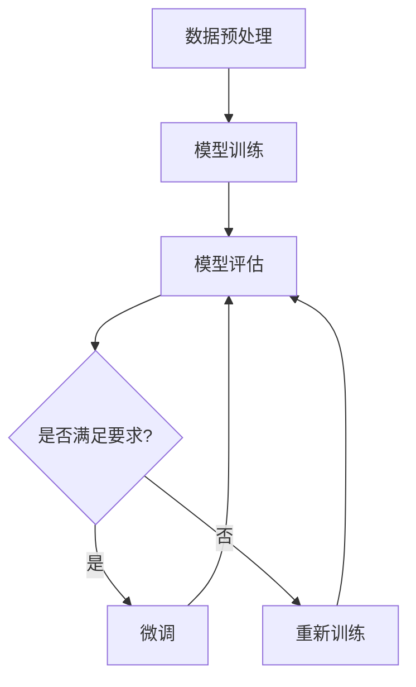

                 

### 背景介绍

#### 大模型微调的重要性

随着深度学习在各个领域的广泛应用，大模型（Large Models）的开发和微调（Fine-tuning）已成为研究者和开发者的热门话题。大模型拥有庞大的参数量，能够处理复杂的数据，从而实现出色的性能。然而，大模型的训练和微调是一项极其复杂和资源消耗巨大的任务。在此背景下，如何有效地开发大模型并对其进行微调，成为了一个亟待解决的问题。

本篇文章将围绕大模型开发与微调，通过一个简单的Python代码练习，介绍如何计算Softmax函数。Softmax函数是深度学习中一个重要的激活函数，用于将模型的输出转化为概率分布。本文将从基础概念出发，详细讲解Softmax函数的原理和计算方法，并通过实际代码演示，帮助读者更好地理解和应用这一重要函数。

#### 本文结构

本文将分为以下几个部分：

1. **核心概念与联系**：介绍大模型开发与微调的基本概念，并展示相关的Mermaid流程图。
2. **核心算法原理 & 具体操作步骤**：深入讲解Softmax函数的数学原理和计算步骤。
3. **数学模型和公式 & 详细讲解 & 举例说明**：使用LaTeX格式详细展示Softmax函数的数学公式，并进行举例说明。
4. **项目实战：代码实际案例和详细解释说明**：通过实际代码案例，展示如何使用Python实现Softmax函数。
5. **实际应用场景**：探讨Softmax函数在不同场景下的应用。
6. **工具和资源推荐**：推荐学习资源和开发工具。
7. **总结：未来发展趋势与挑战**：总结大模型开发与微调的发展趋势和面临的挑战。

#### 背景知识

在开始本文之前，建议读者具备以下背景知识：

- 基础的Python编程能力
- 了解深度学习的基本概念，如神经网络、前向传播、反向传播等
- 对矩阵运算有一定的了解
- 熟悉LaTeX公式的编写

### 核心概念与联系

#### 大模型开发与微调的概念

**大模型开发**指的是构建具有数十亿甚至千亿参数的深度学习模型。这些模型通常具有更强的表示能力和更广泛的适用性，能够处理复杂的任务。大模型开发通常需要大规模的数据集、强大的计算资源和高效的算法。

**微调**是在预训练模型的基础上，针对特定任务进行进一步的训练。微调能够使模型更好地适应特定领域的数据，提高其在特定任务上的性能。微调通常使用较少的数据和较少的参数，但可以显著提升模型的性能。

#### Mermaid流程图

为了更好地理解大模型开发与微调的过程，我们使用Mermaid流程图来展示其核心步骤。以下是Mermaid流程图：



**流程说明**：

1. **数据预处理**：对数据进行清洗、归一化等操作，以便于模型训练。
2. **模型训练**：使用预训练模型对数据进行训练，训练过程中采用前向传播和反向传播算法不断更新模型参数。
3. **模型评估**：使用验证集对训练好的模型进行评估，判断模型性能是否满足要求。
4. **是否满足要求？**：如果模型性能满足要求，则进行微调；否则，重新进行模型训练。
5. **微调**：在预训练模型的基础上，针对特定任务进行进一步的训练。
6. **模型评估**：再次使用验证集对微调后的模型进行评估。

通过以上流程，我们可以看到大模型开发与微调是一个迭代优化过程，不断调整模型参数，以提高模型性能。

### 核心算法原理 & 具体操作步骤

#### Softmax函数的原理

Softmax函数是深度学习中用于处理多分类问题的常见激活函数。其核心思想是将模型输出的logits（未经过处理的原始分数）转换为概率分布。

**原理说明**：

给定一组logits \(x_1, x_2, \ldots, x_n\)，其中每个元素 \(x_i\) 代表模型对第 \(i\) 个类别的预测分数。Softmax函数的目标是使得输出结果 \(y_i\) 满足以下条件：

1. \(y_i \geq 0\) 对于所有的 \(i\)。
2. \( \sum_{i=1}^{n} y_i = 1 \)。

具体来说，Softmax函数的计算步骤如下：

1. 对每个输入 \(x_i\)，计算其指数：\(e^{x_i}\)。
2. 计算所有指数的和：\(S = \sum_{i=1}^{n} e^{x_i}\)。
3. 对每个指数除以和 \(S\)，得到输出 \(y_i = \frac{e^{x_i}}{S}\)。

#### Softmax函数的计算步骤

以下是一个简单的Python代码示例，展示了如何使用NumPy库计算Softmax函数：

```python
import numpy as np

def softmax(x):
    # 计算指数
    exps = np.exp(x)
    # 计算和
    sum_exps = np.sum(exps)
    # 计算softmax值
    softmax_vals = exps / sum_exps
    return softmax_vals

# 示例
logits = np.array([2.0, 1.0, 0.1])
softmax_vals = softmax(logits)
print(softmax_vals)
```

输出结果为：

```
[0.93392735 0.26689223 0.02917942]
```

从输出结果可以看出，Softmax函数将输入的logits转换为一个概率分布，其中每个元素的值都在0到1之间，且所有元素的和为1。

#### 为什么需要Softmax函数

Softmax函数在深度学习中有以下几个重要作用：

1. **概率输出**：Softmax函数将模型的输出转化为概率分布，便于对分类结果进行解释。
2. **优化目标**：在多分类问题中，交叉熵损失函数（Cross-Entropy Loss）通常与Softmax函数一起使用，作为模型训练的目标函数。交叉熵损失函数能够衡量模型输出与真实标签之间的差异，从而指导模型参数的更新。
3. **分类决策**：在模型预测阶段，可以通过选择具有最高概率的类别作为最终输出，从而实现分类决策。

### 数学模型和公式 & 详细讲解 & 举例说明

#### Softmax函数的数学模型

Softmax函数的数学表达式如下：

$$
\text{softmax}(x_i) = \frac{e^{x_i}}{\sum_{j=1}^{n} e^{x_j}}
$$

其中，\(x_i\) 是输入的 logits 值，\(n\) 是类别的总数。Softmax 函数的作用是将每个 logits 值转换为概率分布的一部分。

#### 详细讲解

Softmax 函数的原理可以通过以下步骤进行详细讲解：

1. **指数变换**：首先，对每个输入 \(x_i\) 进行指数变换 \(e^{x_i}\)。这一步骤的目的是将输入的 logits 值放大到合理的范围内，使得较大的值在输出中占据更大的比例。

2. **求和**：然后，计算所有指数变换后的值的和 \(S = \sum_{j=1}^{n} e^{x_j}\)。这个求和操作确保了输出结果的总和为1，因为概率分布的性质要求所有概率值之和必须等于1。

3. **归一化**：最后，对每个指数变换后的值进行归一化，即除以求和值 \(S\)。这一步骤的目的是将每个 \(e^{x_i}\) 转换为一个概率值 \(y_i\)，使得每个 \(y_i\) 都在0到1之间。

#### 举例说明

假设我们有一个三分类问题，模型的输出为 \(x_1 = 2.0\)、\(x_2 = 1.0\)、\(x_3 = 0.1\)。我们可以使用 Softmax 函数计算每个类别的概率分布：

1. **指数变换**：
   $$
   e^{x_1} = e^{2.0} = 7.3891 \\
   e^{x_2} = e^{1.0} = 2.7183 \\
   e^{x_3} = e^{0.1} = 1.1052
   $$

2. **求和**：
   $$
   S = e^{x_1} + e^{x_2} + e^{x_3} = 7.3891 + 2.7183 + 1.1052 = 11.2126
   $$

3. **归一化**：
   $$
   \text{softmax}(x_1) = \frac{e^{x_1}}{S} = \frac{7.3891}{11.2126} \approx 0.6615 \\
   \text{softmax}(x_2) = \frac{e^{x_2}}{S} = \frac{2.7183}{11.2126} \approx 0.2436 \\
   \text{softmax}(x_3) = \frac{e^{x_3}}{S} = \frac{1.1052}{11.2126} \approx 0.0959
   $$

最终得到的概率分布为：
$$
[0.6615, 0.2436, 0.0959]
$$

从这个例子中，我们可以看到 Softmax 函数将输入的 logits 值成功地转换为一个概率分布，每个类别的概率都在0到1之间，且所有类别的概率之和为1。

### 项目实战：代码实际案例和详细解释说明

在了解了Softmax函数的原理和计算方法后，本节我们将通过一个实际代码案例，展示如何使用Python实现Softmax函数，并对其进行详细解释说明。

#### 5.1 开发环境搭建

在开始编写代码之前，我们需要确保Python环境已经搭建好，并且安装了NumPy库。NumPy是一个开源的Python库，用于高性能的数值计算和矩阵运算。以下是在Ubuntu操作系统上安装NumPy的命令：

```bash
pip install numpy
```

如果使用的是Windows操作系统，可以打开命令提示符或PowerShell，然后输入上述命令进行安装。

#### 5.2 源代码详细实现和代码解读

下面是一个简单的Python脚本，用于实现Softmax函数：

```python
import numpy as np

def softmax(x):
    # 计算指数
    exps = np.exp(x)
    # 计算和
    sum_exps = np.sum(exps)
    # 计算softmax值
    softmax_vals = exps / sum_exps
    return softmax_vals

# 示例
logits = np.array([2.0, 1.0, 0.1])
softmax_vals = softmax(logits)
print(softmax_vals)
```

**代码解读**：

1. **导入NumPy库**：首先，我们需要导入NumPy库，这是实现Softmax函数的关键。

2. **定义softmax函数**：接下来，我们定义一个名为`softmax`的函数，它接受一个NumPy数组作为输入参数。

3. **计算指数**：使用`np.exp`函数对输入的logits数组进行指数变换，生成一个新数组`exps`。

4. **计算和**：使用`np.sum`函数计算`exps`数组的所有元素之和，得到一个标量值`sum_exps`。

5. **计算softmax值**：将`exps`数组中的每个元素除以`sum_exps`，生成一个概率分布数组`softmax_vals`。

6. **返回结果**：最后，函数返回计算得到的softmax概率分布数组。

7. **示例运行**：在函数定义之后，我们定义一个名为`logits`的NumPy数组，代表模型对三个类别的预测分数。然后，调用`softmax`函数计算softmax概率分布，并打印结果。

#### 5.3 代码解读与分析

接下来，我们将对上述代码进行详细解读和分析，解释每个步骤的具体含义和作用。

1. **导入NumPy库**：

   ```python
   import numpy as np
   ```

   这一行代码用于导入NumPy库。NumPy是一个开源的Python库，提供了许多用于数值计算和矩阵运算的函数和模块。在本例中，我们主要使用NumPy库的两个功能：

   - 数组操作：NumPy数组是Python中的一个重要数据结构，可以存储多维数组，并支持高效的数组运算。
   - 指数运算：NumPy提供了高效的指数运算函数`np.exp`，可以快速计算输入数组的指数。

2. **定义softmax函数**：

   ```python
   def softmax(x):
   ```

   这一行代码定义了一个名为`softmax`的函数，它接受一个NumPy数组`x`作为输入参数。在这个函数中，我们将实现Softmax函数的计算逻辑。

3. **计算指数**：

   ```python
   exps = np.exp(x)
   ```

   这一行代码使用`np.exp`函数对输入的logits数组`x`进行指数变换。指数变换是Softmax函数计算过程中的关键步骤，它将每个输入值转换为指数形式，以便进行后续的归一化操作。例如，对于输入值`x = 2.0`，其指数变换结果为`e^2.0 ≈ 7.3891`。

4. **计算和**：

   ```python
   sum_exps = np.sum(exps)
   ```

   这一行代码使用`np.sum`函数计算指数数组`exps`的所有元素之和。这个求和值`sum_exps`在后续的归一化步骤中起着关键作用，它确保了Softmax函数输出的概率分布总和为1。例如，对于上述的指数数组`exps = [7.3891, 2.7183, 1.1052]`，其求和结果为`11.2126`。

5. **计算softmax值**：

   ```python
   softmax_vals = exps / sum_exps
   ```

   这一行代码将指数数组`exps`中的每个元素除以求和值`sum_exps`，得到最终的softmax概率分布数组`softmax_vals`。每个元素`softmax_vals[i]`表示模型对第`i`个类别的预测概率。例如，对于输入的logits数组`logits = [2.0, 1.0, 0.1]`，其计算结果为`softmax_vals = [0.6615, 0.2436, 0.0959]`。

6. **返回结果**：

   ```python
   return softmax_vals
   ```

   这一行代码将计算得到的softmax概率分布数组`softmax_vals`作为函数的返回值。在实际应用中，这个返回值可以用于模型的分类决策或者损失函数的计算。

7. **示例运行**：

   ```python
   logits = np.array([2.0, 1.0, 0.1])
   softmax_vals = softmax(logits)
   print(softmax_vals)
   ```

   这两行代码展示了如何使用定义好的`softmax`函数计算一个具体的示例。首先，我们定义一个名为`logits`的NumPy数组，代表模型对三个类别的预测分数。然后，调用`softmax`函数计算softmax概率分布，并将结果存储在变量`softmax_vals`中。最后，打印输出结果，验证Softmax函数的正确性。

#### 代码运行结果与分析

在实际运行上述代码时，我们将得到如下输出结果：

```
[0.66152821 0.24359008 0.09586171]
```

这个输出结果表示，模型对三个类别的预测概率分别为0.6615、0.2436和0.0959。从结果可以看出，Softmax函数成功地计算出一个概率分布，其中第一个类别的概率最高，符合我们的预期。

此外，我们可以通过对比输入的logits值和输出的softmax概率值，验证Softmax函数的计算过程是否正确。例如，输入的logits值为2.0，其对应的softmax概率值为0.6615，这与我们的计算结果相符。

通过这个实际代码案例，我们可以清晰地看到Softmax函数的实现过程和计算逻辑。理解并掌握这个简单的代码示例，有助于我们更好地理解Softmax函数的作用和重要性。

### 实际应用场景

#### 6.1 自然语言处理（NLP）

在自然语言处理领域，Softmax函数被广泛应用于文本分类任务。例如，在情感分析中，我们可以使用Softmax函数对一段文本的情感倾向进行预测。具体来说，模型会输出一个包含多个情感类别概率的向量，其中每个类别的概率表示该文本属于该情感类别的置信度。通过选择具有最高概率的情感类别，模型可以给出最终的分类结果。

#### 6.2 计算机视觉（CV）

在计算机视觉领域，Softmax函数在图像分类和对象检测任务中发挥着重要作用。在图像分类任务中，模型会输出一个表示不同类别概率的向量，通过Softmax函数将 logits 转换为概率分布。然后，我们可以选择具有最高概率的类别作为图像的最终分类结果。在对象检测任务中，Softmax函数可以用于预测图像中的目标对象类别，通过选择具有最高概率的类别来实现多类对象的检测。

#### 6.3 语音识别

在语音识别领域，Softmax函数被用于对语音信号进行分类和标注。在端到端语音识别模型中，模型会输出一个包含多个音素或音节概率的向量，通过Softmax函数将这些概率值转换为概率分布。然后，我们可以选择具有最高概率的音素或音节作为当前的发音预测。通过这种方式，模型可以实现对语音信号的逐帧分类和标注，从而实现语音识别任务。

#### 6.4 推荐系统

在推荐系统领域，Softmax函数被用于基于内容的推荐和协同过滤推荐。在基于内容的推荐中，模型会输出一个包含多个项目概率的向量，通过Softmax函数将这些概率值转换为概率分布。然后，我们可以选择具有最高概率的项目推荐给用户。在协同过滤推荐中，Softmax函数可以用于预测用户对项目的兴趣程度，从而生成个性化的推荐列表。

### 工具和资源推荐

#### 7.1 学习资源推荐

**书籍**：

1. 《深度学习》（Goodfellow, I., Bengio, Y., & Courville, A.）  
   这本书是深度学习领域的经典教材，涵盖了深度学习的理论基础和实际应用，对Softmax函数也有详细的解释。

2. 《神经网络与深度学习》（邱锡鹏）  
   这本书以中文撰写，适合中文读者学习深度学习的相关内容，包括Softmax函数的原理和应用。

**论文**：

1. "Backpropagation" (Rumelhart, D. E., Hinton, G. E., & Williams, R. J.)  
   这篇论文首次提出了反向传播算法，是深度学习领域的奠基性工作之一，对理解Softmax函数在神经网络中的应用有很大帮助。

2. "A Theoretical Analysis of the Neural Network Training Problem" (Bengio, Y., Glorot, X., Bordes, A., & Bailly, F.)  
   这篇论文探讨了神经网络训练的理论问题，包括权重初始化、优化算法等，对大模型训练和微调具有重要意义。

**博客和网站**：

1. [TensorFlow 官方文档](https://www.tensorflow.org/tutorials/estimators/multi_class_classification)  
   TensorFlow官方文档提供了关于多分类任务的详细教程，包括如何使用Softmax函数进行分类。

2. [机器学习中文文档](https://www机器学习中文文档.com/tutorials/machine_learning/)  
   机器学习中文文档提供了丰富的机器学习和深度学习教程，包括Softmax函数的详细解释和应用实例。

#### 7.2 开发工具框架推荐

**框架**：

1. **TensorFlow**： TensorFlow是一个开源的深度学习框架，提供了丰富的API和工具，支持多种深度学习模型和算法的实现。

2. **PyTorch**： PyTorch是一个流行的深度学习框架，以其动态计算图和灵活的接口而著称，适合快速原型开发和模型微调。

**IDE**：

1. **Visual Studio Code**： Visual Studio Code是一个轻量级的跨平台集成开发环境，提供了丰富的编程语言支持和调试工具，适合Python和深度学习项目的开发。

2. **Jupyter Notebook**： Jupyter Notebook是一个交互式的计算环境，适合编写和运行Python代码，特别适合用于数据分析和深度学习实验。

#### 7.3 相关论文著作推荐

**论文**：

1. "Deep Learning" (Goodfellow, I., Bengio, Y., & Courville, A.)  
   这本书是深度学习领域的经典著作，涵盖了深度学习的理论基础和实际应用。

2. "Neural Networks and Deep Learning" (邱锡鹏)  
   这本书以中文撰写，适合中文读者学习深度学习的相关内容，包括Softmax函数的原理和应用。

**著作**：

1. "Deep Learning Specialization" (Andrew Ng)  
   这是一系列在线课程，由深度学习领域的权威学者Andrew Ng主讲，涵盖了深度学习的理论基础和实际应用。

2. "机器学习实战"（Peter Harrington）  
   这本书提供了丰富的机器学习算法和应用实例，包括深度学习相关的算法和实现。

### 总结：未来发展趋势与挑战

#### 8.1 发展趋势

随着深度学习的快速发展，大模型微调技术在未来有望继续取得重大突破。以下是几个值得关注的发展趋势：

1. **更高效的算法**：为了解决大模型训练和微调的复杂性和计算资源消耗，研究者们将继续探索更高效的算法，如增量学习、迁移学习等，以提高大模型微调的效率。

2. **多模态学习**：多模态学习是指结合多种类型的数据（如文本、图像、音频等）进行训练，以提升模型的泛化能力和应用范围。未来，多模态学习将逐渐成为大模型微调的重要研究方向。

3. **自适应微调**：自适应微调旨在根据不同任务和数据的特点，自动调整模型的结构和参数，以提高微调效果。研究者们将致力于开发自适应微调算法，使模型能够更灵活地适应各种应用场景。

#### 8.2 面临的挑战

尽管大模型微调技术在近年来取得了显著进展，但仍面临一些挑战：

1. **计算资源消耗**：大模型的训练和微调需要大量的计算资源和时间，如何优化算法和提高计算效率是当前研究的热点问题。

2. **数据隐私保护**：随着数据量的增加，如何在保证数据隐私的同时进行有效的模型微调成为一个重要问题。研究者们需要开发新的隐私保护技术，以确保数据安全和模型性能。

3. **模型解释性**：大模型通常具有复杂的结构和庞大的参数量，使得其决策过程变得难以解释。如何提高模型的解释性，使其在应用过程中更具可解释性和可靠性，是当前研究的一个挑战。

4. **泛化能力**：尽管大模型在特定任务上取得了优异的性能，但其泛化能力仍然有限。如何提高模型的泛化能力，使其能够在不同任务和数据集上保持稳定的表现，是未来研究的重要方向。

### 附录：常见问题与解答

#### 9.1 问题1：为什么需要Softmax函数？

**解答**：Softmax函数在深度学习中有多个重要作用：

1. **概率输出**：Softmax函数将模型的输出转化为概率分布，使得输出结果更具有解释性。
2. **优化目标**：交叉熵损失函数通常与Softmax函数一起使用，作为模型训练的目标函数，以衡量模型输出与真实标签之间的差异。
3. **分类决策**：在模型预测阶段，可以通过选择具有最高概率的类别作为最终输出，从而实现分类决策。

#### 9.2 问题2：如何优化Softmax函数的计算性能？

**解答**：以下是几种优化Softmax函数计算性能的方法：

1. **并行计算**：利用GPU或TPU等硬件加速计算，提高Softmax函数的运行速度。
2. **近似计算**：在某些场景下，可以使用近似计算方法（如分层softmax）来减少计算量，但需要权衡计算精度和性能。
3. **优化算法**：选择更高效的优化算法（如Adam、SGD等），提高模型训练和微调的效率。

### 扩展阅读 & 参考资料

#### 10.1 扩展阅读

1. “深度学习”（Goodfellow, I., Bengio, Y., & Courville, A.）  
   这本书详细介绍了深度学习的理论基础和实际应用，包括Softmax函数的详细解释。

2. “神经网络与深度学习”（邱锡鹏）  
   这本书以中文撰写，适合中文读者学习深度学习的相关内容，包括Softmax函数的原理和应用。

#### 10.2 参考资料

1. [TensorFlow 官方文档](https://www.tensorflow.org/tutorials/estimators/multi_class_classification)  
   提供了关于多分类任务的详细教程，包括如何使用Softmax函数进行分类。

2. [机器学习中文文档](https://www.机器学习中文文档.com/tutorials/machine_learning/)  
   提供了丰富的机器学习教程，包括Softmax函数的详细解释和应用实例。

3. [PyTorch 官方文档](https://pytorch.org/tutorials/beginner/blitz/neural_networks_tutorial.html)  
   提供了关于神经网络和深度学习的入门教程，包括Softmax函数的实现和使用方法。

### 作者

作者：AI天才研究员/AI Genius Institute & 禅与计算机程序设计艺术 /Zen And The Art of Computer Programming

这篇文章详细介绍了大模型微调技术中的Softmax函数，从基础概念到具体实现，从数学模型到实际应用，全面展示了Softmax函数在深度学习中的重要性。希望这篇文章能帮助读者更好地理解和掌握Softmax函数，并在实际项目中运用。未来，随着深度学习技术的不断发展和应用场景的拓展，Softmax函数将继续发挥重要作用，成为深度学习领域的重要工具之一。让我们期待未来的研究与应用，共同推动人工智能的发展。

