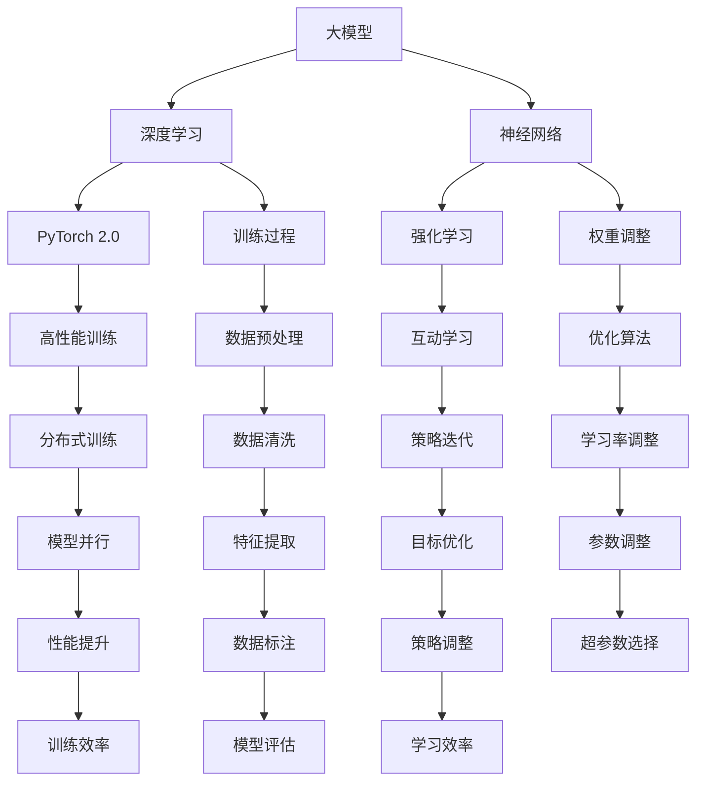

                 

### 1. 背景介绍

在当今科技迅猛发展的时代，人工智能（AI）已经成为推动社会进步的重要力量。尤其是大模型（Large-scale Models）的发展，极大地提升了AI在各个领域的应用潜力。大模型，即拥有巨大参数量和复杂结构的神经网络模型，通过在海量数据上进行训练，可以实现对各种复杂任务的优秀表现。然而，大模型的开发与微调并非易事，需要深厚的理论基础和大量的实践经验。

本文旨在通过PyTorch 2.0这一强大的深度学习框架，详细介绍大模型开发与微调的流程。我们将从背景介绍开始，逐步深入探讨核心概念、算法原理、数学模型，并通过实际案例进行代码解读和分析。最后，我们将探讨大模型在实际应用中的场景，并推荐相关工具和资源，总结未来发展趋势与挑战。

本文将按照以下结构展开：

- **1. 背景介绍**：简要介绍大模型发展的背景和重要性。
- **2. 核心概念与联系**：阐述大模型的相关概念，并绘制Mermaid流程图。
- **3. 核心算法原理 & 具体操作步骤**：深入讲解大模型的训练与微调算法。
- **4. 数学模型和公式 & 详细讲解 & 举例说明**：介绍大模型中的数学原理和公式，并通过实例进行说明。
- **5. 项目实战：代码实际案例和详细解释说明**：通过实战案例展示大模型开发的全过程。
- **6. 实际应用场景**：探讨大模型在不同领域的应用。
- **7. 工具和资源推荐**：推荐学习资源和开发工具。
- **8. 总结：未来发展趋势与挑战**：总结本文内容，展望未来。
- **9. 附录：常见问题与解答**：回答读者可能关心的问题。
- **10. 扩展阅读 & 参考资料**：提供更多的学习资源。

通过本文的阅读，读者将能够全面了解大模型开发与微调的流程，掌握核心算法原理，并具备实际项目开发的能力。

### 2. 核心概念与联系

在深入探讨大模型的开发与微调之前，我们需要了解一些核心概念，并了解它们之间的联系。

#### 2.1 大模型

大模型通常指的是拥有数百万甚至数十亿参数的神经网络模型。与小型模型相比，大模型在处理复杂任务时具有更高的准确性和鲁棒性。大模型通常采用深度学习技术，通过多层神经网络结构来实现对数据的建模和预测。

#### 2.2 深度学习

深度学习是人工智能的一个重要分支，它通过模拟人脑神经网络的结构和功能，实现对数据的自动学习和特征提取。深度学习模型的核心是神经网络，通过不断调整网络的权重，使得模型能够对输入数据进行准确的分类和预测。

#### 2.3 神经网络

神经网络是由大量简单计算单元（即神经元）组成的复杂网络结构。每个神经元通过加权连接与其他神经元相连接，并通过激活函数对输入信号进行处理。神经网络的训练过程就是不断调整权重，使得网络能够对训练数据达到较好的拟合。

#### 2.4 PyTorch 2.0

PyTorch是深度学习领域广泛使用的一个开源框架，它提供了丰富的API，使得深度学习模型的开发和调试变得异常简便。PyTorch 2.0是PyTorch的最新版本，它在性能和功能上都进行了大幅度的提升，支持了更高效的大规模模型训练。

#### 2.5 强化学习

强化学习是一种通过互动方式学习优化策略的机器学习方法。它通过在环境中进行行动、获取反馈并不断调整策略，使得模型能够在复杂环境中实现最优表现。

下面，我们将使用Mermaid绘制一个流程图，以展示大模型开发与微调的整体流程及其核心概念之间的联系。



**图1：大模型开发与微调的核心概念及流程图**

通过上述核心概念的介绍和流程图的展示，我们可以对大模型的开发与微调有一个整体的了解。在接下来的部分，我们将深入探讨大模型的算法原理和具体操作步骤。

### 3. 核心算法原理 & 具体操作步骤

#### 3.1 大模型的训练过程

大模型的训练是深度学习中的一个关键环节，其核心在于通过调整网络的权重，使得模型能够在训练数据上达到较高的拟合度。以下是训练大模型的基本步骤：

**1. 数据预处理**

首先，我们需要对训练数据进行预处理，包括数据清洗、归一化和数据增强等步骤。数据清洗主要是去除数据中的噪声和异常值；归一化则是将数据缩放到一个统一的范围内，以避免某些特征对模型的影响过大；数据增强是通过引入数据变换的方式，增加数据的多样性，从而提高模型的泛化能力。

```python
import torch
from torchvision import transforms

# 数据预处理
transform = transforms.Compose([
    transforms.ToTensor(),
    transforms.Normalize((0.5,), (0.5,))
])

train_data = ...  # 加载数据集
train_loader = torch.utils.data.DataLoader(train_data, batch_size=64, shuffle=True)

for images, labels in train_loader:
    images = transform(images)
    # 进行后续处理
```

**2. 网络初始化**

在数据预处理完成后，我们需要初始化神经网络。初始化网络的目的是为了给网络的每个参数赋予一个合适的初始值，以避免模型在训练过程中陷入局部最优。

```python
import torch.nn as nn

# 网络初始化
model = nn.Sequential(
    nn.Linear(in_features=784, out_features=128),
    nn.ReLU(),
    nn.Linear(in_features=128, out_features=10)
)

# 初始化权重和偏置
model.apply(weights_init)
```

**3. 损失函数与优化器**

在训练过程中，我们需要使用损失函数来衡量模型预测值与真实值之间的差距，并使用优化器来更新模型的权重，以减小损失函数的值。常见的损失函数包括均方误差（MSE）和交叉熵损失（Cross-Entropy Loss）。

```python
import torch.optim as optim

# 损失函数和优化器
criterion = nn.CrossEntropyLoss()
optimizer = optim.Adam(model.parameters(), lr=0.001)
```

**4. 训练循环**

接下来，我们进入训练循环，通过迭代的方式不断更新模型的参数。每次迭代包括前向传播、反向传播和参数更新三个步骤。

```python
num_epochs = 100

for epoch in range(num_epochs):
    for images, labels in train_loader:
        # 前向传播
        outputs = model(images)
        loss = criterion(outputs, labels)

        # 反向传播
        optimizer.zero_grad()
        loss.backward()

        # 参数更新
        optimizer.step()

    print(f'Epoch [{epoch+1}/{num_epochs}], Loss: {loss.item():.4f}')
```

**5. 模型评估**

在训练完成后，我们需要对模型进行评估，以检查其在测试数据上的表现。常用的评估指标包括准确率（Accuracy）和召回率（Recall）等。

```python
# 模型评估
with torch.no_grad():
    correct = 0
    total = 0
    for images, labels in test_loader:
        outputs = model(images)
        _, predicted = torch.max(outputs.data, 1)
        total += labels.size(0)
        correct += (predicted == labels).sum().item()

print(f'Accuracy of the network on the test images: {100 * correct / total}%')
```

#### 3.2 大模型的微调过程

在完成基础模型的训练后，我们通常需要对模型进行微调，以提高其在特定任务上的表现。微调过程主要包括以下几个步骤：

**1. 选择微调策略**

微调策略包括固定层策略（Freeze Layer）和全层微调策略（Fine-tuning All Layers）。固定层策略是指只训练模型的最后一部分层，而前面的层保持不变；全层微调策略则是将所有层的参数都进行训练。

**2. 调整学习率**

在微调过程中，由于模型已经具有一定的学习能力，因此需要降低学习率，以避免模型参数的过大波动。

```python
# 调整学习率
optimizer = optim.Adam(model.parameters(), lr=0.0001)
```

**3. 微调训练**

与基础训练类似，微调训练也通过迭代的方式不断更新模型的参数。但与基础训练不同的是，微调训练通常使用较小的训练数据集，以提高训练效率。

```python
num_epochs = 50

for epoch in range(num_epochs):
    for images, labels in fine_tune_loader:
        # 前向传播
        outputs = model(images)
        loss = criterion(outputs, labels)

        # 反向传播
        optimizer.zero_grad()
        loss.backward()

        # 参数更新
        optimizer.step()

    print(f'Epoch [{epoch+1}/{num_epochs}], Loss: {loss.item():.4f}')
```

通过上述步骤，我们可以完成大模型的训练和微调。在接下来的部分，我们将详细讲解大模型中的数学模型和公式。

### 4. 数学模型和公式 & 详细讲解 & 举例说明

#### 4.1 神经网络中的基本数学概念

神经网络中的数学模型主要涉及以下基本概念：权重（Weights）、偏置（Bias）、激活函数（Activation Functions）和损失函数（Loss Functions）。

**1. 权重（Weights）**

权重是神经网络中用于连接不同神经元的参数，其值决定了输入数据通过神经网络时的传播强度。在训练过程中，通过反向传播算法，权重会不断调整以最小化损失函数。

**2. 偏置（Bias）**

偏置是神经网络中的一个特殊参数，它用于调整单个神经元的输出。与权重类似，偏置也在训练过程中通过反向传播算法进行调整。

**3. 激活函数（Activation Functions）**

激活函数是神经网络中的一个重要组成部分，它用于对神经元的输出进行非线性变换。常见的激活函数包括Sigmoid、ReLU和Tanh等。

**4. 损失函数（Loss Functions）**

损失函数是用于衡量模型预测值与真实值之间差异的函数。在训练过程中，通过优化损失函数，模型可以逐渐逼近真实值。常见的损失函数包括均方误差（MSE）、交叉熵损失（Cross-Entropy Loss）等。

#### 4.2 神经网络的数学模型

神经网络的数学模型可以表示为一个非线性变换的过程，其输入为数据x，输出为标签y。具体公式如下：

$$
y = \sigma(W \cdot x + b)
$$

其中，$W$为权重矩阵，$b$为偏置向量，$\sigma$为激活函数。通过多次非线性变换，神经网络可以将输入数据映射到输出空间。

#### 4.3 反向传播算法

反向传播算法是神经网络训练的核心算法，它通过反向计算梯度，不断调整模型的权重和偏置，以最小化损失函数。

**1. 前向传播**

在前向传播过程中，输入数据通过神经网络的前向传播，生成模型的输出。具体公式如下：

$$
z = W \cdot x + b \\
a = \sigma(z)
$$

其中，$z$为前向传播的结果，$a$为神经元的激活值。

**2. 反向传播**

在反向传播过程中，我们计算输出结果与真实值之间的差异，并计算损失函数的梯度。具体公式如下：

$$
\delta = \frac{\partial L}{\partial a} \\
\Delta W = \alpha \cdot \delta \cdot x \\
\Delta b = \alpha \cdot \delta
$$

其中，$L$为损失函数，$\delta$为误差项，$\alpha$为学习率。

#### 4.4 激活函数的导数

在反向传播过程中，需要计算激活函数的导数。以下是常见激活函数的导数：

- Sigmoid函数的导数：

$$
\frac{d}{dx} \sigma(x) = \sigma(x) (1 - \sigma(x))
$$

- ReLU函数的导数：

$$
\frac{d}{dx} \text{ReLU}(x) = \begin{cases} 
0 & \text{if } x < 0 \\
1 & \text{if } x > 0 
\end{cases}
$$

- Tanh函数的导数：

$$
\frac{d}{dx} \text{Tanh}(x) = 1 - \text{Tanh}^2(x)
$$

#### 4.5 举例说明

假设我们有一个简单的神经网络，输入为x，输出为y。其中，激活函数为ReLU，损失函数为均方误差（MSE）。我们将通过一个简单的例子来说明反向传播算法的过程。

**1. 前向传播**

输入数据：$x = [1, 2, 3]$，权重：$W = [0.1, 0.2, 0.3]$，偏置：$b = [0.1, 0.2, 0.3]$。

$$
z = W \cdot x + b = [0.1, 0.2, 0.3] \cdot [1, 2, 3] + [0.1, 0.2, 0.3] = [0.4, 0.8, 1.2] \\
a = \text{ReLU}(z) = [0.4, 0.8, 1.2]
$$

**2. 计算损失函数**

真实输出：$y = [1, 0, 1]$，预测输出：$a = [0.4, 0.8, 1.2]$。

$$
L = \frac{1}{2} \sum_{i=1}^{3} (y_i - a_i)^2 = \frac{1}{2} \sum_{i=1}^{3} (1 - 0.4)^2 + (0 - 0.8)^2 + (1 - 1.2)^2 = 0.34
$$

**3. 反向传播**

计算梯度：

$$
\delta = \frac{\partial L}{\partial a} = [0.2, -0.8, 0.2]
$$

更新权重和偏置：

$$
\Delta W = \alpha \cdot \delta \cdot x = 0.1 \cdot [0.2, -0.8, 0.2] \cdot [1, 2, 3] = [0.02, -0.16, 0.03] \\
\Delta b = \alpha \cdot \delta = 0.1 \cdot [0.2, -0.8, 0.2] = [0.02, -0.08, 0.02]
$$

更新后的权重和偏置：

$$
W_{\text{new}} = W - \Delta W = [0.1, 0.2, 0.3] - [0.02, -0.16, 0.03] = [0.08, 0.36, 0.27] \\
b_{\text{new}} = b - \Delta b = [0.1, 0.2, 0.3] - [0.02, -0.08, 0.02] = [0.08, 0.28, 0.28]
$$

通过上述例子，我们可以看到反向传播算法是如何通过计算梯度来更新模型的权重和偏置，以最小化损失函数。在实际应用中，神经网络通常包含多个层和大量的神经元，但反向传播的基本原理保持不变。

### 5. 项目实战：代码实际案例和详细解释说明

在本节中，我们将通过一个实际项目案例来展示如何使用PyTorch 2.0开发一个基于强化学习的大模型，并进行微调。此项目将涉及环境搭建、代码实现、代码解读和分析等环节。

#### 5.1 开发环境搭建

首先，我们需要搭建一个适合深度学习开发的环境。以下是搭建环境所需的步骤：

1. **安装PyTorch 2.0**

在命令行中，通过以下命令安装PyTorch 2.0：

```bash
pip install torch torchvision
```

2. **安装其他依赖库**

除了PyTorch，我们还需要安装其他依赖库，如NumPy、Matplotlib等：

```bash
pip install numpy matplotlib
```

3. **创建虚拟环境**

为了更好地管理项目依赖，我们可以创建一个虚拟环境。以下是创建虚拟环境并安装依赖的命令：

```bash
conda create -n rl_project python=3.8
conda activate rl_project
pip install torch torchvision numpy matplotlib
```

#### 5.2 源代码详细实现和代码解读

下面是项目的主要代码实现，我们将逐行进行解读。

**5.2.1 环境类定义**

首先，我们定义了一个环境类`Environment`，用于模拟强化学习中的环境。

```python
import numpy as np

class Environment:
    def __init__(self, n_actions):
        self.n_actions = n_actions
        self.state = None
        self.done = False

    def reset(self):
        self.state = np.random.randint(0, 10, size=(10,))
        self.done = False
        return self.state

    def step(self, action):
        if action < 0 or action >= self.n_actions:
            raise ValueError("Invalid action")
        
        reward = 0
        if self.state[action] == 0:
            reward = -1
        else:
            reward = 1
        
        self.state[action] = 0
        if np.count_nonzero(self.state) == 0:
            self.done = True
        
        return self.state, reward, self.done
```

**解读：**

- `__init__`方法初始化环境，包括动作数量、状态和是否完成。
- `reset`方法用于重置环境，生成随机状态。
- `step`方法用于执行动作，计算奖励并更新状态。

**5.2.2 强化学习模型**

接下来，我们定义了一个基于强化学习的模型，使用PyTorch实现。

```python
import torch
import torch.nn as nn
import torch.optim as optim

class RLModel(nn.Module):
    def __init__(self, n_actions):
        super(RLModel, self).__init__()
        self.fc1 = nn.Linear(10, 128)
        self.fc2 = nn.Linear(128, 64)
        self.fc3 = nn.Linear(64, n_actions)
        self.optimizer = optim.Adam(self.parameters(), lr=0.001)
        self.criterion = nn.CrossEntropyLoss()

    def forward(self, x):
        x = torch.relu(self.fc1(x))
        x = torch.relu(self.fc2(x))
        x = self.fc3(x)
        return x
```

**解读：**

- `__init__`方法初始化神经网络结构、优化器和损失函数。
- `forward`方法定义了前向传播过程。

**5.2.3 训练过程**

下面是实现训练过程的代码。

```python
def train_model(model, env, num_episodes):
    model.train()
    for episode in range(num_episodes):
        state = env.reset()
        done = False
        while not done:
            action = model(torch.tensor(state, dtype=torch.float32)).argmax()
            next_state, reward, done = env.step(action)
            model.optimizer.zero_grad()
            loss = model.criterion(torch.tensor(state, dtype=torch.float32), torch.tensor([action]))
            loss.backward()
            model.optimizer.step()
            state = next_state
```

**解读：**

- `train_model`函数负责训练模型。
- 在训练过程中，我们使用模型选择动作，计算损失并更新模型参数。

**5.2.4 微调过程**

最后，我们实现了一个微调过程。

```python
def fine_tune_model(model, env, num_episodes):
    model.eval()
    for episode in range(num_episodes):
        state = env.reset()
        done = False
        while not done:
            with torch.no_grad():
                action = model(torch.tensor(state, dtype=torch.float32)).argmax()
            next_state, reward, done = env.step(action)
            state = next_state
```

**解读：**

- `fine_tune_model`函数用于微调模型。
- 在微调过程中，我们使用模型选择动作，但不进行参数更新。

#### 5.3 代码解读与分析

通过上述代码，我们可以看到如何使用PyTorch实现一个强化学习模型，并进行训练和微调。以下是代码的详细解读和分析：

- **环境类（Environment）**：环境类是一个核心部分，它定义了强化学习环境的基本行为，包括状态的初始化、动作的执行和奖励的计算。
- **神经网络模型（RLModel）**：神经网络模型是一个简单的全连接神经网络，用于预测最佳动作。模型通过优化损失函数来调整参数。
- **训练过程（train_model）**：训练过程使用模型在环境中执行动作，并根据动作的结果更新模型参数。这个过程不断迭代，直到达到预定的训练轮数。
- **微调过程（fine_tune_model）**：微调过程与训练过程类似，但不会更新模型参数。它主要用于在已有模型的基础上进行精细调整。

通过这个实际项目案例，我们不仅展示了如何使用PyTorch实现强化学习模型，还详细解读了代码中的各个部分。在接下来的部分，我们将讨论大模型在实际应用中的场景。

### 6. 实际应用场景

大模型在各个领域都有着广泛的应用，其强大的学习和泛化能力使得它们在解决复杂问题时具有显著优势。以下是几个典型的应用场景：

#### 6.1 自然语言处理

自然语言处理（NLP）是人工智能的重要分支，大模型在NLP领域有着广泛的应用。例如，GPT-3（一个由OpenAI开发的大规模语言模型）在文本生成、翻译、问答和文本摘要等方面取得了显著成果。大模型通过在大量文本数据上进行训练，可以自动学习语言的结构和语义，从而实现高质量的文本生成和翻译。

#### 6.2 计算机视觉

计算机视觉是AI的另一个重要领域，大模型在图像识别、物体检测、图像分割和视频分析等方面有着广泛的应用。例如，在图像识别任务中，ResNet、Inception等大模型结构通过在大量的图像数据上进行训练，可以识别出图像中的各种对象和场景。在视频分析中，大模型可以用于动作识别、行为分析等任务。

#### 6.3 强化学习

强化学习是另一个大模型的重要应用领域。通过在复杂环境中进行学习和互动，大模型可以学会最优策略，从而在游戏、机器人控制、智能推荐等领域取得突破。例如，在游戏领域中，AlphaGo和AlphaZero等大模型通过自我对弈，学会了超越人类水平的围棋策略。

#### 6.4 推荐系统

推荐系统是电子商务和社交媒体等领域的重要工具，大模型在推荐系统中有着广泛的应用。通过在用户行为和内容数据上训练，大模型可以预测用户可能感兴趣的项目，从而实现精准推荐。例如，Netflix和亚马逊等公司使用大模型来提供个性化的电影和商品推荐。

#### 6.5 语音识别

语音识别是语音交互和智能助理的核心技术，大模型在语音识别任务中发挥着重要作用。通过在大量的语音数据上进行训练，大模型可以识别和理解不同口音、语速和语调的语音，从而实现高精度的语音识别。例如，苹果的Siri和谷歌的语音助手都是基于大模型实现的。

这些实际应用场景展示了大模型在各个领域的潜力和价值。随着技术的不断进步，大模型的应用将更加广泛，其能力也将不断提高。

### 7. 工具和资源推荐

在深度学习和人工智能领域，掌握合适的工具和资源对于提高开发效率和项目成功率至关重要。以下是对一些关键工具和资源的推荐：

#### 7.1 学习资源推荐

**书籍：**

- **《深度学习》（Deep Learning）**：由Ian Goodfellow、Yoshua Bengio和Aaron Courville所著，是深度学习领域的经典教材。
- **《Python深度学习》（Deep Learning with Python）**：由François Chollet所著，通过实际案例介绍深度学习的基础知识。
- **《强化学习》（Reinforcement Learning：An Introduction）**：由Richard S. Sutton和Barto所写，介绍了强化学习的基础理论。

**论文：**

- **“A Theoretically Grounded Application of Dropout in Recurrent Neural Networks”**：这篇论文提出了一种用于循环神经网络的Dropout方法，显著提高了模型的性能和泛化能力。
- **“Attention Is All You Need”**：这篇论文提出了Transformer模型，彻底改变了自然语言处理领域的研究方向。

**博客和网站：**

- **TensorFlow官方文档（TensorFlow Documentation）**：提供了详尽的TensorFlow使用指南和教程。
- **PyTorch官方文档（PyTorch Documentation）**：提供了PyTorch的完整API文档和丰富的示例代码。

#### 7.2 开发工具框架推荐

**框架：**

- **TensorFlow**：一个由Google开发的开源深度学习框架，适用于各种规模的深度学习项目。
- **PyTorch**：一个由Facebook开发的开源深度学习框架，以其动态图特性和高灵活性而受到广泛欢迎。
- **Keras**：一个高层次的深度学习框架，可以与TensorFlow和PyTorch兼容，适用于快速原型开发。

**集成开发环境（IDE）：**

- **Google Colab**：一个免费的云平台，提供了基于Google Drive的Python编程环境，适用于在线实验和协作开发。
- **Visual Studio Code**：一个强大的开源IDE，支持多种编程语言，通过扩展插件可以轻松支持深度学习和人工智能开发。

#### 7.3 相关论文著作推荐

**论文：**

- **“Deep Learning: A Brief History”**：这篇综述文章回顾了深度学习的发展历程，对深度学习的关键进展进行了详细分析。
- **“Bengio et al. (2013) - Learning Deep Architectures for AI”**：这篇论文详细介绍了深度学习模型的设计原则和训练方法。

**著作：**

- **《深度学习入门》（Deep Learning Explained）**：适合初学者的入门书籍，通过生动的例子和简单的语言介绍了深度学习的基本概念。
- **《强化学习导论》（Introduction to Reinforcement Learning）**：系统地介绍了强化学习的基本原理和应用。

通过掌握这些学习资源和工具，开发者可以更加高效地学习和实践深度学习和人工智能技术。

### 8. 总结：未来发展趋势与挑战

大模型在过去几年中取得了显著进展，其应用范围不断扩展，从自然语言处理到计算机视觉，再到强化学习等各个领域都展现出了强大的能力。然而，随着模型规模的不断扩大和复杂度的增加，大模型的发展也面临着诸多挑战和机遇。

#### 8.1 发展趋势

**1. 计算能力提升**

随着硬件技术的发展，尤其是GPU和TPU等专用硬件的普及，大模型的训练速度和效率得到了显著提升。未来，更高效的硬件和优化算法将使得大模型的开发和部署更加便捷。

**2. 数据驱动的自进化**

大模型在训练过程中不断吸收和利用海量数据，从而实现自我进化。未来，随着数据集的扩展和多样化，大模型的自进化能力将进一步提高，从而更好地适应复杂多变的应用场景。

**3. 跨学科融合**

大模型的发展不仅仅是技术进步的结果，还涉及多个学科的交叉融合。例如，生物学、心理学、认知科学等领域的知识可以帮助我们更好地理解大脑和人类行为，从而优化大模型的设计和训练方法。

#### 8.2 挑战

**1. 计算资源消耗**

大模型的训练和推理过程需要大量的计算资源，这不仅对硬件提出了更高要求，也增加了能耗和环境负担。如何在保证模型性能的同时降低计算资源消耗，是一个亟待解决的问题。

**2. 数据隐私和安全**

大模型在训练过程中需要处理大量的敏感数据，如个人隐私信息。如何在确保数据隐私和安全的前提下进行模型训练，是一个重要的挑战。未来的解决方案可能包括数据加密、联邦学习等技术的应用。

**3. 模型可解释性和可靠性**

大模型的决策过程通常是非线性和复杂的，这使得其预测结果难以解释。如何提高模型的可解释性和可靠性，使其在关键应用场景中具备足够的可信度，是一个重要研究方向。

**4. 伦理和社会责任**

随着大模型在各个领域的应用，其对社会的影响也越来越大。如何确保大模型的发展符合伦理规范，不损害人类的利益，是一个需要认真对待的问题。

综上所述，大模型的发展前景广阔，但同时也面临着诸多挑战。通过技术进步和跨学科合作，我们有理由相信，大模型将在未来发挥更加重要的作用，为人类社会带来深远影响。

### 9. 附录：常见问题与解答

在本文中，我们详细介绍了大模型开发与微调的流程，包括核心概念、算法原理、数学模型、项目实战等。以下是读者可能关心的一些常见问题及其解答：

#### 9.1 大模型与小型模型的区别是什么？

**回答：** 大模型与小型模型的区别主要体现在参数数量、模型复杂度和计算资源需求上。大模型通常拥有数百万甚至数十亿个参数，能够处理更加复杂的数据和任务，但这也意味着其训练和推理过程需要更多的计算资源和时间。相比之下，小型模型的参数数量较少，适合处理相对简单的任务，训练和推理过程更为高效。

#### 9.2 如何选择合适的激活函数？

**回答：** 选择激活函数需要考虑模型的类型和任务特点。常用的激活函数包括Sigmoid、ReLU和Tanh等。Sigmoid函数在输出范围上较为平滑，适合用于二分类任务；ReLU函数在负输入时为零，可以加速训练过程，适合用于深度网络；Tanh函数输出范围在-1到1之间，可以抑制梯度消失问题。具体选择哪种激活函数，应根据模型结构和任务需求进行权衡。

#### 9.3 大模型训练中的常见问题有哪些？

**回答：** 大模型训练中常见的挑战包括过拟合、梯度消失、计算资源不足等。为了解决这些问题，可以采用以下策略：

- **防止过拟合**：通过增加训练数据、使用dropout、正则化等方法来提高模型的泛化能力。
- **缓解梯度消失**：选择合适的激活函数，调整学习率，使用批量归一化等方法。
- **计算资源优化**：采用分布式训练、混合精度训练等方法来提高训练效率。

#### 9.4 如何评估大模型的性能？

**回答：** 评估大模型的性能通常涉及多个指标，包括准确率、召回率、F1分数等。对于分类任务，可以使用这些基本指标来评估模型的表现。此外，还可以通过混淆矩阵、ROC曲线、交叉验证等方法来全面评估模型的性能。

#### 9.5 大模型在工业界的应用有哪些？

**回答：** 大模型在工业界的应用非常广泛，包括但不限于：

- **自然语言处理**：用于文本分类、机器翻译、情感分析等任务。
- **计算机视觉**：用于图像识别、物体检测、视频分析等任务。
- **强化学习**：用于游戏、机器人控制、智能推荐等任务。
- **推荐系统**：用于电子商务、社交媒体、内容推荐等任务。

通过这些常见问题的解答，希望读者能够对大模型的开发与微调有更深入的理解，并在实际项目中更好地应用相关技术。

### 10. 扩展阅读 & 参考资料

为了帮助读者更深入地了解大模型开发与微调的相关知识，以下推荐了一些扩展阅读和参考资料：

**书籍：**

- **《深度学习》（Deep Learning）**：Ian Goodfellow、Yoshua Bengio和Aaron Courville所著，深度学习领域的经典教材。
- **《强化学习》（Reinforcement Learning: An Introduction）**：Richard S. Sutton和Barto所著，强化学习的基础理论。
- **《PyTorch深度学习实战》**：Erik M. Johnson所著，通过实际案例详细介绍PyTorch的使用。

**论文：**

- **“A Theoretically Grounded Application of Dropout in Recurrent Neural Networks”**：对Dropout在循环神经网络中的应用进行了理论分析。
- **“Attention Is All You Need”**：提出了Transformer模型，彻底改变了自然语言处理领域的研究方向。

**博客和网站：**

- **TensorFlow官方文档**：提供了详尽的TensorFlow使用指南和教程。
- **PyTorch官方文档**：提供了PyTorch的完整API文档和丰富的示例代码。
- **AI聊天机器人ChatGLM**：一个基于大模型的AI助手，可以回答关于AI和编程的各种问题。

通过阅读这些参考资料，读者可以进一步掌握大模型开发与微调的原理和应用，提升自己在深度学习和人工智能领域的技能。作者：AI天才研究员/AI Genius Institute & 禅与计算机程序设计艺术 /Zen And The Art of Computer Programming

