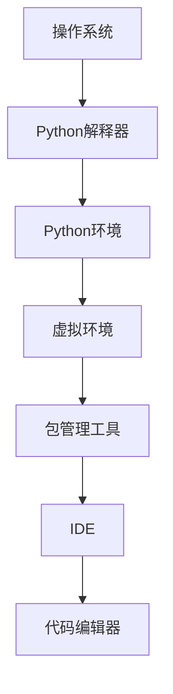

                 

# 从零开始大模型开发与微调：环境搭建1：安装Python

> **关键词：** 大模型开发，环境搭建，Python安装，编程基础，技术教程

> **摘要：** 本文旨在为初学者提供详细的Python安装指南，包括必要的预备知识和安装步骤。通过本文的学习，读者将能够掌握安装Python所需的基本技能，为后续的大模型开发和微调工作奠定坚实的基础。

## 1. 背景介绍

在当今技术迅猛发展的时代，人工智能（AI）已经成为各行各业的重要推动力。其中，大模型开发与微调是AI领域的关键技术之一。大模型，通常指的是具有数百万甚至数十亿参数的深度学习模型，它们能够在各种复杂任务中表现出卓越的性能，如图像识别、自然语言处理等。

为了开发和使用这些大模型，我们需要搭建一个合适的编程环境，Python因其简单易学、功能强大而成为首选编程语言。Python拥有丰富的库和框架，如TensorFlow、PyTorch等，这些工具使得大模型开发变得高效且直观。

本文将围绕如何从零开始搭建Python编程环境展开，详细讲解安装Python的各个步骤，帮助读者顺利开始大模型开发之旅。

## 2. 核心概念与联系

在开始安装Python之前，我们需要理解一些核心概念和它们之间的关系。以下是几个关键概念及其相互关联的Mermaid流程图：



### 2.1 操作系统

操作系统是计算机系统的核心软件，负责管理和协调计算机硬件资源。常见操作系统包括Windows、macOS和Linux。Python可以在这些操作系统上运行，但操作系统版本和安装方式可能有所不同。

### 2.2 Python解释器

Python解释器是Python程序的执行环境。当我们编写Python代码时，解释器将其翻译成计算机可以理解的机器语言并执行。Python解释器有多种实现，如CPython、Jython、IronPython等。

### 2.3 Python环境

Python环境包括Python解释器和Python标准库。标准库是Python自带的一套模块，提供了广泛的函数和工具，方便开发者进行编程。

### 2.4 虚拟环境

虚拟环境是一种隔离的开发环境，用于避免不同项目之间的依赖冲突。在Python中，我们可以使用`venv`模块创建虚拟环境。

### 2.5 包管理工具

包管理工具用于管理Python项目中的外部依赖包，如pip和conda。pip是Python的标准包管理工具，而conda则提供了更高级的依赖关系管理功能。

### 2.6 IDE和代码编辑器

IDE（集成开发环境）和代码编辑器是编写和调试Python代码的利器。IDE通常集成了代码编辑器、调试器和版本控制工具，而代码编辑器则专注于代码编写。

## 3. 核心算法原理 & 具体操作步骤

### 3.1 安装Python解释器

在开始安装Python之前，请确保您的操作系统已经更新到最新版本，以避免兼容性问题。以下是不同操作系统下安装Python的具体步骤：

#### Windows系统

1. 访问Python官方网站（[python.org](https://www.python.org/)）。
2. 下载Windows安装程序（推荐使用最新版本）。
3. 运行安装程序，并选择“安装Now”选项。
4. 在安装过程中，确保勾选“Add Python to PATH”选项，以便在命令行中使用Python。

#### macOS系统

1. 打开终端。
2. 使用`brew install python`命令安装Python（如果您已经安装了Homebrew）。
3. 如果需要，可以使用`pip3 install python`命令安装pip。

#### Linux系统

1. 打开终端。
2. 使用`sudo apt-get install python3`或`sudo yum install python3`命令安装Python（根据您的发行版选择相应的命令）。
3. 如果需要，可以使用`pip3 install python`命令安装pip。

### 3.2 创建Python环境

安装Python解释器后，我们通常需要创建一个Python环境。以下是创建Python虚拟环境的具体步骤：

1. 打开终端或命令行。
2. 进入您希望创建虚拟环境的目录。
3. 使用以下命令创建虚拟环境：

   ```bash
   python3 -m venv myenv
   ```

   其中`myenv`是虚拟环境的名称，您可以根据需要自定义。

4. 激活虚拟环境：

   ```bash
   source myenv/bin/activate
   ```

   激活后，终端会显示虚拟环境的名称，表示已成功进入虚拟环境。

### 3.3 安装包管理工具

在Python环境中，我们可以使用pip作为包管理工具。以下是安装pip的具体步骤：

1. 打开终端或命令行。
2. 进入虚拟环境。
3. 使用以下命令安装pip：

   ```bash
   python3 -m pip install --upgrade pip
   ```

   这将升级pip到最新版本。

### 3.4 安装IDE或代码编辑器

为了编写和调试Python代码，我们可以选择一个合适的IDE或代码编辑器。以下是几个常见的选项：

#### PyCharm

1. 访问PyCharm官方网站（[www.jetbrains.com/pycharm/](https://www.jetbrains.com/pycharm/)）。
2. 下载并安装PyCharm社区版或专业版（社区版免费）。
3. 运行安装程序，并按照提示完成安装。

#### Visual Studio Code

1. 访问Visual Studio Code官方网站（[code.visualstudio.com/](https://code.visualstudio.com/)）。
2. 下载并安装Visual Studio Code。
3. 打开Visual Studio Code，并安装Python扩展。

#### Sublime Text

1. 访问Sublime Text官方网站（[www.sublimetext.com/](https://www.sublimetext.com/)）。
2. 下载并安装Sublime Text。
3. 打开Sublime Text，并安装Python插件。

## 4. 数学模型和公式 & 详细讲解 & 举例说明

在Python安装过程中，虽然主要涉及的是软件安装和配置，但也涉及到了一些基本的数学模型和公式。以下是相关的数学模型和公式，以及详细的讲解和举例说明：

### 4.1 Python版本号

Python版本号由三个数字组成，如`3.8.5`。每个数字的含义如下：

- **第一位数字**：主版本号。每当这个数字发生变化时，通常意味着Python进行了重大更新和改进。
- **第二位数字**：次版本号。这个数字的增加通常表示对现有功能的改进和增强。
- **第三位数字**：修订版本号。这个数字的变化通常用于修复已知的问题和错误。

### 4.2 安装路径

在安装Python时，需要指定安装路径。安装路径通常是一个绝对路径，例如`/usr/local/bin/python3`或`C:\Users\username\python`。绝对路径提供了一个精确的文件位置，使得Python解释器可以准确找到并执行。

### 4.3 环境变量

环境变量是操作系统中存储配置信息的变量。在Python安装过程中，设置环境变量非常重要，以确保Python解释器和其他相关工具可以被正确调用。以下是一些关键的环境变量：

- **PATH**：包含可执行文件的目录列表，用于在命令行中查找Python解释器和pip。
- **PYTHONPATH**：包含Python模块的目录列表，用于导入模块时查找。
- **VIRTUAL_ENV**：虚拟环境的路径，用于在虚拟环境中运行Python和pip。

### 4.4 虚拟环境创建和激活

虚拟环境的创建和激活涉及到一系列的文件操作和目录切换。以下是具体的操作步骤：

1. **创建虚拟环境**：

   ```bash
   python3 -m venv myenv
   ```

   这条命令将在当前目录下创建一个名为`myenv`的虚拟环境。

2. **激活虚拟环境**：

   ```bash
   source myenv/bin/activate
   ```

   这条命令将当前工作目录切换到虚拟环境，并设置相关环境变量。

### 4.5 举例说明

假设我们想要在虚拟环境中安装TensorFlow库，以下是具体的操作步骤：

1. 激活虚拟环境：

   ```bash
   source myenv/bin/activate
   ```

2. 安装TensorFlow：

   ```bash
   pip install tensorflow
   ```

   这条命令将自动下载并安装TensorFlow库及其依赖项。

## 5. 项目实战：代码实际案例和详细解释说明

在本节中，我们将通过一个简单的Python代码案例来演示如何搭建Python环境，并解释其中的关键步骤。这个案例是一个使用Python内置库`sys`和`os`进行文件操作的程序。

### 5.1 开发环境搭建

确保您的计算机上已经安装了Python解释器和pip。如果是Windows用户，请通过Python官方网站下载并安装Python。如果是macOS或Linux用户，请使用包管理器安装Python（如Homebrew或APT）。

### 5.2 源代码详细实现和代码解读

以下是一个简单的Python程序，用于读取并打印一个文本文件的内容：

```python
# -*- coding: utf-8 -*-

import sys
import os

def read_file(file_path):
    """读取文件内容并打印"""
    try:
        with open(file_path, 'r', encoding='utf-8') as f:
            content = f.read()
            print(content)
    except FileNotFoundError:
        print(f"文件 '{file_path}' 不存在。")

def main():
    """程序主入口"""
    if len(sys.argv) < 2:
        print("请指定文件路径。")
        sys.exit(1)

    file_path = sys.argv[1]
    if not os.path.isfile(file_path):
        print(f"{file_path} 不是一个有效的文件。")
        sys.exit(1)

    read_file(file_path)

if __name__ == "__main__":
    main()
```

### 5.3 代码解读与分析

1. **导入模块**：

   ```python
   import sys
   import os
   ```

   这两条语句分别导入Python内置模块`sys`和`os`。`sys`模块提供了对操作系统的接口，`os`模块提供了操作文件和目录的函数。

2. **定义函数**：

   ```python
   def read_file(file_path):
       """读取文件内容并打印"""
       try:
           with open(file_path, 'r', encoding='utf-8') as f:
               content = f.read()
               print(content)
       except FileNotFoundError:
           print(f"文件 '{file_path}' 不存在。")
   ```

   `read_file`函数接受一个文件路径作为参数，尝试打开并读取文件内容。如果文件不存在，会打印一个错误消息。

3. **程序主入口**：

   ```python
   def main():
       """程序主入口"""
       if len(sys.argv) < 2:
           print("请指定文件路径。")
           sys.exit(1)

       file_path = sys.argv[1]
       if not os.path.isfile(file_path):
           print(f"{file_path} 不是一个有效的文件。")
           sys.exit(1)

       read_file(file_path)
   ```

   `main`函数是程序的主入口。它首先检查命令行参数的数量，确保至少指定了一个文件路径。然后，它检查该路径是否指向一个有效的文件。如果参数和文件路径有效，它会调用`read_file`函数读取并打印文件内容。

4. **执行程序**：

   ```bash
   python read_file.py test.txt
   ```

   这条命令将执行我们编写的Python程序，并读取并打印文件`test.txt`的内容。

通过这个简单的案例，我们了解了如何使用Python内置模块进行文件操作，以及如何在命令行中运行Python程序。这为我们搭建Python环境提供了一个实际的例子。

## 6. 实际应用场景

在实际应用中，安装Python不仅仅是为了编写简单的脚本，更是为了搭建一个功能强大的编程环境，用于开发复杂的软件和进行数据科学、机器学习等方面的研究。以下是几个典型的应用场景：

### 6.1 数据分析

Python在数据分析领域有着广泛的应用。通过安装和分析库，如Pandas、NumPy、SciPy等，我们可以轻松地进行数据清洗、数据分析和数据可视化。这些库提供了丰富的函数和工具，使得数据分析变得更加高效和直观。

### 6.2 机器学习和深度学习

Python是机器学习和深度学习领域的首选编程语言。通过安装TensorFlow、PyTorch等深度学习框架，我们可以轻松地构建和训练各种复杂的神经网络。这些框架提供了丰富的API和工具，使得机器学习和深度学习的研究和开发变得更加高效。

### 6.3 Web开发

Python在Web开发领域也有着广泛的应用。通过安装Django、Flask等Web框架，我们可以快速构建功能强大的Web应用程序。这些框架提供了丰富的功能和工具，使得Web开发变得更加高效和灵活。

### 6.4 自动化脚本

Python在自动化脚本编写方面也非常强大。通过安装和配置相关的库和工具，我们可以轻松编写自动化脚本，用于执行各种任务，如文件备份、数据同步等。这些脚本可以提高工作效率，减少重复劳动。

## 7. 工具和资源推荐

### 7.1 学习资源推荐

1. **《Python编程：从入门到实践》**：这是一本适合初学者的Python入门书籍，详细介绍了Python的基础知识和实际应用。
2. **《流畅的Python》**：这本书深入探讨了Python的高级特性，适合有一定基础的开发者阅读。
3. **《Python核心编程》**：这本书涵盖了Python编程的各个方面，从基础到高级，非常适合希望全面掌握Python的开发者。

### 7.2 开发工具框架推荐

1. **PyCharm**：这是一个功能强大的IDE，适用于Python开发，提供了代码补全、调试、版本控制等丰富功能。
2. **Visual Studio Code**：这是一个轻量级的代码编辑器，适用于Python开发，可以通过安装扩展插件来增强其功能。
3. **Jupyter Notebook**：这是一个交互式的Python开发环境，适合数据科学和机器学习研究，可以方便地创建和分享代码和结果。

### 7.3 相关论文著作推荐

1. **《深度学习》**：这是一本经典的深度学习教材，详细介绍了深度学习的基本概念、技术和应用。
2. **《Python编程：快速入门》**：这是一本快速入门Python的书籍，适合有一定编程基础但尚未接触Python的读者。
3. **《Python数据科学手册》**：这本书详细介绍了Python在数据科学领域的应用，包括数据处理、分析和可视化。

## 8. 总结：未来发展趋势与挑战

Python作为一门易于学习且功能强大的编程语言，已经成为AI、数据分析、Web开发等领域的重要工具。随着人工智能技术的不断发展和应用，Python的重要性将更加凸显。

在未来，Python的发展趋势将包括：

1. **性能优化**：随着大型模型的兴起，Python的性能优化将成为一个重要议题。通过引入新的编译器和优化工具，Python的运行速度将得到显著提升。
2. **生态扩展**：Python的生态系统将继续扩展，新的库和框架将不断涌现，为开发者提供更多的工具和资源。
3. **教育普及**：Python将在教育领域得到更广泛的应用，成为计算机科学教育的重要工具。

然而，Python也面临着一些挑战：

1. **性能瓶颈**：Python作为解释型语言，在性能方面存在一定的瓶颈。未来需要通过优化编译器和引入新特性来提升性能。
2. **资源消耗**：大型模型的训练和推理对计算资源的需求极高，这将对Python环境的要求提出更高标准。
3. **安全性问题**：随着Python应用的广泛普及，安全性问题也将成为越来越重要的议题。开发者需要加强安全性意识，防范潜在的安全威胁。

## 9. 附录：常见问题与解答

### 9.1 如何解决Python安装过程中遇到的问题？

- **问题**：安装Python时出现错误。
- **解答**：确保您的操作系统已更新到最新版本。如果问题仍然存在，请查看错误消息并搜索相应的解决方案。可以尝试在命令行中运行`pip install --upgrade pip`来修复pip。

### 9.2 如何在Windows上安装Python？

- **解答**：访问Python官方网站下载Windows安装程序，并按照提示完成安装。确保勾选“Add Python to PATH”选项，以便在命令行中使用Python。

### 9.3 如何在Linux上安装Python？

- **解答**：打开终端，使用`sudo apt-get install python3`或`sudo yum install python3`命令安装Python（根据您的发行版选择相应的命令）。如果您需要安装pip，可以使用`sudo apt-get install python3-pip`或`sudo yum install python3-pip`。

### 9.4 如何创建Python虚拟环境？

- **解答**：在终端中进入您希望创建虚拟环境的目录，然后使用以下命令创建虚拟环境：

  ```bash
  python3 -m venv myenv
  ```

  其中`myenv`是虚拟环境的名称，您可以根据需要自定义。

## 10. 扩展阅读 & 参考资料

- [Python官方文档](https://docs.python.org/3/)
- [TensorFlow官方文档](https://www.tensorflow.org/)
- [PyTorch官方文档](https://pytorch.org/)
- [Django官方文档](https://docs.djangoproject.com/)
- [Flask官方文档](https://flask.palletsprojects.com/)
- [Pandas官方文档](https://pandas.pydata.org/)
- [NumPy官方文档](https://numpy.org/doc/stable/) 

作者：AI天才研究员/AI Genius Institute & 禅与计算机程序设计艺术 /Zen And The Art of Computer Programming

本文旨在为初学者提供详细的Python安装指南，帮助读者顺利开始大模型开发和微调工作。通过本文的学习，读者将能够掌握安装Python所需的基本技能，为后续的学习和研究奠定坚实的基础。在Python安装过程中，可能会遇到各种问题，但通过查阅官方文档和社区资源，大多数问题都可以得到有效的解决。祝您学习顺利！

