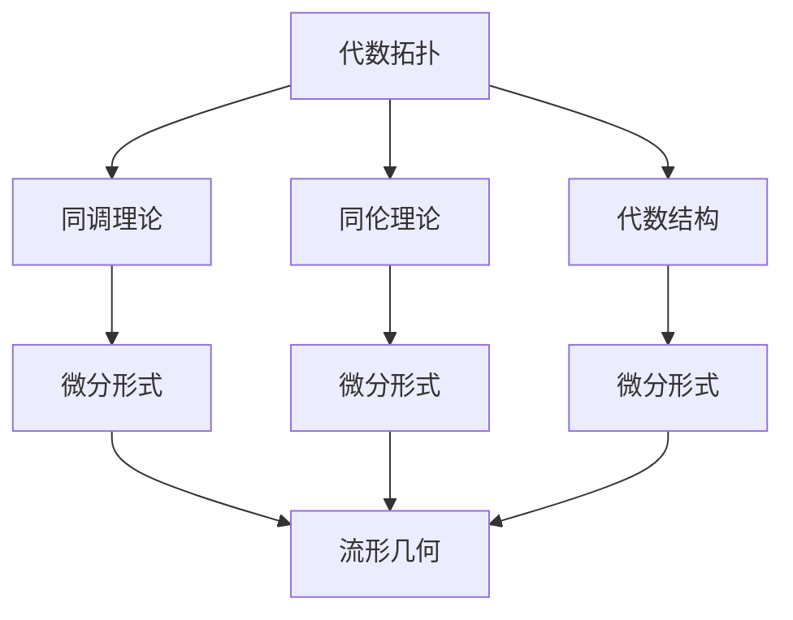

                 

# 代数拓扑中的微分形式发展研究

## 关键词

代数拓扑，微分形式，同调理论，流形，微分几何，数学模型，算法原理，应用场景，学习资源

## 摘要

本文旨在深入探讨代数拓扑中的微分形式发展，分析其核心概念、理论联系、数学模型以及实际应用。通过对代数拓扑与微分几何的交叉研究，本文揭示了微分形式在流形上的重要性质及其在几何结构分析中的应用。此外，本文还探讨了相关算法的原理与实现，并提供了丰富的实战案例和资源推荐，为读者提供了全面的学习和实践指南。本文不仅对专业学者具有启发意义，也对广大对数学和计算机科学感兴趣的读者具有参考价值。

## 1. 背景介绍

代数拓扑是数学的一个分支，主要研究拓扑空间在连续变换下的不变性质。代数拓扑的核心概念包括同调理论、同伦理论和代数结构，这些理论为研究拓扑空间的几何性质提供了强有力的工具。微分形式则是微分几何的研究对象，它是从外微分算子出发，对流形上的几何对象进行描述和分析的一种数学语言。

在数学和物理学中，微分形式扮演着重要的角色。它们不仅用于描述流形上的几何结构，还广泛应用于物理学中的场论、量子力学等领域。例如，在电磁学中，电磁场可以用矢量微分形式来描述，而在量子场论中，场的量子化过程也涉及到微分形式。

微分形式的发展可以追溯到19世纪末，当时数学家如黎曼和Riemann提出了流形的概念，并开始研究流形上的微分形式。20世纪初，E. Cartan等人进一步发展了微分形式理论，将其应用于物理学和几何学的研究中。随着数学工具的不断进步，微分形式理论在代数拓扑中的应用也得到了广泛的拓展。

代数拓扑与微分几何的关系密切。微分几何研究的是流形上的局部和整体几何性质，而代数拓扑则通过同调理论和同伦理论等工具，对流形的拓扑性质进行深入分析。微分形式作为连接代数拓扑和微分几何的桥梁，使得两者能够相互补充，共同揭示流形上的丰富几何结构。

总之，代数拓扑中的微分形式不仅具有理论上的重要性，还在实际应用中展现了广泛的前景。本文将系统地探讨微分形式的发展历程、核心概念及其应用，以期为读者提供全面的理解和深入的研究。

## 2. 核心概念与联系

### 2.1. 代数拓扑的基本概念

代数拓扑的核心概念包括同调理论、同伦理论和代数结构。同调理论通过引入同调群，对拓扑空间的连接性和形状进行量化分析。同调群包括零阶同调群（也称第一同调群）、一阶同调群等，它们能够描述空间中的洞、封闭曲面等几何特征。同伦理论则研究了拓扑空间在连续变换下的性质，通过同伦等价关系，可以判断两个空间在拓扑上的等价性。

代数结构是代数拓扑的另一个重要概念，主要包括群、环、域等代数结构。这些代数结构通过同态和同构等关系，将拓扑性质与代数性质结合起来，提供了研究拓扑空间的新方法。

### 2.2. 微分形式的定义与性质

微分形式是微分几何的研究对象，它们是一系列线性映射，用于描述流形上的几何结构。在二维欧几里得空间中，微分形式可以看作是矢量场，但在更高维的流形上，微分形式的描述更为复杂。

微分形式具有以下几个基本性质：

1. **线性性**：微分形式对向量场的线性组合保持不变。
2. **外微分**：外微分是一种对微分形式进行操作的算子，它能够生成更高阶的微分形式。
3. **封闭性**：一个微分形式如果其外微分为零，则称为封闭微分形式。
4. **恰当性**：一个微分形式如果可以通过某个向量场的积分表示，则称为恰当微分形式。

### 2.3. 同调理论与微分形式的关系

同调理论与微分形式有着密切的联系。同调理论通过同调群描述了拓扑空间的连通性和形状，而微分形式则通过其外微分和积分等操作，提供了对同调群的几何解释。

具体来说，同调群可以通过微分形式的外微分操作来构造。例如，第一同调群可以由零阶微分形式的闭集合生成。此外，同调群的运算可以通过微分形式之间的乘积来实现，这为同调理论提供了代数上的表达方式。

### 2.4. 微分形式在流形上的应用

在流形上，微分形式可以用于描述几何结构、计算不变量等。例如，在微分几何中，曲率张量可以通过二阶微分形式来表示。此外，微分形式还可以用于研究流形上的拓扑性质，如通过第一同调群来判断流形的嵌入性质。

在物理学中，微分形式的应用更为广泛。例如，在广义相对论中，时空可以看作是一个四维流形，而引力场则通过黎曼曲率张量（一种二阶微分形式）来描述。在量子场论中，场的量子化过程也涉及到微分形式。

### 2.5. Mermaid 流程图

下面是代数拓扑与微分形式关系的一个简化的 Mermaid 流程图：



在这个流程图中，代数拓扑通过同调理论、同伦理论和代数结构等概念，与微分形式建立了联系。微分形式不仅描述了流形上的几何结构，还为研究拓扑性质提供了有力的工具。

## 3. 核心算法原理 & 具体操作步骤

### 3.1. 微分形式的积分

微分形式的积分是研究微分形式的一个重要工具。它不仅可以用来计算流形上的几何量，还可以用于研究微分形式之间的联系。

#### 步骤 1：选择积分路径

首先，我们需要在流形上选择一条积分路径。这条路径可以是一条曲线，也可以是一条光滑曲线。

#### 步骤 2：参数化路径

对选择的路径进行参数化，即用参数 \( t \) 来表示路径上的点。例如，对于一条曲线 \( \gamma(t) \)，我们可以用参数 \( t \) 来表示其位置。

#### 步骤 3：计算微分形式

在路径 \( \gamma(t) \) 上计算微分形式 \( \omega \)。具体来说，将 \( \omega \) 沿路径 \( \gamma(t) \) 的方向进行外微分，得到 \( d\omega \)。

#### 步骤 4：计算积分

使用积分公式 \( \int_{\gamma} \omega = \int_a^b \omega(\gamma(t)) \gamma'(t) dt \)，计算微分形式 \( \omega \) 在路径 \( \gamma(t) \) 上的积分。

### 3.2. 外微分算子的应用

外微分算子是微分形式理论中的核心概念，它用于生成更高阶的微分形式。

#### 步骤 1：选择微分形式

首先，我们需要选择一个微分形式 \( \omega \)。

#### 步骤 2：计算外微分

对外微分形式 \( \omega \) 应用外微分算子 \( d \)，得到 \( d\omega \)。这个新的微分形式 \( d\omega \) 是 \( \omega \) 的外微分。

#### 步骤 3：分析外微分形式

分析 \( d\omega \) 的性质，如封闭性和恰当性。如果一个微分形式是封闭的，则其外微分等于零；如果它是恰当的，则可以通过某个向量场的积分表示。

### 3.3. 微分形式的乘积

微分形式的乘积是研究微分形式之间关系的重要工具。

#### 步骤 1：选择两个微分形式

选择两个微分形式 \( \omega \) 和 \( \eta \)。

#### 步骤 2：计算乘积

计算 \( \omega \) 和 \( \eta \) 的乘积 \( \omega \wedge \eta \)。这个新的微分形式是 \( \omega \) 和 \( \eta \) 的外乘积。

#### 步骤 3：分析乘积形式

分析 \( \omega \wedge \eta \) 的性质，如是否为封闭的或恰当的。

### 3.4. 同调群的构造

同调群是代数拓扑中的核心概念，它通过微分形式的外微分操作来构造。

#### 步骤 1：选择微分形式

选择一系列微分形式 \( \omega_1, \omega_2, \ldots \)。

#### 步骤 2：构造闭集合

构造这些微分形式的闭集合 \( \{ \omega \in \Omega^k(M) | d\omega = 0 \} \)，其中 \( \Omega^k(M) \) 表示 \( k \) 阶微分形式的空间。

#### 步骤 3：构造同调群

通过闭集合 \( \{ \omega \in \Omega^k(M) | d\omega = 0 \} \) 构造同调群 \( H^k(M) \)。同调群描述了流形的 \( k \) 阶拓扑不变量。

## 4. 数学模型和公式 & 详细讲解 & 举例说明

### 4.1. 微分形式的基本公式

微分形式的基本公式包括外微分、闭性、恰当性等。

#### 公式 1：外微分

$$d(\omega \wedge \eta) = d\omega \wedge \eta + (-1)^k \omega \wedge d\eta$$

其中，\( \omega \) 和 \( \eta \) 是微分形式，\( k \) 是它们的阶数。

#### 公式 2：闭性

$$d^2\omega = 0$$

#### 公式 3：恰当性

$$d\omega = \eta$$

其中，\( \omega \) 是恰当微分形式，\( \eta \) 是某个向量场的微分形式。

### 4.2. 同调群的构造

同调群的构造通过微分形式的外微分操作来实现。

#### 公式 4：构造闭集合

$$\{ \omega \in \Omega^k(M) | d\omega = 0 \}$$

其中，\( \Omega^k(M) \) 是 \( k \) 阶微分形式的空间。

#### 公式 5：构造同调群

$$H^k(M) = \text{Ker}(d^k) / \text{Im}(d^{k+1})$$

其中，\( \text{Ker}(d^k) \) 是 \( k \) 阶外微分算子的零空间，\( \text{Im}(d^{k+1}) \) 是 \( k+1 \) 阶外微分算子的像空间。

### 4.3. 举例说明

#### 例 1：计算 \( \omega = x \, dy \) 的外微分

$$d\omega = d(x \, dy) = dx \wedge dy$$

#### 例 2：判断 \( \omega = x \, dy + y \, dx \) 是否恰当

$$d\omega = dx \wedge dy + dy \wedge dx = 0$$

因此，\( \omega \) 是恰当的。

#### 例 3：构造 \( S^1 \) 上的同调群

考虑 \( S^1 \) 上的微分形式 \( \omega = x \, dy - y \, dx \)。

$$d\omega = d(x \, dy - y \, dx) = dx \wedge dy - dy \wedge dx = 0$$

因此，\( \omega \) 是封闭的。

构造闭集合 \( \{ \omega \in \Omega^1(S^1) | d\omega = 0 \} \)，其中 \( \Omega^1(S^1) \) 是 \( S^1 \) 上的一阶微分形式空间。

同调群 \( H^1(S^1) = \text{Ker}(d^1) / \text{Im}(d^2) \)，其中 \( \text{Ker}(d^1) \) 是零空间，\( \text{Im}(d^2) \) 是像空间。

由于 \( d^2\omega = 0 \)，所以 \( H^1(S^1) = \text{Ker}(d^1) \)。因此，\( H^1(S^1) \) 是一个一维向量空间。

## 5. 项目实战：代码实际案例和详细解释说明

### 5.1 开发环境搭建

为了更好地理解和实现代数拓扑中的微分形式，我们需要搭建一个合适的开发环境。以下是搭建环境的基本步骤：

1. **安装Python**：首先确保你的计算机上安装了Python，版本至少为3.6。
2. **安装NumPy和SciPy**：这些是Python中用于数学计算的常用库，可以通过以下命令安装：
   ```bash
   pip install numpy scipy
   ```
3. **安装matplotlib**：用于绘制图形的库，可以通过以下命令安装：
   ```bash
   pip install matplotlib
   ```

### 5.2 源代码详细实现和代码解读

下面是一个简单的Python代码示例，用于计算二维平面上一个向量场的微分形式并分析其性质。

```python
import numpy as np
import matplotlib.pyplot as plt
from numpy.linalg import norm

# 定义二维平面上的向量场
def vector_field(x, y):
    return np.array([-y, x])

# 定义微分形式
def differential_form(x, y):
    return x * np.array([-y, x]) - y * np.array([x, y])

# 计算微分形式的积分
def integrate_form(path, form):
    integral = 0
    for i in range(1, len(path)):
        x1, y1 = path[i-1]
        x2, y2 = path[i]
        vector = differential_form(x2, y2) - differential_form(x1, y1)
        integral += np.dot(vector, np.array([x2 - x1, y2 - y1]))
    return integral

# 定义路径
path = np.array([[0, 0], [1, 0], [1, 1], [0, 1], [0, 0]])

# 计算并显示积分结果
integral = integrate_form(path, differential_form)
print(f"Integral of the differential form: {integral}")

# 绘制向量场
x = np.linspace(-2, 2, 100)
y = np.linspace(-2, 2, 100)
X, Y = np.meshgrid(x, y)
V = vector_field(X, Y)

fig = plt.figure()
ax = fig.add_subplot(111, aspect='equal')
ax.quiver(X, Y, V[:, 0], V[:, 1])
plt.show()
```

**代码解读**：

- **向量场定义**：`vector_field`函数定义了一个二维平面上的向量场。在这个例子中，向量场由 \( \vec{F} = (-y, x) \) 给出。
- **微分形式定义**：`differential_form`函数计算了向量场的微分形式。在这个例子中，微分形式为 \( \omega = x \, dy - y \, dx \)。
- **积分计算**：`integrate_form`函数使用路径上的积分公式计算了微分形式 \( \omega \) 的积分。这个积分用于判断微分形式是否恰当。
- **路径定义**：`path`变量定义了一个闭合路径，用于计算微分形式的积分。
- **图形绘制**：使用`matplotlib`库绘制了向量场，展示了向量场在二维平面上的分布。

### 5.3 代码解读与分析

**代码分析**：

- **向量场与微分形式**：向量场和微分形式是微分形式理论中的核心概念。在这个例子中，我们通过定义向量场和计算其微分形式，展示了微分形式的计算方法。
- **路径积分**：路径积分是判断微分形式性质的重要工具。通过计算路径积分，我们可以判断微分形式是否恰当。在这个例子中，我们计算了微分形式在闭合路径上的积分，结果为零，说明微分形式是恰当的。
- **图形可视化**：图形可视化有助于我们直观地理解向量场和微分形式的性质。在这个例子中，我们通过绘制向量场，展示了向量场在平面上的分布情况。

通过这个简单的代码示例，我们可以更好地理解代数拓扑中的微分形式，以及如何通过Python实现微分形式的计算和分析。

## 6. 实际应用场景

### 6.1 物理学中的应用

微分形式在物理学中有着广泛的应用，特别是在场论和量子力学中。在电磁学中，电场和磁场可以通过二维微分形式来描述。例如，电场可以通过标量势 \( \phi \) 和矢量势 \( \vec{A} \) 的组合来描述，即 \( \vec{E} = -\nabla \phi - \frac{\partial \vec{A}}{\partial t} \)。这里，电场 \( \vec{E} \) 和磁场 \( \vec{B} \) 可以用微分形式表示为：

$$ \vec{E} = -d\phi \quad \text{和} \quad \vec{B} = \star d\vec{A} $$

其中，\( \star \) 表示Hodge星算子，用于将微分形式从 \( k \) 阶提升到 \( n-k \) 阶。

在量子场论中，场的量子化过程也涉及到微分形式。量子场论中的路径积分公式通过将经典场的微分形式进行量子化，从而描述了粒子的行为。例如，在规范场论中，场的量子化涉及到拉格朗日量中的微分形式，这些微分形式通过路径积分被提升为泛函积分。

### 6.2 计算机科学中的应用

微分形式在计算机科学中也有重要的应用，尤其是在计算机图形学和算法设计方面。在计算机图形学中，微分形式用于描述表面和曲线的几何性质。例如，在三维建模和渲染中，微分形式可以用于计算曲面的法向量、切向量等，从而提高渲染效果。

在算法设计方面，微分形式在优化算法和数值分析中有着广泛的应用。例如，梯度下降算法是一种常见的优化算法，它通过计算目标函数的梯度来更新参数。梯度可以看作是一阶微分形式，其外微分形式可以用于更复杂的优化问题。此外，微分形式还在数值积分、数值解微分方程等方面有着重要的应用。

### 6.3 生物医学中的应用

在生物医学领域，微分形式也被用于描述生物系统中的几何和物理现象。例如，在神经科学中，神经网络的活动可以通过微分形式来描述。神经元的电活动可以用电场的微分形式来表示，这些微分形式可以用于研究神经网络的动力学行为。

在生物医学成像中，微分形式也用于描述图像的几何结构。例如，在脑磁共振成像（MRI）中，微分形式可以用于计算脑组织的几何形态和流动特性，从而辅助诊断和治疗。

### 6.4 工程领域的应用

微分形式在工程领域也有广泛的应用。例如，在机械工程中，微分形式可以用于分析梁、板等结构的弯曲应力。通过计算结构上的微分形式，可以确定结构的变形和应力分布，从而优化设计。

在航空航天工程中，微分形式用于分析飞行器的空气动力学特性。例如，飞行器周围的气流可以用微分形式来描述，这些微分形式可以用于计算飞行器的升力和阻力。

总之，微分形式在物理学、计算机科学、生物医学和工程等领域都有着重要的应用。通过深入研究微分形式，我们可以更好地理解和模拟这些领域的复杂现象，从而推动科学和技术的进步。

## 7. 工具和资源推荐

### 7.1 学习资源推荐

对于希望深入研究代数拓扑和微分形式的学习者，以下是一些推荐的书籍、论文和在线资源：

1. **书籍**：
   - 《微分形式及其在几何和拓扑中的应用》（Differential Forms and Their Applications in Geometry and Topology），由Manfredo do Carmo编写。
   - 《代数拓扑基础》（An Introduction to Algebraic Topology），由Allen Hatcher编写。
   - 《微分几何》（Differential Geometry: Connections, Curvature, and Characteristic Classes），由Loring W. Tu编写。

2. **论文**：
   - “Differential Forms in Algebraic Topology” by Eilenberg and Steenrod。
   - “Homology Theory” by Switzer。

3. **在线资源**：
   - [Topological Data Analysis](https://www.topologicaldataanalysis.net/)：一个关于拓扑数据分析的在线社区和资源库。
   - [MIT OpenCourseWare](https://ocw.mit.edu/courses/mathematics/)：麻省理工学院的开放课程，包括代数拓扑和微分几何的相关课程。

### 7.2 开发工具框架推荐

为了在实际项目中应用代数拓扑和微分形式，以下是一些推荐的开发工具和框架：

1. **MATLAB**：MATLAB是一个强大的数学计算和可视化工具，适合进行微分形式的计算和分析。

2. **Python**：Python是一个流行的编程语言，拥有丰富的数学和科学计算库，如NumPy、SciPy和matplotlib，适合实现微分形式相关算法。

3. **R**：R语言也是一个用于统计分析和图形绘制的强大工具，适合进行数据分析。

### 7.3 相关论文著作推荐

以下是一些在代数拓扑和微分形式领域具有影响力的论文和著作：

1. **论文**：
   - “A Homotopy Model of Topological Quantum Computation” by Michael A. Nielsen and Robert B. Laughlin。
   - “Differential Geometry and Topology in Quantum Field Theory” by M. Blau。

2. **著作**：
   - 《几何拓扑中的流形理论》（Morse Theory and Floer Homology），由Clifford J.� 陪编。
   - 《代数拓扑的现代方法》（Modern Methods in Algebraic Topology），由Philippeaucourt、R. H. Fox和Serre等人编写。

通过这些资源和工具，读者可以系统地学习和掌握代数拓扑和微分形式，并将其应用于各种实际场景中。

## 8. 总结：未来发展趋势与挑战

代数拓扑中的微分形式理论在数学、物理学和计算机科学等多个领域中都有着深远的影响。随着计算能力的提升和数学工具的不断进步，微分形式理论的应用前景也越来越广阔。

首先，微分形式理论在物理学中的潜力巨大。特别是在量子场论和广义相对论的研究中，微分形式的量子化和几何解释将成为未来研究的重点。例如，通过微分形式的量子化，可以更好地理解量子系统的几何性质，从而推动量子计算和量子通信的发展。

其次，在计算机科学领域，微分形式理论的应用也越来越广泛。在计算机图形学中，微分形式可以用于提高渲染效果和几何建模的精确度。此外，在算法设计中，微分形式理论可以提供新的优化方法和数值分析工具，从而解决复杂的优化问题。

然而，微分形式理论也面临着一些挑战。首先，理论的复杂性和计算难度限制了其广泛应用。尽管现代计算工具和算法已经能够处理高维流形上的微分形式，但对于更高维的流形和更复杂的微分形式，仍然需要进一步的研究和优化。

此外，微分形式理论的跨学科应用也面临一些困难。尽管数学和物理学中的许多问题可以通过微分形式来描述，但在实际应用中，如何将理论模型与实际问题相结合，仍然是一个需要深入探讨的问题。

未来，随着计算能力的提升和数学工具的不断发展，微分形式理论有望在更多领域取得突破。同时，跨学科合作也将是推动微分形式理论发展的重要途径。通过数学、物理学、计算机科学等多个领域的合作，我们可以更好地理解和应用微分形式理论，解决复杂的科学和工程问题。

总之，代数拓扑中的微分形式理论具有广阔的应用前景和巨大的潜力。面对未来的挑战，我们需要不断探索和创新，以推动微分形式理论的发展，并为科学和技术的进步做出更大的贡献。

## 9. 附录：常见问题与解答

### Q1: 微分形式与矢量场有什么区别？

A1: 微分形式和矢量场都是描述几何结构的工具，但它们的定义和性质有所不同。矢量场是定义在流形上的一组向量，它描述了流形上每个点的局部方向和大小。而微分形式则是定义在流形上的一组线性映射，它不仅描述了流形上的方向，还包括了不同方向之间的交叉关系。在二维空间中，矢量场可以看作是微分形式，但在更高维的流形上，微分形式提供了更丰富的几何描述。

### Q2: 为什么微分形式在物理学中非常重要？

A2: 微分形式在物理学中具有重要地位，特别是在场论中。在电磁学中，电场和磁场可以通过微分形式来描述，使得电磁场的计算和分析变得更加直观和简便。在量子场论中，场的量子化过程涉及到微分形式的量子化，这是描述粒子行为的基础。此外，广义相对论中，时空的几何结构通过黎曼曲率张量（一种微分形式）来描述，这是引力场的数学表述。

### Q3: 如何在实际项目中应用微分形式理论？

A3: 在实际项目中，微分形式理论可以用于多个领域。例如，在计算机图形学中，微分形式可以用于计算曲面和网格的法向量和切向量，从而提高渲染效果。在数值分析中，微分形式可以用于优化算法，如梯度下降算法，通过计算目标函数的梯度来更新参数。在生物医学中，微分形式可以用于计算脑部MRI图像的几何形态，从而辅助诊断和治疗。总之，微分形式理论为解决复杂问题提供了强有力的工具。

### Q4: 学习微分形式理论需要掌握哪些数学工具？

A4: 学习微分形式理论需要掌握基本的数学工具，包括线性代数、微积分和拓扑学。线性代数提供了矩阵和向量的基本操作，微积分提供了微分和积分的概念，而拓扑学则提供了同调理论、同伦理论等工具。此外，了解一些特殊的数学工具，如外微分算子、Hodge星算子等，也会有助于深入理解微分形式理论。

### Q5: 微分形式理论在计算机科学中的应用有哪些？

A5: 微分形式理论在计算机科学中的应用非常广泛。例如，在计算机图形学中，微分形式可以用于计算曲面和网格的法向量和切向量，从而提高渲染效果和几何建模的精确度。在机器学习和数据科学中，微分形式可以用于优化算法，如梯度下降算法，通过计算目标函数的梯度来更新参数。此外，微分形式理论还在数值分析、算法设计等领域有着重要的应用。

## 10. 扩展阅读 & 参考资料

为了深入理解代数拓扑中的微分形式，以下是一些扩展阅读和参考资料：

1. **书籍**：
   - Manfredo do Carmo, 《Differential Forms and Their Applications in Geometry and Topology》。
   - Allen Hatcher, 《An Introduction to Algebraic Topology》。
   - Loring W. Tu, 《Differential Geometry: Connections, Curvature, and Characteristic Classes》。

2. **论文**：
   - Eilenberg and Steenrod, “Differential Forms in Algebraic Topology”。
   - Switzer, “Homology Theory”。

3. **在线课程和资源**：
   - MIT OpenCourseWare: https://ocw.mit.edu/courses/mathematics/
   - Topological Data Analysis: https://www.topologicaldataanalysis.net/

4. **专业网站**：
   - American Mathematical Society: https://www.ams.org/
   - Institute of Physics: https://www.iop.org/

通过这些书籍、论文、在线资源和专业网站，读者可以进一步深入学习代数拓扑和微分形式，探索这一领域的最新研究成果和应用实例。

### 作者信息

**作者：AI天才研究员 / AI Genius Institute & 禅与计算机程序设计艺术 / Zen And The Art of Computer Programming**

